# 【操作系统工程】精译【MIT 公开课 MIT6.S081】 - P6：Lecture 7 - Q&A for Labs 中文版Beta - MCATIN-麦可汀留学 - BV1rS4y1n7y1

好的，下午好，无论你在哪里，呃，大家能听到我快速检查声音以确保，是的，你很好，好的，好，谢谢。嗯，所以今天，呃，我们要谈谈，呃，我真的没有具体的议程，但基本上我们的计划是试着回答你可能有的问题。

上一个实验室或以前的实验室，所以我要采取的方法，呃，今天我将介绍员工的解决方案，嗯，尤其是我自己的解决方案，嗯，你知道，讨论他们，希望当我们通过您的员工解决方案时。

如果我不回答某个特定的问题或稍等一会儿，你可以跳进来，因为我把你问的所有问题，至少在今天上午十一点之前在底部的课堂讲稿中，我们会试着经历这一切，我将从页表应用程序开始。

因为大多数问题都是关于页表实验室的部分原因是六月，这是最难笑的，嗯，所以在深入技术之前，也许有几个评论，呃，这其中的一部分，呃，让我们来谈谈，呃，页表实验室一般，你知道，正如你可能观察到的那样，你知道。

实际上有几行代码，就解决方案而言，但不幸的是，你知道，难以揭穿，你知道的，有，一个原因是你知道当盒子出现的时候，你知道结果是非常极端的，就像在最坏的情况下，可能你们中的一些人观察到，在最坏的情况下。

通勤站，或XP六站，再也没有输出被打印了，就是这样，你知道这是你的工作来弄清楚，实际上哪里出了问题，呃，在最好的情况下，你知道你会有一种内核恐慌，但恐慌，你知道也许只是一个起点。

或者用来追踪问题的实际来源，你知道恐慌本身，可能跟别的事有关，所以内核中的不变量会被打破，但你知道早些时候在外面的某个地方，可能是在设置页表的时候，你知道你做错了什么最终导致了这种恐慌。

所以你必须追踪发生了什么，所以更少的代码行，难以调试的问题，当时的环境很恶劣，呃到桶里，呃，如果在内核调试中这样做，或，你知道内核编程，你知道的，使用编程环境或调试环境是，呃，更多是不可原谅的。

因为罗伯特在第一节课中提到，这是基本上做内核编程的困难部分之一，就是这样，你知道的，只是为了让你感觉好些，你知道的，只是对你来说很难，你知道这对你的员工来说很难，在帮助你方面，实际上，你知道的。

当我们做这些实验室的时候，然后我们做类似的问题，你知道我们可能在追踪虫子方面有更多的经验，但你知道他们只是他们确实需要时间，呃通过帮助你，你知道，它往往很难，我也是，因为有一些小的代码片段，有一个细节。

可能出了什么问题，他们正在想办法，实际上那个级别的细节是什么，呃，没那么容易，当然啦，你知道我们以前见过的一些问题，我们认识到，你知道的，比如说，我们自己没有犯同样的错误，但其他的，你知道的。

你发现了各种不同的方法来打破内核，我们以前从未见过的，所以这只是心，我认为这是一个，你知道吗，根据我们的经验，对于虚拟内存来说，这在历史上总是很难的，呃，所以每次第一个虚拟内存实验室。

要么在八一要么在它的前身，六点八到八点，必须是你知道的情况，这往往是所有实验室中最难的一圈，你知道有很多原因，一个，你知道恶劣的环境，你知道，呃，虫子太壮观了。

部分原因是你知道你还没有那么多内核编程经验，所以这是第一圈，所有这些东西聚集在一起，呃，今年我们试图让实验室更简单，呃，事实上，这是上周的一个新实验室，我们没有洛杉矶。

希望能让这个介绍或向虚拟内存的过渡变得更容易，在某些方面，我认为人们是成功的，在其他方面，你知道这仍然很难，所以我们真的不知道，也许真正引入虚拟内存编程的最简单的方法是圈数，下周实验室。

懒惰实验室实际上是第一个虚拟内存实验室，我怀疑今年你会发现，并不比去年学生们发现的容易得多，因为当你现在有更多的背景，也许这是一个很好的库存点，这是我在跳入之前想说的几个高水平的观点，技术越好。

细节越多，所以如果你有任何问题，是提问的好时机，快点，呃，你们知道你们中的一些人要求这个，呃，非常快速的回顾，你所知道的，在哪里，呃，你知道吗，这种设置是，嗯，所以基本上设置是页表，我们有物理记忆。

我在右边这里画，我们知道物理记忆，呃部分是关于设备的，他们生活在，你知道在这头牛上面，你知道零零和许多，更多的零，然后这里基本上是DRAM芯片，我们知道Q U实际上把内核，内核文本和数据，你知道对。

你知道，在这里，都在零以上，x，zero，zero，zero，所以这是内核所在的地方，在某种程度上，也许让我把它擦除一点，以使用内核，你知道，基本上是字面上的意思，你知道和关系有什么关系。

或者通常是说明，以及您所看到的汇编指令的二进制版本，还有一些数据结构位于这些，好的，所以这是它的记忆部分，然后在另一边我们有执行指令的CPU，所以CPU有一堆内部状态，嗯，还有一些寄存器。

你知道什么X零或R零什么的，废话废话，你知道也许程序计数器，你知道x 6开始，您知道已证明的计数器包含此值，哦，xzero，和，这就是你知道CPU知道的方式，基本上你知道，看看那个地址。

你知道第一条指令，它查看第一条指令，解码指令，并更新任何需要更新的CPU状态，你知道页表添加了某种组件，呃，你知道地址，你知道CPU，其他或指示是指示的一部分，就像你知道的，跳转到某个特定地址。

你知道吗，这些地址通常或最常见，或者会有虚拟地址，那些虚拟的衣服去了水果，你知道有些东西叫做mu，mu翻译成物理地址，嗯，这允许我们索引到，o，内存的一部分或内存的结束部分，控制此翻译如何发生。

你知道有一个ATP寄存器，其中包含当前正在运行的页表的页表的根，如果没有，那基本上就没有翻译了，虚拟地址直接是物理地址，所以当处理器真正启动时，SATP没有价值，所以当程序计数器是牛h x时，你知道吗。

基本上物理地址也总是调节，基本上这个道具，CPU，你知道吗，获取指令，你知道从那个特定的位置，一旦你知道，一旦SATP实际上包含一个非零值，然后呃，你知道的，比如说，也许在这里的某个地方。

就像我们会把它们画出来一样，使图片进一步扩展，我们知道内核实际上最大有128兆字节，所以基本上这都是自由内存，从这里到那里有空闲内存，空闲内存被放在calc中的列表中，就像你以前看到的那样。

所以这里的某个地方也是根页表，因为你知道一个内核页表，所以也许这里有一页，这就是根，一旦我们加载了那个值，您知道该值的物理地址的地址进入SAP地址并寄存器，这么说吧，也许这个地址是O x 7，你知道的。

f废话，我知道下面的一些事情，在两千万兆字节上，或者在内存的空闲空间将在SATP中加载该地址，在这一点上，你知道的，处理器或mmu将使用根页表来实际进行翻译，你知道从维吉尔到物理地址，你可以想到这个。

你知道这整件事，有点像一个单一的盒子，你知道集成的，你知道得到任何关于这张高水平照片的问题之前，让他们继续前进，所以说，记住这里的关键点之一，付费状态本身也生活在记忆中，好的，好的，所以让我们呃。

跳转到页表应用程序的第一部分，就是，呃，第一部分你必须打印，呃的页表，初始化程序和嗯，你知道吗，基本上用这个图3 4来解释它，数字三四就在这里，在这张图中这是图三四显示了用户地址空间。

让我们看一下用户地址空间，在我们详细讨论之前，所以我们在底部有文本，这是程序从地址0开始的指令，上面的说明是，你知道的，数据全局变量，呃住在那里，呃，然后有一个我称之为守卫页的东西，我们来谈谈。

然后是用户程序的堆栈，所以内核有自己的堆栈，呃，但是通常的或多个堆栈，用户程序有自己的堆栈，上面的基本上是所谓的堆内存，你知道自由记忆，你知道我们可以，你知道得到更多的记忆，使用s break。

所以我们休息吧，基本上指向用户地址空间的顶部，我们想成长，我们称之为S中断系统，呼唤成长，长出顶部长出底部部分，你知道到堆里，我们也知道在顶部，从上一节课有两页，两个特别页面，蹦床和潮流框架。

陷阱火车页和蹦床页，你知道，包含这些指令，基本上是在内核中转换和转换，轨道框架是，呃，是呃，在这个地方，你知道，呃，存储一些状态，当我们跳入内核时，因为我们需要内核，一旦它使用寄存器。

我们不能使用寄存器，因为用户空间程序仍在使用它们，我不打算多谈，陷阱架和蹦床，但你在那里，嗯好吧，所以下面的这张照片，呃，你知道实际上是打印出来的，当我读它从init，就像，这是执行的第一次成功呼叫。

对，就像我们知道的在代码中，做一些系统，为其中的程序调用exec，就在出口的尽头，我们打印出页表，所以有几件事，我们知道很多我们可以观察到的关于这个特定页表的事情，所以首先。

你知道我们除了打印出物理地址和物理地址，我也在打印旗帜，你知道你可以在这里看到，旗帜是一体的，它基本上说这个翻译，或者这个，呃，中间页这里差不多，那是一个包裹在页面之间的，它们基本上是对应的。

你知道到第二级页面，然后第二个对应于水平，对不起，我只是把箭头拧错了，所以这就是为什么我停顿了一秒钟，好的，所以上面，这是顶层页表，这种指向这个特定的页表，然后你知道这个指向那个特定的页表。

或者这就是我们所指的地址，有点像说，这是特定页面的基地址，如你所知，每一页只有4。96字节，就是页面大小除以64位，你会得到五到十二个条目，好的，所以您看到的是init地址空间的底部。

基本上所有这些都有免费页面，只有空闲页面，我们可以从免费页面上看到一些东西，我们知道所以底部的页面，基本上对应于虚拟地址零，呃这是在实际地址，你知道八七六，呃四零，你知道我们从之前的照片中知道。

内核可用于分配页的空闲内存，然后你看到的最后一件事，我们看到旗帜，我们向你展示旗帜有一个F，因此这意味着读取位是有效的数据集，W数据集的读取数据集，执行数据集，你有一套，因此此页可以包含数据和文本。

这些权限允许您了解用户程序，呃执行指令，从它到写入内存，并从用户空间执行，好的，所以也许最有趣的问题是第一页是怎么回事，你知道作为一个暗示，你知道我们看到第一页，呃只设置了f而不设置了u位，是卡片页吗。

是啊，是啊，这是守卫页，对呀，所以保护页，呃，被映射，因为它有一个观点，但它没有U位设置，所以任何试图，因此，如果用户程序从堆栈中运行，所以堆栈从上到下增长，所以如果它真的有更多，你知道的。

它的堆栈足够大，可以容纳96个完全满了，如果那样的话，用户程序，你知道的，把东西推到堆栈上，堆在地上，它会成长为保护页，因为U位没有设置，呃，我们会得到一个页面错误或对内核的跟踪，mu不能翻译为地址。

呃无法解决，无法将保护页上的任何地址转换为物理地址，因为遇到了没有单位基本上禁止翻译，好的，什么在下面，第二页，是的，那是堆栈页，再一次是四个的堆栈页，四，四千九十六字节。

你会看到这在权限方面是完全详细的，它已经，你知道的，一切，如果我们想的话，我们能把它弄得更紧吗，是啊，是啊，我想你可以禁用可执行位，是啊，是啊，您可能可以执行x位，这将禁止堆栈上有任何程序代码。

所以如果你喜欢动态生成代码并把它放在堆栈上，你知道你不能执行它，你知道这可能是件好事，所以我们本可以更紧密一点，好吧嗯，这基本上是页表的底部，所以现在让我们看看剩下的条目，所以基本上只剩下两个条目。

也许旗帜部分是最能说明问题的部分，呃，所以七个，呃，你知道，意味着你知道，改为，写，那个权利，那么我们认为这是什么，也许我也会做另一个，所以B是，我想是一个零，零一，所以大概是x和有效的。

那么我们怎么看，五十一是，蹦床和陷阱页面，是啊，是啊，所以电车很清楚，那是蹦床，呃，并可能找到武器绝对是蹦床正确，因为它设置了x位，所以我们必须被处死，或者我们允许从那里执行指令。

所以它想让我蹦床沿着右边，你知道到那一页，所以这可能是跟踪页面，因为那是我们用来恢复和保存的，注册它，好的，其中一个，可能是，主，最重要的是要注意的是没有你咬，那么这意味着什么呢，就是说。

用户程序实际上不能执行实际在5-10的指令，在蹦床页面，无法读取该页的权限，所以只有内核可以从那里执行指令，它只能读或写，所以基本上内核会在，同时仍然使用用户页表，这就是重点，是啊，是啊，就像我们一样。

你知道的，罗伯特在上一节课中解释说，这就像是从用户到内核的过渡，在我们跳到，在我们加载到TP寄存器中的内核页表之前，我们需要一点点，你知道的，内核需要一点内存来完成他的工作，好的。

所以在这张照片的其他几个有趣的地方，嗯，所以我们都在所有这些地址，对呀，八七，六，三个，零，八，六，两个，四，七一，这些都是页面或内存，在内核的那个范围内，不是的记忆，你知道这基本上是三个，嗯。

这些地址是，呃，毗连，现在他们不必是不，他们不必是，他们是不正确的，你知道，看看这个，你知道七个，六，四，零零，如果我们配置，那么下一个地址应该是八个，七，六，你知道六个，五零，对呀，而且它是。

所以页表没有什么很酷的地方，即使虚拟地址空间可能是连续的，物理地址空间或与之配套的物理页，连续的虚拟地址不一定是连续的，因此，这给了内核很大的灵活性，你知道的，分配款，和，呃，三页。

对这部分有什么问题吗，一个我有个问题，是啊，是啊，嗯，你能解释一下SVR K吗，嗯还有，如果我们要在以后的讲座中讨论它，也许我们可以只喜欢一个小的，是啊，是啊，实际上我们，让我来，我星期三再谈。

这实际上将是懒惰实验室的主题，所以让我推迟这个问题，到周三，呃，那就不够清楚了，请再问一次，听起来不错，谢谢。所以有一个问题，是啊，是啊，我记得书上说，蹦床和陷阱架在地址空间的顶部，是啊，是啊，绝对的。

但在这里它停在，就像第一个，根页表，指数是2，5，5不是5，1，是啊，是啊，精彩的问题，非常好，我很高兴你问了，我在问答中看到了，我正打算谈谈这件事，但我当然忘了，是啊，是啊，这是怎么回事。

你知道为什么2 5 5不是5 11，你知道我们，我们总是说蹦床住在地址空间的顶部，嗯，地址空间的顶部，正确的是，你知道有一点实际上是顶层目录的入口5-11，只有两五五，任何人，有什么想法吗。

为什么会这样，我们说过我们要用的一点，我们实际上没有使用，因为符号扩展问题，因为这只会让事情变得更容易，我们也不需要那种记忆，是啊，是啊，所以呃，所以这正是正确的答案，所以这基本上是愚蠢的技术，嗯。

所以虚拟地址原则上是，呃，我想是三十九位，当我们实际上在XP六中，只用其中的三个八个，结果，你知道的，对我们来说最大va的顶部基本上是255个条目，我们不使用三九位的原因是没有什么特别的，呃。

除此之外的好理由，基本上如果你有第n位的设置，然后剩下的，呃，64位地址中的位必须是一次，所以我们只是不想处理这个问题，如果我们设置了三个九个位，我们还得把四四十放在第一位，第四十二至四十三，等。

直到六十四，所以这就是期望，这有道理吗，那是一个非常，非常好的观察，面团，对不起，我也有一个问题，为什么文本和数据在同一页上，啊，很好的问题，也是，呃，那看起来很愚蠢，对呀，我是说，你知道。

为什么不把它们放在单独的页面上呢？这样您就可以设置权限位，呃更仔细，主要原因呃，我们这样做不是为了简单，这只会让执行变得更加复杂，我们想要尽可能简单准确的。

所以一个真正的操作系统你知道在同一个页面中没有数据和文本吗，事实上，我们必须指定，如果查看make文件中的加载程序标志，你会看到它有桌子一个选项，力实际上是数据和文本，在连续的页面中。

而不是在单独的页面中，还有什么问题吗，我有一个关于我们使用的比特数的后续问题，嗯，你说我们只用三个八位，硬件仍然为我们提供了三个九位，但是我们正在设计我们的操作系统，这样我们就使用了38，是啊，是啊。

所以我们基本上如果机器有更多，呃，公羊比二到三八，我们就不能用那个公羊了，现在我们已经在运行，我们假设的内存基本上比2-2-3-8少得多，所以对我们来说没什么大不了的，但真正的操作系统会做得更好。

所以纯粹是为了简单的复杂性，想让它像你一样容易，通过阅读可能的几行代码，是啊，是啊，有道理，好的，所以现在，呃，让我们呃，切换到，呃，第二部分，嗯，所以让我们提出，你知道，一幅画，你可能看了很多，呃。

内核着装空间，右边左边是虚拟服装空间右边是物理内存，呃，你知道的，这是你的i o设备，然后从这里开始就是，你知道的，DRAM，你知道，基本上遇到了实际上一二，两个，8兆字节，为了我们。

因为我们只是假设不超过250比120，八兆内存，所以这部分物理内存是自由内存，从现在开始，内核，哎呀，我有点画错了，但要小心一点，呃，所以今年我们基本上有，你知道，内核文本和数据，然后你知道。

你擦的这段记忆，你知道，基本上是内核分配器拥有的内存，从那里，我们为用户程序分配内存，我们为页表分配内存，等，内核从那里分配一切，直到内存不足，当它用完的时候，它达到了128MB。

然后它开始返回错误或系统调用，很好啊，所以让我，呃，把我的呃，第一部分，在某种意义上正确地完成了这项任务，作业的第二部分是，使用或复制内核页表运行，以便每个进程都有自己的，呃，内核页表，嗯。

这基本上就是这里的任务，所以让我跳到代码中，让我说几件事，呃，关于它的更一般的事情，呃，也许第一个问题，真的，你的头就像，你知道，在某些方面，你知道做一些琐碎的事情，我们已经有了犯罪页表。

我们只需要把它做完，你知道，每个特定的过程都有一个副本，嗯，你可能会说好，你知道这有多难，呃，事实证明我认为这对几个地区来说有点难，一些好的，一些不太好的，呃，硬化和接缝。

你知道一个原因是你知道XV6代码，呃，它是专门为一个内核页表设计的，你知道你在KVM中看到了这一点，在里面，所以这让它有点，你知道的，概括，你知道这实际上是一点点工作。

因为你实际上必须修改XT Six代码，嗯，KVM在里面，正如你所看到的，这并不是故事的全部，为内核构建页表，你知道鳄鱼里面也有东西，它实际上将映射添加到当前页表。

然后Vero磁盘中甚至有一些东西实际上可以交互，你知道的，内核页表，所以基本上内核中没有一个单独的地方，Alexis实际上在哪里构建了内核页面状态，那么你知道这有点复杂的第三个原因。

是因为你还得处理清理工作，呃，所以实际上创建这些副本的方面，但是每当用户进程退出时，我们也要清理一下，和那些正在使用的页表，因为我们想把它们送回自由内存池，这样我们以后就可以用了。

这样我们就可以继续运行进程，那么，这让事情变得有点复杂，因为你知道，在实际释放内核页表时，我们必须小心一点，或内核页表的副本，但我们当然不想，你知道的，实际仍在使用的空闲内存。

其他页表仍在使用重复表条目，所以我们得小心点，然后呢，呃，你知道的，基本上是，呃，很容易在页表中划出一小块区域，当您复制这些页表时，你知道如果你得到一个小东西，呃，你知道，从视觉上看。

你会得到一本坚硬的书，这里的一个问题是，正如我所说，稍微早一点就是，呃，硬bug出现了，很久以后，您构建了内核页表，或者构建内核页表的副本，一切看起来都很好，你看在ATP中加载它。

然后甚至可能内核运行一段时间，然后它就慌了，事实证明你知道，恐慌的原因是因为你知道，你在页表上犯了一些小错误，长，很久以前，所以这就是它使，呃，使内核编程变得困难，你知道，基本上你知道，这些很难装箱的。

基本上只是追踪很耗时，因为这个bug，否，它发生了，呃，这实际上不是bug的真正成本，但是虫子，你知道当你设置页表时，真正的成本会更早，所以有两种方法可以解决这个问题，现在到这一圈，这有点，呃。

两种解决方案，事实上，你们中的一些人可能会使用它们的混合物，只有一个，你知道的，我称之为复制方法，复制方法基本上是将副本复制到内核页表，所以每次你有一个新的内核页表，为页表分配页，你把它们填满等等。

等等，有一种方法，第二种方法，基本上是分享，呃，你知道的，内核页表，在这种情况下，你所做的是，而不是试图制作内核页表的一个漂亮的干净副本，您共享所有基本上将未修改的条目，你从作业中知道。

基本上以上的任何东西，对公共地址的声明实际上将保持不变或未修改，你知道在第三部分没有什么要加载的，所以你知道基本上所有零上的条目可能都是相同的，所以如果你愿意，你可以分享这些条目，嗯。

所以这两种方法都是，我觉得很好，不太清楚，哪个比较好，呃，我采取这种方法的解决方案，我真的没有充分的理由这样做，除了可能，呃，你知道的，部分洛杉矶，我不想想得太多，内核页表中有什么。

所以我想所有的东西都会保持相同的氢，把它们复制过来，或者你知道你复制了POVER，然后我就不用想太多了，内核地址空间的那一部分实际上是什么，你知道泄漏到短代码，但你知道我不确定它实际上比，比如说。

复制解决方案，但重要的是要认识到，基本上有两种不同的方法来解决这个特殊的问题，在任何一种情况下，你知道无论你用什么方法，你知道有一个实施策略，你知道我使用的实施策略，对于几乎任何内核程序来说。

都是在小步中完成所有事情，所以我脑子里可能有一个大致的计划，关于我是如何，我想做的所有改变，但一旦我开始做这些改变，我确实喜欢一两个，然后先确保那些工作，然后你知道，继续走。

我做的另一件事主要是作为一种策略，您保留现有代码，不要真的修改它，当然不是最初我只是添加代码并切换到这个新代码，然后小婴儿的脚步，我这么做的原因是这样我就可以很容易地比较所有的新代码。

我总是有一个有效的旧解决方案，我可以回滚到，呃，所以万一发生一些奇怪的虫子，然后我可以回去也许一步，然后再试一次，弄清楚实际上，我的推理是错误的，但基本上你知道，婴儿步，什么。

部分原因是这些街区很难找到。

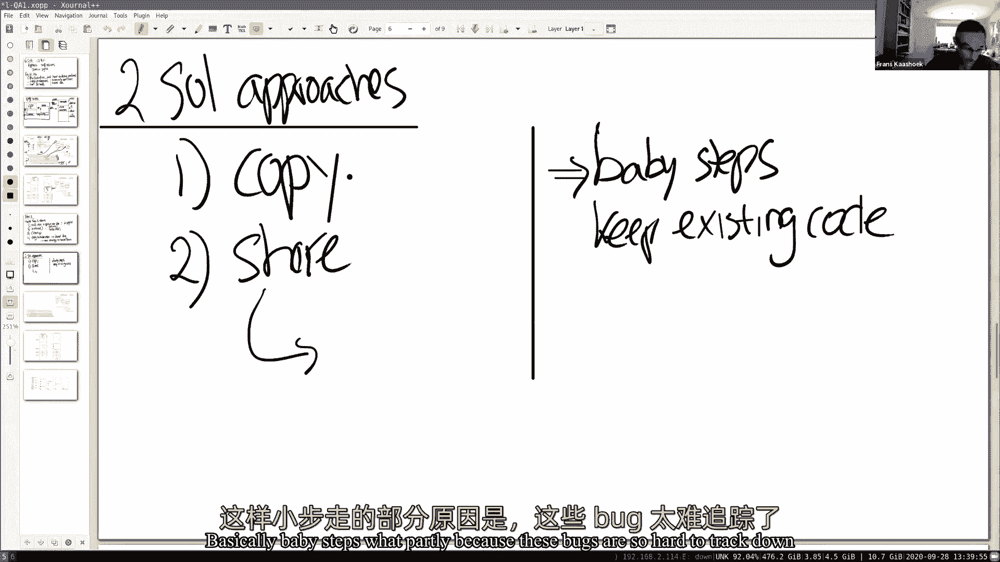

好的，呃，我来换一下，呃，到我的代码，所以也许从VM点CD开始，呃，所以这个，这是现有的KVM在里面，实际上每个人都能看到代码吗，好的，嗯和嗯，我们被要求的正确作业是复制它，我这样做的方式是。

我看看在哪儿，这是我的UVM创建，那只是无聊的部分，这基本上是在创造，呃，分配到顶层页目录，您将显示L两页目录，然后呃，这是我的KVM，它中的KVM的等价物，呃，所以我在这里得到页面目录的顶部，呃。

在本站，然后基本上我从内核页表中复制前五个和前十一个条目，KVM已经在其中设置了，所以这给了我大部分内核页表，然后我只需要绘制所有活的设备，在零条目中，因为零条目是我们以后要修改的条目。

或者我们将用户页面映射到底部，嗯，有几个设备住在入口的零点，还有那些，你知道设备需要添加，你知道到这个糟糕的过程页表，内核页表，所以也许我回到了之前的这张照片。

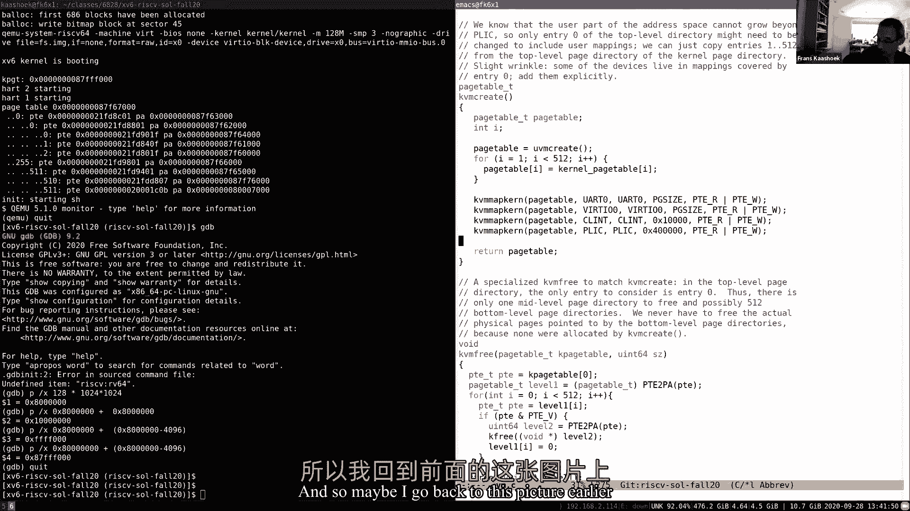

所以让我再拉出内核页表，是啊，是啊，也许这张照片和其他照片一样好，所以如果你考虑一下我的解决方案，呃，我基本上这些条目我只是与现有的内核页表共享，所以我不必分配任何，l 1或l 2或l 0水平。

它们已经存在了，我唯一做的就是照本宣科地复制PTD条目，所以只有底部部分或底部入口，这是我需要真正重建或明确复制的部分，而不是复制p，这涵盖了，你知道的，底部1GB，地址空间的权利。

1996年的一页报道，所以这个，你知道吗，你知道的这个条目，从5到12，这是两兆字节，这是一个千兆字节，基本上这些条目中我只需要填写一个，这有道理吗。

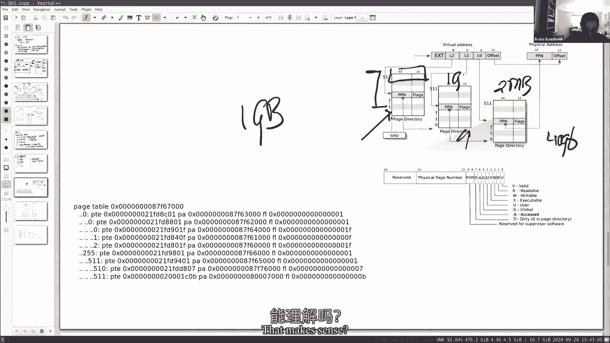

所以回到我的代码，基本上这就是我在KVM中所做的一切，创建，在KVM 3的情况下，呃也许不是也许更干净的解决方案，但我充分利用了我不必做任何事情的知识，从前八级目录中的条目一到五和十一。

我唯一能做的条目，的内核的底部条目，指向一个L一个条目的顶级目录，在那棵树上，我只需要通过一个永久保有权，l 2或l 0项，最后你知道免费的DL One然后是内核页表。

这就是我的KVM 3和我的KVM创建，这样我就可以为每个进程创建一个内核页表，然后呃，三一是我们做完的时候，所以一个快速的问题，是啊，是啊，你能再解释一下吗？只使用1到5 12而不是0的理由，是呀。

嗯好吧，所以呃，也许最容易做的事情，其实，让我回到这里的图片。

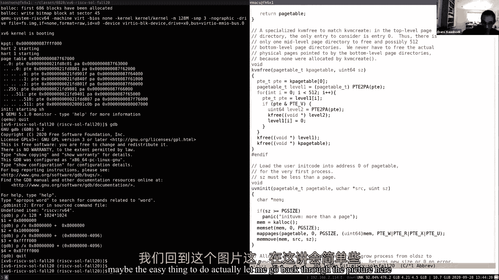

呃，所以我们有我们的核心着装空间，正确，呃，你知道它是0 x 8 0 0 0，废话废话，呃，x zero在顶层页面目录中属于什么条目，零条目否，不是进入权的零，那么我们知道什么，所以像这样的零条目。

这个条目涵盖了多少钱，顶层页面的零条目的底部条目有多少地址空间，目录封面，我觉得克林特，呃，它在零到零x2之间是自由的，零零零，是呀，好的，所以也许你正在经历，我认为你的方向完全正确。

所以底部入口盖是1GB，对，我们知道就像，也许我可以，我们的底部条目是1GB，那个，在那千兆字节里是牌匾里被清洗过的，对呀，你的艺术和Verdio光盘，我相信嗯。

然后当前基数实际上已经坐在一个更高的条目中，对，我们可以计算它，如果我们想，我们可以拿公牛一个零，校正x移位，呃十二移动九移动九，我想我确实记得在我的头顶上，它是什么，但试着弄清楚，如果你想，其实。

也许我们可以试试。

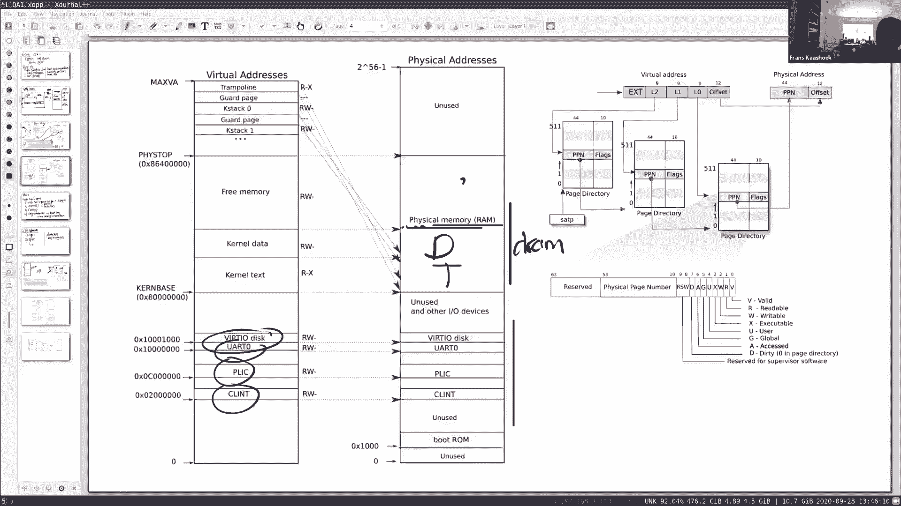

在课堂上做这件事总是很冒险的。但如此分贝92，所以让我们去，所以我们可以打印，所以移位是12，这给了我们呃，抵消了，这么好，那么我们就把那家伙转移，我想你可以说这个九，现在，这是下一个条目，还有一个。

所以这个条目二，有道理吗，所以我们回到我们这里的照片。

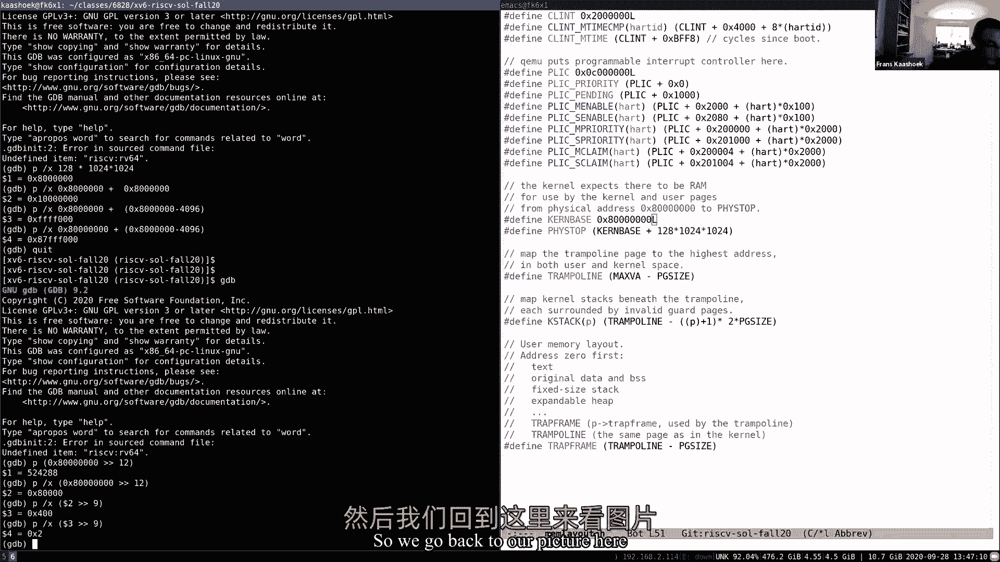

呃，基本上当前的基础是顶级页面目录中的条目，对所以和呃，我们从作业的第三部分知道，基本上我们真的不用担心上面的任何事情，点击，你知道所有的东西，呃实际上落在了入口零，这将是真正的请求是的，谢谢。好的。

所以现在我们，我们唯一能做的就是，你知道吗，再次检查。

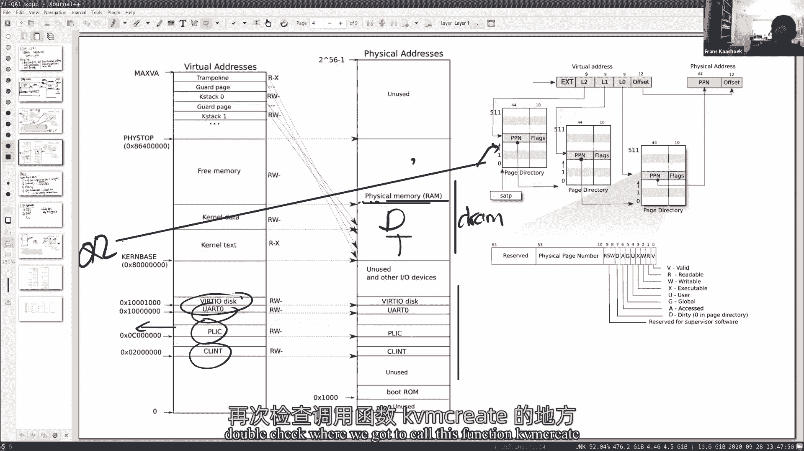

我们接到电话的地方，呃，功能障碍，你知道，这将是在分配过程中，所以说，你是，新进程在哪里初始化，你知道，我相信你们都是这样想的，你知道你进入，你分配，我们在proc结构中声明字段。

基本上它的结果实际上是我们在内核页表中粘贴的，好的，然后我们唯一要担心的是，当然我们需要用页表，所以我们需要看看时间表，基本上，作业或多或少地告诉你该做什么，这是在切换到该用户进程之前。

您需要切换到内核页表，这基本上意味着加载，你知道磁盘进程，ATP中的内核页表，然后当你做完，呃，切换并运行其他处理，您运行完另一个进程回来，你要回去运行调度程序，您必须切换回主内核页表，内核页表。

因为这是调度器实际使用的，为什么我们需要做这个切换，为什么这很重要，任何人，因此它选择正确的内核页表，因为当您转到页表条目时，它选择了正确的。

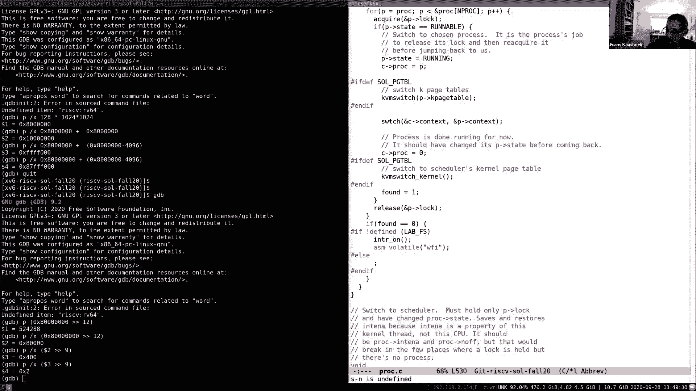

它选择正确的页表来选择它们。

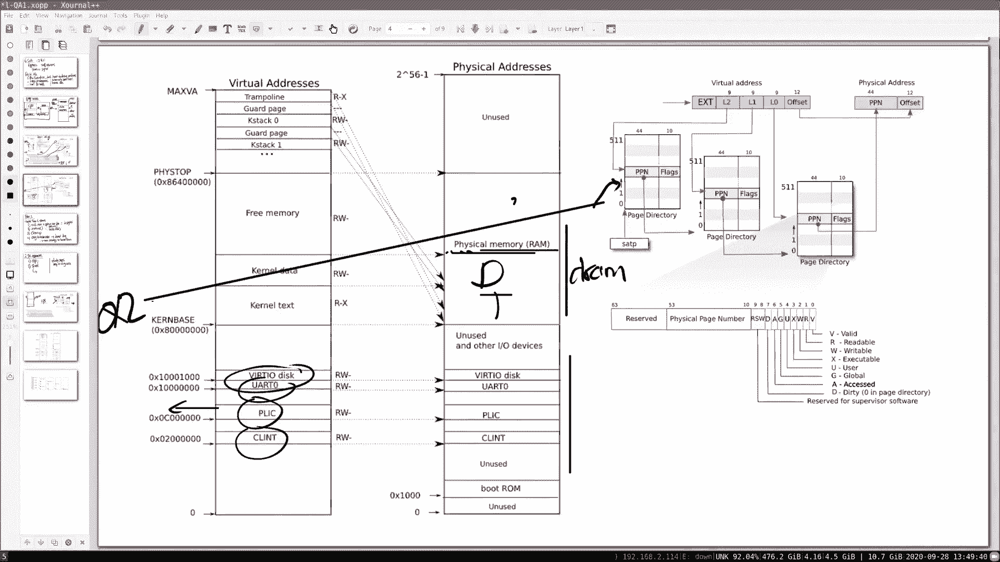

是啊，是啊，所以好吧，所以当我们停下来的时候，好的，让我换个方式问这个问题，这个内核页表怪胎是什么时候，当用户进程这样做时，如果我们不换，这意味着呃，我们可以使用正在释放的进程的页表，所以页表被释放了。

所以我们不想依赖于过程，我们现在不跑，是啊，是啊，完全正确，我们永远无法释放当前正在运行的项目的页表，所以我们得有个计划，你知道，在它们不再运行的时候，实际上要做三个过程。

你知道重量系统调用是我们的出路，基本上你知道，等待呼叫查找，如果有孩子，呃不是活着，你知道那是可以清理的，然后它把它们清理干净，但这意味着基本上，当你知道，父进程，事情在过程中，你要绝对确保。

您知道加载在p寄存器中的页表，呃不是，你知道其中一个，不是那个过程，你知道的，页表当前实际上是空闲的，现在，可能根本没有进程在运行，所以调度器基本上有自己的页表，这样你就知道。

所有的过程实际上都可以被清理，这有道理吗，对不起，我有个问题，嗯，您是在映射CL吗，进入新进程内核页表，是啊，是啊，我做为什么，嗯，因为我想作业上说，我只需要用户处理，不会比清理过的大，就是它，哦不。

我是说地图，牌匾和清洗过的，所以，但我想作业告诉我们，所以说，最低的是什么，我想，点击是最低的，基本上，标志告诉我们用户进程不会大于点击，地址，好的，只是为了让它变得容易，你知道的，我们本可以做的，呃。

我们想让它尽可能容易，为你清除，如果你想，你本可以做得更好，但你知道这是最简单的事情，你必须修改保险丝才能工作，进一步问题，呃，我有个问题，你能复制零到五十二吗，然后每次你切换，所以你还在用。

像全局根页表，除了只复制第一个根页表，每次你切换一个过程，您将该用户的地址复制到，是啊，是啊，原则是可能的吗，我想你可以做那样的事，所以基本上不是做，当您分配一个进程并释放它时，你可以动态地做。

在调度器切换期间，呃，这可能会更昂贵因为这意味着每次你在两个进程之间切换，您可能必须复制内核页表的部分内容，所以这可能是，呃，在表演方面，如果不是理想的事情，呃，作业上什么也没说，呃，如果这样做。

您可能会在用户测试中超时，我只是想知道，因为我试过这种方法，这是一次糟糕的经历，我在想我是不是路过，我可以想象，但我认为原则上是可能的，你知道吗，您可以正确分配一个新的页表，并每次切换。

当你切换出去的时候读它，嗯，我不认为这是最简单的，但你知道，原则，有可能，我想也许对六个做一些其他的修改，但是你，任何其他问题，你必须做的唯一另一个改变是你的用户陷阱红色。

您必须确保实际上使用进程内核页表运行，好的，好的，所以让我们把它们切换到，呃，就像没有火花，所以我们切换回实际上。

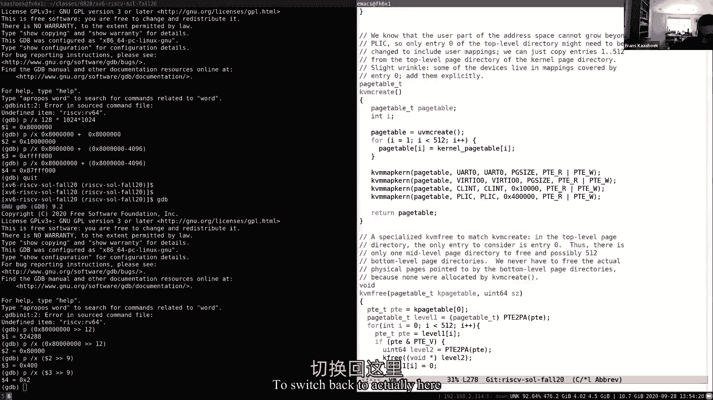

好的，所以呃，事实上，这可能不是一张有帮助的照片，让我看看，我有点好，所以第三部分，呃，所以基本上我们的计划是我们像以前一样有我们的内核页表，你知道我们在某个地方有点击入口，我们要做的是用。

您知道下面的所有内容，单击以实际存储用户，页表，我们将把用户页表映射到所有用户，内核中的用户程序，底部的页表，呃，这就是目标，当然，第一个要问的问题，你知道为什么要这么做吗，嗯，你知道，有没有，你知道。

它的任何损坏，然后呃，你知道，我想可能有一个简单的方法。

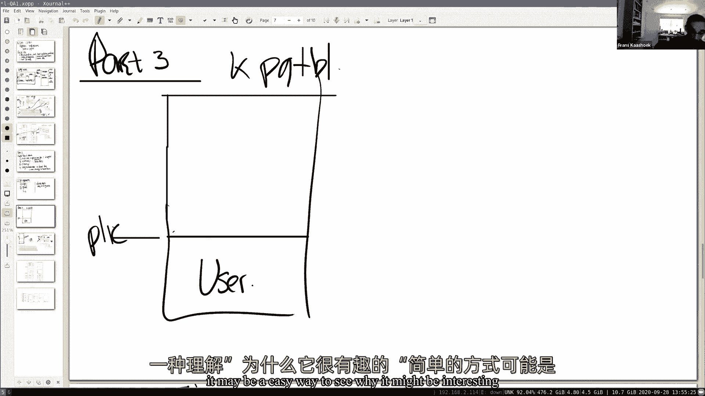

呃，看看为什么它可能很有趣，就是比较副本INS，中的新副本和旧副本，所以你，如果你知道的话，副本中发生的事情，从用户空间到内核地址空间的数据，呃，但你知道，如果内核没有映射用户地址空间。

基本上内核必须在正确的时候完成这个页面，因为当物理地址空间，它们并不毗连，基本上内核做什么并复制到，它基本上将虚拟用户地址转换为物理地址，因为内核已经用标识映射映射了所有物理内存。

物理礼服也是有效的内核虚拟礼服，然后它基本上移动页面的任何部分，需要复制的物理页面，它实际上复制了它，因此，如果示例的数据结构花费，你知道两个页面边界就像，比如说，这是你在实验室使用的信息结构。

也许它跨越了页表边界，它就会像，也许你知道，第一个物理页的一些字节，然后来自第二个物理页的一些字节，有道理吗，这就是当前复制所做的，目标基本上是让他们进入一个新的副本，内核程序不必担心。

物理布局基本上脱离了用户地址空间，然后在这个新的副本里，你知道，我们看到，我们基本上什么都不做，只需将用户地址直接复制到内核中，我们再也不用叫走路了，因为我们可以依靠，我们正确地设置了页表。

现在页表硬件将为我们做步行，所以这就是目标，因此，它使内核程序员的生活变得更容易一点，这种方法还有其他好处吗？是不是也更有性能，因为硬件会走路，而不是软件，是啊，是啊，嗯。

我认为他们的性能影响的一种方式，当然，呃，一种思考的方法是在复制正确，如果内核数据结构，或者我们从用户空间复制到内核空间的数据很大，我们必须这么做，你知道的，一次页，在每一页中，我们都要调用这个函数。

游走蝰蛇，然后做内部行走，所以，呃，这实际上可能是合理的，昂贵的，昂贵的，有什么例子，内核从用户空间复制大量数据的示例，哪个系统调用可能从用户空间复制大量数据，对呀，是啊，是啊，对呀，对呀，你写。

您可以给出任意数量的任意缓冲区，任意大小的，你知道，内核墙可能要复制这个，你知道变成，比如说，文件系统，或者进管子里，所以这可能是一个合理的，昂贵的，另一件事，还有什么好处，如果用户，呃。

我们在这次任务中没有探索这一点，但我们可以有另一个优势，所以如果你想想，你知道其中一些，这里的代码在它，你知道，从用户空间中取出一个结构，它将整个结构复制到内核空间，如果用户空间映射到内核页表。

我们一定要这么做吗，比如说，如果我们必须更新结构的一个字段，所以如果数据结构只是映射到内核地址空间，然后我们就可以像读和写一样，你知道的，对特定数据结构的存储指令，我们可以只更新一个字段。

不像内核现在所做的，基本上，它将结构从内核空间复制到用户空间，然后可能用复制退出，所以如果我们将用户空间映射到用户程序到内核地址空间，我们可以比现在更自由地操纵它，就动机而言，这有意义吗。

为什么许多内核实际上有这种特殊的结构，它们在那里映射。

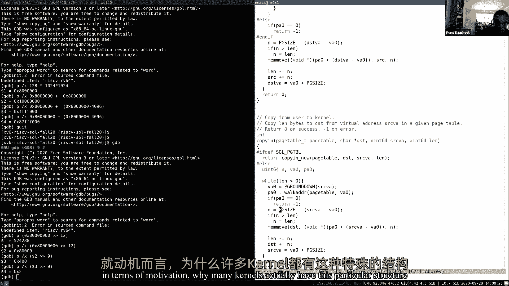

用户的底部，或者在哪里将用户编程映射到内核地址空间的底部，好的，所以呃，所以说，让我们看看，查看我的代码。

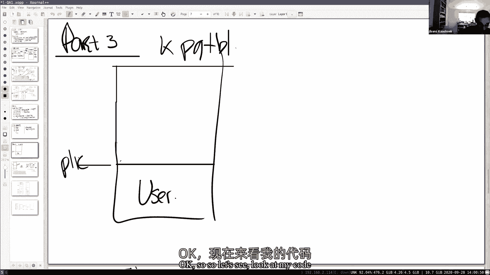

所以你可以理解实际上，我这么做了，基本上有一个函数是键正确的，你知道吗，假设我们在某个有效的地方建造，用户页表，然后我们只需要映射用户页表中的条目，到内核页表中，或进程内核页表，函数k。

您有地图用户正是这样做的，嗯，而且很无聊，但我提出了几个有趣的观点来指出和工作，你知道这是同一种接口，uvm，Mac什么的，或者基本上，如果你知道你从旧的尺寸到新的尺寸页面，呃，你会发现，呃UKE。

你知道PTE的指针，对于用户页表中的特定虚拟地址，对呀，所以如果我们看看，如果你看看我们不久前的照片。

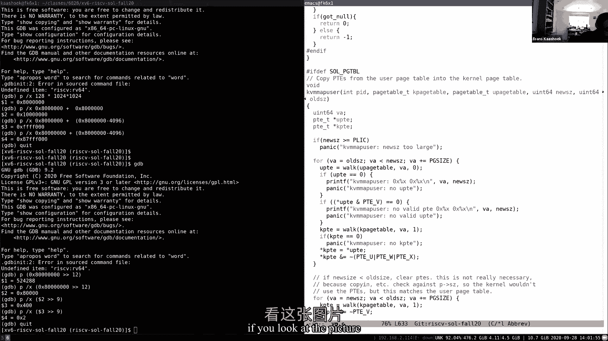

你知道的，看这幅画，基本上这将返回什么，正确的是，我们将遍历用户页表，我们将找到，比如说，映射的PTE，你知道那个特定的虚拟地址，我们得到一个基本上指向页表中该项目的指针。

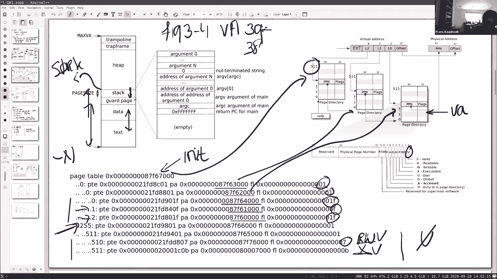

这就是我们走的路，所以如果呃事情被映射，如果它是零不是零，那一定意味着你知道它在那里，所以这只是一次检查，下一件事，映射就在那里，嗯，我们检查这个有效，就像有调试帮助一样，在某种意义上。

你知道它应该是有效的，然后我在内核页表中做同样的事情，我查了那个虚拟地址，也在进程内核页表中，但我把这次叫做与一个同行，以便在必要时实际分配中间页，然后一旦我得到了指向内核PT的指针。

我只是把用户PT复制到内核P中，所以可能你们很多人都叫地图页，但我只是直接将PTE复制到内核中，pte，当然你知道我得禁用一些部分，我们一会儿再谈，呃，但是呃，它的本质是，我只想复制内核页面，笔架。

所以这意味着你知道，比如说，用户程序的所有物理内存都在内核空间和用户空间之间共享，好的，这有道理吗，嗯好吧，所以就切换一些位而言，呃，我有一点，呃超过必要，但我关掉了执行位，切换正确的位。

这个复制只需要阅读它，从不写信给它或复制出去，那是吗，然后呃，你得把U位调高，嗯，这是一种风险，五个具体的事情，如果您在内核模式下运行，U位设置在ptentry中，内核实际上无法访问那个特定的页面，嗯。

事实上，你可以，这几乎是一个选择，你也可以对风险五硬件进行编程，但基本上是内核模式，忽略U位，但是XP6不能做到这一点，所以你必须切换U位，关于你有什么问题吗，因为你们中相当多的人被问到这件事。

这个做完了吗，只是为了确保内核不会对用户内存造成任何损害，是啊，是啊，那么为什么会这样呢，你知道的，所以问题就像，这是出于调试原因吗，还是有某种孤立的理由这样做，我想这主要是为了调试区域。

因为内核是完全控制的，对呀，它就会，它可以根据自己的意愿禁用分页，所以不是说，你知道吗，用户空间受到内核的保护，我认为它主要是为了帮助内核开发人员，所以说，比如说，在十六箱未经修改。

xv六永远不应该取消引用或使用页面句点，嗯，嗯，所以你知道，基本上这只是帮助，你知道吗，如果你碰巧那样做，无论如何，你会立即得到一个页面错误，你知道，或者内核恐慌，它会帮助内核。

调试器或开发人员来调试内核，这有道理吗，是啊，是啊，谢谢。我有一个后续问题，我认为关于用户的部分是有道理的，但是写入和执行位呢，是啊，是啊，所以执行必须在，内核对这个页面做什么，它只能从它的右边到达。

唯一的东西，唯一的指令，基本上从这个页面获取数据，这个人是把指令和副本搬进来的吗，所以只有你知道它执行加载指令，加载值，你知道从那个特定的页面，并且页面应该只包含数据，所以内核没有理由写到那个页面。

所以保守地说，我禁用了正确的位，该页面应该有当前的不应该执行的结构，所以我也可以再次执行bit，这主要是，我想出于调试的原因，呃不是，你知道的，隔离带，好的，所以现在我们唯一需要做的就是。

基本上有一堆地方这个代码，调用此函数的位置，当你看到这些地方时，它被称为，去了解发生了什么，或者应该如何使用，我想可能是你知道的有趣的一个，你们中的一些人问的是叉子，我们要谈谈，他们两个，第一把叉子。

所以这里是呃，对fork的调用或对fork中的k kvm映射用户的调用，它需要结束，所以主要有趣的问题，我想你们很多人问的是，为什么必须是新进程内核页表，为什么它必须从新处理器复制，呃，页表而不是从。

可能是当前进程页表，因为无论如何，这是一项相同的权利，前进，基本上只是复制页表的用户部分，那么为什么我们不能使用当前的页表来做到这一点呢，为什么实际上你必须使用新的，您知道页面中孩子的用户部分。

孩子的用户页表，为什么会这样，移动你注意到你得到了什么bug，你不会得到一个重新映射错误，您可能无法重新映射错误，呃好吧，事情也许也是这样，但又一次，我想的bug不是重新映射的bug。

你们中没有人再尝试过，你的个人经历是什么，电话里任何尝试过这个的人，记住由此产生的体验是什么，我想结果是我和我没有肿块，但就像，我认为最终的体验是在用户测试的某个地方，特别是。

你应该测试做大量的分叉和退出，你会有麻烦的，你在区域中得到一个错误，出问题的是，呃，如果从父进程复制，如果父进程在，孩子处理我们，然后父进程页表将完全，呃，就像我们之前看到的那样清理干净了。

但是子进程仍然有指向父进程的指针，页表，所以基本上你会，基本上是这个孩子过程中的页面，页表已经处理过，它们仍然在使用，所以导致了各种各样的不良行为，因为冻结页面上的内核实际上到处都在写，出于调试原因。

所以现在基本上你有无效的，你知道的，在内核页表中，这有道理吗，好的，再来一个，呃，要看的是Exec点C，呃，在我的解决方案中，都很直接，几乎没有修改弹出，我们唯一做的药是，你当然知道第一件事，你知道的。

第一部分，然后这里是第三部分，它基本上是将新的用户页表映射到内核页表并退出，基本上，它所做的基本上是建立一个新的用户地址空间，你知道，有一行将新的用户地址空间复制到内核页表中，就是这样，有什么问题吗？

所以我希望，同时，呃，我已经回答了你的许多问题，呃，呃，所以在里面，呃，我们可以看看哪些，还有几个问题我还没有谈到，所以也许我们可以看看那些，或者除非你马上有问题，我们不是也修改了生长过程吗，是呀。

是啊，是啊，再做几个必要的改变，呃，你知道，在S中断或群岩中，有一个，我在这里加了一条线，非常相似的风格，大概也有类似的变化，我想这可能是它实际上或通常在它，当然可能会有变化。

因为您必须将init代码中的一个页面映射到内核页表中，为了那个过程，因为第一道工序比较特殊，好的，所以呃，我将在这里讨论一些问题，我把它们放在屏幕上，所以你希望能看到他们。

所以我不必觉得把它们完全读出来，我想第一个问题是一个实际上出现的问题，关于PTU的一点，呃，旗帜，呃，我想我们已经讨论过了，我们还掩盖了他没有恶意的事实，但主要是出于调试的原因，类似的问题。

如果你处于主管模式，你就不能做点什么吗，因为你可以切换ATP，你可以，答案是肯定的，一切皆有可能，所以真的，你知道的，U位不是关于用户程序受到内核的保护。

它实际上是作为一个标志来帮助内核开发人员构建内核，另一种具体的风险五个问题，这就是为什么IN干涉，为什么寄存器有点奇怪的顺序，呃，原因是，我想我们刚才提到过，在上一节课，基本上。

有一种叫做风险五压缩指令集的东西，它有一组很少的寄存器，然后呃，所以你必须，呃，对指令进行更紧凑的编码，这种奇怪的顺序反映了他们基本上是两个的事实，有压缩版本，这是一组寄存器，然后是未压缩的版本。

这就是我们正在使用的，它有一套完整的寄存器，和压缩，比如说，有1和0，作为零和作为一，但不是11岁的2岁，所以这就是主要原因，嗯，我想它经历了大部分这些问题，但如果你看到一个我应该讨论的问题。

我不知道你知道，请打断我，或者如果你问我还没有讨论的问题，呃，请问这些问题基本上是按你提交的顺序，所以这些是，好的，这里可能有，呃，所以这是我对操作系统的问题，使用一篇名为页表的文章，必须设置页表页。

以便层次结构的较低部分至少是部分和共享的，然后呃，你知道的，你显然在我的解决方案上，正确，我分享一到五个条目，十一，所以这是一个标准的把戏，很多操作系统都这样做，我想我们就这个问题谈了一点。

你转换是很重要的，你知道吗，到这个主内核页表，因为调度器可能再也没有用户处理器可以运行了，和时间表，当然啦，还需要一个页表，因此，它与主内核页表一起运行，我们在聊天中有一个问题，是啊，是啊，去吧。

什么是让你拉起聊天，坚持住，我能读懂，是啊，是啊，是啊，是啊，我拿到了，所以我想，你知道的，好的，所以问题是风险说明是怎么说的，分离的那一部分是，防止，允许用户程序使内核跳转到任意代码的bug。

在用户空间中，呃，是呀，呃，这是一个很好的观点，嗯，所以你知道，你可以在这里辩论，这是隔离属性还是内核调试属性，显然，内核不应该跳转到地址和用户地址空间的任何部分，你知道的，我认为这是一个工具。

帮助内核调试器抓住这些钱，出于某种原因，这就是为什么在XPSix中，我们还禁用或设置视图位，并且不允许内核引用任何页面，保护你知道我们，你知道的，如果您确实引用了内核实际上会出错的每个用户地址。

我想我把滑冰者盖住了，呃指向呃，所以这里有一个问题，管道是如何在xpsix中实现的，和true更改页表应用程序中实现的页表会影响此实现，所以管道基本上是内核中的缓冲内存，然后呃，对呀。

当你对着烟斗写字时，基本上叫，复制进去，并复制进去，或将字节从用户空间复制到管道中，在某些方面，你知道这个页表实验室的整个部分，基本上简化了代码，这样你就不用走很多路了，您就从用户空间进入管道。

这是一个答案问题，我想很多人问你喜欢，为什么UVM三号和自由行者最初对叶子感到恐慌，原因是你知道我们在那里制造了恐慌，因为它断了，呃，这表明XP6中的一个变体将被打破。

这是未修改的x x t 6的不变量，呃，在这种特殊情况下，呃，那不是真的，所以你必须基本上摆脱恐慌，意识到在那里恐慌并不重要，你在那里不要惊慌，我想我们谈了很多，比如为什么VM复制新是。

你知道为什么新的VM副本是一个好的，好的，这里还有一个问题，嗯，假设这可能是一个有趣的问题，一种更多的设计问题。

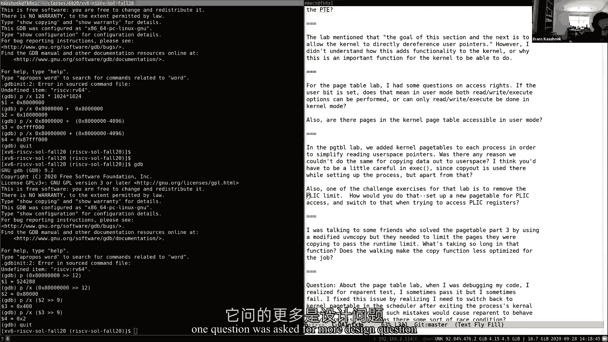

有一张照片是有帮助的，我们查看内核地址空间，在那里我们限制它，看看我能不能找到我的熊猫，我们限制用户地址，用户程序可以更大，我们说基本上用户程序可以增长到干净的地址没有进一步。

假设我们真的想一直长到这里，我们怎么能这么做，什么什么，我们应该如何改变设计来允许，我们怎么重新映射这些东西，呃，像克林特和BC，你是，是啊，是啊，你会把它映射到哪里，所以如果你想释放这部分地址空间。

你能把它映射到哪里，就像当前基础之前的自定义一样，在物理停止之前和当前基础之后，是啊，是啊，或者这可能是更好的后鱼汤，这里有大量的自由空间，类地址空间未使用，像这样从这里到那里基本上是用来物理记忆的。

我们基本上可以在这里建立映射，对呀，比如我们可以把UART放在这里，就像你是零，我们可以在这一页上面放一个，基本上建立一个映射，映射到那个特定的物理地址，然后这将释放这个映射，我们可以把它作为用户空间。

如此相似，如果我们能做到这一点，你是零或Verio磁盘，你知道布莱克和克林特和真正的内核这样做，这有道理吗。

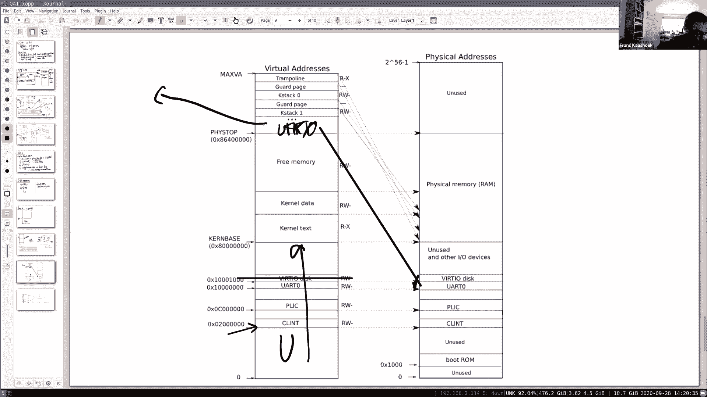

没那么成问题吗，虽然，因为我们想要与原始内核页表相同的映射。

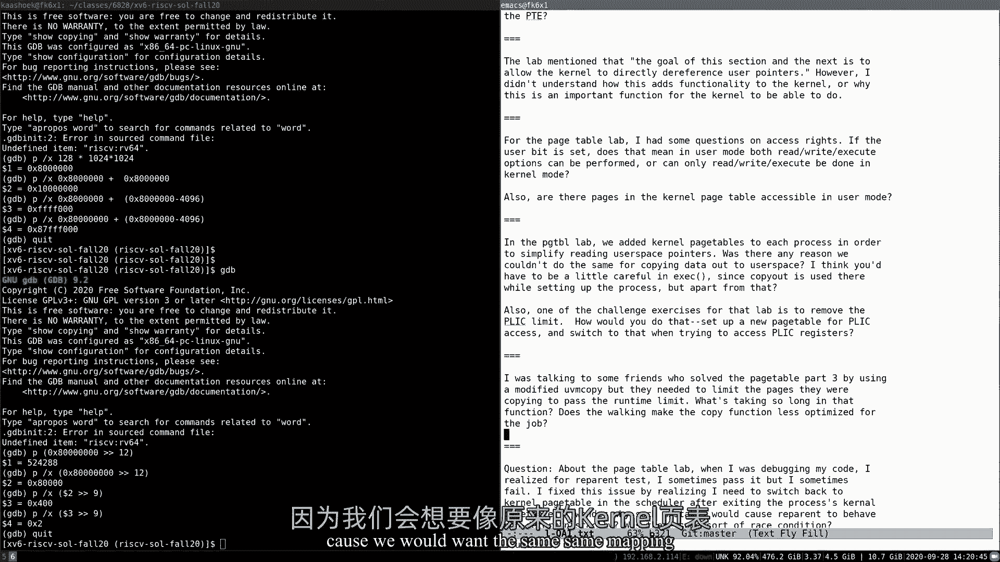

嗯，我们必须在每个内核页表中都这样做，正确，如果我们有副本，我们得把它映射出来，哦，在那个特定的位置，我不确定那是一个，我不确定这是否能回答你的问题，但我不认为这是个问题，我明白了所以你，你做那个映射。

也在原作中，是啊，是啊，是啊，是啊，我们也必须在最初的一个中这样做，如果老上校一致认为你是零，那就更容易了，坐在上面，现在很多人这样问，为什么我们要将内核堆栈映射到高处。

这样做的原因是什么这样我们就可以在其中绘制这些，呃，内核堆栈很高，如果你现在做了复制方法，您实际上必须修改其中的一个进程来实际复制该映射，为什么要把它设置在虚拟地址空间的高处。

是因为风险5中的堆栈是向下增长的吗，所以你把它放在地址空间的高处，让它有向下生长的空间，你知道多少才是正确的方向，它要向下生长多少阶段，那不重要，因为只有一页，对呀，是啊，是啊，只有一页。

那么如果您增长超过一页会发生什么，你正确地跑进车库，保护页没有映射，所以内核会惊慌，这比实际上你写它的数据结构要好，所以它很高的原因是，呃。

因为我们在下面放了一个保护页它实际上有任何与车库相关的物理记忆，否，否，没有与保护页相关联的物理内存对吧，所以这就是把它放高的很酷的事情之一，我们可以在下面放一个保护页，实际上不消耗任何物理内存。

这有道理吗，哦，所以基本上康奈尔的东西页面将是物理的某个地方，但卡片页不会完全，再次，你可以用虚拟内存做的很酷的事情之一，是否有可能超调保护页，是啊，是啊，我是说，这是个好问题，你知道吗，什么，比如说。

如果你知道你分配了警卫，呃，堆栈上的缓冲区实际上是，你知道，比守卫页大得多，更正并进入下一个内核堆栈页面，呃，是的，是的，你会有一个严重的错误，不管怎样，你很可能会遇到这种情况。

因为您可能会使用缓冲区的第一个条目，然后你会得到页面错误，但你可能会倒霉，所以这个，这不是防弹内核调试技术，但事实证明它非常有效，大问题。

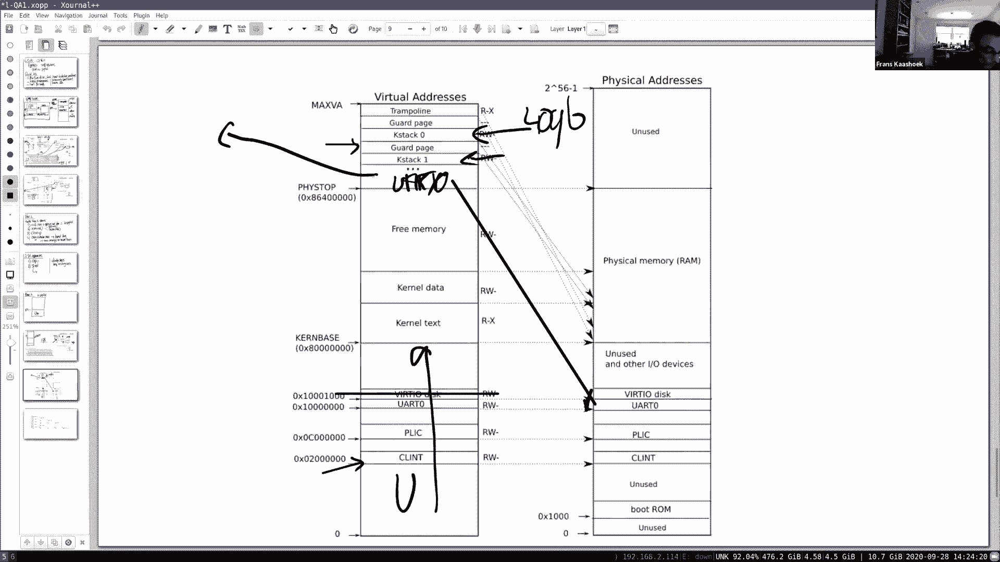

还有问题吗，我会回到，我们还有几分钟，然后实际上我们还有一分钟。

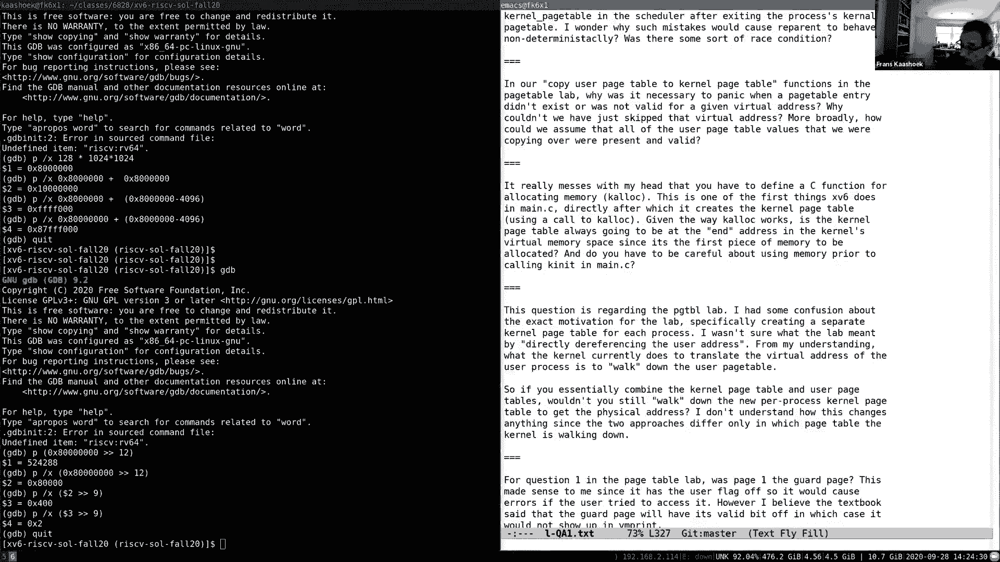

我有个问题，所以一旦我们有了进程的内核页表，这是否意味着在陷阱代码中我们不需要切换页表，我认为最大的问题是，一个好的设计问题，答案是肯定的，你不需要它的权利，因为，内核的主要原因，或者在蹦床代码中。

我们这么麻烦是因为我们必须复制用户，我们必须从内核页表切换到用户页表，和用户页表或页表，没有映射内核的其余部分，不利的等待，我不知道，我不确定那是不是真的，因为康奈尔需要在片场设置用户黑色用户标志。

是啊，是啊，是啊，是啊，好的，所以我想说几点，所以说，原则上，呃，你可以简化，呃趋势，我这么说吧，可以简化进出，如果您有一个映射的页表，用户和内核在单个页表中，因为这样你就不用换了。

你必须对6个进行更多的修改才能做到这一点，呃，但原则上你可以，事实上，呃，Linux，直到最近才使用，你知道的，这种策略，内核和用户代码位于单个页表中，呃，并依靠，基本上是U位，你知道要确保。

用户程序实际上不能修改任何内核页面，在这种情况下，进出代码稍微简单一点，因为当您进入或释放内核时，您不必切换页表，呃，发生在，比如说，熔毁攻击，如果你可能有这种侧通道攻击，以应对实际侧信道攻击，呃。

线性开关，或者有其他运行模式，跑步有两种模式，一种叫做KPTI模式，在那种模式下，基本上，这基本上反映了XP6，你知不知道，为内核提供单独的页表，为用户空间提供单独的页表，等一下等一下。

所以我还是不明白为什么那是有效的，假设用户进程和内核使用相同的页表，如果用户内存必须设置用户位，康奈尔将无法访问该用户内存，对呀，啊，好的，上，所以这样就可以了，在英特尔处理器上，这不是规则，所以说。

比如说，在处理器中，如果你的出价设定好了，内核仍然可以写入和读取该页面，哦，那只是风险五，啊，甚至在风险五，你可以改变它，在S状态编辑器中有一点，您可以将类型设置为一些位，如果你设置它，然后呢。

基本上在内核模式下，忽略视图位，好的，所以你是说这里面只有一点，CU处理器让我晚了四个小时，是呀，那件事我很抱歉，我应该意识到没有，否，否，没关系，它是，当你报道这件事的时候，这是一个有趣的认识，呃。

它让我想起了夏天我实际上有的一个虫子，正是那个虫子，我忘了这件事，所以我很抱歉，不不不，没关系，它是，呃，很有趣，确定弄清楚，但我，我在某个时候，我只是喜欢好吧，喜欢任何一个，我疯了。

或者完全出了什么问题，所以我要去睡觉，提交这篇广场帖子，希望当我醒来时，会有人接的，幸运的是，情况就是这样，所以我可以继续，当我当我做的时候，好的，所以我想我们有点拖延时间了，呃，但希望这是有帮助的。

并重申，你知道的，有虚拟内存的东西，我认为这很重要，因为我们将再进行三圈涉及虚拟内存的比赛，我希望在这一次之后，你知道这些会比这次经历更容易，我能问个问题吗？是啊，是啊，所以我要留下来。

所以每个人都想留下来问更多的问题，请随意这样做，如果你需要去下一节课，请你走吧，在所有的实验室里都有很多提到，就像，哦，我们这可能在未来的实验室里有用，但我们从来没有真正使用过我们编写的任何代码。

有什么计划吗？我们应该从以前的实验室导入代码吗，或者像我不想，因为如果它有虫子怎么办，我不想，你知道吗，影响下一个实验室，是啊，是啊，所以我们不这么做的一个原因，你知道为什么构建实验室不互相构建吗。

即使他们可以避免基本上依赖，就像你在早期的实验室里有一个虫子，用户测试或我们的任何测试都没有暴露，但会暴露在新的实验室里，然后你知道是痛苦的，嗯我提到的原因，那就是基本上真正发生的事情是。

我们将在页表上做更多的事情，所以说，比如说，你知道的这个实验室，在以后的实验室中简化和复制，呃，改为s break，它们基本上与您对内核所做的更改正交，这一圈，但您知道，您一直在考虑内核页表。

如此多的用户页面表将真正帮助您，对你有帮助的是，因此，调试由于不正确的页表而导致的这类问题的经验，好的，我只想确定一下，我错过了，因为我没有从一号实验室复制我的X拱形代码什么的。

决定购买实验室不相互依赖，好的，谢谢，星期三见，星期三，我有一个关于映射映射的问题的后续，呃，使用页表应用程序中的修改，嗯，那么需要蹦床吗，在用户页表中，呃好吧，所以我还没想清楚，所以如果你把核仁。

假设内核出口，假设我们有一个关节，一张单页表，这是你看到的正确的一个，我们跳出内核，呃通过乌尔，我们的目标是，我们仍然在内核模式下运行，所以这个页面当然可以访问，在内核中更正，保护页，我肯定你不会。

卡片页，我在说什么，蹦床页面，有没有，捕鼠器架，我们不是真的，我们无论如何都可以接触到，对，因为我们运行的是内核模式，我们知道它在PROC结构中的位置，或者我们可以得到它，所以我想我们可以退出。

当我们回来的时候，然后用户代码就可以运行了，你知道我们，当然U位有点，Ubid只设置在用户空间中的页面上，所以那很好，我也是，所以当我们回到课程中，你知道我们还在用这个页表，该页表已经映射了所有内核。

我们可以，你知道的，复制你知道的寄存器，我们需要直接保存到proc结构中，而不是必须经历，呃，有一个单独的页面，其中包含proc结构，我相信改变会很简单，好的，我明白了，谢谢。但我当然可能错了，哦耶。

我是。

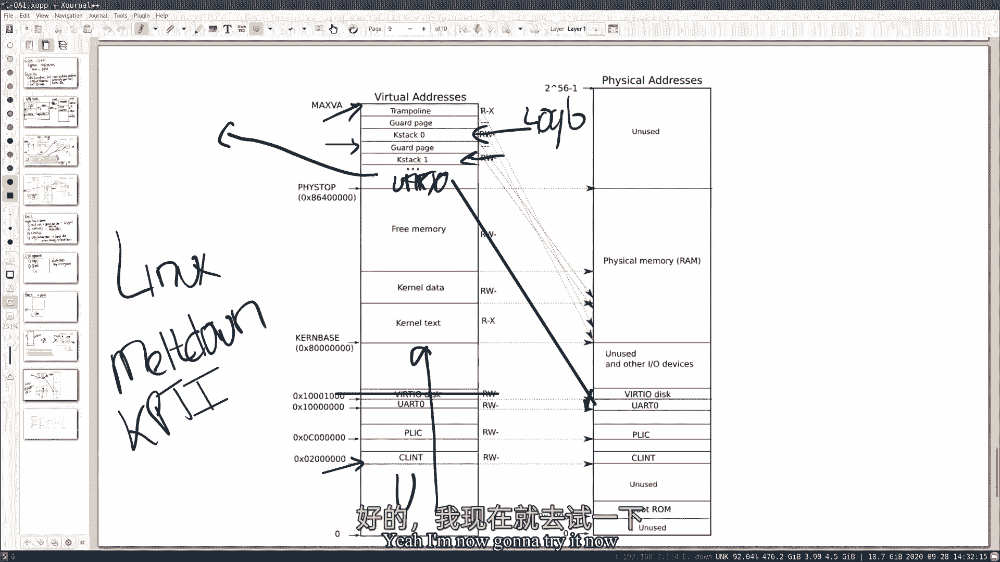