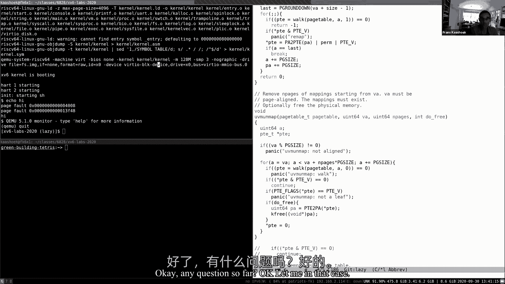
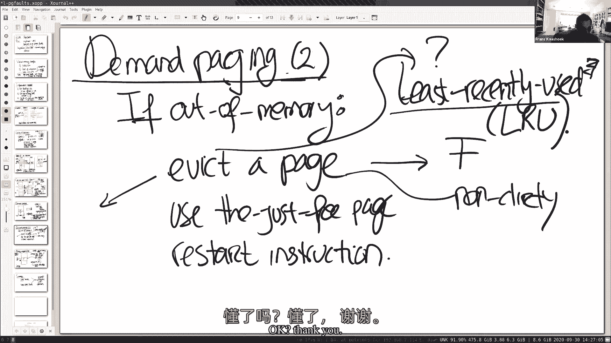

# 课程 P7：第8讲 页面错误 🚨

在本节课中，我们将学习操作系统中的页面错误机制。页面错误为内核提供了动态修改页表映射的能力，是实现多种强大虚拟内存特性的基础。我们将探讨如何利用页面错误处理程序来实现惰性分配、写时复制和需求分页等功能。

---

## 概述

页面错误是虚拟内存系统的核心机制之一。当用户程序访问一个尚未映射到物理内存的虚拟地址时，硬件会触发一个页面错误异常，并将控制权转交给内核的页面错误处理程序。这为内核提供了一个绝佳的机会，可以动态地分配物理内存、调整页表权限或从磁盘加载数据，从而实现一系列优化和高级功能。

上一节我们介绍了虚拟内存的基本概念和页表的作用。本节中，我们来看看当页表映射缺失时，硬件和操作系统如何协同工作来处理页面错误。

---

## 页面错误的硬件机制

当页面错误发生时，RISC-V硬件会通过陷阱机制将控制权从用户空间转移到内核空间。与系统调用或设备中断类似，但硬件会提供一些额外的关键信息，帮助内核诊断和处理错误。

以下是页面错误发生时，硬件提供给内核的三类关键信息：


1.  **出错的虚拟地址**：保存在 `stval` 寄存器中。这是引发页面错误的指令试图访问的地址。
2.  **错误类型**：保存在 `scause` 寄存器中。RISC-V定义了三种页面错误类型：
    *   `12`: 指令页面错误（取指失败）
    *   `13`: 加载页面错误（读数据失败）
    *   `15`: 存储页面错误（写数据失败）
3.  **引发错误的指令地址**：保存在 `sepc` 寄存器中。内核在处理完页面错误后，需要返回到这里重新执行该指令。

有了这些信息，内核的页面错误处理程序就可以分析错误原因，采取相应措施（例如分配物理页、修改页表项），然后通过恢复 `sepc` 中的地址来让用户程序继续执行。

---

## 应用：惰性分配

惰性分配是一种优化策略。传统的 `sbrk` 系统调用会立即分配应用程序请求的物理内存。然而，应用程序常常会申请远超其实际需要的内存。惰性分配的核心思想是：**直到应用程序真正使用某块内存时，才为其分配物理页**。

### 实现思路

1.  修改 `sbrk` 系统调用：当应用程序请求更多堆内存时，内核仅更新进程的堆大小变量（`p->sz`），而不立即分配物理内存。
2.  处理页面错误：当应用程序首次访问这块新“分配”但未映射的内存时，会触发页面错误。
3.  在错误处理程序中，内核检查出错的虚拟地址是否在堆的合法范围内（即小于 `p->sz`）。
    *   如果是，则分配一个物理页，将其清零，并映射到出错的虚拟地址上，然后返回用户态重新执行指令。
    *   如果否，则说明是非法访问，终止该进程。

### 代码示例



以下是在页面错误处理程序中实现惰性分配的核心逻辑伪代码：

```c
void usertrap(void) {
    // ... 其他陷阱处理 ...
    if(r_scause() == 15) { // 存储页面错误
        uint64 va = r_stval(); // 获取出错的虚拟地址
        if(va < p->sz) { // 地址在堆范围内
            // 分配物理页
            char *mem = kalloc();
            if(mem == 0) {
                // 物理内存耗尽，杀死进程
                p->killed = 1;
            } else {
                memset(mem, 0, PGSIZE);
                // 将物理页映射到虚拟地址va
                if(mappages(p->pagetable, PGROUNDDOWN(va), PGSIZE, (uint64)mem, PTE_W|PTE_X|PTE_R|PTE_U) != 0) {
                    kfree(mem);
                    p->killed = 1;
                }
            }
        } else {
            // 非法地址，杀死进程
            p->killed = 1;
        }
    }
    // ... 恢复执行 ...
}
```

**注意**：惰性分配会引入复杂性。例如，当进程退出时，内核需要释放其所有内存。对于惰性分配但从未使用的页面，其页表项是无效的，在释放时需要跳过这些页面，而不是触发恐慌。

---

## 应用：写时复制

写时复制是 `fork` 系统调用的一个关键优化。传统的 `fork` 会复制父进程的整个地址空间，这通常非常耗时且浪费内存，因为子进程往往很快会调用 `exec` 来替换掉自己的地址空间。

COW 的核心思想是：**在 `fork` 时，让父子进程共享相同的物理页，但将这些页标记为只读**。当任一进程试图写入这些共享页时，会触发页面错误，内核此时再为该进程复制一个私有的物理页副本。

### 实现思路

1.  修改 `fork`：复制父进程的页表时，不分配新的物理页，而是让子进程的页表项指向父进程的物理页。同时，清除父子进程页表项中的 `PTE_W`（写）标志位，并设置一个自定义位（例如 `PTE_COW`）来标记这是一个 COW 页。
2.  处理页面错误：当进程尝试写入一个只读的 COW 页时，触发页面错误。
3.  在错误处理程序中，内核检查页表项是否设置了 `PTE_COW` 位。
    *   如果是，则分配一个新的物理页，将旧页的内容复制到新页，然后将新页以可读写的权限映射回原虚拟地址。之后，减少旧物理页的引用计数。
    *   如果否，则按其他错误处理（如惰性分配）。
4.  引入引用计数：每个物理页都需要一个引用计数，记录有多少个页表项指向它。当引用计数降为0时，才能安全释放该物理页。

### 核心公式与概念

*   **COW 页表项权限**：`PTE_R`（读） + `PTE_COW`（自定义标志位）
*   **私有页表项权限**：`PTE_R`（读） + `PTE_W`（写）
*   **引用计数**：`ref_count[pa / PGSIZE]++` 或 `--`

---

## 应用：需求分页

需求分页将惰性分配的思想应用到了程序加载 (`exec`) 阶段。传统的 `exec` 会立即将程序的代码段（text）和数据段（data）从磁盘文件全部读入物理内存。需求分页则推迟了这一过程。

### 实现思路

1.  修改 `exec`：不为程序的代码段和数据段分配物理内存和建立映射，仅在进程的地址空间结构中记录这些段对应的文件、偏移量和长度等信息。
2.  处理页面错误：当程序开始执行第一条指令或访问数据时，会触发页面错误。
3.  在错误处理程序中，内核根据出错的虚拟地址，查找其所属的段信息，然后从磁盘文件中读取相应的页面内容到新分配的物理页中，并建立映射，最后重新执行指令。

这样做的好处是：**程序启动更快**（减少了初始 I/O），并且**节省内存**（如果程序从未使用某些代码或数据，则对应的页永远不会被加载）。

---

## 高级话题：页面置换与内存映射文件

当物理内存不足时，内核需要选择一些页面“换出”到磁盘，以腾出空间。最常用的策略是**最近最少使用**。RISC-V 页表项中的 `PTE_A`（访问）位和 `PTE_D`（脏）位为实现 LRU 和高效换出提供了硬件支持。

内存映射文件 (`mmap`) 允许应用程序将一个文件（或一部分）直接映射到其地址空间。之后，对内存的读写操作就等同于对文件的读写。这同样可以通过页面错误机制惰性地实现：仅在访问时从磁盘加载文件页，并在页面被修改（脏）后写回磁盘。

---

## 总结



本节课我们一起学习了页面错误这一强大的机制。通过结合页表的静态映射和页面错误的动态处理，操作系统能够实现一系列精巧而高效的虚拟内存功能，包括惰性分配、写时复制、需求分页和内存映射文件。这些技术共同构成了现代操作系统高效管理内存的基石，在性能优化和资源利用方面发挥着至关重要的作用。