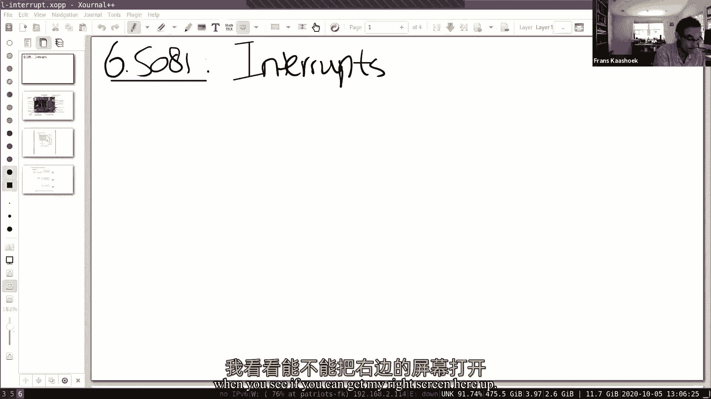
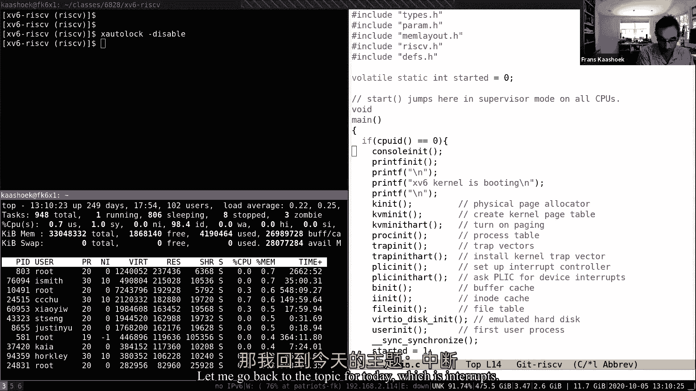
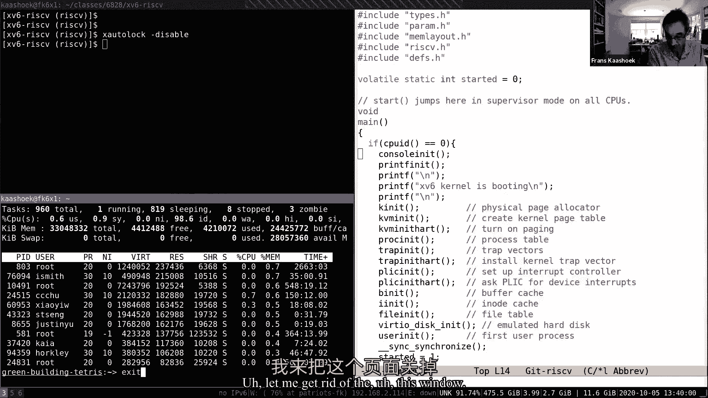

# P8：Lecture 9 - Interrupts 中文版 - MCATIN-麦可汀留学 - BV1rS4y1n7y1

已经签到的人的好奇心，你是如何体验陷阱圈的，如果你已经开始在懒惰分配实验室，怎么样了，如果你听到它的作用比桃子桌应用程序和安德鲁更痛苦，你想说点什么吗，我以为那个邋遢鬼没事。

这只是确保我真的正确地使用蹦床页面，有点烦人，是啊，但当我发现，然后就像这样 很好很好很好，是啊，实验室的全部目的是让你真正暴露在进入和退出的陷阱处理中，啊，阿米尔怎么样，你的经历怎么样，陷阱实验室。

我觉得陷阱实验室不错，比页表实验室更容易管理，我注意到有机会在实施的某些方面变得聪明，很好，懒惰的实验室 目前调试得很好，但两者都比 kt要好，依我看，我们会听到，我肯定你很高兴听到这个消息。

我也很高兴得到它，嗯，是啊，这两个先前的实验室比第一页表好多了，嗯，我想最新实验室最难的部分，懒惰的是，嗯，读和写，所有这些东西，但不是，没那么糟，依我看，好，与页表应用程序相比。

它会为你做凯瑟琳或懒惰实验室的陷阱圈，你在吗？凯瑟琳，我想凯瑟琳周你好，我做得很好，对不起，我不知道你在跟哪个凯瑟琳说话，我想只有20个人，所以你可能不太想，还有一个，我做得很好，好好，所以这个。

这种生活比蜜桃桌实验室少痛苦，或者是的，绝对不那么痛苦，下周，是啊，是啊，就是那个，在页表后面的那个，什么陷阱，那肯定要简单得多，是啊，好的很好，我们很高兴得到它，我只是想摆脱任何正式的舞会，见。

你知道吗，沥青钉比我们想象的木头更硬，所以就像，你知道这些更好，嗯好吧，呃，为什么我们要去，欢迎收看六八一的下节课，无论你在哪里，嗯，所以今天的主题是关于中断，在开始讨论中断之前。

我想分享一点我上周想说的一件事，我没来得及完成，你也许会觉得，嗯。

当你看到，如果你能把我右边的屏幕，欧洲，所以在这里，呃，你知道吗，你看我的屏幕在左下角，我会让你通过对话机登录雅典娜，有几件事我想讲一下真正的锁操作系统是如何使用内存的，因为我们上周谈了很多。

尤其是在演讲的最后有很多关于，你知道吗，翻页，寻找自由内存，所有这些东西，所以这是雅典娜的机器之一，呃，有一件事需要注意，如果你看一下记忆线，它实际上告诉你运行的程序叫做 top，可能你们很多人都用过。

你看一台机器里有多少机器记忆，如你所见，这台机器里有相当多的内存，嗯，如果你仔细看一下，其实大部分都是，呃，就像，呃，你知道很大一部分内存不被应用程序使用，但它实际上是由缓冲区缓存使用的。

所以这在操作系统中很常见，你不会真的想把你的物理记忆，无所事事，无所事事，我们不妨用它来做一些有用的事情，所以在这种情况下，你知道它的大部分实际上是用来缓冲盖的，一点内存自由，不多啊，你知道吗。

光与机器中的总内存的比例，所以这是一个很常见的情况，像大多数操作系统一样，我们基本上在任何特定的时间瞬间 几乎没有内存空闲，所以这意味着什么，例如，如果应用程序或内核需要一些内存，我们得扔掉一些东西。

你知道吗，也许它有足够的几页，只有几页纸，但在某些时候它需要大量的自由记忆，它会要求驱逐者，一些东西，从应用程序或从缓冲区缓存，所以你知道有一种，所以重点是，基本上就是你的线性内核来分配内存。

一般不会有便宜的手术，因为你知道记忆不是，没有太多的内存可用，另一件有趣的事情是，我把顶部的输出按照内存的大小排序，所以你看每一个过程的每一行，你能看到这么大的地址空间，然后。

下一行实际上告诉你实际使用了多少内存，就像物理记忆的数量，你知道衣服的比例实际上是如何在物理记忆中的，如你所见，其 实，你知道它通常比地址空间要小，所以我们说的那些技巧。

这里使用的是酷酷的想法和虚拟内存的最后一句话，仅此请求分页共享列就是共享页面，你知道从共享库，一般来说，驻留内存比虚拟地址空间要小得多，可能还有其他一些本能，需要注意的事情，就像看着这台机器。

看起来很低，你知道吗，即使他们不到20岁，不到102岁，登录，嗯，你就会看到，有很多流程，你知道九百五十年大致没有表示，这就像机器已经运行了多久，两到四天九天，你知道你实际上是固定的，上校可能没那么久。

曾经，嗯嗯，好的，所以这就是，你知道任何关于这个的问题，您知道主要的一点是，大多数正在使用的内存和常驻内存通常比虚拟地址空间小得多，你可以在自己身上运行这个，你想看到你一个额外的手表，有问题吗？你看。

一些，呃，八分之六的学生正在登录，如果你环顾四周，你看到一堆 q在运行，好的，呃，没有问题，让我回到今天的话题。

中间箍，嗯，你知道最基本的，你知道吗，基本思路简单明了，或者我们想要实现的是，在某些情况下，硬件需要注意，注意了，所以网络，因特网网卡的种类和中断，通常在键盘上键入一个键，你知道键盘会产生并打断。

你知道司机要做的是缓冲器 必须保存它的工作，不管它现在在做什么，是谁在现场做的，你知道吗，进程中断，然后继续或恢复到他正在做的工作中，嗯，你知道吗，基本上，储蓄和恢复是非常，非常类似于，你知道吗。

以前已经见过的机制，即系统调用，和陷阱，就像佩奇·福赫，不使用相同的机制，所以从这个意义上说，你知道吗，中断没有什么不同，与陷阱相比，或，你知道吗，系统调用，但有几件事让他们有点不同。

为什么我们会花上一堂关于它们的课，所以自由基本上认为不制造干扰，它与系统调用和异常略有不同，一，呃，我们要找一个更好的词，我要打电话给，它们是异步的，我的意思是这个叫做中断的系统，你知道吗。

当硬件发生故障时，然后中断处理程序运行，中断处理程序实际上可能与 cpu上当前运行的进程无关，所以不像，你知道吗，例子，当你进行系统调用时，或者当系统调用发生时，然后你跳入内核。

然后我们在调用进程的上下文中运行，打断不是这样的，它们可能与，呃，你知道吗，您知道在cpu中运行的进程实际上可能与处理程序无关，甚至可能没有花费它，有一个比我们目前看到的更多的并发性，事实上，嗯。

你知道吗，这里是讨论并发性的起点，我们会在周三的课上详细讨论，基本的观察结果是 基本上 cpu和产生它的设备是并行工作的，你认识那个有网卡的，你知道只是做它的事情，你知道吗，或许你在网络上回想。

然后在某一点上产生一个中断，一旦 cpu同时运行，也在做自己的事情，说吧，所以我们有真正的并行性，你知道吗，在设备和 cpu之间进行，你知道我们必须管理这种平行性，我们马上就会看到，最后，呃，你知道吗。

我们将主要集中在外部设备上，如网卡和uart，必须事先设定好，基本上每个设备都有自己的编程手册，就像风险五有说明书一样，你知道哪些登记，做什么，每个设备实际上都有类似的类型手册，与，你知道吗。

描述什么寄存器，它有你可以遵循的操作，设备的作用，你知道吗，对读写控制寄存器的响应，不幸的是，通常，设备的手册不如风险五手册清楚，这使得它是一个复杂的编程，更复杂的是，所以我在这节课上要做的其实很简单。

呃，如果你想谈谈正面是如何出现的，当你知道子弹印在前面，如果你输入"是"，你知道这些角色，呃，变成红色 然后显示在控制台上，和，事实上，所以基本上剩下的关于这三个角色的演讲，嗯，呃，但你们所有人。

实现这一目标所需的机制，嗯，有什么问题吗？再深一点，好的，嗯，所以让我们，所以第一个问题，也许应该问的是中断是从哪里来的，所以我这次演讲的重点是外部干扰，你知道不是轮胎中断或软件中断，你知道外部干扰。

这里有来自板子上的设备，这是我们的科幻板，金，你或多或少地模仿，你知道有些小改动，我们看到实际上，你知道你从这块板子上环顾四周，有很多不同的设备可以连接到这块板上，你知道我们的网络连接器。

实际上这里有一个微型 usb在那边，有一个微型 sd卡，你知道有你知道重置按钮，所以有各种各样的线路 必须从这些设备上运行，知道进入 cpu，这堂课的大部分内容基本上是理解，你知道会发生什么。

当设备产生中断时，以及如何正确地，从设备上得到的信息，我相信像这样放下两个大头针，在这个扩展连接器的年份，我想其中一个是你是被传送的，另一个是美国艺术，你知道吗，零，收到为什么。

我认为它实际上与双方都有联系，以及通过这个延长线，我认为你是芯片本身，你知道吗，可能在那边的旅行中，好的，好的，所以基本上黑板上有很多线，呃，你知道吗，我们再放大一点 CPU的细节，你知道这里有个计划。

你知道吗，用于电路板或处理器的 sci fi文档，我们使用的风险5处理器，我们之前看过这个，呃，你知道我们在这里看到，基本上这里是右边的设备，这里你是零，你知道我们知道基本上你是零的内存映射。

物理地址空间的一些战争，就像所有的 dm，你知道吗，坐在这边，我们知道 dram位于 x 0以上，零和吹过六零，所以啊，是不同的设备，基本上有大量的存储指令，你知道吗，对那些，到物理地址，你知道吗。

我们可以在纽约证明这一点，并更详细地研究这一点，所有的设备基本上都能通过处理器，真正发生的是这个平台级的互联网中断控制器，这就是所谓的牌匾，简而言之，是那种设法打断进来的人，你知道吗，从外部设备。

所以如果你再放大一点，呃，这是一个图表，呃，在我们的芯片设备中，所以在这里我们看到，你知道吗，五条三条中断线 从不同的设备进来，可能是那些拥有地下线的设备，他们进入咔嗒声，然后咔嗒声和路线间奏，例如。

你知道吗，视情况而定，呃，这是我们的特别课程，他们挡了我们的路，我们经营它，我们在一个免费的课程中运行它，嗯嗯，基本上你知道斑块可以被编程，因此。

单击将把中断路由到这些核心中的一个或第一个可以接受中断的核心，你知道有一点灵活性，如果在这一点上 法庭上没有人可以接受打断，例如，它们禁用了中断，因为他们正在处理另一个中断，单击将保持中断工具。

你知道穿过衬衫是可以接受打断的，所以看一些内部状态，你知道要记住这一点，如果你稍微看一下文件，你知道你知道真实的事情发生的方式，是拔毛，指示有中断挂起，呃，其中一个课程，你知道基本上声称它，嗯。

所以这将告诉斑块不给任何其他核心，一旦核心完成，它会说就像，好的，我受够了这种特别的打断，你知道点击将为限流器，那些它可以在岩石中忘记这一点，有什么问题吗？有一种内在的风险，五中断结构，是啊。

所以当每颗心脏都有斑块的时候，该剧有没有保障公平的执行机制，嗯，通过内核来编程，以它想要的任何方式，你知道吗，盘子不是真的，呃，它只是传递的表面，中断，写它们。

但它需要内核程序来播放 应该传递中断的命令，etc，事实上，你知道吗，有优先级的中断，呃，内核可以决定哪一个中断比另一个中断更重要，有很大的灵活性，关于硬件还有什么问题吗，好的，嗯好吧。

所以这就是它的硬件方面，呃，让我们在更高的层次上讨论一下软件方面，嗯所以呃，通常，管理他的设备的代码被称为驱动程序，是啊，你也知道，基本上它只是代码，呃，你知道吗，最典型的路线和我们将看到的内核。

C码和 x或6，你知道所有的驱动器都在内核里面，嗯，在代码中，你知道基本上管理，或者驱动程序都在内核内部，所以我们得到了，你知道吗，我们今天要看的是，你知道就像你的瓦里是 uart芯片的驱动程序。

如果你看看它的结构，守则的内部结构，你知道大多数司机都有一个结构，是啊，我要画这个，不是地址阶段，或不打算使用地址空间，但通常当人们谈论司机时，有一个底部的部分作为顶部的部分，嗯。

以及中断处理程序的底层各方，所以当中断处理程序收到一个中断时，你知道 cpu启用了中断的处理器，中断就会开火，你知道处理器会，你知道吗，我们已经看到了第二条规则。

实际上被称为中断处理程序的设备 基本上调用这里的代码，在 justin中运行的中断处理程序不会在任何特定进程的上下文中运行，你知道只是你知道过程，只要处理中断，如果你愿意，最上面的部分。

驱动程序是用户处理的地方，或者你知道内核的其余部分，例如，在控制台情况下，您工作的正确镜像，真的有合适的界面，更高级别的代码实际上会调用，所以在典型的笼子里 实际上是，有一些问题，经常在司机身上。

你知道顶级代码，你知道在棍子里打电话，您知道进入这个队列和中断处理程序的字符，要么，你知道把女孩或依靠发送或接收，但如果是接收，可能会打断，什么也会粘，你知道其实字符使用。

我们会看到这个借口基本上是用来把顶部和底部分开的，允许设备与 CPU上的其他代码并行运行，中断处理人员，通常对网络商贩有一些限制，因为这些都是在任何上下文中运行的，你知道任何治疗的过程，你可以的。

你知道吗，调用复制或复制，因为它会，您知道当前的页表实际上可能并不反映应该将哪个字符复制到哪个产品的页表，所以司机的上半身，一般情况下，与通常级别进程的交互，可能会打电话复制一份。

它质疑这种高水平的图片，我们会更详细地研究这个问题，但这是最主要的，组织典型司机，当你意识到你知道，操作系统中有很多驱动程序，事实上，这是很常见的，你知道驱动程序代码的总和比核心内核本身更大或更大。

主要是因为你需要驾驶的每一个设备，你需要一个司机，大多数电脑都有很多设备，好的，我们来谈谈编程设备，所以典型的编程是使用映射的内存来完成的，I，O，就像一群人看到的，呃，在险五还是在科创板。

这些设备显示在物理地址空间的特定地址，这是由设备经理或电路板制造商决定的，它们是操作系统，你需要知道那些奇怪的设备在物理存储空间中的位置，然后他们用普通的加载和存储指令来编程，嗯到，呃，那些地址啊。

但基本上这些装载存储指令所做的是，嗯，它们读取或写入 以读取或写入控制寄存器，关于装置的，所以不是读写记忆，这些线性存储指令通常有副作用，设备的成本，做某事的设备，嗯，你必须查看设备的文档。

为了弄清设备的功能，你知道有时候这些文档很清楚 有时候这些文档不太清楚，你应该给你一点样品，打破嗯，我想在右边给你看两件事，离开屏幕，你看到内存映射，呃，物理内存映射空间，你知道为了科幻板。

你看地址是什么，哪里有特别的东西，MA，它们出现在物理地址空间，不应该用地图这个词，它们实际上出现在物理地址空间中，例如，清洁这个的c，你知道在0 x 2 0 0 0啊，我们做了。

让我们看看他们在哪里 有另一个，呃，牌匾，也在那里的某个地方，好的，这是在奥克斯的电影，那是平台，站台室和上行控制器，嗯是的，我们看到，实际上你在这个特定的地址是零，呃，结果是在我们用的 Q穆上。

用户在不同的位置有 u r x，因为我们用维库，他不会真的模仿科幻板，但一些与科幻板非常接近的东西，好的，所以这就是记忆地图，呃，或者是记忆地图 或者是衣服，你知道对设备，嗯然后呃，在左边。

只是一份文件，呃，UART，所以呃，这是1655，六五五零，这实际上是你的芯片，坐在那里，量子模拟，最后，我们用来与键盘和控制台进行交互，你知道这是一个合理的简单芯片，那里的设备里没有太多事情。

即使这样，他们也有点，你知道吗，复杂的地方在这张桌子上 这里显示了登记册，芯片有控制器寄存器，所以，例如，你知道控制寄存器零，在执行加载指令时归零，它持有它将持有数据，如果你恢复了指令，当收银员康复时。

基本上数据会被复制到，你知道吗，在外面的电线上，对，你是，这是一个，呃，基本上是一种允许你通过串行线路发送位的设备，你知道气味线是一条线 接收线是另一条线，基本上你要咬一口，你也知道。

基本上它们是多路复用的 或在这一行上序列化的，送到对岸，芯片的另一侧有一个按钮，基本上把大背组装成一个字节和其他一些你可以在这个设备上控制的东西，你可以在一定程度上控制设备的波特率，你也知道。

对我们来说 可能最重要的是登记册，A，登记册一，你知道你在这里说了什么，哪个是支持中断的寄存器，所以我们可以把它编程到一个可以产生中断的原因，所以特别是向下滚动这个文档，你会看到所有的卷轴向下一点。

你知道文件实际上更详细，基本上描述每个寄存器中的每个位的含义，例如，您在in中注册了一个变量，我在登记，谁赞成，你知道基本上这是线状态，中断和传输 保持寄存器，中断，所以这就是比特的意思。

你知道它一直在继续，有更多的文件，它告诉你寄存器越详细，以及如何在轮询模式或中断模式下使用它，我们以后再谈，你知道怎么做，或者你必须编程和提高，启用寄存器，等等，所以它是真实文件的简短版本。

你知道真正的文档，芯片制造商有更多的东西，更详细，我们能够谈论这个项目是如何，你可以看到这是最简单的设备之一，即使是那份文件，你知道吗，这是相当多的，对不起，我在想你的权利。

所以如果你写了一些东西给注册的传输持有，然后你再写，就在那之后嗯 它，它确保像以前的数字一样不会被覆盖，对，哦耶，是的，是的，是和不是，其实是你的一部分，这只是我们要关注的犹他州，基本上是加载指令。

加载一些值或存储指令，在寄存器中加载一些值，然后嗯，你是芯片走了，它将把那个字节发送到串行线上，正确，当它完成的时候，它会产生一个中断，对内核说，好的，我受够那个字节了，现在你可以给我下一个字节。

所以内核和设备都遵循一个协议，以确保实际上所有的事情都能解决，这种特殊的艺术，你知道我们用的是，有一个公正的，我想1655 55 58，实际上内部有一个5，我认为它可以缓冲一堆角色，就像我想的16岁。

但你还是得玩这个游戏，就像你不能在房间里放超过16个字符，直到设备告诉你，好吧，我见过一个角色，这有意义吗，好的，是啊，谢谢，所以我们不要再谈论这个了，在我们看更多细节之前，呃，你知道吗，呃。

你知道案例研究，你知道我们，我要去通过，呃，在某种程度上解释了设备和中断是如何工作的，有没有美元，LLS，你知道会发生什么，你知道吗，你到底是怎么打印的，所以基本上我们之前讨论过的设备，是啊。

基本上把角色，在这种情况下，美元进入纽约，实际上在我们刚才看的登记簿上，然后 uart生成，打断你以前，我们安排事情的方式，生成和中断啊，当设备，当角色被发送，在另一边。

所以基本上在 q和 ku中设置东西的方式是在 ent线上，在中心线的另一边，在另一个约克郡，这实际上是通过控制台连接到虚拟的，你知道另一边的虚拟控制台。

你知道在 ls中发生的事情 是因为我们需要使用输入，所以键盘实际上是连接到接收线的，实现了线条和键盘，你知道你在键盘上敲了一个键，键盘，虚拟键盘，在这种情况下，你知道你的筹码在那边，你知道会连载。

你知道那个角色 我把它寄给了外星人，在另一边，呃，另一边，你知道吗，把你知道的部分，你知道在一起又成了一个字节，然后产生一个中断，迭代和中断来告诉处理器，喂。

在中断句柄中的键盘上有一个可用的字符 中断句柄，从 uart到达字节，我们马上就会看到，所以有两件事我们想更详细地了解，实际上它们是如何工作的，好的，有什么问题吗？好的，所以嗯，风险五有一堆支持。

中断支持，是的，我们将看到更多细节，因为他们可以使用，但要知道有哪些，有一个安全主管中断启动注册，这有点，你知道一点，外部中断，但是像 uart这样的设备软件中断，我就不说了。

但是有可能从一个 cpu从一个风险五个核心发送一个中断到另一个风险五个核心和轮胎中断，我真的不打算谈论任何一个，你知道吗，软件中断或计时器中断的主管，我们要把重点放在外部干扰上。

然后是我们以前见过的另一个登记册，它被称为主管状态登记册，它有一点要禁用和启用间位，在这个特定的核心上，所以每个核心都有，你知道吗，这些这些登记册，嗯，除了这三个位元之外。

当你想有外部干扰或购物干扰你的时间，有一点可以控制你接收到的中断信号，所以你可以从不摆脱中断到有中断或相反的方式，但只要改变状态寄存器中的一个位，然后有一个单独的登记册，叫做主管，你的附加登记册。

基本上你可以利用这个过程，呃，你知道一个中断会很完美地发生，看一小口，看看到底是什么打断了，此外在登记的车辆中甚至会出现中断 我们之前应该见过几次，当然还有 SDG维克寄存器 基本上保存着这个程序。

也被寻址到处理器一旦切换到陷阱或陷阱，当发生中断时，会发生系统调用或页面错误，因为基本上这三种情况，同样的机制，我不打算谈太多，It"因果关系，因为我们知道，呃，之前的细节，它的运作方式基本上和。

当系统调用页面错误或其他异常时，好的，所以让我们看看，你知道吗，有点感觉，呃，这些东西是如何初始化的，你知道吗，所以我们甚至不讨论驱动程序实际上是如何工作的，但看看 x6是如何编程的，这些登记册。

所以我们要进入这个位置，你知道吗，在聊天中回答两个问题，这应该可以确保，好的，好的，好的，在聊天中有点落后，嗯，让我们看一下 x6程序。

这些登记册，所以让我们调出一些代码，所以让我摆脱，是。

我们其实知道，我真的不需要吃那个，所以我不会跑，用 d表示穿过事物，所以我只想看看相关的特定函数，嗯，所以可能第一件事是在开始点c，所以当机器靴子处理你的靴子时，开始函数叫做，它以 m模式运行。

你也知道，禁用分页，所以马上，因为后来，内核已经设置了页表，我们在这里看到 基本上代表，所有中断和监工模式的例外，嗯，然后是程序，主管允许中断，使登记册能够，你知道吗，接受痛苦的打断。

定时器中断和外部中断，我，然后在很大程度上，一个计时器打断了 居然碰巧来找他 都是在 m模式下处理的啊，代码中的"m"实际上是对注册时间进行编程的，因此我们的计时器中断产生的时间，我想下周再谈这个问题。

所以我要去主坚果，I，所以看看外部设备是如何处理的，所以我们的第一个外部设备就像，在那里我们打印到，你知道我们可以，我们可以看到这一切都在我们身上啊，所以这是它的控制，您可以初始化您的锁。

你知道我们其实一点也不在乎，至少不是为了这堂课，它实际上是把你的艺术，你知道你在里面是对的，这里，它实际上设置了新的芯片，或者为你的芯片配置，所以这就是兰迪的用途，你知道吗，一开始实际上禁用中断。

你知道有，只是有一个序列，当你编程的时候 你必须经历，现在你可以设定债券利率，然后你设置6位 或者你知道7位，你知道七八个字节，或修理或不修理，嗯嗯，你重置了你房子的内部 fifo，你知道吗。

把里面可能有的东西都清理出来，然后我们收到它，我们启用中断 以便在中断中传输，我在这里，我觉得你举手，是啊，我想知道波特率是多少，衬里运行，我知道了谢谢，嗯好吧，原来你已经在里面了，嗯，现在在这一点上。

你知道原则上计算机上的 uart可以产生中断，但当然我们实际上还没有被编程为中断，使这些东西能够通过项目本身来实现风险，你知道我们还没有设定舔这里的程序，所以在这一点上还没有真正发生什么，接下来。

如果我们要回到主圆点，我们会看到一点向下滚动，我们会看到这部电影实际上是一个初始化的，所以让我们来看看，基本上是轻弹 init代码，如果你看看刚才我给你看的这张桌子，使用物理内存或内存布局。

你知道李在某个特定的地方，正确的位置在内核菜单布局中，哪个骗子，零零零砖，你真的复制了那份文件，在某种程度上 我们把东西写在盘子上 基本上就是你知道的 拿着你为牌匾着装的号码，嗯。

种姓到一个三二指针整数，因为舔舐寄存器是32位的，然后你知道基本上给它写一个，所以这个类基本上是一个要写到寄存器上的类，你就是吉拉库，基本上它的作用就是，它允许来自 uart的中断请求，记住点击。

你知道基本上路线，呃打断了，所以一个过渡可能会从左边进来，从那张照片到电影，这个程序就像点击接受这些中断，类似地，它实际上通过接受来自iO磁盘的撕裂来编程点击，我是，根本不打算谈论，好的，然后我们回去。

你知道吗，到主点 c和，就在点击之后，机器只是在舔心脏，然后基本上每个核心，具体地说，所以唯一一个核心是第一个核心 实际上初始化了这个方面，所以基本上我们在这些设备上接受中断。

然后每个核心都必须单独说 我也对这些设备感兴趣，例如，每个核心实际上调用这些函数，所以每个核心都说我有兴趣打断你的艺术，基本上你是零，i或 q基本上是唯一的数字，你知道对于艺术，我对你的艺术很感兴趣。

我想应该是10号，我们基本上忽略了优先级，所以我们把它设为零，你知道必须向小集团表明 它实际上对接受间断剂感兴趣，现在你知道我们，你知道牌匾，所以我们基本上要对设备进行编程 以产生中断。

我们已经设定了 点击，你知道传递干扰，你知道对个人 CPU来说，但 CPU本身实际上还没有接受内部的，因为我们还没有在老鼠的财产中设置出价，所以让我们回到主点c，你也知道。

不管是什么意思 他都会做一些动作，但最后它实际上调用了调度程序，所以让我们看看 proc dot c 然后进入调度程序，我们在这里看到的是 当我们现在，基本上整台机器是排序处理器已经设置在调度时间表。

运行的中立进程，但之前啊，你知道做任何事情实际上使中断，所以我们来看看风险五，你会看到这基本上是一个 c函数 基本上允许中断，如果你不惊讶，你知道基本上它唯一能做的，它在状态寄存器中设置中断启用位。

所以在这个特定的时间点，就在这个时候，如果有一个中断在集团悬而未决，你就知道这个核心会被打断，稍后我们会看到，但在这一点上，中断被启用，所以这是基本的设置，有什么问题吗？哦，对不起，哦。

哪个核心会被打断，所以每个季度都运行他的摄像头循环，正确，无论核心需要什么，否则所有的核心都会中断，但假设只有，你知道吗，一个核心首先到达那里，就像核心一样，如果核心1在这一点上设置了它的中断启用位。

它可能会收到一个中断，一会儿见，中断时会发生什么，阿美说 谢谢，好的嗯好的，所以我想做的是，呃，看这个，如何印刷美元，你知道 shell的提示，所以我们要回到过去一点，现在我们想再看一遍。

所以这是第一个真正成为你的内部代码执行人员的过程，所以这基本上是第一个运行的过程，它的作用之一就是，它制造了一个代表控制台的设备，因此，在这里创建设备时使用make not操作并返回一个文件描述符。

你知道文件描述符零，因为它是第一个打开的文件描述符，然后采用它，你知道10个出局，然后标准错误，再做一次，所以这基本上把文件描述符设置为零，一二对应控制台，现在，所以你知道，从外壳上锻造出来的。

所以外壳打开了，你知道吗，开始用一个，如果我得到了，有一二三之类的 零一二开，你知道指着控制台，然后shell在空间中打印字符dollar，将脚本归档为2，所以即使一切都过去了，新的心，你知道所有的。

你知道把这一切都告诉应用程序程序员，就像贝壳一样 给了写贝壳的人，只是看起来像一个普通的文件来影响外壳本身，因为它写到文件脚本2，不知道另一边到底坐着什么，对我们在实验室里看到。

你可以用它做各种很酷的事情，但是这里有一个例子，基本上unix中的设备被表示为一个文件，这和其他任何事情都没有什么不同，好的，让我们来看看这个打印是如何工作的。

在小型 c库的 x6用户应用程序中有一个 printf，你很清楚你见过这种垃圾圈，你知道一种本能本身起作用，但在和基本上调用写系统 调用，在我们的情况下，写系统调用将是，你知道吗，文件描述符2。

她会拿着角色美元，当我们通过存储美元的内存位置的地址到要写入的文件描述符时，我们要求，你知道吗，写一个字，所以基本上每一个由shell编写的字符，当它导致系统调用时。

所以现在我们可以去看看实际发生了什么，所以我们，你知道吗，你以前见过系统调用，但是保存文件，他有权利，这是书写系统，称之为抓住他的论点，文件描述符，地址中写入的字节数，你知道美元已经被归档了。

我们快速看一下文件，好的，我们就快穿上我们想说的东西了，你知道在这里它的文件权利，它寻找阀门的类型，它是一个管道或者叫做管道函数，如果这是一个你知道可能做不到的设备。

然后它会为那个特定的设备调用正确的函数，所以我们知道实际上是要调用控制台中的写函数，所以让我们看看会发生什么，这是控制台，曲线图行走，你知道吗，我们现在不关心这个，呃，如果复制了一个字符。

在课程中你是 prc，所以这就是对你的呼唤，所以你们可以一起考虑，控制台是司机，我们在寻找司机的顶端，现在做一些专栏 进入视图艺术，实际上打印字符，所以你来了，让我们看看这会有点有趣，嗯。

基本上内部的uart保持一个缓冲器，所以让我们回到上面一点，其实传输是有缓冲的，缓冲区大小是32个字符，有一个指针，读指针中的写指针，它们被用来把这个字符放入一个圆形缓冲区，我会更详细地讲一点。

但这是给制片人的指示，也是消费者的指针，在这种情况下，你知道外壳，如果你愿意作为制片人，它实际上检查了，它做的第一件事就是检查，圆形缓冲区是否已满，所以用圆形参考工具进行检查的方法。

所以它从原始状态开始写指针和读指针都是零校正的，对缓冲区的索引为零，如果他们是平等的，你知道他们是，他们是，他们是，呃，缓冲器是空的，但是如果你在写指针上加一个，它和接收指针一样，例如，如果你知道你去。

你填一个零，一二三四五六七八，一九三一年，接下来你就要，你知道你加了一个 如果 然后，它仍然等于接收索引或读取索引，你知道缓冲器已经满了，所以没有意义，你知道在那个时候你什么都写不出来。

因为很显然你还很忙，你知道工作是你扔的，试图发送之前的31个字符，或指代人物，所以在这种情况下 巴克法则，贝壳，基本上我们把睡眠放在网站上，内核会运行一些其他的程序，直到架子被唤醒。

它实际上已经准备好发送，或者您正准备发送更多数据，当然，在这种情况下，情况不是这样的，对吧，因为就像刚开始印的几个字，所以缓冲器里有空间，所以基本上驱动程序会把字符放入缓冲区。

更新正确的指针以转到下一个插槽，然后叫你开始，基本上你的费用是没有别的，踢着设备说 嘿，去帮我做点事，嗯嗯，然后我们呃，它首先检查，如果设备还在忙，发送当前的字符，我最近，如果呃，如果设备忙。

你知道我们只是回去，然后我们就睡觉，可能欢迎睡觉，否则我们会从缓冲区中读取字符 并将其放入之前看到的传输寄存器中，所以传输寄存器就像这样，让我们看一下，你知道我们你写信登记，你知道石膏。

你知道什么类型的扳手，把值写进里面，你知道发射器的寄存器是零，正如我们以前从文档中看到的，好的，所以呃，所以基本上你知道我从哪里开始，你应该开始踢设备 然后说嘿，我有个登记簿，我有东西要给你送走。

基本上就是这样，基本上，如果你愿意的话，你知道系统上说，你知道贝壳叫将做，你知道一旦它真的踢到了设备，它们就会回到用户空间，贝壳可以继续做任何他想做的事。

接下来 shell可能会做的事情就是调用 read system来读取键盘上的输入，但这样外壳就会回到用户空间，使用我们以前见过的标准机制，就像用户一样，然后就走了，做了它的事情，与此同时。

这个设备还没有得到一个真正的踢腿来发送一些咬痕，嗯，所以，嗯，所以在某个时候，你知道我们会被打断，希望你知道 因为我们对硬件进行了编程 以产生中断，让我们回过头来谈谈这个问题，当中断发生时会发生什么。

好的，所以嗯所以，硬件是怎么看的，在这种情况下，当它中断时，风险五就会发生，它真的发生了，所以我们在状态寄存器中设置了这个中断激活位，所以这个过程可以被打断，你知道吗，假设键盘，你知道提高中断线。

你知道吗，穿过牌匾，你知道牌匾，你知道将中断路由到一个特定的核心，你知道那个核心有一点设置，所以你可以，它把主管设置在一个标签位，所以如果出价定了，发生了以下事情，这看起来很像我们以前见过的，呃。

但硬件做的第一件事是清楚的，这就停了，你知道如果再有人打扰你，所以我们可以先处理这些中断，如果我们想要更多的干扰，你知道我们必须重新启用那个部分，但你知道这只是停止了进一步的干扰，基本上是中断中断中断。

嗯，然后将 pc设置为当前 pc的异常程序计数器，你知道吗，例如，如果我们一起被打断，假设 shell将返回到用户空间，看起来很高兴地在用户空间中运行，中断出现了，因为一个角色讨厌。

然后程序面板剃须是任何程序计数器在用户空间，它救了那个啊，所以如果当前的模式，所以在这种情况下，在我们的例子中，假设我说的是用户模式的过程和监督模式，然后它设置模式，你知道对主管。

在基本上设置程序计数器，不管自卫队的价值是什么，好吧 那就要么呃，用户陷阱或uvec或内核ve，并取决于是否发生了中断，你知道我们是在你的内核空间 还是在用户模式下，但在我们的例子中。

可能 shell返回到用户空间的地方，你知道效果会把用户的效果地址，基本上硬件会根据位于 sdf的指令恢复内核，我们还记得上一节课的内容，基本上就是sdf，然后它就会启动，调用用户陷阱，好的。

所以最终基本上会陷入用户陷阱，这就是我们开始讲述这个故事的地方，因为我真的不想再谈论太多关于储蓄和恢复的事情了，因为我们在上一节课上已经详细解释过了，已经在这个最后的陷阱实验室里玩过了，所以你知道。

当你清楚地知道发生了什么，有问题吗？好的，所以嗯，我们又回到用户陷阱了，你知道吗，你在实验室里详细研究过的功能，和，呃，你知道吗，当你处理这件事的时候，一个系统调用的案例，我们要做的是。

基本上我们要做的就是看看这个案子，哪个是设备中断，对，所以我们要，装载机有点低，在文件下面，所以这是遮阳板中断，它主要看寄存器的成本 看这是否是外部中断，如果是内部干扰，它调用一个函数来单击声明。

基本上声明那个特定的清理邻居，所以让我们回到舔，再看索赔，基本上可以归结为，这个特殊的 cpu会告诉鼠疫，喂，我声称，你知道吗，如果 cpu 0或 cpu 1，声称是中断了，暗淡的回报打断了。

它得到了实际输入的中断的智商，所以在这种情况下，这将是一个中断的艺术和IRQ 10，所以点击平面基本上返回10，嗯，在这个代码里，我们看，你说嘿，是10号中断吗，十号中断，一定是被打断了。

我们基本上称之为 uart中断函数，你是一个中断函数，嗯，跑动，基本上把角色弄下来，你知道艺术和它得到的方式 你的性格已经有了，基本上看在第一个注册的接收登记册，把角色弄出来，这是一个整数。

然后它打电话给科索沃 中断做剩下的工作，好的，其实很抱歉，我只是做了错事，我们在讨论传输，呵呵，所以如果右边有一个角色，你知道我们会叫它 cas，但是在阅读方面没有正确的字符。

因为你知道我们没有读过任何键盘，什么都没做，我们只是在传送一个角色，所以这实际上会返回减去一个失败，然后基本上在循环中唯一的事情，它叫做，呃，从一开始就会发送任何可能在缓冲区中的其他字符。

子弹可能卡在里面了，可能里面还有另一个角色，因为美元之后是空间和正确的系统调用，可能，你知道写这个空间可能是在设备发送时并发发生的，所以当我们打断，你知道传输，中断完成，我们走吧，你知道。

它会在缓冲器里找到，太空角色的另一个角色，我们会把那个太空人送走，好的，有道理吗？我有一个很高的问题，其实，所以我知道你的建议很有用，如果我想用你的键盘，就像键盘上的字符，穿过 uart。

我们编写的内核代码，但是我不太明白你的意思，当外壳在打印时，像键盘这样的角色没有与，否，是的，但实际上这里有两个设备，一个是键盘，一个是显示器或控制台，你了解金的方式，你与控制台的互动是由约克。

把一个角色送到控制台，控制台的工作基本上是在显示器上画出那个字符，原来如此，好的，谢谢，可能需要一段时间，所以你才知道，你有点被驱使，好的，所以现在有几件事，你知道吗，我想退一步想想更高的层次。

我们继续，所以我们应该遍历代码，我们对这片土地有一种感觉，就像空气，浏览详情，退一步思考一下，你知道这一切意味着什么，尤其有趣的是 中断并发性，你就会考虑打断，透视并发性。

这实际上是使中断变得棘手或难以编程的原因之一，所以首先，呃，你知道吗，就像你之前提到的，装置，你知道，你是，在我们的情况下，设备和 cpu并行运行，一个例子是我们的你知道的场景。

我们刚刚谈到你已经送走了，你知道这个角色，你知道控制台，当这一切发生的时候，这种虐待正在进行，在这种情况下，不能回到外壳，shell可以让另一个系统尝试写一个空格字符，这一切都是平行发生的。

所以我们需要稍微管理一下这种并行性，我们已经看到了一点，但我要再详细谈一下，这里显示的并行性类型通常被称为生产者和消费者的并行性，对，我是说井里的那个，我待会再跟你说，所以我们会更详细地讨论这个问题。

第二是中断，停止当前运行的程序，或者当前程序正在运行，所以在shell的情况下，可能正在执行提取，就像你知道的，二百一十二和轰隆中断进来，在这一点上立即停止了，这很好，你知道吗，对用户来说。

空间代码并不是什么特别大的事情，因为再一次，当我们从中断台回来的时候，我们恢复所有的国家，你知道在用户级程序之外，它将继续，你知道在，你知道吗，地址被打断了，所以我们在那里看到了陷阱和页面。

所以你知道这实际上是合理的，但是有一点棘手 当内核本身被打断时，所以你在内核模式下运行内核会被打断，这意味着，呃，我们会更详细地讨论 即使是内核 也不会按照顺序直接执行，你知道吗。

如果你看到一条内核指令 后面跟着另一条内核指令，在这两个指令和中断之间可能会发生，取决于冬季是否启用中断和一些代码，中间有中断是不好的，在这种情况下，你知道吗，内核实际上可能必须禁用或启用中断。

使代码序列基本上是原子的，所以打断一下，启用和禁用，我马上就说，在更多细节上，后来被推迟了，出现的并发性问题是，对我来说，让我换个说法，司机的顶部，在驱动程序的底部可以平行运行，例如，在我们的例子中。

嗯，shell将再次被称为 write系统调用，你必须在它印上美元后加上空白，当我们要让它回到驾驶员的顶层时，它可能想添加，可能还想加上，你知道队列的空白处，实际上这辆车，但同时在另一个 cpu上。

它实际上可能需要中断，你知道，对于无人机来说，基本上也是平行运行的，这几乎是相同的代码，查看相同的队列，所以基本上中断处理程序可以平行地运行在设备驱动程序的下半部分，同时在不同的 CPU上并行运行。

在与司机上半部分的视野中，所以我们得稍微控制一下，你知道我们要做的是，那就是，使用锁，因为这里有一个共享的数据结构，即缓冲器，我们要确保你正确地知道数据缓冲区，你知道。

要确保每次只有一个cpu基本上操纵那个特定的缓冲区，我将使用锁，锁将成为周三课程的主题，我就不多说了，但它将在周三展示一个重要的时间，我想关注的实际上是一个制片人，消费者，呃，呃，呃，并行性。

这是一个典型的表现在司机身上的东西，很常见的现象是，所以生产者消费者，我觉得这很简单，所以你所看到的，你知道在驱动程序中基本上有一个缓冲器，在我们的案例中 我认为有三个两个条目，所以从0到3 1。

有两个指针，有一个读指针和写指针，所以你用了正确的指针，读取指针，如果他们是平等的，你知道缓冲器是空的，所以当你知道贝壳，你知道我们写文章，你知道把 c，你知道基本上把角色像美元放在这里，然后向上撞。

你知道下一个条目的正确指针，所以这就是制作人的部分，制片人可以继续，你知道加满油，你知道所有这些角色，直到你知道它是你，直到它击中，你知道真正的重点，直到您知道下一个增量是否会击中 read指针。

我们知道这个圆圈缓冲器是满的，在这一点上，你知道制片人冲了上来，我们刚才在代码中看到了这一点，用户基本上被称为睡眠，然后我们把这个外壳放到网站上 然后开始运行另一个进程，所以中断处理程序。

你就像你不在里面一样，或者进入，在这种情况下是消费者基本上每次，呃，呃，你什么时候开始，基本上，当你是一个中间会看，你知道读指针，如果读指针在写指针后面，所以正确的指针，假设空间在这里，现在是两个。

我知道如何画出空间，但这里有一个空间，所以写指针现在可能在这里，所以在宽容意味着，既然你知道你看到了啊，你知道我支持正确的命令，这就意味着，因为我得送下一个，所以你可以把它看作是，你知道吗，指针。

读取指针，追逐写指针，这就是发生的事情，现在可能是这样的情况，在某一点上，uart与写指针保持一致，对吗？当它们相等时，它知道缓冲区是空的，没有什么可做的，这有意义吗，对不起，所以这个数据结构是一样的。

好的，所以让我回到代码，然后呃，所以高级别图片，让我们回到uart，我刚才说的数据结构就是这个缓冲区，两个指针在 read指针中的位置是正确的，是这两个指数吗，这些指数，好的，内存中的数据结构。

只有一只公羊，所以所有的课程都可能与这个数据结构并行地交互，所以我们需要锁，好的，原来如此，我的问题是睡眠，是啊，它怎么知道，让贝壳睡觉，不会喜欢上面写的东西，只有这个的地址，是啊，让我好。

基本上你知道，休眠颜色将在休眠上运行的当前进程置于休眠状态，我们将在下周或下周讨论这个问题，在大量的细节上，它穿过等待的东西，在这种情况下，这就是衣服，你知道吗，基本上它有一个频道，身份证还是像波。

交流水，实际上睡在上面，在这个例子中，t是uart tx r的地址，启动函数，它想要，缓冲区里又有空间了，它会醒来，好的，我们会打给相应的电话，伴随着节奏醒来 表明任何睡觉的过程，这个地址应该被唤醒。

以及如何准确地实现这一点，我们稍后会看到一些东西，所以这是有道理的，所以是的，这两个电话一起打，睡觉醒来，有时被称为条件同步，还有其他问题吗？好的，很好嗯，让我看看，我看看，嗯啊。

所以基本上就有了印刷和女儿的整个故事，正如你所看到的，这实际上涉及到，有很多东西，呃，一起把钱放进控制台，类似的事情基本上发生在阅读端，所以在某种程度上 壳牌已经打印了门和空白。

然后我们将从键盘上调用读取这个读取输入，好的 现在我们想看看当这种情况发生时 会发生什么，所以这基本上是在最后开始的，再次归档，所以现在有一个读取系统调用，呃，如果是，你知道从控制台阅读，会导致，呃。

它实际上会，当然文件有点抱歉，不对，如果这个设备在本例中是控制台，然后我们调用该设备的 read方法，这是在控制台圆点 c，所以我们要去控制台，里德正在被调用，嗯，基本上它的结构和这个一样，你是。

你知道吗，上面的缓冲器上有个圆圈，在这里，它是一个输入缓冲区，里面有两个八个字符，然后基本上是同样的游戏，你知道这是一个生产者和消费者的相似之处，但在这种情况下，外壳是消费者的权利。

你知道它实际上是在阅读，你知道缓冲区里的人物，键盘是制作人，它将字符放入缓冲区，所以你知道让我们回到科萨尔，如果没有什么，如果读取指针，在正确的索引中读取索引的位置是相同的，你知道吗，也许缓冲器是空的。

它又回去睡觉了，所以在把美元印在符号里之后 贝壳就会进入休眠状态，或者内核会让外壳进入休眠状态，直到一个角色进来，所以在某一点上，假设你知道一个用户输入了l，你知道 ls在键盘上的第一个字符。

你知道我被派去，你知道在板子上的 uart芯片会被穿过来舔，你知道展示，否则核心就会被打断，我们会去聋人中心，聋子的内心，你就会打断，然后我们调用刚才看到的函数，当它回到海底，在那里我得到了喜欢。

这是我自私的 四秒钟，所以在这种情况下 你知道它会写，不会从你的设备中得到一个字符 正确的是我们会得到字符 l，我们会调用控制台中断函数，利用角色地狱，所以我们可以回到控制台，和控制台在，因此。

你知道得到的字符，所以现在我们有了一个，呃，如果是控制，P，在流程列表中打印一个列表，实现控制 h和控制 u做退格和控制任何，但在所有其他情况下，它基本上是做什么的。

它通过将字符打印到 les all来将其回传给用户，然后它基本上把字符插入缓冲区，所以呃然后醒来，你知道等待缓冲的过程，如果有一个过程在等待，如果它击中了新的葡萄酒，还有一个过程在等待。

会唤醒等待的过程，然后等待的过程会显示，你知道字符出了缓冲区，再一次，所以在这里我们再次看到这种解耦使用消费者和生产者之间的缓冲区，所以消费者的供给可以平行运行，每个人都有自己的速度，如果一个跑得很快。

你知道吗，要么缓冲区会在你的全部，然后我们会阻止，等另一个人抓到你的店，有什么问题吗？好的 再来一次，我想再谈一件事，嗯，那就是，嗯，你知道吗，我主要是在开玩笑，我说的是一种中断进化。

就像过去几十年发生的事情，嗯，所以，呃，对于面试来说是相对于处理器的合理快速，尤其是在，曾经很快，所以随着时间的推移，最初的单位被开发出来，你知道吗，在这种情况下 基本上意味着，就像硬件很简单。

因为它会，如果真的不需要对西尔斯做任何确定的事情，我想我们可以打断处理器，你知道这个项目会在工作中做到这一点，但他们得到的心本身可能是合理的，直截了当的，现在中断比处理器慢，我是说你可以。

你可以看到的权利，因为中断处理程序，呃，我需要保存或搜索，它让你接受中断，所以有一对夫妇，你知道吗，你知道吗，有一个，预算很少，只是用来实际服务中断的指令，所以如果设备产生中断高速，你知道吗。

处理器将很难跟上，所以你看看今天的设备，基本上硬件或设备，还有很多工作要做，所以基本上，在产生中断之前，设备本身需要做大量的工作，所以，呃，为了避免打断这个过程太多，现在，如果你真的有一个高性能的设备。

比如说你有一个千兆字节，千兆位，即使在，你也知道这张卡经常用，你就知道你实际上可以，或者甚至自身也能产生，你知道吗，从最低限度，就像64个字节，呃，也许你算算，你大概可以，基本上你产生的是一个点。

所以这基本上意味着，你知道吗，一次中断，如果你做对了，呃，每微秒，事实上，与比呃更多的人生活在一起，呃，它比呃稍微多一点，所以你基本上知道一种思考方法，如果有一微秒的时间。

它基本上完成了我们在内核中的操作，实际上是150万，比一微秒的预算还少，所以你可以计算出多少指令，不会有那么多，所以呃，在这种情况下，你知道，你知道吗，你需要一种不同的植物，比如你怎么处理，你知道吗。

解决这个问题的方法就是为这些快速的设备做一些，这叫做投票，而不是撒谎 打断，你知道 cpu也可以做的 就是不断读取控制寄存器，看看是否有一个字节，就像你知道的，你已经注册了，但你只要继续看我的登记表。

看看那里是否有一个权利，呃，基本上你知道这个生物的本质是 CPU旋转，它在设备上旋转，你知道，直到设备有了输入的测试数据，你知道这个废弃的CPU循环是正确的，因为。

你知道当我们一遍又一遍地检查寄存器的时候，看看它们是否真的是任何数据，你知道我们不会用这些周期来运行另一个应用程序，你知道之前你看到的是，你知道如果那里什么都没有，基本上内核推动外壳进入休眠状态。

以便另一个应用程序可以运行，但我们真的要，你现在就知道了，嗯，现在对于一个缓慢的设备，你显然想，你知道不能永远旋转，直到设备最终开始工作，我们真的很喜欢基本上切换掉外壳的末端。

这样我们就可以运行其他的东西，但是如果这个装置非常快，然后中断器的开销很高，你知道我们最好还是浪费，你知道基本上把设备，因为很快我们就会成功，所以如果我给你带路，GPO装置，你慢吞吞的，但你知道。

但如果设备很快，它节省了，保存，储蓄，或储存，或者保存整个条目，入境和出境费用，所以，例如，超，高性能网卡，你很清楚，你知道吗，呃，你知道的更多，最老练的司机是，基本上它们会动态地切换。

在轮询和间位之间切换，所以，好的，嗯，有问题吗？我的时间预算快到了，你剩下的问题，好的很好，那周三见 基本上周三见，我们将继续这个故事 并发性，我们要展示和平行，我们将看到一些实际管理并行性的机制。

以确保共享数据结构正确地获得数据，星期三见，哦，对不起，我只是我只是想找到我的问题在哪里，因为我失去了它，我的问题是在，嗯，所以我看到了，你在里面只是被召唤一次，所以只有一个缓冲器，一起分享课程。

嗯好吧，你也是唯一一个设备，对其他人来说，你知道通过通信，你知道在所有课程之间共享的一个 uart设备，可能是多个进程在不同的核心上运行，所有尝试打印到控制台，好的，原来如此，哦，是啊，是啊，有道理。

有道理，嗯，就像只有一个查询会做的东西与uart的时间，是啊，好吧，你知道这有点复杂，呃，但让我们看起来像这样，假设有很多人在写，作为一个实验，正确，和，我们看到的是，实际上让我，嗯。

所以在这里你会看到，你首先看到的是它实际上获得了一把锁，所以他们有多个核心试图把一个角色放进缓冲区，其中一个会拿到锁，其他人都不能走路，所以有一个人，你知道有一个 CPU实际上得到了成功锁定所需的锁。

是能够，你知道吗，如果可能的话，否则就去睡觉，你也知道，如果完成了，你知道吗，打开锁，接下来，你知道吗，核心可以进入并获得进入其工作的锁，所以基本上，这个锁将序列化对 uart的并发访问，有道理，是啊。

谢谢，我们会在星期三，我们将详细讨论锁，谢谢，你们也听到了，我有个问题，是啊，所以嗯，据我所知，我们为什么需要里面的锁，被打断的，因为我只有一个控制台，它们可能有多个核心，对，你的意思是，这种运气是。

我想是的，因为通常我们不想把东西锁在里面，中断，对，是啊，是啊，是啊，是啊，你通过电子邮件问了这个问题，啊耶，是啊，是的，问题是前面提到过，下半部分或中断处理程序可以与上半部分并行运行。

所以一个核心可以做你是普奇，另一个核心可能是你或运行 uart，好的，我们要确保它们不会纠缠在一起，基本上确保了它们被序列化，好的，这是有道理的，但是呃，这确实意味着 有时，就像所有的课程一样。

可能是在等待他们中的一个处理这件事，是啊，是啊，因为中断必须等待，然后就没有别的事情可以安排了，嗯好吧，我去开房，还有一些其他的过程，可能是跑步，不太可能，没有僵局，你知道吗，好的，有陷入僵局的风险。

但这不是这个，我们以后再谈，星期三，嗯嗯，但你大概知道这意味着什么，就像，如果缓冲池里有几个叫杜鲁基的家伙，然后一些点这个中断，他们实际上会释放锁，例如，让我们回到你的电脑上，实际上正确的是。

他们会叫睡眠，而睡眠实际上在我们的争论中带走了步行者，回头见，为什么呢 但在睡觉之前 实际上会让这个过程肯定进入睡眠状态 并释放锁，原来如此，所以基本上你称之为带着锁睡觉，意思是好的。

你睡觉的时候把锁打开，所以别人不会，好的，有意思，是啊，当你从梦中醒来，你只要重新获得它，好的，你得走回去，对，是啊，会让你熟睡，有一个单独的故事，我们将在一两周内讨论，每一个都有意义，是啊，是啊。

所以我想，所以我想我还不太清楚，所有的 cpus都会打断，当有人发送一些东西，你身体不好，取决于高度编程的斑块，你知道路，你其实，六美程序牌匾是只有一个 cpu，所有的 cpu都可能被打断，不过。

没关系，如何清理中断，好的，所以如果你回到那个小集团，你知道当你被打断的时候，你叫这个车牌认领，还有那个 cpu，那个特定的核心会得到，会得到智商，然后舔舔的人就会记得我现在用的是什么，也不给别人。

原来如此，好的，所以我们其中一个会随机得到，或者没有，啊，你可以给木板编程，你会说，呃，你知道吗，可能是前辈或者一两个，哦，我看到就像，原来如此，我在里面看到了，是啊，是啊，牌匾里的代码实际上决定了。

向谁，找谁麻烦，是啊，就像一条捷径，里面没有密码，就像，我想，你知道吗，哦，是啊，好吧好吧，好的，我是 CPU的，是啊，我是，是啊，我刚想说，戏在哪里冷跑，但是是的，这不是代码，是硬件，好的，有道理。

谢谢，星期三见，不我有个问题，与多个核心同时运行的想法有关，所以我想我回想起，就像他们中的一个，实验室里有，说一个质数的问题，我们看到的图案实际上像树叶的风格，但通常是，因为锁就在附近，就像普西。

来自多个进程的输入 c调用可以交错，意思是像一个单一的 printf 不能保证是一个人才，没问题，好的，有道理，谢谢，不客气，我有个小问题，是的，嗯，所以我记得读在这样的。

读数显示计时器中断是在机器模式下处理的，是的 我想知道我们在做陷阱实验室的时候 是在哪里处理的，比如在排骨实验室切换到机器模式的地方，然后我们所做的，是啊，好的，很好的问题，呃，所以你知道，呃那个。

所以我调出了代码，呃，所以如果你看看你的开始，正确，这些开始房间在结束模式，在时间的开始，当机器启动并设定计时器 检查，所以现在我们在里面塔玛拉和单独的节目中扮演克林特，它是用来产生中断的本地中断器。

当时钟中断时，基本上这里可能是最重要的功能，它使机器模式陷阱处理程序功能障碍，所以这是书面集会，当时间中断发生时，该函数将被调用，所以当你的内核运行用户模式或者监控器模式时，克林特产生了一个中断。

提高了线，它将切换到机器模式 并以同样的方式调用这个功能 时间效应，基本上相当于我们看到的主管模式和用户模式，好的检查，如果你看看内核，我们看过维雅上校，对，我是说，这是一个函数，看看它是否存储了很多。

这是定时器，基本上就是，同样的想法，假设它是一对夫妇注册，这样它就可以做一个工作，它唯一做的工作，实际上这6行代码，或者别的什么，五行七行的代码，基本上它是做什么的，如果你知道，产生未来中断的索赔。

然后基本上向主管提出一个软件中断，所以这是主管模式，好的，然后在mrt点，让我们假设内核在一个定时器芯片或者一个芯片，所以它变成了机器模式和红色，然后从机器模式返回到监工模式对吧。

如果中断项目在此时以主管模式启用，也许那个主管在主管软件中断时会产生，哦好吧，你知道吗，基本上内核也会做同样的事情，基本上你会去找维克上校，你知道吗，保存，还原所有寄存器，啊啊。

然后转到内核陷阱 内核陷阱会看到，原来如此，所以为什么要改变，到机器模式 首先在喜欢，它到底是做什么的，我不知道重点是什么，但这就像硬件工作，好的，抓到你了，我实际上做了更多的工作，是啊，是啊，是啊。

是啊，有一些原因，我想为什么你知道计时器是人机模式，但是呃，从我们的角度来看，你知道会很好，如果我们能把定时器的中断地址直接委托给主管模式，从来不用时间遥控器，但你知道这对这个特殊的芯片不起作用，好的。

有道理，非常感谢，不客气，哦，实际上我已经跟进了这部分代码，所以继续问问题，请，是啊，我看到它分配了三二，你去了64，但它似乎只用了四个，他们中没有三个，右星确实看到了，是擦伤，是啊。

我想它分配的比必要的多，剧本是三二，呃，这是一个划伤区，啊原因，呃，所以你对每一个 cpu都是正确的，呃，一定会有一些，划痕空间在那里，我想我们有三个或类似的 cpus，所以基本上分配得太多了，嗯。

但没有坏处，它分配得太多了，好的，好的，所以它只用刮擦，零划痕一划痕，零还是四和五，所以如果你有空，好的，所以从0到3，四个了，四到五到六，所以是六个整数，呃，我想我们有，我们在跑。

我们可以用四个 CPU，但我们有三个，但我们可以运行六次，二十四，就像一个溜冰者，我们分配了太多的内存，我不记得我以前想过这个，呃，我不记得具体去哪了，因为这两个人来自，所以也许再检查一下。

所以我可以重建，你，好吧，同样的商店，他们都是四个，它们都是8个字节，对，是啊，呃，它，好的，我再打给你，我完全想不起来了，你知道为什么，是的，好有道理。

非常感谢，不客气 好问题。