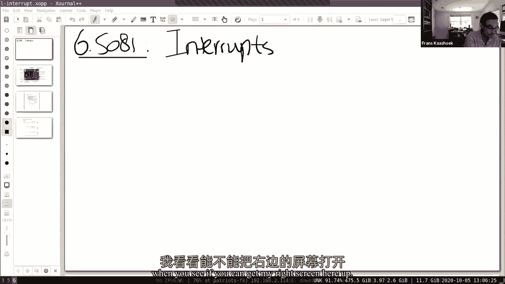
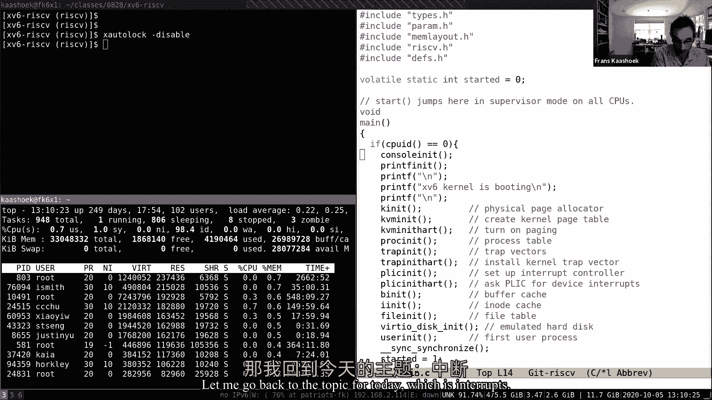
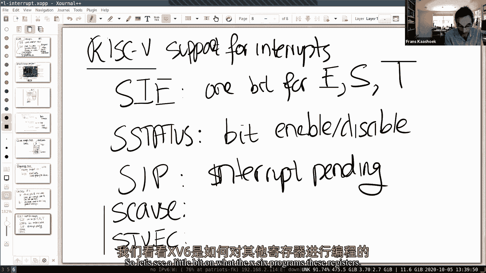
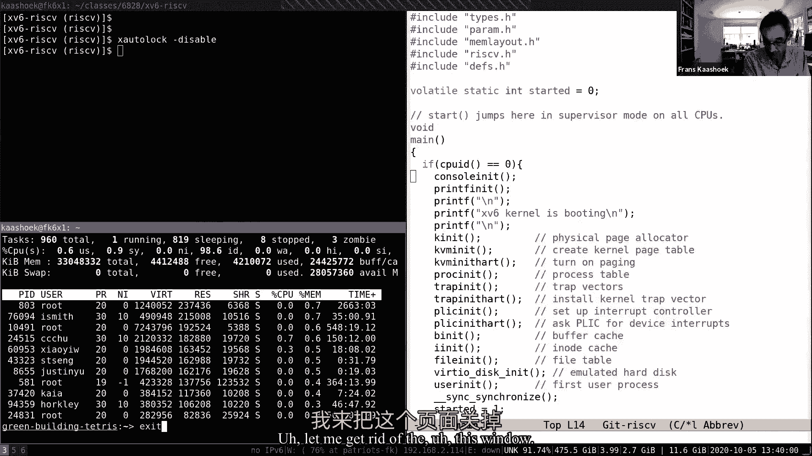
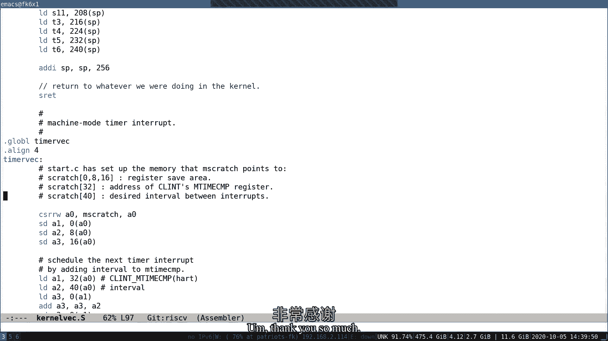

# 课程 P8：Lecture 9 - 中断 🚨

在本节课中，我们将要学习操作系统中的中断机制。中断是硬件设备通知CPU需要处理某些事件的一种方式，例如键盘输入或网络数据包的到达。我们将了解中断的来源、硬件与软件如何处理中断，并通过一个具体的案例——在控制台上打印字符——来深入理解整个过程。

---

## 操作系统内存使用情况概览

在深入讨论中断之前，我们先回顾一下操作系统如何使用内存。上周我们讨论了分页和寻找空闲内存。观察一台运行中的机器（例如通过 `top` 命令），你会发现大部分物理内存并非被应用程序占用，而是被缓冲区缓存（buffer cache）使用。操作系统会尽量利用物理内存，因此空闲内存通常很少。这意味着当应用程序或内核需要内存时，可能需要驱逐（evict）一些现有内容。

此外，每个进程的驻留内存（实际使用的物理内存）通常远小于其虚拟地址空间。这是虚拟内存技术（如按需分页和共享库）带来的好处。

---

## 中断的基本概念

上一节我们介绍了操作系统的内存管理，本节中我们来看看中断。中断的基本思路很简单：在某些情况下，硬件需要引起CPU的注意。例如，网卡收到数据包或键盘被按下时，会产生中断。CPU需要暂停当前工作，保存现场，运行中断处理程序，然后恢复之前的工作。

这种保存和恢复的机制，与系统调用（trap）和页面错误（page fault）非常相似。然而，中断有几个关键不同点：

1.  **异步性**：中断的发生与当前CPU上运行的进程可能无关。系统调用发生在当前进程的上下文中，而中断处理程序则可能在完全不同的上下文中运行。
2.  **并发性**：产生中断的设备与CPU是并行工作的。例如，网卡在独立处理网络流量，CPU在执行其他任务，当中断发生时，两者需要协调。这是我们讨论并发性的起点。
3.  **设备编程**：每个外部设备（如网卡、UART串口）都有自己的编程手册，描述了其寄存器和操作方式。编程设备通常涉及对内存映射I/O地址进行读写。

本节课，我们将重点关注外部设备中断，并通过一个简单目标来理解其机制：理解如何在控制台上打印出 `$` 这个字符。

---

## 中断的来源与硬件路径

中断从哪里来？本节课重点讨论外部中断，它们来自主板上的各种设备。在我们的RISC-V开发板上，有网卡、UART串口、SD卡等多种设备，它们都有线路连接到CPU。

具体到硬件细节，所有设备的中断线首先连接到一个叫做**平台级中断控制器（PLIC）**的组件。PLIC负责管理来自不同设备的中断请求，并将它们路由到合适的CPU核心。每个CPU核心都可以独立配置是否接受中断。

当设备产生中断时，PLIC会标记该中断为“待处理”（pending）。如果某个CPU核心启用了中断并且可以处理，PLIC就会将中断递交给它。该核心会“认领”（claim）这个中断，处理完毕后通知PLIC，PLIC随后可以传递其他中断。

---

## 软件层面：驱动程序结构

管理设备的代码被称为**驱动程序**。在像xv6这样的操作系统中，驱动程序代码位于内核内部。

典型的驱动程序结构分为两层：
*   **顶层**：提供与内核其他部分或用户进程交互的接口。例如，当`write`系统调用向控制台写入时，会调用驱动程序的顶层代码。
*   **底层（中断处理程序）**：当中断发生时自动调用的代码。它不在任何特定进程的上下文中运行，因此受到一些限制（例如，不能直接调用`copyout`，因为当前页表可能不相关）。

这两层通过一个**共享的数据缓冲区**进行解耦，允许设备与CPU并行工作。驱动程序的代码量通常非常庞大，因为需要支持众多硬件设备。

---

## 设备编程：内存映射I/O

编程设备通常通过**内存映射I/O**来完成。设备控制器寄存器被映射到物理地址空间的特定位置。操作系统通过向这些地址执行普通的加载（load）和存储（store）指令来读写设备寄存器，从而控制设备。

例如，UART芯片的寄存器被映射到特定的物理地址。写入“传输保持寄存器”会发送一个字节；读取“接收寄存器”会获取一个字节。设备文档会详细说明每个寄存器的每位含义。

---

## 案例研究：打印“$”字符

现在，我们通过Shell打印`$`提示符的完整过程，来串联理解上述机制。

**1. 初始化设置**
*   内核启动时，在`start.c`中配置CPU进入监管者模式（S-mode），并设置监管者状态寄存器（`sstatus`）以**启用中断**。
*   初始化UART驱动程序（`uartinit`）：配置UART芯片（如波特率），并**启用其发送和接收中断**。
*   配置PLIC（`plicinit`）：告知PLIC我们关心哪些设备（如UART）的中断。
*   每个CPU核心单独调用`plicinithart`，表明自己愿意处理这些中断。
*   调度器运行前，通过设置`intr_on()`函数启用CPU核心的中断使能位。至此，中断体系准备就绪。

**2. Shell发起写入**
*   Shell进程执行`write(2, “$”, 1)`系统调用。
*   内核中，`sys_write`根据文件描述符找到控制台设备，调用其`write`函数（驱动程序的顶层）。
*   `consolewrite`将字符`$`放入UART的**传输环形缓冲区**，并调用`uartstart()`尝试启动发送。
*   `uartstart()`检查设备是否空闲，如果空闲，则从缓冲区取出`$`，写入UART的**传输保持寄存器**。硬件UART芯片随后开始自动将该字节发送到串行线上。
*   完成这些操作后，系统调用返回，Shell进程回到用户空间继续执行（例如，可能马上调用`read`等待输入）。

**3. 中断的发生与处理**
*   UART芯片完成一个字节的发送后，会**拉高中断线**。
*   PLIC将中断路由到一个启用了中断的CPU核心。
*   该CPU核心的硬件响应：
    *   清除中断使能位（防止嵌套中断）。
    *   将当前程序计数器（PC）保存到监管者异常程序计数器（`sepc`）。
    *   跳转到预设的陷阱处理入口地址（`stvec`），最终进入`usertrap`或`kerneltrap`。
*   在陷阱处理程序中，代码检查发现是外部中断，于是调用`plic_claim()`获取中断号。
*   发现是UART中断号，调用`uartintr()`（驱动程序底层）。
*   `uartintr()`检查中断原因。因为是发送完成中断，它调用`uartstart()`。此时，如果传输环形缓冲区中还有字符（例如Shell可能又写入了空格），`uartstart()`会将下一个字符写入UART寄存器，从而启动下一次发送。如果缓冲区已空，则什么也不做。
*   中断处理完毕，恢复之前保存的现场，被中断的Shell进程（或内核代码）从原地继续执行。

**4. 读取输入的处理**
打印是发送，读取是接收，机制对称：
*   Shell调用`read`系统调用从控制台读取。
*   驱动程序的顶层`consoleread`发现输入环形缓冲区为空，于是让Shell进程**睡眠（sleep）**。
*   当用户在键盘按下‘l’键，UART收到字节，产生接收中断。
*   中断处理程序`uartintr()`从UART寄存器读取字符‘l’，并传递给`consoleintr`。
*   `consoleintr`将字符‘l’回显到控制台，并放入输入环形缓冲区。
*   然后，它**唤醒（wakeup）** 正在睡眠等待输入的Shell进程。
*   Shell被调度运行后，从缓冲区中取出字符‘l’并返回给用户程序。

---

## 关键概念与挑战

**1. 生产者-消费者模型**
驱动程序中的环形缓冲区是典型的**生产者-消费者**模型。
*   **写操作（输出）**：Shell是生产者，向缓冲区填字符；UART中断处理程序是消费者，从缓冲区取字符发送。
*   **读操作（输入）**：UART中断处理程序是生产者，将收到的字符放入缓冲区；Shell是消费者，从缓冲区取字符。
缓冲区解耦了生产者和消费者的速度，使它们能并发执行。

**2. 并发控制**
中断引入了真正的并发：
*   设备与CPU并行运行。
*   驱动程序的顶层（被系统调用触发）和底层（被中断触发）可能同时在不同CPU核心上运行，并访问**共享的环形缓冲区**。
*   内核代码本身也可能被中断打断。

为了保证数据正确性，必须使用**锁（lock）** 来对共享缓冲区的访问进行序列化。例如，在`uartputc`和`uartintr`中，都会先获取UART的锁，再操作缓冲区。`sleep`和`wakeup`机制用于在缓冲区满/空时进行等待和通知，它们也需要与锁小心配合。

**3. 轮询与中断**
对于极高速度的设备（如高性能网卡），中断处理开销（保存/恢复现场）可能变得不可接受。此时，驱动程序可能会采用**轮询（polling）** 模式：CPU主动反复检查设备寄存器，而不是等待中断。现代高性能驱动通常会动态地在中断和轮询模式间切换。

---

## 总结

本节课中我们一起学习了操作系统中的中断机制。我们了解了中断的异步和并发特性，以及它如何通过硬件（PLIC）和软件（驱动程序）协同处理。通过分析打印“$”字符的完整路径，我们看到了：
1.  驱动程序如何通过**内存映射I/O**编程设备。
2.  如何通过**环形缓冲区**和**生产者-消费者模型**来解耦设备与CPU。
3.  **中断处理程序**如何响应硬件事件，并与驱动程序的**顶层代码**并发执行。
4.  使用**锁**来保护共享数据结构，以及使用**sleep/wakeup**进行同步的必要性。

中断是操作系统管理硬件并实现并发的基石。理解它对于掌握后续关于锁、调度和进程通信的内容至关重要。