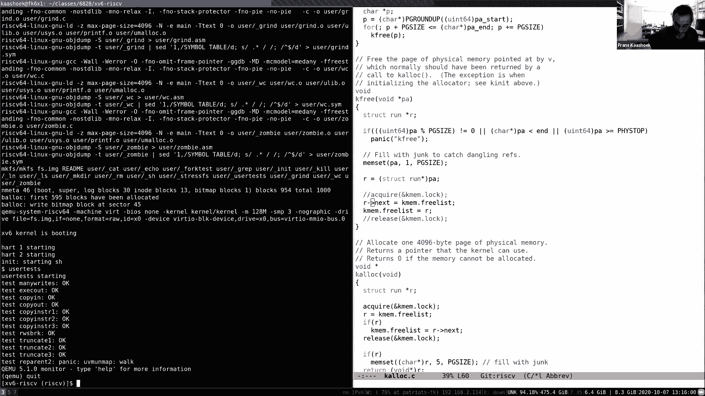
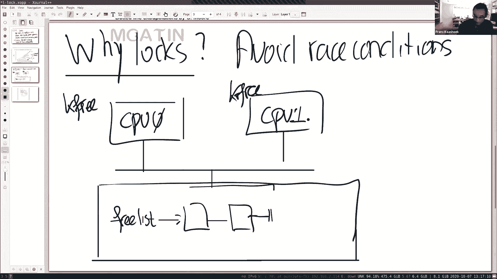
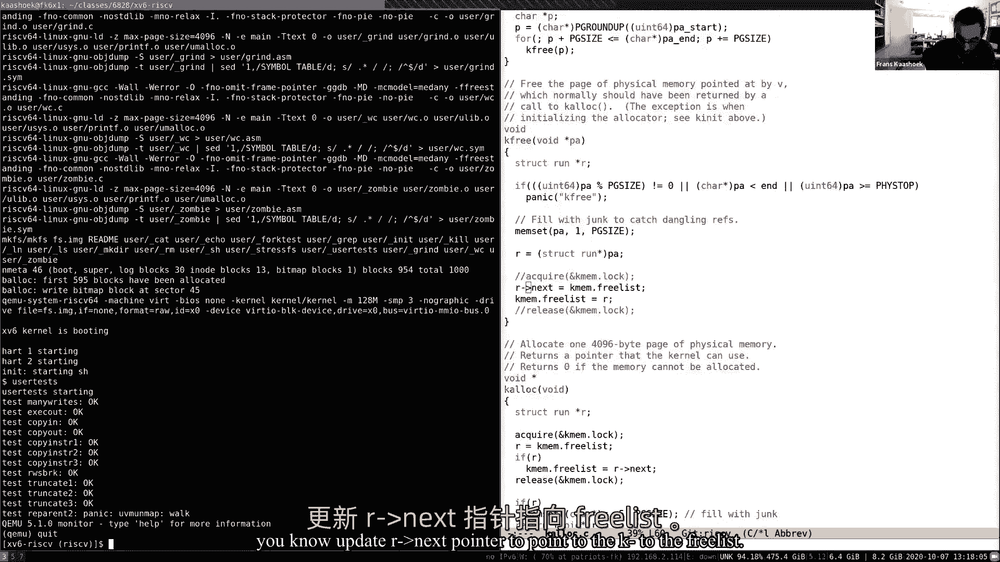
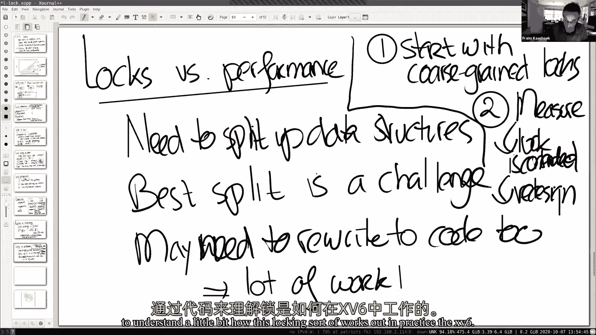
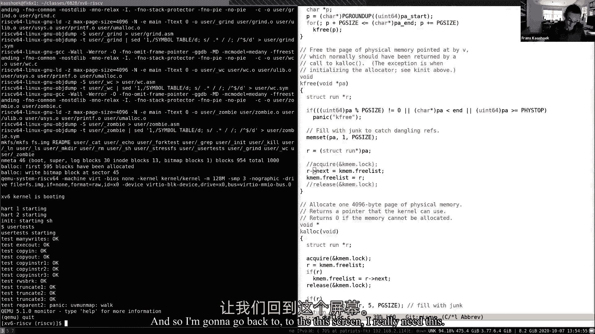
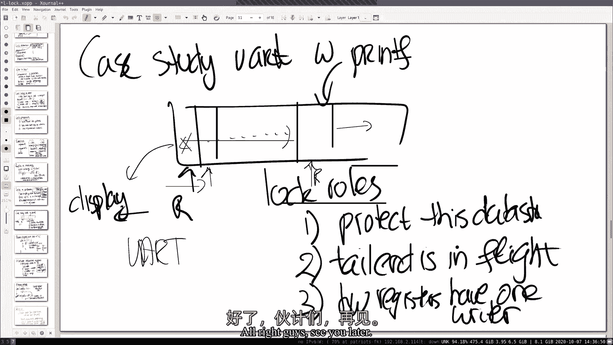

# 课程 P9：第10讲 - 多处理器与锁 🔒

在本节课中，我们将要学习多处理器系统中的锁。锁是协调多个处理器（或核心）访问共享数据结构的核心机制，对于保证操作系统的正确性至关重要。我们将探讨为什么需要锁、锁的基本概念、如何正确使用锁以及锁实现中的一些关键细节。

---

## 为什么需要锁？🤔

上一节我们介绍了多处理器系统的背景，本节中我们来看看为什么在这样的系统中锁是必不可少的。


我们的出发点是希望使用多个核心来提升性能。即使应用程序本身想在多个核心上运行，当它调用系统调用时，内核也必须能够处理这些来自不同进程的、可能并行发生的调用。这意味着，如果系统调用在不同的进程上并行运行，它们实际上可以访问许多共享的内核数据结构。

如果你有一个共享的数据结构，其中一个核心是写入者，另一个核心是读取者，我们就需要一种机制来协调这些更新，以保证数据的一致性。锁就是用来控制对共享数据结构的访问，以确保正确性的。



这有点令人沮丧，因为我们追求并行性以获得性能，但为了正确性又不得不引入锁，而锁本质上会序列化操作，从而限制性能。但这是我们必须面对的现实。




---




## 锁的基本概念与抽象 🧱


锁是一种抽象，它就像一个内核中的对象。在 xv6 中，有一个 `struct lock` 结构体来保存锁的状态。它有一个非常简单的应用程序接口（API）。

以下是锁 API 的核心调用：
*   `acquire(struct lock *lk)`: 获取锁。
*   `release(struct lock *lk)`: 释放锁。

锁的基本规则是：在任何一个时间点，只有一个进程能够成功获得这把锁。任何其他试图同时获取这把锁的进程都必须等待。

在 `acquire` 和 `release` 调用之间的代码序列被称为**临界区**。临界区内的指令需要原子地（即不可分割地）执行，以避免多个执行流交错访问共享数据，这正是锁用来避免竞态条件的原因。

---

## 一个竞态条件的例子 ⚠️

让我们通过一个具体的例子来理解没有锁时会发生什么。在 xv6 的内存分配器中，有一个函数 `kfree` 负责释放页面并将其放回空闲链表。

以下是 `kfree` 函数中更新空闲链表的关键代码（简化）：
```c
// 假设 r 是要释放的页面
r->next = kmem.freelist; // 步骤1：更新 r 的 next 指针指向当前空闲链表头
kmem.freelist = r;       // 步骤2：更新空闲链表头指向 r
```

如果没有锁的保护，考虑两个 CPU（CPU0 和 CPU1）几乎同时调用 `kfree` 释放不同的页面：
1.  CPU0 执行步骤1，将其页面 `r0` 的 `next` 指向当前空闲链表头。
2.  几乎同时，CPU1 执行步骤1，将其页面 `r1` 的 `next` 也指向当前空闲链表头（此时链表头还未改变）。
3.  接着，CPU0 执行步骤2，将空闲链表头更新为指向 `r0`。
4.  然后，CPU1 执行步骤2，将空闲链表头更新为指向 `r1`。

最终结果是，`r0` 页面从空闲链表中丢失了，因为链表头最终指向了 `r1`，而 `r1` 的 `next` 指向的是旧的链表头，而不是 `r0`。这就是一个典型的“丢失更新”竞态条件。

使用锁可以将这两个步骤包装成一个原子操作，从而避免这种交错执行。

---

## 锁的粒度与性能权衡 ⚖️

既然锁这么重要，一个直接的想法可能是为每个共享数据结构自动关联一把锁。但这在实践中可能过于严格，甚至导致错误。

考虑一个 `rename` 系统调用，它将一个文件名从一个目录（D1）移动到另一个目录（D2）。如果采用自动锁策略，我们可能会：
1.  锁住 D1，删除文件名。
2.  锁住 D2，添加文件名。

问题在于，在步骤1和步骤2之间，文件看起来好像不存在了，即使重命名操作尚未完成。正确的做法是在操作开始时同时获取 D1 和 D2 的锁，然后执行删除和添加操作，最后再释放两把锁。这说明，有些操作需要同时持有多个锁，锁不能简单地与单个对象自动绑定。

锁的粒度选择是一个重要的设计决策：
*   **粗粒度锁**（如大内核锁）：简单，但严重限制并行性。
*   **细粒度锁**：可以提高并行性，但设计复杂，容易引入死锁等问题。

一个实用的建议是：从较粗粒度的锁开始，通过测量锁的争用情况来判断是否需要以及如何重构为更细粒度的锁。

---

## 锁的挑战：死锁、顺序与模块化 🚧





不正确或不谨慎地使用锁会引入新的问题。

**死锁**：最简单的死锁是同一个进程试图两次获取同一把锁。更复杂的情况涉及多把锁。例如，进程 P1 按顺序获取锁 A、B，而进程 P2 按顺序获取锁 B、A。如果两者同时执行，就可能陷入互相等待的“死锁”状态。

**解决方案**：为所有锁定义一个全局的获取顺序。所有需要获取多把锁的代码都必须按照这个全局顺序来申请锁。在上面的例子中，如果规定总是先获取 A 再获取 B，那么 P2 也必须按此顺序进行，死锁就不会发生。

**模块化挑战**：锁的顺序要求可能破坏模块的抽象边界。如果一个模块 `M1` 调用模块 `M2`，而 `M2` 内部使用了锁，那么 `M1` 可能需要了解 `M2` 使用了哪些锁，以确保在需要时能遵循全局锁顺序。这使得系统设计更加复杂。

---

## 锁的实现：从软件到硬件 💻

如何实现一个正确的锁？让我们先看一个错误的实现（自旋锁）：

```c
// 错误的 acquire 实现
void acquire(struct lock *lk) {
    for(;;) {
        if(lk->locked == 0) { // 步骤A：检查锁是否空闲
            lk->locked = 1;   // 步骤B：获取锁
            break;
        }
    }
}
```

这个实现的问题在于步骤 A 和步骤 B 不是原子操作。两个 CPU 可能同时看到 `locked == 0`，然后都执行 `locked = 1`，导致两者都认为自己获得了锁，违反了锁的互斥性。

为了解决这个问题，我们需要硬件的帮助。大多数处理器都提供**原子指令**，能在一条指令内完成“读-改-写”操作。在 RISC-V 中，这条指令是 `amoswap`（原子交换）。xv6 的 `acquire` 函数利用 C 标准库的 `__sync_lock_test_and_set` 函数，它最终会编译成这样的原子指令，确保检查和设置锁的状态是不可分割的。

---

## 锁实现中的关键细节：中断与内存序 🔩

在实现锁时，还需要处理两个关键问题：

**1. 中断处理**：
如果在一个 CPU 上，进程在持有锁的期间被中断，而中断处理程序也试图获取同一把锁，就会导致死锁（该 CPU 在等待自己释放锁）。因此，在 xv6 的 `acquire` 函数中，会在获取锁之前**关闭中断**，并在 `release` 释放锁之后再打开中断。

**2. 内存排序**：
编译器和处理器为了优化性能，可能会对指令进行重排序。在单线程执行中，这没有问题。但在并发环境中，这可能导致灾难性后果。例如，编译器或 CPU 可能将临界区内的某些内存访问移到 `acquire` 之前或 `release` 之后，从而破坏保护。

为了解决这个问题，需要在代码中设置**内存屏障**（或称为内存栅栏）。xv6 在 `acquire` 和 `release` 中使用了 `__sync_synchronize()` 函数，它告诉编译器和硬件：在此屏障之前的所有内存操作必须完成后，才能执行屏障之后的操作。这确保了临界区内的访问被正确地限制在锁的保护范围内。

---

## 案例研究：xv6 中的 UART 驱动锁 📠

让我们看一个 xv6 中使用锁的具体例子：UART（串口）驱动。UART 驱动使用一个传输缓冲区和一个锁（`uart_tx_lock`）。

锁在这里保护几个不变量：
1.  缓冲区本身：写索引（`uart_tx_w`）和读索引（`uart_tx_r`）之间的数据是待发送的字符。
2.  硬件寄存器：确保只有一个执行流（可能是进程调用 `printf`，也可能是中断处理程序）在任何时候向 UART 的发送寄存器写入。

由于中断处理程序可能与进程并发执行（在不同的 CPU 上），它们也需要获取同一把锁。这展示了锁如何协调驱动程序的上半部分（进程调用）和下半部分（中断处理）。

---

## 总结 📝

本节课中我们一起学习了多处理器系统中的锁。
*   **锁的核心作用**是保证对共享数据结构访问的正确性，避免竞态条件。
*   **锁的抽象**通过 `acquire` 和 `release` 操作定义临界区。
*   **使用锁的挑战**包括在性能（并行性）和正确性之间权衡、选择锁的粒度、避免死锁以及处理模块化问题。
*   **锁的正确实现**依赖于硬件的原子指令，并需要仔细处理中断和内存排序问题。




锁是并发编程中的基础工具，虽然会引入复杂性，但它是构建正确高效的多核操作系统不可或缺的组成部分。在后续的课程和实验中，我们将继续深入探索锁的使用与设计。