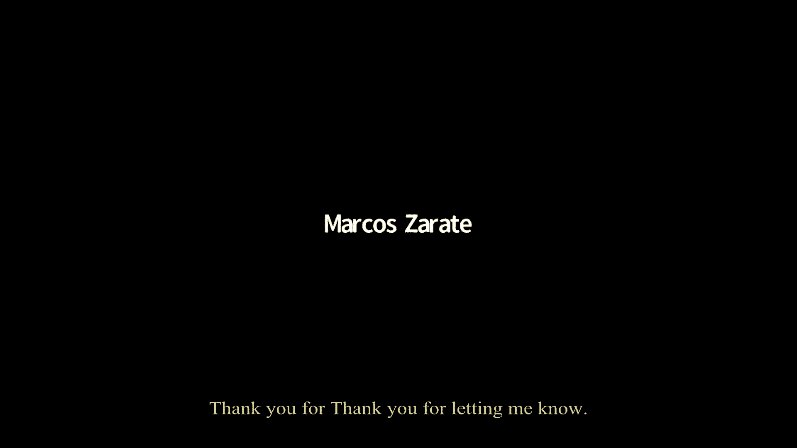

# 【操作系统工程】精译【MIT 公开课 MIT6.S081】 - P11：Lecture 12 - Q&A #2 (COW lab) 英文版 - MCATIN-麦可汀留学 - BV1rS4y1n7y1

好吧，早上好或下午好，各位，我们开始吧，有人能听到我吗 谢谢好的 今天，我想做的是给你一个提问的机会，关于第六区和最近的实验室，为了给我们一些可谈的东西，我会尽我所能，抄写叉子实验室给我们。

一些可以咀嚼的东西，你可以随意问任何你想问的问题，你可以问为什么我的解决方案与你的解决方案不同，或者是6的工作方式，为什么我们会遇到虫子，以他们的方式出现，只是想提醒你，虽然我肯定这是。

当然我不需要提醒你，你知道复制和编写 fork的目的是为了避免页面的复制成本，在一个从未被修改过的叉子里，嗯，我写了几行代码，减少 mem在用户测试期间必须复制的字节数，为了我的副本和正确的解决方案。

发现它实际上减少了百分之九十的复制量，这是用户测试用的，是个很奇怪的程序，但尽管如此，嗯，我认为很大程度上是减少了，所以复制指令页，因为 for的指令页从未被修改过，所以把它们的副本。

我想那就是风很大的地方，我在复制，右叉也减少了公羊的使用，你需要使用的最大数量的公羊，而且它减少了你花在叉子上的时间，所以叉子回来得更快，你知道吗，另一方面，当然，总成本可能更大。

因为如果程序最终修改了所有的复制和编写页面，你最终不得不做所有的副本，并承担所有的页面错误，可能有点贵，但尽管如此，人们发现总的来说，这是一个净好处，如你所知，主要的挑战是如何避免释放记忆。

现在我们在进程之间共享页面，你不能释放他们，必须在使用它们的最后一个过程完成之前 不要释放它们，所以我们需要更多的记账，另一个有趣的挑战是，尤其是，xv 6修改了用户的内存。

而不需要用到MMU的分页硬件，所以我们要模拟页面错误，我要去检查实验室，从头开始，4。在我开始工作之前，先去影写室看看，我只想提一下 我认为自己遵循的策略，当我做实验室的时候，我做了很多实验。

你知道从一年到一年，我不记得如何做实验室的细节了，另外，实验室也变了，所以当我做实验的时候，我总是迈出一小步，我可能会发现你知道这个问题的下一个子集要解决，可能有五到十行代码，我把它编好了，我运行它。

并试图让它工作之前，我继续下一个，进入下一步，你知道相对于，例如，思考并写出完整的解决方案，在开始测试和调试之前，我总是一次测试和调试一点，其中很大的原因是 即使你可能，你可能考虑过很多事情。

很多挑战和设计，为了解决实验室的问题，我发现至少经常会有惊喜，所以如果我先实现一切，我可能会发现我浪费了很多时间，因为我没有完全理解这个问题，直到我真正开始调试它，我选择下一步的方式。

在每一点上通常都是由恐慌、崩溃或测试失败驱动的，我看到下一种告诉我 接下来我需要修复什么，当我做这个实验的时候，我会，我会犯一些上次犯的错误，我做了实验，嗯，一起调试 一遍又一遍。

任何时候都可以随意闯入，问任何问题，我从一份新的拷贝开始写实验室资料，就像你们一样，我把它点燃，运行复制和写入测试，你也知道，也许我会走运，所有的测试都会通过，我什么都不用做，太可惜了。

其中一个测试失败了，好的，所以不足为奇，你知道吗，在这一点上，一个好的步骤是去，看看测试，弄清楚它想做什么，可悲的事实是，有些测试很复杂，很难理解，也不一定要测试任何特定的东西。

他们只是尝试不同的东西来看到，如果有什么东西坏了，但幸运的是 通过这个简单的测试，嗯，很清楚它在做什么，让我们回答一个问题，是啊，是啊，你的意思是要分享你的屏幕，你什么也看不见，天啊，我很抱歉，谢谢。

谢谢你让我知道，这样好点吗？是的，好的太棒了，好吧，好的，好吧，这是第一个错误，好的，所以我就，这里，2。我正在进行笔试，我做了复写测试，它失败了，我看着考卷，右边屏幕上的这个简单测试实际上失败了，嗯。

而这个测试，呃，幸运的是，它实际上告诉我们它在做什么，并分配它所知道的超过一半的，可用内存和 xv6，然后是叉子，所以，当然，这个失败的原因是fork复制了，普通的 xp6实际上是在复制。

所以如果我们要复制超过一半的记忆，只是没有足够的空间，好的，当然这就是版权的意义所在，我们知道最基本的游戏不是复制 而是记忆，我们要复制它的页表，而不是记忆，所以孩子只需要复制父母的页表，代替记忆。

我指的是所有相同的物理页面，在那里，fork做它的复制是在 vm c在 uvm复制，所以我们可以修改这个代码，嗯，而不是在这里分配一页内存并复制到上面，我们要消除这三条线，相反，只需复制页表条目，嗯。

我正准备破解这个，因为我们实际上并没有在这里分配内存，我要把这个免费处理掉，我得把这个 mac页面修复到，地址 i，我要在地图上标出，它的实际地址是，明白了吗，这将只是有。

将所有父页面映射到儿童地址空间的效果，是不是爸爸，已经64岁了，U，或者如果你把它，如果已经是那种类型，演员阵容除了关闭编译器之外 什么也不做，因为地址已经是64位了，你想要六十四，六十四位。

那个石膏不会改变位，它只是减少了类型检查的设置，我看看，我其实不知道，这些类型中的任何一种都是，一件事是，我们不需要这个成员变量，好吧，好的，所以你对爸爸的看法是对的，天啊，我想知道我们现在是否结束了。

让我们做奶牛测试，看看会发生什么，他们肯定还没做完，好的，所以我们得到的是这个用户陷阱有两个原因，有谁记得2是什么原因吗？我只想告诉你 这是个非法的指示，为什么我们现在收到非法指令。

这就是我们所期望的吗？我们覆盖，呃，它们就像我们有指示的部分，是的，有东西破坏了用户程序的指令，当然我们并不惊讶，我们在这里得到了一个错误，但我们希望正确，恢复故障以驱动复制过程并正确复制。

我们没有得到商店，故障，对此有其他假设吗，这真的不公平，因为这是我的错误，不是你的虫子，但尽管如此，一定要把旗子，是的，是的，好的，所以我就把它放在一边，我真的会再上来的，嗯，另一个问题是。

我们希望存储页面错误，这将驱动复制过程，为什么我们没有商店的页面，断层，嗯，为什么会出现页面错误，风险五在什么情况下会产生存储页面错误，如果没有设置正确的旗帜，我们就会得到它，但现在我们可以写信给一切。

是啊，是啊，我把右边的旗子挂好了，这是我上次做这个实验时做的，所以我把右边的旗子放在了父母身上，我做到了，这里的标记变量是，只是我们把它从家长页表里拿出来的方式，它的所有页面都是可写的。

所以这意味着它就在孩子身上，也是，我们不会得到存储页面错误，所以我只是分享一个页面，读，写，这不是我们想要的，我要怎么关掉，呃，我该怎么写，保护这些页面，任何建议，我应该打什么，哦耶，是啊。

所以我们得到了，我们需要波浪，在那里，我把这个叫做波号，波浪，我们需要海浪，那个，很明显我们需要清除旗子上的这一点，但我们想把所有其他的旗子都设置好，好的，所以这很清楚，儿童，只是孩子，那我该怎么澄清。

做，我还需要清除父母的标记，所以如果我们写一些东西，我们不想，喜欢的孩子也得到了修改 从，完全正确，我们需要写，保护页面和父页面，因为我们不想让孩子看到父母修改，我们试图模仿他们。

那么我该怎么做才能清除家长页表上的标记呢？你可以做一些类似 star pte和 equals not pte的事情，对，是啊，所以我让父母给了一个指针，家长页表条目就在 pte这里，所以这很方便。

我相信这足以让这一页的两份副本，或者页面的两个映射，只这样读，希望我们现在能开始，率故障，是否也有可能在你说之前清除 ptw位，flags=pte，pg旗帜，这样就像最初的旗帜一样是正确的，哦。

我看到你被关在这里，是啊，是啊，好吧，我试试看，好像有用，是啊，有道理，好的，所以现在我得到了我的正确错误，我们希望，希望，这个错误意味着什么，另一个进程试图修改页面，风险五由此产生了一个页面错误。

对此我们会做出反应，制作一个页面的副本，并映射它所阅读的内容，写之前，我们这样做，只是为了确保我们所看到的，你知道这个这个这个这个，这是因为，这让我想象我们看到的是我们想看到的，也就是一个商店倒下了。

让我们去看看发生在哪里，我们知道正在进行的是什么，进程编号1是 init，进程 id 2是 shell，所以也许第三个过程会是奶牛测试，我们可以进去看看，我们可以在奶牛测试中寻找九天，看看作为一个。

可能生成存储页错误的指令，男孩，这个看起来还是那么好，我甚至不记得用户界面电脑是做什么的，但我不相信它能起到商店的作用，他猜测发生了什么，如果你看到的页面真的有意义就好了，我告诉你，呃，结果发现。

这个页面错误发生在shell fork之后的shell中，但在它执行奶牛测试之前，所以我们真的找错了，结果是正确的 asm文件，shell asm文件，所以在那找九达，哦是的，在外壳里98是储存 说明。

这是在开始，这个解析命令函数实际上解析，我们输入的cow测试命令，并计算出如何处理它，即调用 exec作为在堆栈中进行存储，它的序言储存了，毫不奇怪，至少这应该是我们得到的第一页，因为它在堆栈上。

你知道吗，大多数函数在 fork返回后做的第一件事，他们修改了堆栈中的变量，不出所料，会导致商店页面保险库，所以任何关于我们为什么出错的问题，我有个小问题，你是怎么知道它在贝壳里 而不是在奶牛测试里的。

因为我看了98和奶牛测试，这不是存储指令，我以为天哪，究竟发生了什么事，现在我看过程 id 3，是三吗？壳还是3是 p，二是打印提示 pid的外壳，三是下一个被创造出来的过程，所以最初的贝叉是三个。

但在叉子之后，它还在正确地运行外壳，它是一个外壳的孩子在运行一个外壳的副本，它会打电话给行政人员进行奶牛测试，但它没有做到这一点，然而，如果没有商店页面，它就无法走到这一步，断层，当它写一个堆栈。

所以你能澄清一下，这是否意味着在 shell中出现了与进程 id 2相关的错误，因为它没有正确的数据，为了让孩子有正确的数据，或者是社会三的错误，是进程 id 3中出现的页面错误。

但是我们现在看到的虫子，就像没有虫子，这是，你知道吗，我在写 fork上实现副本，我们刚才在虚拟机里做的，C是对的，保护父节点和子节点中的每一个页面，这就是这条线的作用。

下一次父或子从用户代码中进行存储时，它将被存储到一个受写保护的页面中，因为每个页面都受到了正确的保护，所以它会导致页面错误，哦，所以这是我们想要的正确的页面错误，这是正确的，我只是我在做什么，我在检查。

正在发生的事情 正是我们认为正在发生的事情，与其他一些错误相反，有道理，好的，好吧，所以我们在这家店里犯了一个页面错误，这大概是继叉子之后 贝壳的第一次储存，好的，所以现在我们要处理这些，呃。

现在你想做一些有用的东西 在这个页面错误，所以按下页面错误处理程序和和陷阱 c，我认为我们在哪里插入代码并不重要，我是说这里有很多不同的案例，用户 vec就是用户 vec，对，是啊，或用户陷阱。

用户陷阱正在处理，我们再加上一个，我们只对写错误感兴趣，我们很高兴阅读这些共享的页面，因为所有的数据都在那里，你只是想抓住，所以，结果是你，我相信你知道我们需要使用代码，我要从两个不同的地方写信，嗯。

在函数中复制这个页面，我觉得是奶牛的错，它需要知道当前的页表，它需要知道我们弄错的虚拟地址，那是圣瓦尔，有时会失败，因为说它耗尽了记忆，也许朝超平等会失败，所以我们需要准备一个返回值，不管失败是什么。

我们要终止这个过程，如果我们不杀死它，我们将有奶牛故障返回负1，如果失败了，归零，如果没有失败，没有失败，我们要依靠牛的断层，使这个虚拟地址可写之后，当用户陷阱返回时，这个过程实际上可以成功地继续下去。

所以我们认为你把，你为什么把这条线放在其他线上面，如果哪个 dev deventer，它是否正确 取决于德文特做了什么，我们去看看，风险是德文特可能，看到设备因某种原因中断，即使我们在页面错误。

所以我们只需要检查一下，看原因，如果 s引起 f，它将返回零，所以，只是想确定 如果，是啊，如果 dev返回零，然后它就会继续我们的烹饪，所以没关系，好的，好的，现在我们需要写，嗯。

实际上我想在这里观察一件事，如果失败了，我们扼杀了这个过程，这是不幸的，如果换成，你知道吗，但是大多数时间进程通过调用系统调用来分配内存或其他什么，系统调用可以返回一些错误值，如果失败了。

然后这个过程可以做一些适当的事情，如果它知道如何，为了解决这个问题，虽然，因为没有系统调用，没有任何明显的方法可以告诉过程出了问题，令人恼火的是，你可以想象解决这个问题的方法，例如。

在一些更复杂的操作系统中，我们可以有类似警报用户错误处理程序的东西，你实现了，我们可以打电话来说，你看，你知道吗，我们不能继续你的进程，因为我们不能修复这个页面错误，但我们想告诉你出了问题。

我们现在不打算这么做，直接终止这个过程要简单得多，好的，所以我们要实施这个奶牛故障程序，嗯，它需要一个，我要一张页表，当前进程页表是参数，以及发生故障的虚拟地址，嗯，好的，所以我们要担心的第一个问题。

当处理像这样的用户程序产生的虚拟地址时，如果是个疯狂的地址，就像在过程的顶端，或者是陷阱里的地址，或者在蹦床页面，或者在页面中的堆栈保护页面，所以有没有人能勾勒出，呃，保护自己不受用户过程的影响。

故意在疯狂的地址上出错，是不是有一个最大的虚拟地址，是的，是的，有，这实际上会出现，但是用户地址空间的顶部在下面，类似于堆栈保护页，我们不应该允许的权利，当然不应该被当作是复制品和正确的东西，我会的。

我在这里展示一个解决方案，我们现在要走了，有一件事可能会出错，那就是走路，找不到页表条目，因此对于大多数进程可能引用的非法页面，没有 P，只有少数例外，所以如果我们发现，如果我们探测到，那就找不到了。

从炒锅返回值，返回值为负1，几乎每个案子我们都处理过，据我所知 唯一的案子，其中 walk将返回页表条目，但我们不想让它的权利，或者为了蹦床，陷阱框架和堆栈保护页，所有的都是透明的。

所以我检测疯狂地址的方法，非法地址是通过检查 ptu是否被设置，还有，呃，只是为了结账，你看，呃，PT，如果其中任何一个是明确的，我们就知道这就像，不是一个好的地址，我们只返回负1，所以停止这个过程。

所以我相信你会照顾好所有，用户进程可能使用的非法地址，尝试使用所有权利，我们怎么才能知道我们现在要做一个副本，我们想让这个过程成为页面的副本，我们如何找到要复制的页面，我有个问题，请，嗯，使用钚的策略。

如果这一页，如果有的话，如果这是一个合法的复制和写作页面，从长远来看，这种策略难道不是很好吗，也许你可以添加一些其他的，地址空间的 um部分，它应该是可以写的，嗯，它们只能被认为是可读的。

但这在这里没有得到照顾，因为你必须再次回到这里，你说的完全正确，如果我们要添加任何其他有趣的分页功能，你知道就像，可能是懒惰的页面分配，例如，嗯，我们得重新考虑这些决定，想出一些其他的策略来决定。

这是抄写页吗？这是一个懒惰的分配页面吗，这是分页到磁盘的页面吗？这是一个内存映射文件，我们需要更复杂的，你知道吗，与，最后，我认为大多数严肃的操作系统实际上都有自己的数据结构，一点关系都没有，你知道吗。

不是页表，但是类似于描述过程的分页表，地址空间，描述了每一页的含义和状态，我们得看看那张桌子，但对于这个实验室来说，因为我们没有其他的特征，我们不确定他们会是什么，嗯，我要做一些简单的事情，事实上。

我们必须回来修复它，如果我们把 xv 6变得更复杂，会不会恐慌，如果va比max va更多，因为步行，相信我，你会的，现在我们来看看，是啊，如果这个过程，是啊，我觉得你说的对，太可惜了，好的。

所以我们肯定你是对的 好吧，好吧，我是我错了关于这个等待，你能把一个否定的，如果你看看地图，我想我的观察是，如果用户试图故意编程，试着写一个很大的地址，当然，你知道我不能指望活下来，但我们现在要做的是。

带着很大的地址散步，我看着这里，实行走进来，会引起恐慌，我想我们可以，只是，呃，使用与步行地址相同的方法，那些我有同样的书，你只需返回负1，就像其他人说的，如果 va大于最大值，我感到不安的是。

测试似乎没有测试这一点，因为我没有把这个放在我的解决方案中，好的，嗯，好的，好的，所以嗯，我们怎么知道我们需要，我们要复制这一页，4。我怎样才能找到一个指针呢？指向某样东西，我可以复制。

pta two pa，是啊，所以，它只是在pte，嗯，我要去哪里复制呢？我应该抄什么？几乎被分配的页面，是啊，所以我就打电话给 k，当然 k i锁很可能会失效，所以我得知道我们真的要去看这个。

所以我要把打印蒸汽，所以我们知道，我其实犯了个错误，我想复制它 这样我们就能找到它，但你对我来说太聪明了，好吧，我想从1号拷贝到2号，好的，那么我怎么能，做什么，我需要做什么才能绘制这个页面。

这一新的页面，两个人进入，地址空间，我打的，就像两条百老汇，要么取消映射，然后用存在的内置映射，或者你可以操纵这些位，好吧，我懒得弄清楚如何在地图上和地图上使用 m，所以我要在这里做一个新的页表条目。

我有个问题，所以实际上我几乎在每个实验室都遇到过这个问题，其中我不知何故需要重新映射东西，嗯，因为它经常发生，我做了一个地图 基本上可以重新映射，我在想，这是个糟糕的设计选择吗，是不是很危险，哦不。

这是一个完全合理的映射，你知道吗，六维中的函数是，你知道专门为 xv 6，因为它存在，所以他们，你知道吗，他们对其他代码的工作方式做出假设，他们有恐慌心理，打算捕捉其他代码，以意想不到的方式使用它们。

但是如果你改变了 xv6的工作方式 你需要做不同的事情，那就完全有理由修改，你知道吗，哦，你需要能够在没有恐慌的情况下重新映射这个，老 xv6不需要这么做，您的代码做到了这一点。

所以您应该可以自由地修改您需要的任何东西，好的，所以好吧，所以我们这里有一个写保护页面，可能与另一个进程共享，在这一点上，我们要对另一个过程做什么，我们需要对另一个过程做什么，我们什么都不能做。

当页面出错时，我们分配一个新的页面，删除原来的页面，这是绝对正确的，所以你可以想象，但要正确地做到这一点 将是相当复杂的，所以我们什么都不做，如果另一个进程不能很好地写这一页，没问题。

如果它真的写了一页，它就会经历这一切，它会复制一份，它也会安全地进行，所以什么都不做是完全合理的，嗯好吧，所以现在我们要返回0的返回值，他说没有任何差错，希望这个过程，我们应该释放物理页面，对。

还是我们还没到那一步，不管我们是不是，嗯嗯我想如果我们要去步骤，我们不应该，是啊，所以如果我这么做了 会发生什么，我们一定会撞车的，好吧，所以我们不要这样做，或者我不知道我们是否会崩溃，但是嗯。

如果我们，如果我们释放了一个页面，大概是一个，因为我们最好有免费的两个，因为我们用的是 p2，如果我们释放一个，这意味着另一个过程有问题，它现在被映射到它的地址空间，并可能使用，你知道吗，执行指令。

或者我不知道我们刚刚释放的页面，可能是为了其他目的而重复使用，并在上面写了一些其他的东西，所以我不愿意释放它，尽管它是，哦耶，如此可悲，在许多其他事情中，六步走永远不会从 vm点 c之外调用。

一辆普通的 xv6，但现在我们正在做，还记得第一页吗，我们得到的是一个原因，为什么我们会因为两个页面错误，这是一个非法的指示，就像这是下一个问题，我们必须解决这个问题，现在哪里出了问题。

有哪些似是而非的猜测，因为可能出了什么问题，所以当我测试奶牛的时候，我们认为发生的是贝壳分叉 我们复制，右叉子，嗯是的，可能是商店故障，但是为了正确处理这些存储错误，然后孩子的高管。

shell高管的子副本，奶牛试验，这对父shell有什么不好的影响呢？当你打电话给主管，Exec的实施，呃，冻结所有的油漆过程，当前页面，分配新页 以将文件加载到所要求的文件中，孩子身上会发生什么。

当它释放所有页面时，孩子会准确地显示呼叫，这对父shell会有什么影响呢？会不会意外结束，对不起，会不会无意中释放了弹壳页页，是的，我们要把所有的弹壳页，除了上面写的那一两个，然后我们要重新分配它们。

他们会立即被高管重新分配，把其他的东西从文件里拿出来，我们正在做奶牛测试，所以它将完全改变脚下贝壳中的一切，不出所料，它会立即坠毁，所以我们不能释放那些页面，不知何故，每个人都认为一个很好的问题。

这里的 SCPC指向哪个程序集文件，你能在，你说是贝壳对吧，最后一次是因为其他原因，在别的地方是贝壳，这里是什么，我其实，不知道，我从来没有，不幸的是，我没有花时间追踪这个，任何答案都有一个问题。

即使我能给你一个答案，所以答案要么是蛋壳测试 要么是奶牛测试过程3，这又是，可能是奶牛测试，我不得不说，我不太清楚这里发生了什么，查看 asm文件不太可能有帮助，因为我们认为已经发生的问题。

因此他们没有执行指令，它已经不在美国犯罪调查局的档案里了，或者执行一些有意义的垃圾，是啊，所以我们可以看看地址104，但它，它不会告诉我们发生了什么，我们也许我们也许可以用调试器找到这个。

我们可以侵入全球动力数据库，再看说明书，它实际上是在任何虚拟地址，一千零四点快速跟进 关于那次摔倒的问题，所以我的理解是我们得到了一个无效的指令错误，因为我们要改变指令页 指令，脚底下的物理记忆。

就像记忆只是被写给，有没有可能，在某些幸运的情况下，它们正在被重写，但当我们再看的时候，它正在被重写为有效的指令页，所以我们开始执行随机指令，我们实际上并没有得到一个无效的指令错误。

我们得到了一些其他的错误，是的，绝对绝对绝对，是啊，是啊，我是说，真的，我们现在就像任何事情都可能发生，见，我就猜不到了，如果我没有做这个实验，我无法猜测在这一点上会出什么问题，事实上。

我想我已经看到了其他奇怪的事情发生在这一点上，可能是数据，可能第一页有垃圾，其实里面有数据，shell会访问一些完整的垃圾数据，就像一个堆栈 而不是指令，好的，所以我们不想马上释放页面，我们，你知道吗。

我们只想在页面真的不再使用的时候释放它，嗯，提出一种标准，当我们应该或不应该释放页面，每一页记忆，我们可以记录多少次，基本上只要在 k亚历克，无论何时 你应该增加或减少某种类型的变量，把所有不同的地址。

是的，是啊，我们可以这样想，我们只需要释放一个页面，当没有页表引用它的时候，但可能有很多，如果一个，如果一个程序分叉 然后再分叉，然后再分叉，男孩，我们现在可以有三四个不同的过程，都是由于复制而引用的。

把叉子写在这一页上，所以这个，你知道这个计数多少次，有多少页表引用一个页面 并由于 fork而上升，当进程退出或调用时，它们可以返回，Exec，嗯，你知道它清除了所有这些引用 从它的页表条目。

在这种情况下，我们少了一个参考，从一个少的页表引用到一个页面，所以我们要统计一下，我们要数数，计算引用页面的页表条目的数量，所以我们需要考虑如何保持这个计数，以及何时增加，在代码中的确切位置，增加它。

减少它，好的，所以，如果有，如你所知，有多种方法可以，保持这个计数，我做这件事的方式是，我做了一个叫 ref计数的数组，它只是会有它的每一页帐户，我们需要知道有多少条目，第六排的裁判数，它是如此简单。

它只是有它，只是使用固定数量的内存，物理记忆权利，我们只需要对每页物理内存进行计数，我们知道，从检查肯恩，XP6只使用了最大量的物理内存，我们只需要清点每一页，不是每字节。

所以我们要把汽水顶部除以4966，这就是我们需要多少数组元素，在一个更严肃的操作系统中，我们不知道有多少内存可用，在我们检查硬件之前，我们必须动态分配这个数组，有任何关于把计数放在哪里的问题吗，好吧。

嗯实际上是的，我在想，你为什么用46，而不是页面大小宏，是啊，原因是我能记住四十九六，我不记得页面大小宏的名字了，但如果你喜欢，我很乐意使用它，其实是，如果，如果 xp6是便携式的。

并且能够在各种不同的机器上运行不同的页面大小，我们得更加小心，但有500种情况下 XP6是完全不便携的，我不担心，空间大小由硬件决定，我猜在哪里，在硬件上 那是五本手册 说有多大的页面。

获取虚拟地址 并将其索引到页表中，哦对了，对，因为地址转换发生在硬件中，所以硬件必须知道页面有多大，好的，这是，它是可配置的，但你知道有几个不同的策略 你可以告诉硬件使用，但我们告诉它使用。

四千九十六字节页，好的，很抱歉问这个问题，呃，所以，在哪里？我想是个问题，所以在，哪里像，全局变量，我喜欢，它们与特定的过程有什么联系，或者这是内核，现在的情况是，可执行文件。

编译器和加载器或链接器生成，只是有点，嗯表示有多少日期，程序中所有全局变量的总大小，所以我们看不到这个的代码，但当 qmu加载内核时，好吧，实际情况是当你编译程序时，所谓的链接者根据它计算出。

查看所有的全局变量和它们的大小，在内存中分配一个地址，你知道吗，每个全局变量，这就是它生活在记忆中的地方，我们刚刚安排了，你知道吗，所以 xv 6内核使用，你知道吗，我不知道。

10000个字节的各种全局变量，无论在哪里启动进程 把它加载到内存中，说它地址一百万，只是，使用这些地址，对于全局变量，我明白了这和，磁盘上只有一个程序的指令副本，全局变量只有一个副本，关于这个节目。

好吧，好好编程，我不知道该怎么回答这个问题，我是说，当您声明像索引这样的全局变量时，当你编译，编译器和链接器，只要根据谁知道什么来决定，或者它是可配置的，但是他们决定了那个变量的地址，他们他们决定好吧。

男孩 x要去地址一千，然后读取写 x的代码，你知道，如果我们有代码说，你知道吗，参考计数为零等于一，你知道它被编译成什么 只是把内存设置在地址1000，或者我们逗留的任何地方。

它只是做一个存储来设置内存，它说的是千分之一，这是，不是，实际上发生的事情几乎和，当你运行一个普通的用户程序，是编译器里的链接器，决定全局变量在内存中的位置，他们就在那里，它就在工作，对不起。

这不是一个很好的解释，所以我们就，呃，定义此全局计数数组，每个物理页面一个，嗯，我们需要在不同的地方修改这些计数，当然当我们第一次分配一个页面，我们会说它有一个参考。

因为我们回到页面的其余部分给打电话的人，打电话给卡罗克的人，目前只有那个程序提到了这一页，所以我要去，成为一个，所以首先，我来计算页码，这一页的地址除以四千九十六，那是页码，然后我会设置页面的引用计数。

我们刚刚分配给一个，对这个代码有任何疑问吗，只是因为我知道我会有错误的参考计数，我实际上要在这里做一点理智检查，你知道，参考计数应该是零，如果我们分配的页面，它是免费的男孩，它最好有一个零的参考计数。

对这个代码有任何疑问吗，好吧，因此，一般来说，当我们添加一个，当 copy and write fork 添加指向现有页面的页表条目时，我们想减少参考计数，很多地方都发现，例如，当进程退出时。

当您调用exec时，我们需要减少所有页面的引用计数，这释放了所有当前的内存，因为它将取代它，当发生复制和写入页面错误时，我们希望减少所有这些引用计数，我们复制一份，我们想减少旧页上的引用计数。

结果发现这些都是当前释放页面的相同地方，因为当前的 xp6认为每个页面只有一个引用，因此，在大多数我们关心的地方，我们希望在哪里减少，目前有一种叫做 k自由，所以我要做的是修改 k自由，成为。

有一些不同的语义，为了自由，一种减少引用计数并只释放页面的函数，如果引用计数降到零，我会自动修复所有叫免费的地方，嗯，好吧，所以我们需要检查，在我们用垃圾填满这一页之前，所以这使得 k变得更加复杂。

因为即使有一个关键的部分有锁和 k自由，已经，我们不能用它，因为它发生在我们用垃圾填满页面之后，我们可以在同一时间从多个不同的核心中释放相同的页面，我要用物理地址除以4000来找到页码，九十六。

我想再次恐慌，只是一个理智的检查 天哪，你知道吗，如果我们释放一个页面，如果页面有多个引用，我们需要返回，算算吧，或者实际上让我们，呃，减少释放锁之后想要返回的引用计数，所以我们必须记住一个变量。

我们会记住页面是否有更多的引用，然后释放锁 然后返回，所以我要做一个临时变量，仍然有人提到这一页，我们回去吧，不要释放它，只有当参考计数降到零，我们要释放它吗，有什么问题可以再解释一下吗？

为什么你要在这个过程中获得摄像头锁，为什么我必须获得，啊，是啊，当你计算页码的时候，是这条线，真的是这条线和下一条线的问题，问题是，在这一页上，我们现在可能有不止一个提到它。

因此如果两个进程引用了相同的，带有指向同一页的页表条目，如果它们同时在不同的核心上退出，他们都会在同一个页面上免费调用 k，同时，你能不能为引用计数变量创建一个新锁，并利用这一点，是的，是啊。

基本上每个人，你知道吗，所有操作这些计数的代码都需要使用相同的块，不过，没关系，这是什么锁，好的，所以这很有礼貌，我们关心的大多数法令，每次一个页面是免费的，我们真的要，你知道吗，只有释放它。

如果参考计数下降到零，我们还需要，增加参考计数，我们需要在哪里增加引用计数，好吧，因为我知道我们需要这么做，写一个任何人都可以调用的函数，再一次我想恐慌，如果有什么奇怪的事，所以如果地址很古怪。

我当然不想，超越数组的末端，或，如果我们不想增加页面的引用计数，其引用数目前为零，这也是个错误，我只是把这些放在那里，因为根据我的代码经验 我知道这正是，我将会有，虫子，在，我应该从哪里调用不正确的。

你可以查看 vm副本 当你，是啊，我想 UVM拷贝是唯一一个，呃，再次引用页面，好吧，天啊，我要把这口井，几乎无关紧要，我们又提到了爸爸，所以我们想说在图中，可能会遇到编译器的麻烦。

如果我们不给它下一个定义，在，好吧，我看看，太快了，所有权利是 k自由拉夫，凯弗里不开心，好的，好吧，这是我们不知道的时间，这是在启动过程的早期，这可能是一个暗示 哪里出了问题，如果有人有，啊猜猜看。

我很高兴听到他们，同时，我只要启动调试器就能找到树，它在 k里面，因为你想把东西放进链表里，你还没有分配，你想把所有的东西都列进一个小列表里，在那之前 你没有给羽衣甘蓝打电话，是啊，完全正确。

所以让我们看看在这里的行动，好的，我有恐慌，我输入了哪里，它就在里面，呃，这是一个自由的电话，惊慌失措，刚开始是自由放养的，当我们初始化，呃，免费名单确实是，所以在自由放养中 有些东西需要修复，问题是。

我叫钥匙是免费的，如你所说，我打免费电话，当然所有的参考计数都是零和零，所以参考计数为零，所以我就，我就把这个破解成，怎么样，哦，好的，我们成功启动了，我想知道我们是否结束了，我看看，好的。

所以让我们再做一次奶牛测试，至少我们通过了简单的测试，啊哈，所以我们通过了简单的测试，很好，我们通过了三次测试，但我们没有，三个测试触发了我添加到陷阱中的打印声明，上面写着牛克星失败了。

只有当我们的记忆用完了，所以我们没有记忆了，为什么我们失去了记忆，所以我们每次分配的时候都会更新引用计数，但我们没有，那么我应该在哪里添加，但以你现在的做法，我觉得呃，参考计数需要减少。

所以我们需要付钱，所以我觉得有人，可能是你提出来的，四十五分钟前，我看看，让我们释放帕一帕二，好的，它的意思是减少这个页面上的引用计数，释放它，如果是零，所以如果我们在一个简单的情况下，只有一个叉子。

所以有两个人提到了这一页，我们做了一个正确的错误，复制了一份，现在所有的冷冻都要做什么，减少计数是一个，现在另一个进程可以使用页面，我们不是真的要释放它，不会在计数器中耗尽内存，我喜欢，好的。

我们在没有耗尽内存的情况下 通过了三次测试，好吧，但我们还没有可悲地结束，我们有一个有趣的错误，在文件测试中，让我们来看看文件测试，这是文件测试，它在测试的评论中说 它正在调查，抄下来。

所以很好地暗示了我们的问题会在哪里，真正失败的事情，我的意思是，你得发挥你的想象力，但错误消息似乎是同时从两个不同的进程打印出来的，实际上这是一个循环，这个测试是四个迭代的循环，只是叉子。

所以它会产生四个并行的过程，谁的错误信息将被交错，嗯，所以我们需要知道为什么读取失败，如果我们想知道窃听器是什么，嗯，我们需要知道为什么读取失败，所以第一步可能是找出读出的结果，我们只知道，嗯。

归还一些东西，而不是，我，但我不知道它的回报是什么，所以我要捕捉，我要打印返回值，至少知道，哦，我有个问题，对不起，嗯，好像有三条线断了，但其中一个没有，而且是普通学校的钱，为什么它没有失败。

为什么第三个弗雷德没有失败，第四，为什么第四个，你，如果你做奶牛试验，然后回声说另一个仍然在运行，你会看到更多的产出，是啊，三块地，我们没有，嗯，我们先调查一下 为什么他们中的任何一个都失败了。

然后我可以做一个猜测，虽然我真的不知道为什么他们中的一个没有失败，好的，所以呃，这里发生的是 read返回负1，那么，为什么read返回是负1呢？你可能会假设你知道我们传递这个缓冲区是为了阅读。

你可能会想象，你知道吗，读啊读是需要做点什么，即呼叫复制出去复制，把数据归档到这个里面，变成这样，我们传递给读取的缓冲区，可能出了什么问题，以及它与复制和书写的关系，所以让我们来看看里德。

看看为什么它失败了，尝试追踪，为什么读都可以，所以让我们抓住阅读的所有顺式阅读，是这样吗？这个系统在获取一组参数后 调用文件读取，嗯，所以我们会解决这个问题的，让我们离理解为什么事情会出错更近了一步。

我们预计 cc为负1，啊，有意思，我们从未见过 cc减去等于减去1，事实上，如果在我们得到任何相应的cc打印语句之前，这里开始出现故障，则发生故障，而且一点也不减一，是四，它是一个非失败值。

所以这意味着在调用文件读取之前，一定是触发了这次返回，其中一个函数，因为读取返回负1，2。我打字时请随意猜一猜，这对我来说完全是个惊喜，对了，当我找到它的时候，哦，我认为文件是脚本，是啊，文件描述符。

我看到我所期望的是文件读取失败了，因为一些事情而复制出来，不做正确的事情，把副本写在写页上，但这根本不是失败的好地方，所以如果我们想找出是我们的礼物，d、银或鼠，或者这就是失败，先从我们的礼物开始，D。

我要把打印声明贴在这里 帮我，嗯嗯，找出这些失败案例中的哪一个实际上触发了，触发，只有两个地方，它返回负1，嗯，所以我们会得到这些打印的声明，在我们的礼物返回减去一个的情况下，好吧，所以我们看到的是。

是九点，这会导致错误，所以9号失败了，这三个测试中的一个，好吧，我们知道它不小于零，我刚好知道，等于多个打开的文件的 n o文件，这意味着9个文件描述符的 o文件数组，九一定是零。

在这个过程中没有文件描述符，九，所以不知何故，在写测试中复制，这段代码在副本上写测试，正在传递一个无效的文件描述符来读取，所以这个文件描述符来自 fds，FDS来自于所谓的管道，4。如果管道没有故障。

我怎么可能正常工作呢？它将文件描述符留在数组中，所以这怎么会出问题呢，我们都知道答案必须是废话，废话，复制出来，少了什么，我是说，我想有一样东西帮我找到了这个，当我意识到，九是你所期望的值，有点。

在最后一次迭代中，这有点像对圆周率的最高呼叫，是啊，他们都得到了九个，你说得对，所以有些事，他们在触摸对方的记忆，很奇怪，是啊，完全正确，所以你知道，fds烟斗，管道返回的方式，文件描述符。

它叫复制出去复制，分配到调用方地址空间的文件描述符号，好吧，我们用的是复写叉，所以如果我们不小心，所以至少一开始，只有一页，所以第一个调用管道的过程，如果出了什么问题，管道系统调用可能会编写共享页面。

文件描述符的值将被所有进程看到，而不仅仅是分配描述符的进程，所以大家都认为这是一种，至少假设的风险，所以让我们来看看，但首先，让我们看看，把文件描述符拷贝出来，它分配，事实上，下面有两个电话。

复制管道阵列的两个元素，所以管道用的是拷贝，要将文件描述符号复制到用户空间中的数组中，所以你要复制什么，做，它查找虚拟地址 找到一个物理地址，然后，在那个物理地址上写副本，就这样。

所以它没有做的一件事是检查写权限，不看 pte，e w，因此，如果这个虚拟地址的页面引用了右边共享页面上的副本，抄出来只是不知道，它只是继续写它，所以我的意思是真的，当管道呼叫被复制出来。

它会写一个共享页面，所以所有分叉的进程都能看到这个修改，不仅仅是称为管道的过程，任何关于为什么会发生这种情况的问题，好吧，所以你们都知道，我们需要一些修改过的拷贝，你知道吗。

查找虚拟地址 并将其转换为物理地址，但它没有使用 MMU，所以 MMU没有捕捉到正确的错误，因为 MMU没有参与，查看或查看页表本身，而不是让 MMU查看页表，好的，所以我们需要修改，抄下来。

我们不想打电话给，例如：步行或步行，或者只是提供一个物理地址，我们实际上想要页表条目，因为我们想看看许可位 看看它是否是一个副本，写一个有写保护的页面，所以我们要打电话给，改走。

我们需要检查所有常见的错误，所以也许根本没有地图，可能这不是一个有效的映射，也可能是用户代码不允许使用的映射，在所有这些情况下，嗯，是个错误，但这次我们可以返回一个错误，我们称它为"只需返回负1"。

而不是扼杀过程，这很好，接下来我们需要知道如何检查它是否是写页面上的副本，任何，有什么办法可以让我们，呃，检查我们是否应该申请副本，在这一点上 我们是否应该复制，抄写和写页面有什么不同。

只是一些普通的非共享页面，参考数量会不会很大，啊，如果参考计数是，比一个更大的肯定是一个非常强烈的暗示，这是在右页的副本，但如果参考计数是1，这是不是意味着它不是一个复制和写页，事实证明，如果你用叉子。

孩子在写错误时拿了一份副本，做一个拷贝 把引用数减少到1，但是页面仍然在父页面中受到正确的保护，实际上，在这种情况下，我们可能可以通过修改来逃脱惩罚，所以我想我们实际上可以检查参考计数。

只有在引用计数大于零的情况下，才将其视为复制和写入页，但我要做的是一个不同的，甚至你的快捷方式，说如果页面是写保护的，页面被写保护的唯一方法，把枪给我，在 xv6的这个版本中设置了 U位。

如果是写在纸上的副本，所以这个省了我打字的时间，与检查参考计数相比，我们已经在 c中编写了处理这个问题的代码，所以我要从这里调用代码，我们还得处理，如果是，疯狂的地址，哦，其实，我们没有。

所以如果这一页不能写，我们会打电话给，复制和写入错误，抄写错误，你知道拷贝，它使页面可写，所以我想我们，在这一点上 我们几乎完成，然而，如果复制错误导致，我把这个处理掉，如果牛错真的复制了。

它将修改页表条目中的物理地址，所以我们必须再次从页表条目中取出物理地址，万一换了，我就这么做，因为我们有，页表条目就在这里，我想这或多或少已经足够了，所以任何关于修改的问题，好吧，我要在全球范围内宣布。

好吧，看起来不错，如果有人知道我们结束了，嗯，我们可能是也可能不是，我们还必须通过用户测试，好吧，我先把这个弄走，打印报表，我认为 exec out测试有意地分配了大量的内存，好吧 有什么问题吗。

等待用户测试的裁决，好的，用户测试不满意，我想这是一个熟悉的损坏，已经有人提出来了，这是，是恐慌和走路，如果用户进程和用户测试，我觉得是故意的，我们将看看用户测试，是拷贝测试，它甚至在评论中说。

它向系统调用传递荒谬的指针，所以我们面对的是复制，我们传递了一个可笑的指针，简单来说就是拿着可笑的指针走路，如果你给它一个可笑的指针，就会惊慌失措地走路，所以，就像有人提到的，我们不需要打电话。

带着可笑的指针走路，怎么了？当然，我们完全有权返回一个错误，如果用户进程越界，指针，好吧，我，我只希望现在一切都过去了，我不知道还有什么问题，我想我的问题更宽泛，就像我们在做的时候看到的那样，用小步走。

我们在第一步就得到了随机的错误点，如果我们从头开始做实验，然后，把所有这些奇怪的虫子，怎么会，你好，你怎么知道，不管是你写的东西上的虫子，或者是窃听器 因为剩下的都不是你写的，2。

恐怕我无法回答你的问题，关于虫子的可悲事实，尤其是对内核中的页表做一些有趣的事情所引起的错误，是不是每一个虫子，你知道吗，每个虫子都不一样，你如何，你知道吗，什么是追踪漏洞的制胜策略。

完全取决于病毒的性质，你知道，我通常，你知道吗，我有一些，我收集了一些策略，这些策略有时很有帮助，有时却不像，我非常相信，我把打印语句放入代码中，为了收集信息或验证假设，我经常会花时间看代码。

只是为了和我自己进行头脑风暴，尝试生成，你知道在这一点上可能会出错的事情，在她惊慌失措的时候发表书面声明，或者一些试图排除或排除各种猜测的东西，有什么问题，另一种可能是你知道你做了一些。

你知道你的代码工作或没有显示这个错误什么的，你知道半小时前，然后你做了一些改变，现在你身上有虫子，所以另一种可能是，如果可以的话，你知道回到一个没有错误的代码版本，一点一点地增加你的变化。

在虫子出现之前，这些都不是，我不知道有什么策略 总是，作品，甚至工作超过一小部分的时间，但真相是你在这门课上所学的一部分，你知道吗，你在积累经验，编写和调试代码，下课时间到了，我很乐意多谈谈。

但是这门课的正式部分已经讲完了，在星期三见到你们大家，对不起，我其实还有一个问题 当我们第一次看到，我们后来也看到了对于外壳非法指令的错误，然后是单元流程的东西，那是什么？我没有理论，init进程。

我不认为会和任何东西分享页面，我只是不知道，对不起，我们可以，嗯，我不得不备份，这发生得很早，当我做实验室的时候，我们只有一份页表的副本，没有别的，是啊，我想是，呃就像陪护，F代表贝壳，我想应该是。

好吧，让我让我看看，如果你真的让我们看看，我看看，我们可以，实验室从零开始，所以我要，好的，在这一点上 我们刚刚，刚做了一些修改 收到，所以我们，我们不在这里做什么，我们不会分配，我们不会动，但我们是。

我们要把地图传给爸爸，我想这是我第一次，我想这就是比赛的状态，那是在我们做了旗子之后，也没事，好吧，所以让我们弄清楚，听起来不错，让我们看看是指令页错误，这个，所以好吧，所以我们打了两个电话。

你知道的就是，你知道吗，天啊，我只是没有一个理论来解释为什么过程是一个，惹上麻烦的方法是，让我们看看它的作用，里面有这个，好的，它执行外壳，你知道吗，好的，哦，这里有一个想法过程，二号犯了错误。

它稍后会退出，就像对的，是啊，这意味着针织衫的重量，是啊，所以它会回到循环中，再次调用fork，所以你知道，在我们现在分享的叉子之后，你也知道，根据所有这些损坏代码，好的，原来如此，哦耶，太让人困惑了。

哦耶，这些错误就像完全的香蕉，因为我们违背了关于事物应该如何运作的各种直觉。

