# 【操作系统工程】精译【MIT 公开课 MIT6.S081】 - P4：Lecture 5 RISC-V Calling Convention and Stack Frames中文版 - MCATIN-麦可汀留学 - BV1rS4y1n7y1

也许人们听到我在说什么，或者你很厉害，所以我只想从类似于上周的开始，我们问你，嗯，Util实验室，我想先问一下思科实验室的情况，因为那是周四到期的，所以如果有人有特别有趣的东西，他们发现了实验室。

或者他们发现的讨厌的虫子，或者只是一个愚蠢的错误，他们做了任何你想分享的关于系统实验室的东西，就会有，那太好了，我不知何故设法从fork中删除了部分，你必须在面具上复制，所以我有工作。

然后我换了别的东西，然后我测试了它，你的音频就像剪掉，我想这一切都是对不起，你听到了吗，我听到了，哦好吧，嗯是的，我想是的，基本上我删除了面具的副本，然后我的叉子坏了，然后我就像我那样做了。

它怎么不起作用，所以花很多时间弄清楚我做错了什么，我意识到我刚刚删除了那行，所以说，有人听不到路卡说话吗？是在我这边吗，我想是在你那边，是啊，是啊，我听得很清楚，这一定是我这边，对不起，也许那样会更好。

你现在能听到我吗完美，好的，伟大，我担心我只是在说话，否，否，没有似乎在我这边，太厉害了，其他人有什么想分享的关于你的事吗？或者Sycall，有什么特别有趣的，还是实验室绝对可怕。

你觉得我们应该把它从课堂上删掉，再也不要这样做了，我有点东西，显然，事情的顺序很重要，这是一个一般性的陈述，所以我试着确定系统调用函数中的大量计算，在确定我是否真的需要进行跟踪之前。

所以所有的系统调用都得到了正确的跟踪，除了跟踪调用，我真的被这件事打扰了，直到我想是大卫指出，你知道你应该做计算，你先请，你应该追踪，她就像啊，那是，我很高兴你能听清，是啊，是啊，秩序很重要，嗯。

特别是页表，你会发现我认为那里的秩序也很重要，在整个课堂上，注意事情的顺序是很重要的，最好不要覆盖页表中的内容，我也有一些我实际上仍然困惑的事情，嗯，虽然我在内核代码中有很多调试print语句。

然后我运行了跟踪程序，所有的位都设置好了，所以基本上跟踪所有的系统调用，我想我在内核中看到了很多打印语句的跟踪，然后因为然后我假设我的指纹，我的printfs试图读写控制台，但是要写到控制台。

但后来我想知道，为什么我们，我想我只是糊涂了，为什么我们能够在内核中使用printf，是啊，是啊，我不是，我最近没有看printf代码，但我想有个文件，呃，如果您愿意，您可以查看printf c。

弄清楚那里发生了什么，所以我认为printf函数应该在那里实现，至少我们的版本，我不知道，也许是其中一个，其他核心员工中的一个可能知道发生了什么，内核中的printf不应该像跟踪中那样显示。

因为内核中的printf不调用任何系统调用，是啊，是啊，我也是这么想的，也许那时，也许追踪不是从那里，是啊，是啊，我不认为它来自内核中的printf，除非有人对，呃，思科，我想我们可以，呃。

从今天的讲座开始，我将谈谈，转换两个组件和处理器的过程，今天这更像是一个实用的讲座，或者至少这是目的，所以这里的目标是让你们都熟悉，嗯，风险五，处理器，风险五的汇编语言和调用约定，这在。

对于页表来说并不重要，但肯定是为了本周晚些时候分配的陷阱实验室，这对于调试和实现事情是必不可少的，因为你将与陷阱框架非常亲密地工作，还有堆栈之类的东西，这就是今天的目标，我的第一个目标是。

这可能是六年级的一点回顾，双O四或任何其他计算机体系结构主题课程，您可能在过去参加过，但我只想简单地回顾一下，有点像C语言，我们是如何组装的，也许还有一点关于处理器的，所以在整个过程中，然后，当然啦。

在整个讲座中，请随意打断，呃，你有什么问题吗，所以你知道我们在C中有我们正常的主要函数，你知道他们会做一些事情，也许他们打印了什么，然后他们退出，这一切看起来都很好，但正如你们中的任何一个人所知道的。

从六个双O四处理器，我其实不懂C语言，相反，他们明白我们所说的集会，或者更具体地说，他们理解程序集的二进制编码，所以这里，我在SCI五板上圈出了一张实际的风险五处理器的图片，当我们说处理器是风险五时。

这意味着它理解风险五指令集，所以每个处理器都有一个相关的ISA或指令，这是对处理器有意义的指令集，所以每条指令都有一个相关的二进制编码或操作码，当处理器运行时，它看到一个特定的编码，它知道该怎么做。

所以你知道这块板上的处理器碰巧了解风险五组装，这就是C代码被编译的目的，所以让C代码在处理器上实际运行的一般过程，我们从C开始，它被编译为程序集，有一些联系，类似的事情发生在步骤之间，但我们不是编译器。

所以上课，然后程序集将被转换为二进制，所以这是，你看到如此，如果你曾经注意过你的实验室目录里有什么，你跑完马木之后，你会看到一堆DOO文件躺在周围，这些是处理器理解的实际目标文件，你也看过的ASM文件。

嗯，你真的没有写任何，但是如果你从系统调用中回忆起来，uses pl被编译为一个名为use s和so dot s文件的文件，我们的汇编语言，所以你已经看到了你肯定看到了一些风险五组装，如果你拿了双四。

我相信你，您还看到了大量的汇编语言和一般的汇编语言外观，结构远不如C，所以你会看到一行又一行的说明，你知道你会看到一些简单的东西，比如添加购物中心，等等，等等，等等，这没有，没有，嗯，良好的控制流。

没有循环，有一些功能，但不是你可能记得的从C中知道的那种意义上的，你知道吗，我们看到标签与真正的函数定义和程序集相反，所以它是，这是一种低得多的语言，还有很多其他语言也被编译成程序集，所以嗯。

同样的过程也适用于像c+um这样的事情，你知道的，任何，任何已编译的语言都将在基础上转到相同的汇编语言，所以这就是，这是让我们的计算机，实际上理解我们正在编写的C代码。

但你会注意到我们提到的是风险五集会，在整个课程中，处理器是风险五，这是因为它很重要，因为有许多不同种类的组装，所以你自己不太可能使用风险五，就像你不会在上面运行Linux一样，而是。

大多数现代计算机将在所谓的x86上运行，或者你有时会看到x86664，这是一个不同的ISA，这是一个不同的指令集，它看起来很像风险五，但这是你在个人电脑上看到的，经常，所以如果你用情报。

所以英特尔CPU实现x86，我相信MD也是，这是两者之间相对重要的区别，它们不像最初看起来那么相似，这归结为风险五就是我们所说的风险，风险五的风险部分是指减少的指令集，然后呃。

x86664是所谓的CC或复杂指令集，这里有几个关键的区别，1只是存在于x86664中的指令数，事实上，写作的一大动机，嗯，为了冒险，五是我们在英特尔手册中实际有多少指令，所以作为参考，有整整三本书。

包括ISA和一些统计数据，我想有，呃，新指令的添加速度为，因为加了x86664，它是，呃，首次出版于七十年代，所以我相信有像北方，在x86664和风险五，另一方面。

风险五的程序集可以很好地包含在两个文档中，所以有点偏离了这一点，我们不希望你们在这门课上记住，每一个风险五指示，但如果你有兴趣，或者你会发现自己对一个特定的指令是什么或做什么感到困惑，如果你去课程网站。

我们在参考选项卡下的风险五，我们为您提供到特权和非特权指令集的链接。

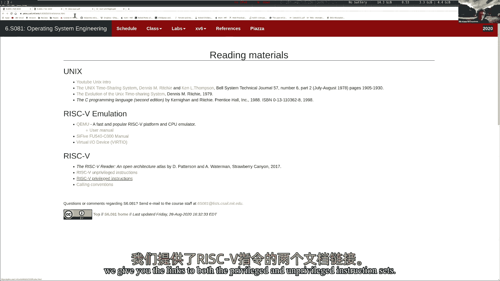

所以这有点，给你一大堆关于ISA的信息的文档。

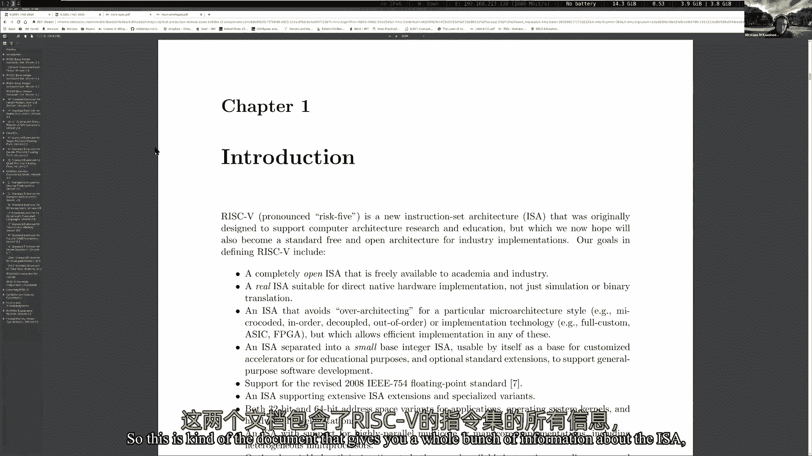

但你会注意到，像这样有240页，这是135页，所以它比x86指令集小得多，这就是风险五的好处之一，所以我们有风险五，我们有，呃，减少指令，不仅说明更简单，所以我的意思是，也就是说。

在x86664中有许多指令，我指的是像at、malt、sub之类的东西，嗯，以x86六十四为单位，有很多指令可以做不止一件事，所以他们表演一些复杂的，一组操作，然后给你结果，风险五不是这样的。

风险五指令的范围往往较小，所以他们拿着，你知道的，运行每条指令的周期更短，那么也许x86664是，这只是设计师们选择承担的一个权衡，嗯，什么都没有，或者你知道，没有规范的理由说明精简的指令集比。

你知道的，复杂的指令集，它们各有各的用途，嗯等等，等等，风险五的另一个很酷的地方，与x86相反的是，这是开源的，所以它是市场上唯一的开源指令集之一，这意味着任何人都可以为风险五开发一个板。

它来自加州大学伯克利分校的一个研究项目，这就是风险五开始的地方，从那以后，它得到了许多公司的支持，你可以在网上找到名单，但你知道，有大量的大公司对支持开放指令集感兴趣。

实际上我觉得最近SCI五号发布了一个公告，他们是风险五处理器的主要板制造商，他们将发布一个个人电脑板，表面上你应该知道，为个人电脑设计的运行Linux的风险五处理器，我想这是在最近一两周发布的。

关于它的公告，嗯，所以如果你，如果你好奇的话，如果你发现自己，你知道绝对你知道，5。在我成功之后，我想使用第五险，希望到那时会有一个可用的处理器，你可以在自己的电脑上运行Linux。

但即使在你的日常生活中，您很可能使用减少的指令集，即使你没有意识到，所以手臂组件，所以这是一个R M，这也是一个简化的指令集，骁龙系列处理器，所以如果你有一部安卓手机，运行缩减指令集。

即使你在使用iOS，iOS，我想我忘了它叫什么名字了，但是苹果有一些版本的ARM，他们也在自己运行在iPad上的处理器中实现，iPhone和大多数移动苹果设备，所以你知道减少的指令集到处都有。

如果你在现实世界中寻找风险五，你知道在你的Q MU之外，你可以在集成设备中找到，所以它是存在的，它不像，它当然不像X8664这样无处不在，但它是它是一个是，我是的，我想苹果就像你在聊天中说的那样。

我想苹果正在移动max到arm，我相信也是这样，在过去的几年里，肯定有一个减少指令集的推动，嗯给定，考虑到ISA的情报有多大，英特尔的ISA之所以这么大，是因为它们，非常关心向后兼容性，所以如果你写。

你知道的，现代英特尔处理器可以运行与英特尔代码相同的指令，你知道的，三四十年前，写在，所以他们不会真的反对任何指示，这样它们就能保持向后的兼容性风险五更现代。

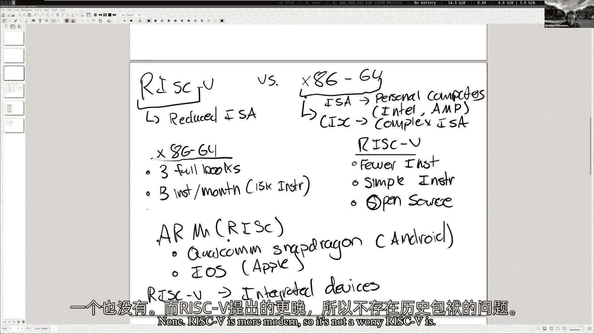

所以这不是一个担心，风险五也是如此，如果我们回到那些手册，风险五的独特之处在于它是分开的，我们有所谓的基整数指令集，所有这些都有五个处理器的风险，如果我们有第五个，所以加布里埃尔在聊天中问。

如果我们有一万五千条指示，几乎不可能有效地将它们输送到，为什么我们需要这么多，我想我是说我们需要这么多的向后兼容的原因，由你来决定，你知道你是否认为这非常重要，但其中许多指示。

我想他们中的很多人也被SIMD指令吃掉了，这是他们自己的一类特殊的东西，嗯，你不会，我从没见过英特尔的汇编代码，使用15000条指令中的全部用法，但这主要来自于对向后的需要，相容性与辛迪，但就像我说的。

风险五，呃，所谓的基整数指令集，它包含所有正常的加法和乘法，然后处理器可以选择实现许多其他模块，你可以在这里看到，在你的屏幕上可能无法阅读，但例如，如果你想要一个处理器，您知道。

它支持单精度浮点的标准扩展，然后你可以包括F模块，这使得风险五更容易支持向后兼容性，因为如果你能说你知道这些模块是做什么的，我包括和支持，编译器可以选择，然后对编译器可以说，好的。

你知道这个处理器告诉我它支持这些模块，所以我只能用这些模块编译这个代码，好的，比贝克说，似乎使用x86而不是风险5的唯一好处是，处理器是您可以获得的性能，然而。

这种性能带来了巨大的成本、复杂性和潜在的安全性，我的问题是，为什么我们仍然使用x86而不是像风险5这样的，嗯，最重要的答案是，世界已经运行在x86，因为我不知道为什么风险五也很现代。

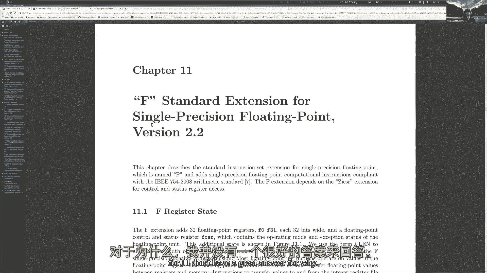

所以世界作为一个整体几乎是在x86上运行的，所以如果你突然开始将你的处理器转换为风险五，你冒着，你知道在一堆重要的事情上失去支持，英特尔也在他们的处理器中做了一些有趣的事情，就像安全方面一样。

有飞地和英特尔处理器，有些事情，嗯，他们近年来一直在做的事情试图给你额外的安全，然后呃，英特尔确实实现的一些指令，它们是超特异性的，对于某些计算来说是非常有效的，所以他们有这么多的指示，经常你知道。

对一种情况的完美指导，这种情况可能比风险五中存在的情况更有效，但更实际的答案是风险五是相对较新的，我们只是不，你知道的，没有人真正为个人电脑制造处理器，我认为科幻的公告是最近才发布的。

他们是第一批这样做的人，所以在实际层面上，无法运行英特尔的所有软件设计是我最好的答案，所以我们现在谈了一点关于组装的问题，所以我只是想看看一些实际的汇编代码。

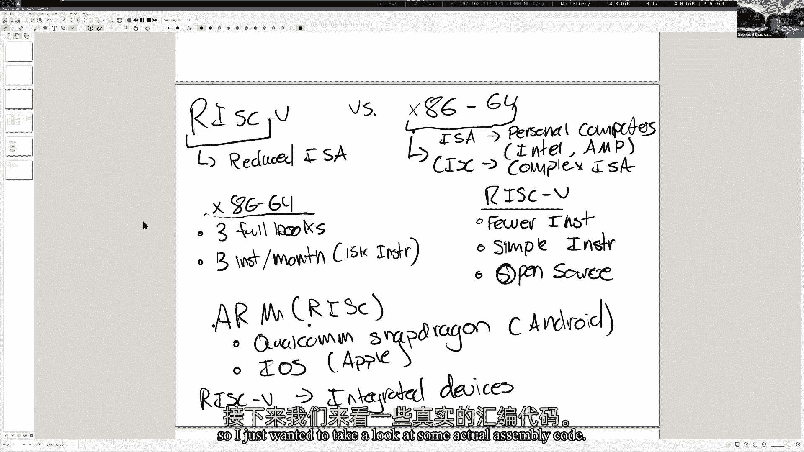

这是下面的C代码，这是一个简单的函数，有一个累加器，我们从零到n循环，我们把所有的数字从零到，然后返回该值，在最简单的层面上，你知道吗，这是最简单的装配，你可以不用编译那个程序。

如果你真的进入自己的电脑，你写了C代码，并试着编译它，你最终会得到一些看起来很不一样的东西，这是真的，有各种各样的原因，我们还没有，其中一些我们会讨论的，其中一些是特定于编译器的。

所以现代编译器做了大量的优化，嗯用它，当他们把你的C编译成程序集时，因此您的组装说明可能看起来不同，例如，当您在GDB中调试时，你可能会遇到一些东西告诉你，它的一些变量已经被优化出来了。

这意味着编译器决定它不需要那个变量，因此，这将有效地从程序中消失，但是是的，这是最直截了当的，我们在移动，呃，从零到t零的值，我们设定一个零到零，然后我们只是把t 0中的东西加到一个零上。

对于循环的每一次迭代，直到t零达到零，这就是这篇文章中所发生的一切，阿米尔，举起你的手，我在想什么点部分文本和点全局做全局，意味着您可以从其他文件中包含此内容，所以如果我们真的跳进去，让我们看看f点h。

这是你将要，如果你还没有，你会变得很熟悉，这基本上包括内核中您可能想要使用的所有函数，然后呃，在这里，你知道我们可以在我的档案里看到，我已经包括了这些函数的定义，所以点全局。

确保这些函数可以从其他地方调用，点文本只是说这是代码，所以如果你从图三回忆起来。

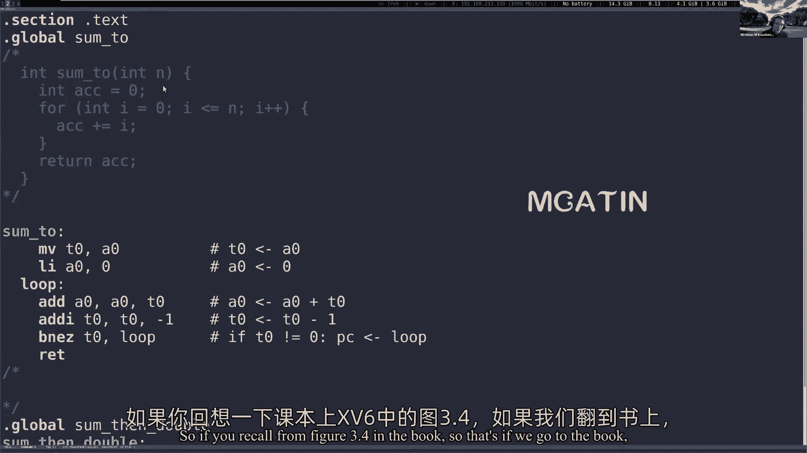

书中有四个，所以如果我们去看书，我们进入页表，进程地址空间，所以在这张图中，这是一样的。

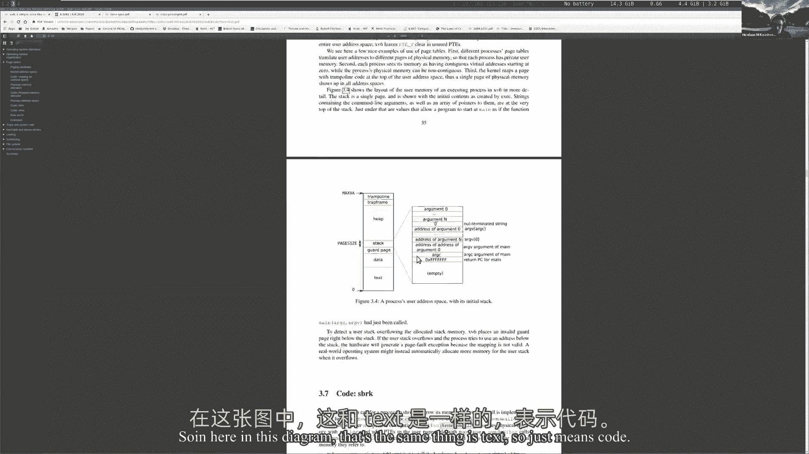

这是文本，所以它只是意味着代码，回答你的问题，谢谢。

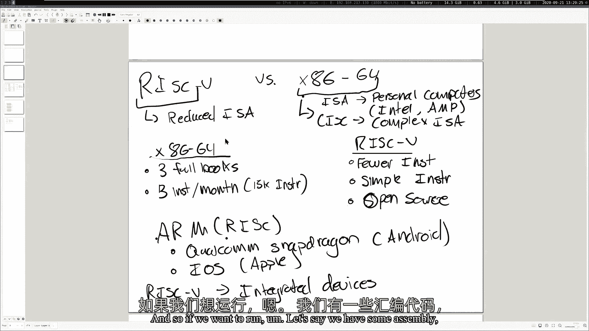

所以如果我们想跑，嗯，假设我们也有一些集会，如果您发现自己对内核的样子感兴趣，我们可以进去，编译之后，您可以在文件内核内核ASM中查看，这是XV内核的完整组件，左边的每一个数字，这里有一个标签。

告诉你内存中的位置，本指令中的这将是，会很有用的，所以这里是，这是实际的，呃，使用实际的程序集代码，您可以看到函数的标签，以及在哪里宣布，所以这是一个非常非常有用的，当我们调试代码时。

希望我能在一秒钟内展示这一点，但现在我们将跳回第一个函数，求和二，我们将看看如何在GDB内部检查它，嗯，所以第一步是，我这里有两个窗户，ASM和S文件有什么区别，不能百分之百确定他们都在组装。

我想这个点，点ASM文件，包括一堆额外的注释，这些注释不包括在点中，所以通常当你编译你的C代码到点S，你最终会得到一些不包括所有这些行号的东西，诸如此类的事情，如果你想知道我们是怎么得到ASM文件的。

我想make文件会告诉你获得它的确切步骤，所以如果我们在航站楼里，我们有我们的两个，呃，两个窗口，所以首先要做的是，当然啦，让Q穆开始运行，所以我们可以在GDB模式下启动它，所以现在我们被冻结在这里。

然后我们可以启动GDB，卡舍教授上周展示了什么，我想有些人对此很兴奋，如果键入TUI启用，你有这个漂亮的窗户，它现在是空的，但会很有用，当您调试时，这样我们就可以设置一个断点，我应该注意到。

所有这些代码都生活在内核中，这些都不在用户空间中，这样我们就没有那些烦人的问题了，设置断点，这样我就可以在函数中设置一个断点，然后继续运行这个函数，而现在，呃，所以您在tui中看到的第一个窗口是源窗口。

是呀，正如大卫所说，内核ASM左边的那些数字真的很有用，当你调试东西的时候，你得到一个地址，它会告诉你，所以你现在可以看到，即使在这里我们也可以看到程序，所以PC，这里在gdb中是程序计数器。

所以我们可以看到这个地址，八零，零，依此类推，等等，如果我们进入内核ASM，我们搜索那个特定的地址，我们可以看到是井，它会出现两次，因为它是一个函数调用，但如果我们看这里，这是那个地址。

它是函数的和的顶部，所以如果你看到任何时候你看到，其中一个，所有的内核地址看起来都像零x 8，零零零，嗯，一些数字，那些，呃，那些地址，您可以直接跳转到内核ASM并找到确切的装配线，问题发生的地方。

然后可以相应地设置断点，但就目前而言，呃，TUI中的顶部窗口是源，如果我们想具体地看看组件，我们可以在GB ASM中进行布局，这将给我们所有的组装说明，我们也可以看看寄存器，如果我们键入布局reg。

我们会得到装配和寄存器，如果你发现自己，你知道想滚动东西，现在我们有三个窗口，我们需要指定哪一个是聚焦的，所以如果我想查看所有的寄存器，我要集中注意力，现在我的重点是注册窗口。

所以如果我移动箭头键或滚动，它现在会开始滚动那个窗口，我们可以把注意力集中在组装窗口上，一旦我们到了这里，我们可以看到所有的东西，所以让我们看看，我们可以在注册表寄存器窗口中看到。

我们可以看到t 0包含这个值，我们可以看到一个零包含这个值，当我们走过装配时，我们可以看着，好的，t，0的值是，是五个，它很好地突出了，改变的寄存器，我们可以记住，如果我们，我们得到最近执行的指令。

这样我们就可以通过，我们从0到0，现在我们可以看着自己经历这个循环，把值相加，一次又一次，这就像一个完整的，你知道玩具功能，然后我们可以继续，和，呃，你知道，过我们的生活，如果你好奇，嗯。

您设置了什么样的断点，或者你忘记了你在做什么，如果你输入，信息，断点或断点，您可以看到在代码中设置的所有断点，你甚至可以看到，好的，这个断点已经被击中过一次，你会得到很多有用的信息。

如果你不想有注册窗口，但你确实想看看寄存器，信息或信息寄存器，或i，或众多的GDB缩短中的任何一个，也会弹出注册窗口，所以有什么，关于GDB有什么问题吗，简单的，我知道已经，嗯。

广场上有很多关于这件事的帖子，所以现在是个好时机，呃，有些直截了当，我们会，我将展示更多DB的用法，你用什么命令打开多个窗口，所以我用T mux，所以我可以从头开始展示，如果我们去这里。

我开一个新的航站楼，所以这里只有一个空白的终端，如果您键入T MUX，这在雅典娜上可以买到，嗯，我马上回答下一个问题，所以现在我在团队包厢里，你可以从底部的绿色条看出，如果你想这样。

在Tebow团队中有几种方法可以做多个窗口，呃，如果你是这样，您可以键入Control BC，我知道有时候如果你习惯使用Emacs，那就很有意义了，但是不使用Emacs的正常人，先打控制键，然后打D键。

然后自己打C键，之后会给你第二个窗口，然后您可以使用控件B和p在两者之间导航，控制b然后n进入上一个和下一个，是的，大卫刚发了一张短信，这是很有用的，如果你想把窗户劈开，我想是Ctrl b。

然后百分号会把他们分开，然后唱一个双控B，然后双引号，我们会把它们水平地分开，所以这就是我们如何得到它们，如果我们在这种状态下，我们可以使用控件B和O在窗口之间跳转。

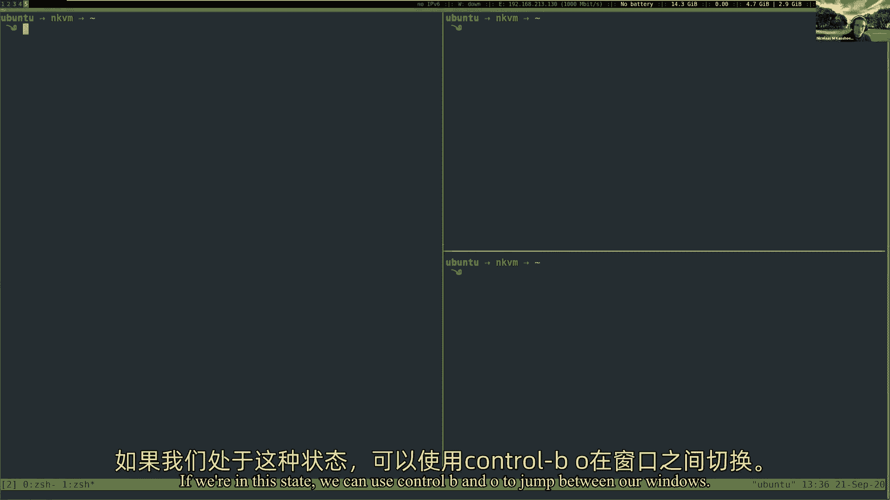

所以这就是我得到多个窗口的原因，是啊，是啊，我不在乎。

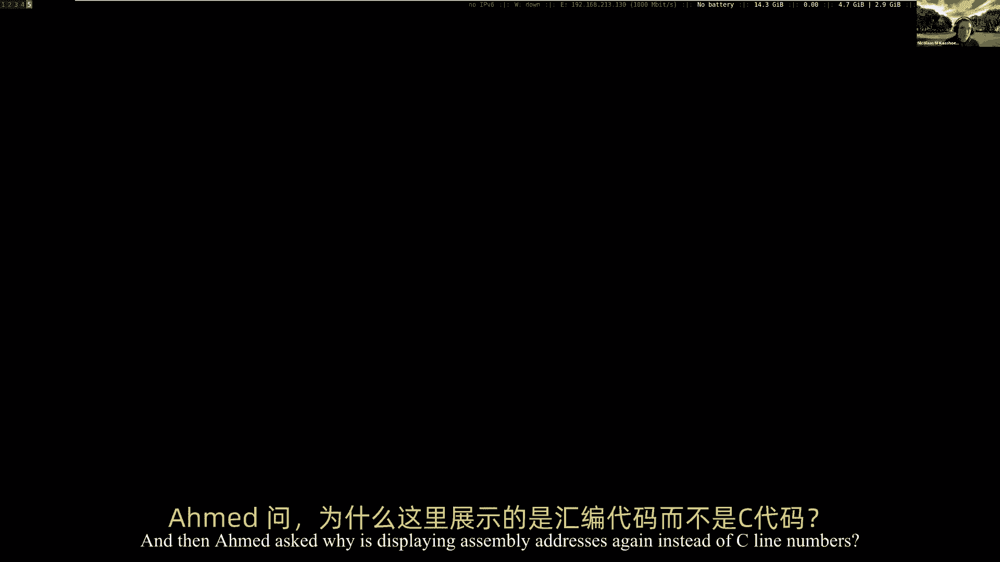

然后艾哈迈德问，为什么再次显示程序集地址，而不是c行数字啊，所以因为函数，所以说，如果我们回到组装函数，这完全是在装配中实现的，在C中一点也不，所以没有任何相关的C行号。

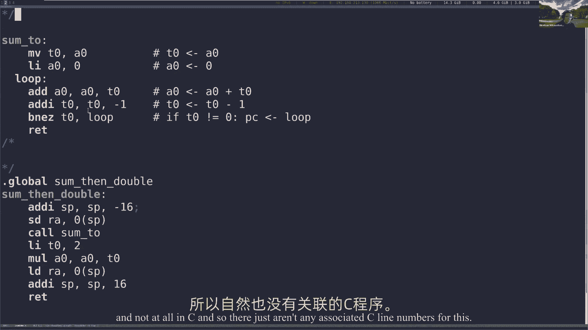

嗯，如果我们设置断点。

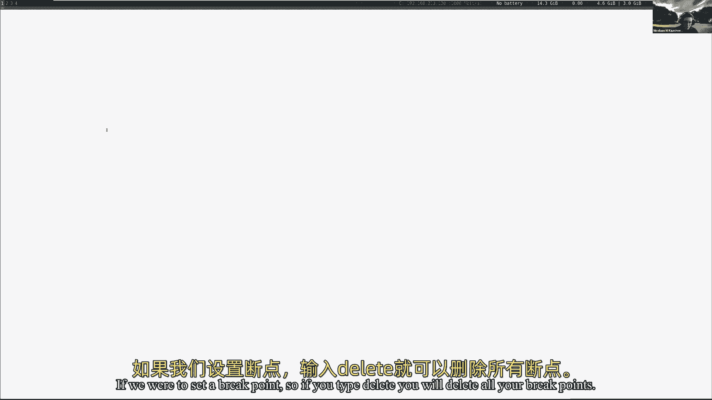

所以如果您键入delete，您将删除所有断点，所以我清除了旧的，如果我现在在演示一中设置一个断点，这是一个c断点，现在继续运行，如果我在这里键入布局拆分，我去拿C和总成，或者如果我只是想要C源。

我可以做布局源，我只想看看，所以那是呃，就是这么回事，这只是一个，这是一个怪癖，因为它没有相关的C代码，所以我们看不到种子行号，关于GDB团队盒子的任何其他问题，嗯，诸如此类的事情，所以布局分裂。

是用来打开源和程序集的额外窗口的，等等，对是的，是呀，所以布局，如果你做布局拆分，这将得到你的源代码和程序集布局源代码将得到你只是源代码ASM，我们会让你组装，寄存器是他们自己的东西，在哪里。

如果键入布局reg，我想是的，会调出收银机，但不幸的是，我不知道有什么办法可以弄到大会的登记簿，和C代码同时，在使用布局拆分的信息reg之外，我有个问题，所以当我们设定断点的时候，呃加一条线，对嗯。

它显示类似的地址，在本例中，断点2在零x 8处，三五四，任何指令可能有多个，任何类似的C代码行都可能有多个指令，所以哪一个做它的，呃展示我展示第一个，然后呃，这是给你的，是给要求启动TUI的人的。

我想是TUI使能不能启用UI，对不起，耶又来了，这里有上百份备忘单，对于GDB和团队来说也是如此，所以如果你发现自己迷失了，GDB甚至有自己的内置，它自己的东西叫做Apropos。

所以如果你找合适的tui，它实际上会向您显示所有的命令，所以耶，呃，这可能很有用，但也可能有点势不可挡，如果你做得恰到好处，破折号b，它会给你更多的信息，我觉得，我不记得了，我自己不经常用。

但如果你真的找到了，或者如果您忘记了在GDB中键入命令的确切方法，你不想谷歌它，当然会的，呃经常能找到你要找的东西，除了一大堆你不想要的东西，是啊，是啊，所以这是很有用的，gdb也有很好的文档记录。

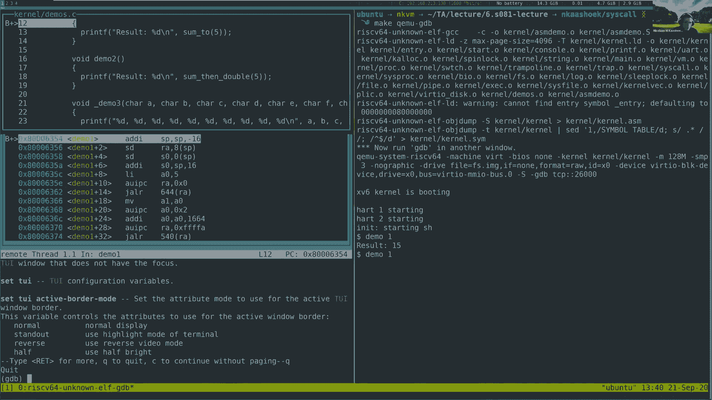

所以嗯，是啊，是啊，如果你发现自己迷失了，你知道，谷歌是你的朋友，所以现在我们，我们已经结束了，组装和风险五之类的事情，我想再深入一点细节，嗯，你在接下来的实验室里真正需要知道的。

这也是对文档的一点回顾，你们都有，当然作为勤奋的学生，通读一遍，为这次讲座做准备，所以你知道，这个桌子，当然是呃，你们都非常熟悉，从四个中的两个和你所读到的，这是寄存器表，寄存器很少，你知道的。

CPU或处理器上的位置，预定义的，它可以用来存储值，这很重要，因为装配操作，如果我们从汇编代码中记得，程序集不对内存进行操作，它在寄存器上运行，所以当我们添加，当我们做减法的时候，我们在寄存器上操作。

因此，您通常会看到的编写程序集的模式是，我们会有一些负载，所以我们将向寄存器加载一些值，该值可以来自内存，也可以来自另一个，呃，寄存器和嗯，这里我指的是一般的负载，不是加载指令，嗯，然后我们就做手术。

所以我们要对寄存器进行一些操作，然后如果我们关心返回地址之外的操作结果，我们就会，嗯，到将存储该寄存器的某个位置，到某个地方，是在内存中还是在另一个寄存器中，所以那是那是，呃，通常事情的工作方式。

和寄存器是执行任何类型计算的绝对最快的方法，呃，或访问任何值，这就是为什么，嗯，使用它们很重要，也是为什么我们更喜欢使用寄存器，使用内存，所以如果你还记得我们调用函数的时候。

所以你可以看到这里记录了零到七，一般来说，当我们谈论寄存器时，我们将以他们的名字来称呼他们，嗯，不仅不那么令人困惑，这只是一个标准，这也是您编写汇编代码的方式，你知道这些实际数字并不重要。

唯一重要的情况是风险五指令的压缩版本，如果你想知道更多，嗯，请随时阅读，基本思想是风险五，嗯正常的指令是64位，但也有一个压缩版本，指令是16位的，我们使用更少的寄存器，在这种情况下。

我们使用的寄存器是8到15，这些是我们可用的寄存器，所以我想有人有一个问题，为什么这是一个寄存器x9，为什么它和其他所有的寄存器都分开了，我猜这就是为什么，嗯，我们和其他所有的人分开了。

因为它在压缩指令模式下可用，而不是两点到十一点，所以这就是我的想法，那是用来压缩的，但在注册之外，他们的名字将被引用，所以零到七用于函数参数，但是如果我们有一个函数。

它需要比这些寄存器给我们的八个参数更多的参数，我们确实需要使用记忆，但这是一个事实的说明，我们不想使用记忆，当我们可以使用寄存器时，我们只我们只使用记忆，如果我们必须，还有这个，呃，这里的这一栏。

保存器列，这也是极其重要的，当我们讨论寄存器时，呼叫者与被呼叫者已保存，然后嗯，条款是我经常混淆他们，呼叫者和同事，它们只相差一个字母，我找到的记住他们的最简单的方法，就是，都保存了下来，我的意思是。

调用方保存的寄存器可以被函数覆盖，假设我有一个调用函数B的函数A，函数A正在使用任何寄存器，调用者保存的调用函数b在被调用时可以覆盖，我想一个很好的例子是回信地址。

因为您知道您可以看到返回地址是呼叫者保存的，这很重要，因为每个函数都需要使用返回地址，所以当a调用b时，B能够覆盖返回地址中的值是很重要的，这就是为什么它的呼叫者被保存而被呼叫者被保存。

寄存器只是我们使用的约定，嗯，因此，帧指针很重要，然后在函数调用中保留这些，所以基本上呼叫者保存的任何寄存器，进行调用的函数需要担心这些寄存器，如果他们的调用保存了正在调用的函数。

需要担心保留这些寄存器中的值，你知道，我经常把两者混淆，我发现自己又回到了这张桌子上，提醒自己他们的所作所为，所以你知道你，如果你还记得阅读，所有这些寄存器都有64位宽。

所以他们有64个地方我们可以放东西，然后嗯，根据调用约定，各种数据类型被制作成适合这64位的数据类型，所以如果我们有一个三，二位整数，取决于它是如何，它的标志是否延伸。

你知道我们要么在那个整数的前面加0，要么加1，为了使它成为64位放入这些寄存器，所以在我们继续之前，呃，有人对登记簿或其他东西有疑问吗，那种性质的事情，我有个问题，你能有一个，就可以，在1中放入返回值。

是呀，这是个好问题，所以我想理论上你可以，我们说零到一的原因，如果函数返回一个long long，一百二十八位，所以如果你从阅读中记得，如果函数参数为100，不仅仅是一个指针词。

所以当我们提到把一个字的大小，我们说六十四位，所以如果我们有两倍于指针字大小的东西，我们可以把它放在寄存器对中，因此，同样的约定也适用于回信地址，在哪里，如果我们有一个指针字的两倍大的东西。

我们可以把它放在一个零和一个一里，用它作为回信地址，我想你会遇到麻烦的，如果你只试着把一些东西放在一个里面，有道理，谢谢，我来自，呃，为什么寄存器不像连续的，为什么0和1和抱歉是分开的，否，那是一个。

那是个坏例子，这就是为什么1和2是分开的，为什么A在中间，就像，这有什么意义吗，是啊，是啊，所以呃，我之前简短地提到过这一点，但是有一个压缩的，这是猜测，我不知道，我不太确定。

但是有一个风险五说明的压缩版本，它是十六位大小的，相对于六十四，然后嗯，你会用它来尝试，然后呃，使代码占用更少的内存空间，当你使用那些16位指令时，您只能访问8到15的寄存器。

所以我认为S 1和S 2到11是分开的，因为他们想说清楚，这是一个在压缩指令模式下可供您使用的，而2到11岁不是，而原因，你知道的，我不知道他们为什么选x8到15，但我怀疑他们只是看了一堆代码。

我们就像，哦，这些是最常用的寄存器，任何其他问题，我有个问题，除了帧指针，堆栈指针，和所有，我不知道为什么我们需要更多的呼叫保存寄存器，但我们确实有很多，是啊，是啊，s 1的s 2 11的s。

那些只是为了，我相信在那里是为了自由，供编译器或程序员使用，所以也许在某些情况下你想，你想保证有东西还在附近，在函数调用之后，编译器可以选择使用s 1到11来做到这一点，嗯。

我手头没有一个具体的例子来说明这在哪里有用，但是呃，我敢肯定它出现在有一个被叫者，保存价值很重要，但这些基本上是，你知道的，程序员或编译器的选择，这是一到十一，我应该注意这些浮点寄存器。

它们是用于浮点算术的，据我所知，你在这个班上看不到他们，所以你真的不需要担心他们，好的，所以我们开始讨论函数调用，呃，因此，我想让我们讨论堆栈，所以这是，我们说的是堆栈，堆栈，如果你以前见过。

堆栈之所以重要，是因为它，它使我们的功能井然有序，它是允许和使功能工作的原因，它这个，是什么使返工，这也是我们经常发现自己保存注册表的地方，诸如此类的事情，在这里，我只给出了一个非常简单的，堆栈的布局。

所以这里的每一个盒子都是我们指的，由函数调用生成的，每次我们调用函数，那个函数为自己制造，它自己的堆栈帧，它在哪里使用自己，它通过在堆栈指针周围移动来做到这一点，这是堆栈指针，这是呃。

记住堆栈是非常重要的，我们从高处开始，我们向下生长，两个低地址，所以堆栈向下生长，总是，呃，所以，您将看到堆栈指针的算术是，呃，通常是通过减法来完成的，当我们想在程序集中制作一个新的堆栈框架时。

所以堆栈向下生长，和函数的堆栈帧包含，我保存了寄存器，局部变量，嗯也喜欢，我喜欢，我是说，如果你，如果参数寄存器用完，其他参数将显示在堆栈上，所以不是在，堆栈帧的大小并不都相同，即使它们在这个图中。

不是这样的，不同的函数有不同数量的局部变量，不同的安全寄存器等，等等，因此堆栈帧将是不同的大小，但你绝对可以指望的两件事，重要的是，呃，回信地址总是在第一件事上，和帧指针，上一帧帧指针。

也会出现在堆栈上的一个可预测的位置，所以说，嗯，这里的两个重要寄存器是sp，你知道，正如我们所讨论的，它用于这是堆栈的底部，或者一般，你知道的，它是堆栈的位置，然后fp是我们也很重要的寄存器。

这指向电流的顶部，框架，这很重要，因为这意味着回信地址，并且上一个fp将始终位于当前帧指针的固定位置，所以这意味着如果我想找到我的回信地址，或者我想找到上一帧，我总是可以通过查看当前帧指针来获得这些值。

我们存储前一个帧指针的原因是允许我们跳回，所以一旦这个函数返回，我们可以把这个移到fp，突然间，fp又会从指向这个，此堆栈帧到现在指向此堆栈帧，因此，我们使用帧指针来操作堆栈帧，并确保我们总是指向与。

事情就是这样，呃，事情是怎么做的，然后呃，这堆的这些碎片，需要通过程序集创建，所以一切，你读到的调用约定文档中的一切，这一切都由编译器有效地强制执行，因此编译器遵循调用约定，它是生成堆栈帧的原因。

它生成程序集代码，使我们的堆栈框架看起来正确，经常在函数的顶部，你会看到什么叫，然后就会有函数的主体，然后会有一个结尾出现在那之后，所以这有点像一种空气，组装函数通常看起来像。

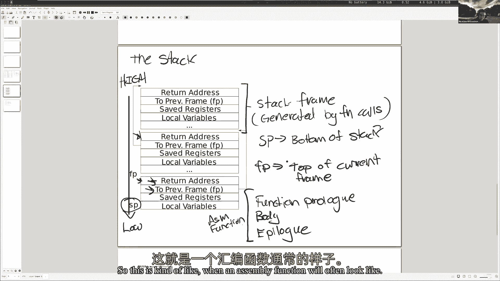

我们会看看的，嗯，所以这里我有另一个函数，然后一些所以你你会，你会注意到，通常有些管子没有这些东西，如果这是一个适当的功能，它应该，这很好用，因为它很简单，所以它在零上做所有的计算。

所以事情是这样的事情是好的，我们也不是，这是一个，它是叶函数，所以你会看到如果你看到叶函数这个术语，这是一个不调用另一个函数的函数，功能的特殊之处在于他们不需要担心，保存自己的回信地址还是真的保存。

任何调用者保存的寄存器，他们会，他们不会再进行函数调用了，所以他们不必像一些人那样小心，然后加倍，另一方面不是叶函数，所以你可以看到它在这里叫，嗯和二，所以它确实需要包括开场白，所以我们在这里看到。

我们从堆栈指针中减去16，所以我们在堆栈上腾出空间，我们在存储某物的寄信人地址，堆栈上的双倍，然后我们打电话给两个，之后，这个函数所做的就是，它调用一些2，然后将结果加倍，将返回的结果加倍，大约2。

在这里你可以看到结尾，所以我们将返回地址加载回我们的A并删除我们的堆栈框架，然后跳出函数。

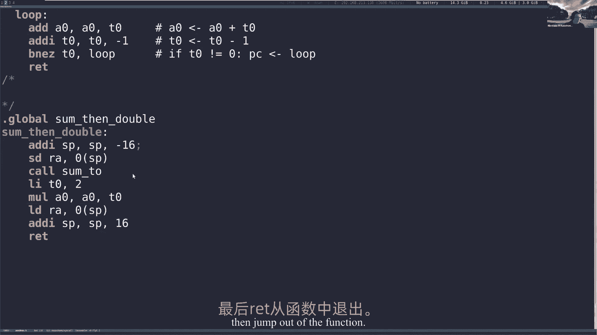

所以我们可以运行它以确保它能像我们期望的那样。

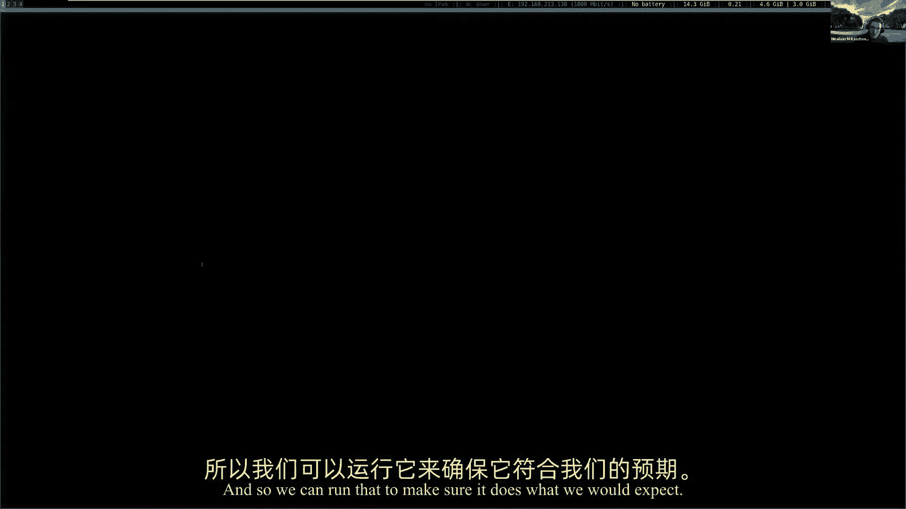

到这里来，可以跑，呃，所以如果我们运行演示二或演示一，2。我们得到的总数是十五，我会告诉你演示二，只是呃，只需调用求和和双倍，事实上，你知道它很高兴地把总数翻了一番，大约两个回来。

所以我有一个问题要问任何人，如果我们，呃，删除这个序言，如果我们把它作为我们的函数会发生什么，一些双倍，有人能预测会发生什么吗，我是说，有一件事是，有些人然后翻倍，不知道它应该返回的回信地址。

所以召唤一些人，这将覆盖返回地址为一些然后加倍，所以在他们中的一些人的最后，它不会恢复到原来的颜色，是啊，是啊，没错，嗯，我们可以看到这就是发生的事情，呃再次，所以如果我们从这里出去，我们从这里出去。

我们现在重新编译，用我们破碎的功能，我们可以看看到底会发生什么，这样我们就可以为双倍的东西设置断点，设置为UI并让其继续，所以如果我们现在运行演示二，好的，我们在一些，然后翻倍再翻倍。

这只是一个程序集函数，所以我们要在组装中看看它，所以我们要做布局，布局注册表，因为这很重要，在这种情况下，寄存器中有什么，你会看到GDB知道一大堆额外的信息，所以我们可以看到，我们可以看到RA目前。

所以返回地址当前指向演示加18，所以它有效地指向函数，演示二，现在我们可以跑了，嗯，我们可以一步一步地完成我们的功能，看看会发生什么，所以我们叫了两个人，我们立即可以看到回信地址被两个。

到现在指向某双加四，这是有道理的，你知道，这就是我们所期望的，如果我们回到我们的代码，我们叫一些两个，所以有些人应该回到，呃到这里，现在我们可以跨过，你知道，所以上，然后我们回到，错误的，好的。

所以我们现在就在这里，当和，然后双倍返回，正如阿米尔指出的那样，嗯，它的回归，它还没有恢复自己的回信地址，相反，它的回信地址仍然是大约两个人使用的地址，所以我们会进入一个无限循环，我们一直这样做。

一遍又一遍，我们永远不会因此而终止，所以这是一个，我觉得，这很好地说明了为什么，跟踪我们的呼叫者和被呼叫者保存的寄存器是很重要的，和，希望，这也表明您可以使用某种GDB来调试，诸如此类的问题。

所以让我们恢复我们所拥有的，我们将进入其他演示来讨论，嗯，来说明一下，呃，有人问，为什么我们要减去16，那就是放置空间来获得我们的堆栈框架，所以这是从堆栈指针中减去16，所以它在向下移动。

基本上在记忆中，向下移动，这样我们现在就有空间放我们自己的堆栈框架，然后我们可以把东西粘在那里，在这一点堆栈，我们不想覆盖，堆栈指针上有什么，为什么不呢，我只是嗯，移动，你需要做16个因为指令是64个。

是啊，是啊，我想我想我们不会，其实不需要做16，但这通常是你会看到的，你一般会看到，我不认为是的，你你不能，你不能做四个，因为呃，你需要八个，所以四个不起作用，但我想你可以做指令大小和寄存器的大小。

对呀，所以寄存器是64个，是啊，是啊。

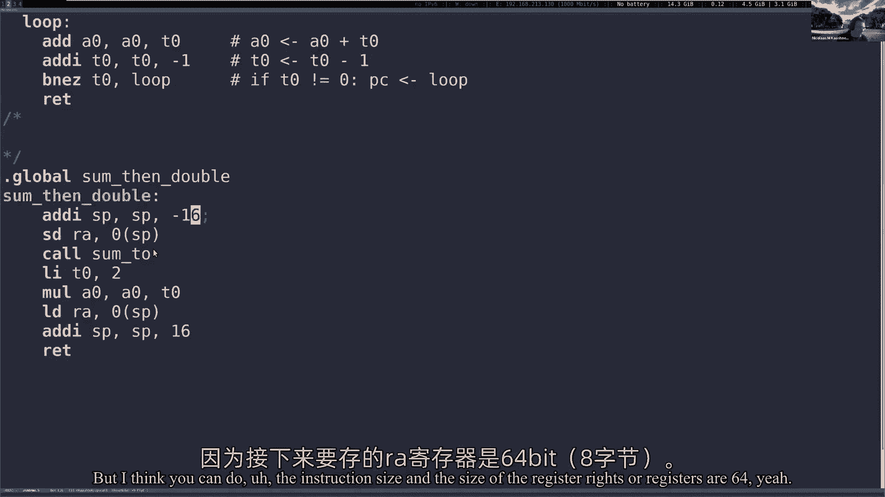

然后公约，为什么你通常看到16是因为如果我们回到我们的文档，通常我们有返回地址和帧指针。

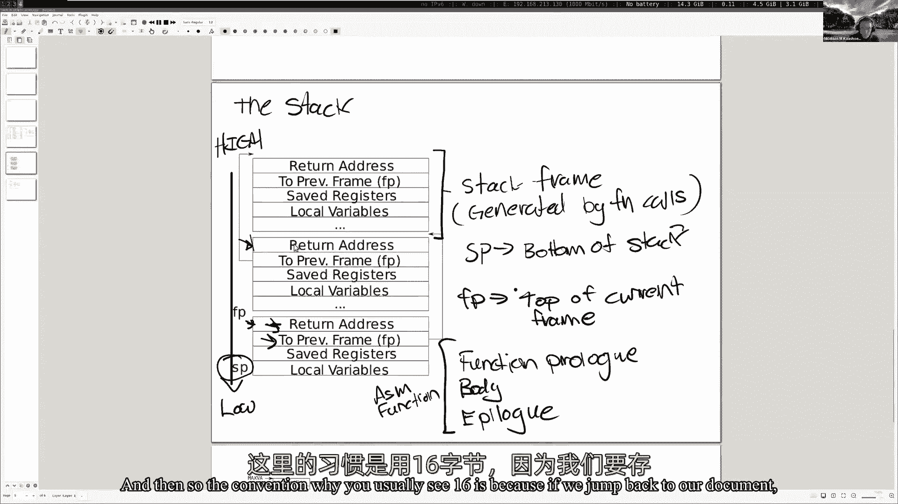

呃，但我们不在这里做，因为我们被，呃，对我们的装配不太小心，所以正常情况下，如果我们如果我们看看，嗯，我敢肯定，如果我们看看内核，我们会看到，是啊，是啊，所以如果我们在内核中看到，它也是，你知道十六岁。

这通常是您在编译器中看到的，好的，所以现在我们可以回到这个，修复了我们的功能，现在我们可以看看一些C代码，所有的权利，所以这里我们有演示四，基本上就是，主函数的副本，就像对主要功能的模仿。

所以我们有我们的角，它是一个字符串数组，我们有虚拟主，它接受许多参数和参数字符串，给我们打印出来，所以就这样，那是，这就是这里发生的一切，这很简单，呃，如果我们在主线上设置一个断点，像这样跳过来，好的。

我们让这种情况继续下去，我们开始，我们跑下四个，好的，所以我们现在已经击中了，嗯，虚拟主，有几件重要的事情要记住，您可以使用GDP来处理堆栈帧，所以如果我们再输入i，那是信息，如果我们输入iframe。

我们可以看到一大堆呃，有关当前堆栈帧的有用信息，所以我们可以看到我们在堆栈级别，零，0级意味着它在调用堆栈中，我们可以去，框架在这个地址，程序计数器是可以的，这一切都很好，我们还有一个保存程序计数器。

如果我们再一次，如果我们使用这个地址，我们跳入内核ASM，我们搜索那个地址，我们确实可以看到那个地址在演示表单的内部，这正是我们希望程序返回的地方，它是由这个地址的一个框架调用的，源语言C，你知道吗。

很高兴知道，然后我们有参数列表，也从这个地址开始，当然啦，在本例中，我们的大部分参数都在寄存器中，然后我们甚至可以看到角是什么，我们是说，rc是3，rv是这个地址，如果我们想更深入地研究事物。

我们可以看像介绍弧这样的东西，它将告诉我们关于函数参数的信息，我们可以查看，但更重要的是我们可以打字，如果我们输入回溯或BT也有效，我们得到了所有，调用堆栈中的所有堆栈帧，这样你就可以看到。

你知道这里会发生一些问题，这时我们调用了一个系统调用，然后我们进入用户跟踪功能，然后到系统调用函数，然后到CIS演示，然后到演示四，最后到虚拟主，如果我们想调查这些堆栈帧中的任何一个。

更深入的我们可以做框架，然后这边的数字是多少，假设我想看看我的堆栈框架是什么，当六个电话被调用时，我可以进入第三帧，所以现在在GDB内部，我在看那堆框架，所以如果我输入信息框，我得到了这个。

这里我们得到了更多，更多的信息，我们有一堆保存的寄存器，我们有一些局部变量，我们对这个函数没有任何参数，我们可以看到程序在哪里计数器，在那里我们应该跳回各种各样的事情，所以如果你在调试东西。

这是超级超级有用的，事实上它很有用，我们让您实现自己的版本，不是很远，正如GDB告诉你的那样，但是我们，嗯，下一个实验室的练习之一，将实现您自己的回溯帮助器功能，用于调试实验室内部的东西，以便回溯跟踪。

呃挺有用的，然后如果我们输入0帧或者我们回到我们应该在的地方，如果我们想调查，你可能注意到这不是很有帮助，你知道的，RV是作为字符串数组的字符串，所以我们只要找个裁判，我们只是得到一个地址。

它实际上储存在哪里，如果我们想看看里面有什么，有几种方法可以做到这一点，最简单的，呃，如果我们输入打印，P代表打印，然后如果我们，呃，取消引用地址，所以我们去看看地址，我们可以做到这一点，你知道。

正如你所料，我们得到数组的第一个元素，因为当它试图打印字符串时，它就会消失，你知道的，就像C说的那样，它会进入，直到它击中空字符，所以我们得到了foo，它是数组中的第一个元素，如果我们想得到更多的东西。

我们可以把长度，所以如果我们这样做了，然后一个数字，它会上升到某个指数，这样我们就可以看到这里的两根弦，然后嗯，你又知道了，GDB相当聪明，这样我们甚至可以，呃，使用RC打印出整个参数数组。

所以所有这些信息都对你可用，你知道，然而，你想得到它，所以GDB是一个超级强大的工具，为什么GDB或抱歉，为什么编译器有时会优化出RG，C和RGB以前发生在我身上，是啊，是啊。

这只是意味着编译器找到了一种更有效的方法，很可能它只是去掉了变量，它在做所有的操作，嗯直接，你知道的，通过寄存器，它可能在零上做所有的操作，比如说，它可能只是在返回地址上做所有的计算。

看到这样的事情很常见，如果你，嗯，如果它是一个变量，你知道百分之百的必要，呃，如果你，你知道我们不喜欢，我们不给你对编译器的控制权，但如果你每天都发现，您可以尝试将编译器的优化标志设置为零，嗯。

但即使这样，您也知道编译器也可以，我们会做它的，我们会做一些优化，比贝克，你的手举起来了，是啊，是啊，嗯，除了一美元或二美元外，地址是什么？你知道，就像在吃饭或酒吧之前，呃，美元这个，是啊，是啊。

地址是什么？是谁可能是的地址吗，但是RV指向了其他地址，那些不应该是一样的吗，所以我们的房车在堆栈上，所以你知道，如果你看看这些地址，我们可以看到它们在内核中，呃，就在八点零的时候，零，零，嗯。

这是有道理的，因为我们他们被宣布为静态正确，所以在演示中，如果我走到这里，它们在这里申报，所以它们基本上就在内核的某个地方，他们都是汽车明星，弧，Arcs或RV是一系列汽车明星。

所以我想象每个元素都指向它自己的字符串，对，所以它是一个指针数组，尝试和喜欢，对此我也有一个问题，呃，数组的美元三版有，如果我看这些地址，第一个后缀是三十八，第二个后缀是四十，第三个是四十八。

它是不均匀的，即使三个参数中每个参数的长度是三个，那么为什么它们不一样呢，我不是百分之百确定，我的猜测是，这是一个试图将事情，嗯对，所以为了让它们保持合理的对齐，它的十六进制是均匀的。

正如人们指出的那样，对呀，是啊，是啊，是啊，有道理，哦，哦，是呀，我现在看到了，是啊，好的谢谢，所以你有时会看到直的东西放在哪里，奇怪地，在那里可能有两个东西在奇怪的偏移，那只是因为不是所有的事情都是。

呃，自然大小相同，好的，任何其他问题，呃，我们可以跳过第五个演示，我们从GDB获得的另一个有用的函数是，而不仅仅是破发点，呃，也有观察点，我们还可以设置条件断点，我只是简单地过一遍，我们运行演示六。

所以我们可以在这个函数里面设置，我们可以观看，这样我们就可以设置一个观察点，我想在这里你会看到，是啊，是啊，所以在这里你会看到什么，呃，卢卡说的是，我们看到和已经被优化出来了。

可能是因为它只是被放在零什么的，我们甚至可以看装配这个权利，这样我们就可以把它，事实上，我们可以看到这一切只是，呃，这一切都只是在堆栈上完成的，在我看来，哦不，这一切都是在，s zero零一三。

所以在这里你可以看到，编译器甚至决定使用质量保存的寄存器，这样我们就可以像看I一样设置东西，我们还没有申报，因为我们不在里面，在for循环中，所以如果我们现在通过C指令，如果我们为当地人做信息。

我们看到我们得到我，我们甚至可以看，嗯，一些手表点，所以现在，任何时候金额变化，我们实际上会得到通知，这样我们就可以继续，然后我们在这里删除，因为有些已经被移除了，所以我们不能，我们实际上不能看，呃。

我们甚至可以在两个上做断点之类的事情，所以这是一个条件断点，如果好的话，让我们看看我目前是什么，所以我目前是一个，让我们说，我想我的循环坏了，每当我五岁的时候，如果我想专门调试那个案例，我可以设置断点。

等于五，所以现在我们有了这个断点，如果我们继续下去，我们会有两个，我们可以看到它实际上打印了前几个值，所以我们现在只休息两个，如果我如果我们到达断点条件，所以那是呃，这可以再来一次，这可能很有用。

如果您想调试代码的特定边缘情况，观察点可能很有用，如果，例如，你认为有些事情不应该改变，但你怀疑它是，或者你认为每次你改变某个变量时都出了问题，所以那是那是，呃，那是它的一种用法，然后呃。

今天我想谈的最后一件事是结构，结构非常重要，他们会上来，嗯。

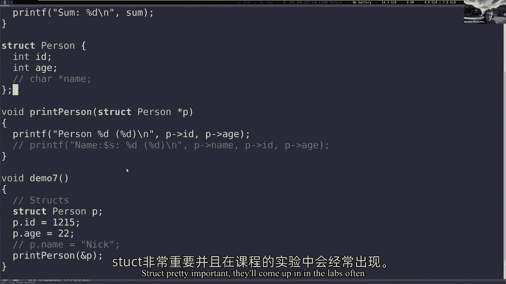

经常在实验室里，我也会谈谈，结构在内存中布局，所以一个结构基本上是嗯，它是一个连续的、连续的内存区域，所以如果我们有一些结构，我们有一个领域，场二，第三场，当我们做那个结构的时候，这些字段将彼此对齐。

在记忆中，你可以把它想象成一个数组，但如果有一个，f2和f3都可以是不同的类型。

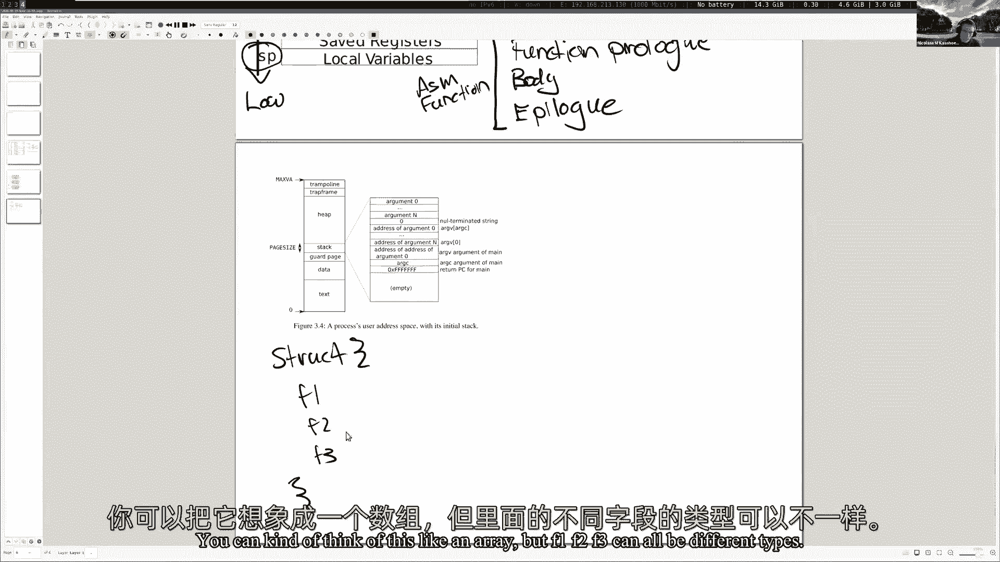

我们可以把它们作为函数传递，通常他们是通过的，将它们作为参数传递给函数，通常它们是通过引用传递的，所以这里我做了一个结构人，有两个整数参数，我给他们传递一个人作为打印人的参数，然后呃，打印出一些信息。

所以如果我们跳入GDB，让我们逃离我们所有的断点和观察点，现在我们可以在人身上设置一个断点，这是你的，运行第七个演示，我们可以看到，现在我们在这里，所以如果我们键入iframe。

我们可以看到我们有一个论点p，我们确实可以，如果我们打印p，如果我们能判断出这个地址是一个结构人，如果我们取消引用，我们可以，GDB会告诉我们p到底是什么样子的，它的ID是1215是2 2。

只是为了展示事情是如何安排的，我们可以把这个地址，我们在这个地址做X，如果我们看，我相信，所以如果我们再来一次，所以我们可以用它来调试我们的结构，在代码中，我们可以这样看看结构是怎么回事。

所以GDB是一个超级强大的工具，不仅仅是为了你知道，单步执行代码，还可以检查代码中各种潜在的问题，查看参数和堆栈框架之类的东西，希望这将在下一个实验室有用，当您必须处理堆栈框架和汇编代码时。

这就是我今天主要想讲的内容，所以呃，最后七分钟的讲座，如果你们有任何其他问题，我都会敞开心扉，我有一个无关紧要的问题，嗯，谁在谁管理，编译器的创建，从like到get从c到各种指令集体系结构。

指令集体系结构的创建者，是第三方吗，或者类似的东西，我相信它不是指令集的创造者，所以通常是第三方，所以你会看到的两个大的C编译器是GCC，由，我认为GNU基金会，我躺着或lvm，这是它自己的东西。

所以我想你知道你可以找到，我相信Lovm甚至是开源的，这样你就可以找到，嗯，你可以，你可以找到专门的代码，这样做的，当一个新的指令集发布时，例如调用约定文件的风险五，以及所有这些指示文件，我仔细地想她。

但是，我想，就像高水平的合作，在编译器设计器和指令集设计器之间，嗯，但是是的，简短的回答是，i，我相信是第三者，谁可能做这件事，在制作指令的人的大量合作下设置风险五，风险五可能是个例外。

因为它来自一个研究项目，他们可能也为它自己编写了编译器，我不认为英特尔有，比如说，在gdcc或llvm中输入，好的，嗯，呃，谢谢你在那种情况下倾听，我想我们可以，你可以在这里结束讲座，还有五分钟。

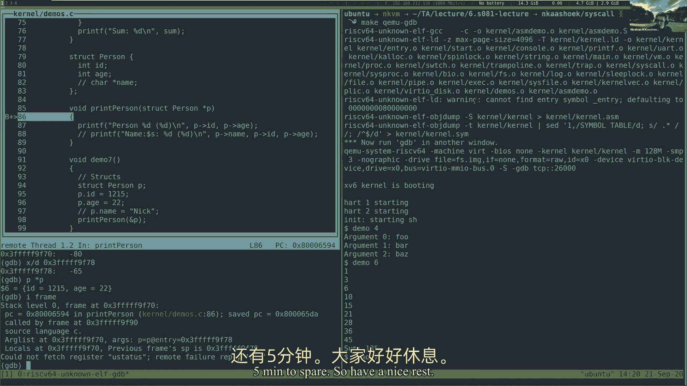