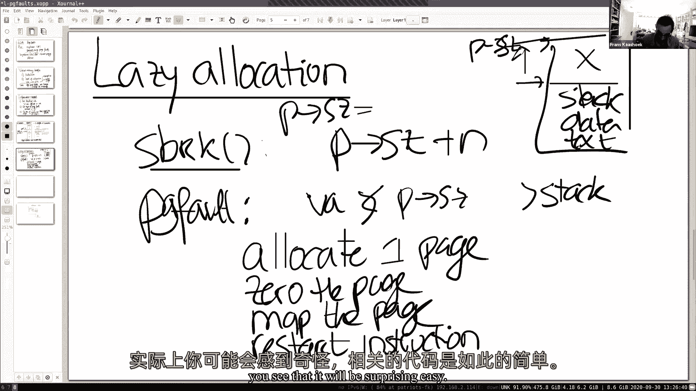

# 【操作系统工程】精译【MIT 公开课 MIT6.S081】 - P7：Lecture 8 Page Faults 中文版 - MCATIN-麦可汀留学 - BV1rS4y1n7y1

好的，快速声音检查，大家能听到我吗，是的，好的，好，呃，反正，我们走吧，让我们得到，我们出发吧，嗯，你知道，下午好还是晚上好还是早上好，呃，随便啦，晚安，无论你在哪里，呃，所以今天的课，呃，将是关于。

页面保存，特别是我们要，计划是，封面，或实施，呃，你知道吗，实现一个数字，嗯，我们要看的特征是，呃，你，懒惰分配，这是下一个实验室的主题，是啊，是啊，我们会得到需求，裁剪和右叉，几乎你知道。

在一系列操作系统中实际上实现了所有这些特性，如果你看看Linux内部，你知道你会看到所有这些功能实际上都是在X6中实现的，就目前而言，都没有实施，事实上，你知道页面折叠在XT 6中的作用。

如果在用户阶段发生页面错误，基础基本上扼杀了这个过程，但没什么有趣的，所以在这节课中，我们将再次探索，您可以在页面错误处理程序中做哪些有趣的事情来实际实现这三个特性，所以这个讲座少了一点，呃。

遍历代码并理解现有代码，多一点设计水平，呃，在，从某种意义上说，我们甚至没有代码可看，呃，另一件要支持提到的事情，懒惰分配是下一批的主题，希望它今天能推出来，嗯，复制和写叉子。

这将是其中一个实验室的主题，Mmap将是后续实验室的另一个主题，所以这是要去，你知道的，这是操作系统中有趣的部分之一，我们将在这上面花相当多的时间，在实验室里，现在，你知道的，在深入细节之前。

后退一步可能会有所帮助，所以你可以考虑虚拟内存有，一个是隔离，在某种意义上如此孤立，呃，虚拟内存允许操作系统给每个应用程序自己的地址空间，因此，在一个应用程序中不可能弄脏，你知道的。

或意外或恶意修改其他应用程序的地址库，它还提供了用户和内核地址空间之间的隔离，我们已经讨论了很多，正如你在猪桌实验室看到的，但这是另一种观点，或者不是…的好处，你知道的，虚拟内存。

你知道我之前提到过几次，它提供了一个级别的交互，你知道的，处理器或指令，你们都可以使用虚拟地址，但是内核可以定义从虚拟地址到物理地址的映射，这允许各种有趣的，呃，有趣的功能，就像我将要在，在这次讲座中。

一秒钟，所以内核控制了从虚拟地址空间到物理地址空间的特殊映射，到目前为止，最重要的是地图绘制相当无聊，事实上，在内核中，它主要是直接映射，我们用x6做了一些有趣的事情，外部处理此映射。

我们看到的一个是蹦床页面，哎哟内核将一个页面映射到多个地址空间，我们看到的另一个有趣的例子是要堆叠的Garth页面，在内核中和内核空间中，在用户空间和内核空间，但如果你想一想，你知道到目前为止。

你知道的映射是相对静态的，你知道如果我们设置一次，你知道的，可能每个用户，我们一开始设置的内核页表映射，对于在fork上一次的进程，内核对这个映射没有做任何其他事情。

页面错误给我们的实际上是使这个映射动态，所以我用页面错误，是啊，是啊，我们可以改变，或者内核可以更改映射，如此动态地飞行，这是一个极其，极其，呃，强大的机制，所以如果你可以组合页表和页码false。

你有一个巨大的，内核具有巨大的灵活性，然后灵活性就下来了，因为你可以在飞行中改变这个方向，所以，我们要做的是，基本上看看这种动态重新映射的各种用法，或者动态地改变页表，给我们，你知道的，有趣的特征。

我们首先要考虑的是，你知道需要什么信息，你知道的，在这里，一个陷阱发生了，因此内核将只响应此页面错误，你知道你所知道的，它需要能够做出反应，你知道很明显，你知道我们想要虚拟礼服，带有默认内容的虚拟地址。

或者页面错误的代价，别让我说得好像我们想说的是，你知道你大概看到了一些恐慌，呃，调用您的页面错误洛杉矶，你知道内核实际上可以访问它们，事实上，当页面错误发生时，它会打印出来，然后呃，你知道它碰巧在圣。

因此，当用户应用程序导致页面错误时，页面错误基本上调用了罗伯特讨论过的相同的轨道机械，在上一堂课里，几乎一模一样，但是在页面错误的情况下，它还会将默认地址输入ST阀门寄存器。

所以这是我们可能想知道的一件事，我们可能想知道的第二件事是默认的类型，呃，因为它可能是在，呃，呃，我们可能想对术语做出不同的反应，呃，由于加载指令造成的页面错误，或由于存储指令而导致的页面错误。

或因跳跃指令而发生的碰撞，嗯和嗯，所以其实，你知道的，如果你看看文档中的风险五，风险是这样的，五个，呃文件在这里，在原因登记册上我们在陷阱讲座中被提及，实际与页面错误有关的原因，所以例子。

如果你看第13个是加载页面错误，第15个是存储页面错误，数字12在指令页错误，所以这些是呃，在S原因登记册中，我们得到这些信息，所以有三种不同的类型，你知道吗，阅读，写，指令和只是回去。

你知道一个的成本，你知道这实际上是由AL指令造成的，实际上内核传输是第八个，对呀，这就是我们在陷阱讲座中看到的，我们在陷阱课上花了很多时间思考，但基本上所有其他页面错误或异常。

我使用相同的你知道的机制从用户空间传输，到内核传输到内核空间，一次在内核空间，在页面错误的情况下，您知道STD值寄存器设置为原因寄存器集，那么我们可能想知道的第三件事，是指令还是寻址指令的虚拟地址。

导致页面错误的，你知道吗，有人还记得你从陷阱讲座中知道的地方吗，指令所在的地方，其中涉及，有人吗，阿成，是啊，是啊，准确地说，有一个登记簿，c更正主管异常程序计数器，就在它所在的地方，保存在哪里。

作为陷阱处理代码的一部分，在陷阱框架中，是啊，是啊，它最终进入陷阱框架正确，有一个陷阱架，epc实际上有异常程序计数器，所以如果你考虑一下硬件机制，x36的作用是什么，呃，我们有免费的信息。

对我们来说可能非常有价值，当我们得到真正的报酬，即地址，违约的成本违约类型，和异常程序计数器，如，它发生在用户空间的什么地方，我们之所以关心异常程序计数器更正是因为，当我们可能想修复的时候，你知道的。

在处理程序中，我们将修复页表，然后我们基本上可以重新启动相同的指令，你知道，希望在修复页面错误或修复页表后，2。这条指令完全可以正常运行，所以我们能成为一份简历是很重要的，实际上我们的成本违约的指令。

所以现在我想看看，你知道的，也是风险五实际上给我们的基本机制和基本信息，呃，我想看看一个基本上，浏览，你知道的，将帮助我们的功能，你知道的，实际上理解我们如何才能，呃。

使用巡逻处理程序修复页表并做有趣的事情，所以我首先想看的是分配和一个特殊的，你知道的，Let’休息，所以s break是系统调用，x t 6提供了，呃允许应用程序基本上增长，把它的堆积起来。

所以当应用程序，呃开始，呃，你知道吗，Let’休息，呃点在这里，你知道在堆的底部，你知道在堆栈的顶部，事实上，你知道这是同一个地方，你知道P大小，基本上你知道点，所以当休息被称为，呃，比如说。

叫一二三四五，您知道要分配的页数，作为大系统调用，它基本上颠簸起来，你知道这个边界，在那里做点什么，所以当S刹车真的发生时，这意味着什么，或者系统调用被调用，内核会分配一些物理内存。

将其映射到用户应用程序的地址空间，然后基本上从系统调用返回，嗯，你知道过了一段时间，只是，应用程序可以增长，你知道物理记忆，或者在它需要的内存中，呃，或者它可能想通过多次呼叫来吃东西。

应用程序将在其地址阶段减少或缩小，用负数打电话，但我想把重点放在我们正在成长的案例上，呃，地址空间实际上是六个，就像它一样，休息是热切的，或者做我们将要称之为，渴望，分配款，即一旦，就像休息一样。

内核将立即分配应用程序所请求的物理内存，现在事实证明，在实践中，应用程序实际上很难预测，呃，他们需要多少内存，往往问得太多，所以他们要求的比他们真正需要的多得多，然后呃，经常会。

这意味着基本上你知道地址阶段会增长相当多，即使使用应用程序实际上从未使用过的内存，你可能会想，哦，那太蠢了，这怎么可能发生得很好呢，你知道你在想，如果您编写一个应用程序，以及典型的应用程序。

也许它读取了一些输入，或者你知道它有一个矩阵，为一些计算引入，通常应用程序编写者会为最坏的情况制定计划，你知道的，你知道的，为应用程序可能永远不需要的最大矩阵分配内存，但在普通情况下。

应用程序可以用更小的，你知道输入，或者一个小得多的矩阵，所以这很常见，实际上对于应用程序程序员来说，也许你知道你在想你自己写的申请，实际上已经结束了，问，并实际拥有它们的用途，呃。

我们希望原则上问题不大，但你知道，实际使用，呃，虚拟内存和页错误处理程序，我们实际上完全可以，呃，以一种聪明的方式对此做出回应，然后基本的想法很简单，休息一下，我们基本上什么都不做。

我们唯一需要知道的是，记住的是，当然，我们确实增加了地址空间，所以唯一真正的，我们要做的实际上是，你知道的，P尺寸，你知道不管号码是什么，呃，现在把一边放在一个新尺寸的，加上你知道n。

其中n是分配的内存量，然后你就知道了，但我们不分配内核，不会在特定的时间点分配任何物理内存，它没有归零，绝对没有什么，然后在某个时候应用程序将使用或可能使用正确的内存。

如果它实际上是它真正需要的内存片段之一，呃，这将导致页面错误，对，因为我们还没有将内存映射到页面映射中，所以如果我们取消虚拟连衣裙，你知道上面，你知道这个尺寸，但低于p加n，呃，我们喜欢发生的是你知道。

内核将分配一个页面并重新启动指令，所以如果我们有页面错误，我们看到虚拟地址在一个比PIA大的，呃，它是蓝色的，对不起，这是一个低调的尺寸，对于P尺寸，那么我们就知道这一定是一个虚拟地址，我想在堆栈上面。

你知道这是一个地址，实际上是从堆中出来的，但我们为此，内核还没有分配任何物理内存，因此对此页面错误的响应，你知道的，可能是合理的直截了当，你知道的，在页面错误句柄本身中，我们可以分配一个页面。

使用K alec分配一个页面零到页面，将页面映射到页表中，所以更新页面订书钉，然后基本上重新启动指令，所以说，比如说，如果是加载指令或存储指令写入或试图读取，你知道从那没有分配，你知道的。

进程现在实际上拥有的一块内存，在我们映射到这个，你知道的，物理页面，重启指令应该能正常工作，我在这里，去吧，所以我想知道在我们进行重新分配的情况下，当一个进程消耗如此多的内存时。

它实际上耗尽了物理内存资源，如果我们不做热切分配，我们就偷懒，应用程序在什么时候会知道没有物理内存，啊，这是个好问题，啊，你想要，基本上你知道它几乎浏览了那里的应用程序，关于记忆有一种无限物理的幻觉。

你知道在某个时候，你当然知道，你知道可能会用到很多，你知道基本上没问题，所以它可能会使用所有的物理内存，所以如果它再碰到一页，在那个特定的时间点上没有物理记忆，那么你知道内核可以采取几个操作。

我稍后会讨论更复杂的，呃，你要在懒惰实验室做的是，你知道如果记忆，呃，返回错误，或者实际上你在特定的情况下扼杀了这个过程，因为你没有记忆，所以内核无能为力，在这一点上，你知道你返回或停止这个过程。

那是你要在懒惰实验室里做的一件事，我们将在这节课后面看到，你可以比那更老练，我认为这通常会提出一个话题，如果我们有一个运行在操作系统上的进程集合，有有限的物理内存。

有限的物理内存必须以某种方式在应用程序之间共享，所以我会在10-20分钟后再多说一点，作为聊天中聊天的问题，为什么条件是虚拟地址，虚拟正义是不要从零开始，好的，因为这里有一个关于这张特殊支票的问题。

我们这里有我们的数据，我们有我们的文本和用户进程，基本上我们撞到了，你知道，去做更大的事情，我们把它抬高了，生长，我们已经在这里分配了内存，所以这个内存还没有被物理分配。

所以这个检查只是检查地址是否低于p大小，它实际上是一个有效的，你知道的，用户地址空间中的地址，如果我们在P以上，大概是程序错误，以及试图取消引用的程序或用户应用程序，一个实际上没有的记忆。

希望这能回答这个问题，是啊，是啊，谢谢。好的，好，所以嗯，来感受一下，你知道这实际上意味着什么，而这种懒惰的分配，那可能是一个，唯一的编程，我们今天要做的两件事是，呃，让我们试着勾勒出或看看，其实。

它在代码中的样子，嗯和你看到的两个，这将是令人惊讶的。

呃放松，呃和呃，此外，呃，这可能是一个很大的帮助，呃，为了懒惰的实验室，呃，所以希望这能帮助你直截了当地走下去，它也让我们看到一对夫妇，陷阱，我有个问题实际上是关于聊天中的一个问题，什么。

为什么我们实际上需要杀死应用程序，操作系统就不能像叙述一样返回吗，你没有记忆了，试着做点别的，我们把这个问题推迟到以后再说吧，然后呃，在页面错误中，我们要扼杀这个过程。

但你知道我们在像素实验室可以更复杂，真正的内核更复杂，好的，呃，虽然最后他们还是会杀了我们，你知道，如果没有，没有更多的记忆，得到什么，你知道基本上别无选择，好的，所以我们要做的第一件事。

我们要修改一下，所以你记得CIS进程是，你知道的，实际增长应用程序分配内存的地址空间，诸如此类的事情，我们只是不打算这么做，我们只需要设置p大小，你知道，呃，p尺寸加n，所以让我们假设我们只是在成长。

暂时不用担心缩小，这就是我们要做的，因此，这将虚拟服装空间增加了n，这就是我们要做的一切，让我们看看我是否能不犯编程错误，我确实犯了一个编程错误，呃，我想我这里没有产品密钥，所以我所有的过程，好，是啊。

是啊，所以程序只是运行，呃，或者至少重新启动，我想如果我们真的喜欢，回声高，呃，我们会得到一个页面错误，我们得到有偿故障的原因是因为，呃，米歇尔，谁要叉子，你知道回声，然后你知道孩子会执行，回声。

shell实际上分配内存，所以贝壳叫s break，事情看起来不太好，但你知道，看起来有点有趣，你知道呃，这里的信息，所以这是我们的，它打印出S COS寄存器，呃，当s成本中的值，这是十五，呃。

有人记得十五是多少吗，你知道从那张桌子上，我刚才给你看了一点，实际使用写入或存储页错误的，呃，我们看到这个过程是免费的，那可能是贝壳，我们实际上看到异常程序计数器，是一二四，我们看到给定的地址。

我们错误的虚拟地址，也就是四千零八年，所以让我们看看，你知道我们可以看看外壳的组装，让文件对我们很好，足够好让我们实际生成，我们可以看看地址12a 4，你知道我们确实看到了，你知道有一个商店说明书对吧。

商店说明书，看起来你知道这就是我们的缺点，所以让我们向后滚动一点，看看这里的这个组件，你知道我们看到，呃实际上，这是malloc实现的一部分，所以这似乎是完全合理的正确，下面是malloc实现。

毫不奇怪，我们大概用s break来获得一些内存来实现你，用你的malloc，然后呃，我们基本上是在初始化一个免费的列表，使用我们刚刚从内核获得的内存，这一行12a 4大概写的是，你知道的。

我想这是对的，一些东西，但我们写的是实际上还没有分配的记忆，我们可以看到内存可能没有分配的另一个原因是，我想外壳实际上有四页的文本和数据，我们基本上坐在第四页上方，在第五页，事实上。

我们坐在它上面八个字节，这有点道理，呃，我们再看一下说明书，我们是十二八十四，你看这里基本上可能是一个将军，保持4000和8是额外的偏移量，你知道我们实际上是在引用，所以这是默认的，现在我们喜欢做的是。

你知道，做一些稍微复杂一点的事情，那么我们目前正在做的，所以让我们去生产，呃陷阱，让我们看看，然后呃，看用户陷阱对吧，因为这发生在用户陷阱中，呃，新陷阱是我们，呃，罗伯特讨论过的，呃，一周前，呃。

你知道它经历了不同的原因和行动形式，所以我们在这里，呃，这条线是S班是8，你知道这就是我们要处理系统调用的重点，然后有一条线检查它是否是任何，呃，设备爆发并在设备内部处理并爆发，如果这些都没有发生。

然后基本上我们得到了这个陷阱和被杀死的过程，基本上我们需要做的是，你知道我们需要在这里添加一些代码，你知道检查另一个案例，对吗，基本上，我想我们要看的情况是，如果R的原因是因果关系，就像。

I r s子句是十五，我们想做点别的，这有道理吗，那么我们在这里想做什么，进攻的计划是什么，你知道的，对于这几行代码，我想检查p大小是否大于虚拟地址，嗯，哦，是这样的，然后做一些，uv，乌姆马洛克。

我想这是我们能做到的一个方法，所以为了演示，我要抄近路，大概在实验室本身，你需要做更多的工作，但基本上这里是，我想经常，我们需要的第二个代码，所以让我们看看，呃，我是你的，你的陷阱，有点融入其中。

然后我们可以看看，您知道，只是用于调试的打印语句，基本上我要在这个处理程序中做的是，我要分配物理页面，嗯，如果没有身体节奏，意思是我们没有记忆了，我们现在要停止这个过程，嗯，如果有物理页面。

你知道我们会把页面归零，然后我们只需将页面映射到用户地址空间中的适当地址，特别是我们把它映射到四舍五入的虚拟地址上，对呀，所以错误的地址是四个，这里是五号和八号，所以这是八个字节，你知道第五页。

我们想把物理页面映射到物理页面的底部，虚拟页面所以四千，所以四舍五入到四千，然后我们将四个文件映射到这个物理页面中，当然，我们必须设置通常的权限位，你知道U位或读写，这有道理吗，我想我可以摆脱这条线。

所以让我们看看，让我们来试试，我想我犯了一些错误，我想在其他方面，你没有在底部有一个开口支架，哦耶，是啊，是啊，如果没有，我确实有，我还需要一个，哦耶，哦，对不起，我是说就在这里，你没有开口支架，对呀。

就像，希望能对优秀的，回声如此之高，呃，现在，我们当然会乐观，我们希望这能奏效，我告诉你这行不通，但我们确实有两个页面错误，对呀，我们有一页写满了四千八，你知道。

显然我们处理它们是因为我们有另一个页面错误，所以我们唯一的问题是我们只剩下，是不是有一种紫外线来抱怨，作为抱怨，我们正试图取消一些页面的映射，实际上没有映射，那会是什么呢。

为什么你会认为即使是我们也会有这种恐慌，任何人，这里取消映射的内存是什么，很有可能，被懒洋洋地分配而没有实际分配的，是啊，是啊，准确地说，你知道吗，懒洋洋分配的内存，但实际上你知道还没用过，对呀，因此。

没有物理页面用于特定的惰性内存，所以在这种情况下，当PT为零时，你知道没有地图，然而，这不是真正的恐慌，你知道吗，这实际上是我们所期望的，你知道这可能会发生，事实上，对于那个页面，我们不必做任何事情。

对呀，我们可以继续，你知道的，转到下一页，这有道理吗，所以我们就这么做吧，现在让我们做回声高和繁荣，我们有两个页面错误，但很好，所以我们基本上，呃，呃，你知道，有一个非常基本的最小懒惰分配方案，工作。

对此有什么问题吗，对不起，我真的没听懂，为什么你可以继续，呃，3。你能再解释一下吗？是的嗯，所以bug表明我们有，我们正试图释放页面，实际上没有映射，你知道这怎么可能发生。

可能发生这种情况的唯一原因是S的刹车向上移动了P大小，但从未使用过应用程序，在那段记忆中从未使用过，所以它实际上还没有映射，因为它实际上没有分配对，因为我们懒洋洋地分配，我们只为这些页面分配物理内存。

当我们需要的时候，如果我们不需要它，那就没有映射了，所以这是完全合理的，实际上会有一个案例，其中没有虚拟地址的映射，因为它实际上还没有分配，在这种情况下，我们什么都不做，你知道我们不能释放页面正确。

但是没有免费的页面，所以最好的办法是继续翻到下一页，好的，那是有道理的，谢谢。是啊，是啊，我们不知道继续，但基本上，你知道，只是继续前进，然后我们实际上会释放页面，那就是谢谢你，这就是为什么它继续。

有道理，另一个问题，是啊，是啊，在地图上的UVM中，我以为恐慌是，那是有原因的，所以一个更正确的，更合理的实现是有两个版本，我们会用一个不惊慌的，是啊，是啊，好的，为什么UVM，那里的恐慌。

基本上有一个不变量曾经是真的，对于未经修改的XP六右，实际上未经修改的X6永远不应该有一个案例，其中有未映射的用户内存，所以笔举起来，我们现在改变了XT 6的设计，所以我们必须，这个不变量就是不好。

不再是真的，所以我们必须消除恐慌，你知道，呃，因为任何婚姻都不是真的，合法地，不要太多，呃我明白了，谢谢，希望这会有很大帮助，我们还有下一圈，事实上，这就像是下一圈实验室的三个组成部分之一。

所以这是你必须做的第一件事之一，希望这能为你节省一些时间，也许你弥补了，你知道的，你在页面错误实验室经历的所有痛苦，但显然是不够的对吧，所以就像事情是什么，你知道的，做出了这些改变。

但更多的东西可能还是坏了，现在提到了一个收音机，我其实没做检查，虚拟地址是否在下面，P尺寸正确，那个，我们可能应该做任何其他可能被打破的事情，要增长的字节数，s中断的进程是int而不是无符号int。

所以负数可以用，是呀，然后负数可以用，这意味着缩小地址空间，所以我们缩小地址空间，我们也要小心一点，所以原来有一大堆像往常一样，呃，在操作系统中，有一大堆不同的案例。

就在我们将要查看这个特定的页表条目的地方，对于所有这些不同的情况，我们实际上可能需要稍微修改x36，这就是实验室的本质，你知道的，做得足够好，基本上你可以通过用户测试，通常测试会，你知道的，应力。

你需要处理的一大堆其他案件，到目前为止还有什么问题吗？

好的，让我，呃，那样的话，我想谈谈其他一些用法，或者当你有页面错误和页表时，你可以做的很酷的事情，你动态地更新它们，另一个几乎微不足道的，呃，但你知道常用的是所谓的零场，呃，原来在呃，操作系统。

你知道有很多空页，嗯嗯，例如，如果你看看呃，用户空间中的地址空间，呃，是啊，是啊，其实六不是真的不先进，呃，但如果你看二进制文件的布局，我逃出来了，你知道有一些短信，有所谓的数据段。

通常也有所谓的BSS段，所以当编译器生成二进制文件时，你知道基本上填满了这三个部分，课文是，你知道的，你知道的说明，数据基本上是全局变量，实际上有一个不是零的值，所以一个初始化的，呃，数据。

VS基本上是一个描述，说得很好，有一大堆变量，它基本上列出了它们的大小，它们也是零，它们基本上没有被列出的原因，你知道吗，或者内存不在文件中是因为这节省了很多，你知道的，比如说。

如果你用C声明一个大矩阵，文件顶部是一个全局变量，它自动被称为琐碎的零，为什么要在文件中分配所有空间，就像注意，基本上你知道对于这个特定的变量，你知道内容应该归零。

然后基本上在正常操作系统上的Exec上，关于执行，你知道的，我们来看看这些免费的，分段，这是xpsix在发送数据时通常会做的事情，但他们是BSS的，你知道它会分配，你知道一个内存来保存BSS。

基本上在里面贴上零，你知道的，分配地址空间，把数据带进去，已经六点了，然后你知道，基本上，呃，你知道相当于BDS，你知道所有的全局变量，基本上为零，可能有很多，很多页，所有这些页面基本上都必须数为零。

这是虚拟地址空间，所以你知道要做的诀窍是说，就像，哇哦，我有这么多页需要零页，我要在物理记忆中做什么，这是虚拟地址空间，这是物理地址，你知道记忆，呃，我真正要做的是，我要分配一个零页，然后用零填充它。

基本上把所有其他页面映射到那个页面，你知道拯救我自己，你知道很多，你知道很多物理记忆，至少在启动时，当然，我的地图必须是有限的照顾，显性照料，我们不能推销，你知道我们不能允许它的权利。

因为每个人都依赖于它实际上保持为零的事实，所以我们就把它映射出来，只读，然后在某个时候，当应用程序开始写入，你知道的，基本上是从，有一个装载机和一个商店，到实际上是BSS一部分的页面之一。

所以因为我们想得到任何，商店，里面有一两个可变的内容，我们会得到一页，故障，那么我们应该在页面上做什么，故障，在这种特殊情况下，去吧，有人知道吗，我们应该在页面中做什么，这里的错误。

我想我们应该翻开新的一页，然后呃，对呀，在那里为零，并重新运行指令，是啊，是啊，正是这样，让我们假设我的画是这样的，实际上商店指令发生在顶部的那个，我们真正想做的是，基本上是分配一个新的物理页面。

记忆中的一页，你知道吗，Calc在里面放0，因为你知道这就是我们所期待的，然后我们可以改变顶部的映射，为了这个特殊的，因为对这个家伙来说，让我假设这个这个，我们可以改变这个映射，你知道被阅读。

写并指向新页面，然后你知道，基本上是这样复制的，什么是更新，然后重新启动结构，就是这样，为什么这是一个有效的，为什么我们认为这实际上是一个很好的优化，为什么操作系统要这么做，任何人，你不需要它，哦耶。

去吧，您不需要使用用户要求的那么多内存，所以最好在它，当你需要的时候，是啊，是啊，实际上相似，喜欢懒惰的分配，基本上是程序说分配了一个巨大的，你知道数组，你知道的，为了最糟糕的输入，它是一个全局数组。

一切都必须是零，但也许唯一的部分是被使用的，第二个好处是什么，第二个好处是你在执行中做的工作更少，所以程序可以启动得更快，得到更好的交互性能，因为您真的不必分配内存，你不是真的零记忆，您只需分配零一页。

剩下的就是你喜欢，你只是在映射页表，所以你只需要写P，有道理的，但不是，呃，更新，或者对，嗯，所以他们会变慢，因为每次页面折叠都会发生，是的，是的，所以你知道绝对有一个很好的观点，呃。

所以我们基本上把一些费用推迟到以后，就在我们做页面错误的时候，你知道，部分原因是我们希望也许不是所有的页面都被使用了，但就像，比如说，如果这一页是九十六页，四千九十六字节，呃，你知道吗。

基本上我们要把每四千人中的一页墙，九十六个零，在那里做一些模仿，但这是一个很好的观点，你知道吗，当然我们做了油漆，我们有，我们加上了桃子断层的成本，一个桃子要多少钱，我们应该如何看待这与存储指令相媲美。

或者贵得多，更贵，对呀，是啊，是啊，为什么好，商店会需要，打通公羊需要一些时间，但错误将不得不去内核，是啊，是啊，所以其实，有多少商店说明书，甚至在罗伯特上周给你看的陷阱处理代码中。

或者实际上你目前正在做的，在活板锁里，嗯，至少有一百个，是啊，是啊，至少100个字符以保存或存储寄存器，所以有相当多，所以两者都有，从用户空间传输到内核空间的开销，就像所有正在执行的指令一样，呃。

保存和还原状态，所以页面错误肯定不是免费的，所以之前问的问题是一个很好的问题，所以让我们呃，查看更多的优化，呃，一个人可以做，这些都是合理的无聊，或者可能是合理的直截了当，我们希望能得到更多。

几个更令人兴奋的，看看我想做的下一个是什么，下一个是在许多实现的操作系统中非常常见的一个，事实上，这也将是其中一个实验室的主题之一，所以让我们做下一个，那就是复制，有时也叫牛，叉子，你知道观察，呃是。

你知道很简单，事实上，我们知道我们在课堂上做过几次这样的观察，但是当，假设你知道，我们一秒钟前被枪杀的炮弹，查看shell运行，它处理一个命令，我实际上做了一个叉子来创造一个孩子，所以叉子。

你知道基本上得到了外壳的副本，所以我们有一个父母，我们有个孩子，然后几乎它做的第一件事的孩子是一个高管，也许执行几个指令，然后它实际上执行，你知道的，例如运行Echo，我们现在知道，呃。

应该在最后一圈拍，您知道fork是shell地址空间的完全副本，然后退出第一件事，它基本上做到了，你知道的，把它扔掉，然后用地址空间替换它，你知道的，包含回声，所以看起来有点浪费，就像，你知道的。

一年了，假设我们有父母的虚拟服装空间，然后我们有了孩子，我们实际上在做什么，这是物理记忆，在正常情况下，在XT 6或在未修改的XP 6中，你知道有一堆像，有四页纸，我们看到贝壳有一个，两个，三个，四。

你知道当我们开始的时候，当叉子跑的时候，你基本上得到了这四页的副本，一个，两个，三个，四，并复制所有内容，你知道从那些书页上，父母对孩子，你知道，然后呢，一旦退出发生，基本上，我们要释放这些页面。

并分配新的页面以实际包含Echo的内容，很好的优化，一个实际上对这个特定序列非常有效的是你知道，如果我们，如果父级有这四个映射，你知道，在它的地址空间里，从这里的零开始，第一个去那里，不管你知道什么。

取而代之的是，你知道，当我们创建子地址空间时，而不是创造，复制和分配新的物理内存，我们可以做的就是共享父级实际上已经分配的物理页面，所以我们可以设置PDS，你认识哪个孩子，到与父页中相同的物理页。

我们会再次小心一点，因为如果孩子想修改其中一个页面，更新不应对父级可见，因为我们知道我们希望父母和孩子之间有强烈的隔离，所以我们需要更小心一点，所以要小心一点，我们能做的就是映射这些页面。

在子级和父级中只读，那么我们当然会在某个时候出现页面错误，因为父级要运行，孩子要跑的地方，我也许你知道孩子或父母会做一个商店指示，可能会将数据保存到某个全局变量或某个地方，在这一点上克服。

这将跨越页面错误，因为你知道我们写的不仅仅是，所以我们得到一个页面错误，那么我们需要做好什么呢，我们需要复制这一页，所以让我们假设实际上是子级执行存储指令，所以我们分配一个新页面。

我们把你知道的页面上有错误的内容复制到这个新页面上，我们将该页映射到子，这次我们可以把它映射成读写，因为现在只有私人页面，你知道在孩子的地址空间中可见，事实上，有效的页面将被折叠在。

我们现在也可以读到父母，所以我们复制这一页，把它映射出来，并重新启动指令，当你重新启动指令时意味着你知道用户读取，你知道就像，我们在上周的讲座中回到了用户空间，这有意义吗，对这个有什么问题吗？对不起。

当你说我们绘制了父母的地图，um虚拟地址到，我们也读写呃，我们怎么找出来，和孩子的一样吗，是啊，是啊，因为，子空间的着装空间是父地址空间的副本，对呀，所以如果我们落到特定的虚拟衣服上。

因为地址空间是相等的，你知道这是同一个虚拟地址，在父母地址空间和孩子的地址空间中，有道理，谢谢。就像一些没有父母的过程，也许就像第一个发射的，它是否使用它的页面，它设置了吗，只需读取权限。

还是以读写开始，我们可以在福克斯做一个，它修改了，好的，由你决定，呃，其实这也是一圈，你要实现，复制的，就在懒惰的实验室之后，你知道你有一些自由，你知道简单的事情就是把它映射到只读的地图上。

您将得到一个页面错误，然后你会做任何你通常也会做的版权，所以你可以在两种情况下使用相同的机制，没有理由真正专门化或为第一个过程做一些单独的事情，我也有个问题，嗯，因为我们喜欢复制整张桌子，对不起。

很多时候整页都在，嗯，做任何类似的内存硬件实现，就像一个特定的指令，因为它们基本上是内存硬件通常只有一些数据线，读我或储存这段记忆，但我们有像，哦，将a页复制到b页，是啊，是啊，有一个x86，比如说。

有复制游骑兵的硬件说明，记忆，你知道，达到五岁，不会，但当然，你知道，在一个非常高性能的实现中，所有这些重写都将被流水线化，你知道，希望以内存带宽的速度运行，请注意，实际上，呃，你知道的。

原则上我们可能很幸运，我们正在正确地保存加载、存储或副本，因为在这张特殊的照片中，我只复制了一张，在未经修改的情况下，我们会复制所有四页，所以希望，你知道的，这就像严格来说更好，在内存消耗和性能方面。

你知道的，叉子会更快，我有个小问题，当页面错误发生时，我们看到它就像，它本质上就像我们试图写到一个只读地址，嗯，仁怎么说啊，像这样，这是一种在右叉上复制的情况，与它试图写入的内存被标记为已读的情况相反。

只对一些人来说，像合法的理由，除在右叉上复制外，它只是一种不变量，如果呃，如果是用户内存，然后它将被映射为读写，除非是端口复制的结果，是啊，是啊，对呀，所以它是一个需要在内核中维护的不变量。

内核必须以某种方式识别这是一个复制和写入页面，如果你愿意，所以我很高兴你问了这个问题，因为事实证明你知道风险五硬件，几乎所有的页表硬件实际上都支持这一点，我们之前没有提到这一点，但这是我们的。

你知道我们通常，你知道吗，无论两级，呃，或多级页表，这是我们的私人，如果你看PTE，你知道吗，我说过，你知道从零到七，但不是关于这两个部分，rw，它们是为主管软件保留的，所以你知道的主管软件。

这是内核可以自由地使用这些位，所以一个人可以做的一件事是说，决定那一点，A基本上意味着这是一个复制和写入页或复制和正确的错误，所以当内核程序知道这些页表用于复制和写入时，你可以在这些特定的页面上，啊。

你知道的片段，设置一点，呃，抄写，这样当页面折叠发生时，我们看到副本和右位被设置好了，然后我们就去做这个，否则我们就做别的事情，比如说，也许这是一个懒惰的分配，这有道理吗，是啊，是啊，谢谢。事实上在呃。

在实验室里，你知道的，你要做的一件事可能就是用这一点，你知道的，在PG中设置副本和写入位，在复印和写作实验室里还会出现一个环，目前在XT六中有一些，基本上是一个物理页面，或多或少只属于一个进程。

除了蹦床页面，这是蹦床页面，我们从来没有免费的，所以这并不是一个特别大的问题，但对于这些页面，你知道的，现在我们有多个进程或多个着装空间指向同一个物理地址，所以，比如说，如果父级立即退出，我们得小心点。

小心点，正确，因为如果父页面退出，我们可以立即释放该页面吗，可能不是因为可能有多个子进程，是啊，是啊，可能有一个子正确使用该页，所以如果我们如果内核释放那个页面，那你知道我们会有麻烦的。

因为基本上如果你看K3，k free实际上在三页纸上写了各种各样的，然后孩子带着那个页面运行，你知道各种奇怪的事情都会发生，那么现在释放的规则应该是什么，如果你没有孩子是免费的，我想是的。

也许更好的方法，或者更笼统的说法是说，我们真正需要做的是，我们需要参考计数，每个物理页面，当我们释放页面时，我们把裁判数减少一个，如果引用计数为零，然后实际上我们可以释放页面，所以。

您必须在复制和写入实验室中引入一些额外的数据结构或元信息，去做那个裁判，我们可以把这个存放在哪里，因为这个，如果我们要参考每一页，那可能会很多，是啊，是啊，我们对记忆的每一页都很好，是啊，是啊。

你可以少一点，但我们在，对于简单的实验室，我们要这么做，对于每一个身体上的，所以每四千九十六个字节，我们需要包含一个引用计数，我们能把它写在另外两个免费的部分上吗，好，好的，是的，是的，我不是读不懂。

但是呃，你知道的，如果你是多次那就太糟糕了，就在三四次之后，你不能不做，你不能再做优化了，但是是的，你知道这里也有一些自由，嗯，您真的需要用这一点来指定，如果是右边的副本，因为内核也可以，是啊，是啊。

是啊，是啊，你可以，您可以维护一些其他元信息，连同过程地址天说，基本上很好，这个和那个之间的虚拟地址是文本地址，所以我们有一个页面错误，你知道这一定是版权什么的，事实上，后来的一个实验室，你知道你。

您肯定会扩展X6为该区域维护的元信息，当你开始实施这些生活时，这里有一点自由，对此有什么进一步的问题吗，好的，呃，那我们去下一个，呃，这就是所谓的需求分页，另一个很受欢迎的，大多数操作系统都实现了它。

所以呃，你知道的，它基本上回到C出口，所以当前在未修改的x x x x x实际上加载文本段，和文件中的数据段，并将其映射到，和我们对懒惰和零填充的观察基本相同，我们能做的是，为什么要急切地做对。

为什么不等一会儿，看看应用程序是否真的需要，你知道那些特定的指令，你知道双星可能很大，把它都装进去，你知道的，从磁盘，它往往是昂贵的操作，也许数据段比它真正需要的要比典型的用例大得多，呃。

要求我们不必这么做，所以不是，呃，关于执行，而不是实际上，你知道的，我们分配虚拟地址空间，你知道我们会为文本和数据分配地址库，呃，文件里就是这样，呃，但在P中，我们将根本不绘制它们的地图。

你知道我们只是要保持，你知道的，在其中一页中，你知道我们只是不设置有效位，所以铃声为零，当然还有，你知道的，当我们拿不到第一页的时候，故障，如果我们在EXEC中这样做。

假设我们修改x 2 6来做到这一点，我们的第一次大故障什么时候发生？为用户地址运行的第一条指令是什么，用户程序，用户程序从哪里开始，它是在加载你的初始代码吗，是啊，是啊，是啊，是啊，好的。

我们只是把那一块留在正确的地方，这就是修改出口的全部意义，而不是在其中调用UVM，在哪里，所以你知道的大多数，当我们实际上，如果你记得因为后悔或类似的事情，你知道应用程序开始的地方正好是地址零。

所以我的照片有点，你知道他在这里领导，但这里是短信你的零，它上升到某个数字，基本上第一个指令，不管坐在这里的是什么，这是我们要做的第一个指令，实际上那个地址，这是第一条指令。

我们会在右边得到一个页面错误，因为我们还没有装，那么在页面上要做什么，故障，嗯，我们要在页面错误中做什么，它基本上会知道这是，呃，其中一个是什么，呃，呃，点播页面，我们必须记得早些时候的某个地方。

你知道，这对应于一些，呃，这对应于某个文件，这就是我们在像素处理程序中要做的是读取，你知道那个街区，并重新启动instru，然后我们就出发了，所以我们要得到，你知道吗，在最坏的情况下。

如果用户程序使用其所有文本，使用所有这些数据，然后我们会得到一个页面错误的每一页，你知道在里面，呃，这个程序，但你知道我们很幸运，你知道并没有使用它的所有数据段，或者不使用所有这些文本段。

那你知道我们可能会节省一些记忆，我们不应该做精确的，你知道吗，表演，你知道快得多，所以更有互动性，节目一开始就轰隆作响，它跑得很刺耳，在执行中几乎不用做任何工作，这使得这个优化有意义吗，好的，因此。

需求分页有一种轻微的扩展，这是事件分页的第二部分，第二部分主分页本原理，这里有一点问题我们还没有真正讨论过，可能是这样，你知道的，也许我们实际上正在阅读的文件。

或者文本和数据段甚至比物理内存中的实际内容还要大，或者多个应用程序从需求分页开始，也许他们的一些二进制文件，基本上比实际的财政记忆要大，所以你知道的典型的事情，如果你下去。

这个需求分页实际上是在内存不足的情况下，所以如果口径归零，如果内存不足，所以说，比如说，你知道你的需求页面，你得到一个页面，需要从文件系统分页的某些页上的错误，但你没有更多的免费页面了，你得做点什么。

所以典型的，这又回来了，你知道之前的一个问题，例子，懒惰也是如此，或者呃，您知道如果内存不足该怎么办，所以如果内存不足，你有一个很明显的选择就是驱逐一个投手，你可以举例而不是你知道，你可以举个例子。

驱逐页面并写入，你知道回文件，例如，如果是被修改的数据页，你知道你可以写回来，你知道到文件系统，嗯，然后一旦你选择了页面，然后你有一个新的免费页面，你可以把，呃，用你用新的，你知道只有三页。

让你知道你的错，然后基本上重新启动指令，再次重新启动指令有点复杂，因为整个机器基本上要启动并转移回用户空间，等等，所以这是一个，你知道的，典型的操作系统会这样做，当然，关键问题是驱逐哪个页面，选哪个。

那么一些候选人是什么，你知道的，什么，你做什么，选择要驱逐的页面的合理策略是什么，最近使用最少，是啊，是啊，所以这是最常用的策略，最近使用最少，这是通常被扔掉的页面，有一些曲折，如果你必须选择页面。

那么小的优化，您可以在脏页面和非脏页面之间进行选择，所以肮脏的页面是一个有商店的页面，非脏页面是存储页面，基本上只读过，但没有写你更愿意先给哪一个定罪，因为你必须在某个时候写脏话，无论如何，是啊，是啊。

呃，所以所以再说一遍，实际上再检查一下，嗯，我说脏话，因为在某个时候，30页需要写在记忆中，是啊，是啊，那倒是真的，呃，但也许现在你得写两遍，你知道一旦你写出来，可能后来又修改了，所以实际上通常，但是。

哦，我明白了，好的，操作系统正好相反，他们选择一个实际上没有写或不脏的页面，因为你什么都不用做，你可以重复使用它，你可以把市场，如果它出现在第一页的PT中，你们那里的市场是无效的，然后你就完蛋了。

然后可以在另一个页表中重用该页，所以倾向于拿走没有，你知道不脏的，首先，我能要求澄清一下这30页吗，所以说，我知道就像在缓存里，当我们有记忆的时候，然后我们说，好的，一条线是脏的。

因为它还没有被写进记忆中，但是内存中的一页呢，它对应于什么，怎么脏了，它必须写回哪里，只存在于记忆中对吧，是不是整个事情就像它在其他任何地方都不存在一样，真的所以什么时候能脏，是啊，是啊，好的，所以说。

比如说，如果是需求页文件页，其实，我们一会儿再谈这个，就像在下一个，呃，也许预取有点太多了，但是如果你有内存映射文件，将文件映射到，呃，内存，然后对其进行存储，那你就会弄脏那一页，好的，所以这只适用于。

就像一个页面实际上响应的不仅仅是一些内存，也可以是文件或其他东西，好的，好的，那是有道理的，好的，所以只是为了，呃，你知道，就为了多做一个，与此相关的另外两点，如果你看这个，又是宠物。

所以我们看到了这个爱尔兰W位，你会注意到实际上有一个位七，这是肮脏的一点，所以当寻呼硬件，当硬件写入时，你知道，在一页上，看着肮脏的部分，操作系统以后可以看到你啊，这个页面可以很容易地看到这个页面。

同样也有一个，呃，有一点，呃，代表过剩，所以每当一页被写或写，读的或写的，x的位将被设置，为什么知道这一点很有用，这在什么方面能很好地帮助内核，那些还没有被访问的，你可以，你可以驱逐右，是啊，是啊。

就像一种说法，如果你想实现这些最近使用的，和，你发现一个页面基本上在一段时间内没有被访问过，你知道它实际上最近没有被使用过，所以它实际上是驱逐的候选人，而设置了访问位的页面并不是真正的驱逐候选人。

所以位通常使用，或者实际上通常用于实际实现这个LRU策略，好的，但你必须重置吗，嗯，被访问的位每隔一段时间就不被访问，或者是的，这正是典型应用程序要做的，如果他们不这么做，也许为了所有的记忆。

他们扫过记忆，所以你知道，有一些著名的算法，被称为时钟算法，这是做这件事的一种方式，对不起，你为什么要设置它，你为什么要把它重置好，如果您想知道页面最近是否被使用，你需要，你定期做出决定。

然后说可能每一百毫秒或每隔几秒钟，你知道你清除了轴位，如果它在接下来的几毫秒内被访问，你知道它在过去的一百毫秒内被使用，和没有设置访问位的页面，在过去的一百毫秒内没有使用，这样你就可以保存计数器。

比如它们是如何被故意使用的，什么是真正的，基本上是垫脚石，能够实现复杂的Alleryour实现，好的，嗯，我想再谈一个，只是为了做，呃，然后这是最后一个，实际上你也将在，呃，其中一个实验室。

也就是内存映射文件，我们的想法是，你知道的，这里我们有我们的地址空间，我们真正想做的是，基本上能够将整个文件或部分文件加载到地址空间，这样我们就可以操纵，你知道的，使用加载和存储指令的文件内容，嗯，呃。

而不是呃，改为，你知道，不然你可以写，嗯，并能够支持这一点，你知道，使用大多数现代操作系统的典型操作系统可以提供称为nmap的系统调用，基本上，MF获取虚拟地址或选择和虚拟地址长度，不打算谈论。

然后是打开文件的文件描述符和偏移量，基本上这上面写的是，你应该，你知道的，地图，你知道他们遵循描述符，如果这是地址，您知道从偏移量开始的虚拟地址文件描述符，你知道在F文件中，你知道吗，把它映射到地址上。

在虚拟地址VA并这样做，我们有一些保护，喜欢读，写，等等，所以让我们说这是一个读-写，你知道内核，呃，赢了，所以内核实现和映射的方式是，你知道的，如果它不急切地，呃，这就像大多数助理不急切地做一样。

你知道我们基本上复制，呃，读取从偏移铺设开始的所有字节，从偏移量开始进入内存，设置，呃，p指向大块所在的物理内存，然后基本上从那时起，那个呃，应用程序可以使用分布，使用，加载和存储实际修改文件的指令。

然后也许当他们，呃，在那里我们都做完了，在那个调用中通常有一个对应的，这个长度允许应用程序说“好的”，这个特殊的文件我看完了，在地图的点上，我们需要把脏块写回来，我们可以很容易地找出哪些块是脏的。

因为他们必须在PTE中做一点设置，当然，在任何内存中，复杂的内存实现，呃，这一切都完成了，拉诺，你只是不立即映射文件，你只要在网站的某个地方做一个记录，说好，你知道这个P。

你知道它真的属于这个特定的文件描述符，所以网站上保留了一些信息，它通常在称为VMA或虚拟内存区域的结构中调用它，例如，对于这个文件f，它将是一个vm a，在一个dma中，我们记录，你知道的，文件描述符。

偏移量，等，我们应该生活在记忆的实际内容中，所以当我们得到一页，对于位于此的特定地址的错误，你知道，我们可以离开，内核可以从磁盘上读取并将其带入内存，在回答早期的问题时，就像。

这个肮脏的部分很重要的原因之一，因为在取消映射时，您必须写回脏块，这有意义吗，好问题，是啊，是啊，也许这是一个更普遍的问题，但这可能是一个问题吗，说，多工序，这些是在辅助存储上映射相同文件的内存。

然后像同步问题，是啊，是啊，问得好问得好，我如此，一般单位的语义是什么，例如，如果使用以下方法对同一文件读取或写入多个进程，会发生什么，我们知道写系统调用，是啊，是啊，是啊，是啊，这就像不对。

正确的理由会以某种顺序出现，或者权利会以某种顺序出现，所以如果两个进程要写入同一个块的文件，你知道要么第一个进程写Go要么第二个进程写两个中的一个，所以这里基本上是一样的，你知道的。

我们真的不必保证什么，如果您想做一个更复杂的UNIX操作系统支持文件行走，可以锁定文件的地方，然后您可以正确地同步，但默认情况下，在这个级别上没有同步或同步，那是有道理的，对不起，什么是长度。

什么是旗帜，哦，旗帜，呃，令是，你知道吗，要映射千个数字字节的区域，呃，戳被读取，写X标志，你知道是，你会看到当你做地图的时候，呃，这与该区域是否私人或共享有关，如果不共享。

那么您就知道它可以在多个进程之间共享，对此有什么进一步的问题吗，如果其他进程修改磁盘上的文件，这意味着这不会在这里反映出来，对呀，这是正确的，呃，除非我认为如果它不被分享，那么你应该反映这些变化，对呀。

但他们会使用相同的文件描述符，对啊，我不太清楚，你知道，和映射的语义，当事情被分享的时候，那里到底发生了什么，好的，我想是的，我想在惯用的情况下，是啊，是啊，和共享的，他们必须反映出来。

但是如果一个进程实际上打开相同的文件名完全分开设置，我想可能是不同步，即使是共享的，那太好了，好的，所以呃，这是在文件系统实验室之后，你实际上做内存映射文件，那将是我们最后一次，你知道吗。

虚拟记忆的笑声，除非你最后决定做更多的虚拟内存，呃，特征或练习，呃，无论你想做什么，呃，所以基本上结束这堂课的主要答案是，嗯那个，你知道的，总结的排序，你知道我们在过去非常详细地循环了一下，准确地说。

你知道页表是怎么工作的，你已经做了几圈和一圈页表，我们已经看了很多像，陷阱是如何工作的，而且你知道，页面错误，事实证明，如果你把两者结合起来，你知道的，你会得到，你可以实现非常强大和优雅，虚拟内存特性。

你知道，看了一整张单子，主要集中在那些在未来的失效中实际将要实现的，但你知道这只是你所知道的一个子集或样本，中实现的一些操作系统，典型的操作系统实现了今天实际讨论的所有，如果你看看Linux和所有的。

还有更多有趣的其他技巧，但希望这能给你一个很好的感觉，你知道的，虚拟内存的力量，一旦您可以在页错误处理程序中动态地更改页表，我想正好在两点五，所以也许有一个很好的点停止，但如果你有任何问题，你知道。

随便问他们，如果没有，你知道，我们应该好运地完成陷阱圈，我希望它不会像，呃，或者没有页表实验室那么难，对不起，我对这个问题的看法，当您在，在上一张幻灯片中，当您映射整个文件时，或者像你把它放进记忆中。

结果它比长度还长，因此，如果文件不适合虚拟地址空间，哦，我想这就像长度是我们想要的文件的多少，是啊，是啊，你知道的，所以长度就像我们想绘制的地图，从偏移量开始的文件描述符中的10个字节，哦，好的，好的。

我明白了，所以说，如果文件较长，那我们就不会把所有的都记在记忆中，是啊，是啊，是啊，是啊，我们可以随时检查，好的，我明白了，谢谢。谢谢。我有个问题，我有个问题，嗯，打洞的页面，所以我们在下面谈了一下。

就像传呼的人第二部分，但这是一般的程序吗，我们会在这些技术中使用，如果我们发现我们超出了物理边界，是啊，是啊，就像常见的魔法机制一样，像这样，甚至在分配中，我们跑在我，再也没有可用内存可以分配给页面了。

你知道，我们支持需求分页，或者我们通常驱逐的任何东西，你知道的，一些页面，你知道，通常使用LRU的一种方式来思考它，在稳定的状态下，操作系统基本上运行，呃，所有内存随时在使用，您想使用旧内存。

所以当我们开始新的事情时，你知道我们得腾出点空间。

