# 【操作系统工程】精译【MIT 公开课 MIT6.S081】 - P9：Lecture 10 - Multiprocessors and Locks 中文版 - MCATIN-麦可汀留学 - BV1rS4y1n7y1

是啊，他一定不是很好，呃，如果你好，埃里卡怎么样，你的懒人怎么样，我也觉得可以，嗯，我的咖啡和咖啡也有问题，但得到了那个结果，所以是的，好好好，是啊，我认为这是一个你可能不会想到的棘手案例。

当你开始编程的时候，但幸运的是，用户测试将为您找到它，实验室进行得很顺利，嗯，我还没说完，其实，呃，我不担心抄袭，我想，但你应该，肯德尔加纳怎么样，我想，在大多数情况下，那个，对我来说还不错。

可能最奇怪的是，只是想弄清楚它什么时候跌到了堆栈的边界以下，好好，好的，好吧，是时候开始了，呃，欢迎收看下一堂课，无论你在哪里，无论什么时区，所以今天的课是关于锁的，你可能在以前的课上见过散步。

或者至少以某种方式和他们保持联系，所以这个讲座是一个概念性的讲座，呃可能会和一些，呃，你以前见过的锁的东西，但我们会有更多的内核和操作系统焦点，这改变了一些事情，嗯，所以开始吧，你知道吗。

让我们提醒自己，为什么我们需要锁，嗯，你知道吗，我想我们的出发点是，呃，想要使用多个核心，他们想使用多个核心来获得性能，所以即使应用程序真的想在多个核心上运行，据推测，它想瞄准这些分数或离开。

应用程序可以调用系统调用，所以内核必须能够处理，是服装系统打来的电话，这意味着，你知道吗，如果系统调用在不同的进程上并行运行，呃，他们实际上可以访问，如你所见，实际上 x6有很多共享数据结构。

你知道什么是质子结构，或者你知道蜱，或者你知道稍后我们会看到缓冲缓存，实际上有很多共享数据结构，所以如果你有过敏反应，你知道一个数据结构，其中一个是作家，另一个课程是读者，你知道我们基本上需要街区。

你知道协调这些更新，共享数据结构，所以读者 c系统视图，所以我们需要街区，你知道，你知道控制共享或正确共享，从某种意义上说，这有点令人沮丧，因为你知道我们想要这个平行的轴，呃，我们要运行多个，呃。

在不同的路线上 平行地一致呼叫，呃，但不幸的是你知道，如果他们共享数据结构，知道他们需要锁，锁，没有连载，呃，基本上是运营，所以事实上，你知道吗，最后的锁会限制性能，所以我们的处境有点棘手。

你知道正确的地方，我们需要锁，你知道吗，但为了表现，呃，他们不好，但你知道这将是生活中的一个事实，你知道我们会想办法的，呃，但这是最高水平，呃，在这里你知道也许只是真的，你知道吗，呃，带上引擎盖。

为什么应用程序实际上要多个课程，这确实与你的技术趋势有关，你知道在过去，几十年后，你知道有些经典的图表，使得这些观点，所以让我，你知道吗，把其中一个调出来，有一个有点复杂的图表，呃。

但是你知道在 x轴和 y轴上有几年，有，你知道单位，它们是不同类型的单位，取决于，你知道我们在看哪条线，但真正要看的是，在过去的几年里发生的事情 是在过去的几十年里，从2000年开始，时钟频率不再增加。

呃，所以，基本上这是有平台或恒定的，结果是，你知道基本上核心的单一威胁性能，你也知道基本上已经达到了某种极限，你知道的或者想出来的，呃，但另一方面，当然考虑到，在同一时期，电阻器的数量应该仍然在增加。

所以如果你不喜欢，你知道吗，使用晶体管做一个单一的过程 或跑得更快，你知道吗，唯一的其他选择基本上是你有多个部分，你看，的确，从2001年开始，或者从2000年初开始，你知道吗，当然，号码已经消失了。

所以有一个应用程序再次表现，你知道吗，呃，你知道吗，可以依靠单和弦，它基本上要利用多个核心，这也意味着 如果一个应用程序，你知道内核密集，还是密集，你知道吗，但是像一个服务器。

那就意味着操作系统也必须是，呃，你知道吗，在多个核心上高效运行，所以这就是主要原因，呃，你知道我们对，呃，你知道吗，并行性，你知道吗，在内核内部，有什么问题吗？好的，我见过，我假设你以前见过这些图表。

但提醒我们，你知道所有讨论的出发点是什么，嗯，为什么罗，你知道吗，已经暗示过了，他们在那里是为了，呃，正确性，呃，你知道吗，如果我们有，你知道吗，读者和作家，或共享数据结构，你也知道。

出问题的是我们想避免比赛条件，所以如果你没有锁，你知道我们冒着风险，你知道吗，如果我们共享数据结构，我们会提高我们的条件，结果是比赛的条件是，挺烦人的，嗯，所以首先我们对它的实际情况有了一点了解。

让我们看看，我们就，让我们在 xv 6中创建一个比赛条件，看看它实际上是如何表现出来的，然后明白看看实际发生了什么。

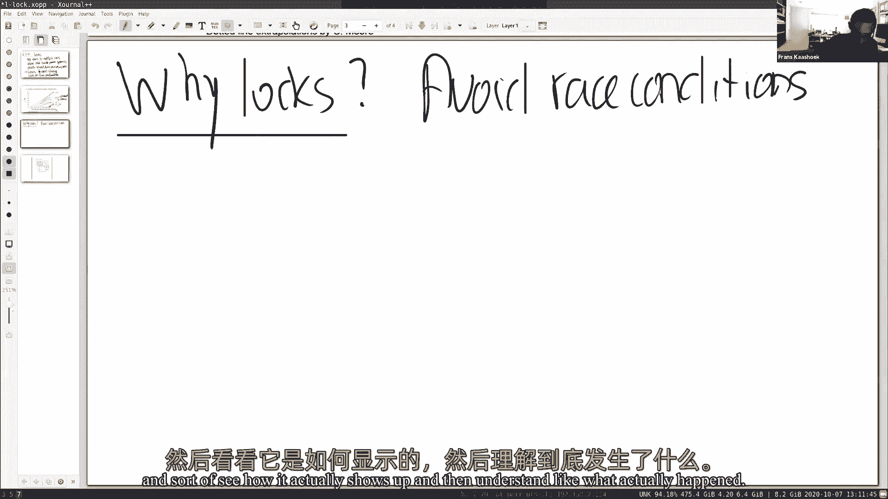

或者你知道函数 k 3，呃，在 calc dot c中，你知道吗，所以这是在你释放页面后冻结的函数，它把它放在免费名单上，内核有一个非常简单的数据结构，为了保留所有三页的免费列表。

所以一个人需要一个页面来真正祝贺球场上的人，你在这里又看到了，那个，内存分配器有一个锁，来了，麦洛克，在这里，它实际上更新了页面中刚刚被释放的免费列表，或者争论自由，所以我们要做的是。

只需评论这两个获得释放 基本上，呃，标记，你知道吗，获得锁，把锁打开，你知道吗，所以这个，这个，这段代码位于，那曾经是，是啊，现在没有更多了，它不再被执行了，从原子上来说，让 q u这样编译它。

你知道吗，在我运行它之前，我注意到实际上我们已经被解雇了，实际上，呃，可能打了一些电话，可能是3号，就像你可能，如你所知，所以实际上一切似乎都很顺利，所以让我们运行用户测试，或许你知道。

稍微考虑一下这个很有趣，现在，你期望什么，这行得通吗？这样不行吗？任何尝试过的人，我想它可能会丢失一些页面，但也许不会因为，嗯，可能就不会出现种族状况，是啊，其中一件事是，呃，我们提出的条件是。

他们可能不会发生，所以让我们运行用户测试，看看实际发生了什么，所以在这里我们启动它，花点时间，祖姆可能会有点抱怨，因为你知道运行了很多 给我的机器装了很多东西，正确。

如果你可能知道这里模拟自由课程的原因，追索权可能并行运行，你知道到目前为止一切都很好，你知道我们已经开始通过测试了，稍微慢一点，因为我同时运行变焦，让我们再等一会儿，看看发生了什么，让我们回到幻灯片上。

我们一会儿再回来，看看到底发生了什么，但你知道，正如所指出的，你知道吗，这些比赛条件可能出现，也可能出现不正确，因为通常情况下 你知道每一个核心或每次我们打电话的时候，三，呃，这两行是原子式执行的，呃。

就像他们对锁所做的那样，那就没问题了，唯一的问题是 如果我们同时执行两个处理器的两个威胁，所以它介于两者之间，但是看看这个，其实，你知道吗，当我说话的时候，你知道我们看到，其实大家都很恐慌。

所以有些比赛状况会引起恐慌，呃，还有其他的比赛条件会像提到的那样出现，或者像我提到的，会显得不够，你知道有些免费页面会丢失一些页面，所以基本上用户测试一直运行到最后，但抱怨说得很好，你弄丢了几页。

你所有的用户测试回合，好的，所以这些比赛条件会以不同的方式表现出来，呃，他们可能会发生，他们可能不会发生，呃，很明显这里发生了什么事，所以让我们试着理解 你知道吗，什么，实际上，呃，哪里出了问题。

回到 sli。

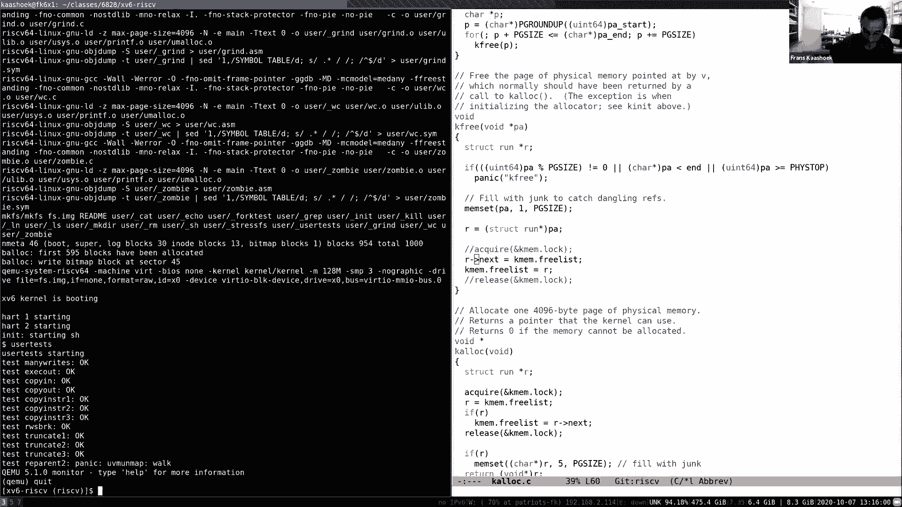

所以你知道，你脑子里应该有的画面，所以我们运行的是多个核心，所以你的 cpu零，所以 cpu零执行指令，两者都有联系，你知道记忆，对，如果你回顾过去，回想一下这个方案的原理图 我们之前展示过几次。

实际上有一个 dram控制器，你知道实际上连接，你知道所有的舞台都在那里，或者所有的记忆都是活的，我要把记忆放大一点，因为我想，有地方画画，所以基本上我们的树列表，你知道吗，住在，在记忆中。

假设上面有一个两页的免费列表，嗯嗯，你两个都知道，呃，两个 CPU，你知道吗，差不多同时呼叫 k 3。

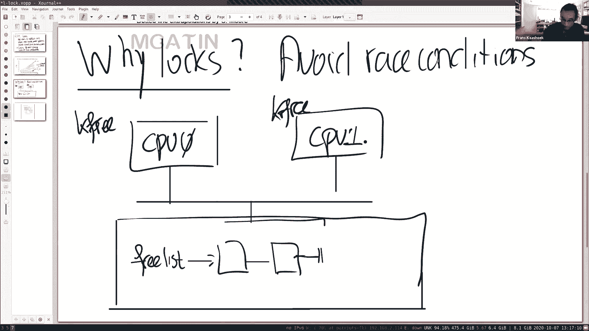

再看一下代码，只是为了确保我们脑子里有这个正确的想法，所以我们看 k 3，你知道他们在某个地方通过了，我们要用一个财政报告。

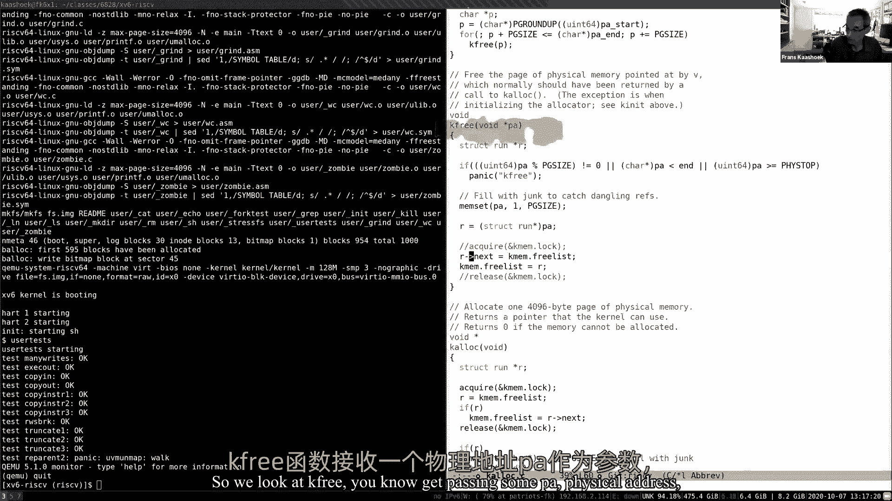

你知道进入免费名单，嗯，所以你知道 cpu 0，呃，你知道一个r，它指向一些，你知道免费页面，呃，也许是的，让我用另一种颜色，所以如果你知道我有简历，我也指着某页，你知道我们想加入免费名单，有意义。

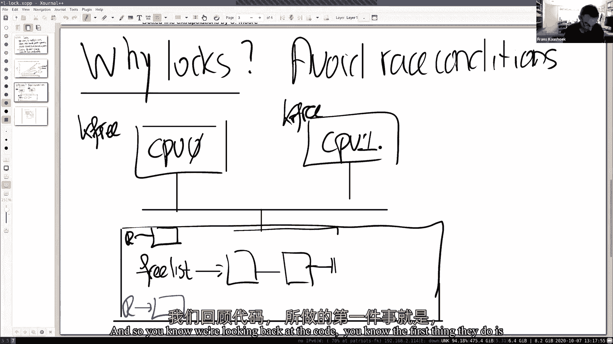

所以你知道我们回头看代码，你知道他们做的第一件事就是，你知道更新我们的下一个指向指向免费列表。

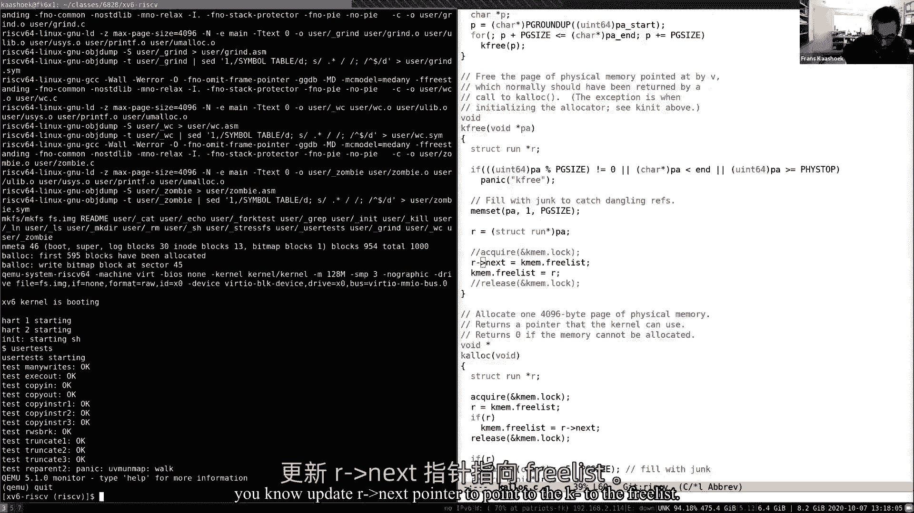

假设你知道 cpu 1先运行，你知道它会做什么，我们会把它的指针，你知道一开始，你知道哪里的字段列表指向，如果你知道 cpon在同一时间运行，呃然后呃，你知道它可以运行，你在知道之前就知道了。

CPU零执行第二条指令，所以它实际上可能会做同样的事情，你知道它实际上也可能运行第一条指令并更新，嗯，并将指针更新为，所以现在两者都是，你知道吗，一个来自cpu 1，一个来自cpu 0，一个来自cpo。

一个指向字段列表的开头，空闲列表也指向字段列表的开头，所以现在有两个剩余的指令正在危险中执行，所以我们会回顾一遍又一遍。

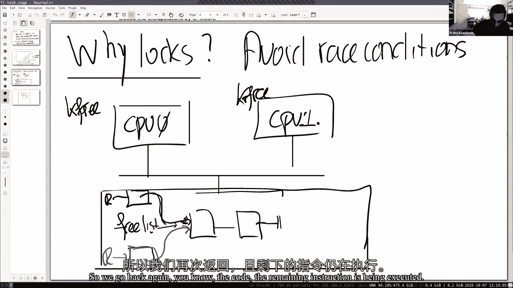

你知道密码，你知道剩下的指令正在执行，实际上是将空闲列表更新为指向 r。

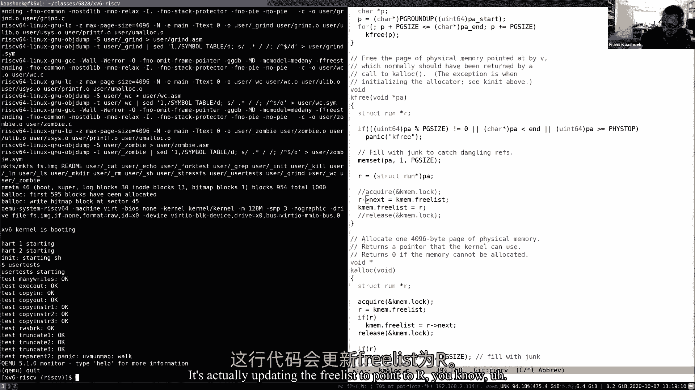

你知道吗，呃所以呃，你知道吗，你知道吗，零和一个将执行，这些指令可能在大致相同的时间完全相同，但有一个会先走对了，只有一个共享内存，所以首先会有一个更新，另一个是第二个，所以我们假设，你知道先走。

你很清楚，然后会发生什么好的事情，三个名单会指向他的简历，呃，然后 cpu 2运行，所以现在 cp 2运行 x这个 x指令，所以它要做的是，它实际上是为了更新，你知道吗，免费点对点列表。

所以这里有一个免费名单，它实际上会指向，那真的是通过了吗，所以你知道，现在有什么设置，正确，我们我们输了，你知道吗，基本上一页，你知道实际上，CPU零 x撤退实际上最终根本不在空闲列表上。

所以我们把那一页弄丢了，嗯，这是一个，你知道吗，糟糕的特定结果，当然，这可能是更糟糕的结果，因为可能会有更多的 CPU尝试做这个免费列表，他们可以观察新的一个，可以观察到三个是暂时指向 CPU的。

零就是，呃，所以我们开始用这口井，然后立即更新免费列表，你知道通过呃，第二个 cpu，所以你参与的越多，你知道吗，大概是吧，我们实际上可以得到比最后一页更奇怪的结果，我们也是，你知道吗，问你知道密码。

你知道怎么相信这个吗，解决这个问题的一个很常见的方法是使用锁，所以让我更详细地讲一下锁，那是什么，你知道吗，什么是锁抽象，好吧，呃，它只是一个物体，就像任何其他类型的，呃，内核中的对象，然后它有一个。

他们只是，实际上有一种叫做结构锁的东西，你知道有一些领域，你知道保持锁的状态，它有一个非常简单的应用程序接口，你知道有一个后天的，实际上，只有两个对这个抽象的调用，哪个，带着指针的车，呃。

一把锁敲了一下，然后释放了，你知道这实际上也需要一个点 通过锁结构基本上更新，你知道锁对象，基本上灯光的规则，你知道吗，这里的规则是，执行以下规则：只有一个过程，你知道吗，可以进入或获得锁。

任何特定的时间点，只有一个过程能够成功地获得锁，访客试图同时获得锁的任何其他过程，所以这个序列，你知道吗，指示，你知道吗，介于，你知道吗，唱诗班和领唱，常被称为关键部分，它被称为关键部分的一个原因是。

把保险丝指令放在一起，呃，你知道吗，需要做更新，你知道我们共享的数据结构，它以原子的方式被锁保护着，呃，基本上如果你有多个指令，你知道在车和释放之间 他们都是一起被处决的 或者没有。

所以从来没有这样的情况，基本上，关键部分的这些指令是交错的，就像我们在比赛中看到的那样，实际上这正是避免这些比赛条件的原因，有什么关于锁阻塞的问题吗，很多锁，事实上，六号有很多锁。

有很多锁的原因是因为你知道，你知道散步连载，你知道行刑的权利，您知道的两个进程想要进入这个关键部分，只有一个人成功，另一个负责关键部分，在第一次之后，它完成了，所以根本就没有什么相似之处。

所以如果内核只有一个锁，你知道这通常被称为大内核锁，基本上所有的系统调用，呃，在内核中被序列化，你知道你会，你知道吗，只是一个启动记录大内核锁的调用，你知道做任何它需要做的事，然后释放大内核锁。

然后基本上返回使用空间，然后第二个系统调用运行，所以我们有一个并行的应用程序，你知道一旦我们并行运行系统调用，突然间你知道所有的系统调用都是串行的，如果我们只有一把锁，所以像 x6这样的程序。

你知道很多锁，因为至少你知道，然后我们可以得到一些并行性，你知道吗，如果你知道两个系统调用，例如，使用两种不同的散步方式，你知道它们实际上可以完全平行地运行，呃没有任何呃 零，因为他们基本上，你知道吗。

呃，使用不同的行走来序列化，现在，呃，有几点很重要，在这个界面上没有人真正执行，你知道你把获取和释放，你知道这取决于程序，所以如果你想让某个特定的代码是原子的，然后由开发人员来把这些获取版本。

我们将清楚地看到，呃，你可以想象，现在有一点，这可能很棘手，所以重要的是要认识到，你知道锁定实际上并不是自动为你完成的，一切都要由开发商来解决，将锁与数据结构关联，并确保你知道适当的获取释放是死的。

所以很明显就像你知道的那样，平行线的行走极限，因此它们的极限性能，所以这就提出了一个问题，什么时候走，你知道吗，我给你一个非常保守的规则，但这是一个很好的起点来思考事情，所以保守的规则。

或者准则是一个更好的措辞 如果你知道两个过程，一个是，其中一个是，作家或更新者，所以这意味着它实际上要修改以共享数据结构，然后您需要一个数据结构的锁，所以这是一个保守的规则，你知道吗，当你在编程时。

你有一个被多个进程访问的数据结构，一个人可以成为作家，在这一点上，你应该想想，好的，有可能是比赛状态，想在比赛条件下避免这种情况，把锁插进去，我会用一个锁保证这种情况不会发生，呃，在某些方面过于严格。

有些情况下你知道没关系，如果两个进程实际上是一个共享的数据结构，一个是写入器，嗯，尤其是，有一些编程风格叫做无块编程，才是这种情况真正发生的地方，你可能想做一个无锁编程。

这基本上是为了获得更好的性能或更多的并行性，无锁程序很棘手，呃，更棘手的是，你知道吗，用区块编程，你知道我们会在学期结束时讨论这个问题，尤其是在操作系统内核中，但也许在这堂课和这学期剩下的大部分时间里。

我们会考虑用散步，你知道，这已经够难的了，你知道吗，只是用锁，不是那么直白的食客，嗯，所以它在一只手上一点点，呃，太严了，呃，因为你并不总是，呃需要，还有一些要输的案子，呃，你可能想输。

你想实际上可能想使用锁，你知道执行一些其他的，比如，如果你看printf，如果我们通过一条流到 printf，你知道 x6内核试图，至少，你知道吗，使整个字符串以原子方式打印。

你也知道这不涉及共享数据结构，呃，但是在这种情况下 使用锁还是很有用的，因为我们希望输出被序列化，所以这条规则不是，你知道完美，但这是一个很好的指导方针，有什么问题吗？嗯，我有个问题，不是关于这个规则。

但是有没有可能两个进程同时获得锁，因此能够改变结构，是啊，否，所以锁的部分契约，抽象是不可能做到的，原型同时获得行走，如果规则是，没有，从来没有两个代理真正获得锁的情况，可以同时握锁。

我们一会儿就会看到如何实现这一点，但是 API或所需的规范，在任何给定的时间点上都只有一个锁，或者零，嗯好吧，所以呃，你知道吗，如果我们看到编程块在这里，呃可能会有问题 因为这些比赛条件，嗯是的，现在。

当然我们在第三场比赛中看到的特殊赛况，或者我们在克鲁创造的东西 在某些方面看起来很容易被发现，你知道的事实是，如果你用王牌检测工具，它会立刻找到它，嗯，但你知道这是更棘手的案子。

所以你可能会想 为什么你不喜欢，使，你知道你做锁或者可以做锁，自动，所以你会遵循我刚才说的这个简单的规则吗，你知道吗，如果我们看到一个共享的数据结构。

然后您就知道了 操作和共享数据结构基本上应该需要遍历，你知道我们应该，我们应该和数据结构联系在一起，每次手术，那就是，呃，在那上面执行，呃，在数据结构上获取并释放锁，所以我们可以这么想，可能是六个条件。

就像每一个结构，你知道吗，有很多，当我们做任何与这个结构相关的事情时，这个锁是自动获得的，结果这个太死板了，这就是为什么你知道走路不是自动的，所以我们的操作系统，下面是一个操作系统的示例。

假设我们有一个类似重新命名的电话，将文件名从一个目录移动到另一个目录，假设我们有一个，我们会把它重新命名为，所以我们在目录中找到了文件名，D 1 x，你知道我们把它改名为，所以，呃，你大概。

如果我们遵循严格的规则，或者像这个自动锁定的规则，接下来会发生的是，你知道这是规则，我们有两个对象，我们有一对一对，所以我们要遵守规则，基本上是自动规则，你知道我们锁定了一个，街区，D一个。

然后你知道我们做第二部分更新，你知道两个街区，二，然后我们就这样做了，这是一种假设的方案 当你想象，如果我们做自动行走，这个例子的重点是你会得到错误的结果，为什么这是一个有问题的计划，为什么这行不通。

所以要考虑的是这个时期，所以我们已经完成了第一步，我们还没完成第二步，然而，另一个过程又能观察到什么呢？文件就会消失，是啊，你知道吗，这是在第一步和第二步之间，文件不存在，这显然是错误的。

因为文件确实存在，只是被重命名，呃，它从不指向时间，它真的不存在，呃，但通过这种方式，只是看起来文件可能实际上并不存在，即使它这样做，真正正确的，你知道吗，我们需要解决这个问题，我们实际上锁定了。

在两个第一重新命名的开始，然后擦除并添加，然后释放，这有意义吗，这里有个例子，我们有一个手术需要多个锁，而且锁不能与两个对象相关联，这就是这个操作的论点，必须是这样的情况，实际上操作本身首先需要两个块。

然后执行操作，所以这个自动锁定系统，你知道吗，直接可能的，会有很多案子，这不是因为运行或只是使用方案，至少会遇到问题，问题，所以我们可以说当我们访问一个数据结构，我们只需要进入。

或者我们必须获取与所有数据结构相关联的所有锁，我们一开始就需要一个，是啊，所以这是做这件事的一种方式，我觉得那很快，基本上就是有一个很大的内核锁，哦，好的，然后你你在手腕上，基本上你不再有并行性了。

所以你想做得更好，对，是啊，我觉得这就是紧张，你知道你可以让事情变得简单，基本上就是所谓的，你知道吗，核心绿堵，呃，但你知道你很放松，失去业绩，否则你可能会失去表现，取决于储物柜的内容是否有意义，谢谢。

呃，所以锁定透视，所以有不同的方法，呃，想想锁，你知道有三种常见的，还有呃，你知道吗，三个都去，也许这可以帮助你思考锁，也许其中一个是你最喜欢的，你可以用这个作为你思考的方式，不过。

看到这一点可能会有所帮助，关于锁 实际上有不同的思维方式，所以，首先，你知道吗，其中一个想法是，避免，如果正确使用锁，则丢失更新或帮助，你知道吗，锁可以帮助避免丢失更新，如果你想想，呃。

你知道丢失的更新基本上是，我们失去了一个更新到 k 3，通过在里面放散步，你知道实际上我们并没有失去更新，所以这是一种思考方式，一种很低级的方式，呃，另一种想法是，你知道你可以做锁，锁。

所以这里有一个关键部分的观点，你知道我们需要走一段路，我们做了一大堆步骤或说明，我们执行他们被释放的指示，基本上整个关键部分作为一个原子操作来执行，这就是所谓的，也是一个很好的方法，你知道想想锁。

然后是第三个，呃，你知道吗，那可能会有帮助，锁的作用真的是锁的健康吗，呃，保持不变，您知道它所保护的共享数据结构的不变式，呃，真正的情况是在唱诗班之前，如果没有锁，你知道，当我们获得锁并做一些操作时。

这个不变量是成立的，那么不变量可能会暂时违反它，但在我们发布的时候，所以如果你想想我们的免费名单，如果你知道不变量是，那就是，你知道三个指针指向另一个指针，所有的三页都在一个列表上，暂时违反了。

呃在这一点上，在三人组的中间，因为就像多个指针，实际上指向自由列表的开始，嗯，然后是建立在它的最后，所以在你知道为你知道，预先列出的，它有一个不那么复杂的变体，但是对于更复杂的共享数据结构。

这可能是一种有益的思维方式，实际上这把锁对你的作用，嗯，所以即使是在这种情况下，你知道所有三个锁透视或合理透视，嗯嗯你知道，也许他们中的一个，你知道你带来的比其他任何一个都多，和，你知道吗。

以此作为你思考锁的方式，关于这一点有什么问题吗？好的，嗯所以我现在要跑几件事，呃，呃，呃，算是吧，呃，你知道吗，不受欢迎的特性，或者这实际上可能发生在锁上，你也知道，我们知道锁是解决正确性问题所必需的。

你知道吗，为了避免这些比赛条件，但在不合适的时候走进来，使用不当，也可以介绍自己的一套问题，所以我想谈谈，所以显而易见的是，当然是僵局，你知道吗，或例子，你知道最简单的情况，你知道有点无聊。

但我是说你一边工作 一边想着，你知道如果你做了一个收购，你知道一把锁，所以你开始了关键部分，在关键的部分，你做了另一个唱诗班在相同的步行，会发生什么，第二收购方能否成功，根据我们早先给出的规格，呃。

你知道这不应该被允许，所以基本上第二个收购者必须阻止第一个收购者，把锁打开，但那是，你知道整个过程，所以基本上这将导致一个死锁，这是死锁的一个简单例子，呃，也许现在很有趣，事实上，这是一个僵局。

有62个文本，你知道吗，因为当它看到同样的过程 需要再次走同样的路，呃，实际上，你知道吗，引起恐慌，更有趣的情况是 当多次行走和参与，呃，让我们来看前面的例子，假设我们有以下一个，我们有一个。

或者也许应该是一个，我们有两个，你知道吗，执行 v名称，两个 cpu同时执行，重新命名，以另一种方式，在另一个方向，你知道的，两个一个，你知道我说 b只是为了让名字不同。

所以这里要观察的关键是 CPU 1，你知道运行一个从 d 1到 d 2的重命名和 cpu，呃2号正好相反，把名字从 d 2改为 d 1，所以让我们假设我们实际上按照它们的论点的顺序获得了行走。

所以正确的做法是在这种情况下，你知道我们会得到两把锁，从前面的例子中我们知道，这其实很重要，所以获取，做一把锁，你也知道，假设他们真的跑了，你知道吗，真正并行的，所以在这一点上，你知道吗。

另一个人可能会首先得到这两个，因为这是它的第一个论点，现在，当然，两个两个想要两个，所以我会试着抓住你们两个，会成功吗，我不会成功的，因为你知道，另一个人，你知道实际上有锁。

所以这个人会停在这里 不再继续，让我们看看另一个 cpu，中队二号取得中队二号，它的第二个论证不需要 done，他打算打电话给，它将被称为获取，它能继续吗 不，它将无法进行正确的。

因为 cpu 1实际上锁定了 d 1，所以在这里我们，你知道吗，有时这被称为致命的拥抱，你知道吗，呃是，你知道吗，因为我们获得订单的方式，我们订的，我们相当，锁实际上会导致死锁，这个例子有意义吗。

这是一个更高级的例子，对僵局，你知道这不是一个明显的，呃，问题，从某种意义上说，这个解决方案是合理的，简单，呃，解决方案是你知道如果你有多个块，然后你得订购锁，所有的行动都必须按照这个顺序进行。

所以如果你是系统设计师，您必须决定您知道所有日志对象的全局顺序是什么，例如，在这种情况下，你可能想说，d一应该总是在d二之前订购，这意味着，当我们执行重命名时，生命的法则是，我们总是得到，呃。

较低的数字，呃，目录第一，在我们确定高度或顺序之前，这将确保基本上有一个全球秩序，你知道这个特殊的情况 你就是不可能，呃，因为你知道，对这家伙的封锁命令将被执行，这个家伙将以相同的全球顺序获得锁。

你知道一二，我们没有这些致命的英国人，没道理，有什么问题吗？所以这说明了一个小问题，即使喜欢好吧，所以它修复，你知道这种僵局的问题，因为有全球秩序，而没有，只是这个秩序是全球性的，嗯，这是一个。

有点问题，呃，在设计系统时，因为嗯，等一下，是啊，如果你想想，你知道吗，像是步行点餐，呃，你知道这必须是全球性的，所以如果一个模块，1米，你知道吗，调用和方法，还有项圈，你知道吗，一克，你知道吗。

可能需要意识到，或者你需要知道，也不知道买了什么锁，或获奖散步，你知道吗，两种用途，呃，因为呃，如果你知道，为了呃，再用几组积木，你知道如果我们遵循我们的步行点餐规则，呃，它获得了所有的锁，你知道吗。

从 f和 g一起，实际上在一些，呃，全球秩序，所以这真的意味着，在最近的术语中，我两个的永恒，一定是我能看见的，所以你知道，一个可以确保你真的知道电话，两个以适当的方式在里面。

从某些方面来说 这是对抽象的违反，对，你知道抽象是完美的，你知道吗，我真的不知道，我们需要知道 M2是如何实现的，不幸的是，锁，一个常见的例子就是，你知道吗，有两个可能会泄露给他们一个。

因为我们真的需要知道，所以当你设计一个更大的系统时，呃，你知道吗，这使得模块化更加复杂，哦，对不起，我只是在想，它需要是一个完整的，嗯，锁的顺序，或者会不会有一些街区，嗯，以任何方式订购，他们，是啊。

看情况，如果像 f和 g，你知道吗，共享任何锁，对，是啊，例如，如果你喜欢看 xv 6，是一系列锁的顺序，因为一些街区和其他锁无关，所以他们知道他们从来没有一起获得，所以如果他们从来没有一起获得。

它们只是连接在一起的块集，如果你愿意，然后只有，您必须确保一个特定的锁集中的顺序是全局的，所以正确的是没有，不一定要全球订货，但就像你知道的所有功能一样，操纵相同的共享类型的锁 它。

他们需要就全球秩序达成一致，谢谢，为了，好的，所以一个，你知道吗，另一种呃挑战，呃带盒子的，呃，你知道吗，我们现在看到了两个挑战，一是僵局，一是模块化，呃，第二个，呃，挑战或第三个挑战只是锁和性能。

你知道吗，我已经暗示过几次了，但它需要足够重要来强调，所以基本上如果我们想，呃，业绩，您需要拆分数据结构，对，所以如果你有一个很大的内核锁，呃，这将限制您的性能 基本上在一个单一的 cpu中的性能。

如果你愿意，你知道吗，业绩，呃，你想让它和众多的cpus一起表演音阶，你得把它们分开，您需要拆分数据结构，最好的分裂，你知道吗，不明显，也可能是个挑战，你知道吗，例如，你知道吗。

是否将锁与每个目录关联起来，你应该把这把锁和，我知道，你知道吗，您是否应该将锁与每个进程关联起来，呃，还是更好，以不同的方式分割数据结构，如果你改变一下，你知道你要重新设计锁的规则，然后他们必须确保。

你知道吗，你仍然保持着内核想要保持的不变性，如果你开锁，你还得重写代码，或者你可能需要写，可能需要你编写代码，结果发现基本上，你应该重构，你知道吗，你的内核的一部分 或者你的程序的一部分。

通过分解数据结构获得更好的表单，OPS，引入更多散步，你知道这只是，工作量很大，你得仔细考虑 保持射程，你想要维护的，你得重写代码，所以总的来说，这只是一个很大的工作，他们不容易，呃，所以这有点消极。

你知道吗，新闻点，对，因为你知道你想要更好的表现，这表明你知道更多的散步，呃，但你知道这实际上是一个，你知道吗，很多工作，所以一般的食谱，你知道怎么去，这是为了，你知道开始，当然，绿色街区，再测量。

所以不管怎么样，在你的内核上运行一堆应用程序，看看你是否真的得到了，如果他们真的利用了多个漏洞，你就会加快速度，如果他们这样做了，你知道你基本上做对了，如果你不加快速度，你的锁设计已经足够好了。

基本上这意味着某个锁是竞争的，多个进程试图获得相同的锁，因此它们被连载，你就知道你得重新考虑，然后你需要重新设计，但关键是你想被引导，你知道吗，通过这些，呃，测量，因为它可能是衰变，你知道一些模块。

当然，绿块只是不经常平行调用，因此没有必要重新设计，因为重新设计是一项艰巨的工作，你知道吗，你也知道 这也会使关于代码的推理变得复杂，你知道吗，然后你知道这是个好主意 实际上不做重新设计是，不用了。

所以一般来说，一个好的形式规则是，你知道吗，从航向积木开始，度量争用是否出现在这些锁之一中，然后重新设计系统的这一部分，这样你就会变得更好，并行性，到目前为止，所有的问题都有意义吗，好的，让我们看看。

呃，呃，所以让我们看看它在 x6和呃，你知道一些代码，你知道，所以，你可以理解一点。

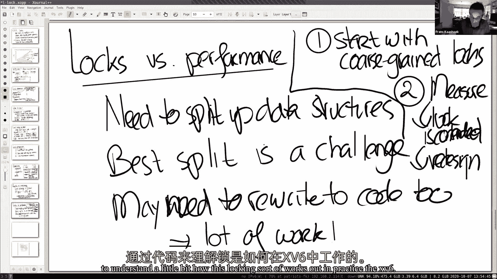

所以我要回到我们的，呃。

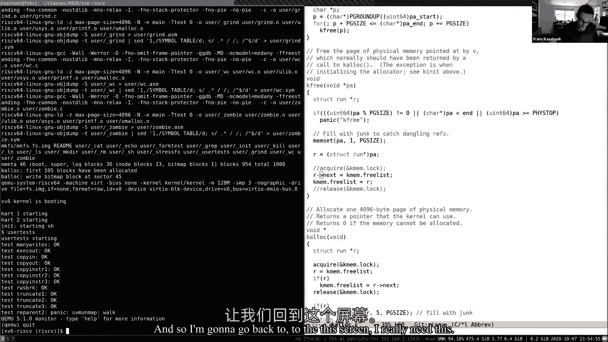

对着这个屏幕，我真的很需要这个，我想看你的作品 因为你知道，我们开始讨论锁定那里，在一个，星期一我想再仔细看看，现在我们对锁有了更多的了解，同时也说明了一些有趣的观点，所以首先，呃，你知道吗，结果发现。

你知道吗，你所知道的一切，它在看，你知道吗，结果发现 UART实际上只有一把锁，所以你可以认为这是合理的，粗粒，呃，在这个特定的时刻设计，至少对你来说 艺术，尤其是那把锁，你知道吗，保护，呃。

基本上是 uart传输缓冲区和正确的指针和读取指针，所以当我们传送，你知道吗，右边的指针指向传输缓冲区中的下一个空闲槽，三个指针是下一个需要传输的插槽，所以让我回去把它用完，所以案例研究，有一个阅读点。

有一个右指针或写读索引和读索引，这个必须去纽约展示，这位是作家，printf可能会将字符插入到这个缓冲区中，所以你知道我们可以看到的是锁，呃，你知道吗，锁有多个角色，一是要基本保护好这个数据结构。

数据结构必须是方差，即继续阅读，你知道吗，右边和 r和 w之间的任何东西，我们的角色需要，任何介于 w和 r之间的东西实际上都是空的，插槽和锁基本上帮助我们保持不变，你知道吗，让我们看看合唱团。

所以在这里你可以看到，你知道吗，你知道的第一件事就是，你知道吗，抢锁再贴人物，如果缓冲区里有个地方，你知道印刷，把锁打开，所以如果两个进程同时调用 c，那么这个锁将确保你知道。

第一个进程中的一个字符进入第一个插槽，然后第二个过程的第二个字符，你知道在下一个插槽，我们知道它们最后会出现在同一个位置上，对，所以这就像一个明显的例子，在那里散步，你知道吗，帮助我们，避免比赛条件。

否则第二个进程可能会覆盖，你知道第一个过程是性格，所以这是一部分，所以如果你去看一个我们之前做了一点，如果你看看开始，你知道吗，我们看到更多的事情在发生，呃，呃，我们实际上看到，呃，如果缓冲区不是。

你知道吗，呃，如果缓冲区不是空的，然后你知道我们知道基本上有一堆呃，正在进步或被发送的字符，你知道锁，你知道吗，确保我们不会真的覆盖其中任何一个，所以任何排在队伍末尾的东西，呃，实际上是被美国艺术。

我们确保我们基本上不会修改或干扰，因为你知道，抓住一把锁，最后，越来越多的事情是，权利，你知道去注册登记，就像寄存器，其中只有一个，你知道吗，基本上这把锁确保了，呃，你要记住，你是开始被称为与锁举行。

当然基本上只有一个作家，所以另一种不变量，或者锁定执行的另一个方面，是硬件寄存器，有一个作家，现在我还想谈一件事，那就是，呃，你知道吗，如果你刚刚做对了，硬件做好了，然后有一个中断。

你知道我们在你开始之前就知道了，对吧，你知道我们要做的颜色，它在衣领上需要散步，以确保我们不会有多个实体向正确的寄存器写入，嗯所以呃，查看器中断本身可以平行运行，你知道吗。

使用另一个叫做 printf的进程，所以我们有一个叫做printf的进程，它运行一个cpu 0，在cpu上，实际上是用r来中断，因为也许它什么也没做，所以它准备好了，在任何特定的时间点中断，它会的。

呃开始吧，必须是正确的，你知道我们想确保有一个作家，你知道这些硬件寄存器，或保护，你知道吗，传输缓冲区的不变性，你知道我们有获取锁，所以事实是，呃在第六季，实际上这打断了，你知道吗，能跑，你知道吗。

因此，驱动程序的下半部分可以真正并发地运行，在不同的处理器上，驱动程序的上半部分，所以，因此，你知道吗，中断功能也需要步行，事实上，在这种情况下，呃，你知道吗，它需要一把锁，然后叫你开始，把锁打开。

我马上回来，因为在实现锁的过程中，以这样一种方式，这实际上是正确的，实际上你应该担心的是，我很快就会说的，让我推迟到我到达那里，好的，所以任何关于这个的问题都是在美国艺术中使用锁的简单例子，好的。

让我来，呃，手指，请让我谈谈实现锁，所以规范是只有一个进程可以获得锁，在任何时间点都不会有一个以上的锁，你知道我们知道如何看待和理解，其实，你是如何以这样一种方式实现步行的，这种方式实际上是保证的。

但让我先写一个破锁，呃，这样我们就明白了 你知道挑战是什么，呃，还是一个破产的收购者，所以现在我们知道真正的挑战是什么，呃，所以这是我破了的，呃，所以，你知道它的作用是，接下来是，它有一个无限的循环。

当一个，锁定为零，意思是没人拿着它，然后继续打电话的人，她抓起木头，所以我们锁定了一个，你也知道，在这一点上，我们得到了锁，所以我们再也没有什么可做的了，如果我们没有被锁定，因为当锁是一把的时候。

这意味着有人在持锁，所以我们不停地旋转 等着绕着圈圈转一遍又一遍，直到你知道整个锁被称为释放，它将锁定，将锁定为零，你也知道，那么这个特定的实现有什么问题呢，我想两个进程可能会读出它没有同时锁定，是啊。

是的，所以这里有一个比赛条件，对啊，我只是想确保比赛就在这里，我们基本上可以有两个 CPU进来，你知道吗，所以如果我们用时间图和 cpu 1，呃，CPU零，你知道这是一个声明。

可能这两个都是 cpu 1，你知道达到声明 a，呃，和cpu 0，cpu，the，um，0，1，对于每个语句a，所以他们都看到锁定为零，然后双方执行 b，在这里他们看到锁定为零，这家伙看到锁定为零。

所以它们都执行语句 b 并且都获得了一个锁，你知道违反了，你知道这个特殊功能的规格是有意义的，结果是，你知道吗，来解决这个问题 并得到一个正确的实现，有多种方法可以做到这一点。

但最常见的方法是基本上依靠一个特殊的硬件指令，一种动脉指令 基本上它的作用是，它做这个测试，从原子上来说，嗯所以呃，解决这个问题的办法是，你的想法是，你知道在风险五，你知道这个指令实际上是原子记忆操作。

SWAP，呃，我们要用，呃，它基本上可以归结为测试，然后是一套，你也知道，基本上有了硬件保证 你会，所以，当你拿着这个，呃，需要两个论点或三个论点，地址，寄存器，从本质上讲，硬件的作用。

只是在概念上它基本上锁定了地址，如果你愿意，我稍后会讲到这一点，但洛克的地址是，输入一个临时变量，你知道吗，在那个特定地址的实际值，将 r 1的值写入该地址，然后将原来在地址处的值放入，呃，临时的值。

也就是原来的值，实际上是地址在一个r 2中，然后基本上在散步和返回，你知道在这把锁里，如果你能保证这个测试，你知道在哪里测试的结果返回到 r 2，集合实际上发生在原子上，这是一个硬件指令，呃。

大多数处理器都是这样的 半弧形指令，因为这是一种方便的方法来实现块，嗯，所以基本上我们所做的就是，我们降低了它的原子性，呃，从，或者软件锁的实现 基本上是硬件锁的实现。

所以处理器可能会以非常不同的方式实现这一点，所以基本上，呃，指令集本身就像一个规范，它实际上没有说它是如何实现的，这在实际执行中非常依赖，这取决于，关于记忆系统到底是如何工作的，例如。

我如果你知道预算处理器，呃，共享一个内存控制器，并重写到内存，那么内存控制器实际上可以支持这个操作，你基本上可以在，基本上我们在一个特定的地址散步，你知道吗，然后让你知道一个处理器做两个操作。

或者如果我们指示，然后基本上解锁，因为所有的处理器和重写都要经过这个内存控制器，内存控制器可以进行排序或阻塞，呃如果，呃，通常是公共汽车仲裁者真正能做到这一点，公共汽车仲裁者支持。

基本上是在原子波中执行两个内存操作，呃，如果是，如果处理器有缓存，呃，那就是典型的协议资金的一部分，在这里 kehere的协议将确保，如果有作家，你知道那个特别的，缓存行。

你知道我们想要更新的值最终会出现在一个缓存中，然后你知道，基本上，处理器可以通过两个操作锁定单个缓存线，所以你知道这其中的含义，有很多不同的方法，呃，但从概念上讲，呃，呃，怎么回事，就像你走在地址上。

你读出了原值，你存储了新的值，把旧的价值还给你，这有意义吗，为了做到这一点，看看我们如何使用这个指令，让我们看看在 x中获取租赁的实现，五，六，然后我们会揭露一些其他有趣的细节，所以让我先，呃。

启动旋转锁定，呃，像年龄一样旋转，如你所见，很简单，呃，你有一个平坦的块，就像我们都铎王朝的法典一样，然后它有两个其他的东西来调试，即锁和 cpu的名称，最后一个，当前的 cpu实际上持有锁。

这主要是为了打印调试消息，例如，如果你在同一个 cpu上做了两个，呃，所以让我们从唱诗班开始，嗯，让我们先看看这个循环，所以这实际上是，呃，我刚才说的那种测试，结果发现在。

c标准实际上定义了其中一个原子操作，所以嗯，所以c标准实际上有一个函数，它说，你知道吗，同步锁定，测试和设置，基本上它指定了我刚才描述的行为，每个处理器基本上都需要，你知道实施，呃，这种行为。

因为大多数处理器都有匹配的测试和硬件指令，事实证明这是一个合理的，对于流程实现来说很简单，所以，事实上，如果你看看内核，你知道吗，我们可以查看装配说明，你知道风险5处理器，是呃，是否需要装配说明？

这里是原子交换指令，呃，如你所见，呃，如果你知道原子交换，基本上就是登记，五，呃，作为输入，结果也是5分，一个是地址的保留，呃，如果不平等，呃，我们回来了，否则基本上我们就会回到，你知道，呃，跳回，呃。

仔细检查，在这里改变正确的东西，呃，六分之四，如果不等于去公牛二十加二十二，有点难以计算，但基本上在一种情况下，在另一种情况下，我们分支回来，呃，所以这使得只看 c代码更容易，我们进去吧。

如果没有锁的话 会发生什么，呃，1。我锁得好，值多少钱？锁将为零，所以我们称之为测试，接下来会发生的是，我们写一个，是啊，走进来，但是返回先前的值，所以如果前一个值是零，那我们就没事了。

因为这意味着没有人拿着锁，我们失败了，我们已经完成了这个循环，假设日志值是1，所以锁实际上是锁得很好的，这条指令有什么作用？上面写着，你知道旧的价值，把它放在现场，正确，这实际上是一个在这种情况下。

然后在那个地方写一个新的，但这改变不了什么，因为有一个锁已经被锁定了，函数会返回一个，表明之前的某个人，已经锁上了，所以在这种情况下 它不等于零，所以我们会旋转，我们会一直旋转 直到锁定目标，呃。

在发行版中发生了零级和缩放级，有什么问题吗？所以现在，基本上，你知道吗，我们来看看相应的，这里是，呃，释放行动，如果你再把内核看成 m，那个指示，呃，所以让我们希望发布可能是在它发布后。

所以这个版本实际上也使用了这个原子交换指令，把0加到1里，所以基本上可以保证这个原子更新，你知道我锁门还是锁门，把零写入 lk锁定是原子操作，你们中的许多人都问为什么不，你知道吗，把存储指令还原为0。

有人想知道为什么这可能不起作用吗，或者有什么问题，因为其他进程可能会在日志中写入1或者再写入0，但情况可能是这样，对吧，是啊，好吧，有可能是好的，所以可能有两个进程或者两个 cpus，同时给我写信，对。

呃，但我认为真正的问题是对很多人来说，我经常假设这也是你当你做一个单一的存储指令，这有点像原子操作，呃，但情况并不总是这样，你知道吗，例如，如果你和它真的依赖于像这样的架构实现，例如。

如果高速缓存协议工作，或者高速缓存系统使用高速缓存线工作，其中缓存线可能大于整数，通常比整数大，接下来发生的是，第一个操作是加载缓存行，然后更新缓存行，所以实际上存储指令基本上有两个微操作。

你可能会得到错误的结果，所以我，你知道到缺乏，你知道吗，必须准确理解任何硬件实现，以及整数操作是否是原子操作，或者写到64位，六十四，呃有点，内存值和原子操作，你知道吗。

我们使用的风险五操作是保证执行原子，这有意义吗，好的，好的，所以只是为了，呃，只是为了让你开心，呃，原子交换不是唯一存在的指令，呃，这是冒险飞行手册，你也知道，列出了一系列原子操作，所以原子的末端。

一种原子矿石，有一个最大的分钟，所有的人都可以在原子操作中读写一个值，所以在这个具体的实现中，我还想指出一些其他的事情，呃，让我重新开始，回去获取，呃，所以获取功能首先要做的事情之一，呃，是吗？

呃关闭中断，如果能理解为什么会这样，因此，我要回到我们的考试代码，你再考虑一下，所以我们要考虑这个案子，acquis实际上可能执行不正确，没有关闭爆发，所以我们要考虑的是 如果我们去找你的种子。

在这里你知道，假设你把 c加起来，获得锁，但没有关闭，打断了可能发生的事情，给大家几秒钟考虑，但如果你有一个想法或为什么它可能是错误的，你知道就像跳进去，嗯，也许它可能会被打断，因为，嗯，因为钟表。

然后发生了一些事情，它需要打印一些其他的东西，它再次尝试你的推杆 c，锁已经被拿走了，是啊，这可能是一种可能的情况，呃，有一个更直接的例子，所以我们只能说你可以看到，你知道吗，格雷洛克。

你基本上是在传输一些字符，所以你刚刚完成了传输字符，它是做什么的，如果成本是中断，正确，你在打断美国，你要打断的是同一个锁，你知道它是正确的，接下来会发生什么。

如果只有一个 cpu 所以没有其他 cpu，中断可能运行良好的地方，我们陷入僵局，对，因为当前的 cpu控制着锁，作为你的一部分，后来中断了，它试图做的第一件事实际上是很多已经持有的东西，实际上你知道。

在 xp6的情况下，你知道我们会恐慌的，你知道吗，因为你知道，同样的 cpu实际上是在尝试再次获得同样的行走，所以基本上，你知道什么是获取或旋转锁的交易，是两种不同类型的并发性，你知道一个。

两个不同的 cpu之间有某种并发性，我们要确保，例如，如果中断函数运行在不同的 cpu上，基本上我们不会在传输缓冲器上得到加薪，但如果它们运行在同一个 cpu中，我们得确保这仍然是一个话题。

这并没有被打断，所以我们在唱诗班里把纱线关掉，它们只有在释放结束时才会再次打开，当锁被释放的时候，在这一点上，它又安全了，你知道接受这些干扰，因为锁实际上不再释放了，不再拥有它 不再拥有健康。

这有意义吗，好的，在这个实现中还有一件更微妙的事情 我想谈谈，嗯，我们需要处理的问题，呃，这就是记忆排序，所以呃，例子，如果你想想，你知道锁是，比方说获得，锁住了，你知道对一个，也许我们有一个关键部分。

在这个部分中，你知道x是除了x加一之外的，然后要求释放，你知道说锁到零，所以你可以考虑在一个特定的，CPU，你知道吗，这些是正在执行的指令，如果代码仅仅是顺序的，处理器，导管，或重新订购指示，你知道吗。

只是为了得到更好的表现，所以，例如，呃，如果它是一个连续的流，把这个指示移到之后，这会改变单一执行流的正确性吗，你知道不对，你不知道和它有什么关系，所以完全没问题，如果是顺序执行，你知道吗。

散步后搬家了，呃，对数零，所以你知道，在单曲上，单个串行执行，没关系，事实上，所以实际上，处理器，你知道吗，一直这样，你知道他们确实有效地执行东西或期望执行指令，所以这基本上可以导致这些指令重组。

编译器也这样做，你知道，也许优化，你知道一些代码路径，它还会重新排序指令，只要它喜欢，你知道吗，结果是相同的连续执行，但很明显在同时执行的过程中，这将是一场灾难，对 因为如果需要什么，这是我们的释放。

基本上我们所做的，我们把关键部分移到了获取版本之外，这是完全不正确的，所以在并行执行中 这是错误的错误，所以你知道在硬件中禁止或告诉编译器，你不知道这样做，呃，有一种东西叫做记忆栅栏，或者我同步的东西。

呃，有一条指令基本上是说，就像之前的存储一样，你不能越过这一点，所以释放有这个，呃获取有这个，所以，例如，这个 x加 x加1，如果这是在唱诗班之后更新的，在释放之前，那个 x加 x加1必须在。

你知道这个特定的内存同步点，所以不会是，不会有麻烦的，呃，内存排序，所以这就是为什么同步在那里同步的原因，在发行的时候，唱诗班里还有一个，这有意义吗，我有个问题，是的，嗯，是按照惯例，港口，所以我想。

我想，编译器可以发现在获得锁之前有一条指令，在锁被释放后 它也可以被移动，是啊嗯，会发生这种事吗，还是会遇到障碍 看到你会看到，你知道吗，在这种情况下，格雷格收购有一个障碍，释放是一个障碍。

所以在锁定之前发生的任何事情都被设置为一，在那之前就会发生，也不会通过那个指令，所以这是一个障碍，所以你会的，这是第二道障碍，所以这意味着在这里之前的任何指示都留在这里。

两者之间的任何指示都将发生在两者之间，在获取和释放之间，接下来的指示，你知道吗，释放后会留下来，好的，所以我们要跑，呃，你知道吗，接近尾声，呃，所以让我，只是实际上，呃，在这里结束，所以呃，所以锁。

你知道吗，块对正确性有好处，呃，为了表现我们可以这么做，这有点令人沮丧 正确 因为我们是我们，你知道吗，进入锁基本上是为了在空中执行时获得正确性，但锁实际上限制了并行执行，所以一锁和两锁很复杂。

你将会体验到，在我们将要做的一些实验室里，事实上，从现在开始，我们会看到锁店一直出现，这将给我们，呃，你知道吗，至少，你知道一些想法，你得明白，比如为什么会有锁，你知道他们保护的是什么。

但如果你做并行编程，它们是与生俱来的，你知道你需要使用锁，所以你知道，如果你想避免锁引起的并发症，你知道有几件事你可以做，你知道吗，不要分享，如果你不需要，如果您没有共享的数据结构。

这些比赛条件不能发生，*如此如此如此*，你不需要锁，所以你不需要复杂的程序，但你知道，通常，您会有一些共享的数据结构，你会做的，呃，你需要锁，我觉得应该从粗粒度开始，然后移动到细粒度，如有必要。

根据你知道的测量结果 你想确定，我们确保锁实际上是竞争的，你知道在你真正，你开始重新设计，最后，你知道吗，使用种族探测器，其中一个比赛检测工具，这样你就可以发现问题或比赛条件，因为你知道你把锁放错了。

或者你把获取释放物的地方放错了，事实上，你知道你仍然有种族，好的，所以这是一个关于散步的快速介绍，呃，我们将讨论更多关于锁的问题，基本上在这学期剩下的时间里，我们将进一步讨论无锁程序。

最后看看内核是怎么做的，好的，所以让我停在这里，所以任何要去别的地方的人都可以去，呃，但如果你还有什么问题，请随意，请随便问他们，我们在聊天的时候有个问题，栅栏的指示不是不必要的吗。

因为 amo交换指令可以有获取释放顺序，是啊，呃，好的，所以呃，所以这两件事，呃，那里有同步结构，对于编译器和硬件来说，是啊，我要跳下去了，呃，开始办公时间。

但我认为在你如何做到这一点上 还有更多的问题，对于编译器，只有编译器注意到正在编译的体系结构，所以我们会知道它是否真的需要插入适当的栅栏，你知道吗，不管是什么建筑在运行，不管它有什么记忆一致性模型。

所以这个讨论有点复杂，每个硬件都有一个内存模型，编译器必须决定，你知道吗，给定特定架构的内存模型，它实际上能做什么 它不能做什么，我想我的问题是，就像栅栏指示只会变得不必要，如果你叫弹药，SWAP。

就像把，在那里它将与，你知道吗，编译器排序，然后记忆顺序，和失序，是啊，使用围栏指令的机械，只有在你做dot rl的情况下，指令才是不必要的，所以它似乎不会察觉，那么你会怎么做呢。

所以编译器在它的末端强制执行排序，但你已经用亚马逊网站，是啊，所以就像，呃，如果你，这是个很好的问题，你知道这是一个更复杂的，获取这些实现是指我们专门获取一个版本，人工林或人工林。

为什么我们可能会做比我们漂亮的地方更复杂的事情，当然，仅仅通过发出栅栏指令，但这有点复杂，嗯，所以如果你，呃，如果你对这个感兴趣，嗯，风险驱动的记忆模型是一个非常复杂的，所以如果你看一下之前的说明书。

有整整一章，你知道记忆订单，并告诉你他们必须把什么，在这种特殊情况下 编译器应该做的事情，所以你是说编译器会发现，我们把装配指令放在里面，它不会自己重新排序任何内存访问，当然同步了。

这个同步库函数是一个库函数对吧，它可以以不同的方式实现，这是一个特殊的实现，库函数由编译器提供，呃，但是有没有让编译器做优化的选项，在那里它自己移动货物和存储，是的，你这样做，你如何防止这种情况。

而不发出栅栏指示，这不是真的，我想我的意思是，呃，也许呃，我的意思是基本上，这表明，同步基本上告诉编译器和硬件，但编译器实际上可以以不同的方式实现同步，它知道它不能移动东西。

但它不必发布和围栏关于风险五的指示，它知道它在风险五的情况下以一种特殊的方式运行，但风险不是，五记忆模型，就像足够松散的地方，在那里故障的机器可以重组东西，所以你确实需要，就像收购，就像拥有好的，好的。

所以他们更多的是，它们是比同步更复杂的界面，哪一个给编译器编写者更多的，它给了编程更多的自由，会给编译器一些解耦，编译器部分和处理器部分，例如，我觉得有一面旗子你可以插进去，你知道说这是一种释放。

一致同步，你知道我不知道我脑袋里的细节，但你可以调查一下，这是一种粗粒度的界面，有更多的细粒度接口，给程序员更多的控制，我有个问题，一是，嗯，您喜欢在一个处理器上有多个线程吗？

你的辩论方式和我们在多人案件中的辩论方式大致相同吗，所以你能重复一下那个问题吗，只是为了确保，I，所以我们没有，我想我不认为我们真的谈到了多个线程，我们主要讨论的是多 CPU，所以对于多个线程来说，嗯。

我想解决办法和，当你有多个 cpus时，就像，你们也有同样的观点吗，或多或少，呃，至少在概念上是正确的思考方式，所以如果你有多个线程，但是只有一个 cpu，你还是想确保，呃，内核代码序列以原子方式执行。

所以你仍然需要有一个关键部分的概念，呃，您可能不需要显式的锁或释放，但你确实需要一种方法来打开 断断续续，在一段特定的代码中，所以如果你看看旧的操作系统内核，他们通常不会在内核中锁定唱诗班。

因为他们认为他们运行在一个单一的处理器上，但它们确实有锁之类的东西，你知道吗，基本上关闭中断，打开和关闭中断，好的，原来如此，嗯，我的另一个问题是，嗯，实际上在幻灯片上，是啊，是吗？是啊。

这种情况下 阅读总是会落后，我不明白，是啊，好的，所以这个去展示，是啊，不管里面有什么，你知道吗，基本上这是需要显示的字符序列，而且作者基本上是在添加越来越多的字符对吧，所以作者是这样写的。

基本上你认识的读者会跟随作者对吧，因为你知道不能打印 没有，你知道吗，放进缓冲器了吗，就像你知道你是什么 把东西放在展示上，你知道吗，我们会，你知道吗，开始基本上把第一个字符，就像在这个插槽里。

你知道吗，在显示器上，同时 printf可以进来，多台打印机，你知道他们在这里放了更多的角色，所以正确的指针基本上就站在这里，当这个字符显示出来的时候，你就会知道 uart会向上移动这个指针，呃。

显示下一个字符，所以 URI总是落后于作者，直到它赶上了，如果 r和 w是一样的，在这一点上，基本上这意味着缓冲区中不再有字符了，哦好吧，原来如此，这就更有道理了，好的，非常感谢，还有问题吗？

只剩下这里了，好的。

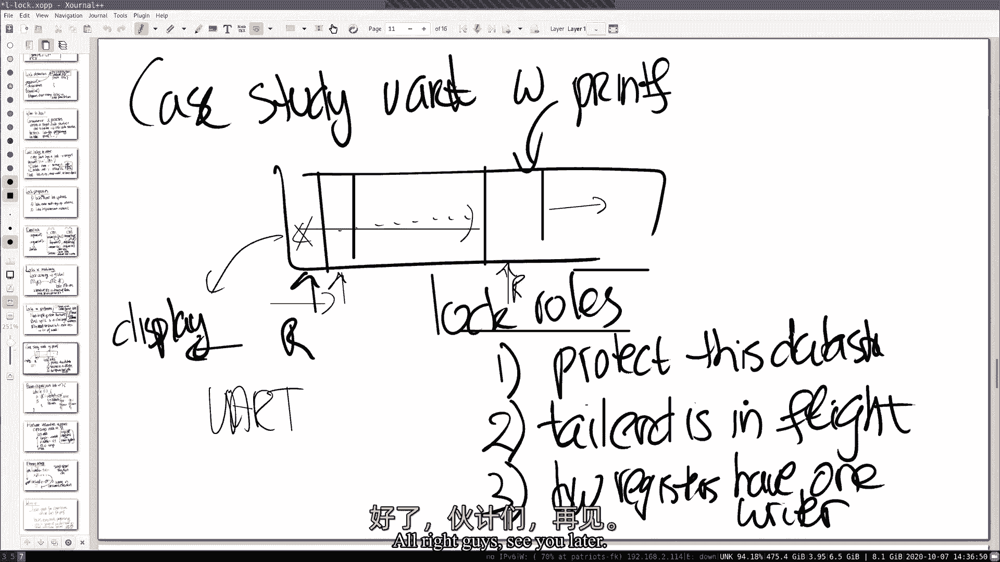

