# 002：Shell 脚本基础与工具

在本节课中，我们将要学习 Shell 脚本的基础语法和一些能极大提升效率的 Shell 工具。课程分为两部分：首先，我们将深入 Bash 脚本的变量、控制流和函数；然后，我们将介绍一些用于查找文件、搜索内容和浏览历史的强大工具。

## Shell 脚本基础

上一节我们介绍了 Shell 的基本概念和命令执行。本节中我们来看看如何编写 Shell 脚本，包括变量、字符串和控制流。

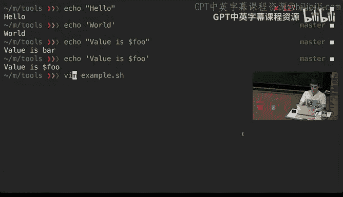

### 变量与赋值

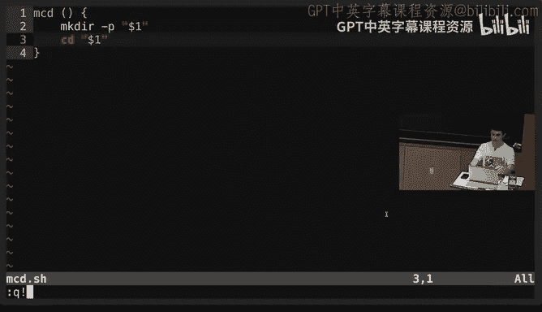

在 Shell 中定义变量时，等号两边不能有空格。空格在 Shell 中用于分隔命令参数。

```bash
foo=bar
```
使用 `$` 符号来访问变量的值。
```bash
echo $foo
```

### 字符串

定义字符串可以使用单引号或双引号，但两者有重要区别。双引号会进行变量替换，而单引号则保持字面值。

```bash
echo "Value is $foo"  # 输出：Value is bar
echo 'Value is $foo'  # 输出：Value is $foo
```

### 特殊变量与参数

Shell 脚本中有许多以 `$` 开头的特殊变量。

*   `$0`：脚本名称。
*   `$1` 到 `$9`：脚本的第1到第9个参数。
*   `$@`：所有参数。
*   `$#`：参数个数。
*   `$?`：上一个命令的退出码（0通常表示成功）。
*   `$_`：上一个命令的最后一个参数。
*   `$$`：当前脚本的进程ID。

例如，一个使用这些变量的简单脚本：
```bash
#!/bin/bash
echo "Starting program at $(date)"
echo "Running program $0 with $# arguments with pid $$"
for file in "$@"; do
    grep foobar "$file" > /dev/null 2> /dev/null
    if [[ $? -ne 0 ]]; then
        echo "File $file does not have any foobar, adding one"
        echo "# foobar" >> "$file"
    fi
done
```

### 控制流：条件判断与循环

Shell 支持 `if`、`for`、`while` 等控制流语句。条件判断通常使用 `[[ ... ]]` 结构，并使用 `-eq`、`-ne`、`-f` 等操作符。

```bash
# 检查文件是否存在
if [[ -f "$file" ]]; then
    echo "$file exists"
fi

# 遍历所有参数
for arg in "$@"; do
    echo "$arg"
done
```

### 命令执行与组合

命令可以通过多种方式组合。

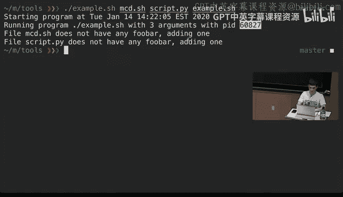

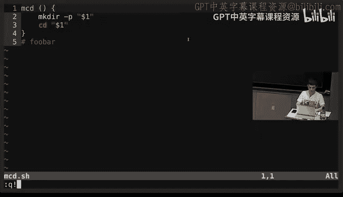

*   顺序执行：使用分号 `;`。
*   逻辑操作：`&&`（与）和 `||`（或）用于基于上一个命令的成功与否执行下一个命令。
    ```bash
    false || echo "Will print"
    true && echo "Will print"
    true || echo "Will not print"
    ```
*   命令替换：使用 `$(command)` 将命令输出捕获到变量中。
    ```bash
    foo=$(pwd)
    echo "We are in $(pwd)"
    ```
*   进程替换：`<(command)` 将命令输出作为临时文件传递给其他命令。
    ```bash
    cat <(ls .) <(ls ..)
    ```

### 定义与使用函数

在 Shell 中定义函数如下所示。函数内的 `$1` 指函数的第一个参数。

```bash
mcd () {
    mkdir -p "$1"
    cd "$1"
}
```
在命令行定义此函数后，执行 `mcd test` 会创建并进入 `test` 目录。

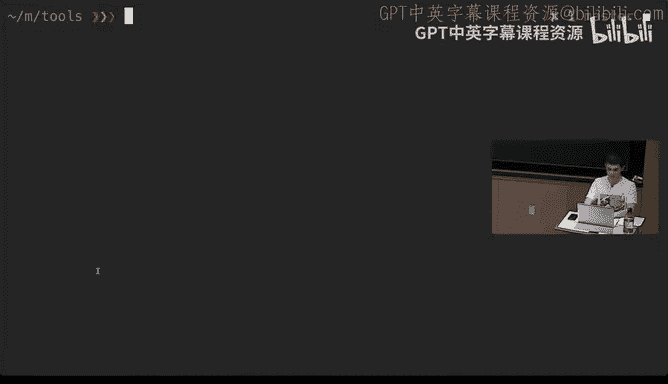

若将函数定义写在脚本文件中，可以通过 `source` 命令加载到当前 Shell 环境。
```bash
source mcd.sh
```

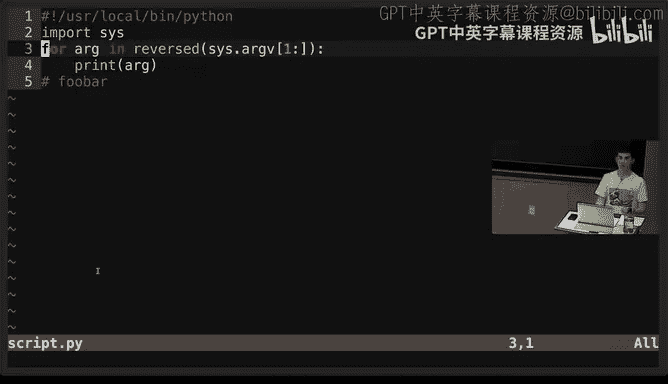

### 通配与花括号展开

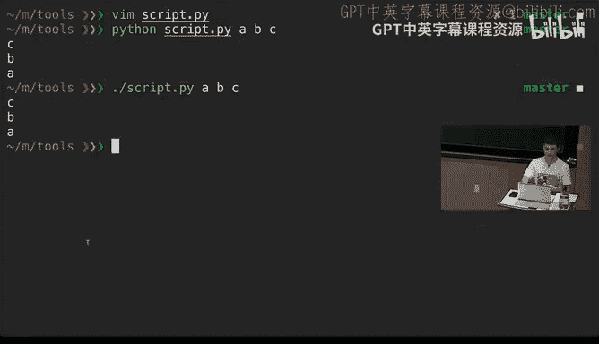

Shell 提供了强大的文件名匹配和生成功能。

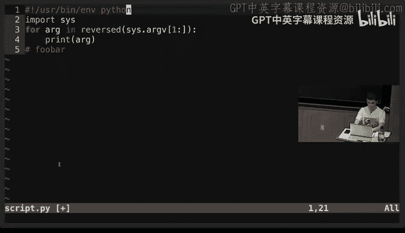

*   通配符：`*` 匹配任意数量字符，`?` 匹配单个字符。
    ```bash
    ls *.sh
    ls project?
    ```
*   花括号展开：用于生成任意组合，非常适用于创建系列文件或目录。
    ```bash
    touch {foo,bar}/{a..j}
    ```

### 使用其他语言编写脚本

Shebang（`#!`）行告诉 Shell 使用哪个解释器来执行脚本。使用 `/usr/bin/env` 可以提高脚本的可移植性。

```python
#!/usr/bin/env python3
import sys
for arg in reversed(sys.argv[1:]):
    print(arg)
```

### 脚本调试工具

编写 Bash 脚本时，可以使用 `shellcheck` 工具来检查语法错误和潜在问题。

```bash
shellcheck script.sh
```

## 实用的 Shell 工具

掌握了脚本基础后，我们来看看能帮助你更高效工作的 Shell 工具。

### 查找命令用法：`man` 与 `tldr`

*   `man` 命令提供命令的完整手册页。
    ```bash
    man ls
    ```
*   `tldr` 命令提供更简洁、带示例的常用用法说明，适合快速查阅。
    ```bash
    tldr tar
    ```

### 查找文件：`find`

`find` 命令用于在目录树中递归搜索文件。

以下是 `find` 命令的一些常见用法：

*   按名称查找：`find . -name src -type d`
*   按路径模式查找：`find . -path '*/test/*.py' -type f`
*   按修改时间查找：`find . -mtime -1` （过去24小时内修改的文件）
*   按大小查找：`find . -size +500k -size -10M`
*   找到后执行操作：`find . -name '*.tmp' -exec rm {} \;`

现代替代工具如 `fd` 通常更快、默认彩色输出，并且用户友好。

### 查找文件内容：`grep`

`grep` 用于在文件中搜索文本模式。

*   递归搜索：`grep -r foobar .`
*   忽略大小写：`grep -i foobar file.sh`
*   显示上下文：`grep -C 5 foobar file.sh` （显示匹配行前后5行）
*   只打印文件名：`grep -l foobar *.sh`
*   反向匹配：`grep -v '^#' file.sh` （打印所有不以 `#` 开头的行）

`ripgrep` (`rg`) 是一个更快的现代替代工具，默认递归搜索并智能处理文件。

### 查找历史命令

*   `history` 命令显示命令历史。可以配合 `grep` 进行搜索。
    ```bash
    history | grep convert
    ```
*   反向搜索：按 `Ctrl+R` 可以向后搜索历史命令，输入关键词即可动态匹配。
*   使用 `fzf` 进行模糊搜索：这是一个通用的模糊查找器，可以与历史命令结合，实现交互式、模糊的搜索体验。
    ```bash
    history | fzf
    ```
*   历史子字符串搜索：在 Bash 中，输入命令的开头部分，按上箭头可以匹配历史中以此开头的命令。Zsh 等 Shell 对此有更好的支持。

### 目录导航与浏览

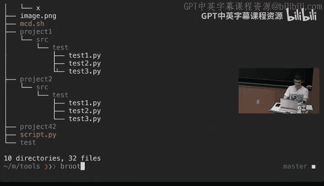

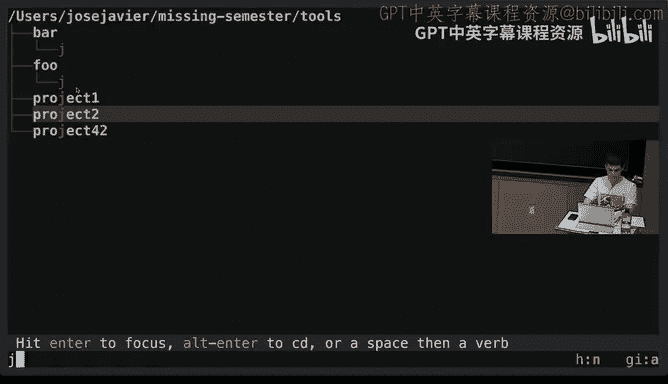

*   `tree` 命令可以以树状图列出目录结构，更直观。
*   `broot` 或 `nnn` 等工具提供了交互式、可视化的文件浏览器，允许你快速在目录间导航、预览甚至操作文件。
*   `autojump` 或 `zoxide` 等工具可以学习你常用的目录，让你通过简短的命令快速跳转，例如 `j proj` 跳转到某个项目目录。

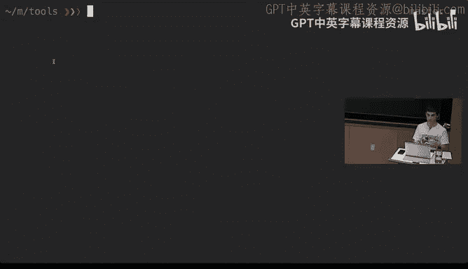

## 总结

本节课中我们一起学习了 Shell 脚本的核心概念，包括变量、字符串操作、控制流、函数以及参数处理。我们还探索了一系列强大的 Shell 工具，用于查找文件 (`find`, `fd`)、搜索文件内容 (`grep`, `rg`)、查阅命令手册 (`man`, `tldr`)、高效检索历史命令 (`history`, `Ctrl+R`, `fzf`) 以及便捷地浏览和导航文件系统 (`tree`, `broot`, `autojump`)。掌握这些脚本知识和工具将极大提升你在命令行环境下的工作效率和自动化能力。