# 003：编辑器 (Vim) 🖥️

在本节课中，我们将要学习文本编辑器，特别是 Vim。作为程序员，我们花费大量时间编辑文本和代码，因此掌握一个高效的编辑器能为你节省数百小时的时间。编程与写作散文不同，它涉及大量阅读、导航和局部修改，因此需要专门的工具。Vim 就是这样一款强大的编辑器，它基于命令行，并因其独特的设计理念而广受欢迎。

## 模态编辑：核心哲学

上一节我们介绍了学习编辑器的重要性，本节中我们来看看 Vim 的核心设计理念：**模态编辑**。

Vim 是一个模态编辑器。“模态”一词源于“模式”，这意味着 Vim 拥有多种操作模式。这个设计源于编程时我们经常在做不同类型的事情：有时是阅读代码，有时是进行小范围修改，有时则是从头编写大量代码。Vim 为这些不同的任务设置了不同的模式。

当你启动 Vim 时，它默认处于 **普通模式**。在此模式下，所有按键组合都有特定的功能，主要用于导航和编辑，而不是直接输入文本。要从普通模式切换到其他模式，需要按下特定的键。最常用的是 **插入模式**，用于输入文本。按下 `i` 键可从普通模式进入插入模式，按下 `Esc` 键则可以从任何其他模式返回普通模式。

除了普通模式和插入模式，Vim 还有其他模式，例如：
*   **替换模式**：按 `R` 进入，用于覆盖现有文本。
*   **可视模式**：按 `v` 进入，用于选择文本。
*   **可视行模式**：按 `Shift+v` 进入，用于按行选择。
*   **可视块模式**：按 `Ctrl+v` 进入，用于选择矩形文本块。
*   **命令行模式**：按 `:` 进入，用于执行保存、退出等命令。

由于 `Esc` 键使用频繁，许多程序员会将 `Caps Lock` 键重新映射为 `Esc` 键，以方便操作。

## 基础操作：启动、保存与退出

了解了 Vim 的模态概念后，我们来看看如何执行最基本的操作：启动、编辑、保存和退出。

Vim 是一个基于命令行的程序。要启动它，只需在终端中运行 `vim` 命令。如果你想直接编辑一个特定文件，可以在命令后加上文件名，例如 `vim filename.md`。

启动后，Vim 处于普通模式。要开始输入文本，需要按 `i` 进入插入模式。此时，屏幕左下角会显示 `-- INSERT --`。输入完成后，按 `Esc` 返回普通模式。

Vim 的所有功能都可以通过键盘完成，无需使用鼠标。例如，保存和退出操作需要在命令行模式下进行。按 `:` 进入命令行模式，光标会跳转到屏幕底部。以下是几个基本命令：
*   **保存文件**：输入 `:w` 然后按回车。
*   **退出 Vim**：输入 `:q` 然后按回车。
*   **保存并退出**：输入 `:wq` 或 `:x` 然后按回车。
*   **强制退出（不保存）**：输入 `:q!` 然后按回车。

你还可以使用 `:help [command]` 来获取任何命令的帮助信息。

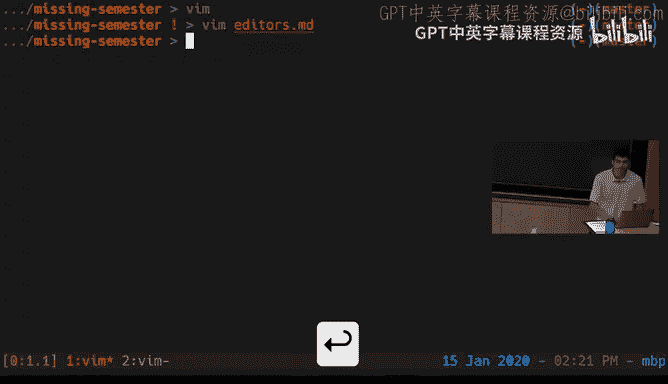

## Vim 的界面模型：缓冲区、窗口与标签页

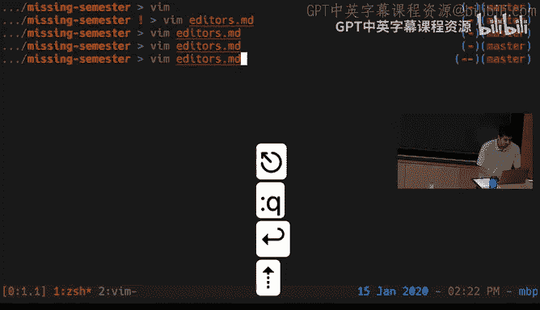

在深入更多编辑技巧之前，有必要理解 Vim 管理多文件的独特模型，这与许多图形化编辑器不同。

Vim 维护一组打开的 **缓冲区**，每个缓冲区对应一个打开的文件。然后，你可以有多个 **标签页**，每个标签页可以包含多个 **窗口**。关键点在于，**缓冲区与窗口之间并非一一对应**。同一个缓冲区（文件）可以同时在多个窗口中显示。这对于同时查看一个文件的不同部分非常有用。

要关闭当前窗口，使用 `:q` 命令。当所有窗口都关闭后，Vim 才会退出。如果你想一次性关闭所有窗口，可以使用 `:qa` 命令。

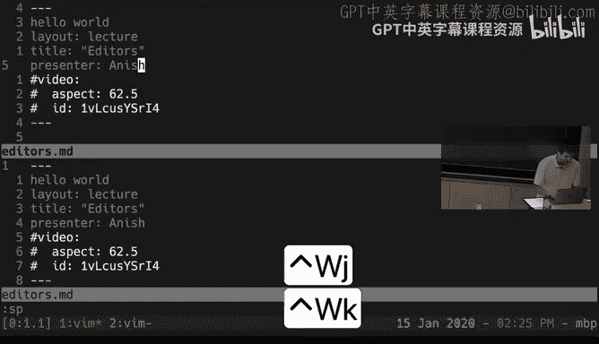

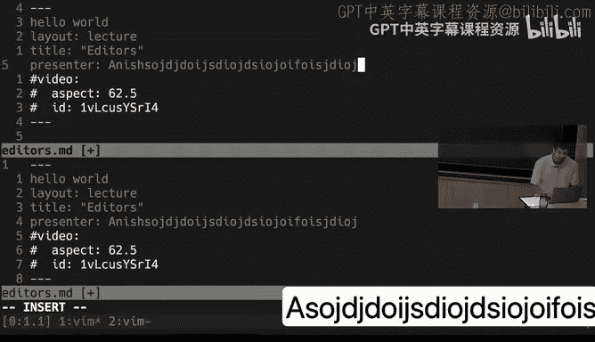

## 普通模式：将编辑变为编程语言

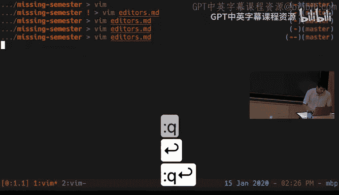

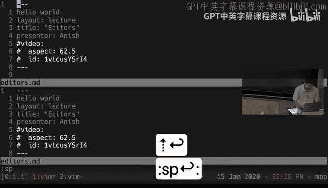

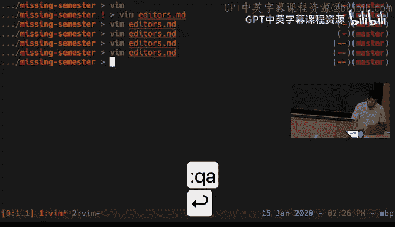

现在，我们来探讨 Vim 最强大、最根本的理念：**Vim 的普通模式界面本身就是一个编程语言**。

这意味着各种按键命令就像函数，你可以将它们组合起来形成复杂的编辑操作。一旦形成肌肉记忆，你就能以思考的速度进行编辑。

普通模式下的命令主要分为几类：移动、编辑、计数和修饰符。让我们逐一了解。

### 移动命令

在普通模式下，你可以高效地在文件中导航。以下是一些基本移动命令：
*   **基本移动**：使用 `h`（左）、`j`（下）、`k`（上）、`l`（右）代替方向键。
*   **按词移动**：`w` 移动到下一个词首，`b` 移动到上一个词首，`e` 移动到当前词尾。
*   **按行移动**：`0` 移动到行首，`$` 移动到行尾，`^` 移动到行首第一个非空字符。
*   **屏幕内移动**：`H` 移动到屏幕顶部，`M` 移动到屏幕中部，`L` 移动到屏幕底部。
*   **滚动**：`Ctrl+u` 向上滚动半页，`Ctrl+d` 向下滚动半页。
*   **文件内跳转**：`gg` 跳到文件开头，`G` 跳到文件末尾。
*   **查找字符**：`f{字符}` 向前查找并跳到该字符，`F{字符}` 向后查找。`t{字符}` 向前跳到该字符前，`T{字符}` 向后跳到该字符后。

### 编辑命令

编辑命令通常与移动命令组合使用，以指定操作范围。
*   **进入插入模式**：`i` 在光标前插入，`a` 在光标后插入，`o` 在当前行下方新建一行并插入，`O` 在当前行上方新建一行并插入。
*   **删除**：`d` 是删除命令，需要配合移动指令。例如：
    *   `dw` 删除一个词。
    *   `de` 删除到词尾。
    *   `dd` 删除整行。
    *   `x` 删除光标下的字符。
*   **修改**：`c` 是修改命令，它先删除指定范围，然后进入插入模式。例如 `cw` 修改一个词，相当于 `dw` 再 `i`。
*   **替换**：`r` 替换光标下的单个字符。
*   **复制与粘贴**：`y` 复制（yank），`p` 粘贴。例如 `yy` 复制整行，`yw` 复制一个词。
*   **撤销与重做**：`u` 撤销，`Ctrl+r` 重做。

### 可视模式与选择

要进行更直观的文本选择，可以使用可视模式。
*   按 `v` 进入**字符可视模式**，用移动命令选择文本。
*   按 `Shift+v` 进入**行可视模式**，按行选择。
*   按 `Ctrl+v` 进入**块可视模式**，选择矩形区域。
选择后，可以进行复制 (`y`)、删除 (`d`)、修改 (`c`) 等操作。例如，选择后按 `~` 可以切换所选文本的大小写。

### 计数与修饰符

**计数**允许你将一个操作重复多次。只需在命令前加上数字。例如：
*   `5j` 向下移动 5 行。
*   `3dw` 删除 3 个词。
*   `v3e` 选择到第 3 个词的词尾。

**修饰符**可以改变移动命令的含义，在处理成对符号（如括号、引号）时特别有用。
*   `i` 表示“在...内部”，例如 `ci(` 表示修改圆括号 `()` 内部的内容。
*   `a` 表示“围绕...”，例如 `da[` 表示删除方括号 `[]` 及其内部的所有内容。
你可以使用 `%` 键在配对的括号间跳转。

## 高效编辑实战演示

让我们通过修复一个简单的 Python FizzBuzz 程序来演示如何组合使用这些命令。目标是展示如何用最少的击键快速完成一系列编辑任务。

**初始有问题的代码：**
```python
for i in range(limit):
    if i % 3 == 0:
        print(“fizz”)
    if i % 5 == 0:
        print(“buzz”)
```

**操作流程：**
1.  **添加主函数调用**：按 `G` 跳到文件末尾，按 `o` 新建一行并进入插入模式，输入 `main()`，按 `Esc`。
2.  **修正循环起始值**：按 `/range` 搜索，按 `w` 移动两次到 `0` 后，按 `i` 插入 `1, `，按 `Esc`。按 `e` 跳到 `limit` 词尾，按 `a` 插入 `+1`，按 `Esc`。
3.  **修正 Fizz 条件**：按 `/fizz` 搜索，按 `ci”` 修改引号内内容为 `Fizz`，按 `Esc`。
4.  **合并 FizzBuzz 输出**：移动到相应 `print` 行行尾 (`$`)，按 `i` 插入 `, end=“”`，按 `Esc`。移动到下一行，按 `.` 重复上一次编辑（插入 `, end=“”`）。
5.  **添加命令行参数解析**：按 `gg` 跳到文件开头，按 `O` 在上方新建行，插入 `import sys` 等代码，按 `Esc`。按 `/10` 搜索硬编码的数字，按 `ci(` 修改括号内为 `int(sys.argv[1])`。

这个演示展示了 Vim 的核心工作流：大部分时间停留在普通模式，快速移动到目标位置，进入插入模式做微小改动，然后立刻返回普通模式。使用搜索 (`/`)、重复操作 (`.`) 和组合命令能极大提升效率。

## 自定义与扩展

Vim 高度可定制和可扩展，这使其能适应任何工作流。

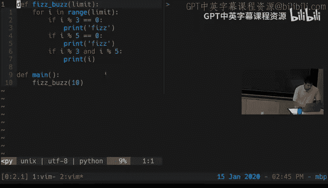

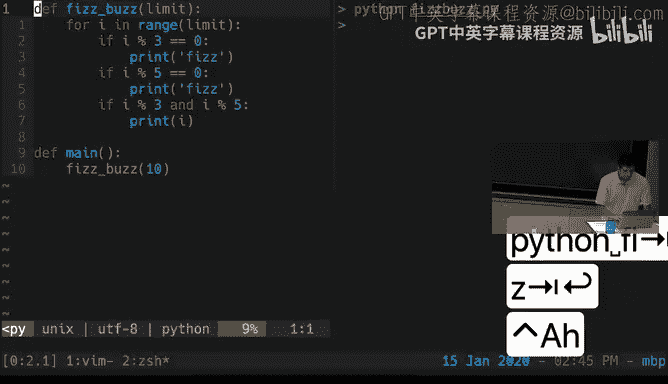

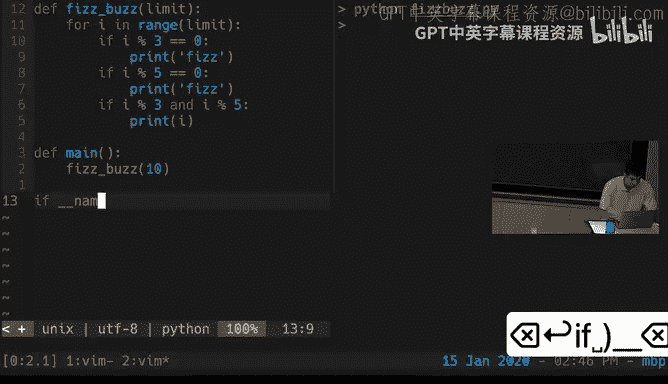

Vim 的配置通过一个名为 `~/.vimrc` 的纯文本文件完成。你可以在此设置偏好，例如：
```vim
“ 启用语法高亮
syntax on
“ 显示行号
set number
“ 显示相对行号
set relativenumber
```
修改 `.vimrc` 后，重启 Vim 或执行 `:source ~/.vimrc` 使配置生效。

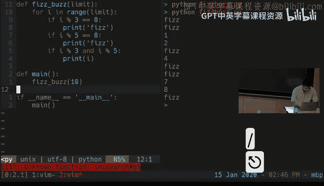

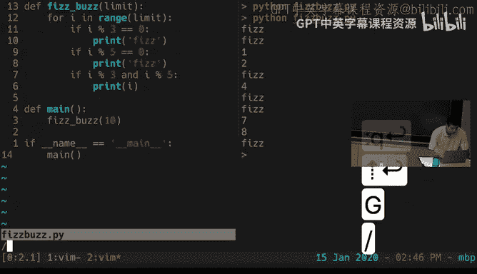

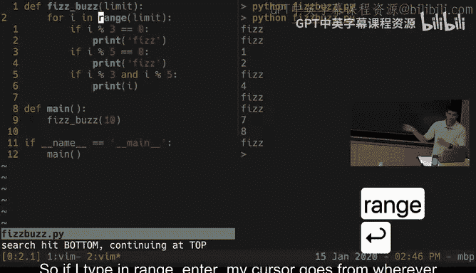

此外，Vim 拥有强大的插件生态系统。插件可以添加诸如模糊文件查找、文件树导航、语法检查、集成终端等功能。通常使用插件管理器（如 Vim-plug）来安装和管理插件。

## Vim 模式无处不在

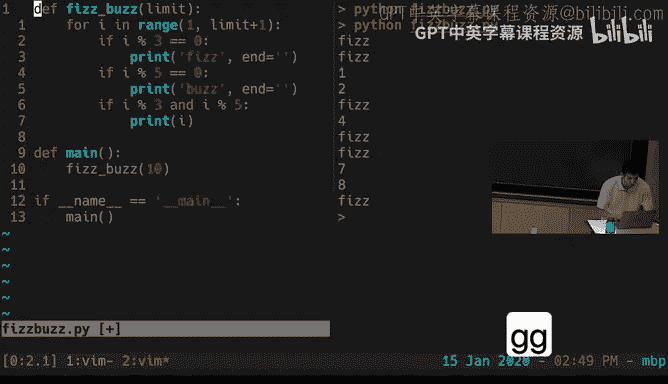

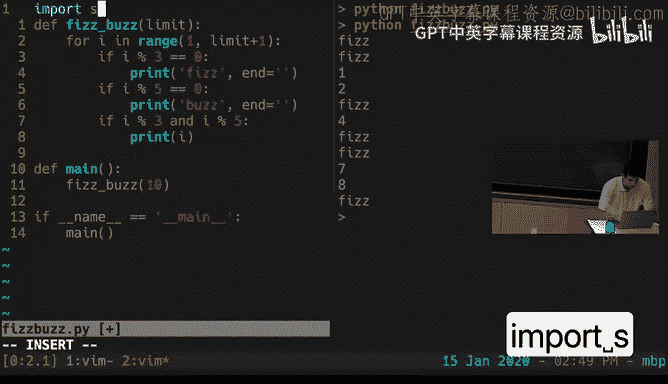

Vim 的编辑理念如此受欢迎，以至于许多其他工具都实现了 **Vim 模拟模式**。这意味着你可以在这些工具中使用熟悉的 Vim 键位进行编辑和导航。

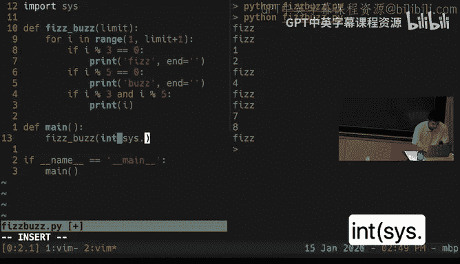

以下是一些支持 Vim 模式或类似绑定的常见工具：
*   **代码编辑器**：VS Code (Vim 扩展)、Sublime Text (Vintage 模式)、IntelliJ IDEA (IdeaVim)。
*   **Shell/终端**：Bash (set -o vi)、Zsh、Fish。
*   **阅读器/交互环境**：Python REPL (通过 readline 配置)、Jupyter Notebooks、甚至一些网页浏览器（如 Firefox 的 Vimium 插件）。

启用这些工具的 Vim 模式，能让你的编辑技能在不同环境中无缝迁移，进一步提升整体效率。

## 总结

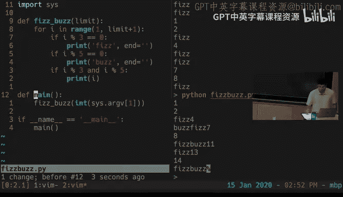

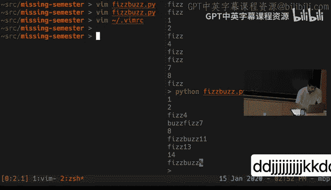

本节课中我们一起学习了文本编辑器 Vim。我们从其核心的**模态编辑**理念开始，了解了普通模式、插入模式等多种模式。我们掌握了启动、保存、退出的基础操作，并理解了 Vim 独特的缓冲区、窗口和标签页模型。

最重要的是，我们深入探讨了 Vim 普通模式作为一门**编程语言**的哲学，学习了如何组合**移动**、**编辑**、**计数**和**修饰符**命令来高效地操作文本。通过实战演示，我们看到了这些技巧如何应用于实际编程任务。

最后，我们了解了如何通过 `.vimrc` 文件**自定义** Vim，以及如何用**插件**扩展其功能。我们还发现，Vim 的编辑范式已扩展到许多其他工具中，形成了无处不在的 **Vim 模式**。

投入时间学习并熟练使用像 Vim 这样的强大编辑器，可能是对你编程效率最有价值的投资之一。我们鼓励你完成课后练习，坚持使用，并在遇到低效操作时积极查找更优方法。祝你编辑愉快！