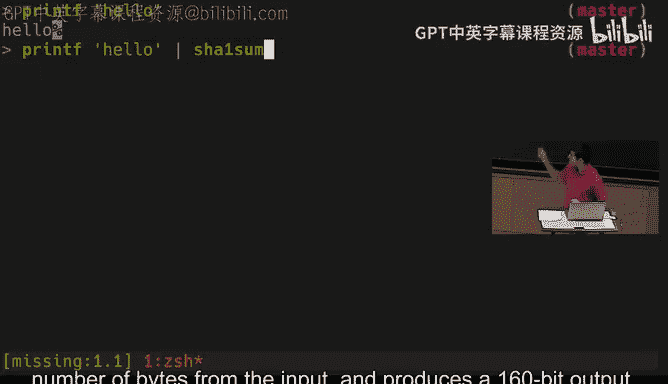
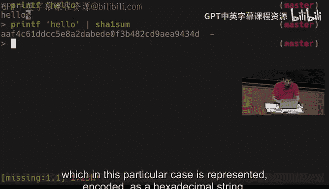
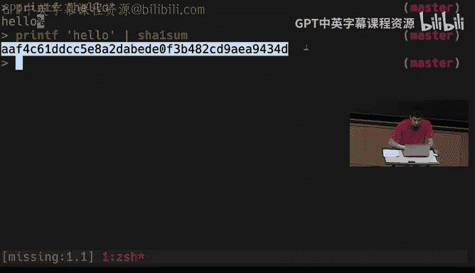
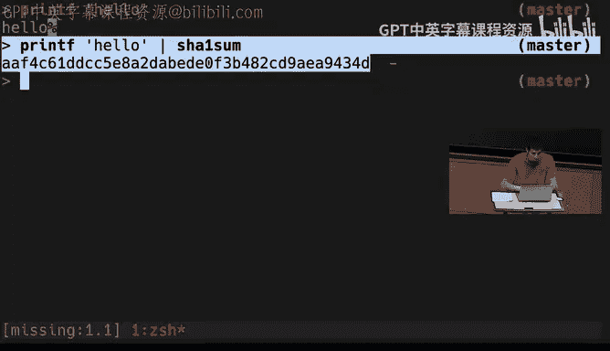
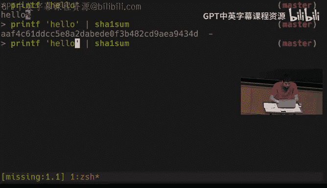
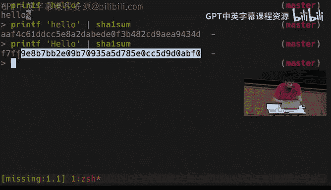
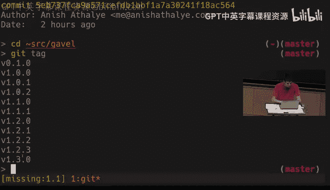
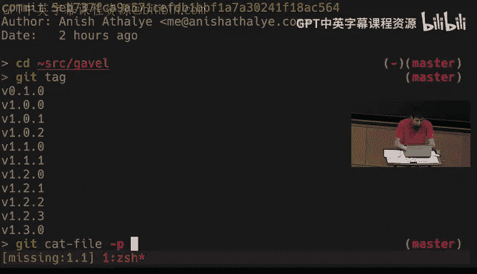

# 009：安全与密码学

在本节课中，我们将要学习安全与密码学的基础概念。我们将探讨熵、哈希函数、密钥派生函数、对称与非对称加密等核心概念，并了解它们在实际工具（如Git、SSH）中的应用。请注意，本课程旨在帮助你理解现有工具的原理，而非指导你自行构建加密系统。

---

## 熵：随机性的度量

上一节我们介绍了课程概述，本节中我们来看看第一个核心概念：熵。熵是随机性的度量单位，通常以比特表示。它对于评估密码强度非常有用。

一个简单的例子是抛硬币。抛一枚公平的硬币有两种可能性，其熵为 log₂(2) = 1 比特。掷骰子有六种可能性，其熵约为 log₂(6) ≈ 2.6 比特。



在密码学中，我们通过计算密码生成模型的可能性数量来估算其熵值。熵值越高，密码在暴力破解攻击下就越安全。











以下是评估密码强度时需要考虑的几点：
*   密码的生成模型决定了其熵值。例如，从包含2000个单词的词典中随机选择四个单词组成的密码，其熵值远高于对单个单词进行简单字符替换后形成的密码。
*   所需的熵值取决于你的威胁模型。防御在线猜测攻击可能需要约40比特的熵，而防御离线破解攻击则可能需要80比特或更高。
*   人类不擅长生成真正的随机数。建议使用物理随机源（如骰子）或专门的工具（如Diceware方法）来生成高熵密码。

---

## 哈希函数

上一节我们介绍了如何量化随机性，本节中我们来看看哈希函数。哈希函数能将任意长度的输入数据映射为固定长度的输出，这个输出通常看起来像一串随机数。

一个典型的例子是SHA-1哈希函数，它输出一个160比特（40位十六进制字符）的值。

```bash
$ printf "hello" | sha1sum
aaf4c61ddcc5e8a2dabede0f3b482cd9aea9434d
```

哈希函数有几个关键特性：
*   **确定性**：相同的输入总是产生相同的输出。
*   **抗碰撞性**：很难找到两个不同的输入产生相同的哈希值。
*   **不可逆性**：给定哈希输出，很难（几乎不可能）反推出原始输入。

哈希函数有多种应用：
*   **内容寻址**：Git使用SHA-1哈希来唯一标识提交和文件，这依赖于其抗碰撞性来保证仓库的完整性。
*   **文件完整性校验**：下载大文件（如操作系统镜像）时，你可以从可信源获取该文件的哈希值，然后与从任何镜像下载的文件计算出的哈希值进行比对。如果一致，即可确认文件未被篡改。
*   **承诺方案**：你可以先公布某个值（如抛硬币结果）的哈希值作为“承诺”，稍后再公布原始值。其他人可以通过重新计算哈希来验证你未曾更改过最初的选择。

---

## 密钥派生函数

上一节我们了解了哈希函数的多种用途，本节中我们来看看一个相关的概念：密钥派生函数。密钥派生函数与哈希函数类似，但它被设计为**计算缓慢**。

一个常见的例子是PBKDF2。它之所以要设计得慢，是为了抵御暴力破解攻击。例如，在验证用户密码时，计算一次慢速的KDF是可以接受的；但攻击者尝试数百万次密码时，这种缓慢的特性会极大地增加其攻击成本和时间。

KDF的输出通常用作其他加密算法（如下一节将介绍的对称加密）的密钥。

---

## 对称密钥加密

上一节我们介绍了如何从密码派生出密钥，本节中我们来看看如何使用这个密钥进行加密。对称密钥加密使用同一个密钥进行加密和解密。

一个对称加密系统包含三个部分：
*   **密钥生成**：生成一个高熵的随机密钥 `K`。
*   **加密函数**：接收明文 `P` 和密钥 `K`，输出密文 `C`。`C = Encrypt(P, K)`
*   **解密函数**：接收密文 `C` 和密钥 `K`，输出原始明文 `P`。`P = Decrypt(C, K)`

其核心特性是：不知道密钥 `K`，就无法从密文 `C` 中获取明文 `P` 的任何信息；同时，使用相同密钥加解密可以正确还原数据。

对称加密的一个典型应用是加密存储在不可信云服务上的文件。你可以使用一个由高熵密码通过KDF生成的密钥来加密文件，然后将密文上传。这样，即使云服务提供商也无法查看你的文件内容。

你可以使用像`openssl`这样的命令行工具进行对称加密操作。

```bash
# 使用AES-256-CBC算法和密码加密文件
$ openssl aes-256-cbc -salt -in README.md -out README.md.enc

# 使用相同密码解密文件
$ openssl aes-256-cbc -d -in README.md.enc -out README.decrypted.md
```

**关于“盐”的补充说明**：在上述命令和许多密码系统中，会使用一个称为“盐”的随机值。盐不是秘密，它会与密文一起存储。它的主要作用是防止彩虹表攻击，即确保即使两个用户使用了相同的密码，其最终的加密密钥和密文也会因盐的不同而不同，从而迫使攻击者必须针对每个目标单独进行暴力破解。

---

## 非对称密钥加密

上一节我们讨论了共享同一密钥的加密方式，本节中我们来看看一个更强大的概念：非对称加密，它使用一对密钥而非单个密钥。





一个非对称加密系统包含以下部分：
*   **密钥生成**：生成一对密钥：公钥 `PK`（可公开）和私钥 `SK`（必须保密）。
*   **加密函数**：使用接收方的**公钥** `PK` 加密明文 `P`，得到密文 `C`。`C = Encrypt(P, PK)`
*   **解密函数**：使用接收方自己的**私钥** `SK` 解密密文 `C`，得到明文 `P`。`P = Decrypt(C, SK)`

其核心思想是：任何人都可以用你的公钥加密信息，但只有持有对应私钥的你才能解密。这解决了对称加密中需要安全交换密钥的难题。

非对称加密还可用于**数字签名**：
*   **签名函数**：使用签名者的**私钥** `SK` 对消息 `M` 进行签名，得到签名 `S`。`S = Sign(M, SK)`
*   **验证函数**：使用签名者的**公钥** `PK` 验证消息 `M` 和签名 `S` 是否匹配。`Verify(M, S, PK)` 返回真或假。

签名可以证明消息的**真实性**（来自特定私钥持有者）和**完整性**（未被篡改）。

非对称加密的应用非常广泛：
*   **加密通信**：如PGP加密电子邮件、Signal/WhatsApp等即时通讯工具。
*   **软件签名**：开发者用私钥为软件发布包（如Debian软件包、Git标签）签名，用户可用其公钥验证下载的软件是否真实且未被篡改。

**密钥分发问题**：如何确保你获取的公钥确实属于目标对象，而非攻击者伪造的？解决方案包括：
*   **线下交换**：面对面交换公钥指纹。
*   **信任网络**：依赖你信任的人所信任的人（如PGP的Web of Trust）。
*   **社交证明**：将公钥与多个社交网络身份（Twitter、GitHub等）绑定（如Keybase）。
*   **证书颁发机构**：由受信的第三方机构验证并签发数字证书（HTTPS的基础）。

**性能优化：混合加密系统** 由于非对称加密计算较慢，实际应用中（如加密邮件）常采用混合加密：
1.  发送方随机生成一个**对称密钥** `K`。
2.  使用对称密钥 `K` 和**对称加密算法**快速加密大体积的消息 `M`，得到密文 `C_sym`。
3.  使用接收方的**公钥** `PK` 和**非对称加密算法**加密对称密钥 `K`，得到加密的密钥 `C_key`。
4.  将 `C_sym` 和 `C_key` 一起发送给接收方。
5.  接收方用自己的**私钥**解密 `C_key` 得到 `K`，再用 `K` 解密 `C_sym` 得到原始消息 `M`。

---

本节课中我们一起学习了安全与密码学的基础知识。我们从衡量密码强度的**熵**开始，探讨了具有不可逆和抗碰撞特性的**哈希函数**及其应用。接着，我们了解了设计为计算缓慢的**密钥派生函数**，以及使用单一密钥进行加解密的**对称加密**。最后，我们学习了使用公钥/私钥对的**非对称加密**，它实现了安全通信和数字签名，并讨论了与之相关的密钥分发挑战和混合加密的实用方案。理解这些概念有助于你更深入地认识日常使用的数字工具背后的安全原理。