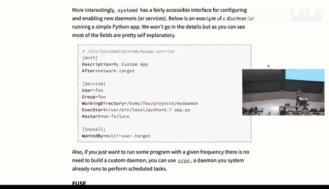
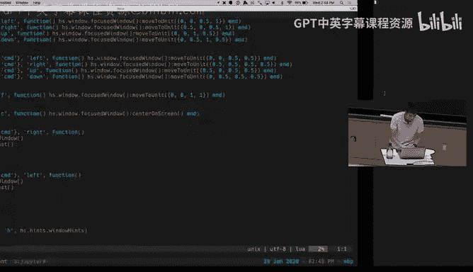
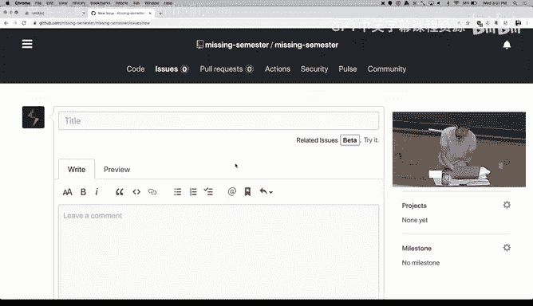

# 《计算机科学教育中遗漏的一学期｜The Missing Semester of Your CS Education 2020》中英字幕 - P10：-10-.Lecture 10_ Potpourri (2020).zh_en - GPT中英字幕课程资源 - BV1Y3yhBHEip

Hi， can everyone hear me okay？Okay， so welcome back to。

The missing semester of your CS education today are having as a lecture topic properly。

 which is gonna be some miscellaneous combination of topics that we instructors find that are interesting。

 but none of them kind of wire on their own lecture because they are kind of like certain topics that we just want you to know about because they can be again like really helpful and again。

 we're not going to del into a lot of detail in the topics if you're more interested all them just kind of feel free to come and ask us questions at the end or as we go over them in lecture。

So the first thing I want to talk about is keyboard remapping。😊。

So by now you probably realize that we have encouraged to use the keyboard as your main input method。

 so for example when we went into the editor's lecture。

 one of the main ideas of them was using your keyboard as much as possible so you don't have to kind of rely on going to the mouse because going to the mouse is low and the thing is your keyboard as with many things in your computer is nothing kind of magical it can be configurefiuring and it's worth configuring because a lot of kind of the defaults might not be optimal。

😊，The kind of the most simple modification that you can do is just remap keys。

 So one of the things we alerted in the editor lecture is the caps lock key is a really good key because it's kind of driving the home row and it's kind of large but it's not useful probably realize that you don't use your caps key like when will you want to use that So you can just remap your caps key to something more useful。

 as we mentioned， like escape your beam user or like control your emax user or useful rem like a lot of the upper role。

 like function like the F keys or like print screen， you can remap them， for example。

 to your media key。 So like when you type print screen that you probably gonna have to do print screen that often but you probably want to play or pause your music and a lot of prettymat every operating system has like some tools that you can use to configure this I'm not gonna go into digitals。

 but there's like。😊，Of them listed in the notes。诶。Let me change。Oh yeah。

 another thing that you can do with keyboard re mappingings or you can do more complex combination。

 you can have a combination of keys mapped to some action。 So for example。

 I have keyboard mappings that whenever I do control enter。

 I open a new terminal window because the thing I do fairly often and by default map is no key binding to do that or controlive enter will open a new browser window。

 another operation that I do on a daily basis So I don't have to grab my mouse and go to Chrome do that。

😊，AndYou can also do remap into perform actions if you don't want to be typing your password or sorry your password your email or your password。

 or for example， your MIT IDD， like you may not remember it by heart。

 then you can just have like a key combination that will just perform the action of pasting that text。

Lastly， there are like more like right now it looks more than like you just have to do some frequency of this is the keys that you press。

 and this is the action that you happen。 But actually there are more complex keyword combinations as you go through you kind of learn so you can do kind of keyboard sequences。

 So for example， when we were dealing with Tax in teammax there was kind of this notion of oh first you press control A。

 and then like control B like you press some prefix。 and then some other key。

 and that means something。 a lot of this software allows that。

 So for example in in my keyboard since I'm not using caps lock at all。

 But every so often I had to use my undergrad some software that I relied on caps lock for changing modes then I have I can press sift five times in a row quickly。

 And then this software that is in the middle interpreting this command and re up into some other will send a single caps lock command for that。

😊，And some more examples of that is that。😊，I mentioned that you can use your caps lock key like to map to escape or control。

 but you actually can remap to both so in my computer when I just tap the caps lock key that is interpreted as an escape however if I press it and hold it。

 I can kind of this software can understand the difference between quickly pressing it and just holding it for using in combination with some other key and then in that case is mapped to control so a lot of this kind of more advanced configuration is supportedable a lot of these tools。

And as I mentioned， we have a kind of a short list of good defaults for these programs。

 for kind of Windows， Macs and Linux。Any questions on this topic。Okay。

 now I'm gonna cover unrelated topic to keyboard mappings。

 we're gonna see a lot of these unrelated transitions in this lecture and is' the concept of demons so probably you have maybe if you're not familiar with the world might seem alien but the concept of demon you're probably familiar with like most computers when you are running them those like the software that you kind of start and run like the commands that we have been seen like you like type Ls and then you are calling D LS command the LS command executes because you ask it to execute and then it finishes a lot of other programs are just running as background processes and they're just executing in the background and waiting for events to happen or enabling some sort of functionality in your computer。

😊，And examples of these processes， maybe like your network like the part of your computer that is managing the network or the part of your computer that is managing the display。

 things like that you will see that a lot of what is enabled by demons is usually programs that end with a D so for instance。

 when you are SS into a computer， the receiving computer has to have a SS demon and the program is called SSD and if this program is not running then there's no way for me to SS into the computer if the program is running。

 then the program will be listening and when you do SSH that server。

 some incoming request is going enter the computer the computer is gonna send it to this demon that is running in the background and then the demon is gonna check whether you have authorization and if so is going start like some login cell that you can start executinging。

And different noises handle this。Somewhat differently。

 they will use the main they all have some sort of system demon that like responds a lot of these smaller demons。

In Linux， which is the one of the that we' were using for a lot of the examples。

 the tool that you're using is the system D again， like for system demon that is gonna start a lot of these processes and if you use the system CTL command。

 you can kind of check for the status of different demons you can check for which ones are running。

 you can say you can ask the。You can ask it to start processes， stop them。

 this is kind of a one off operation， you can also enable it and like disable them。

 which will tell the system to kind of run them a boot or like stop running a boot if they were enabled。

And perhaps more interestingly， you can configure your own system D units。 So so far。

 kind of all the examples are a lot of what the computer has to do。

 but say you want to run a web server like one solution。

 you can just like every time you start your computer。

 you can like open a Team session and then execute the command。

 But that's not really the way that kind of your computer expects demons to be run。

 the way your computer expects demons to be run is by using some sort of system D unit is' like a configuration that tells system D how to execute this process。

 So an example of this。😊，Is the like here's a very simple example。

 So the what is happening here is we're describing to system D what needs to be done for this program to execute This example is just running a like a simple python app。

 You can think of it as a web server like that can be implemented using some python web server library。

And here we're saying no， this is the description we're saying after like this is important。

 system D has kind of a list of services that has to start like all these demons have to be started。

 but maybe there are dependencies between these demons or here we're saying no。

 you should only start this after the network has been set up because otherwise how would you even try to configure our observer if I can listen to a network port and then we're defining what users should run this because you may want to run this as your user or maybe other user or maybe the route user should be running this and then what command to run under what director。

And whenever you have this， there can be kind of all small corner cases that you might have to de back。

 but this is kind of the core idea and it can be really useful to automate the process of running processes in the background。

A small sign note to this is the fact that if you just want to run a command every so often。

 like like in some periodicity， like say every morning I want to do something in my computer。

 you could write a demon that just like does something and sleeps for a day but actually like Linux and Macs has already a demon that does this that it is called Chron D and Chronee just will take another type of configuration file where you can say。

 oh， I want to run a command every day at 8 AM or I want to run a command every five minutes and it will just check for this event and execute them。

And with a lot of things， you will find that theres already demons that have been configured for that。

Any questions regarding。

Is there like a folder in a computer ring？All these are。

So the question is where these are folder in the computer where all of these are。

 so yeah like yes and another some of these configuration files are in a couple of different folders depending where there are system demons or their user demons here you can see at the very first line is where you will place this。

For the system demon to recognize that has been installed。

 but if you just want to list all the demons that you was running in Linux， for example。

 you can just do system CTL status and that's going to print a tree of all the systems and which demon was spawned by which other demon and a lot of them will be spawned directly by system D。

The next topic is going to be file systems in user space。

So kind of a quick intro to this is the fact that whenever you're using a modern， oh yeah， sir。

Where you're using a modern operating system。Youre not tied on a specific。File system。

 So like more nursees are purely modular。 And you can， for example， in Linux。

 there are like different file systems that you can use。

 And the way this works is because the kernel， which is kind of the， the。

 what is running most of the operating system， has some modules that know how to interact with。

With a file system。 So usually when you do。Something like。That fuever。This is happening。A that user。

Level， and then this is going through。To the kernel level。And there is this some kind of layer here。

That is checking where this action is happening to figure out what file system is under。

 So for example you will have multiple disks all the different disk have different file systems。

 So kind of the kernel has to figure out which file system operations to use and say in this file maybe in an EXT4 which is the most common Linux1。

 then whenever you do to4， the kernel will hear that and then it will try to figure out like oh this lives in an EXT4 file system and it will perform the associated instruction for creating a file in an EXT4 file system。

However， kind of be caveat to having a system like this is right now。

 I cannot have user code that defines how to create a file and that might be kind of useful in some cases。

 sayy， I want to have a file system that every time someone creates a file sends me an email。

 so I can like know that like people are creating these files here。

 I cannot like modify the kernel to add this So the solution to this， something calledfuse。😊，Andfuse。

Is an。A way of having file systems in user space。 So whatfuse will do is if this file。

 instead of being in。If instead of being in E， X T4， if this file is in a fierce file system。

Fews will forward this operation。To some other part of user code that will say， oh。

Can create this file。And here I can have the part of the code that sends an email to me。 say， no。

 this， this file has been created。 And in case you want to still create the file。

 it can forward back the request to do some more kernel operations。😊。

It might not seem really practical， but this is kind of just the theory in practice。

 why this is useful is because now you can have user level goal that executes arbitrary actions when you try to perform file system operations。

A really interesting example of this is called SSA to F。😊。

So SSHFS with that is whenever you try on an SSHFSfuse file system。

 whenever you try to create open read， write to a file instead of trying to do that to a local file it has an SSH connection that to a remote server so if I try to create a file here。

 it will use that SSH connection to forward that operation to the remote system。

 and then it will perform it there so to all my local computer to the rest of the programs running in my computer。

 there's this path that looks there is here， but all the operations that are performed to that path I kind of forward it to the remote file system。

And with this idea， you will there are like some examples in the notes and you will find more online of ways people have leverageerates this capability to do fairly interesting file systems。

 So for example， if instead of having SS， you don't care about thes because you use like dropbox or Google Drive。

 It's fine。 People have implemented few file systems that will mount locally and every time you try to do an operation locally actually goes to one of these cloud storage providers。

 So you can also use something like Amazon S 3 or like Google cloud storage that don have like the same kind of。

😊，UI a system that will kind of synchronize as Dropbox or Word drive other another application of this kind of that is not related to something remotely is something like an encrypted file system you may have a file system that every time you try to write to a file you will try to write it in plain text but it will capture their operation it will encrypt on the go and then you will save it as a regular file in your file system but that's actually encrypted。

And once you dismount the file system， once you kind of remove thefuse connection。

 all that is left in your computer are like regular files are encrypted。

The last topic I want to cover is backups and how going like some good practices about them。

AndThe kind of the main idea is that for every file that you care about。

 if you don't have a backup of that file and you have like a backup story of that file。

 you can pretty much lose it at any moment there are like many different failure scenarios one of them is just hard failure So like your hard drive can fail at any moment。

 So if you are just copying making a copy of your files in the same drive。

 that's not useful like if you hard drive fails the files are gone the same goes you have like an external drive where you are making a copy but if youre kind of storing everything in your home and your home burns down。

Which， yes， is unlikely。 but if it happens， you just lost all your data。

 So you'll have some sort of offside backup for having this solution。

Another kind of thing to take into account is that synchronization or mirroring options are no backups。

 So Google Drive Dropbox that I was mentioning。 they will just kind of。

Propaate whatever is happening in your computer。 This goes also for hardware mirroring like rate。

 They're just making a copy。 If you accidentally delete a file or someone maliciously deletes or your file or encrypts them using some randomsom where。

Then you might have a copy， but you have a copy of the same useless data。

 you actually have to have a solution of how you're running your backups。

 and you should be asking yourself well actually someone needs to know this last half about you in order to delete all your data。

And we have linked different。Software in the。In the notes about how to do this。

 the last thing I want to mention about backups is that a lot of the time when you think about backups。

 you just think about their local files and like all my photos and on my tax return and how can make a backup of that。

 but increasingly in the modern nights， there are more and more web applications。

 and a lot of data might only live in some cloud provider。 like for example。

 if you have webmail and not synchronize to your computer。

 it's only living in in that provider servers。 And if you don't have a copy for that。

 And for some reason you lose access to that account because you forget your password。

 you get hacked， they think you have violated the terms of service， all that data is gone。

 So you should look into some tools that people have developed for kind of like making offline copies of all that data。

 So you can make regular backups of that。And kind of that ends the short section on backups。

 Any questions so far。When you said that。これまでに。A reason for it's a fail or。Like very mixture。

You know。I't know sitting at my parents's house or something。is that like？Hough。

ith failAny drive can fail at any moment like we don't like different come have different kind of rates of failure and there are like really good statistics online。

 So for example， like spinning hard drives have like a higher rate of failure than like SSDs。

 for example， like solid state drives and it's not case or like CD drivers。

but like if you drop a hard drive， there's like a higher rate of failure of that failing， of course。

 but in general we don't really have like a end all solution for saying no。

 this media is not going to fail like premats， like SD cards， SSD hard drives。😊。

CD is theygrade with time。 much every data is kind of bound to this degradation or like this fact that it could be lost at any moment。

And you also also know that like data can become corrupted， like your disk might look that it's okay。

 but maybe some files were corrupted and something like synchronization techniques like Google Drive or Dropbox will propagate that corruption and by the time that you realize that thing had go wrong。

 it's maybe too late。Al right， we're gonna continue this trend of jumping between random topics and talk about APIs。

 So so far， we've really been talking about how do you do things more efficiently locally on your computer。

 Like I want to accomplish this task more efficiently。 How do I configure my editor。

 How do I use my shell。 But one thing you should realize is that very often you can integrate with the outside world as well。

 Most services that you interact with in your day to day。

 provide some kind of API for you to interact with the data that they store or the services that they provide。

😊，And usually those APIs are pretty well documented。

 if you look at the APIs for things like Facebook or Twitter or like Google Drive or Gmail。

 many of these have interfaces that you can interact with in order to use those services from your local machine。

What's really neat is that you can often combine this with some of the stuff that we've talked about in lecture so far。

 like for example， in the data wrangling lecture， we looked at how you can create these pipelines to extract data from some source that has a different format than you expected。

So for instance， the US government has a free service where you can request the weather forecast for any given location in the US and what you do is there is a URL。

 the you request and if you set the right parameters in that URL and then just fetch it what you get back is Jason which is sort of a welldefined data format that you can then parse and you can extract things like your 114 day weather forecast and maybe you then pipe that into your shell and produce some kind of like handy alias in your terminal that's just going to print some handy reference for the next 14 days of weather in whatever location you're in these are things that you can pretty easily construct and there's some notes theres some notes in the notes about how you might go about this。

In general， when you interact with these APIs， you're going to be using URLs of one form or another and the exact format varies from service to service。

 but in general the URL is going to contain some set of parameters。

 but ultimately you're just going to issue a web request to them and you're going to get data back in some format。

 One command you should be aware of for interacting with these types of things is one called curl So curl is a program that you invoke。

 you give it a URL and it just fetches that URL and gives you back the response。

 What you do with that response is entirely up to you。

 maybe you pipe it through a program like GQ So sorry JQ So JQ is a Json query tool that lets you take in data。

 this format it is JsonN and then write a query over it to extract data that you're interested in。

And this is one of the ways in which you can layer these tools to extract the data that you're interested in。

Some of these services also require that you authenticate in one way or another， like for example。

 if you want to interact with a Facebook API， you need to have some authenticated token that proves who you are as far as Facebook is concerned otherwise they can't say whether you're allowed to say create a post as a given user very often these things are going to use something called OOth although not always and you should look at the documentation for whatever service you care about in general though you will get some kind of secret token back from the service that you have to include in the request you make to them either in the URL or in additional sort of web headers which you can also send with curl keep in mind though that these tokens are secret they are another representation of your user and anyone who gets their hand on them can basically pretend to be you they can do whatever you can do with that token。

So keep this in mind， don't like stick them in your dot files and then like push them onto Gitthub that will land you in trouble。

Youual should think of them as a password。 There are also really neat tools online for integrating services。

 So there's a service called if this， then that， which basically provides integrations with a bunch of different services and lets you chain them together and then also access them partially locally。

 if you wish。 This is something that's worth looking into。

 if there's a particular service you would like to interact with a more efficient manner。

Any questions about APIs？ switching gears entirely。 Let's talk about command line arguments。

 So command line tools。 there are a lot of them， and most of them take different arguments because they do different things。

 we've talked about looking at man pages for commands。

 And that will tell you how this particular command works。

 what kind of flags and options you might give to it and what it actually does when you invoke it。

 But there are some common themes that are useful to know about in either in arguments that many programs take or just concepts that many of them apply。

😊，The first of these we already mentioned a little bit in the lecture on command line environments。

 which is the help flag， very often you can pass this to a program and instead of running it will just print out information about how you can run this program often in a very short condensed way。

😊，A similar one is the version flag which just prints the version of the software you're using this can be really handy if you're doing something like filing a bug report which Anish is going to talk a little bit about later and you want to report what version you're running on in case the bug has been fixed since often you can also do dash capital V and that means the same as version but again check the man page。

😊，There's also dash verboose or dash lowercase V often。

 which is a flag that lets you increase the output of the program。

It makes the program print more about what it is doing。 And very often， you can repeat this flag。

 So you can do like dash V V V V V V V in order to get more information from that tool。

 And this may especially useful if you're trying to debug a problem。 if you're like running our sync。

 and you want to know， why did it decide to copy this file or why did it decide not to copy this file that kind of debug output can be useful。

 And often there's sort of an inverse flag called quiet or silent。

 which means that the tool will not print anything unless it was like an error。

 anything else will stay quiet about。Many tools， especially those that do destructive actions or some kind of action that you cannot undo。

 provide what's known as a dry run flag。 exactly how this is represented in the command line varies from tool to tool。

 but essentially what this dry run mode will do is it will run the tool。

 but it will not actually make any changes。 Instead。

 it will just inform you of what it would have done if you hadn't run it with dry run。

Many of these tools also have an interactive mode， so for example。

 the RM and move tools both do often just dash I， although not always when you run a tool in interactive mode。

 it will usually prompt you whenever it's about to do an action that you can't undo and it will sort of prompt you for a confirmation that it you actually go ahead。

When we're talking about destructive tools， many of them are nonrecursive by default。

 if you try to remove a directory or you try to operate on a full directory。

 they will not continue into the files inside of that directory。

 the reason being you might accidentally like remove your entire hard drive and that seems bad。

Therefore， for many of these tools， they have a recurse flag， often dash R， but again， not always。

 which lets them traverse down into the tree to go deeper， but you need to opt into this behavior。

 So this is， for example， the case for RM。 this is also the case for copy。

In many tools when they ask you to give a file name or a path and we talked about this a little bit in the data wrangling lecture。

 instead of giving a file name， you can often just give a dash， just a single dash。

 and what that means is standard input or standard output depending on whether that argument is an input file or an output file。

 this is handy to know about if you're trying to construct those kinds of data wrangling pipelines that we've talked about before。

Many tools will also default to using standard in your route if you don't give any file name at all。

Sometimes you want to pass something that looks like a flag or an option to a command。

 but you don't actually want it to be interpreted as a flag or an option consider， for example。

 if you wanted to remove a file called the dash I。What would you do if you write the following command？

RM I。Well， dash I is a flag to RM， so RM would， when you run this command would say。

 tellll me what file to remove， you haven't given me a file。

And it's because it interprets this as a flag。Similarly， if you do something like。SSH。Some machine。

Some command， and let's say dash R。So this is saying run and command foo on this machine over SSH。

 and I want to pass dash R toFo。Well， the way that both of these are going to get interpreted is that these are flags。

 or in this case， this is a flag， but to this command。Which is probably not what you expected。

Actually， in the case of SS， S H， it has some weird special behavior for some of these。

 but often if you want something to not be interpreted as a flag。

 there's a very simple way to opt out of that。 And that is using double dash。If you use double dash。

 what you tell the command is that everything following this？You should not interpret。

So it will not be considered a flag or an option in the case of RM， you can do this。

 and now RM will see that the first argument is a dash dash。And then it will keep reading arguments。

 but it will not interpret them as flags。 So when it gets the dash I。

 it will not interpret it as the dashI flag， but just as an argument dash I。Similarly， for SSH。

 you can do this。😊，To indicate that these are both positional arguments。

 they are not flags or options， and you should not interpret things that start with a dash。

But if you do like get that。It's not no， So this is a dash， dash with a space on both sides。

Any questions about any of this sort of command line conventions business？Alright。

 then let's talk about window managers。 So most of you are used to some kind of drag and drop window manager。

 they're like if you're running Windows or Mac OS ortu。

 what comes with the machine is like there are windows and they overlap partially on screen and you can like drag and drop and move them around and resize them and stuff。

 And that works fine。 but it is not the only way to manage windows on your computer。 It turns out。

 So what you are used to is something called a floating window manager。

 but not all window managers are floating。😊，Often you can opt into other types of window managers that have different behavior for how they arrange your desktop。

A common alternative is a tiling window manager。 So in a tiling window manager。

 rather than having floating windows， everything is set up into a tiled layout。

 When you start a program， its windows maximized。If you start another program。

 the original window shrinks in size， and then the new window takes up some subset of the total desktop space。

At no time is your desktop background visible unless you have no programs open？😡。

All of the programs you have opened on any given desktop are going to share that space。

 This looks a little bit like Tms paints， like we talked about earlier。

 where you can sort of split them in various directions。

And one of the reasons why this is handy is it means you basically never need to go to your mouse。

In order to move between windows， there are keyboard shortcuts to move to different windows。

 there are keyboard shortcuts for resizing the windows or swapping them around on screen。

 and this turns out to be a pretty efficient way to manage windows in your computer。嗯。

I won't go into too much of detail of what kind of window managers you might use。

 Just know that these exist out there and they're worth giving a look。

 They can be a lot more efficient to work with。Question about window managers。All right。

 VPNs totally related to the previous topic。 So VPNs are like all the rage these days。

 And this makes me really sad。 It's not clear that VPNs are all the rage for any good reason。

Because you should be aware of what a VPN does and does not get you。A VPN， in the best case。

 is really just a way for you to change your Internet service provider。😊。

It's a way for you to make traffic on the internet seem like it's coming from somewhere else than what you actually are。

While that might seem attractive for certain purposes。

 it's a little unclear what advises you in terms of security because all you're really doing is shifting who you are trusting。

 rather than trusting who is providing your current internet service。

 you are trusting that whatever business is giving you that VPN service， you're trusting that they。

 first of all， of set up this VPN business correctly。

 but also that they are not tracking what you are doing。

And it's not clear whether that change of trust is actually worth it。

If you're sitting at some like dodgy public Wi-fi network， then maybe， but if you're sitting at MIT。

 it's not clear that you trust your VPN provider more than you trust like MIT's ISNT。

 or maybe you do， but that is a decision that you need to make about what you trust who you trust and why。

You should also know that much of your traffic， especially stuff that's on a sensitive nature on the Internet。

 is already encrypted， whether that's sort of HtTPS or other protocols that use something like TLS。

 a lot of the sensitive data is already sent over encrypted channels and it doesn't really matter who your network provider is。

 if you're on a dodgy Wi-fi network。 the stuff that matters is probably encrypted anyway。

 might not be。 but if it's not， then your VPM provider can also see it in plain text just as much as whoever is hosting this dodgy Wifi network。

And notice that I said。In the best case above， there are VPN providers who have been shown to be malicious that do logging of all your traffic that sell that traffic to third parties。

 There are VPN providers that have forgotten to enable encryption on the VPN。

 All of these are real problems。And so you should think very carefully about whether a VPN actually serves any good purpose for you。

Questions about VPs。Yes， so I have a question about like public wfi networks because the travel from your computer to the router isn't encrypted between the。

RightRight。Except for what normally is to be like HTPSDM us。So then doesn't that mean that like？

People could sniff out like what domainres you're connected to。

DNS request So it's a very good question。 if you're on a public Wifi network。

 then the traffic between you and the wireless access point is not encrypted。

 at least it's not encrypted sort of on the outer layer， but it might be encrypted in like HPS。

 for example， and it is totally true that people observing that Wifi network will be able to see anything that is not encrypted。

 But the solution to that is to encrypt all your traffic。

 rather than necessarily going through a VPN。 So one way to do this， for example。

 is to use DNS over TlS or DNS over HtPS， which gives you a way to actually encrypt even information that might otherwise leak in plain text。

Rather than try to sort of trust some provider to do that for you。 Now that said。

 like some in some cases， you might have a trusted institution that provides a VPN network for you。

 So， for example， MI T provides a VPN network for all MI T students and staff that you can sign up to use。

 And in that case， you probably trust MI T more than the other networks you might be on。

 And so it might be worth it。 but it's something for you to think about。

When you said you couldn encrypt。What was a deal and that。嗯。

So DNS is the way that people turn domain names or your computer turns domain names into I addresses to know what computer to connect to。

 And that protocol by default is is in plain text。 Theres nothing encrypted about it。

 There are various ways to encrypt your DNS traffic。

 Some of them are standardized and some of them are not。 I won't go into the exact mechanics here。

 but you should Google it and look at some of the ways。Okay。

 the last thing I want to talk about is markdown so there is a high chance that some of you are going to write text over the remaining part of your life and you will want to mark up that text in various simple ways。

 And one thing you could do is start up word or use latex or something like that to mark up your documents。

 but that is pretty heavy handeded approach instead it would be nice if we could just sort of。😊。

Write things the way we feel like they should be。 I don't know how to describe it in a better way。

 but sort of the natural way where if you want something， if you want to put emphasis on a word。

 you just put like stars around it or something， and then it just works。

 Markdown is essentially that。 It is a way to try to encode the way that we often write text somewhat naturally into a markup language that lets you write things like bold text links。

 lists， that sort of stuff。 In fact， all of the lecture notess for this class have been written using markdown。

And markdown is really very straightforward。 The basic rules are in the in the notes。

 But the basic things you need to know is in markdown， if you put。Stars。Around a word。

 that word is emphasized or some sequence of words。 if you put double stars。

That word is emphasized strongly， also known as bold。There are various other things you could do。

 Like if you put a dash before a line， it is now a list。 and it's one list item。

 and you can amend list items。 If you put one dot in front or some other number。

 it becomes a numbered list。If you put a pound sign in front of something， it becomes a header。

Like some kind of title header。 If you put multiple of them， they become subheads。

 and you can keep adding more to these。If you want to write code。

 you can put a single back tick followed by some code。Followed by a backt。

 And now that is rendered in monospace font。 If you want multiple lines of code。

 you do a triple backtic， and then code。And then maybe some more code and then triple back take。

And in many cases， like if you're on GitHub， for example。

 you can even type the name of a language up here after the backts without a space。

 and it will be syntax highlighted in the language of your choice。

This is a really handy thing that is supported in so many websites nowadays that you might not even realize。

 like in Facebook Messenger， you can use many of these。😊。

They don't actually officially say they support Markdown anywhere。

 but many of these things just like sort of happened to work。

 And it's worth learning at least the basics and just start using them。

 You can do links and stuff as well。 But that's already in the notes。Any questions about Markdown？

Right， an niche。You're up。Is my microphone working？I don't know。 Is this working。

 You guys hear me in the back。The light screen， oh I think I can hear it。Great。

So continuing with our theme of random topics that are all unrelated to the previous topics we've been talking about。

 the next thing we're going to talk about is a program called hammerpoon。

 which is a tool for doing desktop automation on Mac and I think there' are similar tools for Windows and links so a lot of the ideas can carry over and you can Google it if you want to figure out how to do these things on other platforms but basically hammerpoon is a program that lets you write Lewisis scripts。

 the scripts in a programming language that interact with various operating system functionality so you can write code that interacts with the key and mouse and connects that to window management to display management。

 the file system battery and power management w-fi all sorts of stuff like basically all the things that your operating system manages this tool lets you hook into those things and so it can let you do all sorts of neat things by writing just a couple lines of code So some examples of cool things you can do with this tool are you can bind hot keys to move windows to specific locations so demonstration of this it's here how this window open I press in my particular setup option command right and this window moves to the right option。

Comman left this window moves to the left and I have a couple other shortcuts for moving things to various places and so I can kind of have an effect similar to tiling window managers that John was talking about earlier。

 I can move windows to different parts of my screen to set things up in a particular way rather than have to use the mouse to position things where I want them to be and then click and drag to resize windows to the right shape just a keyboard short can do the trick。

But this tool is not limited to just moving windows around and binding that to particular keyboard shortcuts。

 you can do other things like create a menu bar button with a bunch of different options and you can bind those different options to do different things so in my particular case I've created this little menu and then I have a bunch of different things that I do reasonably frequently and clicking on these things invokes a particular Lu of function that I've written that interacts with this library so for example here this rescue windows thing is a particular thing where I often work with multiple displays and sometimes my operating system gets confused and I have some window that ends up kind of like off of my display and how do how do I get the thing back well that's what this oops not that。

That's what this rescue Windows thing does。 it brings windows that are off the screen back onto the screen。

Another neat thing I have set up here is I have particular layouts that I've named I have like a dorm and a lab and a laptop layout。

 so for example in my lab I have this screen and then I have another screen and then I have another screen besides that in a different orientation and I have this particular setup that I want where I want maybe my terminal full screen on here and my chat program over here and this screen split up into five segments with different programs in different places here I can when I show up to lab I can just go here and click layout lab and it will。

😊，Invoke some code。Which is not all that complicated。

10 of the lines of code describes a particular layout。

 and it will instantiate that layout and put all the things where they need to go。

I could even in theory automate some of these things where my computer could figure out like I plug in a display and my computer knows。

 oh， this is the display that you have in your lab。

 Let me automatically instantiate this layout for you。 That's another thing you can do with hammerpo。

 And there's other wacky things you can do like you can do things like。😊。

It can detect your WiF network that you're on， so it knows kind of where you are maybe I have a different WiF network name at home versus in lab。

 and I can do things like when I show up to lab， automatically mute my speakers so I don't have like embarrassing music play out loud in my lab。

Another kind of cool example is。So I have a Mac， it has a fancy power supply and a lot of my friends have computers that look the same as this and their power supply bricks look the same as mine。

 and sometimes I use their power brick because I forgot mine at home or something。

 this tool can actually with like three or four lines of code。

 do neat things like show you a warning like it'll pop up a warning if you've accidentally taken your friend's power supply and plug it into your computer instead of using your own。

So the high level of this tool lets you run arbitrary Lua code and do things like bind it to menu buttons or key presses and it interacts with a large part of the operating system in order to do all sorts of cool stuff。

 So that is hammerpo， Any questions about that。Cool， moving on to the next topic。

Completely unreal to the previous one is booting and live USBs。😊。

So the operating system on your computer， windows or Mac or whatever you're used to is not exactly like the first thing that runs on your machine when it turns on。

 there's something else that happens in the boot process before your operating system is loaded and there's some interesting stuff that you can do there so you might have seen when you turn on your computer it says something like press F9 to configure the bios or press F12 to enter the boot menu the particular key sequences may depend on your machine in specific configuration but this is a general pattern and you can configure all sorts of interesting hardware related stuff here so it's worth checking out and another thing you can do in this boot menu is you can have your computer start off from an alternate boot device so by default like my laptop here has a solid state drive and it boot Mac when it turns on but I can also say plug in a USB flash drive that has an operating system installed on the flash drive and then at boot。

 tell my computer to boot from that flash drive instead of the builtin solid state disk and this is useful for example。

 if I've broken my operating system installed and I want to do something like get the data off my computer or maybe want to fix the operating system。

Like maybe there's some critical files somewhere that I've deleted。

 or I forgot my password I need to go like tweak some files in order to reset it。

 booting from a live USB， booting from the separate operating system that's installed on a flash drive can let me do that。

 like boot up my operating system， mount the hard distance on my current machine I'm working on。

 and then go make some tweaks or copy data off of that。And so live USBs are really useful。

 and in the lecture notes we've linked to a tool that can help you create them really easily。😊。

Any questions about the boot processor live USBs？All right， next topic is。Virtual machines。

 vagrant Docker， the cloud and Openstack， I think last year we had an entire lecture on this topic this year we're going to condense it into like one minute。

 So at a high level virtual machines and similar tools like containers let you emulate a whole computer system within your current machine so like I'm running MacOS here but within my Mac environment I can simulate a machine that's running Saubuntu or some other operating system and this is a nice way of creating an isolated environment for testing or for development or for exploration for example。

 doing things like running potentially malicious code that should be isolated from my current environment。

😊，I think the most common use case for programmers is to use virtual machines or containers to create development environments。

 so I'm using Mac OS and I have some set of services and stuff and libraries installed on my current machine。

 but I might want， for example， I'm working on some web programming project and I want it to run on a Deian machine and I need Postgres like a database server installed rather than install that all on my Mac OS machine。

 I can instantiate this new machine just for the development purposes。Now virtual machines。

 like that's a general concept， there are a bunch of programs that you that are called virtual machine hypervisors that support this functionality on your machine。

 and then there are tools that let you script these hypervisors in order to specify machine configurations like operating system and what packages you want installed and what services you want installed in plain text。

 and so this is an example on the screen right here。And this is done using a system called vagrant。

And you can it's linked in the electron and you can look into this if you're curious but basically in the short plain text file I can specify。

 okay， I want a machine that's running Debian， it should have Postgres and Redis and Python and stuff installed on it。

 and then once I have this configuration， I can just type in vagrant up and what it does is it reads this file and in sheets a new machine based on this configuration。

And then after I've done that， I can do vagrant SS H to S H into this virtual machine。

 So it's not a remote machine running on some other piece of hardware somewhere。

 It's just simulated on my own machine。 But now here I have an Ubutu box like I do be released It's like sorry not Ubutu Debbie in here with all the things I want installed in here。

 And I can do my development inside this isolated environment and not kind of install this junk on my Mac OS machine。

Now， so that's vagrant， there's similar tools like Docker that are conceptually similar but use containers instead of virtual machines。

 it's a distinction that we're not going to talk about in too much detail right now。

And so you can run VMs on your own computer， but you can also rent virtual machines on the cloud。

 And so it's a nice way to get instant access to like one example is you might want a computer that's always on。

 always connected to the Internet and has a public I address。

 Like maybe you want to run a web server that's always available or you want to run some other service。

 like say a slackbot or something like that。 Well， a virtual machine rented on the cloud is one nice way to get that。

 And these are pretty cheap for like a low capacity machine with a small CP and small amount of disk base。

😊，Another thing you might want to do is get access to a machine that's really powerful。

 like with a lot of CPU cores or with a lot of RA or with a whole bunch of GPUs for some specific purpose like say you're doing deep learning or say you're doing some other sort of sensitive computation。

 well that's another thing you can do with VMs on the cloud and finally you can get access to many more machines than you have physical access to like if I need1000 machines but only for two minutes to do some very parallel task。

 that's something you can easily do with virtual machines。

And popular services for doing this are things like Amazon AWS or Google Cloud。

 and if you're a member of MIT CtAale， you can also get free VNs for research purposes using the CSA OpenStack。

 so this is also linked in the lecture notes。So any questions about virtual machines or vagrant docker or anything like that say you'reimulating you have anything you installed on your computer already to be able to do this or it's like pretending？

So the question is when I say I'm running a bunch actually in this case of Stebian。

When I'm running a bunch here， do I have like a bunch installed on my machine or what exactly is going on here。

 So basically， what vagrant did for me when I typed vagrant up is。

Because I've specified I want Debbian here， it downloaded Deian from the internet。

 like set up a disk image for this new machine， installed Deian into that disk image then went and install all these programs so like yes。

 this is on my computer， but all of this is just in a particular file that's a disk image and then I'm emulating a machine that is basically completely isolated from my current machine this is being run as a process on my current machine。

DoesDoes that answer the question， Any other questions about VMs？Great。

Next topic is also going to be a quick mention。A lot of you are programmers and you're used to writing programs and a tool called like a tool like VIm or some other editor that you're comfortable with。

 another thing that can be really neat to use for particular tasks is something called notebook programming environment and so this is a more interactive way of writing programs here on the screen I have a demo this is something called Jupiter notebook and it can be used for writing Python programs and I think they also support some other languages。

And basically this is a nice way of doing interactive programming So normally you're used to writing a big program in a file or a collection of files and once you're done writing it you can just run the whole program。

 but this lets you be a little bit more flexible and run little snippets of code at a time like for example。

 I can break my program into these little pieces its just some random code I wrote and I can say execute this cell and I press a particular key combination to execute the cell but then I can go back and tweak my program a little bit like say I want to have this be lowercase instead and then I can execute this cell and then go and evaluate this thing and this way I can kind of run little snippets of code within Python environment。

And it's a nice way of building up programs piece by piece rather than having to write everything at once。

 This is really useful for particular research purposes。

 like I think a lot of people use these fi machine learning work， for example。

Any questions about the idea of notebook programming environments？They're worth checking out。

Right there that was。I guess online， is there an offline version of2tor notebook？Oh。

 so the question is this looks like it's online， is there an offline version of Jupiter notebooks。

 so actually this is a thing that runs in the browser but it's running locally。

 so I don't know if you can see it on the screen because it's kind of small。

 but up here it says local hosts colon 8888。Here I have running on my own local machine。

 a Jupyter notebook， and they've just built it so it runs within the web browser。That being said。

 there are also online Jupiter notebooks that you can use where the Python kernel is actually running on some remote machine。

 you might want to do this， for example， like on my laptop， I don't have a fancy GPU。

 but in my room I have a machine with a fancy GPU and so when I'm doing machine learning work。

 I often SS agent to that machine， run a Jupyter notebook on there and then open up the interface in my local web browser。

 so I have access to that powerful GPU running on my different machine。Any other questions？Great。

 the final thing we're going to talk about today is GiHub。

 So we touched on this a little bit during the version control lecture。

 but GitHub is one of the most popular platforms for open source software development。

 It hosts source code， It host Git repositories， but they also have other tools for managing a project。

 so。😊，And like a lot of the tools we've talked about in this class are hosted on GitHub， for example。

 like camera Sw， the thing we just talked about is developed on GitHub。

And it's really easy to get started contributing to open source projects on GitHub to help improve the tools that you use every day。

And there are two primary ways you can contribute to projects on GitHub。

So let's open up some repository， we can actually go to the GitHub repository for the class website。

 so this is an open source software project。And let's zoom in a little bit。

So the two ways you can contribute to projects on Gitthub。

 the two main ways are through issues and pull requests So one thing that's actually really helpful to developers and also pretty lightweight and easy for users to do is to report issues with a software project like say you're using somebody's program you encounter some bug writing a high- quality issues is actually super helpful to developers and hopefully it doesn't take you too much time and so you can go to here like find the project on Gitthub go to the issues page and click on new issue and then write some high qualityality bug report and then hopefully the developer will respond and fix the issue for you so for example for this class like one of the students in this class pointed out an issue with our lecture notes and after she pointed it out。

 I said okay like that looks like a reasonable thing let's fix it and in this particular case instead of fixing it myself I actually asked this person do they just want to fix it for me and so that leads into the other thing I wanted to talk about so issues and pull requests so pull requests are the second way to contribute to projects on Gitthub and this involves actually contributing code back to the project。

And so if we look at the pull request for this particular project。

 you'll see that a bunch of people have submitted code changes。And the process for doing so。

 so this is showing the difference the patch that this person submitted。

Basically the process for creating pull request is a little bit more involved in submitting issues like you're not just submitting text you're actually going to modify their source code and so we've linked to some guides that explain the process in a little bit more detail but at a high level what you do is you take the repository and GitHub fork it and then download it locally so now if you're in local copy then you can go and work on it do some development work and fix a bug or add a feature and then eventually you send what's called a pull request back to the original developer so you say here I've made some changes can you please incorporate them back into the original project and after that point what usually happens with these projects is that the maintainers will go back and forth with you giving you feedback on the changes you proposed and eventually once everybody's happy they will merge in your changes and they'll be available to everybody who uses the project。

So that is how you can contribute to projects on GitHub and make software better for everybody。

And so any questions about GiHub？Cool， okay， so that is it for the topics for today。

 any questions about the lecture overall？Great， okay， so before we finish。

Quick description about tomorrow's lecture so today was all the topics we thought are interesting we should talk about tomorrow's lecture is going to be about all the topics you think are interesting and that we should talk about so tomorrow' is going to be a Q&A lecture and after the lecture we'll email out a link where you can submit questions for us to answer and so please go and fill that out otherwise we won't have too much to talk about tomorrow。

Great， so hopefully see you tomorrow in our Q&A lecture。

