# 计算机科学教育中遗漏的一学期：01：课程概述与Shell入门 🖥️

在本节课中，我们将要学习课程的整体介绍以及Shell的基础知识。Shell是您与计算机进行高效交互的核心工具，掌握它将为您后续的学习和工作打下坚实基础。

## 课程概述

这门课程源于我们在麻省理工学院担任助教时的一个观察。我们注意到，尽管计算机科学家都知道计算机擅长处理重复性任务和自动化，但我们常常忽略了那些能让自身开发过程变得更高效的工具。我们可以更高效地使用计算机，将其作为提升个人效率的工具，而不仅仅是用于构建网站或软件。本课程旨在向您展示一些可以在日常学习、研究和工作中发挥巨大效用的工具。

课程结构为一系列时长约一小时的讲座。每场讲座将涵盖一个特定主题。讲座内容大部分是独立的，因此您可以参加您感兴趣的部分。但我们会假设您一直在跟进学习，这样在后续讲座中，我们就无需重复讲解基础知识。

我们会在讲座后发布讲义和录像。课程将由我（John）、Anish和Jose负责。由于我们试图在有限的讲座时间内覆盖大量内容，因此进度会相对较快。但如果您有任何不理解的地方，或者希望我们更详细地讲解某些内容，请随时打断我们提问。

每场讲座后，我们会在32号楼（计算机科学楼）9层的数据中心举行答疑时间。您可以前来尝试讲义中的练习，或询问关于讲座内容及其他高效使用计算机的问题。

由于时间有限，我们无法详尽介绍所有工具。因此，我们将重点介绍有趣的工具及其有趣的使用方式。如果您对这些工具有更多疑问，也欢迎来问我们。我们使用其中许多工具已有多年，或许能为您指出更多有趣的用法。

## Shell简介

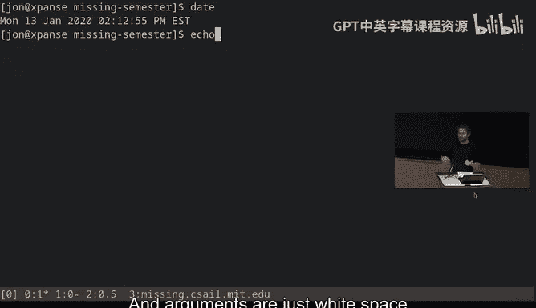

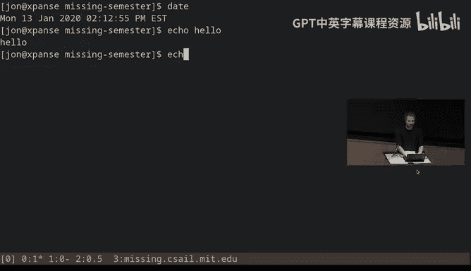

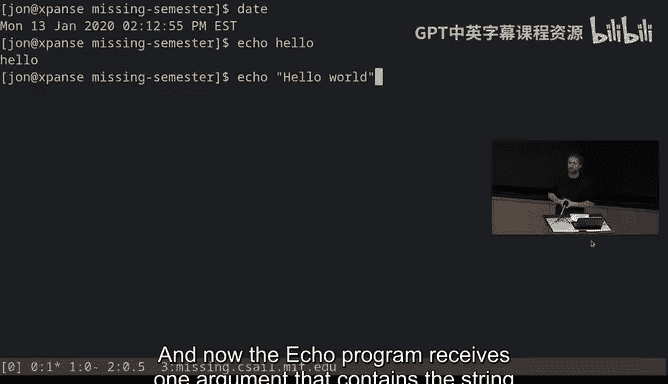

上一节我们介绍了课程的整体安排，本节中我们来看看今天讲座的核心内容：Shell。Shell是当您想要超越图形界面限制时，与计算机交互的主要方式之一。图形界面因其只能提供按钮、滑块和输入框等功能而受到限制。相反，文本工具通常被设计为既可相互组合，又有多种组合方式或编程自动化方法。这就是为什么在本课程中，我们将专注于这些命令行或基于文本的工具。Shell是您完成大部分此类工作的地方。

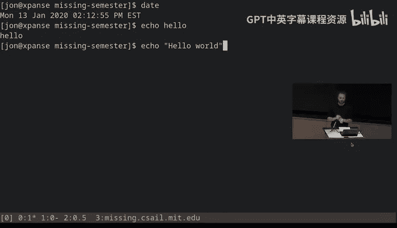

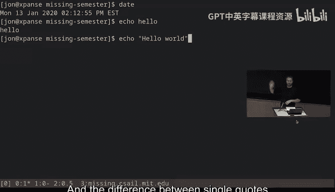

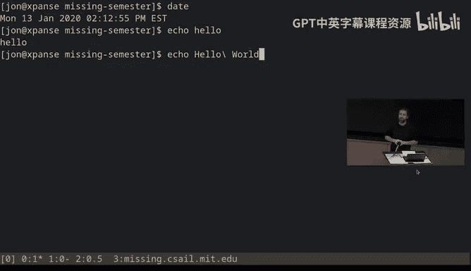

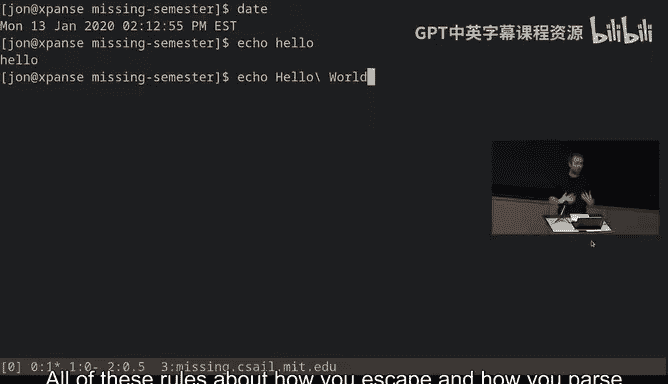

对于不熟悉Shell的用户，大多数平台都提供某种Shell。在Windows上，通常是PowerShell，但也有其他Shell可用。在Linux上，您会找到许多终端（用于显示Shell的窗口）和不同类型的Shell，其中最常见的是Bash（Bourne Again Shell）。在macOS上，如果您打开终端应用程序，可能也拥有Bash。本课程的讲解将以Linux为中心，但大多数工具在所有平台上都适用。

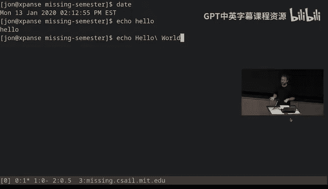

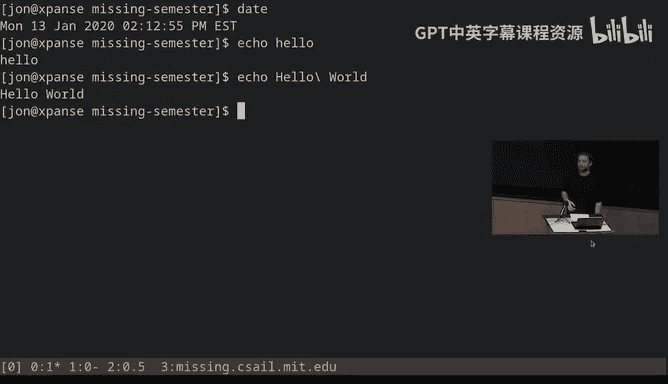

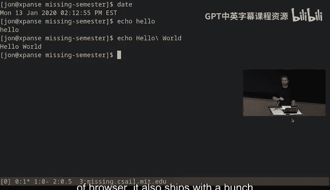

当您打开一个终端时，会看到类似这样的界面。通常顶部只有一行，这就是所谓的Shell提示符。我的Shell提示符看起来像这样，它包含我的用户名、当前所在机器名和当前路径。它会在那里闪烁，等待我输入。这就是您告诉Shell您希望它做什么的地方。您可以大量自定义此提示符。

这是您通过Shell与计算机进行文本交互的主要界面。在Shell提示符下，您可以输入命令。命令可以是相对简单的操作，通常是执行带有参数的程序。

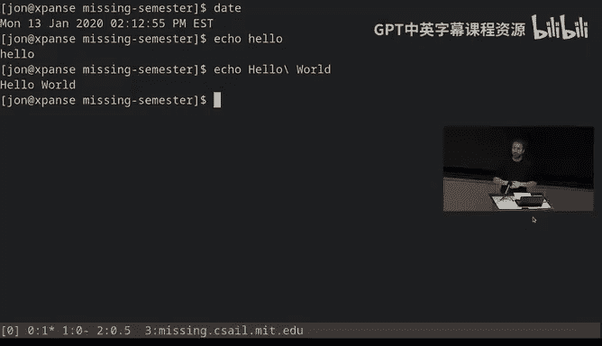

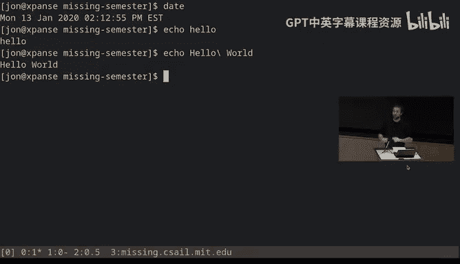

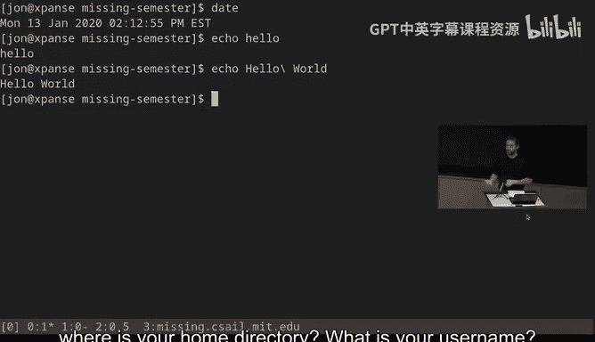

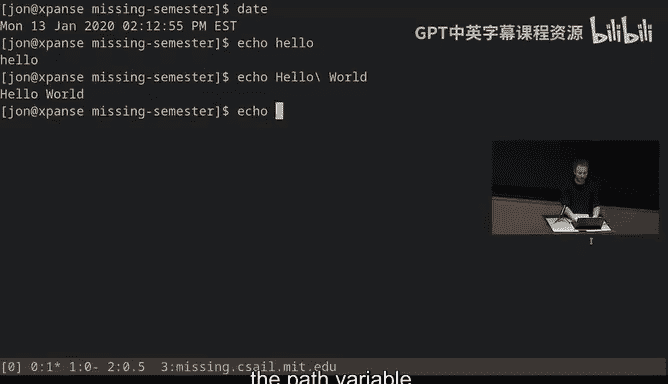

例如，我们可以执行一个名为 `date` 的程序。我们只需输入 `date`，它就会显示日期和时间。

您也可以执行带有参数的程序。这是修改程序行为的一种方式。例如，有一个名为 `echo` 的程序，`echo` 会打印出您给它的参数。参数是跟在程序名后面、由空格分隔的内容。

您可能会注意到，我说参数是由空格分隔的。您可能想知道，如果我想要一个包含多个单词的参数怎么办？您可以使用引号。例如，`echo "Hello World"`。现在 `echo` 程序接收一个包含字符串“Hello World”（带空格）的参数。您也可以使用单引号，单引号和双引号的区别我们将在讲解Bash脚本时讨论。您还可以转义单个字符，例如 `echo Hello\ World`。

关于如何转义、解析和引用各种参数及变量的规则，我们稍后会介绍。至少请记住，空格用于分隔参数。因此，如果您想创建一个名为“my photos”的目录，直接输入 `mkdir my photos` 会创建两个目录，一个叫“my”，一个叫“photos”，这可能不是您想要的。

## 程序路径与环境变量

您可能会问，当我输入 `date` 或 `echo` 时，Shell如何知道这些程序是什么？答案在于，您的计算机内置了许多随机器提供的程序，就像您的机器可能预装了终端应用程序、Windows资源管理器或某种浏览器一样，它也预装了许多以终端为中心的应用程序，这些程序存储在您的文件系统中。

您的Shell有一种方法来确定程序的位置，基本上是一种搜索程序的方式。它通过一个名为 `PATH` 的环境变量来实现。环境变量类似于编程语言中的变量。实际上，Shell（特别是Bash）本身就是一种编程语言。您在这里得到的提示符不仅可以运行带参数的程序，还可以执行诸如while循环、for循环、条件判断等操作。您可以在Shell中定义函数、使用变量。我们将在下一讲关于Shell脚本的内容中详细介绍这些。

现在，让我们看看这个特定的环境变量。环境变量是在您启动Shell时设置好的。其中有一个对此目的至关重要的变量，即 `PATH` 变量。如果我执行 `echo $PATH`，这将显示我的计算机上Shell将搜索程序的所有路径。

您会注意到这是一个由冒号分隔的列表。其核心是，每当您键入一个程序名时，Bash将遍历您计算机上的这个路径列表，并在每个目录中查找与您尝试运行的命令名称匹配的程序或文件。

如果我们想知道它实际运行的是哪一个，有一个名为 `which` 的命令可以做到这一点。例如，我可以输入 `which echo`，它会告诉我，如果我运行一个名为 `echo` 的程序，我将运行这个。

## 路径与导航

值得在这里暂停一下，讨论一下路径是什么。路径是命名计算机上文件位置的一种方式。在Linux和macOS上，这些路径由正斜杠分隔。您会看到这里的路径从根目录开始，开头的斜杠表示从文件系统的顶部开始。然后进入名为 `usr` 的目录，再进入 `bin` 目录，最后寻找名为 `echo` 的文件。

在Windows上，此类路径通常由反斜杠分隔。在Linux和macOS上，所有内容都位于根命名空间下，因此所有路径（或所有绝对路径）都以斜杠开头。在Windows上，每个分区都有一个根目录，例如 `C:\` 或 `D:\`。

我提到了“绝对路径”这个词。绝对路径是完全确定文件位置的路径。但还有相对路径。相对路径是相对于您当前所在位置的路径。

我们通过输入 `pwd`（打印工作目录）来找出当前所在位置。然后，我可以选择更改当前工作目录，所有相对路径都是相对于当前工作目录的。

例如，我可以执行 `cd /home` 来更改当前工作目录。有几个特殊的目录存在：`.` 表示当前目录，`..` 表示父目录。这是一种在系统中轻松导航的方式。

一个方便的技巧是使用 `~` 字符。这个字符会将您带到您的主目录。对于 `cd` 命令，还有一个非常方便的参数 `-`。如果您执行 `cd -`，它将切换到您之前所在的目录。

## 文件操作与权限

在 `ls` 或 `cd` 的情况下，可能有您不知道的参数。大多数程序接受所谓的参数，如标志和选项。这些通常以短横线开头。最方便的一个是 `-help`。大多数程序都实现了这个功能。

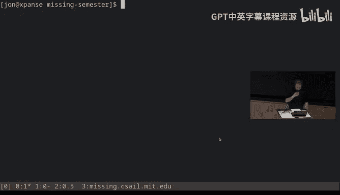

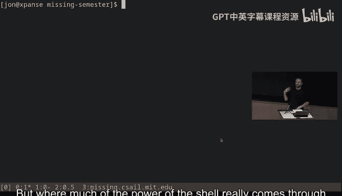

`ls -l` 标志很有用。它使用长列表格式，提供有关文件的更多信息。让我们看看其中一些信息是什么。首先，某些条目开头的 `d` 表示该条目是一个目录。其后的字母表示为该文件设置的权限。

读取这些权限的方式是：前三个字符是为文件所有者设置的权限，中间三个字符是为拥有该文件的组设置的权限，最后三个字符是为其他所有人设置的权限。

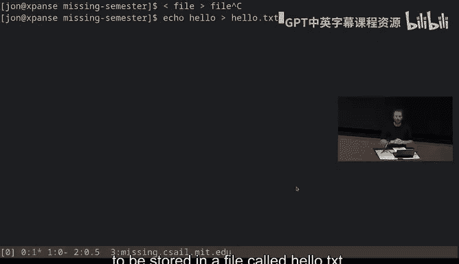

这些权限对于文件和目录的含义不同。对于文件，这很直接：如果您对文件有读取权限，则可以读取其内容；如果有写入权限，则可以保存文件；如果有执行权限，则允许执行该文件。

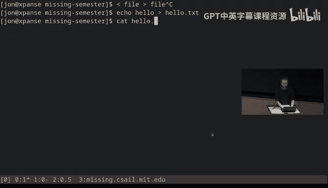

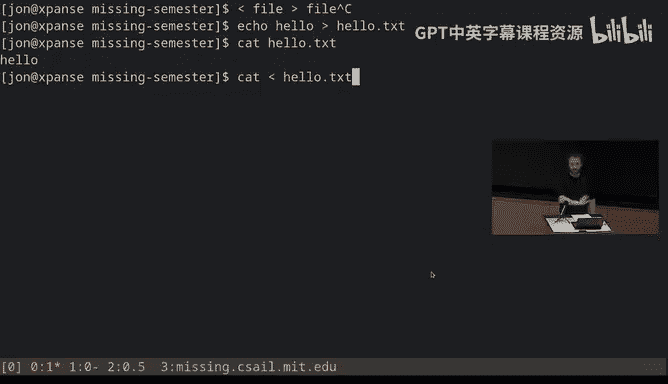

对于目录，这些权限则有所不同：读取意味着您是否被允许查看该目录中有哪些文件；写入意味着您是否被允许重命名、创建或删除该目录内的文件；执行（在目录上常被称为“搜索”）意味着您是否被允许进入该目录。

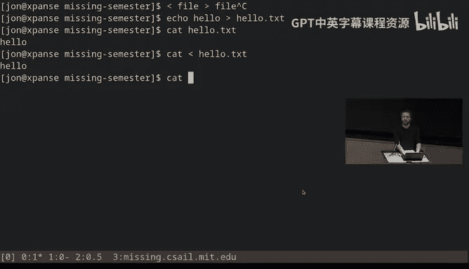

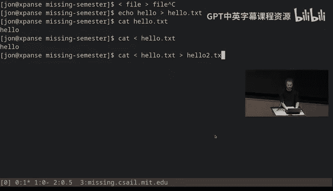

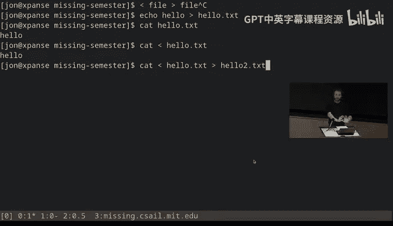

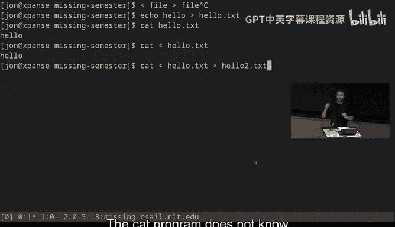

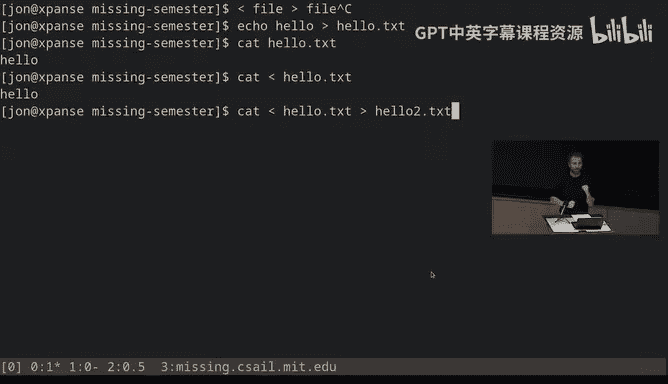

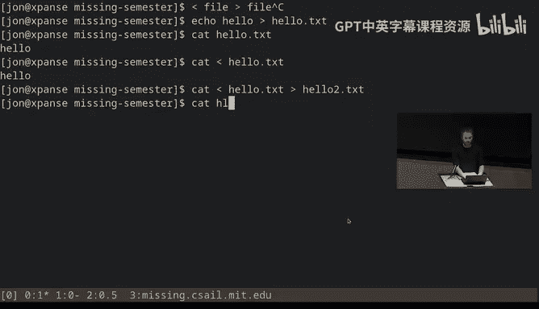

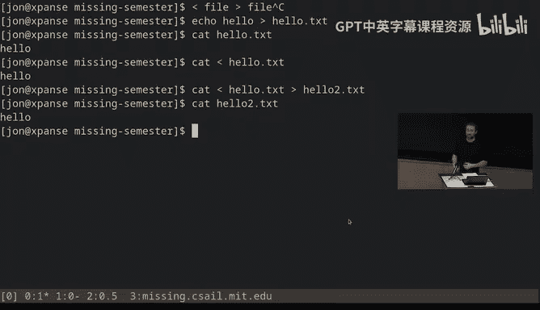

还有一些其他方便的程序需要了解。`mv` 命令允许我重命名文件。`cp` 命令允许复制文件。`rm` 命令允许删除文件。`mkdir` 命令用于创建新目录。

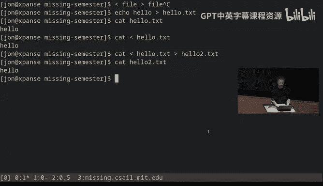

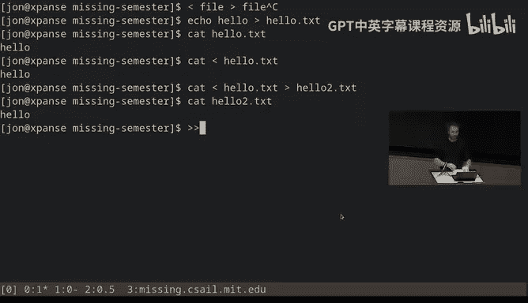

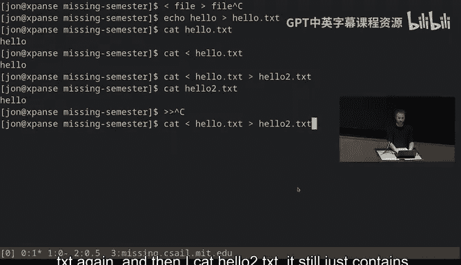

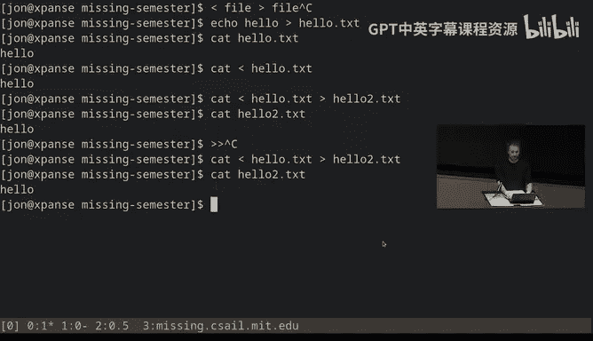

如果您想了解这些平台上任何命令的更多信息，有一个非常方便的命令叫做 `man`（手册页）。该程序以另一个程序的名称作为参数，并为您提供其手册页。

## 组合程序与管道

到目前为止，我们只讨论了单独的程序，但Shell真正强大的地方在于您开始组合不同的程序时。您可能希望将多个程序链接在一起，可能希望与文件交互，并在程序之间使用文件进行操作。我们可以使用Shell提供的流的概念来实现这一点。

默认情况下，每个程序都有两个主要流：一个输入流和一个输出流。默认情况下，输入流是您的键盘，输出流是您的终端。但Shell为您提供了一种重定向这些流的方法，以改变程序的输入和输出指向的位置。

最直接的方法是使用尖括号符号。左尖括号表示将此程序的输入重定向为该文件的内容。右尖括号表示将前面程序的输出重定向到此文件。

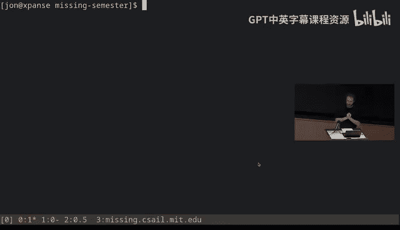

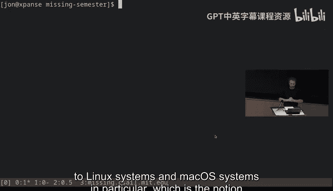

还有一个双右尖括号，表示追加而不是覆盖。

真正有趣的是Shell提供的另一个操作符，称为管道字符 `|`。管道意味着获取左侧程序的输出，并将其作为右侧程序的输入。

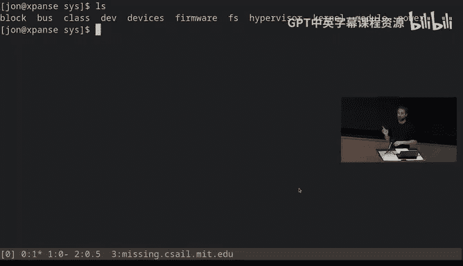

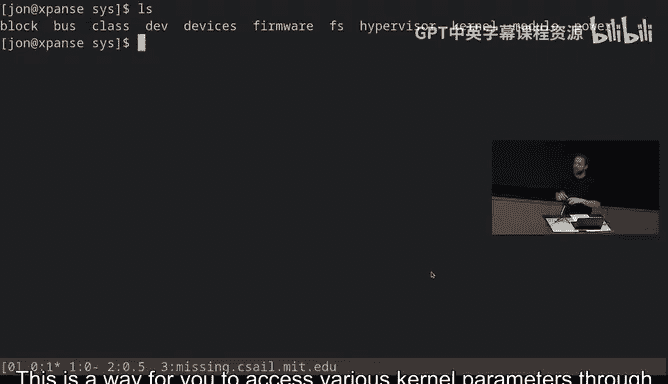

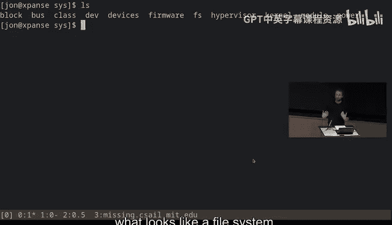

通过这种方式，您可以实现一些非常简洁的操作。我们将在数据整理讲座中更详细地介绍这些内容。

## 超级用户与系统文件

我想与您讨论的另一个主题是关于如何以更有趣、或许更强大的方式使用终端。但首先，我们需要介绍Linux系统和macOS中的一个重要概念，即超级用户（root用户）的概念。root用户类似于Windows上的管理员用户，用户ID为0。root用户很特殊，因为它被允许在您的系统上执行任何操作。

大多数时候，您不会以超级用户身份操作。但偶尔，您需要执行一些需要root权限的操作。对于这些情况，您通常会使用一个名为 `sudo` 的程序。`sudo` 允许您以超级用户身份运行命令。

您可能需要这样做的场景之一是访问 `/sys` 文件系统。这个文件系统实际上并不是您计算机上的文件，而是各种内核参数。这是一种通过看起来像文件系统的方式来访问各种内核参数的方法。

因为它们是作为文件暴露的，这意味着我们也可以使用我们迄今为止使用的所有工具来操作它们。一个例子是，如果您进入 `/sys/class/backlight`，这个目录允许您配置笔记本电脑的背光（如果有的话）。您可以读取和修改亮度文件来改变屏幕亮度，但这需要root权限。

## 总结与练习

本节课中我们一起学习了Shell的基础知识，包括如何执行命令、理解路径和环境变量、操作文件和目录、查看权限、组合程序使用管道，以及了解超级用户和系统文件访问。

现在，您应该大致了解如何在终端和Shell中操作，并掌握足够的知识来完成至少基本的任务。理论上，您现在不再需要使用点击界面来查找文件了。您可能还需要的一个技巧是打开文件的能力。例如，在Linux上，您可以使用 `xdg-open` 命令，给它一个文件名，它将在适当的程序中打开该文件。

对于你们中的一些人来说，这一切可能相对基础，但正如我所提到的，这是一个入门阶段。现在我们都知道Shell是如何工作的，我们在未来讲座中将要做的大部分事情就是利用这些知识，使用Shell来做真正有趣的事情。

我们将在下一讲中更多地讨论如何自动化此类任务，如何编写为您运行一系列程序的脚本，以及如何在终端中执行条件判断和循环等操作。

本讲的讲义已经在线发布，文件底部有一系列练习。我们鼓励您尝试完成它们。如果您已经了解这些内容，完成起来会很快；如果您不了解，它可能会教给您许多您可能没有意识到自己不知道的东西。在讲座后的答疑时间里，我们将很乐意帮助您完成所有这些练习。