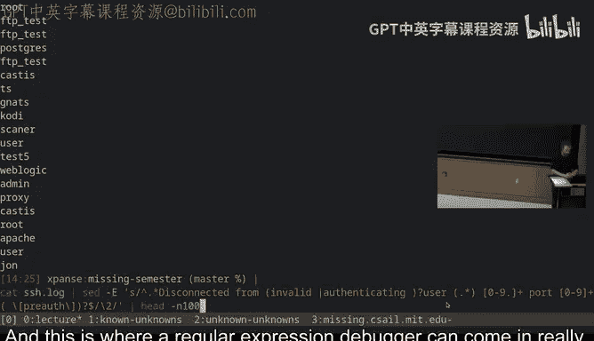
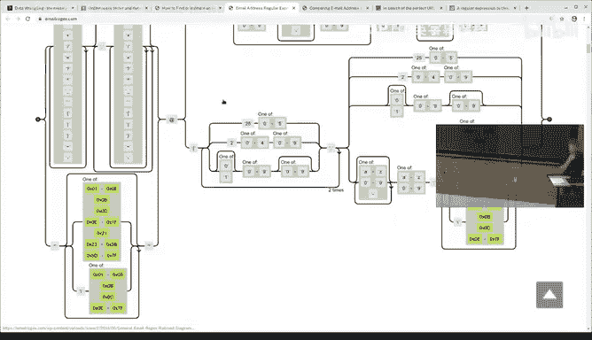
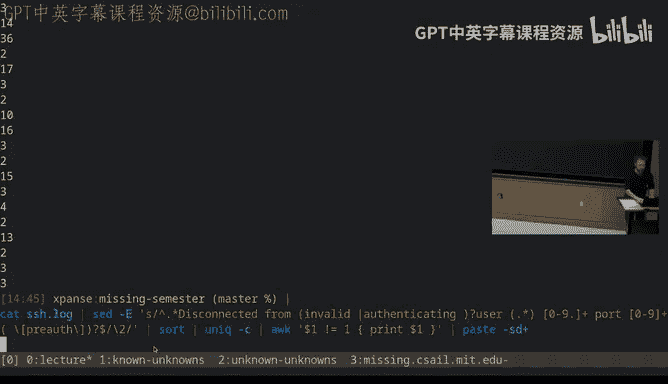
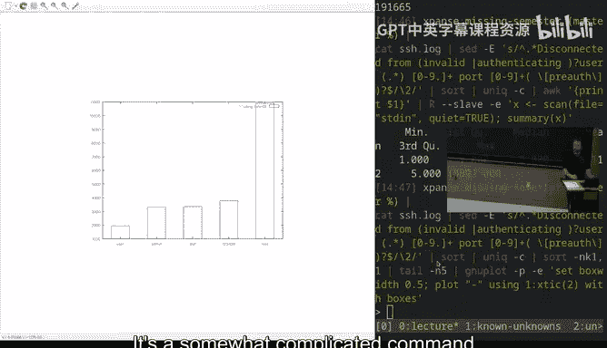
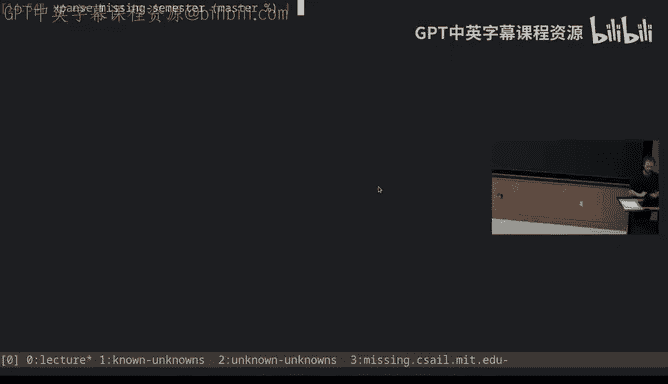

# 《计算机科学教育中遗漏的一学期｜The Missing Semester of Your CS Education 2020》中英字幕 - P4：-04-.Lecture 4_ Data Wrangling (2020).zh_en - GPT中英字幕课程资源 - BV1Y3yhBHEip

😀。Allright， so welcome to today's lecture， which is going to be on data wrangling。

 and data wrangling might be a phrase。 It sounds a little bit odd to you。

 but the basic idea of data wrangling is that you have data in one format。

 and you want it in some different format。 And this happens all of the time。

 I'm not just talking about like converting images。

 but it could be like you have a text file or a log file。

 And what you really want is data in some other format。

 like you want a graph or you want statistics over the data。

 Anything that goes from one piece of data to another representation of that data is what I would call data wrangling。

😊，We've seen some examples of this kind of data wrangling already previously in the semester。

 like basically whenever you use the pipe operator that lets you sort of take output from one program and feed it through another program。

 you are doing data wrangling in one way or another。

 But what we're going to do in this lecture is take a look at some of the fancier ways you can do data wrangling and some of the really useful ways you can do data wrangling。

嗯。In order to do any kind of data wrangling， though， you need a data source。

 You need some data to operate on the first place。 And there are a lot of good candidates for that kind of data。

 We give some examples in the exercise section for today's lecture notes。 in this particular one。

 though。 I'm going to be using a system log。 So I have a server that's running somewhere in the Netherlands。

 because that seemed like a reasonable thing at the time。 And on that server。

 it's running sort of a regular logging demon that comes with system D。

 This is a sort of relatively standard Linux logging mechanism。

 And there's a command called journal CT TL on Linux systems that will let you view the system log。

 And so what I'm going do is I'm gonna do some transformations over that log and see if we can extract something interesting from it。

😊，You'll see， though， that if I run this command， I end up with a lot of data because this is a log that has just like。

There's a lot of stuff in it， right， A lot of things have happened on my server。

 and this goes back to like January 1 and there are logs that go even further back on this。

 So there's a lot of stuff。 So the first thing we're gonna to do is try to limit it down to only one piece of content。

 And here， the G command is your friend。 So we're gonna pipe this through rep。

 and we're gonna pipe for Ss H。 right So Ss H we haven't really talk to you about yet。

 But it is a way to access computers remotely through the command line。 And in particular。

 what happens when you put a server on the public internet is that lots and lots of people around the world try to connect to it and log in and take over your server。

 And so I want to see how those people are trying to do that。 And so I'm gonna grab for S H。

 And you'll see pretty quickly that this also generates a bunch of content， at least in theory。

 this is gonna be real slow。😊，There we go。So this generates tons and tons and tons of content。

 And it's really hard to even just visualize what's going on here。

 So let's look at only what username people have used to try to log into my server。

 So you'll see some of these lines say disconnected。

 disconnected from invalid user and then some user name。 I want only those lines。

 That's all I really care about。 I'm gonna make one more change here， though， which is。

If you think about how this pipeline does， if I here do this connected from。

So this pipeline at the bottom here， what that will do is it will send the entire log file over the network to my machine and then locally run Gr to find only the lines that contain SSH and then locally filter them further。

 So seems a little bit wasteful because I don't care about most of these lines and the remote site is also running a shell So what I can actually do is I can have that entire command run on the server So I'm telling SSH the command I want you to run on the server is this pipeline of three things。

 and then what I get back， I want to pipe through less。So what does this do。

 well it's going to do that same filtering that we did， but it's going to do it on the server side。

 and the server is only going to send me those lines that I care about。

And then when I pipe it locally through the program called lesss， less is a pager。

 you'll see some examples of this， you've actually seen some of them already。

 like when you type man and some command that opens in a pager and a pager is a convenient way to take a long piece of content and fit it into your terminal window and have you scroll down and scroll up and navigate it so that it doesn't just like scroll past your screen。

😊，And so if I run this， it still takes a little while because it has to parse through a lot of log files and in particular。

 GrP is buffering and therefore it decides to be relatively unhelpful。 let me do this without。呃。

Let's see if that's more helpful。Why doesn't want to be helpful to me。Fine。

 I'm going to cheat a little。Just ignore me。Or the Internet is really slow。

 Those are two possible options。Luckily， there's a fix for that， because previously。嗯。

I have run the following command。So this command just takes the output of that command and sticks it into a file locally in my computer so I ran this when I was up in my office and so what this did is it downloaded all of the SSH log entries that match disconnect from so I have those locally and this is really handy there's no reason for me to stream the full log every single time because I know that that starting pattern is what I'm going to want anyway so we can take a look at SSH log and you will see there are lots and lots and lots of lines that all say disconnected from invalid user authenticating user etc。

😊，Right，So these are the lines that we have to work on。 And this also means that going forward。

 we don't have to go through this whole SSH process。

 We can just cat that file and then operate it on it directly。

So here I can also demonstrate this pager， so if I do catSsH。 log and I pipe it through less。

 it gives me a pager where I can scroll up and down。

 let me make that a little bit smaller maybe so I can scroll through this file and I can do so with what are roughly vim bindings。

 so control U to scroll up， control D to scroll down and Q to exit。This is still a lot of content。

 though。 And these lines contain a bunch of garbage that I'm not really interested in。

 What I really want to see is what what are these usernames。 And here。

 the tool that we're gonna to start using is one called said。 said is a stream editor that's modify。

 or its， it's a modification of a much earlier program called Ed。

 which was really weird editor that none of you will probably want to use。 Yeah。😊。

You've may have said this already， what is the TSP？Oh。

 TSP is the name of the remote computer I'm connecting to。So Se is a stream editor。

 and it basically lets you make changes to the contents of a stream。

 You can think of it a little bit like doing replacements。

 but it's actually a full programming language over the stream that is given。

One of the most common things you do with said though。

 is to just run replacement expressions on an input stream。 What do these looks like， Well。

 let me show you。嗯。Here， I'm going to pipe this sous said。

 and I'm going to say that I want to remove everything that comes before disconnect connected from。嗯。

So this might look a little weird。 The observation is that the date and the host name and the sort of process I of the SSHD I don't care about。

 I can just remove that straight away。 And I can also remove that like disconnected from bit because that seems to be present in every single log entry。

 So I just want to get rid of it。 And so what I write is a said expression in this particular case。

 it's an S expression， which is a substitute expression。

 It takes two arguments that are basically enclosed in these slashes。

 So the first one is the search string And the second one。

 which is currently empty is a replacement string。 So here I'm saying search for the following pattern and replace it with blank。

😊，And then I'm going to pipe it into less at the end。

So you see that now what it's done is trim off the beginning of all these lines。

And that seems really handy， but you might wonder， what is this pattern that I've built up here？

Right， this， this dot star。 What does that mean， This is an example of a regular expression。

 And regular expressions are something that you may have come across in programming in the past。

 but it's something that once you go into the command line， you will find yourself using a lot。

 especially for this kind of data wrangling。Regular expressions are essentially a powerful way to match text。

 You can use it for other things than text too， but text is the most common example。

 And in regular expressions， you have a number of special characters that say。

 don't just match this character but match， for example。

 a particular type of character or a particular set of options。

 It essentially generates a program for you that searches the given text。 dot， for example。

 means any single character。😊，And star， if you follow a character with a star。

 it means zero or more of that character。And so in this case。

 this pattern is saying zero or more of any character followed by the literal string disconnected from。

And I'm saying match that and then replace it with blank。

Regular expressions have a number of these kind of special characters that have various meanings you can take advantage of。

 I talked about star， which is zero or more。 There's also plus。

 which is one or more right So this is saying I want the previous expression to match at least once。

😊，You also have square brackets。 so square brackets let you match one of many different characters。

 So here let us build up a string， let something like A B A。And I want to substitute。A and B。

With nothing。Okay， so here， what I'm telling the pattern to do is to replace any character that is either A or B with nothing。

So if I make the first character B， it will still produce BA。You might wonder though。

 why did it only replace once， Well it's because what regular expressions will do。

 especially in this default mode， is they will just match the pattern once and then apply the replacement once per line that is what' said normally does you can provide the G modifier which says do this as many times as it keeps matching。

Which in this case would erase the entire line because every single character is either an A or a B。

If I added a C here， it' would remove everything but the C。

If I added other characters in the middle of this string somewhere， they wouldn't be preserved。

 but anything that is an A or a B is removed。You can also do things like add modifiers to this。

 for example。What would this do， this is saying I want zero or more of the string AB。😡。

And I want to replace them with nothing。This means that if I have a standalone A。

 it will not be replaced。 if I have a standalone B， it will not be replaced。

 but if I have the string A B， it will be removed。Which。Yeah， oh， that is stupid。

The dash E here is because SE is a really old tool and so it supports only a very old version of regular expressions。

 generally you will want to run it with D capital E which makes it use a more modern syntax that supports more things if you are in a place where you can't you have to prefix these with backslashes to say I want the special meaning of parenthses otherwise it would just match a literal parenthesis which is probably not what you want。

So notice how this replaced the A B here and it replaced the A B here， but it left this C。

 and it also left the A at the end because that A does not match this pattern anymore。

And you can group these patterns in whatever ways you want。 you also have things like alternations。

 you can say anything that matches A B or BC。I want to remove。

And here you'll notice that this AB got removed。😡，This BC did not get removed。

 even though it matches the pattern because the AB had already been removed。This AB is removed。

 right， but the C stays in place， this AB is removed。

And this C states because it still does not match that。If this， if I remove this A。

 then now this AB pattern will not match this B， so it'll be preserved。

 and then BC will match BC and then it'll go away。Regose expressions can be all sorts of complicated when you first encounter them。

 and even once you get more experienced with them， they can be daunting to look at。

And this is why very often， you want to use something like a regular expression debugger。

 which we'll look at in a little bit。 But first， let's try to make up a pattern that will match the logs and and match the logs that we've been working with so far。

 So here I'm gonna just sort of extract a couple of lines from this file。 Let's say the first five。

 So these lines all now look like this。😊，and what we want to do is we want to only have the username。

Okay， so what might this look like？Well。Here's one thing we could try to do。Actually。

 let me show you one thing first， let me take a line that says something like disconnected from an invalid user。

Disconnected from。Maybe4，211， whatever。Okay so this is an example of a login line。

Where someone tried to log in with the username disconnected from。I'm missing an S。没有给。Disconed。

 thank you。You'll notice that this actually removed the username as well。

 And this is because when you use dot star and any of these sort of range expressions and regular expressions。

 they are greedy。 They will match as much as they can。 So in this case。

 this was the username that we wanted to retain。 But this pattern actually matched all the way up until the second occurrence of it or the last occurrence of it。

 And so everything before it， including the username itself， got removed。😊。

And so we need to come up with a slightly cleverer matching strategy than just saying sort of dot star。

 because it means that if we have particularly adversarial input。

 we might end up with something that we didn't expect。Okay。

 so let's see how we might try to match these lines。 Let's just do head first。Well。

Let's try to construct this up from the beginning。嗯。We， first of all。

 know that we want dash capital E， right， because we want to not have to put all these back slashes everywhere。

 These lines look like they say from。 and then some of them say invalid。But some of them do not。

 right， This line has invalid。 that one does not Quetion mark here is saying 0 or 1。

So I want0 or one of invalid space user。What else that's going to be a double space。

 so we can't have that。And then there's going to be some username。

And then there's going to be what exactly there's going to be what looks like an IP address。

 So here we can use our range syntax in say 0 to 9 and adopt dot。 right。

 That's what IP addresses are。And we want many of those。Then it says port。

 so we're just going to match a literal port， and then another number， zero to nine。

 and we're going to wand plus of that。The other thing we're going to do here is we're going to do what's known as anchoring the regular expression。

 So there are two special characters in regular expressions。 There's carrot or hat。

 which matches the beginning of a line， and there's dollar， which matches the end of a line。😊。

So here we're going to say that this regular expression has to match the complete line。

The reason we do this is because imagine that someone made their username the entire log stringing。😡。

But now， if you tried to match this pattern， it would match the username itself。

 which is not what we want。Generally， you will want to try to anchor your patterns whenever you can to avoid those kind of oddities。

Okay， let's see what that gave us。 That removed many of the lines， but not all of them。 So this one。

 for example， includes this pre off at the end。 So we'll want to cut that off if there's a space pre off。

Square brackets are special， we need to escape them。

 now let's see what happens if we try more lines of this。it still gets something weird。

 Some of these lines are not empty， right， which means that the pattern did not match。 This one。

 for example， it says authenticating user instead of invalid user， Okay so。

It has to match invalid or authenticated zero or one time before user， How about now？Okay。

 that looks pretty promising。But this output is not particularly helpful， right here。

 we've just erased every line of our log file successfully， which is not very helpful。 Instead。

 what we really wanted to do is when we match the username right over here。

 we really wanted to remember what that username was because that is what we want to print out。

And the way we can do that in regular expressions is using something like capture groups。😊。

So capture groups are a way to say that I want to remember this value and reuse it later and in regular expressions。

 any bracketed expression， any parentheses expression is going to be such a capture group。

 So we already actually have one here。 which is this first group。

 And now we're creating a second one here。 notice that these parentheses don't do anything to the matching right。

 because they are just saying this expression as a unit， but we don't have any modifiers after it。

 So it's just match one time。And then the reason matching groups are useful or capture groups are useful is because you can refer back to them in the replacement。

 So in the replacement here， I can say back slash2。

 This is the way that you refer to the name of a capture group。 in this in this case。

 I'm saying match the entire line。 And then in the replacement。

 put in the value you captured in the second capture group。😊，Remember。

 this is the first capture group， and this is the second one。And this gives me all the usernames。Now。

 if you look back at what we wrote， this is pretty complicated。

It might make sense now that we' walked through it and why it had to be the way it was。

 But this is like not obvious that this is how these lines work。

 And this is where regular expression， debugger can come in really， really hand。

So we have one here。 There are many online。 But here I've。

 I've sort of pre filledled in this expression that we just used and notice that it。

 it tells me what all the matching does。 In fact， now。

 this window is a little small with this font size。 But if I do。😊，Here。

 this explanation says dot star matches any character between zero and unlimited times。

Followed by disconnected from literally， followed by a capture group and then walks you through all the stuff。

And that's one thing， but it also lets you give in a test string and then matches the pattern against every single test string that you give and highlights what the different capture groups。

 for example， are。So here we made user a capture group， right？So it'll say， okay。

 the full string matched， right， the whole thing is blue， so it matched。

 green is the first capture group， red is the second capture group。

 and this is the third because preotth was also put in a parentheses。

And this can be a handy way to try to debug your regular expressions。 For example。

 if I put disconnected from。Let's add a new line here。And I make the username disconnected from。Oh。

 that line already had the username B to from。 Great。 hear me thinking ahead。

 You'll notice that with this pattern， this was no longer a problem because it got matched the username。

 What happens if we take this entire line or this entire line。😊，And make that the username。

Now what happens？It gets really confused， right？So this is where regular expressions can be a pain to get right。

Because it now tries to match。It matches the first place where a username appears or the first invalid in this case。

 the second invalid because this is greedy。We can make this non greedy by putting a question mark here。

So if you suffix a plus or a star with a question mark， it becomes a non- greedy match。

 so it will not try to match as much as possible， and then you see that this actually gets parsed correctly because this dot star will stop at the first disconnected from。

 which is the one that's actually emitted by SSH， the one that actually appears in our logs。

As you can probably tell from the explanation of this so far。

 regular expressions can get really complicated。 and there are all sorts of weird modifiers that you might have to apply in your pattern。

 The only way to really learn them is to start with simple ones and then build them up until they match what you need。

 Often you're just doing some like one off job。 Like when we're hacking out the username here and you don't need to care about all the special conditions。

 right You don't have to care about someone having the SH username perfectly match your logging format。

 That's probably not something that matters because you're just trying to find the usernames。

 But regular expressions are really powerful and you want to be careful if you're doing something where it actually matters。

 You had a question。😊，only that。Regular expressions by default only match per line anyway。

They will not match across new lines。I guess I guess what I was saying though is you have like your luck as many lines in it willll only just find the first match。

So so the way that saidD works is that it operates per line。

 And so saidD will do this expression for every line。Okay。

 questions about regular expressions or this pattern so far。 It is a complicated pattern。 So if it。

 if it feels confusing， like， don't be worried about it， look at it in the debugger later。 Yep。

 What after adding the question mark sets。You had a user that。Had two copies of that log。

It's user name。Ohow， so keep in mind that we're assuming here that the user only has control over their username。

So the worst that they could do is take this entire entry and make out the username。

 let's see what happens。RightSo that's still works。

 And the reason for this is this question mark means that the moment we hit the disconnect keyword。

 we start parsing the rest of the pattern。And the first occurrence of disconnected is printed by SSH before anything the user controls。

So in this particular instance， even this will not confuse the pattern， y。

So this looks provide very much security application， but it is really well， so if you're writing a。

 this sort of odd matching， well， in general， when you're doing data wrangling is like not security。

 it's not security related， but it might mean that you get really weird data back。

And so if you're doing something like plotting data， you might drop data points that matter。

 You might parse out the wrong number。 and then like your plots suddenly have data points that weren't in the original data。

 And so it's more that if you find yourself writing a complicated regular expression。

 like double check that is actually matching what you think it's matching even if it's not security related。

And as you can imagine， these patterns can get really complicated。 Like， for example。

 there's a big debate about how do you match an email address with a regular expression。

 And you might think of something like this。 So this is a very straightforward one that just says letters and numbers and notice scores and percent followed by a plus because in Gmail。

 you can have plus and email addresses with a suffix in this case。

 the plus is just for any number of these， but at least one because you can't have an email address that doesn't have anything before the a。

 And then similarly after the domain right， And the top level domain has to be at least two characters and can't include digits。

 you can have dot com， but you can't have dot 7。 It turns out this is not really correct， right。

 there are a bunch of valid email addresses that will not be matched by this and there are a bunch of invalid email addresses that will be matched by this so。

😊，There are many， many suggestions， and there are people who have built like full test suites to try to see which regular expression is best。

嗯。And this particular one is for URLs。 There are similar ones for email where they found that the best one is this one。

😊，I don't recommend you trying to understand this pattern。

 but this one apparently will almost perfectly match the what the like internet standard for email addresses says is a valid email address。

 and that includes all sorts of weird Unicode code points。

 this is just to say regular expressions can be really hairy。 and if you end up somewhere like this。

 theres probably a better way to do it。For example。

 if you find yourself trying to parse HTMLM or something or parse like parse Jason withing expressions。

 you should probably use a different tool。 and there is an exercise that has you do this。

 not withingular expressions， mind you。啊。Yeah， there's all sorts of suggestions。

 and they give you deep， deep dives into how they work。 So if you want to look that up。

 it's in the lecture nodes。

嗯。Okay， so now we have the list of username。 So let's go back to data wrangling。 right。

 Like this list of username is still not that interesting to me， right， Let's。

 let's see how many lines there are。 So if I do WC dashel， there are。Hundred and98000 lines。

 So WC is the word count program。 D L makes it count the number of lines。 This is a lot of lines。

 And if I start scrolling through them， that still doesn't really help me， right。

 Like I need statistics over this。 I need aggregates of some kind。

And the said tool is like useful for many things。 It gives you a full programming language。

 It can do weird things like insert text or only print matching lines。

 but it's not necessarily the perfect tool for everything right Like sometimes there are better tools。

 Like， for example， you could write a line counter in。

 you just should never said as a terrible programming language except for searching and replacing。

But there are other useful tools。 So， for example， there' is a tool called sort。So sort。

 this is also not going to be very helpful， but sort takes a bunch of lines of input， sorts them。

 and then prints them to your output。So in this case， I now get the sortrded output of that list。

 It is still 200，000 lines long， so it's still not very helpful to me。

But now I can combine it with a tool called unique。 So unique will look at a sortded list of lines。

 and it will only print those that are unique。 So if you have multiple instances of any given line。

 it will only print it once。 And then I can say unique dash C。 So this is gonna say。

 count the number of duplicates for any lines that are duplicated and then eliminate them。😊。

What does this look like or if I run it？It's gonna take a while。 There were 13 Z， Z Z usernames。

 There were 10 Z X， VF usernames， etc cea there。 And I can scroll through this。

 This is still a very long list， right， but at least now it's a little bit more collated than it was。

 Let's see how many lines I'm down to now。😊，Okay，24000 lines。 It's still too much。

 It's still not useful information to me， but I can keep bur down this with more tools。 For example。

 what I might care about is which username have been used the most。Well， I can do sort again。

 and I can say I want a numeric sort on the first column of the input。So dash n says numeric sort。

 dash K lets you select a white space separated column from the input to sort by。

 and the reason I'm giving one comma one here is because I want to start at the first column and stop at the first column。

Alternatively， I could say， I want you to sort by this list of columns。 but in this case。

 I just want to sort by that column。嗯。And then I want only the 10 last lines。

 So sort by default will output in ascending order。 So the。

 the ones with the highest counts are gonna be at the bottom。 And then I want only the last 10 lines。

And now when I run this， I actually get a useful bit of data， right It tells me there were 11。

000 login attempts with the username route， There were 4，000 with 1，2，3，4，5，6 is the username， etc。😊。

And this is pretty handy， right？And now， suddenly， this giant log file actually produces useful information for me。

 This is what I really wanted from that log file。 Now。

 maybe I want to just like do a quick disabling of root， for example， for SS， H login on my machine。

😊，Which I recommend you will do， by the way。嗯。In this particular case。

 we don't actually need the K for sort because sort by default will sort by the entire line and the number happens to come first。

 but it's useful to know about these additional flags。And you might wonder， well。

 how would I know that these flags exist， How would I know that these programs even exist。Well。

 the programs usually pick up just from being told about them in classes like here。

 The flags are usually like。I want to sort by something that is not the full line。

Your first instinct should be to type man sort and then read through the page。

 and then very quickly willll tell you， here's how to select a particular column。

 here's how to sort by a number， et cea。嗯。Okay， what if now that I have this like top。

 let's say top 20 list， let's say I don't actually care about the counts。

 I just want like a comma separated list of the usernames because I'm going to like send it to myself by email every day or something like that like these are the top 20 usernames。

Well， I can do this。Okay， that's a lot more weird commands。

 But there are commands that are useful to know about。 So OC is a columnbased stream processor。

 So we talked about said， which is a stream editor。 So it tries to edit text primarily in the inputs。

 O， on the other hand， also lets you edit text。 It is still a full programming language。

 But it's more focused on columnar data。 So in this case。

 O by default will parse its input in whitespace separated columns。

 And then that you operate on those column separately。 In this case。

 I'm saying just print the second column， which is the user in。😊，Right。

Paste is a command that takes a bunch of lines and paste them together into a single line that's the dash S with the delimiter comma。

So in this case， on this， I will get a comma separated list of the top 20 username。

 which I can then do whatever useful thing I might want。

 Like maybe I want to stick this in a config file of disallowed username or something along those lines。

Act is worth talking a little bit more about because it turns out to be a really powerful language for this kind of data wrangling。

😊，We mentioned briefly what this print Doar2 does， but it turns out that for A。

 you can do some really， really fancy things。 So for example。

 let's go back to here where we just have the usernames actually let's still do sort and unique。

Becauseuse we don't。Otherwise， the list gets far too long。

 And let's say that I only want to print the username that match a particular pattern。Let's say。

 for example， that I want。E dash see。I want all of the username that only appear once。

And let's start with a C and end with an E。This is a really weird thing to look for。 but in O。

 this is really simple to express。 I can say， I want the first column to be one。

And I want the second column。To match the following regular expression。Actually。

 this could probably just be dot。嗯。And then I want to print the whole light。

SoUn I messed something up， this will give me all the username that start with a C。

 end with an E and only appear once in my log。Now， that might not be a very useful thing to do with the data。

 but what I'm trying to do in this lecture is show you the kind of tools that are available。

 And in this particular case， this pattern is like not that complicated。

 even though what we're doing is sort of weird。 and this is because very often on with Linux tools in particular and command line tools in general。

 the tools are built to be based on lines of input and lines of output and very often those lines are going to be have multiple columns and OC is great for operating over columns。

😊，嗯。Now， A is。Is not just able to do things like match per line， but it lets you do things like。

 let's say I want the number of these， right I want to know how many usernames match this pattern。

 Well， I can do WCl。 that works just fine。 There are 31 such usernames。

 but O is a programming language。 This is something that you will probably never end up doing yourself。

 but it's important to know that you can。 every now and again。

 it is actually useful to know about these。😊，This might be hard to read on my screen。

 I just realized。嗯。Let me try to fix that in a second。Let's do。Yeah。Apparently。

 fishish does not want me to do that。 So here， begin is a special pattern that only matches the zeroth line。

En is a special pattern that only matches after the last line。

And then this is going to be a normal pattern that's matched against every line。

 So what I'm saying here is on the zeroth line， set the variable rows to 0 on every line that matches this pattern。

 increment rows。And after you have matched the last line， print the value of rows。

And this will have the same effect as running WC DL， but all within O。In particular instance。

 like WC D all is just fine， But sometimes you want to do things like you want might want to keep a dictionary or a map of some kind。

 You might want to compute statistics。 You might want to do things like。

 I want the second match of this pattern。 So you need a stateful matcher。 Like。

 ignore the first match。 but then print everything following the second match。 And for that。

 this kind of simple programming and all can be useful to know about。😊，嗯。In fact。

 we could in this pattern get rid of said and sort and unique and G that we originally used to produce this file and do it all in Ot。

 but you probably don't want to do that， it would be probably too painful to be worth it。

It's worth talking a little bit about the other kinds of tools that you might want to use on the command line The first of these is a really handy program called BC。

 so BC is the Berkeley calculator， I believe， man BC。

I think BC is originally from Berkeley calculator。Anyway。

 it is a very simple command line calculator， but instead of giving you a prompt。

 it reads from Standard In so I can do something like Echo1 plus2 and pipet to BCL because many of these programs normally operate in like a stupid mode where they're unhelpful。

So here it prints3。 Wow， very impressive。 but it turns out this can be really handy。

 Imagine you have a file with a bunch of lines。 Let's say something like。😊，Oh， I don't know。

This file。 And let's say， I want to。Sum up the number of logins。

 the number of user names that have not been used only once。 Allright。

 so the ones where the count is not equal to  one。 I want to print just the count。Right。

 so this will give me the counts for all the non single use username。

 And then I want to know how many are there of these。

 Notice that I can't just count the lines that wouldn't work， right。

 because there are numbers on each end。 I I want a sum。 Well， I can use paste to paste by plus。

So this paste every line together into a plus expression。Right？

And this is now an arithmetic expression， so I can pipe it through BC DL。😊，And now。

There have been 191000 logins that share a username with at least one other login。Again。

 probably not something you really care about， but this is just to show you that you can extract this data pretty easily。

嗯。And there's all sorts of other stuff you can do with this， for example。

 there are tools that let you compute statistics over inputs。 So for example。

 for this list of numbers let's say I just took the numbers and just printed out just the distribution numbers。

 I could do things like use R R as a separate programming language that's specifically built for a statistical analysis and I can say let's see if I got this right。

This is， again， a different programming language that。You would have to learn。

But if you already know R， or you can pipe them through other languages too。Like so。

So this gives me summary statistics over that input stream of numbers。

So the median number of login attempts per username is three。The max is 10。

000 that was root as we saw before。 and tell me the average was 8。

For this might not matter in this particular instance， like this might not be interesting numbers。

 but if you're looking at things like output from your benchmarking script or something else where you have some numerical distribution and you want to look at them。

 these tools are really handy。We can even do some simple plotting， if we wanted to。

So this has a bunch of numbers。Let let's go back to our sort and K11 and look at only the let's do top five。

 new plot is a plotter。That lets you take things from Standard in。

I'm not expecting you to know all of these programming languages。

Because they really are programming languages in their own right。

 but it is to show you what is possible。Right，So this is now a histogram of how many times each of the top five username have been used on my server since January 1。

And it's just one command line。It's a somewhat complicated command line。

 but it's just one command line thing that you can do。

嗯。There are two sort of special types of data wrangling that I want to talk to you about in the last little bit of time that we have。

 And the first one is command line argument wrangling。Sometimes you might have。

Something that actually， we looked at in the last lecture。

 like you have things like find that produces a list of files or maybe something that produces a list of。

呃。Arguments for your benchmarking script， like you want to run it with a particular distribution of arguments。

 Like， let's say you had a script that printed the number of iterations to run a particular project。

 and you wanted like an exponential distribution or something。

 And there's prints the number of iterations on each line。

 And you want to run your benchmarking script for each one。 Well。

 here's a tool called Xars that's your friend。 So Xars takes lines of input and turns them into arguments。

And this might look a little weird。 Let's see if I can come with a good example for this。

 So I program in rust and rust lets you install multiple versions of the compiler。 So in this case。

 you can see that I have a stable beta。 I have a couple of earlier stable releases。

 and I have a bunch of different dated nightlies。 And this is all very well。 but over time。

 like I don't really need the nightly version from like March of last year anymore。

 I can probably delete that every now and again， maybe I want to clean these up a little。😊，Well。

 this is a list of lines， so I can get for nightly。 I can get rid of。 So dash V is don't match。😊。

I don't want to match the current nightly。Okay， so this is a list of data night least。

 Maybe I want only the ones from 2019。And now I want to remove each of these tool chains for my machine。

 I could copy paste each one into。 So there's a rust up tool chain remove。Or uninstall。

 maybe tool chain， uninstall， right， so I could manually type out the name of each one or copy paste them。

 but that's gets annoying really quickly because I have the list right here。

 So instead how about I said away。This sort of the suffix that it adds。Right， so now it's just that。

 And then I use X args。 So X ags takes a list of inputs and turns them into arguments。

 So I want this to become arguments to rust up tool chain， uninstall。

And just for my own sanitity's sake， I'm going to make this echo just so it's going to show which command it's going to run。

Now， it's relatively unhelpful， but or hard to read at least you see the command it's going to execute。

 If I remove this echo is rust up tool chain uninstall。

 and then the list of nightlist as arguments to that program。And so if I run this。

It uninstalls every tool chain instead of me having to copy paste them。

So this is one example where this kind of data wrangling actually can be useful for other tasks than just looking at data。

 It's just going from one format to another。You can also wrangle binary data。

 So a good example of this is stuff like videos and images where you might actually want to operate over them in some interesting way。

 So， for example， there's a tool called F of MPg。 F of MPg is for encoding and decoding video and to some extent。

 images。😊，I'm going to set this log level to panic， because otherwise it prints a bunch of stuff。

 I wanted to read from dev Video 0， which is my video， my webcam video device。😊。

And I wanted to take the first frame。 So I just wanted to take a picture。

 and I wanted to take an image rather than a single frame video file。

 And I wanted to print its output。 So the image it captures to standard output。

 Dash is usually the way you tell the program to use standard input or output rather than a given file。

 So here it expects a file name and the file name dash means standard output in this context。

 And then I want to pipe that through a program called convert。 Con is a image manipulation program。

 I want to tele convertt to read from standard input。😊。

And turn the image into the color space gray and then write the resulting image into the file dash。

 which is standard output。And then I want to pipe that into Gzip。

 which is going to compress this image file。And that's also going to just operate on standard input standard output。

And then I'm going pipe that to my remote server。 And on that， I'm going to decode that image。

And then I'm going to store a copy of that image。So remember， T reads input。

 prints it to standard out and to a file。 This is going to make a copy of the decod image file as copied on P And G。

And then it's going to continue to stream that out。

 So now I'm going to bring that back into a local stream。

 And here I'm going to display that in an image display。 Let's see if that works。Hey。

So this now did a round trip to my server and then came back over pipes。

And theres now a there's a decompressed version of this file， at least in theory， on my server。

 Let's see if that's there。 SP Ts P copy PN G to here S P O。Hey， same file ended up on the server。

 so our pipeline worked。😊，Again， this is a sort of silly example。

 but it lets you see the power of building these pipelines where it doesn't have to be textual data。

 It's just go taking data from any format to any other。 Like， for example， if I wanted to。

 I could do cat dev video 0 and then pipe that to a server that like a niche controls and then he could watch that video stream by piping it into a video player on his machine if we wanted to。

 right。It just need to know that these things exist。

嗯。There are a bunch of exercises for this lab， and some of them rely on you having a data source that looks a little bit like a log on Mac O and Linux。

 we give you some commands you can try to experiment with。 But keep in mind that it's not。

 it's not that important exactly what data source you use。

 This is more find some data source where you think there might be an interesting signal。

 And then try to extract something interesting from it。 That is what all of the exercises are about。

We will not have class on Monday because it's ML K day。

 so our next lecture will be Tuesday on command line environments。

 Any questions about what we've covered so far or the pipelines or regular expressions。

I really recommend that you look into regular expressions and try to learn them。

 They are extremely handy， both for this and in programming in general。

 And if you have any questions， come to office hours and we'll help you out。

