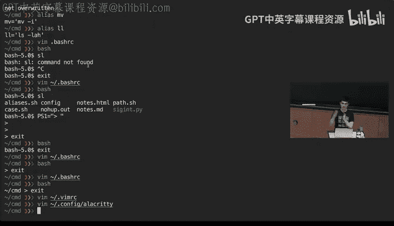
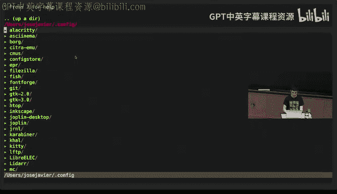
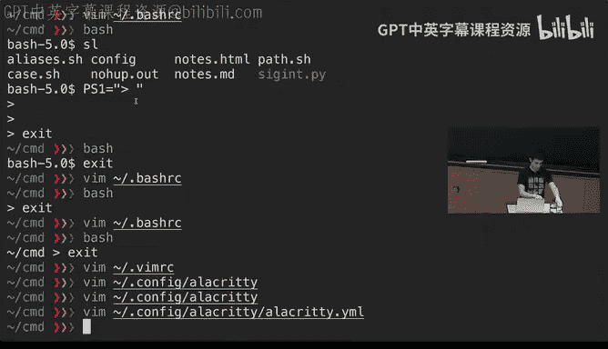
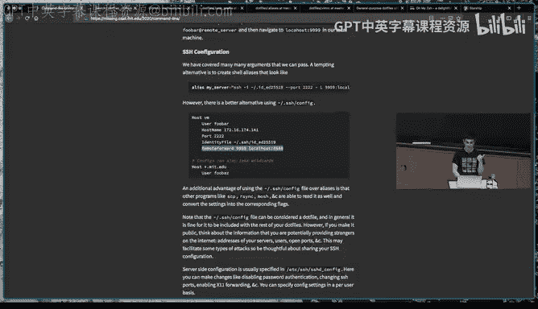
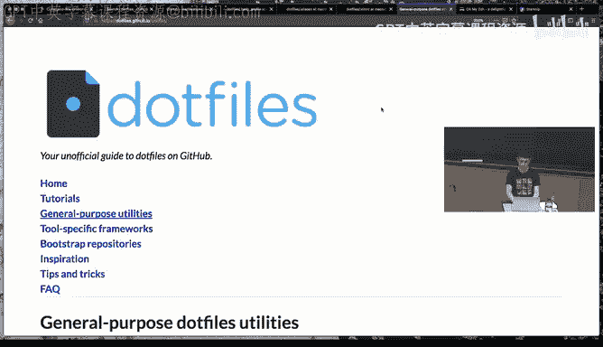
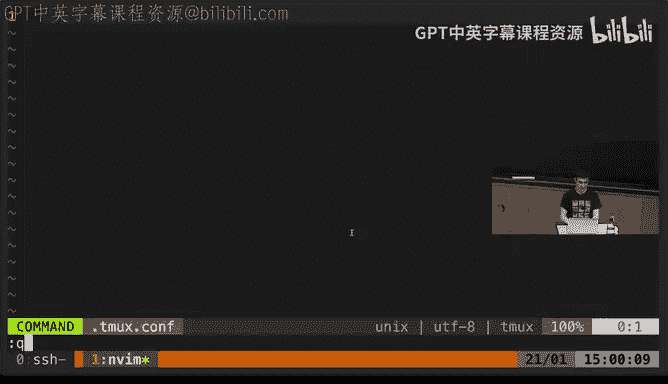

# 《计算机科学教育中遗漏的一学期｜The Missing Semester of Your CS Education 2020》中英字幕 - P5：-05-.Lecture 5_ Command-line Environment (2020).zh_en - GPT中英字幕课程资源 - BV1Y3yhBHEip

Okay， can everyone communicate？Okay， so welcome back I gonna address a couple of items in kind of the Mr。

 Tiia with kind of the end of the first week， we sent an email kind of noticing you that we have uploaded the videos for the first week so you can now find them online they have all these all the screen recordings for the things that we were doing so you can go back to them。

 look if you were kind of confused about we did something quick and again。

 feel free to ask us any questions if anything in the electronno is not clear。😊。

We also kind of send you a survey so you can give us feedback about what was not clear what items you would want to kind of a more thorough explanations or just any other item if you are kind of finding the exercises too hard to easily go into that URL and will kind of really appreciate kind of getting that feedback because that will kind of make the course better for the remaining lectures and for futuretus of the course。

With that out of the way， and we're going to try to upload the videos in a more kind of timely manner。

 like we don't want to kind of wait until the end of the week for that， so keep tuned for that。诶。

Our data out of the way。 And I'm gonna these lectures call common line environment。

 And we're going to cover a few different topics。 So the main topics we going。Cover。

 so you can keep track。 probably here。 Keep track of what I'm talking。 The first is going to be。

Gb control。The second one is going to be terminal multiplexors。

Then I'm gonna explain what dot files are and how to configure yourself。 And lastly。

 how to efficiently work with remote machines。So if things are not。Fully clear。

 kind of keep the structure there。 They all kind of interact in some way of how you use your terminal。

 but they are somewhat separate topics。 So keep that in mind。

So let's go with job control So far we have been using the cell in a very kind of monocom way like you execute a command and then the command executes and then you get some output and that's all about what you can do and if you want to use you want to run several things it's not clear how would you do it or if you want to stop the execution of a program。

 it's again like how do I know how to stop a program。

Let's okay this with a command called sleep sleep is a command that takes an argument and that argument is gonna be an inch or number and it will sleep。

 it will just kind of be there on the background for that many seconds so if we do something like sleep 20 this process is gonna be sleep for 20 seconds but we don't want to wait 20 seconds for the command to complete so what we can do is type C C by typing control C we can see that here the terminal kind of let us know in this one of the syntax that we cover in the editor's last beam lecture that we type C C and it stop the execution of the process。

What is actually going on here is that this this is using a unique communication mechanism called signals when we type control C。

😊，WhatWhat the terminal did for us， what the cell did for us is same。

A signal called signigin that stands for kind of signal interrupt that tells the problem to its stop itself。

And there are many， many， many signals of this kind， and if you do man signal。😊，And， yes， go。

Down a little bit here you have a list of them。 they all have like number identifiers。

 they have kind of a sortname， and you can find a description。So for example。

 the one I have described is here， number two， second。

 this is the signal that a terminal will send to a program when he wants to interrupt its execution。

A few more to kind of be familiar with is S this is again if you want you are from a terminal and you want to quit the execution of a a program which for most programs will do the same thing but we're going to showcase now program which will be different this is the signal that will be sent。

It can be confusing sometimes kind of looking at these signals。 For example， the sick term is。

In for most cases， equivalent to sit in and sick with。

 But theres is when it's not sent through a terminal。

A few more that we are going cover is Sap is when the just like a hang up in the terminal。

 So for example， when you're in your terminal， if you close your terminal and there are still still things running in the terminal that's the signal that the problem is going send to all the processes to tell that they should close like there was a hang up in the command line communication and they should close up。

Singles can do more things that they are like stopping like interacting programs and like asking them to finish。

 you can， for example， use the or is it， the six stop to post the execution of a program。

 and then you can use the sit con for continue to continue the execution of that program at a point layering time。

😊，Since all of this might be slightly to abstract， let's see a few examples。First， let's showcase。

Python program I'm going to kind of very quickly go through the program。

 This is a Python program and like most Python programs is importing this signal library。

And it's defining this handler here。 And this handler is writing。 oh， I got a second。

 but I'm not gonna stop here。And after that， we kind of tell Python in a way that we want this program when it gets a second to stop。

 And the rest of the program is a very silly program that is just going be printing numbers。 So lets。

 let's see this in action。😊，We do bycon。And it's counting。

 we try doing control say this sentence a second， but the program didn't actually stop。

 This is because we had a way in the program of dealing with this exception and we didn't want to kind of exit if we send a SQ which is done through control backlash here。

 we can see that since the program doesn't have a way of dealing with Set。

 it does the default operation which is kind of terminate the program。And like you could use this。

 for example， if your program， if someone controls your program and your program is supposed to do something like you maybe want to save the intermediate state of your program to a file so you can recover it from later。

 this is how you could write like a handle like this。So where do you type。

Can you repeat the question， sir？So。I first， so what I type is I type control C to try to stop it。

 but it didn't because seeking is captured by the program。 and then I type control backlash。

 which sends a s， which is like a different thing。And the signal is not captured by the program and it's also worth mentioning that theres a couple of signals that cannot be captured by itself like just a couple of signals。

 these are sick are sick and that cannot be captured like that will terminate the execution of the process no matter what and it can be sometimes harmful。

 do you want to be using by default because this can leave， for example。

 orpha orphan children processes like if a process has other like small children processes that is started and you sick。

 all of those will be keep will keep running in there but they won't have a parent and you can might have really good behavior going on。

Why what signal is given to the programming for you the say logo。If you log off。

 that will be so for example， if you're in an SS connection and you close the connection。

 that is the hang up signals like C Hap， which I'm gonna cover an examples or at least what will be sent up and you could write。

 for example， if you want the process to keep working even if you close that。

 you can write a wrap around that to ignore that signal。嗯。

Let's display what we could do with the stop and continue。 So， for example。

 we can start a really long process。 sleep 1000。 gonna take forever。 We can control C， control set。

 sorry， And if we do control set， we can see that the terminal and say， no， it's suspended。

And what this actually meant is that this process was sent a six stop signal and now is still there if you could continuous execution。

 but right now it's completely stop and it's in the background。And。We can land a different program。

If when we try to run this program， please notice that I have included an numbers at the end。

 This tells us that I want this program to start running in the background This is kind of related to all this concepts of running programs in the cell but background it and what is's gonna happen is the program is going start but it's not gonna take over my prompt like if I just run this command without this I could not do anything like I will not have access to the prompt until the command either finished or I ended it abruptly but if I do this it's saying oh like there's a new process which is this is the process and number and we can ignore this from now。

And if I type the command jobs， I get the Apple that I have a suspended job that is the sleep thousand job。

 and then I have another running job which is the Noha sleep 2000。

Say I want to continue the first job like the first job is suspended， but it's not executing anymore。

 I can continue that doing BG percentage one。That percentage is referring to the fact that I want to refer to this specific。

Process， and now if I do that。And I look at the jobs。 now this job is running again。

 now both of them are running。If I wanted to stop this job。

 I can use the kill command the kill command you kind of my thing is for kind of killing jobs。

 which is just like stopping them in kind of intuitively。

 but actually it's really useful like the kill command just allows you to send any sort of unique signal So here for example。

 instead of killing it completely we just send a stop signal here I'm going send a stop signal which is going pause the process again。

And now I still have to includeentifier because without the idifier。

 the cell wouldn't know whether to stop the first one or the second one。

Let's say this has been suspended because there was a signal sent。If I do jobs again。

 we can see that the second one is running and the first one has been a stopped。

goinging back to one of the questions was what happens when you close the cell， for example， and。

 why sometimes people will say that you should use this no8op command before you run jobs in a remote session？

This is because if we try to send a hand up a command to the first job。Is it going to。

In the similar fashion as the other signals is going to hang it up。And doesn going to determine job。

And the first job isn't there anymore， whereas we have still the second job running。However。

 we tried to send the signal to the second job， which will happen if we close our terminal right now。

It is still running。 Like no have what its doing is kind of encapsulating your whatever command you're executing and ignoring whatever you get like a signal。

 like a hang up signal and just ignoring that so it can keep running。诶。

And if we send the kill signal to the second job， that one can be ignored and that will kill the job no matter what。

 and we don't have any jobs anymore。Kin of complete the section on job control。 Any questions so far。

 me anything that was in kind of。Fully clear。What does BG do？So BG。

 like there are two command whenever you have a command that has been backgrounded and it is stopped。

 you can use BG sorry for background to continue that process running on the background that's equivalent of just kind of sending it a continuous signal so it keeps running and then there's another one which is called FG if you want to kind of recover it to the foreground and you want to reattach your standard output。

Okay， good jobs are useful and in general， I think the kind of knowing about signals can be really beneficial when dealing with some part of Unix。

 but most of the time， what you actually want to do is something along the lines of having your editor in one side and then the program in another and maybe monitoring what the resource consumption is in ourta。

 We could achieve this using probably what have seen a lot of time。

 which is just opening more windows， we can keep opening terminal windows。

 But the fact is therere kind of more convenient solution to this。

 And this is what a terminal multiplexer does。 a terminal multiplexer likeox will let you create different workspaces that you can work in and quickly has like a huge variety of functionality will let you rearrange the environment and it will let you have different sessions。

 There's another。Moreral all command， which is called screen that might be more readily available。

 But I think the concepts kind of extrapolate to both。 We recommend teamms that you go and learn it。

 And in fact， we have exercise in it。 I'm gonna kind of showcase the functionary right now。

 So whenever I told oh， let me make a quick note， there are kind of three core concepts in teamms。

 then I'm gonna go through。 And the main idea is that there are what it's called。Sessions。Zions have。

Windows。And windows have pains。As it's going to be kind of useful to keep this hierarchy in mind。

 you can pretty much equate Windows to what tabs are in other editors and other like for example。

 your web browser， I'm going to go through features mainly what can you do at the different levels。

So first， when we do Tms that starts a session and here now seems like nothing change。

 but what's happening right now is where within a cell that's different from the one we started before so or cell started out process that is Tmx and that TOx started a different process which is the cell we're currently and the nice thing about this is that that Tm process is separate from the renal cell process。

So。Here， we can a。The things we can do L S minuslay， for example， to list what is going on in here。

 and then we can start running our program and we will start running in there and we can do control A D。

 for example， to det me。Again， anyone。St casting。Yeah。To detach from the session。

And if we do teamm a， those are gonna reatt us to the session。 So the process。

 we abandon a process kind of counting numbers。 This is like really silly Python program that was just counting numbers。

 We like left it running there。 And if we teamm a， like the process is still running there。

 And we could close this entire terminal and open a new one。

 and we could still reattach because this teamm session is still running。Again， we can up name。

Before I go any further。Pretty much like unlike Bm， where they have like this notion of modes。

 timax will work in a more a maxy way， which is every common in like pretty much every common in tims or pretty much every common in tims。

 you could enter it through the have like command line that we could use。

 but I recommend you to get familiar with the key binding， it can be somehow anddo data first。

 But once you get used to them。えう。Ex this are gonna。Con when you get familiar with them。

 you will be much faster just using the key binding than using the commands。

 One note about the key binding， all the key binding have a form that is like you type a prefix and then some key。

So for example， to detaach， we do control A and then D， this means you press C D first。

 you release that and then press D to dtaach on default Tmax， the prefix is control B。

 but you will find that most people will have these from up to control A because it's much more ergonomic dipon on the keyboard you can find more about how to do these things and one of the exercises where you we will link you to the basics and how to do some kind of quality of life of modifications to Tmax。

Going back to the concept of sessionsessions， we can。Create like a new new session。

 just doing something like Teamms new and we can give a session's name so we can do like Teamook's new Fuber。

 and this is a completely different session that we have started。We can work here。

 we can detach from it。TOs Ls will tell us that they will have two different sessions。

 The first one is named0 because I even give it a name， and the second one is called4。

And it can attach the。Forer session。 And I can。And it it's really nice because having this。

 you can kind of work in completely different projects。 For example。

 having two different team of sessions and have different like editor sessions。

 different processes running。When you go through when you are within a session。

 we start with the concept of Windows here we have a single window。

 but we can use control A C for create to open a new window。And here。

 nothing is executing what iss doing。 Teamms has opened a new cell for us。

We can start running another one of these programs here。And to quickly jump between between the tops。

 we can do control A and pre like P for previous， and that will go us to the previous window。

 control A next to go to the next window。You can also use the numbers。

 so if we start opening a lot of these tabs， we could use controlling one to specifically jump the to the。

A window that is number one。And lastly is pretty useful to know sometimes that you can rename and for example。

 here I'm executing this Python process， but that might not be really informative and I maybe want to have something like execution or something like that。

And that will rename the name of that window。 so you can have this very neatly organized。

 This still doesn't solve the need when you want to have two things at the same time in your terminal。

 like in in the same display。 this is what panes are for。

 right now here we have a window with a single pane。

 all the windows that we have open so far have a single pane。 But if we do。诶工。诶。

Double quotes this will split the current display into two different panes so you see like the one we open below is a different cell from the one we have above and we can run any process that we want here。

 we can keep a split in this， if we do control a percentage that will split vertically。

And you you can kind of rearrange these tabs using a lot of different commands。

 one that I find is very useful when you are starting and it's kind of restraining rearraning them before I explain that to move through the panes。

 which is something you want to be doing all the time， you just do controlt A and the arrows。

And I will let you quickly kind of navigate。Through the。Different windows and。Execute again。

 like I'm doing a lot of less minus say I don't have I I do H stop that will explain in the。

In the bargain and profiling lecture。And we can just navigate through them again。

 like to rearrange this another slew of commands， you will go through some in the exercises。

 Control a space is pretty because you will kind of a space the current ones。

 I'll let you through different layouts。Some of them are too small for my current terminal convict。

 but that covers I think， like most of the， oh， theres some so。Here， for example。

 this beam execution that we have started is too small for what the current TmX pane is。

 so one of the things that really is much more convenient to doing TOs in contrast to having multiple terminal windows is that you can zoom into this you can ask by doing control C set for Zoom will expand the entire pane to take over all the space and then control set again will go back to it。

诶。Any questions for terminal multiplexers or like TOs concretely？Running all of the same thing。

17 like it。I it really just doing it all the same so Yeah isn like it wouldn't be any different from having two terminal windows opening your computer like both of them are going to be running of course like when it gets to the CPU。

 this is going to be multiplex again。Like there's like a time sharingring mechanism going there。

 but there' is no different。 like Dmox is just making this much more convenient to use by giving you this kind of visuals layout that you can quickly manipulate through。

And one of the main advantages will come when we reach the remote machines because you can leave one of these we can det from one of these team accessions。

 close the connection， and even if we close the connection and the terminal is going to send a hang up signal。

 that's not going to close all the team accession that has been started。Any other questions。And。

Let me save all。The Guter。So。Now we're going to move into the topic of dot filess and in general how to kind of configure yourself to do the things you want to do and mainly how to do them quicker and in a more convenient way。

I'm going to motivate this using aliases first， so what an alias is is that by now you might be starting to do something like all a lot of the time I just want to L a directory and I want to display all the contents in the list format and in a human readable thing。

And it's fine like it's not the long of a command， but you start building longer。

 and longer commands， it can become kind of bothersome having to retype them again and again。

This is one of the reasons why aliases are useful。 Alias is a command that will。

CanBe built in in your soul。 And the what it will do is it will remap a source sequence of characters to a longer sequence。

 So if I do， for example， here， alias L L equals。L S minus L8。What this， if I execute this command。

 this is going to call the alias command with this argument。

 and the As is going to update the environment in my cell to be aware of of this map。 So if I now do。

L L。It's executing that command without me having to type the entire command。

They can be really handy for very many reasons。 One thing to note before I go any further is that。

Here， Alias is not anything special compared to other command。 It's just taking a single argument。

 and there is no space around these equals。 and that's because Alias takes a single argument。

And if you try doing。Something like this that's giving it more than one argument and does no want work because that's not the format it expects。

So other use cases that work for easees， as I was saying。For some things。

 it might be much more convenient。One of my favorite is Git status。 It's extremely long。

 I I don't like typing the long of a command every so often because you typing lot of the time。

 so GS will replace for doing the Git status。You can also use them to alias things that you've missed type of。

 so you can do Sl equal S。 That will work。え。Other。Useful mappings。 you might want to read。

 you might want to alias a command to itself， but with a default fl。

So here what is going on is I'm creating an alias， which is an alias for the move command。

 which is M V。 and I'm alias into the same command， but adding the minus i flag。😊。

And this minus I flag， if you go through the main page and look at it。

 it stands for interactive and will what it will do is it will prompt me before I do an upper right。

 So once I have executed this。😊，I can do something like， oh。

 I want to move aliases into case by default， move 1 ask。 And if case existist。

 it will be oh that's fine。 I'm gonna override whatever that's there。

 But here is gonna is now expanded。 move has been expanded into this move minus I。

 and is using that to ask me oh are you sure you want to override this。And I can say， no。

 I don't want to lose that file。Lastly， you can use Alias Mo to ask for what this Alias stands for。

 so like it will tell you so you can quickly make sure that what the command that you are actually executing is。

One convenient part about for example， having ISlysis is how would you go about persisting them into your current environment。

 like if I were to close this terminal now， all these cells would go away and you don't want to be kind of retyping these commands and more generally if you start configuring yourself more and more。

 you want some way of bootstrapping all these configuration。You will find that most。

Sell programs will use some sort of。A text based configuration file。

 and this is what we usually call dot files because they start with a dot for historical reasons。

So for bass in our case， which is。As cell， we can look at the B R C。

And for demonstration purposes here， I have been using seas， which is a different cell。

 and I'm going to be confused em bassss and I start the em basss。😊，So， if I。

Create an entry here and I say， oh， cell maps to S。

And I have modified that and now I start bus B is kind of completely unconfigured。

 but now if I do a cell。That's an expert。Is not in your hunger？Oh， good， good。So。

It matters where your config file is and your config file needs to be in your home folder。

 so your the confusing file for bus will live in Da Tli。

 which will expand to your home directory and then buser。And here we can create the alias。

And now we start a bass session and we do a cell now has been loaded。

 and this is telling like it's loaded at the beginning when this bass program is started。

 and all this configuration is loaded and you can not only use a list。

 You can have a lot of parts of configuration。 So for example， here， I have a prompt。

 which is fairly useless。 Like it has just given me the name of the cell， which is bass。

 and like the version which is50 have I don't want this to be displayed。 as with many things in your。

 this is just an environment variable。 So the P1 is just what is the prompt string for your prompt。

 and we can actually modify this to just be。😊，Rdiator than symbol。

And now that have been modified and we have that。 but if we exit and call bus again。

 that was lost or if we add this entry and say， oh， we want P1。To be。This。And we call bus again。

 this has been persistent。And we can keep modifying this configuration。

 So maybe we want to include where the。Working directory that we are is in。

And that's telling us the same information that we had in the others。 And there are many。

 many options like like cells are highly， highly configurable and。

The is not only cells that are configurationd through these files。There are many other programs。

 as we saw for example， in the editor lecture， beam is also configure this way。

 we gave you this BmarRC file and told you to put it in your under home dot。B Mar C。

 and this is the same concept， but just for BM it's just giving it a set of instructions that it should load when its started so you can keep a configuration that you want。

And even non kind of like a lot of programs will support this。 For instance， my terminal emulator。

 which is another concept， which is the program that is running the cell in a way and displaying this into the screen in my computer。

Can also be configured this way。If I modify this， I can。

I can change this size of the font like right now， for example， I have increased the font size a lot。

 So for demonstration purposes， but if I change this entryry and make it， for example。

28 and write this value， you see that the size of the phone has changed because I edited this text file that specifies how my terminal emulator will work。

嗯。

Any questions so far with dot files？ it can be be daunting kind of knowing that there is like this endless world of configurations。

 and how do you go about learning about what can be configured。

The good news is that a， we have linked you like to really good resources in the lecture nodes。

 but the main idea is that a lot of people really like just con these tools and have uploaded the configuration files to Github and other different kind of repositories online。

 So for example， here we are on Github we search for do files and can see that there are like thousands of like repositories of people sharing their configuration files。

 We have also like the class instructors have linked or dot files of you really want to know how any part of our setup is working。

 you can go through it and try to figure out。 you can also feel free to ask us。😊。

If we go， for example， to this repository here， we can see that theres many。

 many files that you can configure， for example there is one for bass， first example。

 one for Git that will probably be covered in the burst control lecture tomorrow， if we go。

 for example， to the Ba profile， which is a different form of what we saw in the Ba RRC。

It can be really useful because you can learn through doing just looking at the manual page。

 but the manual pages in a lot of the time are just kind of like a descriptive explanation of all the different options and sometimes it's more helpful going through examples of what people have done and trying to understand why they did it and how is helping their workflow and we can say here that this person has done case in gling we covered glowin as this kind of phum expansion trick the cell scripting on tools and here say。

 no， I don't want this to be kind of married whether I've using uppercase and lowercase and just setting this option in the cell for these things to work this way。

Similarly， there is， for example， aliases here you can see a lot of aliases that this person is doing。

 example D for C D， because that's like for Dbox sorry for for because that's just much shorter D for gate。

Sa well go， for example， with B Mercy， it can be actually very。

 very informative going through this and trying to extract useful information We do not recommend just kind of getting one huge blob of this and copying this into your config files。

Because maybe things are prettier， but you might not really understand what is going on。嗯。Lastly。

 one thing I want to mention about dot files is that。

People not only try to push these files into GiHub， Yeah so other people can read it。

 That's one reason they also make really sure they can kind of reproduce their setup。And to do that。

 they use a s of different tools。 Oops went a little too far there here。 So genius to is。

 for example， one of them。 and the trick that they are doing is they are kind of putting all their dot files in a folder and they are kind of。

Fak into the system using a tool called Slink that they are actually where they are not。

 I'm going draw really quick what I mean by that。So a common folder structure might look like you have your home folderer。

 and in this home folderer， you might have your。Bus R C that contains your bus configuration。

 you might have your Bmer C。And it would be really great if you could keep this under burst control。

😊，But the thing is you might not want to have a git repository which will be covered tomorrow in your home folder。

 so what people usually do is they create at files repository。

And then they have entries here for their。Bs or c， and then Bmar c。

And this is where the actually like the files are， what they' are doing is they're just telling the OS to forward word kind of like whenever anyone wants to read this file or write to this file。

 just forward this to this other file。This is a concept called slinks。

And its useful in this scenario， but it in general it's a really useful tool in Uniix that we kind haven't uncover so far in the lectures but you might be that you should be familiar with and general the syntax will be a n minus S for specifying as symboling link and then you will put the path to the file and you want to create and then the same link that you want to create。

And all these kind of fancy tools that we're seeing here listed they all amount to do in some sort of this trick so that you can have all your dot files neat and tidy into a folder and then they can be person control and then they can be s so the rest of the programs can find them in their default locations。

诶。Any questions regarding those files？To use sibling you need to have the do bottle。な本当 there。

And also got files。I'm version control folderer。So what you will have is。Pretty much every program。

 for example， bass。Will always look for home bus or seat。 That's like where the， where the。

 the program is gonna look for。What you do when you do assembling is you place like your home dot bus or C is just a file that is kind of a special file in Uni that says。

 oh， whenever you want to read this file， go to this other file。

And there is no content like there is no like your aliaSes are not part of this file。

 that file is just kind of like a pointer saying no。

 you should go that other way and by doing that you can have your other file in that other folder if in person controlling is not useful。

 think about if you want to have them in your dropbox folder so like there are sync to the cloud。

 for example， that's kind of another use case where like siblings could be really useful。

So if you don't need the folder ir。F in the home。Because you can just use this simple。

As long you have a way for the default path to resolve wherever you have it。And。

Last thing I want to cover in the lecture， oh sorry， any other questions about dot files？

Last thing I want to cover in the lecture is working with remote machines。

 which is a thing that you will run earlier like sooner or later。

 and those are a few things that will make your life much teacher when dealing with remote machines you know about it and right now maybe because you're using the Athena cluster。

 but like later on your primary exposure that there is a fairly wquious concept of having your kind of local working environment and then having some production server that is actually running the。

Ct is really good to get familiar about how to work in with remote machines。

So the main command for working with remote machines。Is SS8。Is where is S S H。

 S H is just like a secure soul is just gonna take the responsibility for kind of reaching whatever we want we tell it to go and trying to kind of open a session there。

 So here the syntax is。JJGO is the user that I want to use in the remote machine。

 this is because the user is different from the1 I have in my local machine， which。

Will be like a lot of the time。 Then the ad is telling the terminal that this is separates what the user is from what the address is。

 here I'm using an I address because what I'm actually doing is I have a virtual machine in。

My computer that is the one that is remote right now and I'm going be SS into it。

 this is the URL that I'm using， sorry the AP that I'm using， but you might also see things like oh。

 I want to SSA the Fuber MIT that you you that's probably something more common if you're using some remote server that has a DNS name。

So going back to a regular command。We try to SSA， ask us for a password。

 really common thing and now we're there we have we are still in our same terminal emulator。

 but right now SSA is kind of forwarding the entire virtual display to display what the remote cell is display and we can execute commands here。

And we'll see the remote files。A couple of handy things to know about SS that were briefly covered in the data wrangling lecture is that SSH is not only good for。

Just opening connections。 It will also let you just execute commands remotely。 So for example。

 if I do that， it's going。As me， wheres my password again and is executing this command。

 then coming back to my terminal and piping the output of what the command was in the remote machine through the standard output in my current cell and I could have this。

In。You could have this in a pipe。嗯。This will work and we'll just grab all this output and then have a local pipe where I can keyboard working。

So far， it has been kind of unconvenient having to type our passwords。

There's one really good trick for this is we can use thing called SSH keys。

 SSH keys just uses a public key encryption to create like a pair of SSH keys。

 a public key and a private key， and then you can give the server the public part of the key so that you copy the public key and then whenever you try to authenticate instead of using your password is gonna to use the private key to prove to the server that youre actually who you say you are。

诶。We're going to we can。Quickly， so guys， how will you。

Go about doing this right now I don't have any SSH keys， so I'm going to create a couple of them。

First then he's just going to ask me where I want this key to live。As surprisingly， it doing this。

 This is my home folderer， and then it's using this dot SS path。

 which refers back to the same concept that we cover earlier about having dot files。

 like dot S H is a folder that contains a lot of the configuration files for how you want SSH to behave。

So it will ask us a passphse， the pass phrase is to encrypt the private part of the key because if someone gets your private key。

 if you don't have a password protected private key， if they get that key。

 they can use that key to impersonate you in any server， whereas if you add a passphse。

 they will have to know what the press phrase is to actually use the key。And as created a keeper。

 we can check that these two files are now。And there is a。 And we can see。Just more fuck this。

And we have these two files。 have the。2，5，5，1，9 and the pull key。 And if we cut through the output。

 that key actually is not like any fancy binary file。

It is a text file that has the contents of the public key and some alias name for it so we can like know what this Pu key is and the way we can tell the server that were authorized to SSHs there is just actually copying this file like copying this string into a file that is SSH authorized host。

So。If we hear what I'm doing is I'm。Cutting the output of this file。

 which is just this line of text that we want to copy。

 and I'm piping that into SSA and then remotely and asking T。

To dump the contents of the standard input into SS those authorized keys。And if we do that。

 obviously， it's going to。Ask us for a password。And it was copied。

 And now we can check that if we try。2 SSH again。It's going to first ask us for passphse。

 but you can arrange that so that's saved in the session and we didn't actually have to type the key for the server and I can kind of saw that again。

Why is not saying。诶。More things are is useful。 Oh， we can do if。

 if that command seem like a little bit junkie， you can actually use this a command that is built for this。

 So you don't have to kind of craft this SS H T command that is just called SS H copy E D。And。

We can do the same and is' gonna copy the key。 And now， if we try。To SS。

 we can assess it without actually typing any key at all。Or any password。

More things we will probably want to copy files。 You cannot use C。

 but you can use SP for kind of like SSH copy。 and here we can specify that we want to copy this local file called notes and the syntax is kind of similar。

 We want to copy it to this remote and then we have a semicolon to separate what the path is gonna be and then we have oh we want to copy this notes。

 but we could also copy this as。4。And if we do that is。

Has been executed and is' telling us that all all the contents have been copied there。

 If you're gonna be copying a lot of files， there is a bare command that you should be using。

 there is called arsnc。 example here guess specifying these three flags I'm telling arsnc to of preserve all the permissions whenever possible to try to check if the file has already been copied。

 for example， SP will try to copy files that are already there。 This will happen， for example。

 if you are trying to copy and the connection interacts in the middle of it SP will start from the very beginning trying to copy every file whereas ars sync will continue from where it started and here。

We asked it for to copy the entire folderer。And he's just really quickly copied the entire folder。

One of the other things to know about SS H is that the equivalent of the dot file for SS H is the SS H config。

 So if we added the。SS it's config to be。I have to copy rank。

Its If I edit the dot SH config to look something like this instead of having to every time type SSH JJ go or like having this real long string so I can like refer to this specific remote I want to refer with the specific username。

 I can have something here， like say， oh this is the username。

 this is the host name that this host is referring to and you should use this identity file。

And if I copy this， this is right now in my local folder， I can copy this into SSs。Now。

 instead of having to do this really long comment， I can just say， oh。

 I just want to SS into the host called BM。And by doing that。

 it's grabbing all that configuration from the SSH confiit and applying it here。

And this solution is much better than something like green and alias for SS8。

 because other programs like SCP and ArrsI also know about the dot files for SS8 and we'll use them whenever they are there。

Last thing I want to cover about remote machines is that here， for example。

 we also have Tmax and we can。Like I was saying before， we can start editing Z file。And。아 got。

And we can start running Sunjob。아。Of course。And。and for something like eight stop。

 and this is running here。 we can de that from it。Close the connection。And then SSAs back。

 And then if you do team Mo A， everything is as you left。 like nothing has really changed。

 And like if you have things executing there in the background， they will keep executing。

I think that prettymat ends。 all I had to say。For these tool。

Any questions related to remote machines。How do you deal with how they get you flex？昨のこから。今まさんで。

That's a really good question。 So what I do for that and I can。Oh yes， sorry。 So the question is。

 how do you deal with trying to use TOs in your local machine and also trying to use TOs into the remote machine。

There are a couple of tricks for dealing with that。 The first one is changing the prefix。

 So what I do， for example， is in my local machine， the prefix。

 I have changed from control B to control A。 And then in the remote machines。

 this is still control B。 So I can kind of swapwab between like if I want to do things to the local team marks。

 I will do control A。 And if I want to do things to the remote team marks， I would do control B and。

Another goodAnother thing that I did you can have separate cons so I can do something like this。

And then。Breathe up。Because I don't have my， I don't have my S content Yeah。 but if you。

 I can just H PMM。Here， what you see the difference between these two bars， for example。

 is because the T maxax config is different。EAs you will see in the exercises。

 the the max configuration is in。デドtティマ dot com。I don't know。 that has an NCDA。

And teamax dot com。 And here you can do a lot of things like changing the color depending on the host you are so you can get like quick visual feedback about where you are like if you have a nested session。

 Also Taxax will if you're in the same host and you try to Tax within a teamax session it will kind of prevent you from doing it so you don't run into issues。

Any other questions related to kind of all the topics we have covered。

Another answer to that question is also if you type the prefix twice。

 it sends it once to the underlying shell。So the local binding is control A and the the remote binding is control A。

 you could type control A control A， and then D， for example， detached from lu。Okay。

 I think that ends the class for today。 There's a bunch of exercises related to all these main topics。

 We're going be holding office hours today， too， so feel free to come and ask us any questions。

