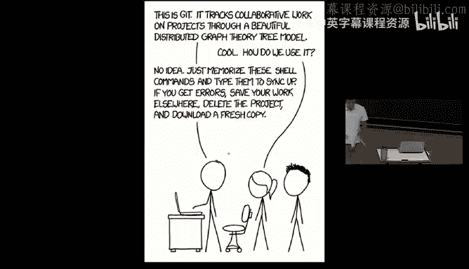
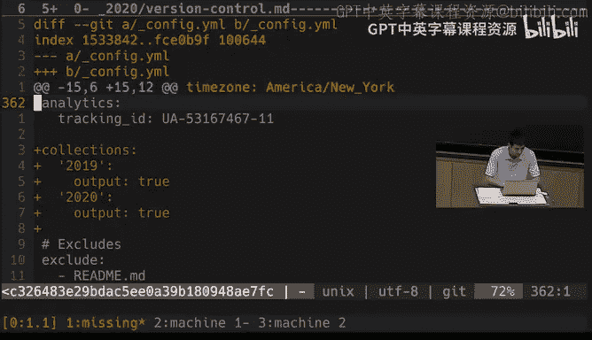

# 版本控制（Git）：06：Git 版本控制系统教程



## 概述
在本节课中，我们将要学习版本控制系统，特别是 Git。我们将从 Git 的数据模型和内部原理开始，理解其如何跟踪文件和文件夹的变化，然后学习如何使用 Git 命令行工具进行实际操作。通过理解其底层设计，你将能够更有效地使用 Git，而不仅仅是记住一些命令。

## 版本控制系统简介
版本控制系统是用于跟踪源代码或其他文件集合变化的工具。它们帮助记录文档的历史变更，并促进团队协作。这些工具通过一系列快照来跟踪文件夹及其内容的变化，每个快照都封装了某个顶级目录下的所有文件和文件夹。

上一节我们介绍了版本控制的基本概念，本节中我们来看看 Git 的具体数据模型。

## Git 的数据模型
Git 将历史建模为一个有向无环图。每个快照（在 Git 中称为提交）都有一组父提交，用于表示变更的先后顺序。这种模型允许分支和合并操作，使得可以在不同的开发线上并行工作。

### 文件和文件夹的表示
在 Git 中，文件和文件夹被表示为以下对象：
*   **Blob**：代表一个文件，本质上是一个字节数组。
    ```python
    blob = array<byte>
    ```
*   **Tree**：代表一个文件夹，是文件名或目录名到其内容的映射。内容可以是另一个 Tree（子树）或一个 Blob（文件）。
    ```python
    tree = map<string, tree | blob>
    ```
*   **Commit**：代表一个历史快照。它包含父提交（数组）、作者、消息等元数据，以及一个指向顶级 Tree 的指针，该 Tree 代表了该提交时刻的项目状态。
    ```python
    commit = struct {
        parents: array<commit>
        author: string
        message: string
        snapshot: tree
    }
    ```

### 对象与引用
Git 将所有对象（Blob、Tree、Commit）统一存储在**内容寻址存储**中。每个对象的键是其内容的 SHA-1 哈希值。
```python
objects = map<string, object>

def store(object):
    id = sha1(object)
    objects[id] = object

def load(id):
    return objects[id]
```
这些哈希值是长字符串，对人类不友好。因此，Git 使用**引用**（References）来为图中的特定节点提供人类可读的名称。引用是一个从字符串（如分支名）到哈希值的可变映射。
```python
references = map<string, string>
```
例如，`master` 和 `HEAD` 就是常见的引用。

## 基本 Git 命令
理解了数据模型后，我们来看看 Git 命令如何操作这个图结构。

### 初始化与首次提交
首先，我们需要初始化一个 Git 仓库并创建第一个提交。

以下是创建初始提交的步骤：
1.  `git init`：初始化一个新的 Git 仓库。
2.  `git add <file>`：将文件更改添加到暂存区，准备包含在下一次提交中。
3.  `git commit`：创建一个新的提交（快照），将暂存区的内容永久保存到历史中。

### 查看历史与状态
要了解仓库的当前状态和历史，可以使用以下命令：
*   `git status`：查看工作目录和暂存区的状态。
*   `git log`：以线性方式显示提交历史。使用 `git log --all --graph --decorate` 可以图形化显示分支和合并历史。
*   `git diff`：显示工作目录与上次提交（或指定提交）之间的差异。

### 移动与恢复
`git checkout` 命令用途广泛：
*   `git checkout <commit-hash>`：将工作目录的内容恢复到指定提交的状态。这会移动 `HEAD` 引用。
*   `git checkout <branch-name>`：切换到指定分支。
*   `git checkout -- <file>`：丢弃指定文件在工作目录中的修改，将其恢复为 `HEAD` 所指向提交中的状态。

## 分支与合并
Git 的核心优势在于其强大的分支和合并功能，允许并行开发。

### 创建与切换分支
*   `git branch <branch-name>`：创建一个指向当前 `HEAD` 的新分支（引用）。
*   `git checkout -b <branch-name>`：创建并立即切换到新分支（等价于上述两个命令）。

### 合并分支
`git merge <branch-name>` 用于将指定分支的更改合并到当前分支。
1.  **快进合并**：如果目标分支是当前分支的直接祖先，Git 只需将当前分支指针向前移动。
2.  **三方合并**：如果分支已经分叉，Git 会创建一个新的“合并提交”，该提交有两个父提交。如果 Git 无法自动解决冲突，会产生**合并冲突**，需要手动解决。

解决合并冲突后，使用 `git add` 标记冲突已解决，然后使用 `git merge --continue` 完成合并。

## 远程协作
Git 支持分布式协作。你可以拥有仓库的远程副本（例如在 GitHub 上），并与他人同步更改。

### 远程仓库基础
*   `git remote add <name> <url>`：添加一个远程仓库，并为其命名（通常叫 `origin`）。
*   `git push <remote> <local-branch>:<remote-branch>`：将本地分支的更改推送到远程仓库的指定分支。使用 `git push -u origin master` 可以设置上游分支，之后只需 `git push`。
*   `git fetch <remote>`：从远程仓库获取所有最新信息（如下载新的提交和分支），但**不改变**你本地的任何工作文件或分支。它更新的是远程跟踪分支（如 `origin/master`）。
*   `git pull`：相当于 `git fetch` 后接 `git merge`，用于获取远程更改并合并到当前分支。
*   `git clone <url>`：克隆（下载）一个远程仓库到本地。

## 高级功能与配置
Git 功能丰富，以下是一些有用的高级主题：

### 实用命令与配置
*   `git config`：配置 Git 行为，如用户信息、别名、颜色输出等。配置存储在 `~/.gitconfig` 文件中。
*   `git add -p`：交互式暂存，允许你选择性地将文件的特定更改加入暂存区，非常适合提交前整理更改。
*   `git blame <file>`：显示指定文件的每一行最后一次是由谁在哪个提交中修改的。
*   `git stash`：临时保存工作目录的修改，以便清理工作区。之后可用 `git stash pop` 恢复。
*   `git bisect`：使用二分查找在历史提交中定位引入错误的提交，非常适合调试回归问题。

### 忽略文件
创建 `.gitignore` 文件来指定 Git 应忽略的文件模式（如编译产物、日志文件、系统文件等）。被忽略的文件不会出现在 `git status` 中，也不会被意外提交。

### 工具集成
*   **图形化客户端**：如 GitKraken、Sourcetree，提供可视化界面。
*   **Shell 集成**：在 Shell 提示符中显示 Git 仓库状态（当前分支、是否有修改等）。
*   **编辑器集成**：许多编辑器（如 VSCode、Vim）有插件支持直接在编辑器内执行 Git 操作、查看 `git blame` 信息等。



## 总结
本节课中我们一起学习了 Git 版本控制系统。我们从其优雅的数据模型（对象、引用、有向无环图）开始，理解了其内部如何表示历史和文件。然后，我们学习了核心命令，包括提交、查看历史、分支、合并以及与远程仓库协作。最后，我们概述了一些高级功能和配置选项。记住，理解底层模型是掌握 Git 接口的关键。要深入学习，推荐阅读《Pro Git》一书并完成课程提供的练习。