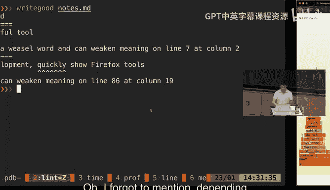
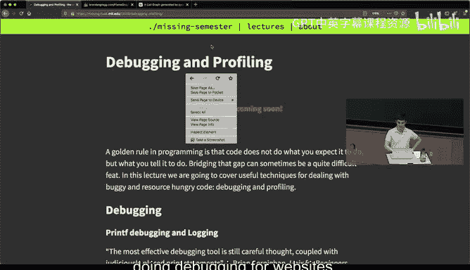
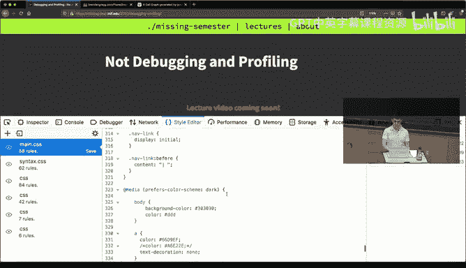
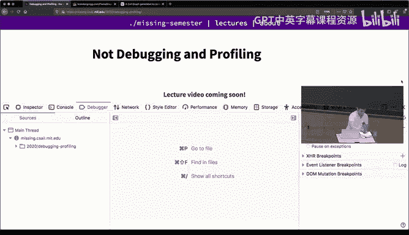
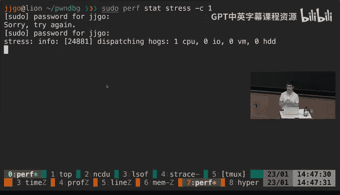
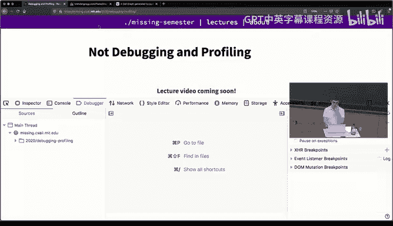
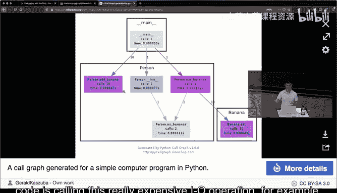
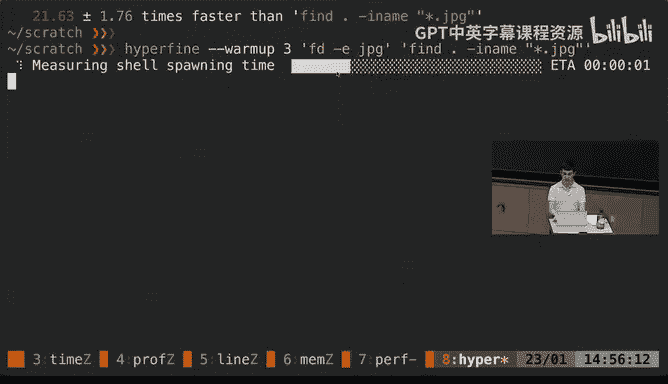

# 《计算机科学教育中遗漏的一学期｜The Missing Semester of Your CS Education 2020》中英字幕 - P7：-07-.Lecture 7_ Debugging and Profiling (2020).zh_en - GPT中英字幕课程资源 - BV1Y3yhBHEip

That's all right。 So welcome back today， we're gonna cover the debugging and profiling。

 Before I get into it， we're gonna kind of make another reminder to fill in the survey。

 just one of the main things we want to get from you is questions because the last days gonna be questions from you guys about like things with that we haven't covered that like you want us to kind of talk more in depth and the more questions we get then the more interesting we can make those section。

 so please go on and fill in sure。😊，And so today's lecture is gonna be a lot of topics。

 The all the topics revolve around the concept of what do you do when you have a program that has some bugs。

 which is most of the time， like when you're programming。

 you're kind of thinking hard about how you implement something。

 and there's like a half life or like fixing all the issues that like program has。

 And even if your program behaves like you want， it might be that it really slow or like it's taking a lot of resources in the process。

 So today， we're gonna see a lot of different approaches of dealing with this problems。So first。

 the first section is on thebugging。 thebu can be done in many different ways。

 Theyre all kind of like the most simple approach that like prettymat like C students will go through will be just you have some code and it's not beh like you want。

 So you probe the code but like adding print statements。

 And this is called print debugging and it works pretty well have to be honest。

 like I use it a lot of the time because how kind of simple to set up and how quick the feedback can be one of these is with like print debugging is that you can get a lot of output and maybe you don't get you don't want to get as much output as you're getting。

 and like people have slightly more complex ways of doing print debugging and。Great。I mean， this。

There we go。 And one of these ways is kind of what is usually referred to logging。

 So the the advantage of doing logging versus doing print F debugging is that when you're creating logs。

 you are not necessarily creating the logs because there's like a specific issue you want to fix is mostly because you have built a more complex software system and you want to log when some events happen。

And one of the core advantages of using a login library is that you can define severity levels and you can filter based on those。

 lets let's see an example of how can we do something like that。 So yeah， everything fits here。

 This is really silly example we're just gonna sample random numbers and depending on the value of the number that we can interpret as a kind of how wrong things are going。

 We're gonna log the value of the number and then we can see what is going and。Take the N2。

Disable these providersrs。And if we were just to execute the code as it is。

 we just get the output and we just keep getting more and more output。

 But like you can have to kind of stare at it and make sense of what is going on。

 And we don't know what is the relative timing between print apps。

 we don't really know whether this is just an information message of like a message of whether something went wrong。

 And if we just go in。And， and do not that one。Many one。I want to undo that one。

 We can set that format。And now the output looks something more like this。 So， for example。

 if you have several different modules that you're programming with。

 you can identify them with like different levels here。 We have we have debug levels。

 We have critical info different levels。 And it might be handy because here。

 we might only care about the error messages。 like those are like we have been working on our code so far so good。

 And suddenly we we get some error。 We can log that to identify where it's happening。

 But maybe it's a lot of information messages。 But we can deal with that。

By just changing the level to error level。And。Now， if we run this again。

 we' are only going to get those errors in the output。

 and we can just look through those to make sense of what is going on。

Another really useful tool when you are dealing with logs is。

As you kind of look at this it has become easier because now we have kind of these critical and error labels that we can quickly identify。

 but since kind of humans are fairly visual creatures one thing that you can do is use colors from your terminal to identify these things so now changing the formatter。

 what I've done is kind of slightly change how the the output is formatted。😊。

And when I do that now whenever I get a warning message is color coded by yellow。

 whenever I get like an error like fade red， and when it's like critical how like a boldald red indicating something went wrong and here is like a really short output but when you start having like thousands and thousands of lines of law which is not unrealistic and happens every single day in a lot of appss。

😊，Kind of quickly browsing through them identifying what like thearrow like the red patches are can be really useful。

 A quick aside is you may be curious about how the terminal is displaying these colors Like at the end of the day。

 the terminal is only uping characters So how how are this like how is this program or like how are other programs like Ls that like has all these fancy colors。

 How are they telling to the terminal that is should use these different colors。

 This is nothing kind of extremely fancy。😊，What these tools are doing is doing something along these lines。

 Here we have。Come and I can clear the rest of the output so we can focus on this。

 There's some special characters， somescape characters here。 Then we have some text。

 and then we have some other special characters。 And if we execute this line。 We are like red。

 This is red。 and you might have pick up on the fact that we have a 2，5，500 here。

 And this is just telling the RGV values of the color we want in the terminal。

 And you premats can do this in any piece of code that you have。

 and that you can color code the output。 And your terminal is fairly fancy。

 supports a lot of different colors in the output。 This is not even all of them。

 this is like a 16 of them。 And I think it can be fairly useful to know about that。😊，诶。

Another thing is maybe you don't enjoy like the thing like logs are kind of really fit for you。

 The thing is a lot of other systems that you might start using will use logs。

 as you start building layer and layer systems， you might rely on other dependencies。

 Common dependencies may be web servers or databases is a really common one。

 And those will be logging their errors or like exceptions in their own logs。Of course。

 you will get some client side error， but those sometimes are not informative enough for you to figure out what is going on。

In most unique systems， the logs are usually placed under a fo core like s bar log。

 and if we list it， we can see there's like a bunch of logs in here。And so。Its scroll it a bit。

 So we have like the Saa monitor log， like some weekly logs， things related to the the wifi。

 for example and。If we are with the。System log， which is contains a lot of information about the system。

We can get information on what's going on。 Similarlyly。

 there are kind of tools that will let you more like sly go through this output。 But here。

 looking at the system log， I can look at this and say， oh。

 there's some service that is kind of existing with some abnormal code and based on that information I can go and try to figure out what's going on。

 like what's going wrong。诶。One thing to know when you're working with logs is that more traditionally kind of their own like every software had their own log。

 but has been increasingly more popular to have a unified system log where everything is placed and you can like pretty much any application can log into this system log but instead of being in a plain text format。

 it will be compressed in some special format an example of this was what we cover in the data running lecture they running lecture we were using the journal CDL。

 which is kind of accessing the log and outputing all that output。

Here in Mac now the command is log So which will display a lot of information I'm going to just display the last 10 seconds because logs are really。

 really robust。And just display in the last 10 seconds is is still gonna up with a fairly large amount of lines。

 So if we。Go back through what's going on。 We here see that like a lot of Apple things are going on since this is a MacBook and maybe we could find errors about like some system issue here again。

 they are fairlyables So you might want to practice your data wrangling。Teciques here。

 like 10 seconds equal to like 500th lines of logs。 So you can kind of。

Make an idea of how many per second you are getting。

 and they are not only useful for furing out some other programs。

 I'll put you they are also useful for you if you want to log there instead of into your own file。

 So using the logger command in both like uni and Linux and Mac。 you can say， okay。

 I'm gonna log this hello logs into into this like system log and we execute the command and then we can check by。

Going through the last minute of logs since it's going to be fairly recent and griping for our hello。

 and we find our entry， fairly recent entry that we has created that's say hello logs。And。

As you become。More and more familiar with these tools， you can。

Find yourself using the logs more and more often since even if you have like some baglar you haven't detected and the program has been running for a while。

 maybe the information that is already in the log can tell you enough to figure out what is going。

Howeverer Pri of thebu is not everything， so now I'm going to be covering thebuggers。

 but first any questions on log so far？So what kind of things can you figure out in a lot。

 like this hellello logs， it says that you did something with Ho at that time or yeah， like say。

 for example， I can write a bass script that like the text where like it checks every time what the Wi-fi network I'm connected to。

And every time it detect text that has changed， makes an entry in the logs and says like， oh。

 now like we have change Wifi networks。 And then you might one back and pass through the logs and take like。

 okay， when did my computer change from Wifi network to another。

 And this is just kind of like a simple example。 But there are many。

 many ways many types of information that you could be logging here。 more commonly。

 you would probably want to check like if your computer， for example， is entering sleep， for example。

 for some unknown reason。 like like sudden like hibernation mode。

 this probably some information in the logs about who ask that to happen。 or like。

 why is that happen。Any other questions？Okay， so when print of debugging is not enough。

 the best alternative after that is using。Exit that， and。ello。So he is using adibuggger。

 So adibuggger is kind of a tool that will wrap around your code and will let you run your code。

 but it will kind of keep control over it。 So it will let you kind of。

step like will let you step through the code and execute it and set breakpoint。

 and you probably have seen thebuggs in some way if you have ever used something like an ID because Is have this kind of fancy or set breakpoint here。

 execute。 But at the end of the day， what these tools are using is just this common line debuggs and they're just presenting them in a really kind of fancy format Here we have kind of a completely broken bubble sort。

Simple search algorithm， don't go around the details。

 but we just want to sort this array that we have here。And。We can try doing that， by just doing。拜送包。

And when we do that， say， oh， there's some index error list index out of frames。

 We gonna start adding print。 But as if we have like a real long string。

 we can get a lot of information。 So how about we go at to the moment that we crash。

 Like we can go to the moment and examine what the current state of the problem was。

 So for doing that， I'm gonna run。The program using the Python debugger here I'm using technically the i Python debugger just because it has nice color syntax。

 It's probably easier for both of us to understand what's going on in the output。

 but they are pretty much identical in any way。 So we execute this and now we are given a prompt。

 we are being told that we are here at the very first line of our program and we can L stands for list。

 So as with many of these tools。This kind of like a language of operations that you can do。

 and they are often like mnemonic， as it was the case with beamM or with Iax。

 So here L is for listing the code and we can see the entire code。S is for a step。

 and will let us kind of one line at a time go through the execution。

 The thing is we're only triggering the error some time later。So。We can restart start the program。

 And instead of starting to step until we get to the issue， we can just ask。

For the program to continue， which is the C command。 And hey， we， we reach the dish we， we。

We go to this line where everything crossed， we are getting this in this enlist index out of ranges。

 and now that we are here， we can sayhu， okay， first， let's print the value of the array。

So this is the value of the I by all array Okay， doesnt so we have six items。 Okay。

 what is the value of J here。So we look at the value of J J is5 here， which will be the last element。

 but j plus1 is going to be6 oh so that's true here in the out of bounds error。So what we can do。

 we will have to do is this n instead of n has to be n -1。 Like we。

 we have identified that the de lies there so we can quit， which is Q。Again。

 because as a postor than debuggger。And we go back to the code。And say， okay。

We need to append this and minus1。 Okay， that will prevent the least indexer of range。

And if we run this again， without the debugger。Okay， no errors now， but this is not or sorted list。

 This is sorted， but it's not list。 like we were missing entries from our list。

 So there is some behavioral issue that we are reaching here。Again。

 we could start using print of debugging， but kind of a huntun now that's probably the way we're swapping entries in the bubbles or program is wrong。

We can use the deography base。 We can go through the， to the moment we're doing a s。And。

Check how the swap is being performed。 So a quick or so we have a kind of two four loops。

 and in the most nested loop， we are taking if the array is larger than the other array thing is if we just try to execute until this line it's only going to trigger whenever we make a swap。

 So what we can do is we can set a break point in the six line。

 we can create a break point in this line。 and then。The program will execute。

 and the moment we try to swap our variables when the program is going to stop。

 so we create a break point there。And then we continue the execution of the program。

 and the program halt and say， hey， I have executed and I have reached this line。Now。

I can use locals， which is kind of a python function that returns you a dictionary with all the values to quickly see the entire context。

 say， okay， the the the string， the array is fine。N 6， again， just at the beginning。 and I step。

 go to the next line。Oh， and identify the issue。 like I'm swapping one item at a time instead of simultaneously。

 So that's what's triggering the fact that we're losing variables as we go through。

And that's how that's kind of like a very simple example where debuggers are really powerful。

 Most primary languages will give you some sort of debugger。

 And in when you go to more low level debugging， you might run。Into tools like。

 you may want to use something like， where is this outside。Like give me。And。嗯。

And GV has one nice property is GV works really well with C C plus plus and like all these C languages。

 but GV actually lets you work with primmats any binary that you can execute。 So for example。

 here we have sleep， which is just a program that is gonna sleep for 20 seconds。And。

It's loaded and then we can do run， and then we can interrupt this send in interrupt signal and GDP is displaying for us here like very low level information about what's going on in the program。

 So you're getting the stack trays we're saying like we in this nano sleep function we can see the value of like all the hardware resists in our machine。

So you can get a lot of like low level detail using these tools。

And think that's all I want to cover for debuggers。Any。Questions related to that。

Another interesting tool when you're trying to debug is that sometimes you want to debug as if。

Your program is a black box。 So like you maybe know what the internals of the program are。

 but at the same time， your kind of your computer knows whenever your program is trying to do some operations。

 So this is in unique systems， theres this notion of like user level code and capital level code。

 And when you try to do some operations like reading a file or like reading the network connection。

 you will have to do something called system code。And you can get a program and go through those operations and ask the。

And ask what operations did this software do。 So for example， if you have like a Python function。

 that is only supposed to do a mathematical operation and you run it through this program and it's actually reading files。

 Why is it reading files。 It shouldn't be reading files。 So let's see。对下。And this is。S traces。 So。

 for example， we can do something like that。 So here we're gonna run the L S minus L。

 And then we're ignoring the output of L S， but we are not ignoring the output of S traces。

 So if we execute that。We're gonna get a lot of output。

 And this is all the different system calls that this。That this L S has executed。

 you will will see a bunch of open。 you will see Ftt。 and for example。

 since it has to list all the properties of the files that are in this folder， we can。

Check for the Lt call， so the L Stat call will check for the properties of the files and we can see that effectively like all the files and folders there in this directory。

 there are being accesses through a system call through LS。Interestingly。

 not not is like sometimes you actually don't need to。Run your code。To。

Figure out that there is something wrong with your code。 And like so far。

 we have seen kind of ways of identifying issues by running the code。 But what if you， like。

 you can look at a piece of code like this like the 1 I have shown right now in the screen and identify an issue。

 So for example， here。We have some really silly piece of code。 the fines of function。

 prints a few variables。Multipies some variables， it slips for a while。

 and then we tried to pre bass。And you could try a look at this and say， hey。

 bath is has never been defined anywhere。 Like this， this is a new variable。 Like， oh。

 you probably want you meant to say bar， but you just mistype it。 thing is。

 if we try to run this program。诶。It's gonna take 60 seconds because like we have to wait until these time。

 sleep function finishes。 Here sleep is just for kind of motivating the example。 But in general。

 you may be loading a data set that takes really long because you have to copy everything into memory。

 And things we there are programs that will take source code this input will process it and we'll say。

 oh， probably this is wrong about this piece of code。 So in Python。This is called like in general。

 these are called static like aesthetic analysis tools in Python we have， for example。

 Pyflx and if we get this piece of code and running through Pyflx。

 Pyflx is going to give us a couple of face。First one is the one。

 like the second one is the one we identified like here， this an undedefined name called Ba。

 You probably should be doing something like that。 And the another one is like， oh。

 you're redefining the variable name in that line。 So here we have a full function。

 And then that we kind of shadowing that function by using a loop variable here。

 So now that full function that we define it is not accessible anymore。

 And then if we try to call it afterwards， we will get into errors。😊。

And there are other types of static analysis tools， MyP is a different one。

 My is gonna report the same two errors， but it's also kind of complain about type checking。

 so it's going to say， oh here you're multiplying an int by a float and you should like if you care about the type checking of your code you should not be mixing doa。

It can be kind of inconvenient， kind of having to run this， look at the line。

 going back to your beam and kind of figuring out like your editor and figuring out like what the error matches to and there are really solutions for that and the ways that you can integrate most errors with these tools and here。

The you can see there is like some red highlighting on the v。 And if we read the last line here。

 say no， I' thefin name bass。 So as I'm editing this piece of Python code。

 my editor is gonna give me feedback about what's going wrong with this or like here have another one saying like oh。

 the red definitionfin of un useful。😊，嗯。And even there are some aestheticistic complaints。 So oh。

 I will expect two empty lines。 So like in Python， you will be having like two line。

 choose two empty lines between like a function definition。

There are there is like a research on the lecture notess about pretty much like static analyzers for a lot of different programming languages。

 and there weren't even even standard analyzers for English。 so I have my。啊。

I have my notes for the class here。 And if I run through this aesthetic analyzer for English。

 there's great good。 iss gonna complain about some aesthetic properties。 So like， oh。

 I'm using Berry， which like is' a whistleard war。 and I shouldn't be using it or quickly can ween meaning。

 And you can have this for a spell checking or a lot of different tiles of aesthetic aestheticistic。

Analysis。Any questions so far。Oh， I， I forgot to mention。

There as depending on the task that you are performing， there will be different types of Dbuggers。

 For example， if you are doing web development， prettymat old。

 like both Firefox and Chrome have a really， really good set of tools for doing the bargain in the。

In for， for website。 So here we go and say， inspect element。

We can get the。 I' really know how to make this larger order that I think of it。 But we're getting。

Like the entire source code for the web page for the class，Control plus for the human。Oh yeah。

 there we real。The边。And we can actually go and change properties about the goal so we can say like we can edit the title and say this is not a class in the beginning I'm profiling。

And now the code for the website has changed。 and this is one of the reasons why you will never trust any easy like screenshots of websites because they can be completely modified and you can also modify the style like here I have things using the the dark mode preference。

 but we can alter that like because at the end of the day the browser is rendering this for us and we can check the cookies where there's like a lot of different operations。

 There's also like a built in thebuggs or jascript So you can like step through jascript code。

 So kind of the takeaways depending on what you are doing。

 you will probably want to search for what tools programmers have built for them。

And now I'm going switch gears and stop talking about debugging。

 which is kind of finding issues with the code related to kind of mod behavior and then start talking about like how you can use profiling and profiling is how to optimize the code and it might be because you want to optimize the CPU。

 the memory， the network or， many different reasons that you want to be optimizing。

As it was the case with debugging， the kind of first order approach that a lot of people kind have experience already is。

 oh， let's use just print the profil。 So to say， like we can just take。Let me make this larger。

 we can take the current time here， then we can check， we can do some execution。

 and then we can take the time again and sub it from the original time and by doing this you can kind of narrow down and fence on different parts of your code and trying to figure out what the time taking between those two parts。

And that's good， but sometimes。Can be interesting the results。 So here were sleeping for 05 seconds。

 And the， the output is saying， no， it's 05 plus some extra time。 is is kind of interesting。

 And if we keep running it， we say there's like some small error。

 And the thing is here or we're actually measuringing is the real is what usually referred to as the real time。

 like real time is as if you get like。😊，clock and you start it when your program starts and you stop it when your program ends。

 But then in your computer it' not only your program that is running。

 there are many other programs running at the same time。

 and those might be those might be the ones that are taking the CPU。So to try to make sense of that。

A lot of you will see a lot of programs。Using the terminology that is real time。

 user time and system time。 Real time is what I explained。

 which is kind of the entire length of time from start to finish。Then there is like the user time。

 which is the amount of time your program is spent on the CPU doing user level cycle。

 so as I was mentioning in Uni you can be running user level code or kernel level code。

And system is kind of the opposite。 This is the amount of CPU。

 like the amount of the time that your program is spent on the CPU executing kernel or more instruction。

So let's show this with an example here， I'm going time which is command like this cell command is going get these three metrics for the following command and then I'm just grabbing a URL from a website that is hosting Spain so that's going to take some extra time to go there and then go back。

And if we see here， if we were to just we have like a twoprint between like the beginning and the end of the program。

 we could think that like this program is taking like 600 milliseconds to execute。

 but actually most of that time was spent just waiting for the response on the other side of of the network and we actually only spend 16 milliseconds at the usual level and like 9 secondsd in total 25 milliseconds actually executing URLL code。

 everything was just waiting。Any questions related to timing？嗯。Okay， so。

Timing can be can become still tricky。 It's also kind of a black box solution。

 Or if you start adding print statement， you can it's kind of hard to add print statementss with time everywhere。

 So parameters have few out tools。 These are usually referred to as profilers。

One quick note that I'm going to make is that。Profilrs， like usually when people refer to profilers。

 they usually talk about CPU profilers because theyre like the most common identifying or like time is being spent on the CPU。

And profilers usually come in kind of two flavors。 Its like tracing profilers and sampling profilers。

 and it's kind of good to know the difference because the Apple might be different。

 and tracing profilers kind of instrument your code so they kind of execute with your code and every time your code enters a function call。

 they kind of take a note of it。 It's like oh， we're entering this function call at this moment in time。

And they they keep going and once they finish， they can report you oh。

 you spend this much time executing in this function and this much time in this order function。

 so on and so forth， which is the， for example， example we're going to see now。

Another type of tools are tracing sorry， sampling profilers。

 The issue with tracing profilers is they add a lot of overhead。

 like you might be running your code and having this kind of。

APro next to you making all these counts will hinder the performance of your program so you might get counts are slightly off so sampling profile where it's going do is going to execute your program and every 100 milliseconds。

 10 milliseconds like some defined period is going to stop your program is going to halt it。

I's going to look at the stack traces and say， oh， like you are right now in this point in the hierarchy and identify which function is going to be executing at that point。

And the idea is that as long as you execute this long enough。

 you're going to get enough statistics to know where most of the time is being spent。

So let's see an example of tracing profiling。 So here we have a piece of code that is just like a really simple reimplementation on Gr done in Python。

And what we want to check is what is the bottleneck of this program， Like we， we。

 were just opening a bunch of files。Trying to match this pattern and then printing whenever we find a match。

 and maybe it's the rex， maybe is the print we don't really know。So to do this in Python。

 we have the C profile。And here is just， I'm just calling this module and'm saying I want to sort this by the total amount of time that we're going to see briefly。

 I'm calling the program we just saw in in the editor。

 I'm going execute this a thousand times and then I want to match like the G argument here is I want to match this rex。

To all the Python files in here。 And this is gonna output some。

There this this is gonna produce some output。 They're gonna gonna look at it。

 First is all the output from the， from the graphs。 But at the very end。

 we're getting output from the profiler itself。 And if we go up。We can see that， hey， we spend。

By certain by like， we can see like the total number of calls。

 So we did 8000 calls because we figured this 1 thousand0 times and。

This is the total time amount of time we spent in this function， cumulative time of time。

 And here we can start to identify kind of where where the ball in the case。 So here。

 this building method Io open， saying that oh we are spending a lot of the time just waiting for greeting from the disk。

 or there we can take， hey， a lot of time is also being spent trying to match the rex。

 which is something that you will expect。One of the caveats of using these tracing profiler is that as you can see here and we're seeing or function。

 but we're also seeing a lot of like functions that correspond to building。

 So like functions are like third party functions from the libraries and as you start building more and more complex code。

 this is going to be much harder so。Here is another piece of Python code， that。

Don't re what it's doing is just grabbing the course website and then it's printing all the dispars in it and then it's printing all the hyperlinks that it's found。

So they' are like these two operations it like going there。

 grabbing the website and then parsing it and printing the links。

 and we might want to get a sense of how those two operations compare to each other。

And if we just try to execute the C Pror here。And we're going do the same。

 This is not going to print anything。 and I'm using a tool we haven't seen so far。

 that I think it's pretty nice。 It's stuck， which is the opposite of cat。

 This is going to reverse the output。 so I don't have to go up and look。So we do this。Hey。

 we get some interesting output。We're spending a bunch of time in this built in method So getter info and like in create dynamic and method connect and plastic that like。

Nothing in my code is directly called to this function。

 So you don't really know what it's the split between the operation of making a web request and parsing the。

 the output of that web request。 So for that， we can use a different type of profiler， which is。

Line profile and the line profile is just going to present the same results。

 but in a more humanly readable way， which is just， oh， for this line of code。

 this is the amount of time things took。Yeah， of course。And。So it knows that it has to do that。

 We have to like add to the Python function。 We do that。And as we do that。

We now get slightly cropped output by the main idea we can look at the percentage of time and we can see that making this re get operation took 88% of the time。

 whereas parsing the response to only 10。9% of the time。

And this can be really informative and a lot of different programming languages will support this type of line profiling。

Sometimes you might not care about CPU。 maybe you care about the memory or like some other resource。

 Similarlyly， theyre like memory profilers， In Python there is memory profiler for C you have ballgra。

 So heres a fairly simple example。 we just create this list with a million elements。

 that are gonna consume like megates of space。 and we do the same another one with 20 million elements。

And。To check what what was the memory allocation how it's gonna happen and what's the consumption。

 we can go through a memory profiler and we execute it。

 And it's telling us the total memory usage and like the increments。

 And we can see that we have some overhead because this an interpreter language。

 And then when we create this， this this like million。YeahAnd this list with a million entries。

 we're getting these many megabytes of information。 Then were getting another 1 hundred50 mebytes。

 They were freeing this century that's decreasing the total amount。

 we are not getting a negative fingercrment because a bug in probably the profile。

 But if you know that your problem is taking a huge amount of memory。 and you don't know why。

 maybe because you're kind of copying objects where where you should be doing things in place。

 then using a memory profile can be really useful。 And in fact。

 it's like an exercise that will kind wall you through that kind ofing an in place version of quick sort with like a non in place that keeps making new and new copies。

 And if you using the memory profile， you can get a really good comparison between the two of them。

Any questions so far with profiling？B。YeahYeah， like the。

 I think you might be able to figure out like just looking at the code。

 But as you get more and more complex for these code list， as you get more and more complex programs。

 what this is doing is running through the program。

 like at for every line at the very beginning is looking at the kind of the he and say， no。

 what where are where are the objects that I have allocated oh。

 I have 7 MBby of objects and then goes to the next line looks again， it's like oh， now I have 50。

 So I have now I at 43 there。😊，And again， you could do this yourself by kind of asking for those operations in your code。

 every single line。 But that's not how you should be doing things since people have already already kind of written these tools for you to use。

As it was the case。With。Let me。Controversion so what the case with Sts。

 you can kind of do something similar in imperfiling like you might not care about these specific lines of co you have。

 But maybe you want to check for outside events。 like you maybe you want to check how many CPU cycles your your program is using or how many page faults is。

 Maybe they have like bad cast locality and that's being manifested somehow。 So for that。

 there is the pairf command。 And the Perf command is gonna do this where it' is gonna run your program and it' gonna kind of keep track of all these statistics and report them back to you。

 And this can be really helpful if you are working at a more low level。 So。无异议。Execute this command。

 which I'm going to explain briefly what is's doing。哈。

And it's this produce stress program is just running in the CPU and it's just a program to just ho one CPU and like this that you can hog the CPU。

 And now if we control C。

We can go back and we get some information about the number of paidfalls that weve had or the number of CPU cycles that we utilize other useful metrics from more code and even for some programs。

 you can。It look at what the functions that were being used。Where。

 so we can record what this program is doing。We don't know about because it's kind of program someone else has written。

嗯。We can report what it was doing by looking at the stack trace and we can say， oh。

 it's spending a bunch of time in this random R standard library function。

 and it's mainly because the way of hoging a CPU is just creating more and more like pseudo the wrong random numbers and there are like some other functions that have not been map because they belong to the program。

 but if you know about your program you can display this information using more flags about and there there are really good tutorials online about how to use this tool。

Oh one one more thing regarding profilers is so far we have seen these profilers are really good about aggregating all this information and like giving you a lot of these numbers so you can optimize your code or like you can reach about what is happening but。

😊，thinging is humans are not really good at making sense of lots of numbers and some humans are like more visual creatures and it's pretty much easier to kind of have some sort of visualization again。

 like programmers have already thought about this and have of come up with solutions a couple of popular ones is a flame graph a flame graph is a way of a sampling profile。

 So this is just running your code and taking samples and then on the y axis here we have the depth of the stack。

 So we know that the bass function called this other function called this other function so and so forth。

 and on the X axis is not time like it' not the timets like it's not this function run before。

 but it's just time taken because again， this is a sampling profile。

 where're just getting small glimpses of what was going on in the program。

 but we know that for example， these main。

Program took the most time because the X axis is proportional to that。 and they are interactive。

 and they can be really useful to identify of the hotspots in your program。

And another way of displaying information and there is also an exercise on how to do this is using a call graph。

 So a call graph is gonna be displaying information and it's gonna carry a graph of which function called which other function and then you get information about like oh we know that main call this person function 10 times and it took this match time。

 And as you have a larger and larger programs looking at one of these call graphs can be useful to identify which is calling like what piece of your call is's calling this really expensive like IO operation for example。

诶。With that， I'm going to cover the last part of the lecture， which is。

That sometimes you might not even know that like what what exact resource is constraining your problem。

 Like， like， how do I know how much CPU my， my program is using Jba kind like quickly look at like how much memory。

 So there are a bunch of really nifty tools for doing that。 One of them。Is Htop。

 So Htop is like an interactive command line tool。 And here is displaying all the CPUs。

 this machine has， which is 12。 is displaying the amount of memory。

 This is like I'm consuming almost a gigaby of the 32 GBy machine has。

 and then I'm getting the I'm getting all the different processes。 So example。

 we have C site SQL oil processes that running in this machine。

 and I can sort through the amount of CPU they are consuming or through the priority they are running at。

We can check this， for example， here we have the stress command again and we're gonna run it to take over four CPUs and check that we can see that image though so with dis about those four CPU jobs and now we have seen that like now we have being the ones we have before now we have this four。

They will like this for a stress minus C command running and taking a bunch of your CPU。

 And even though you could use a profile to get similar information into this。

 the way Htop displays this kind of in a live interactive fashion can be much quicker and much easier to pass for。

In the notes there's a kind of a really long list of different tools for everybody in different parts of your system。

 so there might be tools for analyzing the network performance it about looking about the number of IO operations you know whether you are saturating like the roots from your disks you can also look at what is the space usage。

which thing here， like。So NCDU， like there is a a tool called V， which is stands for disk usage。

And we have the minus8 flag for human readable output。嗯。Think we can do videos。

 and we can get output about the size of all the。Filees in this folder。They I do control。 Well。

 I think I did。Yeah， there will。And if we， there are also interactive versions like it stop was an interactive version。

 So N CD U is an interactive version that will let me navigate through the folders。

 And I can see quickly that oh， like we have this is one of the folders for the media lectures for the the yeah。

 the and we can see there're like oh this there are these four files that have like almost 9 GB each。

 And I could quickly delete them through， through this interface。And N tool is El。

 which stands for kind of list of open files。 And part that you might encounter is。

 you know some process is using a file， but yout know exactly which process is using that file or similarly。

 some processes listening in in in a port。 But again like how do you find about which one is So to set an example。

 we just run a python H TTP server on port 4，4，4。Running there。

 maybe we don't know that that's running。 but then we can。Use。You can use El。Why is not。Yeah。

 we can say we can use Elof。 And the thing is Elsof is going to print a lot of information。

You need like， suit permissions， because。This is kind of going to ask for like who has all these items and since we only care about the one who is listening in this 444 port。

We can as grip for that。And we can see， oh， there' is like this python process in with with this identifier that is using the port。

 and then we can。给你。And that terms that process。 And again， there's a lot of different tools。

 There's even tools for doing what is called binmaring。 So in the cell tools on scripting lecture。

 I said， like， oh， for some task， like F is much faster than fine。 But like。

 how will you like check that。 Well， like I can test that with hyperfine。

 And I have here two command， one with F that is just like researching for JpeEC files and the same one with fine。

And if I execute them， it's going kind of benchmark these。

 these scripts and give me some some output about how much faster have these compared to fine。

So I think that kind of concludes， yeah， like 23 dance for this task。

So that kind of kind of concludes the whole review。

 I I know that there's like a lot of different topics and there's like a lot of perspectives on doing these things。

 but kind of again， I want to reinforce the idea that is not you don't need to be a master of all these topics。

 but more that to be aware that all these things exist。 So if you run into these issues。

 you don't reinvent the will and you kind of like reuse all like programme time。Given that。

 happy to take any questions related to this last section or anything in the lecture。

Is there any way to sort of think about how long the program should take。

 you know if it's taking a while to run？医疗需。Be worried or。Depending on what you're doing。Like， oh。

 let me， wait another time。Okay， so the the， the。The task of knowing how long a program will run。

 I think it's pretty feasible to figure out。 like it will depend on the type of program depends of where you're like making HP requests or youre reading data。

 one thing that you can do is if you have like for example。

 if you know you have to read two gigabytes from memory like from disk and load that into memory。

 you can kind of make back of the envelope of calculations。

 So like that shouldn't take longer than like X seconds because this is how things are set up。

 or if you are reading some files from the network and you know what the network link is and they are taking say five times longer that you would expect。

 then you could try to otherwise if you don't really know like say you're trying to do some mathematical operation in your code and youre you're not really sure about how long that will take you can use something like log in and try to kind print intermediate like stages。

To get a sense of like， oh， I need to do 1000 operations of this。

And three iterations took 10 seconds。 Then this is gonna take much longer that I can kind of handle in my。

 in my in my case。 So I think there are there are ways it will again， like depend on the task。

 But that think like given all the tools we've seen。

 really have like good a couple of really good ways of to tackling that。Any other questions。

 you can also do things like run H and see if anything is running。If your CPU is at  zero%。

 something is probably wrong。嗯。re gonna there's like a lot of exercises for all the topics that we have for in today's class。

 so feel free to kind of do the ones that like are more interesting。

 We're gonna be holding office hours again today just a reminder of his hours。

 you can come and ask questions about any lecture like we're not gonna expect you to kind do the exercises in a couple of minutes。

 they take a really long while to get through them。

 but we're gonna be either to kind of answer any questions from previous classes or even not ready to exercises like if you want to know more about how will you use team marks in a way to kind of quickly switch between pains。

 anything that comes to your mind。