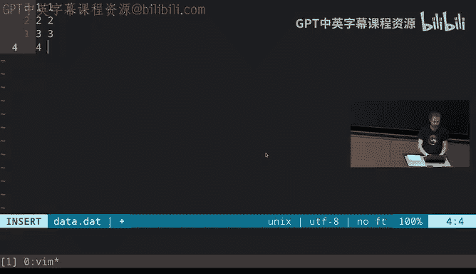
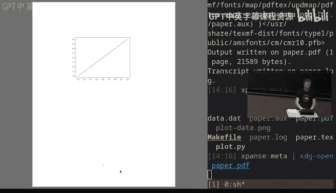
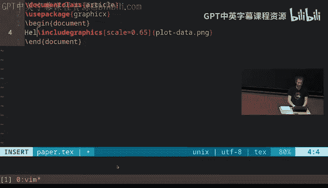
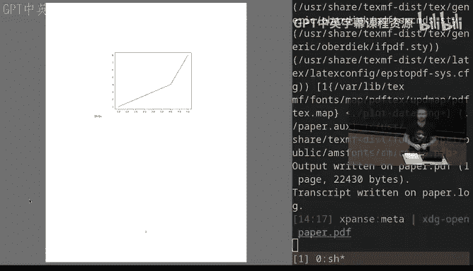
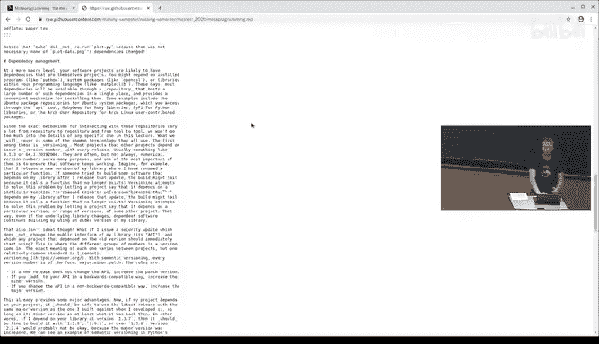
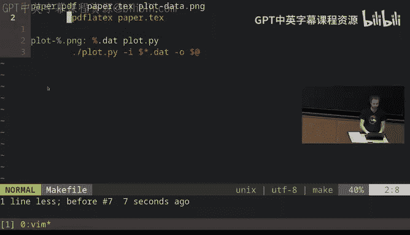

# 计算机科学教育中遗漏的一学期：08：元编程

在本节课中，我们将要学习元编程。元编程并非指编程本身，而是围绕软件开发过程的一系列实践，例如如何构建系统、如何测试、如何管理依赖等。这些概念在构建大型软件时至关重要。

## 构建系统

上一节我们介绍了元编程的概念，本节中我们来看看构建系统。构建系统的核心思想是，当你需要执行一系列命令来完成特定任务（如编译论文或运行测试）时，可以将这些命令规则编码到一个工具中。这个工具能理解不同构建产物之间的依赖关系，并自动执行必要的命令。

构建系统有很多种，有些是为特定语言或目的设计的。在本课程中，我们将重点介绍一个名为 `make` 的工具，它几乎存在于所有现代操作系统中，非常适合处理简单到中等复杂度的项目。

当你运行 `make` 命令时，它会在当前目录中寻找一个名为 `Makefile` 的文件。在这个文件中，你需要定义**目标**、**依赖**和**规则**。



*   **目标**：你想要构建的东西，例如 `paper.pdf` 或 `run tests`。
*   **依赖**：构建目标所需要的东西，例如源文件或图像。
*   **规则**：定义了如何从依赖项生成目标的一系列命令。







以下是一个简单的 `Makefile` 示例，用于构建一个包含图表的 LaTeX 论文：

```makefile
paper.pdf: paper.tex plot-data.png
    pdflatex paper.tex

plot-%.png: %.dat plot.py
    ./plot.py -i $*.dat -o $@
```

在这个例子中：
*   `paper.pdf` 是目标，它依赖于 `paper.tex` 和 `plot-data.png`。规则是运行 `pdflatex`。
*   `plot-%.png` 是一个模式规则，`%` 是通配符。它表示任何形如 `plot-XXX.png` 的文件都依赖于 `XXX.dat` 和 `plot.py`。规则是运行 Python 绘图脚本。
*   `$*` 和 `$@` 是 `make` 的自动变量，分别代表匹配到的通配符部分和目标文件名。

当你运行 `make` 时，它会检查目标及其依赖项的时间戳。只有当依赖项比目标更新，或者目标不存在时，`make` 才会执行相应的规则来重建目标。这确保了每次构建只进行最少必要的工作。

## 依赖管理

在软件开发中，依赖关系不仅限于文件。你的项目可能依赖于其他程序、库或系统组件。为了管理这些依赖，我们通常使用**软件仓库**。

软件仓库是软件包的集合，例如：
*   **PyPI**： Python 包仓库。
*   **RubyGems**： Ruby 包仓库。
*   **npm**： Node.js 包仓库。
*   **APT**： Debian/Ubuntu 的系统包仓库。

软件通常带有**版本号**（如 `8.1.7`），这很重要，因为它能确保你的软件与依赖库的特定版本兼容，避免因依赖库更新导致你的软件崩溃。

为了解决版本兼容性问题，社区广泛采用**语义化版本**规范。一个版本号通常格式为 **主版本号.次版本号.修订号**：
*   当你做了**不兼容的 API 修改**时，递增**主版本号**。
*   当你做了**向下兼容的功能性新增**时，递增**次版本号**。
*   当你做了**向下兼容的问题修正**时，递增**修订号**。

遵循此规范，如果你的软件依赖某个库，你可以指定版本范围（例如 `^8.1.0`），表示接受主版本号为 8，且次版本号不低于 1 的任何版本。这既保证了兼容性，又允许自动接收安全更新。

为了确保每次构建的一致性，许多项目使用**锁文件**。锁文件记录了项目当前使用的所有依赖的确切版本。这带来了两个好处：
1.  **加速构建**：无需每次检查并下载最新版本。
2.  **可重现的构建**：无论何时何地构建，都能得到完全相同的结果，这对于安全审计至关重要。

依赖管理的极端形式是**代码库内嵌**，即直接将依赖的源代码复制到你的项目中。这确保了绝对的控制和一致性，但代价是你无法自动获取依赖库的更新。

## 持续集成



对于大型项目，你通常希望自动化一些流程，例如在每次提交代码时自动运行测试，或者自动发布新版本。这就是**持续集成**系统的用武之地。

持续集成系统本质上是一个云端自动化系统。它监听你代码仓库的特定事件（如推送提交、创建拉取请求），并触发预定义的动作（如运行测试套件、检查代码风格、构建文档、发布包等）。

常见的通用 CI 平台有 Travis CI、GitHub Actions、Azure Pipelines 等。也有更专业的 CI 服务，例如专注于测试覆盖率或依赖更新的机器人。

使用 CI 系统通常需要在你的仓库中添加一个配置文件（如 `.travis.yml` 或 GitHub Actions 的 YAML 文件），在其中定义触发事件和执行的任务。

CI 系统的一个强大之处在于其可协作性。例如，你可以设置一个 CI 任务，在有人提交拉取请求时，自动用语法检查工具检查文档的拼写。其他人也可以复用你写好的这个 CI 配置。

## 测试

测试是确保软件质量的关键环节。随着项目变得复杂，测试也会变得更加系统化。以下是一些常见的测试术语：



*   **测试套件**：项目中所有测试的集合。
*   **单元测试**：小而专注的测试，用于验证单个功能模块的正确性。
*   **集成测试**：测试多个子系统或模块协同工作是否正常。
*   **回归测试**：针对过去出现过并已修复的 bug 编写的测试，防止问题再次出现。
*   **模拟**：在测试中，用可控的“假”对象来替代系统的某些部分（如网络、数据库）。例如，测试文件上传功能时，可以模拟一个网络连接，而不是真正发起 HTTP 请求。大多数编程语言都有辅助创建模拟对象的库。

## 总结

本节课中我们一起学习了元编程的核心概念。我们了解了**构建系统**如何自动化编译流程，**依赖管理**和**语义化版本**如何维护项目的稳定与安全，**持续集成**如何将测试、部署等流程自动化，以及**测试**的不同类型和策略。掌握这些围绕编程的“元”技能，能极大地提升你开发和管理软件项目的效率与可靠性。