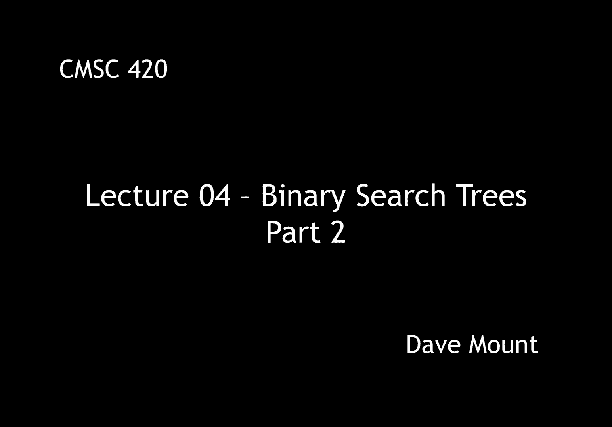
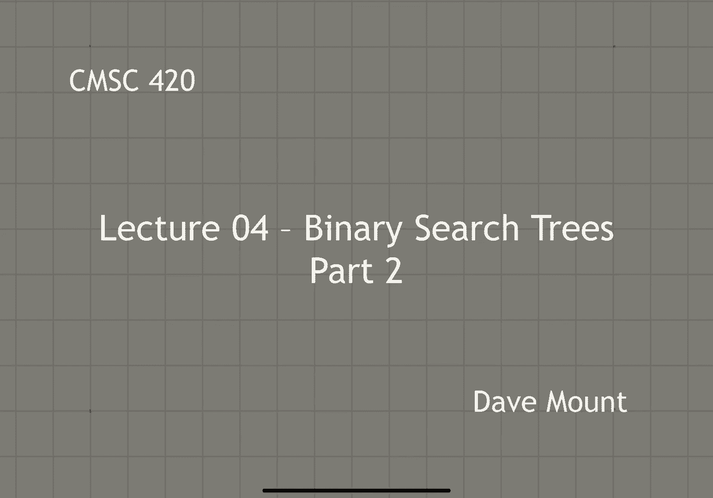
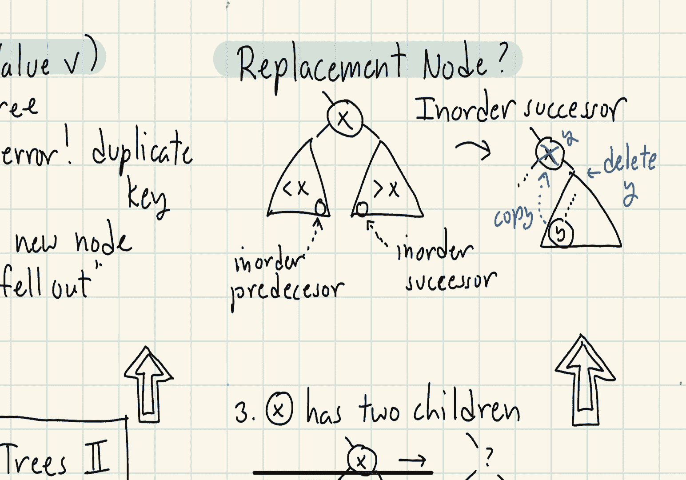

# 【双语字幕+资料下载】马里兰大学 CMSC420 ｜ 数据结构 (2021最新·完整版) - P10：L4- 二叉搜索树 2 - ShowMeAI - BV1Uh411W7VF

hello everyone，in this segment we're going to continue，our discussion of binary search trees。

and we're going to talk about insertion，okay so let's begin by talking about how。

we're going to insert a key into our，binary search tree um，the insert procedure is going to take。

two arguments a key x and a value v，as always the value v is going to be。

used by the application and so we're，pretty much going to ignore it and just。

focus on the key value x，first part of the process is we're going。

to see if we can find the key x inside，the tree by using the same fine。

procedure we discussed in the previous，segment，if we succeed in finding x well that's。

bad because we do not want to have any，duplicate keys in our dictionary。

otherwise recall that when the find，operation fails it's because we have。

effectively fallen out of the tree that，is we've taken a null pointer，from some node so。

basically this is the location where the，new node belongs and so we're going to。

create a new node and just link it in，right at the spot of this null pointer。

so let's try this out in a little，example，consider the following，rather typical binary search tree。

and let's try to insert the key 14 into，the tree，so the first thing we're going to do is。

we're going to attempt to find the key，14 in the tree so since 14 is bigger。

than 13 we go to the right，14 is less than 19 so we go to the left。

finally 14 is less than 15 and so we'll，visit that null pointer on 15's left。

child and this is where we fall out of，the tree，so at this point we create a brand new。

node with the key value 14 and again we，should actually store the value here as，well but。

we're just going to ignore the values，here just focus on the keys and then。

what we do is we will link 14 in as a，new left child for 15。 note that the。

node 14 has two children pointers as，well but both of those are going to be，nulls。

okay so let's present pseudo code for，our insertion procedure，the。

insert procedure is going to take three，arguments the key x the associated value。

v and the current node in the binary，search tree that we're working with。

by the way we're going to use bst node，to denote the，type of the node object and the insert。

function is going to return a pointer to，a bst node that is going to be。

essentially the newly created node or，the modified subtree，we'll get to that later，okay first。

if p is equal to null remember that this，is what happens when we fall out of the。

tree right we've essentially hit a null，pointer，that means that the key is not in the。

tree so we're in good shape we can go，ahead and create a new bst node so we're。

going to invoke our constructor store，the key value x and the associated value。

v inside of this node by default i'm，going to assume that the constructor is。

going to set the two left and right，child，pointers to null and i'm going to store。

that value in p so this effectively，becomes our new current node。

okay next we'll check to see if the key，value is smaller than the key being。

stored at the current node and if so we，recursively perform an insertion in the，left subtree，okay。

you'll notice that we assign the result，to p dot left and we'll discuss why，okay symmetrically。

if x is bigger than the key value stored，at the current node we're going to do。

the insertion recursively on the right，side by calling insert xvp。right and。

again it's going to return a pointer to，the result and we're going to store that，in our right link。

okay so if x is not less than the，current node and if it's not greater。

than the current node then it must be，equal to the current node which means we。

have essentially found a duplicate key，in our tree that's not allowed so we're。

going to throw some kind of an error，signal and error so in this case we'll。

throw an exception basically a duplicate，key exception，okay and to end things off we're just。

going to return the current value of p，so observe if we created a brand new。

node p is a pointer to that node and if，we didn't create a new node that is if。

we've just let's say performed a，recursive call down the，line of trees p is just the same value。

as what it was when we entered the，next i want to go back and clarify one。

of the steps in the algorithm when we，made the recursive call to insert you'll。

notice that we took the value of the，insert function and stored it back in。

the very same pointer that we made the，call on，the question is why did we do this。

okay so to understand this a little bit，better let's go back and look at our。

example of inserting 14 into this tree，and remember that 15 was the node where。

we fell out of the tree，okay so let's call this node p1，okay，and at this point in the function what。

we've done is we've just executed the，statement p1。left equals insert of 14 on，p1。

left in this particular instance，okay so when we made the recursive call。

of insert to p1 left it detected the，fact that the third argument p1 left is，null。

and so what it did is it executed the if，statement that creates a new。

bst node containing the key value 14。okay let's call that p2，and when i get to the end of the。

procedure i return the value of p2，the key thing to observe is when i。

return p2 right as the return result of，the insert function i now store that。

pointer to the new node inside of，p1。left so in particular it is this，assignment statement that has。

effectively linked the new node into my，tree and this was the reason that we，returned the value。

okay let me pause here and say please be，sure that you understand what i just。

said here and why we said it it turns，out with almost all of the。

algorithms we're going to talk about，that involve modifying binary search。

trees we're going to perform this same，operation of modifying a subtree。

returning a pointer to that subtree and，then storing that the value of that，modified pointer as the。

okay next let's talk about how to，perform a delete operation in our tree。

okay step one we have to find the node，in our tree，clearly if we don't find the node then。

there's an error we're trying to delete，something from the tree that doesn't。

exist there and finally once we have，found the node then we simply are going。

to remove this node from the tree and do，whatever we have to do to restore the，structure of the bst。

of course the question is how do we，restore the tree's structure and this is。

going to be a little bit of a tricky，question okay we can basically analyze。

this by looking at three different，possible cases，the first case is when x is a leaf node。

that is both of its child pointers are，null，well this is the easiest case to deal。

with because all i have to do is remove，this node from my tree and set the。

associated child link in its parent to，null，the next possibility is the note to be。

deleted has just a single child，okay so the picture might look like this。

so in this case we can effectively just，remove x and then pull x's child up to，replace it。

okay so in the illustration here what，i've done is i've sort of unlinked x and。

x is in this case it is it's the right，child of x it has now become the left，child of x's parent。

okay the last case is the hardest one to，deal with namely when x has two children。

the problem here is when i remove the，note x what do i replace it with。

right as you can see from the figure，when x goes away i've got one hole left。

in my tree but i have sort of two，children so it's not clear。

you know how to fill this hole that i've，created here，so here's the strategy we're going to，employ。

we're going to find a suitable，replacement node，okay call that y and you might ask how。

do you find this node well i'll explain，it in just a second but once you have。

found that node what we're going to do，is we're going to take this node y we're。

going to copy it or basically place it，in exactly x's position in the tree okay。

but now we have two copies of the node y，then what i'm going to do is i'm going。

to recursively delete the other copy of，okay so this leaves the question well。

how do you find a suitable replacement，node that will preserve all the。

structural properties of our binary，search tree，well to explain this let's kind of。

take a step back and look at the big，picture here so suppose we want to。

delete the node x from our tree and this，node has two children。

what node can we use as a good choice to，replace the value of x。

well first off notice that by the rules，of the binary search tree all the。

key values in the left subtree are going，to be smaller than x all the key values。

in the right sub tree are going to be，bigger than x so whatever we insert for。

the value of x its value had better be，one that we can sort of insert here and。

maintain the structure of the tree，there are two，good candidates for this replacement，node。

the first one would be the，node that has the largest value inside。

of x's left subtree this is the inorder，predecessor of x so in other words if i。

were to lay out all the keys in sorted，order this would be the key value that，comes right before x。

and the symmetrical one would be to pick，the smallest key that's located in x's。

right subtree so this would be the key，value that comes immediately after x。

remember that by our assumption that，both of the sub trees are not empty we。

know that both of these quantities exist，so we are free to choose either one of，them。

okay so since it doesn't matter which，one we're going to use let's just make。

the convention that we'll always use the，inorder successor，okay so what are we going to do well。

first off，starting at x we're going to find the，inorder successor okay。

once we have this node we're then going，to copy it up to cover up x's position。

but notice we now have two copies of y，in our tree，so to fix this we're going to go to the。

subtree that is the right subtree of x，and recursively invoke the delete。

procedure but now we're going to delete，y，okay so that's the high level view of，the delete procedure。

in the next segment we're going to give。