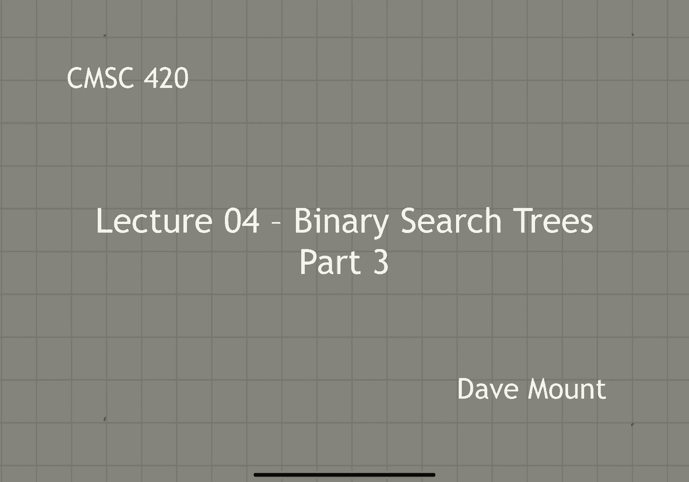
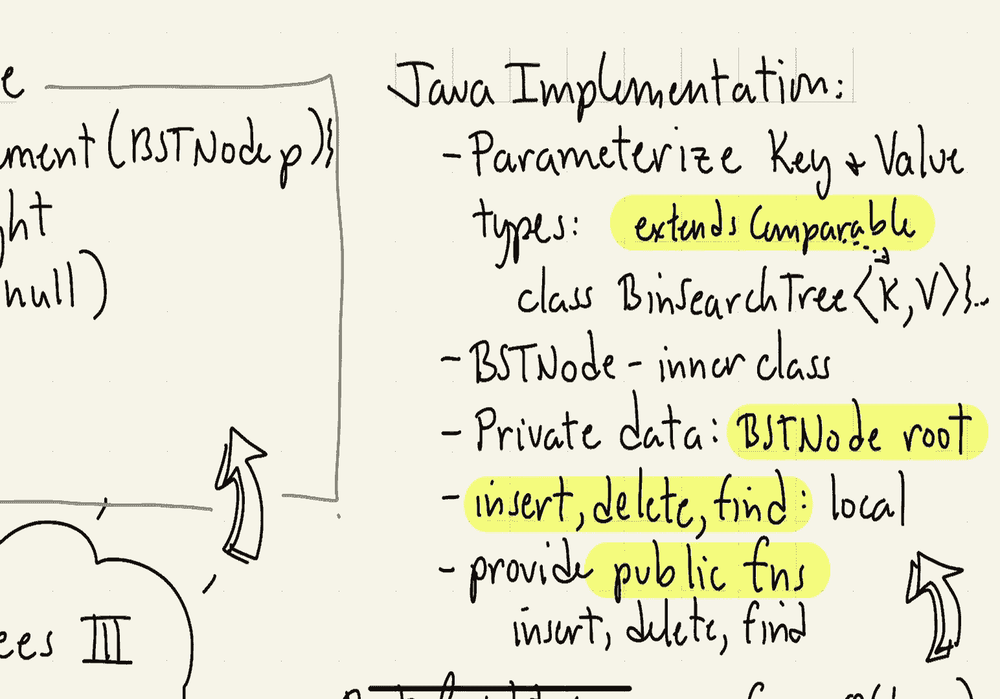
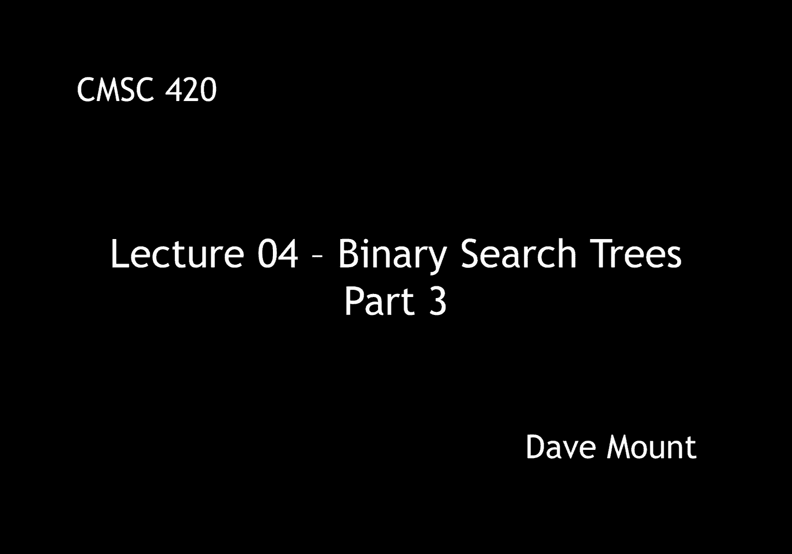

# 【双语字幕+资料下载】马里兰大学 CMSC420 ｜ 数据结构 (2021最新·完整版) - P11：L4- 二叉搜索树 3 - ShowMeAI - BV1Uh411W7VF

okay let us wrap up the material on，binary search trees，so we're going to finish up talking。

about deletion，we're going to say a little bit of the，analysis regarding the running time of。

the various algorithms and we're going，to talk a little bit about the java，okay。

so the unfinished work we left from the，deletion code from last time was how to。

find the replacement node，okay remember that our convention was。

that the replacement node is going to be，the，in order successor of the current node。

that is to say it's going to be the，leftmost node in its right subtree。

okay so to define this little method，this helper method of ours，we're going to pass it a node p。

okay and the first thing we're going to，do is we're going to define a new node，to be p's right child。

okay and then we'll simply set up a loop，that will travel all the way down the。

left chain that is going to the leftmost，node of the subtree until we can go no。

and then we'll return whatever node we，arrive at，okay so now we can give the pseudocode。

for our deletion routine and this is，going to be by far the most complicated，of the three operations。

the routine is going to take two things，it's going to take the key x to be。

deleted and the current node p that，we're visiting and as before as with。

insertion it's going to return a pointer，to the modified subtree so first if we。

fall out of the tree this means that we，never found the key x and therefore。

we're attempting to delete a，non-existent node so we're going to，throw an error。

okay so otherwise p is non-null what we，do is we check to see is the key that。

we're trying to delete smaller than p，dot key if so we need to delete it from。

the left subtree and remember that，deletion routine is going to return a。

pointer to the modified subtree so we're，going to replace the value of p dot left。

with that value and i guess it's，becoming familiar by now that we also。

insert the symmetrical case if x is，okay so well this is not quite correct。

java but if either p dot left or p dot，right is equal to null then we're in a。

situation where we are either at a leaf，okay so first if p dot left is equal to。

null okay then in order to remove this，node all we have to do is take its right。

subtree and return that as the modified，okay and symmetrically。

if the right child of the current node，is null okay then in order to delete。

this node all we have to do is return，its left subtree right and then the node，is effectively gone。

it's a little interesting to note at，this point in time，that although i earlier indicated that。

there are two cases depending on whether，you have a leaf or whether you have a，single child。

being null notice we've actually dealt，with both of the cases here in other。

words if you have a leaf and both of，them are null it turns out you'll just。

be processed by the first of the two，cases，but in this case what that's going to do。

it's going to return p dot right and p，dot write is already null anyway。

okay finally we're getting to the most，interesting case suppose that the node。

has both of its children present，okay then what we need to do is get the。

replacement node so what we're going to，do is we're going to employ find。

replacement on p that's going to be the，node that's going to replace p。

next we'll copy the contents of the，replacement node to p so this。

effectively now has deleted p but we've，got two copies of r's contents。

okay so to get rid of the extra copy of，r remember r is sitting in p's write。

subtree what we're going to do is we，will delete r's key from p's right。

subtree so this will get rid of that，and finally at the end of the process p。

is pointing to the updated subtree where，the deletion took place and so we return，its value。

okay so let's do a couple examples to，see how this works，okay so let's take this binary search。

tree and delete the key five，so the first thing that the deletion。

procedure is going to do is it's going，to simulate the fine process until it。

locates the node that contains the key，five，next we're going to observe，that 5 has only。

one non-null child so it's going to fall，into the first case in this case。

and in that case what we do is we return，the value of p dot left。

okay so p is pointing to the node five，okay because it's right child is null we。

return p dot left that is we return a，pointer to the node 4。 when we get back。

to the calling routine from the parent，that stores this link inside of its left，child，and so now。

the node 7's left child is going to be，pointing to 4 rather than 5 and 5 has。

effectively just been unlinked from the，okay let's take a look at a more。

sophisticated example where we see how，to do a deletion where the deleted node。

has two children so suppose we have the，following tree and we want to delete the，key three。

the process starts as it was before we，start doing a search since three is less。

than 13 we go to the left child and then，we find the key three right away but we。

notice the node 3 has two non-null，children，so at this point，p is pointing to the node 3 and then we。

invoke find replacement find replacement，goes to 3's right child that is the 9。

and then it goes all the way down the，left chain until it can't go any further。

and so the final note it reaches that is，the node with the value 4 there is going。

to be our replacement r，so at this point we copy the contents of。

r that is to say its key value its you，know value information and anything else。

that's relevant to sort of the node's，contents，up，to the node p。

notice now however we have two copies of，this node with the value four in it and。

we need to remedy that，so the way we fix the tree at the end of，the day is we invoke the deletion。

procedure on p's right subtree，okay that is the nine we call delete of。

okay so now starting at the node 9 we're，going to apply the deletion procedure，recursively。

in this case node 4 is going to be a，leaf so it's going to actually be。

deleted by the earlier method which，simply unlinks it from the tree。

so node 4 is going to go away and it's，just going to be replaced with a null，pointer。

okay and that's going to be the final，result here，because we have replaced three with its。

in-order successor observe that all of，the ordering properties of the tree are，still preserved。

okay next let's say something about the，efficiency of the algorithm by analyzing。

the running time of the various，operations，well observe that all the operations run。

in time o of h where h is the height of，the tree in the worst case in the worst。

case you're either finding inserting or，deleting the deepest node in your tree。

and so the process could go all the way，down to the leaf level as we saw in one。

of the previous segments the height can，vary anywhere from o of log n when the。

tree is perfectly balanced all the way，up to o of n the tree is extremely。

degenerate and all of those are，possibilities depending on the order in。

which the various elements are inserted，or deleted，i want to claim however that if things。

are done in a fairly random way the，expected case is actually going to be，pretty good。

in particular the following theorem can，be proved if you take n keys and insert。

them into the tree in random order that，is each one of the n factorial。

permutations is equally likely as the，insertion sequence then the expected。

height of the tree can be shown to be，okay finally to close things off let's。

say a few things about a java，implementation so the first idea is。

rather than having the key and value be，fixed types，what we can do is we can define the。

class where these are parameterized，types using the java generic mechanism。

so for example when i declare my public，class binary search tree i'm going to。

include two additional parameters let's，call them k and v representing the type。

of the key and the type of the value one，additional thing that we should add is。

when we specify our key type k because，we need to be able to make comparisons。

we should specify in the declaration，that it extends comparable comparable is，a java。

interface that means that whatever the，type k is it has to implement a function，called compare to。

next we can define our binary search，tree node to be a class that is nested，within the。

binary search tree class this is，sometimes called an inner class or a，nested class。

next the private data that's going to be，stored inside the binary search tree is。

just going to be a single bst node，reference called the root，initially in our constructor we're just。

going to set that to null，next the functions insert delete and，find that we have defined already are。

all going to be local to our procedure，okay，the way you can do this is you can。

either make them protected or，when i've done this before what i've。

done is i've just used the default，specifier again that means that they're。

only accessible within the package，and finally，the public interface in addition to the。

constructor is going to consist of three，functions insert delete and find however。

unlike our functions which took as a，parameter the current node these。

functions don't take a node however，they're all just one line functions what。

they do is they take the um they're they，basically invoke our local function and。

okay and that is everything for our，lecture on，binary search trees again there's a。

number of details that i omitted from，our this little fast forward segment。

here and i'd encourage you to take a，look at the pdf file lecture notes for。

some of the details particularly about。

