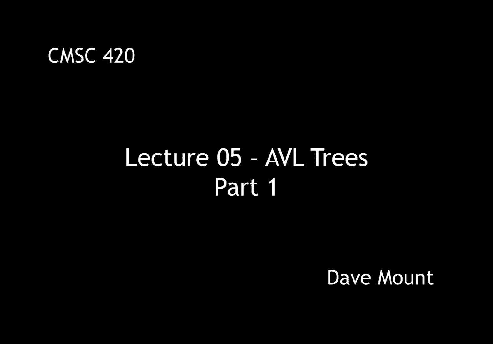
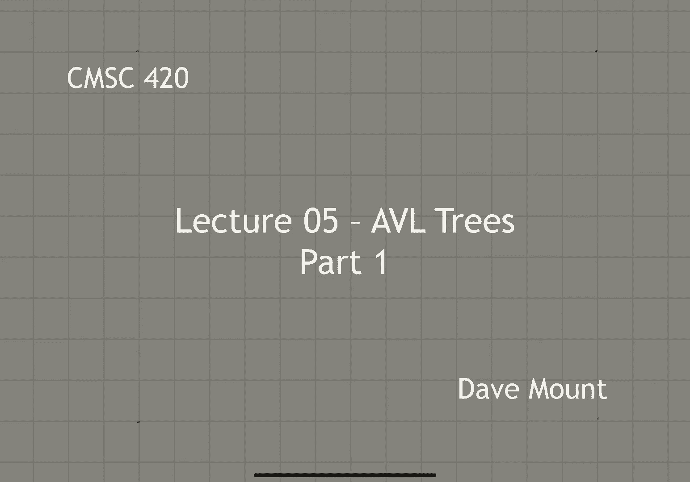
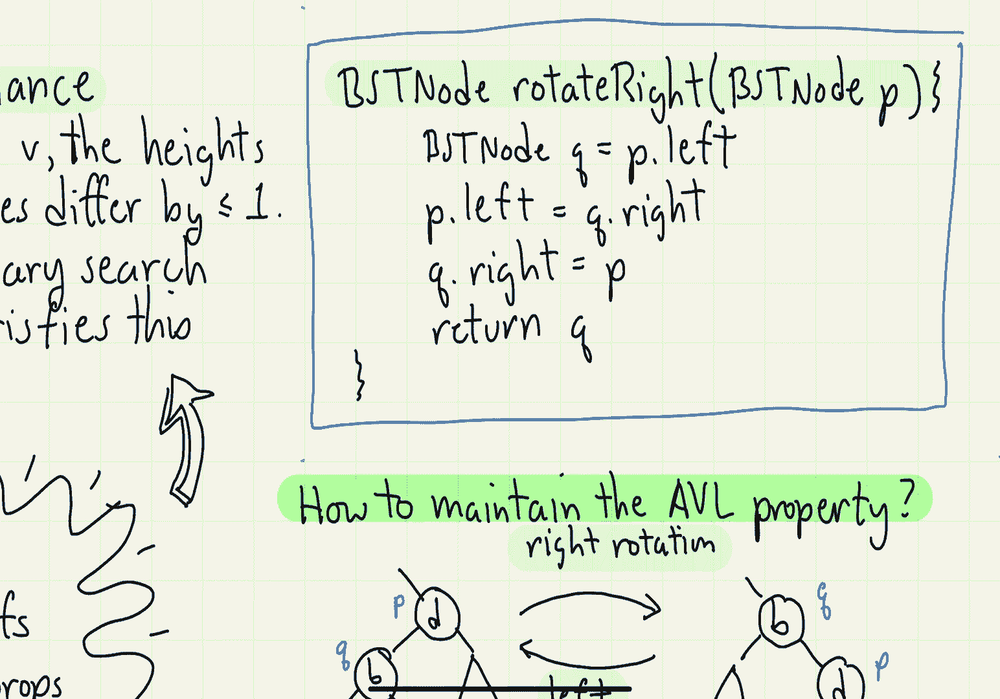

# 【双语字幕+资料下载】马里兰大学 CMSC420 ｜ 数据结构 (2021最新·完整版) - P12：L5- 平衡二叉树 1 - ShowMeAI - BV1Uh411W7VF

hello everyone today we're going to talk，about abl trees，we're going to talk about basic，definitions。

discuss the height properties of the，tree and talk about maintaining the。

the avl tree is a height balance tree so，let's begin by talking about the height。

balance condition for avl trees，condition says that if i look at any。

internal node of the tree the difference，in the heights of its two subtrees is。

going to be at most one，we define an avl tree to be any binary。

search tree that satisfies this height，condition，to make this idea a bit more formal。

let's define the notion of a balance，factor，define the balance of any node v to be。

the difference in the height of its，right sub-tree and its left sub-tree。

so let's consider the following search，tree，in blue let's label the height of every，node。

and in red let me indicate what the，balance factors are，since all the balance factors lie。

between minus one and plus one this is a，valid avl tree，in contrast let's take a look at this。

so as before i've listed all the height，values on the left side in blue and i've。

indicated the balance factors on the，right side of each node in red and in。

looking through the various balance，factors you'll notice that one of the。

values uh the plus two at node ten is，not in the range from minus one to plus。

one and therefore this is not a valid，avl tree，so the question this leads to is given。

this height balance restriction can i，now say that an abl tree has o of login，height。

well to get some intuition about this，let's consider what the worst case，situation would be that is。

let me think about trees that are as，absolutely imbalanced as they possibly。

can be and still satisfy the avl height，condition，so for example suppose that h is equal。

to zero well in this case um i have just，one tree that is a single node um if h。

is equal to one there's two possible，trees um it could be that it has a。

single root node with a left child or a，single root node with a right child，and if h is equal to 2。

it seems like the worst that i could do，would be to put，basically a tree of height one on one，side。

okay and the other side i want to make，it as sparse as possible so i'll make a。

tree of height zero on the other side，in general if i want to make a tree of。

height h as in balanced as possible i，know that one of the two sub trees has。

to have height h minus one okay and in，order to satisfy the balance condition。

the other one has to have height at，least h minus two so the idea would be。

to imply this approach recursively，so if you apply this what you'll。

discover is there's a certain sequence，that you get，for h equals zero you get one for h。

equals one you get two and then the next，elements in the series are going to be。

four then seven then twelve then twenty，and so on，if you add one to each of these numbers。

notice you get the numbers two three 5 8，13 21 um well if you，recognize this sequence you'll notice。

that this is exactly a subsequence of，the fibonacci numbers um well is this an。

interesting coincidence or is in fact is，there something really going on here。

so recall the definition of the，fibonacci series，f of 0 is 0 f of 1 is equal to 1 and in。

general f of h is equal to f of h minus，1 plus f of h minus 2。so looking at the pattern that i see。

here it's natural to conjecture that the，minimum number of nodes in an avl tree，of height h。

is going to be the fibonacci number f of，h plus 3 minus 1。 well let's see if，that's true。

okay so let's state this as a theorem，and see if we can prove this by。

induction an abl tree of height h has at，least f of h plus 3 minus 1 nodes。

well not surprisingly the proof is going，to be based on an induction on the，height h。

so one of the basis cases is going to be，h of 0 in this case the number of nodes。

which we're going to denote by n of h is，going to be equal to 1 and that's just。

the same as f of 3 that is 2 minus one，okay and the next basis case is equally。

easy to see that is when h is equal to，one we have two nodes okay and that is。

exactly the same as f of four minus one，okay so let's look at the general case。

when h is greater than or equal to 2。so recalling the way in which we were，constructing these trees。

the way we construct a tree of height，greater than or equal to 2。

is we take a tree of height h minus 1，which will have n of h minus 1 nodes by。

the induction hypothesis，and a tree of height h minus 2 which，also by the induction hypothesis will。

have n of h minus 2 nodes in it and we，put them under a common root and the。

common root get generates one additional，node so the number of nodes we have in。

total is going to be 1 plus n of h minus，1 plus n of h minus 2。

so plugging in our induction hypothesis，we get 1 plus f of h plus 2 minus 1 plus。

f of h plus 1 minus 1。and simplifying we see that this is f of，h plus 2，plus f of h plus 1，minus 1。

which is the same by the definition of，the fibonacci series as f of h plus 3，minus 1。

so that concludes our proof，probably at some time in your life。

somebody told you the fibonacci numbers，are important because they show up in。

all sorts of unexpected situations and，this is just one of them。

so given this theorem we can now prove，the following corollary namely that an。

avl tree with n nodes has height o of，log n，first off let's recall a famous fact。

from mathematics namely that the，fibonacci number f of h，is approximately equal to，phi。

raised to the power h divided by root 5，where，phi is the famous golden ratio that is 1。

plus the square root of 5 divided by 2。this is a quantity that was you know。

known to the you know i guess ancient，civilizations of all forms。

ignoring constant factors the number of，nodes in any avl tree is going to be at，least。

f of h plus 3 right minus 1 which is by，this fact is going to be at least phi。

raised to the power of h plus 3 again，ignoring constants and again up to。

constants that's going to be the same as，phi to the power h okay so that implies。

that by taking logs base phi on both，side，the value of h is going to be at most。

log base v of n again plus some constant，okay so i can use the log conversion。

formula now to say that h is going to be，at most log base 2 of n divided by log。

base 2 of phi well log base 2 of phi is，just some constant so then up to。

constant factors we have that，h is going to be o of log n，okay and that completes the proof of the。

corollary，okay so this raises the next important，question which is。

how is it that you're going to maintain，this avl height property in particular。

as we insert things into the tree or，delete things from the tree how can we。

reorganize the tree in order to maintain，this property，our approach to doing this is going to。

be based upon a，basic local operation that we can，perform in binary trees which is called，a rotation。

a rotation has the nice property that it，maintains the in-order properties of the。

tree but it changes the heights of the，various sub trees，so let's take a look at this example，here。

i've drawn a pair of nodes b and d，and，the associated three，trees a c and e and i've labeled these。

things in such a way that they are in in，order progression that is。

all the elements of or all the key，values in subtree a are going to be，smaller than b。

which is going to be smaller than all of，the key values in sub-tree c。

which is going to be smaller than d，which is going to be smaller than all of。

the key values in the subtree e，the operation is going to be called a。

right rotation and what it does is it，flips the positions of b and d relative。

to each other that is the child b，becomes the parent now of d。

and the sub trees are going to just hang，down according to the appropriate in，order。

notice after performing this operation，subtree e has moved one level deeper in，the tree。

sub tree a has moved up one level higher，in the tree and the two nodes b and d。

have effectively swapped position and in，the same way that there's a right。

rotation there's also a left rotation，and it just involves inverting the，previous operation。

so let's present code that performs the，right rotation operation。

we're going to assume that the node p is，going to be the associated with the one。

that we labeled d before in our example，so first let's let q be the left child。

of p so if p was the node d then q is，going to be pointing to the node we，labeled b。

so the rotation will move q's right，child that is the sub tree that we，labeled c。

over to be b's p's left child，also q's right child，is now going to point to p so in other。

words d is going to become the right，child of node b in our previous picture。

finally note that the pointer from the，parent that was coming into d。

right has to be fixed as well the way，we're going to do this is we're going to。

return a pointer to the new root of this，subtree namely q，to the calling routine and that's going。

to update its child link，let me not give the code for the left。

rotation because it's just symmetrical，so now that we have the rotation code in。

the next segment we're going to talk，about how to perform insertions and。

