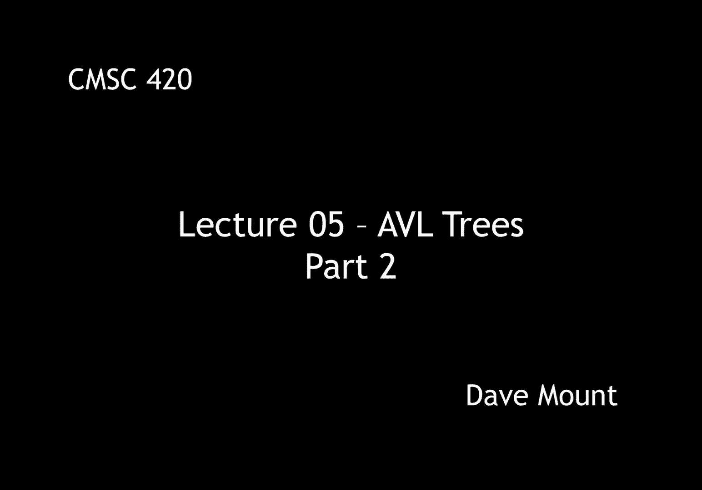
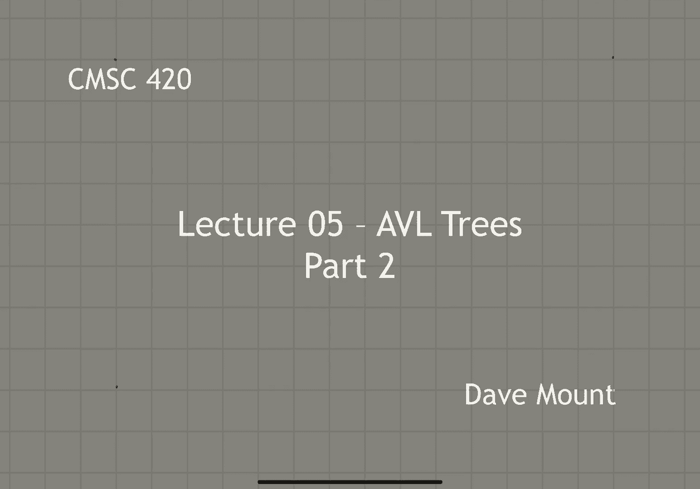
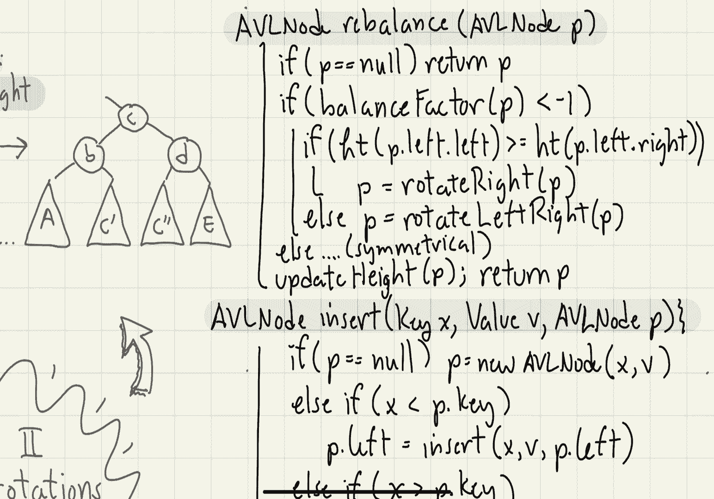

# 【双语字幕+资料下载】马里兰大学 CMSC420 ｜ 数据结构 (2021最新·完整版) - P13：L5- 平衡二叉树 2 - ShowMeAI - BV1Uh411W7VF

in this segment we're going to continue，talking about avl trees。

we're going to start by talking about，the double rotation operation and then。

the rest of the segment is going to be，devoted to showing how to perform。

so one of the things we saw with single，rotations，was that it was able to change the，height，of the。

leftmost and the rightmost sub trees but，the middle subtree didn't move whenever。

we did a rotation it pretty much stayed，at the same depth however if we find。

that our middle subtree is either too，high or too low we're going to need a。

rotation operation that's going to，change its height and this is why we。

introduce the notion of double rotations，to understand how a double rotation，works。

let's consider the following tree，so this operation is called a left right。

or lr rotation um let's think of，performing this operation at the node d。

so it consists of doing two things first，performing a left rotation on its left。

child and then following that with a，right rotation at the node d itself。

let's see what the result is，after the lr rotation takes place the。

node c is going to be rotated up to the，top of this little assembly here。

b is going to appear as its left child，and d is going to appear as the right，child。

the interesting thing to observe here is，what happens to the relative heights of。

the sub trees so the subtree a is going，to stay essentially at the same height，that it was before。

c and c double prime are both going to，get pulled up one level in this。

operation and the subtree e on d's right，side is going to get pushed down one。

there's a symmetrical version of this，double rotation called the rl or right。

left rotation and the way it works is，again if it's applied to the top node，labeled b。

it performs a right rotation on its，right child followed by a left rotation。

at the node itself so let's see what，so the result of this particular。

operation again is to pull the middle，node c up to the top，okay b this becomes the left child d。

becomes the right child notice again，that the two middle sub trees that is c。

prime and c double prime each get pulled，up one level in the process。

b's left child a gets pushed down one，level and d's right child e basically。

stays at the same level that it was，so given a general binary search tree，node，p。

the rotate left right the lr rotation，can be implemented by simply invoking。

rotate left on p's left subtree okay，storing that in p left and then applying。

rotate right to p itself and again we，always return the，resulting subtree to our parent because。

the parent needs to adjust its child，link，okay now let's talk about the。

details of the avl tree implementation，as opposed to just a standard binary，search tree。

a node in the avl tree is going to be，the same as a binary search tree node。

with one exception and that is we're，going to add an additional field called，the height。

that field is going to store the height，of the subtree that is rooted at this，node。

our first utility called height，its job is just to return the height of。

a reference to a node in the tree this，of course normally will just be。

returning p dot height however if p is，null we're going to make the convention。

that a null pointer has a height of，negative one，our next utility update height has the。

job of updating the height of a tree，after any sort of you know modifications。

have been made such as rotations，so what it does is it consults the。

height of the left subtree and the right，subtree takes the max of those two。

things and then adds one to it，our last utility called balance factor。

it has the job of returning the balance，factor of a node and it does this by。

just computing it directly it takes the，height of the right subtree minus the。

height of the left subtree，well the easiest operation to define is。

going to be the find operation because，there is no difference between fine for。

the avl tree and the binary search tree，because an abl tree is just a binary，search tree。

okay so let's take a look and see how，the insert operation is going to be，performed。

so the insert procedure is going to work，essentially analogously to the binary。

search tree recall that what that does，is it makes recursive calls until it。

falls out of the tree when it falls out，of the tree it creates a new node at。

this point okay that was all for the，binary search tree in the case of the。

avl tree as we unravel the recursive，calls we're going to update the heights。

update the balance factors and whenever，we notice that a balance factor is out，of whack。

then what we're going to do is we're，going to perform an appropriate rotation。

to fix it up and then we just continue，backing up from there，remember that the balance factors have。

to stay between negative one to positive，one whenever we insert a node we're。

going to create at most one new level，somewhere in the tree so the balance。

factor could either become a negative，two at some point or it could become as，high as a positive 2。

 let's consider the，case of the negative 2 the positive 2 is，actually just going to be a left-right。

symmetrical case to this okay，now when the insertion takes place。

a balanced factor of negative 2 means my，left child is two levels too heavy okay。

if i look at its left child then that，child could be either heavy on the left。

side or the right side suppose it's also，heavy on the left side so we call this a。

left left heavy situation so let's，consider this particular case。

i have just performed an insertion into，the left child of the left child of d。

that's uh into subtree called a，okay as a result of this，its left child b has become left heavy。

so it has a balance factor of negative 1，and d itself has a balance factor of。

negative 2 and i need to remedy this，so we remedy this by performing a right，rotation at d。

let's see what happens the node b comes，up the node d goes down okay d's right。

child has now moved down essentially one，level，the middle sub tree c essentially stays。

at the same depth that it was before and，most importantly the left sub tree a。

which is where the imbalance occurred it，has been lifted up by one level。

so after this operation is done，node d now has a balance factor of zero。

and node b has a balance factor of zero，and now we're perfectly happy in fact。

because the balance factors are，completely resolved at this point in。

time in particular because we have，essentially pulled up the sub tree that。

was deep notice that the rest of the，tree from here on up to the root is，actually going to be okay。

next let's consider the case where the，insertion，occurs not to，the left left child but occurs in the。

right child of d's left child that is a，left right heavy case，in this case we're going to have to。

drill a little bit deeper so let's let c，be the right child of b the insertion。

could have taken place either into c's，left subtree c prime or into c's right。

subtree c double prime and we don't，really care it turns out，whichever case occurred the rotation。

we're going to give is going to handle，it，okay so let's take a look at what the，balance vectors are。

okay we don't know what the balance，factor is going to be at c because it。

just depends on which of the two sub，trees the newly inserted node went into，but we just don't care。

i'm coming back to b，its balance factor must be plus one，because。

you know basically something new has，been inserted into c and that's caused。

the problem here and then coming back to，d it has a balance factor of negative。

two so again we're in a situation where，we have to fix things up。

so in this case we perform a left right，rotation and let's see what that does。

the sub tree a basically stays at the，same level that it was before。

both c prime and c double prime have，been pulled up so whichever one was the。

heavy one it's now resolved because it's，now basically at the same level as a is。

and then e has been pushed down by one，level so now e and a are essentially。

going to be at the same level，so let's see what the balance factors。

are going to be after the operation，the balance factor at b，well uh it depends on where the。

insertion took place uh its balance，factor is either going to be a，a zero or a negative one。

the balance factor d also it's going to，depend on where the insertion took place。

it's either going to be a zero or a，positive one but，it doesn't matter in either case because。

the balance factor at c is going to be a，zero in any case okay and that is great。

because it means that now the tree，essentially has been restored to the。

right values and furthermore observe，that，the depths of the sub trees after this。

step has taken place is the same as，essentially what the depth would have。

been before the insertion so that means，that once this rotation has occurred。

there's no more rotations that are going，to have to be needed at the higher。

levels of the tree so we're in great，okay so now let's present the pseudo。

code for the insertion routine，it's going to look pretty much like the。

insertion routine for the binary search，tree，however at the very end there's going to。

be a special step that's going to be，added just to rebalance the tree。

okay as in the regular insertion routine，if we fall out of the tree that is if p。

is ever equal to null we just create a，brand new leaf node a new avl leaf node。

and give it the current key value and，the value v，as in the binary search tree insertion。

routine if x is smaller than the key，then we recursively insert it into the。

left subtree and remember that let that，routine is going to return a pointer to。

the newly rebalanced tree and we're，going to store that pointer in p dot，left。

of course the other case is just，symmetrical if x is bigger than p dot，key。

so if x is not less than the key or，bigger than the key it must be equal to。

the key and that means that an attempt，has been made to insert a duplicate key，so that's an error。

and the last step is the only place，where we have a difference from the。

original code here what we're going to，do is rather than just returning p which。

is what we did before we're going to，invoke a procedure rebalance that will。

check the balances and take care of，things，okay so all that remains is to present。

our rebalancing utility for the，insertion routine let's see how that，works。

first we handle just completely，degenerate situations if p is equal to。

null then we just return immediately，okay let me abbreviate the height。

function with by just saying ht so if，the height of the left left subtree of p。

is greater than or equal to the left，right subtree of p that is if we're in a。

left left heavy situation then we，resolve this by performing a right，rotation at p。

otherwise we're in a left right heavy，situation and then recall from our。

previous example in that case we solve，it with a left right double rotation。

okay we've handled the case where the，balance factor is less than negative one。

what happens if the balance factor is，greater than positive one well that is。

exactly a left right symmetrical，situation to what we've just shown so。

we're running out of space so let's not，give that，okay and i can squeeze the very last two。

steps in here，so the last thing to do is since we，perform these rotations the various。

heights of the subtrees need to be，updated so we invoke update height on p。

and then finally we just return a，pointer to the newly rebalanced tree。

okay so that completes the presentation，of the insert procedure。

the correctness well i'll refer you to，the analysis that we just did earlier in。

fact particularly it was kind of a proof，by picture showing that the rotations。

did the right did the right thing，good and now the next thing to present。

is the deletion procedure and we'll do。

