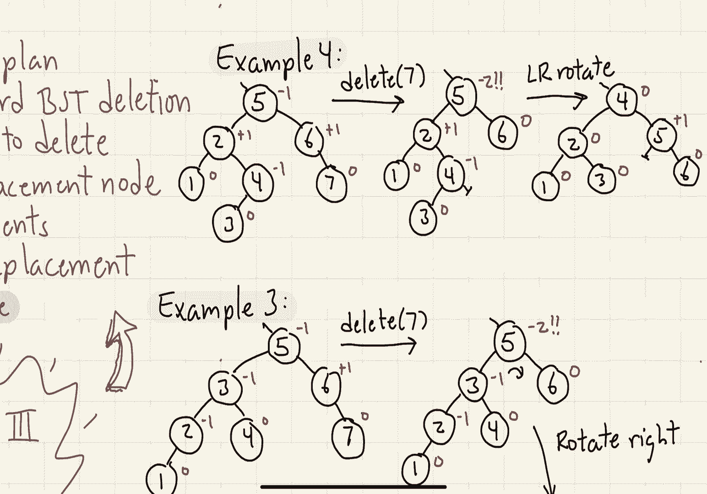

# 【双语字幕+资料下载】马里兰大学 CMSC420 ｜ 数据结构 (2021最新·完整版) - P14：L5- 平衡二叉树 3 - ShowMeAI - BV1Uh411W7VF

in this last segment on avl trees，we're going to talk about deletion and。

give a few examples of both insertions，okay let's talk about deletion。

first let's present sort of a big，overview of what our basic plan is going，well as with insertion。

our deletion procedure is going to be，based around the deletion procedure we。

we apply the standard binary search tree，deletion algorithm so let's recall what，that does。

first off we apply the normal finding，process to find the key of course if。

it's not there then we're going to file，an error i guess it there's attempt to。

delete a non-existent key，assuming we find it remember if the key。

has two children then we need to find a，suitable replacement node okay either。

the pre-order i'm sorry either the in，order predecessor or the inorder，successor and when we get the。

replacement node we copy the contents of，the replacement node to the original。

node okay and then we recursively delete，the replacement node okay。

because the replacement node is always，guaranteed to have either，zero children or one child。

we can just assume henceforth that we're，always deleting a note of that，particular form。

the only thing that we're going to add，that's going to be different for avl。

trees is as we're backing out of the，deletion process from deleting the。

replacement node we're going to be，checking the balance factors at each of。

the nodes and then performing the，necessary rotations as needed to restore，the avl height conditions。

observe that when we delete a node we，are going to be decreasing the height of。

some subtree of the tree by at most one，so therefore the balance factors are。

going to be affected by either plus or，minus one relative to where they were。

consequently we only have to worry about，a balanced factors that might have crept。

from being let's say a negative 1 to，being a negative 2 or being a positive 1，to being a positive 2。

let's consider the case where the，balance factor is negative 2 and the。

case where the balance factor is，positive 2 is just going to be a left to。

right symmetrical version of this，okay here's the scenario that i want to，imagine。

suppose we have a situation like this，where we have a node labeled d。

where the balance factor is negative 1，and we perform a deletion from its right。

subtree and that results in the right，subtree，let's say losing one in terms of its。

so what happens as a result of this，deletion is the balance factor now at d。

is going to be a negative 2 which is not，going to be acceptable。

what's the balance factor going to be at，b，well um there are two different。

possibilities depending on，whether the left subtree is heavier or。

the right subtree is heavier let's as，bef we did with insertion let's consider。

the left left heavy situation so let's，assume that the sub tree a is either。

has a greater height than in the sub，tree c or has equal height as the sub，subtree c。

in this case we're going to perform a，right rotation at the node d let's see。

okay so as a result of the rotation，the subtree e has moved down，one level。

the sub tree c has stayed at the level，that it is and the subtree a has been，pulled up by one level。

so as a result，the balance factor at d is either going，to be a zero or a minus one depending on。

c's height，and the balance factor at b is either，going to be a 0 or a plus 1 again。

depending on c's height however in any，case，all of these balance factors are valid。

and so we're happy at this point in time，there's one thing i want to point out，however。

suppose that c was shorter than a in，this particular case，if that were to happen then the overall。

height of the subtree has actually，decreased by one as a result of this。

operation and what that means is that，balance factors of the ancestors of d's。

node may be affected by this so the，propagation the rechecking of balance。

factors has to continue all the way up，to the root，the next case to consider。

is when the subtree at c is going to be，deeper than the subtree of a。

okay this is the left right heavy case，okay so the picture right at the moment。

c has the deepest subtree here，um，it is deeper than a so b has a balance，factor of plus one。

the node d had a balance factor of，negative 1，and as a result of the deletion which。

occurred inside the subtree e d is now，going to have a balance factor of。

negative 2 which we cannot accept，in this case we're going to have to。

perform a double rotation so let's，further expand the structure of that，subtree rooted at c。

okay so c has two sub trees c prime and，c double prime，we don't know actually which one of the。

two is going to be the deeper of the two，but as i said before the assumption。

we're going to make in this particular，case is that one of those two subtrees。

is at least one level deeper than，b's left sub tree a，so to fix this one we're going to apply。

a left right double rotation that is to，say we're going to perform a left。

rotation at b followed by a right，rotation at d and let's see what the，result is going to be。

okay so after the rotation the sub tree，a stays at the same height that it was，before。

both c prime and c double prime have，been pulled up by one level so again。

assuming whichever one of those was，deepest it's now basically at the same。

level as a and the sub tree e has，dropped down one level okay so that。

little x with a deleted item is not，appearing inside of my tree so now e and。

a and the deeper of c prime and c double，prime are all at the same level，so the final upshot is。

that although the balance factors in b，and d well we're not quite sure what。

they are but whatever they are they're，going to be in the valid range。

the key however is going to be that the，balance factor at c is going to be，exactly zero now。

which is great because now we're，basically in a state where everything is，in good shape。

however again i should notice that if，you look at the depth of the original。

tree and the depth of the tree after the，rotation the depth has actually come。

down by one and that means again that we，do have to consider the rebalancing at。

the ancestors of this note to see，whether any of them is out of balance。

well the cool thing about the code is，that it is very similar to the code for。

the binary search tree we've already，constructed all the infrastructure we。

need with the deletion routine of，putting together the rebalance routine。

and the various utilities for updating，and computing the heights of various，subtrees so um yes so。

all that the code looks like now is just，you just copy over the bst deletion code。

of course you have to change bst nodes，into abl nodes but otherwise it's。

exactly the same and the final return，statement instead of returning p returns。

rebalance on p where rebalance was，defined in the previous segment。

okay to finish off this segment let's，give a couple of examples of both。

insertions and deletions from avl trees，okay consider this avl tree with the，given balance factors。

and let's suppose i perform an insert of，the key 5。the first thing i'm going to do is just。

to apply the standard，binary search tree insertion algorithm。

and insert 5 at the appropriate location，and then let's start walking back up the。

recursion path that is the path back up，to the root recomputing the balance。

factors as i go if you remember our code，stores the height of the tree but it。

recomputes the balance factors at each，point to determine whether the avl，conditions are satisfied。

so as we're backing out from 5 we，recompute 4's balance factor which is。

going to be a plus 1 because it's heavy，on the right we recompute 6's balance。

factor minus 1 because it's heavy on the，left and then we recompute 9's balance。

factor and 9's balance factor is -2，because it's double heavy on the left。

and now we have to take action，okay so after performing the rotation at，node nine。

the nine moves down the six moves up um，that pulls up the heavy four five，subtree that comes up。

the seven flips over and it now becomes，nine's left child and the ten remains as。

nine's right child and um let's see the，balance factors that might change are。

going to be those at six and nine，so recomputing the balance factors at。

six and nine we see now that basically，everybody's in good shape and，everybody's happy。

and as i said before notice that the，height of this subtree which is 2 is。

exactly the same as the height that it，was before we actually did the insertion。

so now we actually know at this point in，time well even though the algorithm is。

going to go back and recompute balance，factors it actually doesn't need to do，so。

okay let's try another example of，insertion，let's see if we can arrange one where。

we're going to have to do a double，rotation，let's start with the same tree that we。

used in the previous example and this，time，let's insert the key eight。

so as before we apply the standard，binary search tree insertion algorithm。

and then we're going to work our way，back up from that newly created eight，node and。

update the balance factors as we go，okay so as i'm working my way back up i。

recompute balance factors for seven for，six for nine when i get back to nine i。

see that the balance factor is out of，whack right the balance factor is。

negative two we're doubly heavy on the，left side so we need to take action now，in this case。

not the um we have a left right heavy，situation in the sense that when i look。

at nine's left child its right，grandchild left right grandchild is。

heavier than the left left grandchild，and that's the reason we perform the，double rotation。

so after that double rotation the seven，gets pulled up，its two sub trees will be the six and。

the nine okay，the six keeps its left subtree it takes，over seven's old left subtree as its。

right subtree b that was just a null，pointer and the nine as its new left。

subtree gets uh seven's old right，subtree that is the eight，okay um let's also update the balance。

factors again all the balance factors，have essentially stayed the same except。

for the nodes that were involved in the，rotation but let's just put them all in，anyway。

okay so at this point we see now that，node seven has a balance factor of zero。

so again that's just perfect and again，notice if you look at the height of that。

subtree that was actually the subtree，that was rooted at 9。 it had a height of。

2 before the insertion it has a height，of 2 now after the rotation is finished。

so we actually know at this point in，time that nothing is going to be。

affected going the rest of the way up，the tree but like i said nonetheless the。

algorithm is just going to keep you know，returning and resetting you know heights。

and balance factors and so forth but，really nothing is going to change at，this point。

okay next let's try an example of a，deletion uh consider this tree and let's。

after we delete the keys seven，um，again the only balance factors that are。

going to be affected are you know，seven's ancestors so six gets its。

balance factor updated to zero we back，up to five recompute its balance factor。

and we see that it's actually got a，balance factor of negative two it's。

doubly heavy on the left side so we need，to take action there。

in this case what is the action going to，be well again this is going to be a left。

left heavy case that is to say if you，look at five's left，left grandchild that tree has a you know。

it is deeper than，five's left right grandchild so this，means we're going to be doing a single。

right rotation to fix this one，okay so the rotation will basically move。

the three up push the 5 down right，the 3's right child will move over and，become 5's left child，and。

let's see as far as the balance factors，are concerned the 3 and the 5 those are。

the notes that are going to be affected，so we need to recompute their balance。

factors 5's balance factor is going to，be a zero 3's balance factor is also，going to be a zero so。

at this point in time everybody's happy，however notice something notice that the。

original sub the original tree had a，height of one two three and after the。

operation the resulting tree has a，height of just two so if this had been。

not the entire tree but this had been a，subtree of a larger tree i would have。

had to continue up higher and higher，because since the，height of this tree has actually。

decreased that can affect the balance，factor of nodes that are higher in my。

tree so again that would apply if it had，been the case that let's say 3 had not。

been the root of the tree but had just，been a you know a regular internal node。

okay for our final example let's see if，we can do a deletion that's going to。

involve a double rotation，so，in this case let's imagine that i delete，the key 7 from this tree。

after 7 is deleted，you'll notice that the balance factor at，6 now is updated to 0 the balance factor。

at 5 is updated to negative 2 and that，has to be fixed，so in this case what i do is i look at。

5's left child 2 and then i look between，its left and right children right and。

see which is deeper in this case the，left right child is，let's say that subtree is got greater。

height than the left left grandchild so，this means i'm going to have to do a。

left right double rotation，okay so what does this rotation do well。

it pulls the four up to the root of this，little subtree okay the two and the five。

go down on the left and right sides，five keeps its same right child but it。

adopts fours right child as its new left，child well that was just a null pointer，and。

the node two now adopts，[Music]，four's left child as its new right child，that's the node three。

again the only nodes whose balance，factors are going to be affected are the。

three nodes that were involved in the，rotation and so we have to update their，balance factors。

and great notice that all the balance，factors are in the valid ranges。

again as in the previous example notice，that the entire subtree here has。

decreased its height the original，subtree had a height of three the。

updated subtree has a height of two and，this means had for not been the root of。

the tree had this been a you know had，this note been a note that is lower in。

the tree we would have to continue，propagating the，the，rebalancing process up until we got to。

the root，okay well that about wraps things up for，the avl tree the only thing that i。

didn't mention i guess that i should，have is well what is the running time。

well notice that the running time of all，the algorithms is proportional to the。

height of the tree and as we showed in，the first segment the height of an avl。

tree is always going to be logarithmic，in n so therefore find insert and delete。

