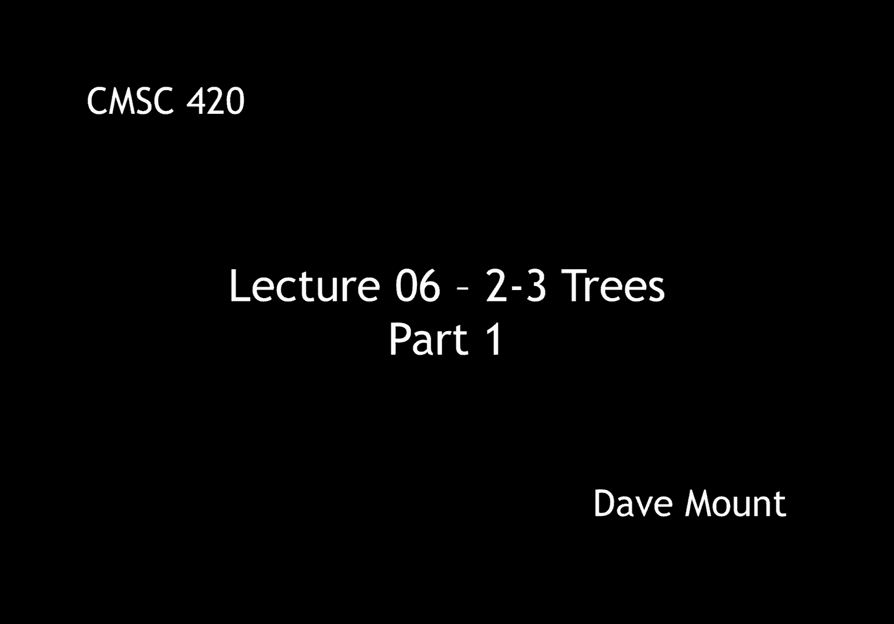
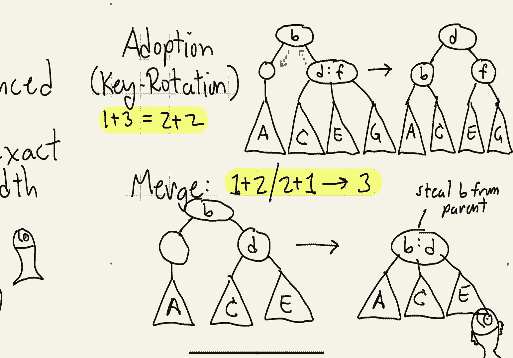

# 【双语字幕+资料下载】马里兰大学 CMSC420 ｜ 数据结构 (2021最新·完整版) - P15：L6- 2-3树 1 - ShowMeAI - BV1Uh411W7VF

hey everyone in this segment we're going，to talk about a different data structure。

last time we talked about the avl tree，which was a height balance binary search，tree。

and today we're going to look at a data，structure called a 2 3 tree in which the。

heights instead of being let's say close，to balance are going to be exactly，balanced。

and the width of a node instead of being，a regular binary node with a left and，right。

child is going to be a variable width，node，so there are going to be two different。

node types in a 2 3 tree，first is a 2 node it has one key and two。

children just like a regular binary tree，node，here's a picture of one of these and。

in the manner that i have done in，previous lectures i'm going to label the。

trees according to an inorder，progression so the sub tree a，the keys there are going to be less than。

b b is going to be less than the keys in，the subtree c，three node is going to have two keys and。

three children and the，organization is going to be such that，the two keys basically sit between the。

three children so a is less than b，c is between b and d and e is going to，be greater than d。

one difference with the，avl tree where the heights were variable。

is in the 2 3 tree all the leaves are，going to reside at exactly the same，depth within the tree。

we can define a 2 3 tree formally as，follows，it is either going to be a。

empty tree in which case its height will，be by convention negative one the same。

that we did with avl trees，next，it can be a root which is a two node，and。

connecting two sub-trees together each，of which is a two-three tree of height h，minus one。

and analogously the root can be a three，node in which case it has three。

sub-trees and again each of which is a，two-three tree of height h minus one。

okay so here's an example of a 2 3 tree，of height 2。the important things to note are these。

first off the nodes of the tree are，either two nodes or three nodes and you。

can mix them in any way you like the，leaves can either be two nodes or three。

nodes the root can be a two node or，three node it just doesn't matter。

the important thing however is all the，leaves have to be at the same level of。

the tree so in this case，all the tree all the leaf nodes are at，depth two。

remember zero is the root uh one is the，children of the root and two are the。

grandchildren of the root，so as with any balanced uh search tree。

uh the first thing we wanna know is what，its height is going to be in the worst。

case and a 2 3 tree is guaranteed to，have a height that is o of log n。

this is in fact pretty easy to see，because if you think about it what's the。

worst case for a 2 3 tree well basically，it could be the sparsest tree possible。

in which case it only has two nodes if，that's the case then it's a perfectly，balanced。

you know binary tree so it's going to，have height that's basically going to be。

you know log base 2 of n，and in the best case all the nodes are。

going to be three nodes in which case，it's going to have a height that's going。

to be log base 3 of n which is going to，be even smaller，okay so in summary up to you know floors。

and ceilings and constant factors and，such，the height is going to be somewhere。

between log base 3 of n and log base 2，of n，okay so if you remember with the abl，tree。

we essentially had two different ways in，which to maintain the order in that tree。

we either did rotations right single，rotations or double rotations。

in a 2-3 tree of course we're going to，have a different kind of a local。

operation that's going to help us，maintain the order in the tree。

the there are going to actually be three，operations here the first is called。

split second called merge and the third，one i call adoption but that's kind of。

you know my own term it's usually，referred to as key rotation，so as a little conceptual device that。

we're going to use just in our，illustrations，we're going to allow something called。

one nodes and four nodes，just to exist for a short while we'll，see that whenever we do an insertion。

we'll，temporarily create a four node but then，we'll immediately fix it by converting。

it back to either a two node or a three，node or some combination thereof right。

and when we're doing deletions we'll，occasionally allow for the existence of。

a one node but again as soon as we，create one of these things we have to，immediately resolve it。

in the actual data structure you're not，going to see these kinds of nodes so。

like i said they're really just there to，help us draw our pictures。

okay our first operation on two three，trees is going to be called a split。

its job is to take a four node and to，convert it into，two two nodes so i use the notation four。

goes to two plus two，okay so suppose we start with the，following structure somewhere in our two。

three tree so again as usual you know a，c e and g are just going to represent。

generic 2 3 nodes remember that all of，them have exactly the same height as，subtrees。

and here's what the split operation does，so what you see that we get is going to，be a two node b。

that lies between the sub trees a and c，and the other two sub trees e and g are。

going to go with a node labeled f now，you'll notice something is a miss here。

what happened to the key d well we have，to do something with d and what we do。

with it is we basically push it up to，our next operation is going to be called。

merge okay it's a kind of the dual to，the split operation，it's given a combination consisting of a。

one note and a two node or a two node，and a one node it puts them together and，forms a three node。

so the input to the merge operation is，going to be two sibling nodes as we said。

before one is going to be a one and the，other a two and the other or the other。

possibility is it's two and a one we're，doing the one and two case。

and what this operation does is it's，going to put the three subtrees a c and。

e together in one node but remember to，form a three node i'm going to need to。

have two keys well i've got the key d，but the one node is not providing me。

with any key so the way i'm going to do，this is i'm going to steal the key that。

sits between them in the parent node，in this case this is the key b，notice in this case i've drawn。

that parent node as if it's a，a two node it could be a two node or a。

three node but in general there's always，going to be a key that sits between。

these two subtrees and that's the one，that i'm going to borrow。

the final operation that we're going to，look at is called adoption like i say。

that's my terminology it's more often，called key rotation what it does is it's。

taken two sibling nodes one is with one，node and one is a three node and what。

happens is the one node i guess being，lonely it's going to adopt one of the。

children from the three node and in this，way it's going to make two two nodes。

okay so let's see what the setup is for，an adoption i've got two sibling nodes。

one is a one node containing a single，sub tree a the other is a three node um。

containing the subtrees c e and g，and because they're siblings，the parent node which could be a two。

node or three node is guaranteed to have，a key that is sitting basically。

discriminating between these two，subtrees in this case this is the value，b。

so here's the idea and adoption，um i guess i，view my sibling as having too many。

children and so i decide that i'm，basically going to steal one of my。

siblings children okay so i don't know，if this would work in real societies but。

it works fine in data structures however，you'll notice something a little bit。

tricky here which is in order to get the，discriminations right right notice that。

my sibling had the two keys d and f but，if i want to discriminate between a and。

c the key that i need to discriminate，them is b so i have to take that down。

from my parent and so what happens is，i'll give up the key d to my parent。

so you can kind of see why i call this，adoption if you think about what is。

happening with the children，be that node that's the leftmost sibling。

is basically adopting the child from the，right sibling，however the other way to think of this。

is in terms of what happens to the keys，in this case the key d rotates up to the。

parent and the key b rotates down to the，left child by the way this can work in，either direction。

remember the parent node that stored the，b in this case it could have been a two。

node or a three note um the idea is，you're always allowed to basically use。

this operation to move um or to adopt or，to sort of steal children from your。

immediate siblings however notice it，only works for your siblings you're not。

allowed to let's say adopt from cousins，or second cousins or third cousins or，something like that。

okay so that finishes off this segment，and in the next segment we'll talk about。

how to use these operations to perform。

