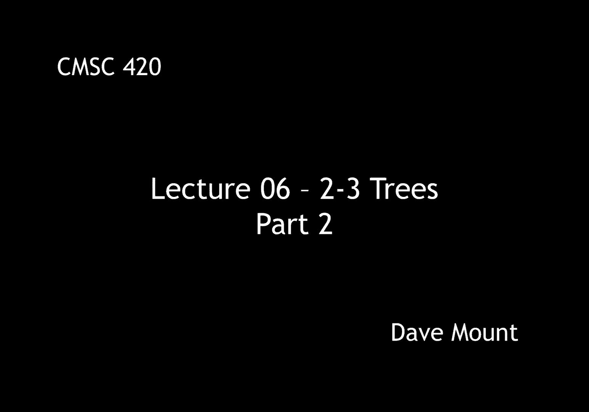
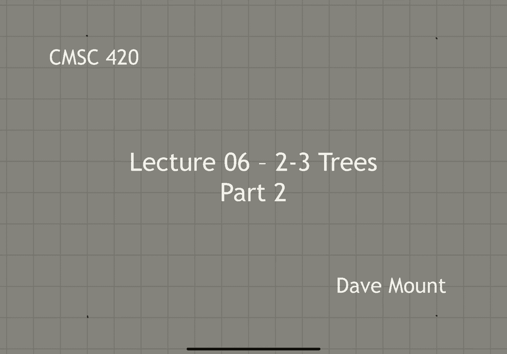
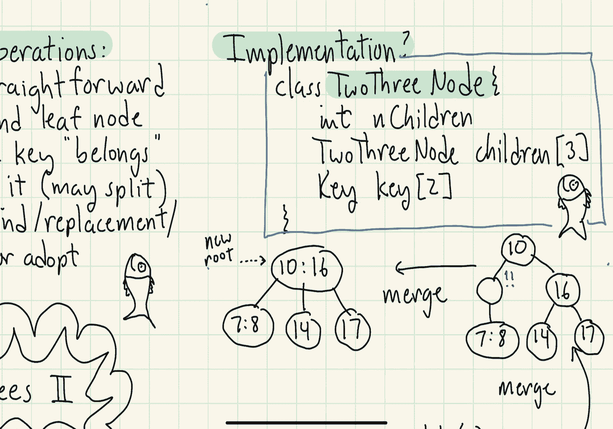

# 【双语字幕+资料下载】马里兰大学 CMSC420 ｜ 数据结构 (2021最新·完整版) - P16：L6- 2-3树 2 - ShowMeAI - BV1Uh411W7VF

hey everyone let's continue our，discussion of two three trees in this。

segment let's say a little bit about the，dictionary operations，well first off the find operation is。

just a straightforward extension from，the find operation for binary trees。

next the insert operation we，perform the find operation go down to。

the leaf level and find the node where，the key belongs right the key should not。

be there if it is there then we signal，an error，we don't add it you know unlike the avl。

tree where we put in the key below the，node we actually just insert the key in。

this node now this might convert a three，three node into a four node and if so。

then we have to perform a split，operation on this node，and finally the delete operation。

will involve a combination of first，finding the node，if the node is not in one of the leith。

leaf nodes and what we're going to do is，we're going to find a replacement node。

in a leaf node and then we do the，replacement basically we do the deletion，i'm sorry from the leaf。

okay that may result in a node becoming，too small which we're going to remedy by。

well in contrast to my usual approach of，giving pseudocode，i think what i'm going to do is i'm just。

going to provide some examples of how it，is these procedures work and i'll kind。

of leave it as an exercise to convert，these examples into actual pseudo code。

let's take a look at this tree and，suppose we wanted to insert the key，value six。

how would we do that，the first part of the insertion process，is like i said we find the leaf where。

the key would fit，so six is bigger than four we go to the，right subtree。

six is smaller than 8 so we're going to，go to the leftmost subtree okay and then。

we get to the leaf level and then we're，just going to insert 6 between 5 and 7。

here okay but the problem is we've just，created a node which is got three keys。

inside of it in other words this is a，okay we can't tolerate the four node。

containing the five six and seven so，we're going to perform a split on that。

now in the split operation we showed it，having four trees in this case all four。

sub trees can be just thought of as four，null pointers，we break the。

um three note excuse me this four node，up into two two nodes that's a five and。

a seven and each one is going to have，two null pointers so effectively the sub。

trees are being distributed between them，but remember in a split operation i have。

an extra key left over that's the middle，key in this case it happened to be that。

the middle key was the six the one we，just inserted but in general it's just。

going to be whichever key lies in the，middle between the three different keys。

and that gets pushed up and inserted，inside of the parent now notice when。

this happened the parent is well it's a，legitimate node but it is a four node。

and so we're going to have to do，something to fix that，one okay so remember when we do a split。

right the left，key that is the six in this case that，becomes a separate two node the。

rightmost key the 12 becomes a separate，two node and the middle key which is the。

8 gets inserted into the parents node，okay and voila we're now done with the。

insertion process and you can see that，this is a legal 2 3 tree。

you might ask a question at this point，uh you might say hey wait a minute um。

you know this splitting process keeps，injecting and you know injecting a key。

up to higher and higher levels in the，tree uh what happens when we pop off the。

top of the tree that is what happens if，there is no parent that is we're already。

at the root in this case what happens is，the split operation is going to create a。

brand new root node with the key that，got that just got created so for example。

um if this four node had not been above，us as the parent node the eighth node。

would have just become the new root of，the tree，okay next let's take a look at an。

example of how to delete a node，consider the tree，shown over here and suppose that we want。

to delete the key 5。 by the way i'm，going to cheat in almost all of my。

delete examples you'll notice that，whenever i delete a node from a 2 3 tree。

i'm always deleting from the leaf level，which is very convenient。

if you weren't deleting a leaf that is，let's say i wanted to delete the key you。

know something like six for example what，i would do is i would go and find a。

replacement node at the leaf level copy，it back to the to the six okay that is。

the internal node where it is and again，i do do i do this in exactly the same。

way we did for um for binary search，trees i would either take the sort of。

the inorder predecessor or the inorder，successor either one would work okay you。

copy the node back to six so that this，way whenever you're doing a deletion the。

thing that you are actually deleting，will always be a leaf level node。

okay in this particular case what，happens i go down and i delete the five。

okay that creates essentially an empty，node here that is it's a one node right。

it's a one node remember that a one node，has，zero keys and one child in this case the。

one child is just going to be a null，pointer，but in any case i need to remedy this，and。

the question then is how do i remedy，the，remedy for deletion is going to be a。

little bit more complicated than what it，was for insertion for insertion you can，always do a split。

for a deletion there are basically two，cases we have to consider。

okay the first possibility is we look to，our immediate left and our immediately。

immediate right and check to see if we，have a sibling on either side that is a，three node if so。

that sibling's got way too many children，and we're going to steal one of them。

okay so we're going to perform an，adoption or like i said a key rotation，would be the other term。

well if a，adoption is not possible we know that，any siblings that we have and we must。

have at least one sibling is going to be，a two node，okay so if this is the case what we're。

going to do is we're going to merge with，that sibling that's going to restore us。

to be a kind of a whole 2 node however，in the process what we're going to have。

to do is we're going to have to steal a，node from our parent that is i'm sorry。

we're going to steal a key from our，parent and of course this is going to。

result in the process potentially，okay so returning to our example uh。

remember that we had this uh left child，of the sixth node um was just a one node。

and we have to fix that，um we look to its siblings in this case。

it only has one sibling that's the seven，remember you can't do anything with your。

cousins or second cousin so i don't even，look at that three node that's sitting。

next to me i just look at my sibling，seven，the sibling seven is a two node so it i。

cannot adopt or steal any children from，that node so what i'm going to do。

therefore is i'm going to perform a，merge with the 7。 remember that causes。

me to basically steal the intermediate，key 6 from my parent，okay so after the merge is done what has。

happened is i've stolen the key six from，my parent and now the problem is my。

parent because it was just a two node，has now become a one node so that's not。

acceptable and i've got to do something，for it，okay so when this node looks to either，side of it。

um it has the two on one side which is，just a two node but on the other side。

it's got the 10 and 16 and the 10 and 16，is a three node so again。

my sibling has more children than uh，than needed so i can steal one of those，children。

okay so let me fill back in remember the，the 10 16 note had a 9 a 14 and a 17 as，its children。

so i'm going to steal that closest child，the nine child i'm going to bring it。

over into my note here okay again i need，a discriminator between these things and。

the way i do that is i get that from my，parent so my parent is going to provide，me the key value。

8 in this particular case and that's，going to come down to the current node。

and then my sibling is going to give up，its key value 10 and that's going to get。

sent up to the parent，okay and so this is what the final tree，is going to look like um again you may。

want to verify all the basic properties，of the tree it should be the case that。

when i look at things in in order，everything appears in the proper order。

all the leaves should be at the same，level and they are and all the nodes。

should be two three nodes and they are，so at this point in time i'm done with，so。

given the complexities of deletion let's，try it out on another example。

particularly what i want to do is i want，to see what happens when the deletion。

propagations go all the way back to the，root，okay so let's start with this tree this。

is about as skinny as a 2 3 can get a 2，3 tree can get because there's just two。

nodes inside of it so pretty much，anything i delete is going to cause，problems。

let's suppose we delete nine from this，tree，okay so when the nine gets deleted right。

its two node has just become a one node，so it has no keys at all and of course。

that's going to be a problem，remember what the rules are right the。

rules are we look to our siblings to see，if we can steal one of its children okay。

in this case the seven is a two node，can't steal from a two node again。

remember you don't look at the 14 you，don't look at cousins or second cousins。

okay so since the seven will not help us，then that means we're going to have to。

do a merge so we're going to merge with，the seven and remember the merging。

operation steals a key from the parent，okay so the merge operation。

puts the eight and seven together into a，three node okay but because we've stolen，something from the。

parent node the parent node has now，become a one node and now that one is，critical。

so what do we do in this case well we，look to our sibling okay the sibling in。

this case is not a three node it's just，a two node so again our only opera our。

only option is to perform a merge with，that node and what that's going to do is。

that's going to pull down the key 10，from the root，okay and so the interesting upshot of。

this operation notice is that our old，root has effectively gone away when we。

stole that key from the root，we no longer have a node there to hold a。

hold a root value right it doesn't make，sense to have a one node at the top of。

the tree and so we just make this three，node that came about from the merge。

operation we essentially create make，that the new root so it's an interesting。

thing to observe that with abl trees and，binary search trees you always grow from。

the leaf level that is to say you add，more leaves to the tree which is a。

natural thing to do like this is，botanically this is how trees naturally。

grow however with 2-3 trees the，interesting thing is you always grow and。

you essentially shrink from the root，itself，when you do merges and they propagate。

all the way back up to the root you，effectively get a new root node and when。

you do deletions and the merges，propagate all the way back up to the。

root you effectively lose your root node，okay okay so the only thing that i。

haven't done is i haven't given you sort，of the implementation and，well。

okay i'm not going to give you the，pseudo code implementation actually。

later in the semester we're going to，study a closely related data structure。

in fact we're going to see a number of，closely related data structures so the。

basic ideas here will be reinforced by，other data structures but let me say a。

little bit about the node structure so，the question is how would you set up a。

node for a 2 3 tree there's two natural，methods to do this one method would be。

to actually derive a generic class and，then to have a two node and a three node。

derived from there but i would propose，that a better way to do this would be to。

have a variable width node in which you，have a node that stores an array of，pointers。

to the children and an array of key，values and you can fill that array up。

you know with the appropriate number so，let me show you what that might look，like。

okay so here's a possible uh node，structure，we're going to have the following three。

fields the first is going to be an，integer telling us the number of。

children and because two and three nodes，right are the only possibilities here。

that number is either going to be a two，or it's going to be a three。

um the next will be an array that，contains the pointers to the children，okay so these would be。

an array of size 3 of type 2 3 node and，again we're expecting to use either two。

of the entries in there or all three of，the entries in there and then the last。

thing is the key rather than having a，single key value as we do for binary。

search trees we're going to have an，array that can hold up to two values。

okay by the way what about the values，right they're usually storing keys and。

values well i could have one more，an array that would store the，value entries as well。

okay that is all i want to say about two，three trees um，we'll like i said we'll be presenting。

details related to two three trees when。

