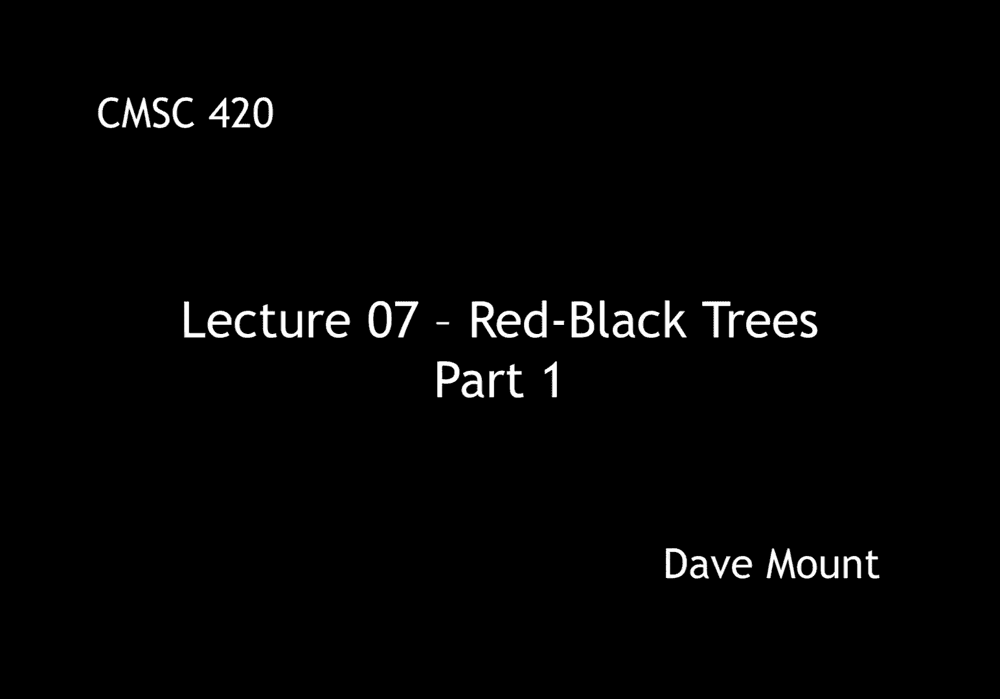
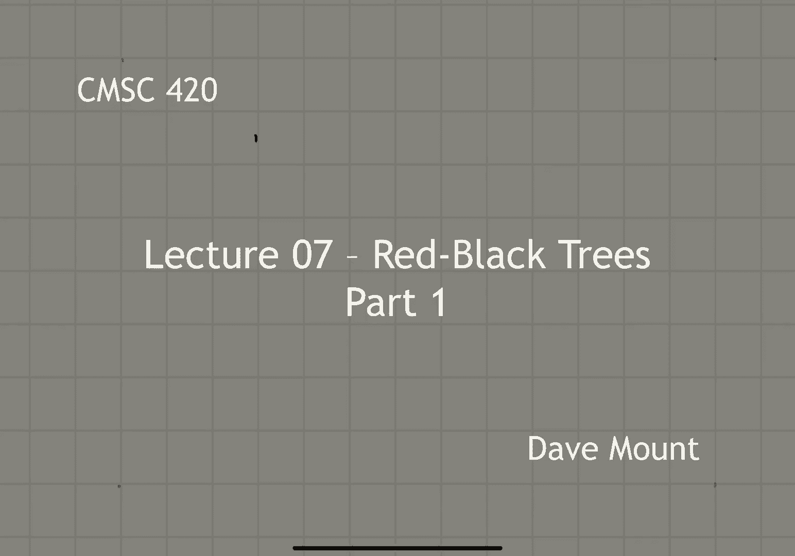
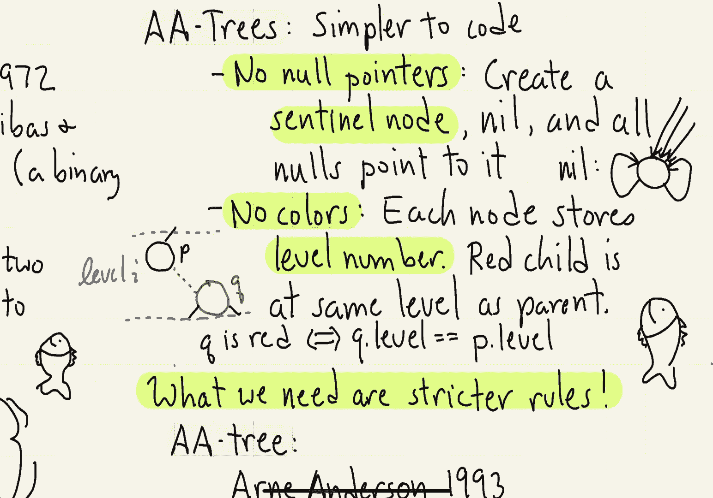

# 【双语字幕+资料下载】马里兰大学 CMSC420 ｜ 数据结构 (2021最新·完整版) - P17：L7- 红黑树与AA树 1 - ShowMeAI - BV1Uh411W7VF

okay folks，today we're going to talk about red，black trees and the related topic of aa，trees。

let's begin with a little bit of history，in 1972，bayer created the data structure called。

the 2-3 tree，one of the issues that arose with two，three trees as we mentioned last time is。

that they are not binary trees which is，what everybody kind of likes to use in，this area，so。

about six years later guibis and，sedgwick，in 1978 came up with a binary equivalent。

of two three trees which they called red，black trees，the question that you might ask is why。

were they called red black trees and，there is a rumor，that when gebus was working on this he。

had basically two pens a black pen and a，red pen and he used one color to draw。

nodes of one type and the other color to，draw nodes of the other type。

so the main idea is how we're going to，encode the three nodes remember two。

nodes are already binary nodes the way，we are going to encode a three node is。

by creating a two node sequence as，follows，let's suppose we have a，three node。

b and d with the children a c and e，okay what we're going to do is we're，going to create a new。

pair of nodes called b and d，okay，b is going to be the parent d is going。

to be its right child and then the，subtrees hanging off will be a c and e。

observe that as far as a binary tree，goes this is exactly the order we want a。

first then b then c then d and then e，and gebis and sedgwick's idea was oh。

we're going to consider this pair to be，a red black pair with the red node as，the parent。

i'm sorry with the black node as the，parent and the red node as the child and。

i'm going to draw it in this manner，always using a dashed red link whenever，i draw a red node。

so here's a little example of a red，black tree consider the 2 3 tree drawn，here on the left side。

okay what we're going to do is every，regular 2 node that is a regular binary。

tree node is just going to stay in the，same form but the three nodes for。

example starting with the 411 at the top，we're going to make that into a node。

pair right with the 4 at the top and the，11 underneath same we're going to do。

with the 5 7 combination and with the 15，20 combination notice at the end of the。

day we now have a standard binary search，tree which has been used to encode the，2-3 tree。

so now rather than making reference to，the 2-3 tree what are the basic rules。

that characterize when a tree is a red，black tree well let's see what they，would be。

first off every node of course is going，to be labeled either red or black。

the root node is always going to be，black right it's either going to be a。

regular two node which means it'll，naturally be black or it'll be a the top。

of a three node in which case it will be，black we're going to treat all null。

pointers as if they were essentially，pointers to black，nodes if a node is red then both of its。

children need to be black well why，remember a red node comes about as the。

lower combination in any red in any um，you know three node okay and what that。

means is its children are all either，going to be two nodes that is to say。

they're going to become just regular，black or they're going to be the top。

nodes of a three node combination which，means they're going to be black。

finally if you remember in a 2 3 tree，all the nodes have exactly。

excuse me all the leaves are at exactly，the same level so what does this imply。

well if you think about it the number of，levels that we go through in the 2 3。

tree corresponds exactly to the number，of red nodes that we see。

so the essential way of encoding this is，that every path from the root all the。

way down to a null pointer has the same，number of black nodes in it well the。

natural question that we ask with every，one of the balanced search trees that we。

look at is what is its height going to，be，and unsurprisingly the same is going to。

apply to the red black tree namely a red，black tree that stores n keys will have。

a height of log n there's a very easy，way in which to see this。

observe that the height of the red black，tree is at most twice the height of the。

2 3 tree right because in the worst case，every single node was a three node and。

we replaced every node by a pair of，nodes okay so it can't be any worse than。

twice that height and we already showed，that every 2-3 tree has height log n。

the next question to ask is a very，natural one well you've given us a set，of five rules here。

do those rules completely characterize，the encodings of two three trees that is。

to say you know is any binary tree that，has been labeled red and black which。

satisfies those five rules going to be，the encoding of some 2-3 tree the。

somewhat surprising answer is no in fact，it is not the case there are some trees。

that satisfy these five rules and yet，they do not correspond to the encodings。

that at least we've described here of，two three trees，how so，well the first possibility is that i。

could have a situation where instead of，putting the，red child on the right of the parent。

node i could put the red child on the，left of the parent node and you'll。

notice there's nothing in the rules that，we've given before that would，distinguish。

the red child being on the left versus，the red child being on the right that。

would be a perfectly valid，red black tree according to our rules。

there's even a crazier example of this，however which is i could have a node。

that has two red children again if you，look at the rules there's nothing that。

forbids that because when you look at，the depth of nodes in the trees you're。

only constraining the black depth，this is perfectly valid it's an。

interesting thing to observe however，that this is not so much a violation of。

the rules for two three trees but rather，it turns out to be a valid way of。

encoding a more general class of trees，called two three four trees in other。

words if you imagine that we were to，allow not only for two nodes and three。

nodes but we were to allow for four，nodes that contain each，three keys and four sub-children this。

would be a valid way of encoding that，and well although we've only talked。

about two three trees there is in fact a，data structure called a two three four。

tree and red black trees provide one way，of encoding two three four trees。

okay well suppose that it's the case，that i really want to enforce the。

encoding that i described earlier for，our two three trees how are we going to。

do that well it's clear that we need to，have some stricter set of rules so let。

me add some rules that will enforce our，particular way of encoding two three。

trees as red black trees this idea in，fact was suggested around 1993 by arn。

anderson arn anderson was a famous，researcher who did a lot of work with。

data structures of various forms，anderson's idea was that the problem，with red black trees is that。

the，let's say the code needed to manipulate，the trees is too complicated and to。

simplify the code it would be nice if we，could，sort of um，you know place stricter restrictions on。

what the structure of the trees are so，he had a rule number six and rule number。

six says each red note can arise only in，one way as the right child of a black。

node notice that this rules out the two，possibilities that i had described，earlier as alternatives。

and it turns out that arn anderson's，rule in fact exactly encodes if you look。

at the six rules right the original five，rules plus the sixth rule。

now you can show that you actually，honestly encode the 2 3 tree encoding as。

a binary tree that is to say this is the，new version of the red black tree but。

because this is not really exactly the，original definition of a red black tree。

we call this the a a tree for arn，anderson，arn anderson had a number of additional，ideas as well。

his whole，his whole sort of motivation was to come，up with a，simpler version of the red black tree。

from the perspective of coding we're not，going to talk about the actual code for。

the red black trees but take my word for，it that although red black trees are，very fast in practice。

the code tends to be very long because，there's lots of special cases that have，to be considered。

art anderson's first kind of clever idea，was we're not going to have any null。

pointers really how can you have a tree，without null pointers，well。

anderson's idea was we're going to，create a special sentinel node we're。

going to call that nil instead of null，okay and，all the null pointers instead of just。

being null are going to be pointing to，this special node，nil has the following structure okay。

it has a left child and a right child，that both both point right back to it。

you might say well what's the advantage，of having nil normally in our code we。

spend a lot of time checking to see if，let's say you know dot left or no dot。

right is not equal to null，the nice thing about，setting up a tree in which you have no。

null pointers is i never need to make，that check，okay in other words it is always the，case that。

you know pointer dot left and you know，or whatever no dot left and no dot right。

are always going to be well defined and，that makes the code a little bit simpler。

arn anderson's second innovation is i'm，not actually going to use colors okay i。

guess that was just you know gebis's，convention because he was using a red。

and a black pen i guess for drawing his，trees，anderson's idea instead is every note is。

going to store a level number what do i，mean by the level number well think of。

the level number as the level in the 2 3，tree that you came from，what this means is every black red。

combination of nodes those two nodes are，going to be at exactly the same level。

and so in particular if i give you any，pair of nodes p and q，okay where p is the parent black q is。

the red child of that，okay they're going to both reside at the。

same quote unquote level now we defined，level earlier in the semester i don't。

want you to confuse that notion of level，with this notion of level in this。

particular notion of level right this is，just an artificial number that we are。

assigning to every note of the tree and，in this case we would assign p and q to。

have both the same level that is level，whatever i，okay，so if you want to check to see whether a。

note is read that's actually pretty easy，all you have to do is check to see。

whether its level number is the same as，its parent's level number。

or by a similar token if you want to，know whether a node p，is the parent of a 2 3 combination all。

you have to do is check to see whether，the level of its right child is the same。

as the level of you if so then you are，the head of a，okay that's all for this segment in the。

next segment we're going to talk about，more of the details of aa trees and how。

