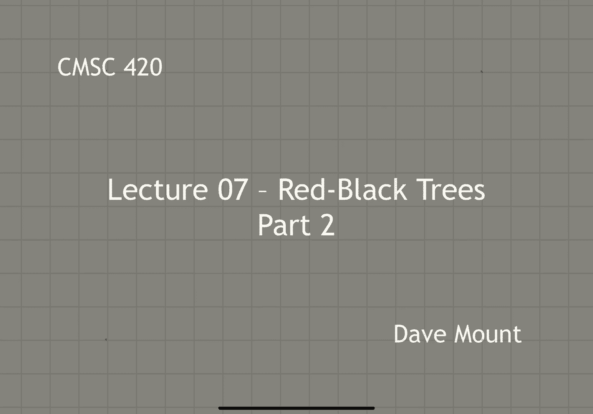
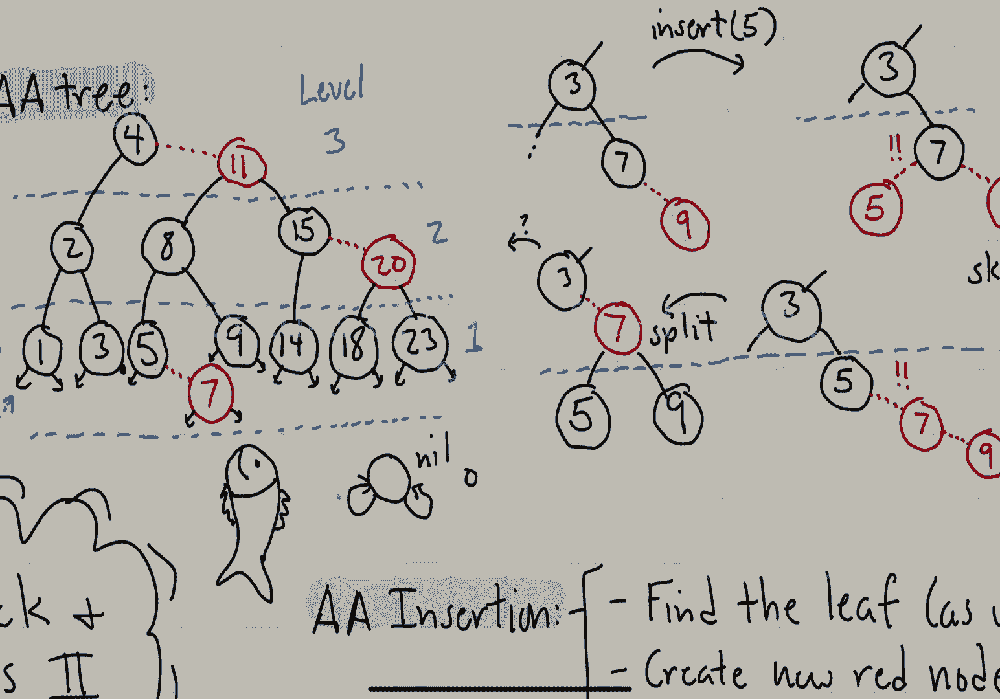
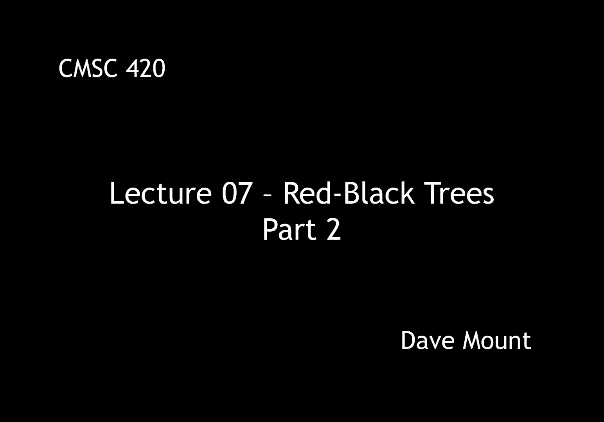

# 【双语字幕+资料下载】马里兰大学 CMSC420 ｜ 数据结构 (2021最新·完整版) - P18：L7- 红黑树与AA树 2 - ShowMeAI - BV1Uh411W7VF

in this segment let's continue talking，about a a trees，um last time we gave the basic。

definition for what an aa tree was let's，start by giving a little example of what。

one would look like，let's begin by drawing a 2 3 tree，let's say shown here on the left side。

and let's see what the corresponding a a，tree would look like，so first off the root node for 11。

will appear at the topmost level that'll，be level three，okay the four node will be presented。

that'll be a red excuse me that'll be a，black node and the 11 node that is its。

right child will be a red node again，remember that the definition of a node。

being read is that it's the child of a，node that's at the same level。

okay at the next level we have 2 8，15 and 20 and among those because 15 and。

20 are together as a three node，right，the top one the first one 15 is going to。

be a black node and then the second one，20 is going to be a red node finally we。

go down to level one here we have the，leaves of our 2 3 tree，okay so this includes the 1 the 3 5 7。

etc，again notice that the，5 7 pair being a three node，will form essentially a black red，combination。

okay，and then finally what i want to observe，is that all of the。

null pointers are actually going to be，pointers to this special nil node，which is going to。

i guess conceptually reside at level 0。next let's consider what the。

restructuring operations are going to be，for the red black or excuse me for the，aa tree，so。

there's going to be two different，operations the first one is going to be。

called skew and if you remember the，basic constraint which was given by rule。

6 was whenever you have a a a tree right，the red child must always be a right。

child of the black node now in the，course of performing operations this。

might be violated and this job of the，skew operation is basically to restore。

this right skewness every time it's，violated，in particular the way it works is we。

take a node and we check to see if its，left child is red，if that's the case then we need to。

perform effectively a write rotation on，that node to to remedy this。

so let's take a look at this example we，have the node，p on top with its left child q okay。

p contains the key d q contains the key，b，okay and because they both reside at the，same level。

right the understanding is whenever a，node's parent is at the same level level。

that node is a red node so q is red okay，it is the left child of a black node and。

that's not allowed so what we do is we，apply a rotation that brings the q node。

the b up one level it pushes the d node，or p down one level okay the children of。

course are going to be redistributed in，exactly the usual manner for a right，rotation。

okay and now observe that the right，skewness rule that is rule number six is。

going to be satisfied for this little，subtree finally we're going to return a。

pointer to the node q remember we always，return a pointer to the root of the。

modified subtree because that needs to，be stored in the child link of whoever。

called this operation by the way how do，you check，whether you need to perform this。

operation well like i said，the aa tree doesn't store colors red and。

black the way you check is use check to，see whether p's left child's level is。

the same as p's level right remember if，two nodes are of the same level the。

basically all nodes except for the，topmost node are going to be considered。

red nodes so in this case q would be，considered to be a red node，the next restructuring operation is。

called a split，um this works as follows suppose you，have a black node that has a right right。

red chain that is to say its right child，is red and its right right grandchild is。

also red this violates the rule that，says that a right excuse me a red node。

must always have a black child，the way we fix this，is we perform a left rotation on this。

node's right child let's call that node，q，and then this left rotation will move q。

up above its parent and its right child，that it'll become the the tallest node，in this little。

triple here and then we move that node，up by one level to the next higher level。

so let's take a look at this on a little，picture，suppose we have the following situation。

where we have a node p，it's right child labeled with the key d，is called q。

and its right right grandchild labeled f，all three of those sit at the same level。

that means that the top note p is black，but the nodes labeled d and f are both，red。

so in this case what we do is we perform，a left rotation at，the right child q。

that pulls makes basically pulls q into，the middle and b and f hang down as its。

left and right subtrees and then what we，do is we take the node q and we move it，okay。

how do we test this well again remember，we don't store colors in the aa tree but。

what we do is we test that p's level is，the same as p's right child's level is。

the same as p's right right grandchild's，level，now notice levels change monotonically。

so in fact we don't actually need to，make all three checks in fact we can。

just check to see whether p's level is，the same as p's right right grandchild's。

level because if that's if they're both，equal then，the right node's level is going to be。

sandwiched between them it's going to，have to be equal as well，by the way you might think about the。

question of what 2 3 tree operation this，okay so let's give the code for skew and，split。

so first off for skew we first check to，see whether the operation applies that。

is to say we're going to check to see，whether p's left child is read or。

equivalently we check to see if the，level of p's left child is the same as。

p's level okay that means p is on top，p's child's at the same level p's left。

child is at the same level and so，therefore it must be a red child。

this we cannot allow so what do we do，well q points to that left child then we。

perform a right rotation in other words，the next command p dot left equals q dot。

right q dot write equals p this，effectively does a right rotation and。

then remember we always return a pointer，to the modified subtree q is now the。

root of the modified subtree so we，return that，if the operation does not apply the skew。

operation just does nothing and it just，returns a pointer to p itself。

so notice if the tree was already sort，of in not in any need of restructuring。

when we call this command on p it just，returns p so effectively nothing changes，at all。

next let's take a look at the split，operation a little bit more complicated。

so what we do is the following first we，check to see whether the operation。

applies by recall checking whether p's，right right grandchild is at the same。

level as p itself is okay if that's the，case then it means that whole。

right right chain is going to be，basically black then red than red okay，and that's not allowed。

so what we do is q is going to be，assigned to p's right child we're then。

going to apply the appropriate rotation，okay so，well just trust me on this but setting p。

right to q left setting q left to p this，effectively is going to rotate the nodes。

in the manner that we want to rotate，them，and then what we're going to do is q is。

going to become the middle node after，we've done this operation。

and then we're going to basically push，q up one level higher in the tree by。

incrementing its level and then finally，we're going to return a pointer to q the。

new root of the modified subtree，again if the operation does not apply。

we're just going to return p so in other，words if you call this function with p。

okay and nothing is needed that is the，split is actually not needed to be。

performed then what happens is we just，return that value itself let me also。

point out that when q moves up a level，it will necessarily become the。

child of some node at that same level so，it'll become a red child okay notice now。

depending on what might happen it might，become a new left left child which would。

be bad i need to do a skew okay or it，might be a new right right child that。

would also be bad because that would，require a split so the splitting and。

skewing operations could generally，propagate up the tree as we go。

so now that we've seen how split and，skew work，okay let's see how we can use them to。

perform insertion operations the aa tree，insertion code looks very similar to the。

insertion code we use for avl trees in，fact for regular unbalanced binary，search trees。

basically we just walk our way down the，tree until we find the appropriate leaf，where。

you know the new key would go of course，we are hoping not to find it there。

otherwise there's an error if we don't，find it there then what we do is we。

create a new red node which we're going，to insert there，okay and then we're going to start。

backing out of the recursion now in，regular unbalanced trees we just simply，backed out。

with avl trees we backed out by doing，basically these rebalancing operations。

and what we're going to do here is as we，back out we're going to perform always。

the same two operations first a skew，then a split now remember skew and split。

don't necessarily do something they，first check to see whether an operation。

is needed and they only apply themselves，if they are actually needed so let's。

take a look at a quick example to see，how this would actually work，okay。

let's consider this little tree with，three seven and nine and suppose we try。

to insert the key five well five is，greater than three it's smaller than。

seven so we insert it as a new red node，underneath the seven，okay。

in other words we set its level to the，same level as seven，however observe that we're not allowed。

to have a left red child，so，what we have to do then is we have to，perform a skew。

okay when we do the skew well what，happens in that particular instance。

well observe that now the 5 is going to，move up and the 7 and 9 are going to，move down。

okay but that's a problem because now i，have a right right chain，right going through my tree of of。

essentially red nodes so now this i in，order to fix this i'm going to have to。

perform a split operation，so when i do the split operation that。

middle node the node seven gets lifted，up one level in the tree okay so it's。

going to go up to the same level as the，three node，and hence it's going to become a red。

node right because when you're the child，of a node at the same level you are red。

and then the five and the nine become，black notes so notice the five and the。

nine are now happy but of course the，seven，may or may not be happy depending on。

what's going on with the three so，because of that i may have to propagate。

and continue this operation and in，particular what i'm going to do is i'm。

going to continue skewing splitting，skewing splitting until i get all the，way back up to the root。

okay so that's all for the insertion，next time i'm going to give the code for。

the insertion and we're going to talk，about the other operations on the。

