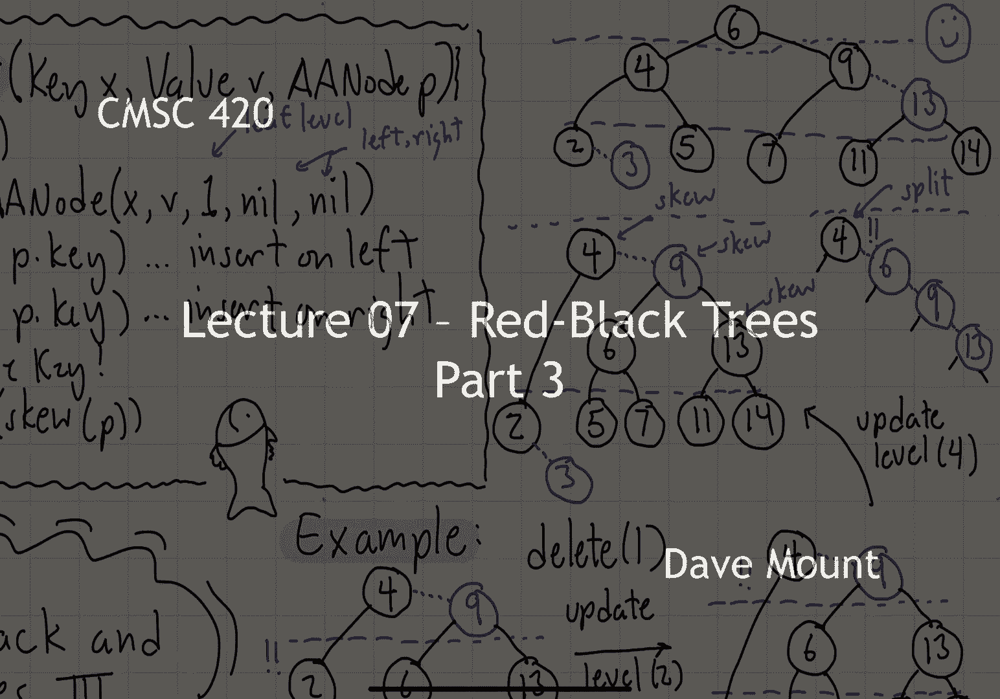

# 【双语字幕+资料下载】马里兰大学 CMSC420 ｜ 数据结构 (2021最新·完整版) - P19：L7- 红黑树与AA树 3 - ShowMeAI - BV1Uh411W7VF

in this third segment we're going to，continue talking about red black trees。

and aa trees and in particular we're，going to talk about insertions and，deletions。

okay let's get started so last time we，outlined how to perform insertions。

let's begin by giving the actual，code the pseudocode for doing this。

so the procedure is given three things，it's given the，key x the value v and a node。

that we're currently working on，inserting into，if we've hit the bottom of the tree that。

is we've hit nil，then at this point we're going to create，a new a a node。

it's going to exist at the leaf level，that is going to be level one and its。

left and right children are both going，to be nil remember you don't have null。

children in the aa tree everything at，that is null is going to point to this。

sentinel node called nil，okay if we're not at the leaf level then。

we're going to basically decide whether，we need to go left or right and this is。

the usual code either insert on the left，side recursively or insert on the right。

side recursively otherwise of course，we're going to throw a duplicate key，error。

finally when we're done we're going to，perform the rebalancing operation and。

the rebalancing operation is very simple，for the aa tree we just invoke the split。

routine and the skew routine，so let's take a look at an example of，how this works。

so let's consider this，tree here on the left it's got three，levels right the leaf level one。

the middle nodes two and then the root，is going to be at level three and let's。

suppose we perform an insert of six into，this tree，so in our usual manner we're going to。

walk down the tree six is you know less，excuse me greater than four less than。

eight um greater than five but less than，seven so we're going to be inserting six。

as a left child of the leaf node 7。we observe right away that，as we've created this new node and it。

has the same level as the node in which，it's been inserted that is it's level 1，the leaf level。

7 has a，left child that's at the same level that，means it has a red left child and this。

is not allowed in aa trees so we need to，perform a skew operation to fix that。

remember the skew operation is going to，perform a right rotation at node 7 which。

is going to move the 6 up and it's going，to move the 7 down，okay however now when we back up in the。

recursion to the 5 node we realize that，we have a，basically a。

on the right right side we have two red，nodes and that's not allowed。

so remember when this situation occurs，we perform a split operation the split，operation performs a。

left rotation at the middle node that's，the 6 okay，that brings the 6 up and it moves the 5。

and 7 down below it，and in addition we increase the level of。

the 6 node so it's now moved up to be at，the same level as the parent node 8。

okay but now we see that 8 also has a，problem because 8 has a left child。

that's at the same level in other words，it's got a red left child which is not。

allowed by the aaa rules so we need to，perform another skew operation。

okay so the skew operation is going to，perform a，right rotation at eight okay so that's。

going to move the six up and bring the，eight down so now i'm going to get a。

sequence 6 8 12 all at the same level，observe now again i've got a situation。

where i have a right right grandchild，that are all at the same level and this。

means that i have to perform a split to，fix this，so remember now the split is going to。

perform a left rotation on the sixes，right child that's the eight so that's。

going to bring the eight up and it's，going to move the six and twelve down。

and we in addition we also increase the，level of eight so eight now moves up to。

be at the same level as the parent node，for okay at this point in time we're，happy，in other words。

eight is the，is a child of four at the same level，which means it's going to be a red child。

but it's a right child and that's，allowed by the aaa rules，okay next let's consider the case of。

deletion in order to describe the，deletion algorithm we're going to need。

two more helper functions the first，function is called update level。

update level is going to be called just，after we delete a node so what's going。

to happen in general is we're going to，find that the level of our node is too。

high because something underneath it has，sort of dropped down，a level lower so in particular what we。

look for is if the level of the current，node p，exceeds what is sort of allowed for it。

and what is allowed for it well um the，sort of ideal level it can have would be。

to take the max of the，left child，the and the right child level okay and。

add one to that if you're a higher level，than that，then what you're going to do is you're。

going to bring this note down a level by，essentially setting its level equal to l，notice as well。

the node p might have a red right child，if the right child of p is at the same。

level then we're also going to have to，bring that child node down with us so in。

general update level could result in，up to two nodes having their levels。

the next helper method is called fix，after delete and this is the。

restructuring operation that we perform，after each deletion on each node going。

all the way back to the root node so it，begins by updating the current nodes。

level by invoking update level and then，it performs the following amazing set of，operations okay。

it performs a skew on p it performs a，skew on p write it performs a skew on p，right dot right okay。

three skew operations remember skews，don't actually do rotations they just。

check to see if a rotation is necessary，and if so the rotation is performed。

finally what it performs is a split on p，and a split on p right。

okay now you might ask how on earth did，you ever come up with this crazy。

combination of operations well，i'm not going to prove the correctness。

of this sequence of operations again i'm，going to ask you to kind of trust me on。

this one but we'll see in a little，example sort of how it is this bizarre。

sequence of operations comes about and，why you're doing three skews and two。

splits the deletion operation itself，works exactly in the same manner as the。

delete operation that we've seen in，other trees okay in other words we。

basically start at the root we start，finding the node that's to be deleted。

okay if we find it in an internal node，we have to come up with a replacement，node。

okay we copy this replacement node it，could be the in order predecessor or。

successor we copy this node into the，contents of the node that's to be。

deleted and then we recursively delete，the replacement node okay so that。

structure is going to be exactly the，same the only difference is going to be。

when we're done with the deletion，operation again the standard deletion。

operation we're going to invoke the，function fix after delete okay and we're。

going to do this for every node working，all the way back to the root of the tree。

okay so let's see if we can make this a，little bit more concrete by considering，an example。

consider the tree that i've drawn here，and let's suppose i delete the element 1，from the tree。

so the very first thing that's going to，happen is the node 1 because it's a leaf。

node is just going to be it's just going，to go away and so now two's left child。

is going to be well it's k it's not，going to be null because we don't have。

null pointers in the aa tree but two's，left child is now going to point to nil。

now i want you to remember nil resides，at level zero，and the node two is one level above the。

leaf level so it's residing at level two，okay um，generally speaking i cannot have a node。

in which my children are two levels，below me，okay so that means that the note 2 when。

i invoke the update level method it's，going to have to come down by a level。

okay so when i perform update level on 2，it drops down to be at the same level as。

its child node three，okay well now two is happy but the，problem is when we go back to its parent。

namely four，four sees that it's two levels above，that two child and that's not going to，be allowed。

so when we invoke update level on four，four is going to come down one level。

from level two down to level excuse me，from level three down to level two。

in the process four is going to pull its，red child of nine that was at the same。

level it's going to pull both of those，nodes down，so now we have sort of this uh train。

wreck um occurring at level 2 in our，tree right when the 4 and the 9 came。

down we have a whole bunch of nodes that，are sort of all stuck together there at。

this level way too many to be you know，sort of a valid um，a valid arrangement in our a a tree so。

the first thing we're going to do to，restore some order here is we're going。

to apply a series of skew operations，remember the job of the skew operations。

is to take children that are at the same，level and to essentially push them over。

to the right so the tree is going to be，right skewed so what's going to happen。

after these three skew operations is all，those nodes that are at the same level。

the four the nine the six and the，thirteen will all be along a right chain，leading out from four。

okay so i'm only going to draw the，picture of that right that right going。

chain from four okay but again 4 6 9 13，and then all the other notes that are。

the leaf level notes are just going to，be hanging off from these，okay so four sees that it's got。

basically along its right right，grandchild it sees that all those notes。

are going to be at the same level and，the rule is，after we're done with our three skews。

we're then going to perform a split at，four and that split is going to then，perform a。

left rotation at its right child so，that's going to be a left rotation at 6。

and what that's going to do is that's，going to pull up the 6 and the 4 and the。

9 are going to go down and 6 is going to，be lifted up to the next level of the。

tree so in the tree that results we see，six is now up at uh level three of the。

tree okay levels four nine and thirteen，they're still at level two but observe。

here everything is okay right because in，this particular instance four is just。

going to have two children both at the，leaf level so it's basically just a。

regular you know a regular black node，with black children，nine on contrast is going to have the 13。

right，at the same level but that's a right，child so that's allowed in our case as。

well okay and then all the other nodes，are going to be leaf nodes and they're。

going to be down at the next lower level，so at this point in time all the proper。

structure in the tree has been restored，now we haven't made use of all the。

skewing and all the splitting that we，need and i'll refer you to the pdf files。

of the lecture notes i do a much more，complicated example there where we。

actually wind up with not three nodes in，that actually in this case we had four。

nodes right we had the four the six the，nine and the thirteen，in the example that i give in the pdf。

files you can actually get five nodes，there and in fact in the very worst case。

you can actually get six nodes there but，anderson shows that six is the worst。

possible situation you can have um it，happens when basically when you pull。

that four nine combination down um when，it gets pulled down both of its children。

that are affected um，are both nodes that have a red black，combination so you get the red black。

that's being pulled down from the top，you get the red black as one of its。

children and you get a red black as the，other child and you wind up with a total。

like i say a train wreck of six nodes，all residing at the same level to fix。

that train wreck you gotta perform three，skus to get them all lined up and then。

two splits to essentially get everything，everything repaired，i'll refer you again if you look at。

anderson's paper he actually gives an，example of one of these really really。

horrendous cases but like i said there's，only a constant number of skus and。

splits that have to be performed and for，this reason the running time of the。

operations on the um a a tree are all，going to be o of log n because they。

depend upon the height of the tree and，as we showed last time the height of the。

