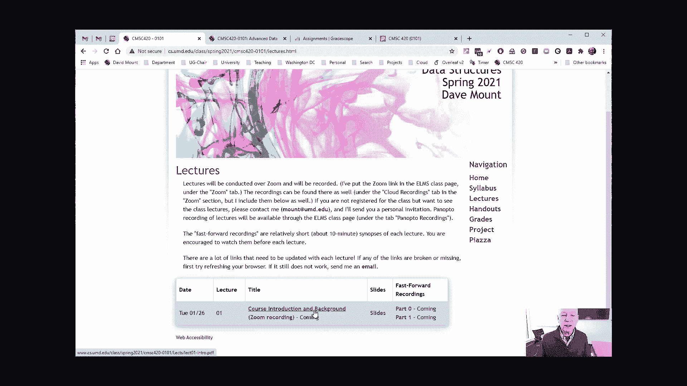
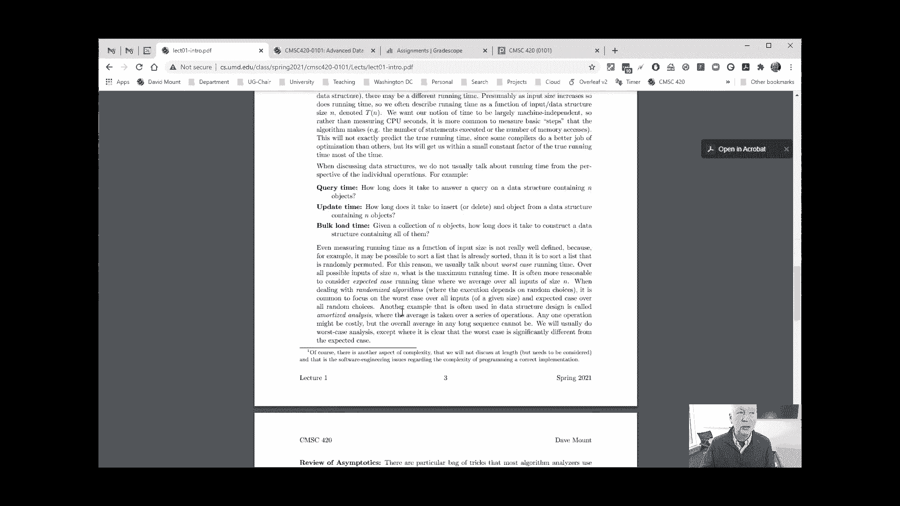
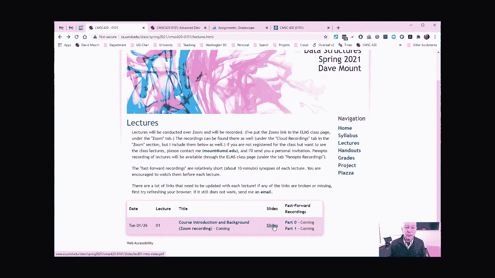
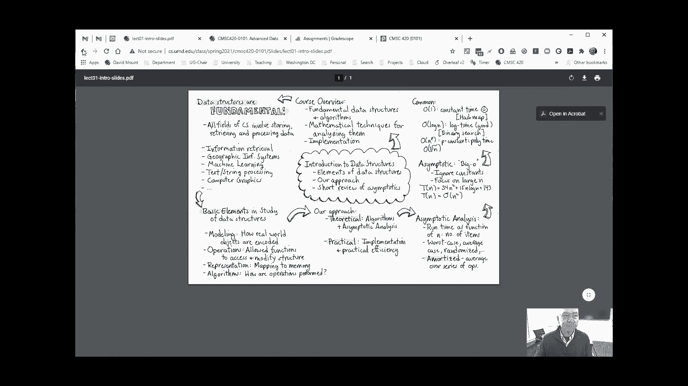
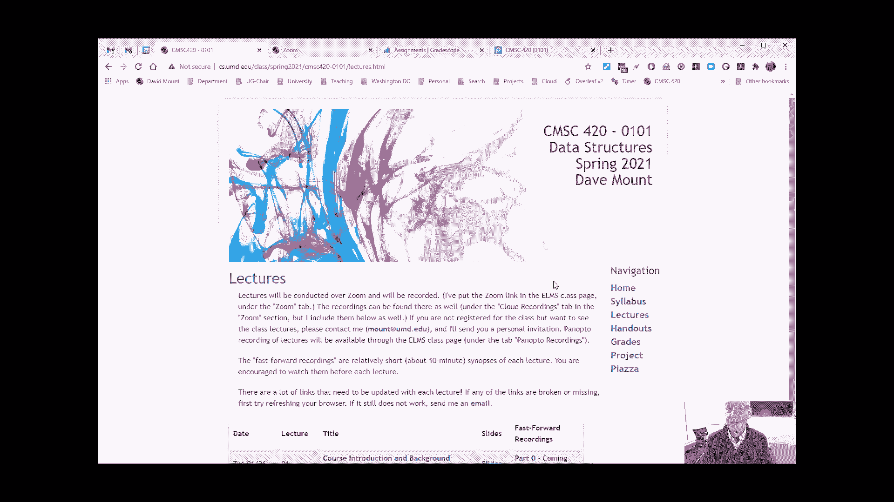

# 【双语字幕+资料下载】马里兰大学 CMSC420 ｜ 数据结构 (2021最新·完整版) - P1：L1- 课程介绍与背景知识 1 - ShowMeAI - BV1Uh411W7VF

hey everyone uh welcome to cmsc 420，spring 2021，um，in this little recording i'd like to say。

a little bit about what it is we're，going to be doing this semester and kind。

of how it is we're going to be，presenting material for lectures。

i'm sharing my you know my screen with，you here，i'd like to show you a few things on the。

class webpage，that will be of interest to you so uh，well first off the class webpage just。

has sort of the standard information the，course staff we still have yet to set up，the office hours。

there's a link to the syllabus here with，information well it's not entirely。

complete because i haven't determined，some things like when the midterm exams。

will be theirs i haven't actually，specified what the weights of the。

assignments are going to be yet but i'll，be filling that information out uh soon，um。

some information about what material is，going to be covered this semester in the。

course uh you know please check this out，i'm going to be talking about this in，the first lecture。

of this semester，there are some textbooks however these，are all recommended textbooks if you。

want to get them great but there's，nothing that's going to be required。

reading from these from these books，really the required reading is going to。

come from my lecture notes，well there's more technical information。

there let me talk a little bit about the，lectures because this is going to be。

sort of the most relevant stuff，so，tuesday thursdays at the regular class，time that's 11 to 12 15。

 we're going to，have our class meetings everything is，going to be recorded on zoom so if you。

don't have an opportunity to attend，class，don't worry you can always pick up the。

zoom recording afterwards，what，the material that i'm going to provide。

you with will consist of a number of，things and i've just indicated this for，the first lecture here。

the first thing is going to be that，there's going to be a link here to a。

latex lecture notes okay this has all，the technical information that'll be。

sort of necessary for the you know for。

the lecture this certainly would be the，stuff that you should study for，homeworks or um for exams。

um i also provide what i would describe，as sort of a，somewhat higher level presentation。

normally in you know when we're holding，classes in person what i do is i write。

on the board and these lecture slides，sort of have a summary of what i would。

normally write on a board now what i do，is i compress them down so everything。

fits in a in a tiny little space here，um finally what i'm going to do is i'm。

going to present these fast forward，recordings well i would show you what。

they are but i'm recording one of them，right now so the fast forward recordings。

what i do is i simply take the material，that i would lecture on normally over a。

you know 75 minute period and then i，squash it down into usually three maybe。

four a little ten minute segments for，you to take a look at，the information is quick you know it's。

presented very kind of in a sketchy，manner but i think it's a very good way。

in which to study for the material and，i'd encourage you to take a look at the。

fast forward lectures prior to class，now of course this one i'm posting sort。

of right before class so you may be，looking at it after class but，i'll generally try to get those。

recordings up as early as possible，perhaps 24 hours，class assignments will be presented on。

the handouts page here nothing yet，coming up，the grades will all be uh well。

grades will be given on the elms page，and or on grade scope so uh here's a。

great scope tab here there are no，assignments yet but generally speaking。

you're when you do assignments you're，going to be uploading them through，greatscope and。

we have an elms page here with all the，important links probably the uh。

important links to be remember well，nothing if important is listed on the，elms page but i will。

do things like，things like the links for the zoom，meetings for class will be there and。

i will have recordings，for the fast forward lectures they're，either going to be available on the。

class webpage or i'll be posting them，also on these panopto recordings，they'll be placed there。

and what else i think under the zoom，link uh the recordings for the lectures。

will be placed here under the cloud，recording so check that out，what else well there's going to be a。

piazza page as usual so if you have any，questions about materials please feel。

free to post to piazza if you want，something that is seen only to the，course staff。

please post that as a private uh you，know a private post and if there's。

anything that's even of a more personal，nature um feel free to send me a just a。

private email mount umd。edu，um i think that's basically everything。

that i wanted to talk about uh so i'm，looking forward to the first lecture，and。

