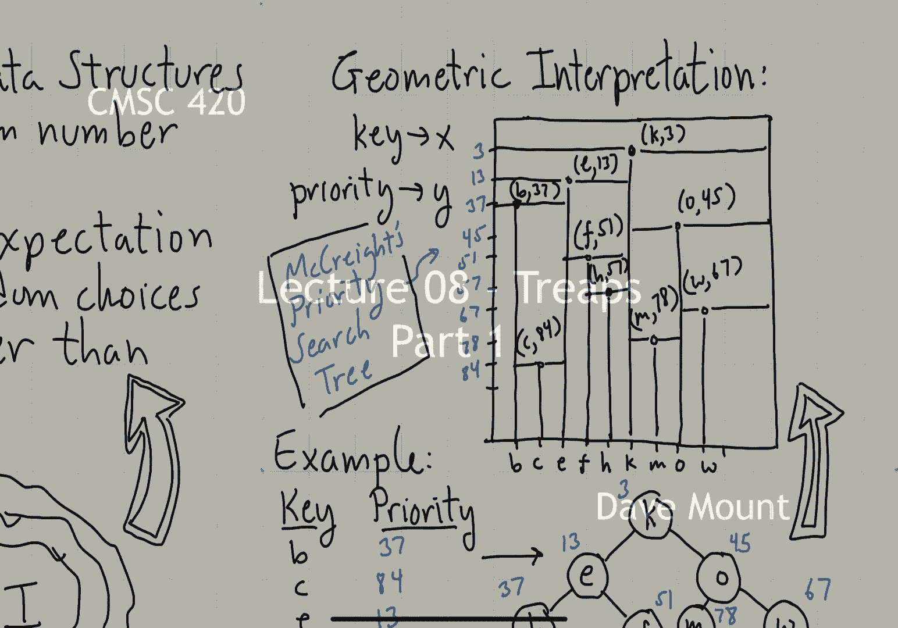

# 【双语字幕+资料下载】马里兰大学 CMSC420 ｜ 数据结构 (2021最新·完整版) - P20：L8- 树堆(treaps) 1 - ShowMeAI - BV1Uh411W7VF

hello everyone，in this segment we're going to talk，about a new data structure called treaps。

so let's get started，when we talk about trips we're going to，be entering into a new。

chapter with respect to data structures，called randomized data structures the。

idea in randomized data structures is，that the algorithms that manipulate the。

data structure are going to employ a，random number generator what this means。

is the running time of the algorithm，could depend upon the random choices and。

the way in which we analyze the running，time of the algorithm is in terms of its。

expectation over all the possible random，choices，the reason for using randomized data，structures is。

that it is oftentimes possible to，produce simpler，algorithms and simpler techniques and to。

rely upon the randomness itself to sort，of bail us out in case there are any。

difficulties for the sake of the heat，the treat data structure that we're。

going to talk about today let me say a，little bit about the interesting history，here。

so the data structure was developed in，1989 by raymond seidel and cecilia，aragon，the。

this occurred at a time when there was，sort of an explosion in the interest。

in randomized algorithms leading up to，this time there had been a discovery of。

a number of new randomized algorithms，for various classical problems。

and seidel and aragon were interested in，the question of whether the dictionary。

the order dictionary could benefit from，the use of the randomized data structure。

by way of a sort of a，pointer forward i'll mention that we're。

going to talk about skipless which were，invented at essentially the same time in。

fact in parallel with the treep data，structure，an interesting point however was that。

after seidel and aragon discovered the，treep data structure，it was sort of pointed out to them later。

on that in fact they rediscovered a data，structure that was already known called。

the priority search tree the interesting，thing was the priority search tree was。

not a randomized data structure however，one way to interpret what a um。

a treep data structure is is as if it's，a two-dimensional data structure where。

one of the coordinates the x-coordinate，is the key value and the y-coordinate is。

the random number that you assign to，things and if you treat every key value，and random number pair。

as if it's a two-dimensional point you，in fact get exactly a data structure。

known as the priority search tree which，was discovered by mccrate in 1980 and。

it's also closely related to a data，structure called the cartesian tree。

okay so let's begin with some intuition，behind the treep data structure。

one of the things that we observed，earlier in the semester when we talked。

about regular unbalanced binary search，trees is if you insert keys in random。

order into a binary search tree the，expected height is going to be。

logarithmic in n right and the idea，intuitively is that when keys are being。

inserted randomly they're kind of，equally likely to fall into any one of。

the leaves and so the tree grows in a，very balanced manner，of course we also know that the worst。

case for balanced for unbalanced binary，search trees can be very bad if you。

insert keys let's say in increasing，order or decreasing order the tree is。

going to have a terrible o of n height，well the idea behind the trip was this，can we build a。

regular binary search tree that behaves，in essentially exactly the same manner。

as if the trees were inserted in random，order，okay and this was the idea that inspired，the tree，so。

let me give you an example here to，illustrate this let's consider the keys，k e b，o f h and w。

okay and let's suppose that we ordered，we inserted them into a binary search。

tree in this order from left to right，okay let's see what data structure would。

result and i guess this is just a review，of the stuff that we you know covered。

many many uh lectures ago so k goes in，first right followed by e which goes to。

its left b goes to the left left，grandchild o is going to go on the right。

f will be a right child of e，h will be a，right child of f and so on and so forth。

until we've constructed the entire tree，now let's pause at this moment what i've。

done is i've labeled each one of the，nodes of the tree with a timestamp that。

is the time at which that key was，entered into the tree and what i want，you to observe is。

the structural properties of these，timestamps，note this as you walk down any path from。

the root to a leaf the time values can，only increase well you're going to say。

of course that's going to be true the，tree doesn't do any rebalancing and。

therefore the as things get basically as，i go deeper and deeper into the tree。

right what's going to be happening is，i'm going to be seeing nodes that were。

inserted later and later okay now what i，want you to think about is we have a，binary tree，in which。

the，values in particular i'm thinking of the，timestamp values have the property that，they increase。

have you seen another data structure in，your life that satisfies this property。

well the data structure that i would，point you to is the heap data structure。

that you may have seen when you when you，learned about heap sort so the。

observation that i'd like to make is，this，in a standard binary，search tree if keys are inserted。

and associated with their insert times，the keys are sorted according to inorder，from left to right。

the insert times essentially behave in，exactly the manner that they would if。

the tree had been interpreted as being a，heap right the smallest item is at the，top。

and as i walk down any path from the，root down to a leaf，those，insert times only become larger and。

larger so this is the idea that gave，rise to the notion of the treat what i'm。

going to do is i'm going to create a，for every node that gets inserted i'm。

going to associate it with a random，number that i'm going to call its。

priority so every node of the tree in，addition to left and right in fact in。

addition to the value the main thing is，it's going to store two things the key。

and the priority again keys are given to，me by the user，priorities are going to be assigned by a。

random number generator and the user has，no control over that keys are going to。

be in in order that is from left to，right as you go across the tree。

priorities are going to be in heap order，that is top to bottom as you look down。

in the tree well you might ask is it，generally possible to be able to。

maintain these two properties that is，i give you a set of keys and i give you。

a you know a let's say a completely，arbitrary set of priorities can you。

always produce a binary tree that has，the property that the keys will be in an。

order and the priorities will be in heap，order and，the answer to this is actually obviously。

yes because as we've just seen before if，you insert the keys，in priority order。

right into a regular unbalanced binary，search tree this is exactly the same，tree that you would get。

so in fact not only does the tree exist，in fact the tree is unique。

okay so let's give a little example to，illustrate this let me give a list of，keys。

okay b c e f h k m o and w and let me，just make up a bunch of random，numbers to associate with their。

priorities okay so remember their，priorities are being generated by a。

random number generator you have no，control over this the user has no。

control over this so as far as we're，concerned we're just in the crazy world。

of randomization right we're on for the，ride if the random number generator does。

you know sort of what it's expected to，do everything is going to work out fine。

and if your random number generator is，being controlled by some you know。

horrible demon well things could get to，be very bad i suppose okay so let's。

imagine now that we were to insert the，keys，in the priority order or equivalently if。

we were to organize the tree in such a，manner that the priorities are going to。

be increasing along any path what would，the tree look like well k having the。

lowest priority would be on top right e，being next would be one of its children。

b being next would be one of e's，children and so on and so forth until i，filled in the entire tree。

okay so this is the final trip that is，associated with this set of keys and。

these priorities i mentioned earlier，that there is a connection with this。

data structure called the priority，search tree and let me explain actually。

what that connection is because it gives，you a kind of an interesting way to。

visualize the way a trip is working，let's associate every key with an x。

coordinate sorted from let's say left to，right，and let me associate the priorities with。

the y coordinate sorted from top to，bottom okay，starting with the the key with the。

lowest priority in this case k let's put，that point on my grid here um you know。

according to where it belongs and let me，do two things i'm going to draw a。

horizontal line through that point and，i'm going to draw a vertical ray that is。

sort of shooting downwards from that，point，observe that because this point has the。

lowest priority that no points are going，to be inserted above it so the uh the。

rectangle that sits above this point is，going to be empty，if you look on the other hand at the two。

rectangles i get below it right the keys，that would go in the left subtree of the。

point k are going to appear on the left，sub rectangle and the p's appear and the。

keys appearing in the，that are greater than k are going to，appear in the right sub uh sub rectangle。

here okay so let's continue next e gets，inserted it has the next low the next。

higher priority okay again we draw the，point at e comma 13。 we draw a。

horizontal line through it and a，vertical line and again the nodes that。

lie in e's left subtree are going to，appear in that left sub rectangle the。

keys that appear in e's right subtree，are going to be in that right sub。

rectangle and we're just going to keep，continuing in this manner inserting。

point after point after point，in priority order every time we draw a。

horizontal line and a vertical line，at the end of the day we wind up with，this subdivision。

of the two-dimensional plane and this，subdivision is essentially the。

associated subdivision with this data，structure that is called the priority。

search tree that was developed by，mccrate so this is kind of interesting。

because it shows that we actually have，two very different interpretations of。

the data structure one as a，one-dimensional data structure with。

randomly assigned priorities the other，as a two-dimensional data structure it。

turns out mccrate was looking at the，problem from a completely different。

perspective he wasn't thinking about，randomization he was thinking about how，to solve。

various kinds of what are called，geometric range search problems and。

we'll talk about these later in the，semester，okay in the next segment we're going to。

talk about how to do dictionary。

