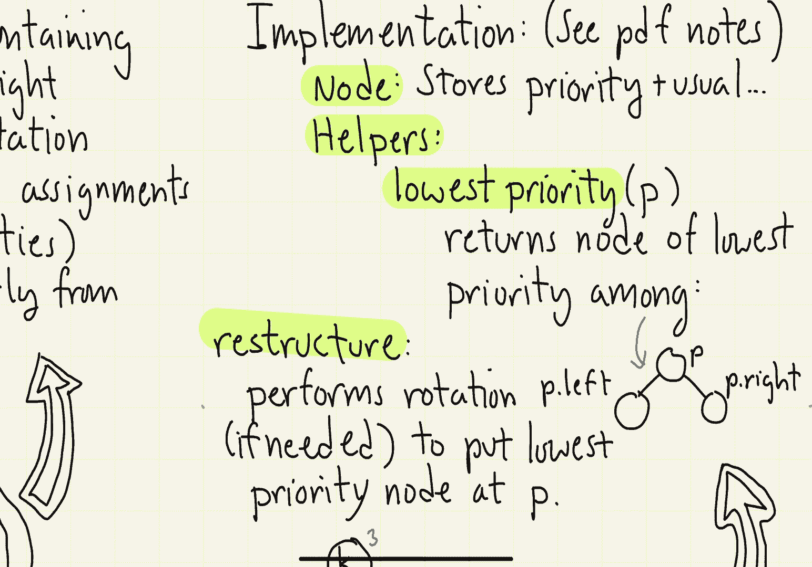

# 【双语字幕+资料下载】马里兰大学 CMSC420 ｜ 数据结构 (2021最新·完整版) - P21：L8- 树堆(treaps) 2 - ShowMeAI - BV1Uh411W7VF

okay let's continue our discussion of，trips，so let's begin with the theorem。

regarding the bet the height of the tree，we mentioned this last time but i guess。

just to make things formal，what i want to show is that a treat that。

contains n entries is going to have an，expected height of o of log n and again。

this is going to be independent of which，keys you insert right you could insert。

the craziest set of keys you like but，the expectation is going to be over the。

random choices made by the algorithm and，remember the user has no control over，those random choices。

the proof is actually very simple well，it's simple in the sense that we just。

appeal to the fact that we，stated without proof earlier in the。

semester namely that if you insert keys，in random order into a regular。

unbalanced binary search tree that the，expected height is going to be log of n。

okay so now let's take a look at it at，the individual dictionary operations。

well find i don't need to say anything，about because you know the trip is just，a。

binary search tree so that is just going，to be the same as as for all the other。

data structures that we've seen，let's see how we do insertions，so as usual what we're going to do is。

we're going to，walk down the tree until we find the，appropriate leaf where we fall out of。

the tree at this point we're going to，create a new leaf node。

okay store the usual information the key，and the value inside of this leaf node。

and we're also going to create for it a，random priority value，you might say well what are these you。

know what is the range of values，you really just have to pick a。

sufficiently large range you could do it，over the entire set of integers that，would be fine。

you could just pick a large number that，sort of depends on how large n is so for，example。

if you pick numbers let's say over the，range from 0 to n squared that would。

certainly be large enough but you want，it to be let's say significantly bigger，than n。

now as we're backing out of the tree，what we're going to do is we're going to。

check to see whether this node's，priority is okay with respect to the。

other keys surrounding it and if it's，not we're obviously going to have to。

perform the restructuring operations in，the form of rotations to fix it。

let's take a look at an example，okay so consider the following tree here。

and let's suppose we insert the key t，okay so the first step in the process is。

we're going to walk down to the leaf，level right t is greater than k it's。

greater than o it's smaller than w so we，fall out on w's left child link and at。

this point we create the，the new node t and let's say when i，invoke my random number generator the。

random number it gives me is 14。 so that，becomes my priority，at this point we now start walking back。

up the tree right comparing the newly，created node's priority to the parent，priority。

when i get back to w w says my priority，is 67，my，right my child's priority is 14 well。

that's not good in other words it has to，be the case that the parents priority is。

always smaller so i need to fix this how，do i fix this well with a heap you would。

normally just exchange the two entries，however we have to be careful to。

preserve the inorder properties the，operation that we know will preserve in。

order properties is rotation so we're，going to do is in this case we're going。

to perform a right rotation that's going，to bring the t up and it's going to move，the w down。

okay so here's the tree that's going to，result from that again we're going to。

back up one level in the tree we're，going to come back to o o is going to。

look at the newly created child okay the，t it's going to compare its priority 45。

to tease priority 14 again we're not in，priority order so we have to perform an。

appropriate rotation since t is the，right child of o we need to pull t up so。

to do that we're going to need to，perform a left rotation at o here's what。

the tree looks like after that rotation，finally we back up to k right and now。

when k looks down at the newly created，uh child it sees well my priority is。

three its priority is greater that's 14。i'm very happy then and now i can，essentially terminate the。

insertion process，note by the way as soon as you arrive at，a parent node whose priority is smaller。

than yours then you're essentially done，there's not going to be any more。

rotations that will follow of course if，the newly created node has the lowest。

priority in the entire tree the rotation，process could propagate all the way back，up to the root。

next let's consider how deletion works，if you recall how deletion worked when。

we were dealing with kind of unbalanced，binary search trees，what we had to do is whenever we were。

inserting a，node that had two children right we had，to find a suitable replacement node。

there is a very cute way to get around，this with treaps um here's what you do。

you take the node that you want to，delete right you do the usual find。

operation till you find that node okay，and then what you're going to do is。

artificially set its priority to plus，infinity okay or just let's say max。

enter any huge number any number that's，bigger than any other priority in your，uh in your trip。

okay notice as a result of this note，having an extremely high priority。

it's going to be out of place and so，what you're effectively going to then。

start doing is rotating it down the tree，until it arrives at the leaf level once。

it shows up at the leaf level we can，just chop it out unlink it from the tree。

okay very cool so let's take a look at，an example，consider this trip and suppose we decide。

to delete the element e，so as usual we follow the search path，until we find e of course if we don't。

find e we're going to signal an error，we're going to set e's priority from 13，up to plus infinity。

and then we're going to start asking the，question well how do i you know restore。

the trip that basically the heap，ordering properties okay so e is going。

to look down at its two children，there's a b with a priority of 37。

there's an f with a priority of 51。we're going to take the one that has the。

smaller priority that's going to be the，b and then we want to move the b up into。

e's position and we want to move the e，down and so the way we're going to do。

that is since b is the left child of e，we're going to do a right rotation so we。

do a right rotation at e，and let's see what happens，the b moves up into e's position right e。

and f move down，notice now though that the um，you know the priority the heap。

properties are satisfied at b but let me，go down to e and see how it is doing。

when it looks at its children，it has the child f，right which has a lower priority of 51。

well that's not acceptable so we have to，do something to fix that。

f is e's right child by the way it has，no left child right so there's only one。

rotation that would be possible in this，case and that is to do a left rotation。

okay so we apply the left rotation，at e right that pulls the f up。

right notice that f is in good priority，order with respect to its parent b，um。

that takes the e down okay so e is now，in the proper priority order with。

respect to f which is great and now，we're going to continue the process but。

notice at this point e has no children，great at this point all we have to do is。

essentially unlink e from the tree and，set f's child pointer to null and we're，done。

one of the things that i want to observe，with respect to the trip is that the。

operations are very simple right they，only involve simple left rotations and。

right rotations right there's no，crazy you know uh you know，three skus followed by two splits。

there's no you know merge and child，adoption and all these other things and。

this is one of the appeals of randomized，data structures the reason people like。

them is because the operations，themselves tend to be very simple the。

reason you can get away with such simple，operations is because you're relying on。

the randomization to sort of bail you，out in other words you're not。

maintaining tight deterministic control，of the tree，rather you're letting the random number。

generator sort of you know produce，enough crazy randomness that the tree，just is naturally balanced。

let me say a few things about the，implementation，i'll point you to the，formal pdf。

you know file in the lecture page for，the complete details there i give all，the code for the trip。

but here are the highlights of that，so the first thing is the node is going。

to be just the same as you would have，for let's say any unbalanced binary。

search tree that is key value left and，right but in addition you're going to。

have one additional field for storing，the priority，next you're going to design a few set of。

a few helper functions，to to you know to perform the balancing，operation。

the first one is a function called，lowest priority what it does is it looks。

at a node p and it looks at its two，children okay and it returns essentially。

among those three nodes which of node，has these lowest priority of all。

by the way if the left or right child is，null they're just not eligible right。

i'm considering which of the you know，sort of existing nodes um p p left and p。

right has the lowest priority，and then the last operation is an，operation called restructure and it。

performs a rotation as necessary to，essentially make sure that whichever。

node of those three has the lowest，priority is going to be sort of at the。

top position of that little triple and，like i said this will take one of three。

forms if p has the lowest priority，there's nothing to do if p left has the。

lowest priority then i need to do a，rotate right to bring it up and if p。

right has the lowest priority i have to，do a rotate left so again very simple。

operations once you have implemented，these two things，okay that's really all i have to say。

about trips，next time we're going to continue，talking about other。

randomized data structures in particular。

