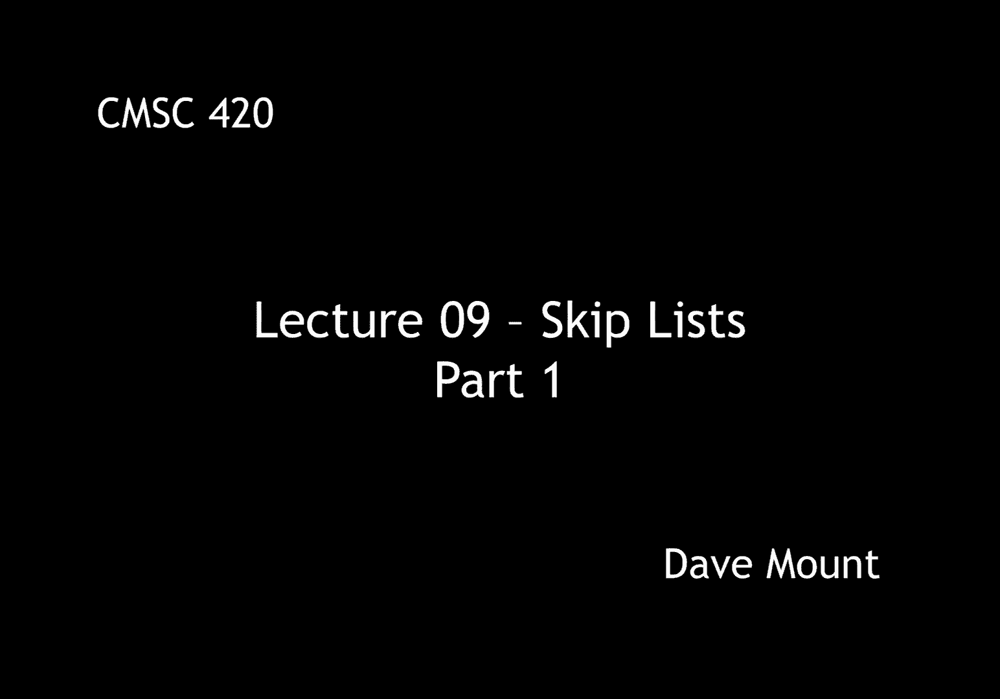
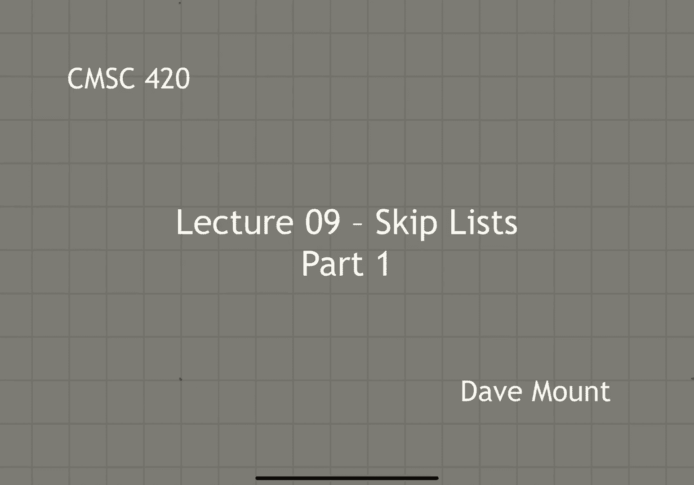
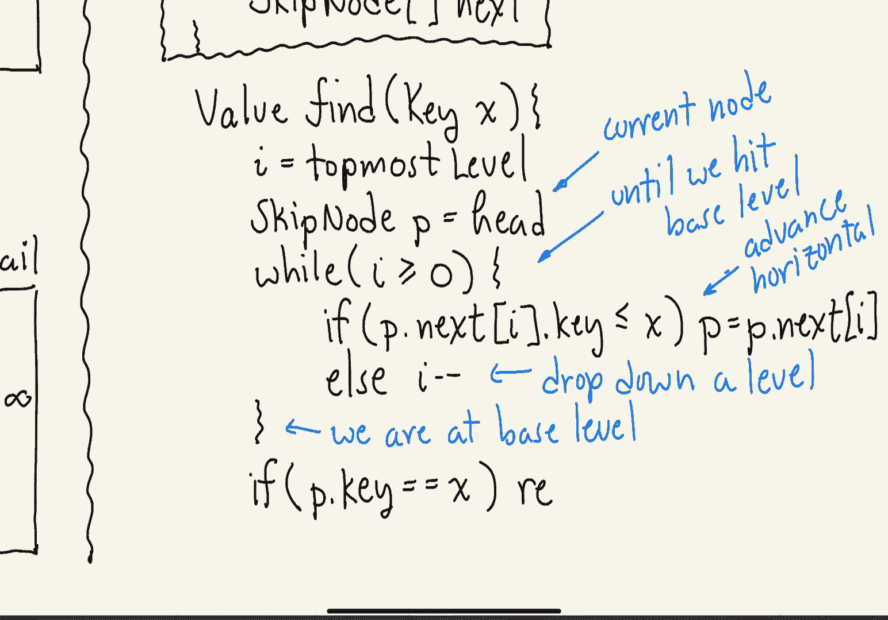
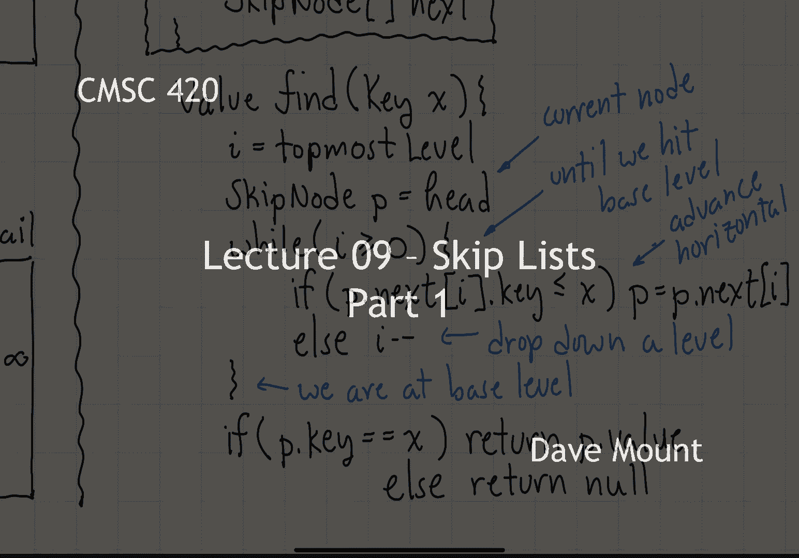

# 【双语字幕+资料下载】马里兰大学 CMSC420 ｜ 数据结构 (2021最新·完整版) - P22：L9- 跳跃表 1 - ShowMeAI - BV1Uh411W7VF

okay in the next set of segments we're，going to talk about a new data structure。

a new randomized data structure called，the skip list，first let's recall the fact that we can。

use sorted link lists for storing order，dictionaries，they have the advantage that they're。

very easy to code，it's easy to perform insertions and，deletions assuming you know where the。

insertion and deletion is to take place，unfortunately they're very slow to。

search it takes ofn time to find，something in a，you know in a linked list。

the motivating idea behind skipless，is we're going to create extra links。

that allow us to skip over elements and，so find things faster for example in。

this picture i've inserted links that，let's say jump over you know every uh。

whatever it is you know every third or，fourth element，and this would allow me to use these。

links to find anything that i want，faster in my linked list the whole skip。

list idea then comes from how do we take，this very simple idea and generalize it。

to a list of arbitrary length in order，to efficiently implement the，the dictionary operations。

let's begin by talking about what might，constitute an ideal version of a skip。

list what we're going to do is we're，going to organize these lists in levels。

you can think of them as let's say a，layering of lists if you like，at level 0 we're going to store。

everything that is to say level 0 is，just going to be the regular linked list。

storing all the elements in sorted order，level 1 is going to store a link to。

every other element in other words it's，going to skip over alternate elements。

level two will skip over every fourth，element，and in general level i will skip over。

every two to the ith element so let's，take a look at an example。

rather than having a single head for our，linked list we're going to have an array。

which contains header pointers one，header pointer for each one of the，various levels that we have。

the way we indicate that a node is，present in a higher level of the skip。

list is we're going to make the note，itself higher so that if you think of，let's say for example。

the list of all nodes at level one，you'll notice that every other element。

of the list is going to be contributing，to that level，so you'll notice the。

natural pattern that we get by doing，this right everybody is contributing to。

that level zero every other note is，going to be contributing to level one。

that is one level up right the eight，eleven and so forth and then every。

fourth node is going to be contributing，to level 2。finally at the end we're going to insert。

a tail node and the key value in the，tail node is going to be set to a。

special sentinel value of infinity and，this way we never have to worry about。

walking off the end of our linked lists，unfortunately the ideal link list that。

we've just described is going to be too，rigid，if we insert anything into our list or。

delete anything from the list then，there's going to be a massive，reorganization that's needed。

the idea behind the skip list，is to randomize the process that is to。

say that every node individually is，going to decide on its height and that。

determination is going to be independent，of all the other nodes in the list the。

way we do this to get the proper，behavior，is，each node is going to toss a coin。

the number of times that it tosses a，coin before it comes up tails is going。

to determine essentially what level it，goes at for example if the toss。

immediately comes up as tails the note，is just going to go at level 0。 if we。

get a head followed by a tail then it's，going to go at the next higher level if。

we get a head then a head then a tail，it's going to go at the next higher。

level so here's an example of what a，typical you know randomized skip list。

light might look like the nodes are just，going to appear kind of willy-nilly but。

notice because of the probabilistic，nature by which we generate the note。

heights the number of nodes at，relatively high level is going to be。

relatively rare right because it's going，to be difficult to toss a consecutive。

sequence of heads for very long let's，say a little bit about implementation，details。

as you'll notice the nodes themselves，have variable size depending on you know。

how many levels they contribute to，one way to implement this is to design。

our node so that well in addition to the，standard key and value，elements it has an array of next。

pointers okay and what will happen is，when we construct a new node。

we are going to invoke this coin tossing，and then once we essentially know what。

the you know height of the node is going，to be we will just allocate an array of。

the appropriate size，one of the things that i want to point，out is unlike two three trees where the。

number of elements in a node can change，dynamically once you create a node in a，skip list。

its height is going to stay essentially，the same throughout its lifetime right，until it's deleted。

let's see how we perform a find，operation in the skip list，suppose we want to find the key x。

what we do is we begin by setting i to，the topmost level of the tree this can。

actually be the absolute top level of，the head array or we could have a。

variable that just keeps track of，whatever is the highest level where any，node contributes。

we're going to let p denote the current，node that we're visiting initially。

that's going to be the head of the list，next we're going to repeat the following。

process as long as we're at a valid，level of the tree in fact what's going。

to happen is we go down levels，eventually we're going to fall off the。

bottom of the skip list basically going，to level negative one what we do at each。

node is we look forward one position and，we ask，if that，node is less than or equal to x we're。

going to stay at the current level and，keep walking horizontally if on the。

other hand we look forward to the next，thing it takes us beyond x then what。

we're going to do is we'll drop down a，level by decrementing the value of i。

when we exit the while loop we've now，essentially fallen out，at the lowest level right we have a。

level of negative one where we can't do，any searching，one of two things is going to happen at。

this point，if the key appears in the skip list we，will have landed on the node containing，it。

and so we'll just check to see if p dot。

key is equal to the node we're searching，for，if so we return the value if not we。

