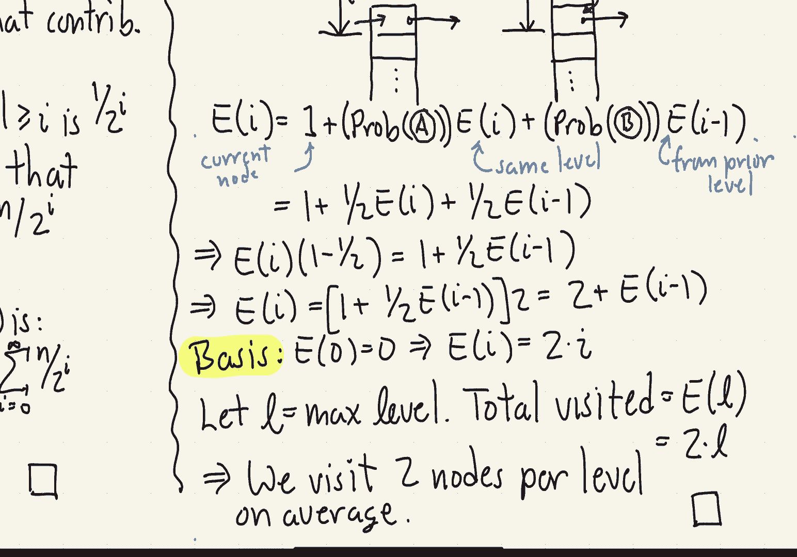
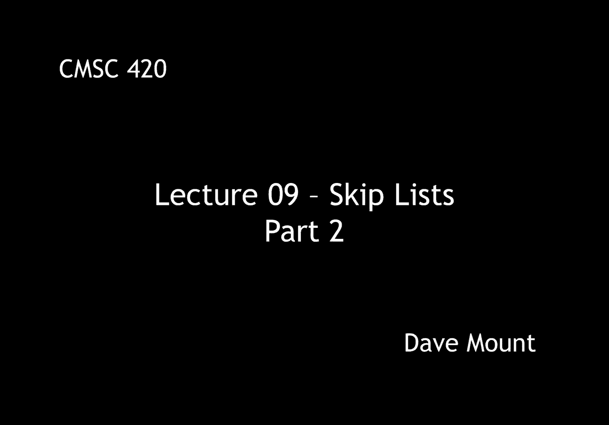

# 【双语字幕+资料下载】马里兰大学 CMSC420 ｜ 数据结构 (2021最新·完整版) - P23：L9- 跳跃表 2 - ShowMeAI - BV1Uh411W7VF

let's continue our discussion of，skipless，in this segment i'm going to present。

mostly theoretical results about the，probabilistic nature of the skip list。

that is sort of what the expected，properties of the skip list are in terms。

of its you know search time and its size，and so forth，for our first result we're going to。

prove that a skip list having n nodes，has in expectation，log n levels or on the order of login。

levels again this is very analogous to，the idea that you know binary search。

trees ideally speaking should have，essentially a height of login。

we're going to show a slightly different，result which i think is a little bit。

more interesting in particular i'm going，to show that the probability that the。

maximum level of a skip list exceeds the，value of c times log n where c is just，some constant。

is going to be at most 1 divided by n，raised to the power of c minus 1。 so the。

idea is as you make see a bigger and，bigger constant right this probability。

grows as a essentially a polynomial in 1，over n if n is very large this number。

this probability is going to be，exceedingly small，the proof is based upon a few，observations。

first observation is，that，the probability that a node's level，exceeds some value l。

is 1 over 2 raised to the power l，why is this well i guess this should be。

obvious you're flipping a coin until it，comes up tails if you observe that a。

node's level exceeds l that means you，had to flip，l，consecutive heads。

of course the probability that you flip，a head on any one flip is going to be。

one half and hence the probability you，get a sequence of l of them。

independently is going to be one half，raised to the power of l this bounds the。

level of one node but i'm doing this for，a large number of nodes right imagine。

that l is you know on the order of a，thousand even though events are going to。

be you know relatively rare if i do them，enough eventually those events are going。

to occur okay we have argued about one，node individually now if we repeat this。

same experiment n times the probability，that any of n nodes exceeds the level l。

is just going to be n times the，probability that each one node exceeds。

the value of l so therefore this，probability is going to be n divided by。

2 to the l okay now what is the level，we're interested in well the level is，going to be c times。

log base 2 of n which i denote by l g of，n okay again remember c is just some。

constant that you can decide whatever，value you want so the probability that。

the maximum level exceeds c times log n，is n over 2 to the l，okay that's in other words n over。

2 raised to the power of c times log，base 2 of n so in other words this is。

the same as n over 2 raised to the log n，that entire quantity raised to the c 2。

to the power log n is just going to be n，so this gives me n divided by n to the c。

or in other words 1 over n to the power，of c minus 1。so to make this concrete let's just plug。

in a particular value c，let's for example consider c equals，three the probability that the largest。

the maximum level exceeds three times，log n okay so again this is just you。

know on the order of log n which is what，we want is at most 1 over n raised to。

the power of c minus 1 that is 3 minus 1，or 1 over n squared so interpreting this。

for large values of n for example if n，is bigger than 1 000，right this means that the probability。

that i exceed three times the best the，most optimum value is less than one in a。

million next let's consider the total，amount of space used by the，skip list well you might say well。

there's only n nodes but remember nodes，have variable sizes and if i have a lot。

of nodes that have very large size，well that could boost my space。

requirements up we've already argued，that the maximum level is going to be at。

most log in that is each node could have，as many as log n pointers so n log n。

would be a trivial upper bound but i，want to show you that the expected。

number is actually going to be just，linear in n o of n in order to do this。

first let me make an observation about，how we're going to count。

we could of course count on a node by，node basis and then average over all the，nodes。

for example if i look at this skip list，you know the first node has two pointers。

the second one has one two one and three，so that says all together the total。

amount of storage that i would need for，this skip list would be nine。

the other way in which to count things，would be level by level right，at level zero i have five nodes。

contributing to that level at level one，one above that i have three nodes。

contributing to that level and at the，highest level right at level two i have。

just one node so one plus three plus，five equals nine so again i can either。

count things horizontally or vertically，we're going to count them vertically。

because it's going to be easier to do，that in our proof，so let me define。

n sub i to denote the number of nodes，that contribute to level i notice if a。

node contributes at level i it's going，to contribute at all lower levels as，well。

well as we observed before what's the，probability that a node makes it up to，level i well it's got a。

you know it's got a toss i，heads in a row that has a probability of，occurring of 1 over 2 to the i。

since that's the probability of any one，node making it up to that level。

the expected number of nodes that make，it up to level i is just going to be n。

the total number of nodes times the，probability of the event n divided by 2，to the i。

that is to say the expected value of n，sub i，e of n sub i is going to be equal to n。

divided by 2 to the i okay to get the，total amount of space needed in。

expectation i'm going to get take the，expected value of the sum of all the n。

sub i values up to the top of the skip，list well i know that the skip list is。

going to end with high probability you，know after the log nth level or let's。

say o of login level but let me just，actually take this all the way up to。

infinity right as ridiculous as that is，that's going to give us，a perfectly good bound so by the。

linearity of expectation，the expected value of a sum of numbers。

is the same as the sum of the expected，values of numbers i'm using a little bit。

of probability theory here but you don't，need to worry about those details，okay。

and we know that the expected value of n，sub i is n divided by 2 to the i so i。

can just plug that into my summation，here by the distributive law we can take。

that n out into the front and the，summation is just 1 over 2 to the i i。

running from 0 up to infinity in other，words 1 i'm sorry 1 plus 1 half plus 1 4。

plus 1 8 dot dot dot out to infinity，well you know from your discrete math。

course that this is just a convergent，geometric series and it converges to the，value 2。

 so in other words the expected，space is not just o of n in fact it is 2。

times n for our last theorem let's talk，about the expected time that the。

fine processor the search process runs，in it turns out this amount of time is。

going to bound all the opera all the，dictionary operations find insert and，delete。

so let me begin with two observations，first we've already seen in the first。

theorem that the expected number of，levels in our tree is going to be o of，log n。

and so all that i need to do to finish，off the proof is to show that we。

essentially just do a constant amount of，work at every one of these levels in。

particular what i'm going to show is the，expected number of nodes we visit per。

level is going to be exactly 2。 to do，this let me first begin with a useful，observation，that is。

observe that whenever a search arrives，at a node in our skip list。

it always hits that or it always enters，into that node from the topmost level。

you might say well why should that，actually be and i'm going to just leave。

this as an exercise but later in the，lecture when we give an example of find。

notice that whenever we first hit a node，we always hit it at the very top，next let's define e sub i。

to denote the expected number of nodes，that are visited among the top eye，levels of the search。

okay so in other words i'm not counting，from the bottom as one might think would。

be sort of typical to do what i want to，think about is，if i look at just the top most eye。

levels let e i denote how what is the，expected number of nodes i visit with，those。

we're going to analyze this quantity by，developing a recursion to describe it。

let's suppose that we arrive at some，node p in our data structure。

there are two cases which i'm going to，call a and b that essentially explain。

how we got to this particular location，in case a the position that i'm at is。

the highest position in this skip list，node，if that is the case then the only way i。

could have arrived at this node was to，come in，essentially from the left that is to say。

to come in at the same level，the other thing that could happen is。

this node could actually be higher than，level i and remember by the observation。

that we just made whenever you come into，a node you always come in at the top。

level so the only way i could have come，into the middle of a node is if i drop。

down a level in my search process，now let's define a recurrence that。

describes the expected number of you，know things that i visit along the way，here。

okay so we're going to denote this by e，sub i，uh well first off。

e sub i has to count the current node，we're visiting so that's we count a 1，for that。

and then i have to count all the prior，work that it took to get here。

okay there are two different cases，either i came horizontally from the same。

level that's when i'm in case a，okay so，the since i'm coming in from the same。

level the expected cost for that is，going to be well at most ease of i。

because i'm at the same level i，okay，what is the probability that that occurs。

well it occurs with probability that i'm，in case a whatever that is。

on the other hand if i'm in case b i，arrived at this point coming down from。

the previous level that is i have，traversed i minus 1 levels up until now。

okay and now i've arrived in case b so，that，occurs with probability of case b，times e of i minus 1。

well what are the probabilities of case，a in case b，well remember that every node。

independently determines its height by，this coin flipping process okay when i。

got to the position that i'm at here，right，with probability you know one half i。

tossed a tail at this point and the node，failed to grow any higher in which case，i'm in case a。

on the other hand with probability，one-half i d i tossed a heads at this。

point and the node continued to grow in，which case i'm in case b so the。

probability of a and the probability of，b are exactly the same namely one half。

so in other words e sub i is equal to，one plus one half times e of i plus one。

half times e of i minus one，this recurrence looks a little bit fishy。

because i'm defining e sub i in terms of，itself but，strangely enough everything is going to。

so by a little bit of algebra we observe，that if i put those e sub i terms。

together i find that e of i times 1，minus one half is equal to one plus one。

half times e of i minus one，well the one minus one half that is just。

one half and if i take that to the other，side，what i find is e sub i is equal to two。

times that quantity in other words it's，2，plus e of i minus 1。

okay so now i have a recurrence for e of，i in terms of e of i e of i minus 1。

for the basis case remember these are，the eye topmost levels so the basis。

cases when we start at the very top of，the tree well at the very top of the。

tree we haven't visited or the top of，the skip list we haven't visited，anything yet so e of 0 is 0。

okay and so what do i get well then e of，1 is just 2 plus e of 0 that's 2。

e of 2 is just 2 plus e of 1 that is 2，plus 2，right e of 3 is just 2 plus 2 plus 2。 in。

other words e sub i is just 2 times i，to get the final value we have to。

consider what is the actual maximum，number of levels the total cost if the。

number of levels is l is going to be e，of l but as seen by the previous formula。

that's just going to be 2 times l，in the previous lemma write we showed。

that the maximum number of levels is，just going to be log n so in other words。

what this result shows is that the，actual search time is just going to be。

two times the maximum number of levels，okay so basically still just o of log n。

okay enough for the theoretical analysis，in the next segment we're going to talk。

about the insertion and deletion。

