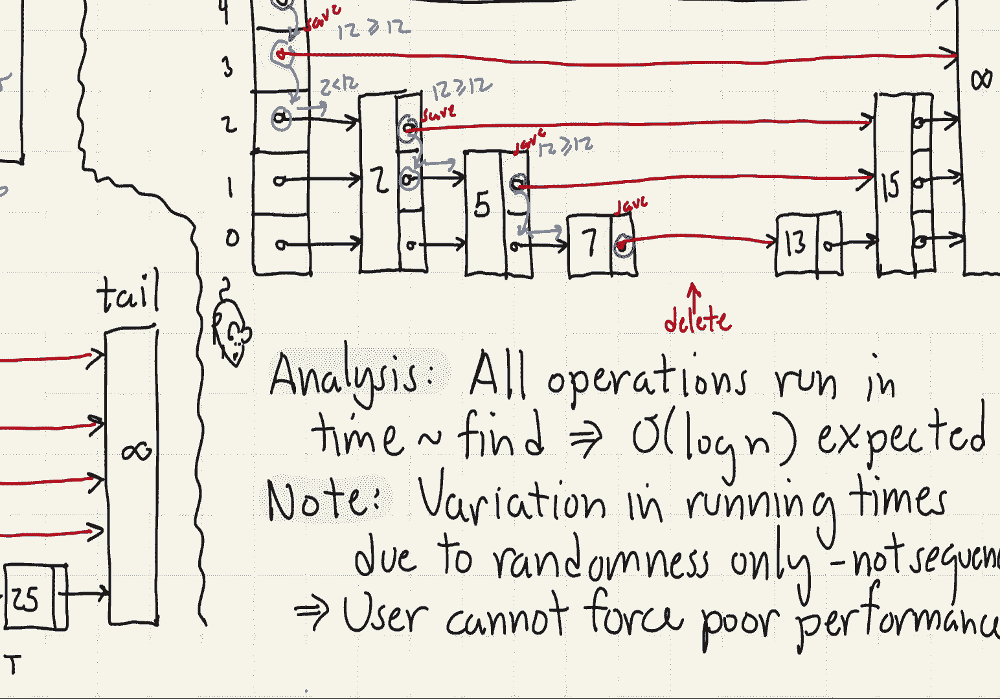

# 【双语字幕+资料下载】马里兰大学 CMSC420 ｜ 数据结构 (2021最新·完整版) - P24：L9- 跳跃表 3 - ShowMeAI - BV1Uh411W7VF

for our last segment on skipless let's，talk about the insert and delete。

operations so first let's consider，insert，the code is remarkably similar to。

standard linked list insertion but we're，going to be applying it on each of。

multiple levels here's the idea，first off we start at the topmost level。

of the tree and we're going to apply，essentially a linked list search on each。

of the levels working down to the lowest，level，so at each level we're going to advance。

as far as we can provided we don't pass，over，the node that we want to insert in other。

words we keep advancing as long as the，key that we're looking at is less than。

or equal to the key that we want to，insert actually strictly less because if。

we see something that's equal of course，you know something has gone wrong here。

at each level we're going to save a，pointer to the last node on this level。

that we visited when we hit level 0 we，now know where to insert the new node。

and so we create a new node at this，point，how do we determine its height well we。

just invoke our random number generator，to just keep flipping a coin right until。

that coin comes up tails and we count，how many times we flipped it until we。

get the tails that tells us our level，number，finally we create a note of the desired。

height and we go back to each of the，saved pointers that we had before right。

they were pointing essentially to nodes，that are beyond where we want to be what。

we do is we insert the new node and then，we essentially short circuit all those。

pointers so those pointers will point to，us，and then our pointer will point along to。

the next element in the list following，us so again just standard linked list。

insertion but i'm doing it at multiple，levels of the tree，next let's consider how deletion works。

the process is almost identical to，insertion in terms of its general，structure。

we start at the topmost level and we're，going to start working our way down。

at each level we're going to essentially，walk horizontally along that level as。

long as we're seeing a node that whose，key is strictly less than the key that。

we want to delete we never want to，actually go past or even go to the node。

that we want to delete we want to keep，track of all those immediate，predecessors of the deleted node。

again we're going to keep doing this，level by level until we get all the way，down to level 0。

 at level 0 we're going，to find the node okay that's to be，deleted again if we don't find it then。

we're going to of course throw some kind，of an exception，if we do find it then we delete that。

node okay but then we're going to，perform a linked list deletion along，each of the various levels。

for which this node contributed right we，know the predecessor pointer because we。

saved that we know where this link point，or this node points for its next pointer。

and so we're essentially just going to，do you know hopscotch right over the。

you know the current node that's being，deleted onto the next value okay so i。

have put off giving any examples until，now let's give us an example of all。

three of these operations starting with，find so to start let's do a find of 25。

on the skip list shown below，okay we start at the topmost level of。

the head node okay we look at the link，going forward if the link going forward。

goes to something that is strictly，bigger than the thing we're looking for。

25 right then what we're going to do is，we're going to drop down a level。

well infinity is certainly bigger than，25 so we drop down a level。

next at level 3 we look forward we see，the 13。 well 13 is less than or equal to。

25 so we follow that link to go to the，13。from the 13 we're staying at the same。

level we look forward and we notice，again we're seeing the infinity node，that the you know。

sentinel node at the tail so again that，signals to us that we need to drop down。

we drop down to level two again we see，that the next pointer goes to infinity。

that's greater than 25 we drop down to，level 1 we look forward well the 19 is。

less than or equal to 25 so we follow，that link but at 19 the link goes to。

infinity so we drop down again finally，at level 0 the 22 is less than or equal。

to the 25 so we visit that，finally we reach the 25 and we，essentially at this point we're gonna。

drop down to level negative one，okay the last thing we visited was that，node 25。

so what we do is we check to see does，the key that we're looking for 25 match。

the key in that node it does and so we，have found the actual key if for example。

we had been looking for 26 rather than，25 we would have wound up at exactly the。

same node but when we compared the keys，we would see that they're not equal to。

one another and that would have signaled，to us that we have to we basically have。

not found the node and we would return a，null next let's consider an example of。

insertion let's insert 24 into the skip，list shown below，as with most search structures the。

initial process involves，employing the same find operator that，we've seen the only difference is。

whenever we drop down in the search，we're going to save the pointer or the。

node that we were last at so this，essentially is going to mean at every。

level of the tree we're going to save，the immediate predecessor of the，inserted node。

okay so we start the process off at the，highest level of the header node。

okay we see in this case that，you know its pointer goes to infinity。

infinity is bigger than 24 so we're，gonna drop down a level but before we，drop down a level we save。

a pointer to the header node at level，four right that's the predecessor of the。

new node next we come down to level，three well at level 3 we see the 13 13。

is less than or equal to 24 so we follow，that link but then when we get to the 13。

the link at level 3 is pointing to，infinity that's greater than 24 so we。

save that pointer and then we drop down，another level at level two again we see。

the link goes to infinity we're going to，save that one also，okay when we get down to level one we。

see the 19 well 19 is less than or equal，to 24 so we go forward but then at 19's，char。

19's link is going to infinity that's，beyond so we're going to save that link，from 19。

okay so remember we're saving，all the predecessors，of the inserted node at each level of。

the tree so it's going to be one per，level of the tree finally when we get。

down to level zero right we advance all，but，we stop before we get to the 25 right。

because 25 is beyond the 24。okay，now what we do is we found out where to，insert the new key。

we're going to create the new node we're，going to start flipping coins to decide。

how high that node should be let's say，in this case，well we flip it heads heads heads heads。

tails so it's going to go all the way up，to level four，we allocate that node right we allocate。

an array of the appropriate size for the，next pointers we store the you know the。

key and the value inside of the，the current node and then we go back to。

all the pointers that we have saved okay，they're all going to point to the new。

node 24 and the corresponding pointers，within 24 are going to point to the old，predecessor values。

okay so that completes the insertion，process，finally let's consider deletion。

let's consider deleting 12 from this，skip list，so starting at the topmost level we look。

at that pointer right，the next pointer is leading to infinity。

infinity is greater than or equal to 12，so we're going to drop down here and，we're going to save。

that pointer at this level，next level we come down well that points。

right to the 12 node but we're not going，to go immediately to the 12 node because。

we need to get all the predecessors what，we're going to do is we're going to say，well。

12 is greater than or equal to 12 okay，and so that signals that we have to drop。

down again so we're going to save this，pointer，okay well 2 is less than 12 we're now at。

level 2 2 is less than 12 so we go，horizontally but when we get to node 2。

it's pointing to 12 12 is greater than，or equal to 12 so at this point we're。

going to save the pointer and drop down，a level okay when we get down to level。

one we're going to advance to，well first off five is you know strictly。

less than 12 so we go to the five node，when we look at fives um you know link。

at that level um it's pointing to 12 12，is greater than or equal to 12 so we，save。

that pointer at level one，and in the same manner eventually we get。

down all the way down to level zero and，it's at node seven now notice all the。

saved values are the values that are，essentially well，are the predecessors of 12 in my skip，list。

so what i'm going to do at this point is，i'm going to luckily i found the node 12。

right so i'm going to delete the node 12，and then i go back to all of those。

predecessors and i'm going to update，them whatever 12 is pointing to they're。

going to point to those new nodes so i，update all those pointers and again i'm。

done for the final analysis of running，times observe that all the operations。

essentially take the same amount of time，as the find operation that is they，essentially。

visit and process the same set of nodes，that the find operation visited the。

final thing that i want to point out is，the variations in running time are。

always due just to the randomization，right the user has no control over our。

random number generator and therefore，the user cannot force the skip list to。

perform badly one little thought，experiment you might perform would be，this。

you might think to yourself well，couldn't the user create a skip list and。

then go in and delete all the tall nodes，leaving only the nodes at level zero。

okay that would certainly be a bad thing，because it would give us a skip list。

that has nothing but nodes at level zero，which would be just a regular linked。

list but notice in order for that to，happen the user would have to have。

knowledge of the heights of the nodes，and we don't reveal that information to。

the user the user has no idea what the，heights of the nodes are so the user。

cannot somehow create mischief by you。

know selectively deleting or you know。

