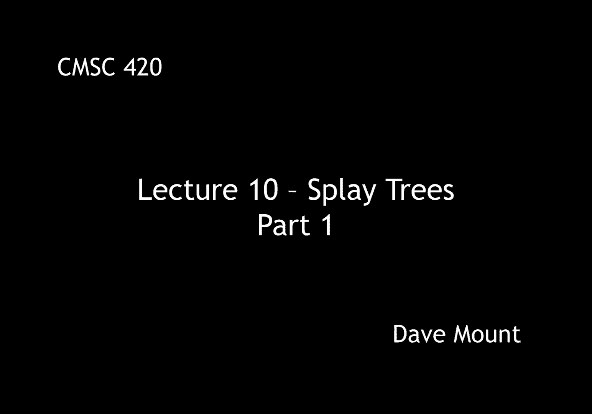
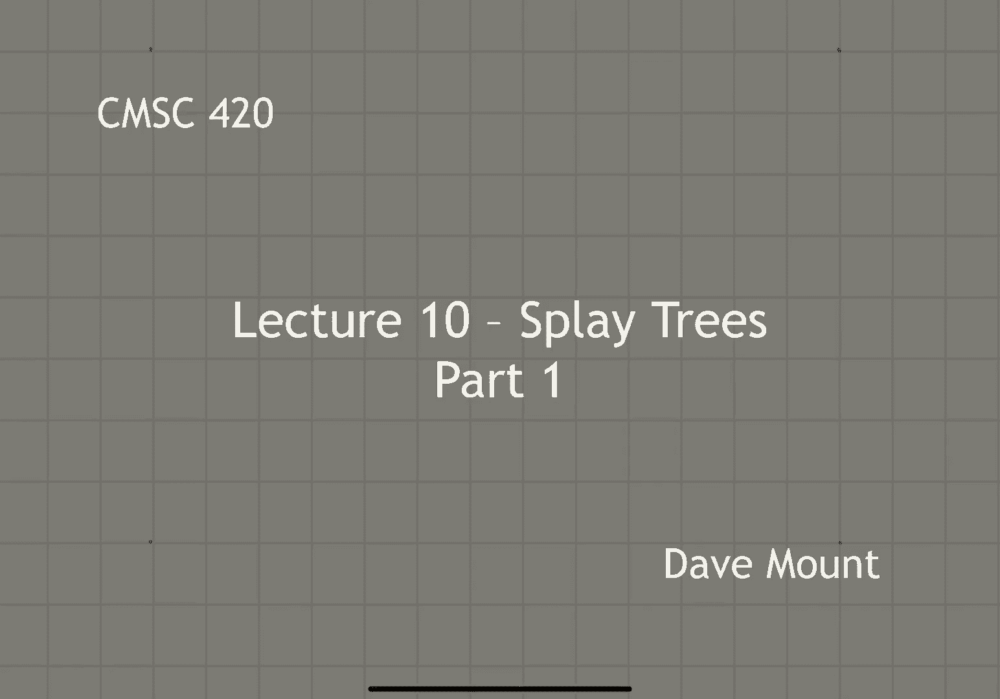
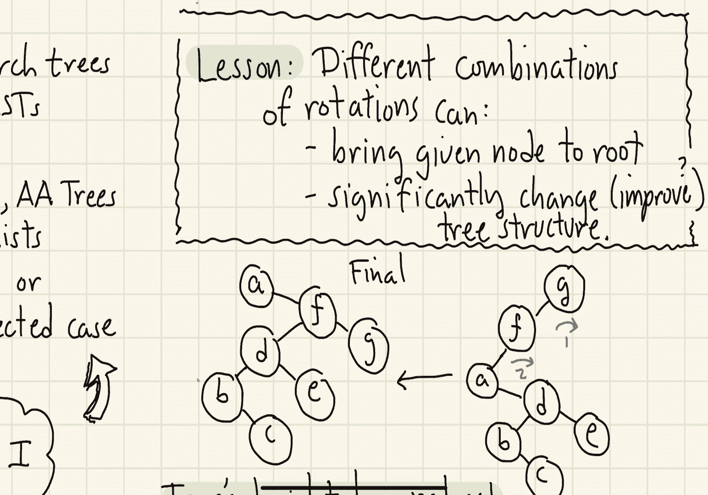
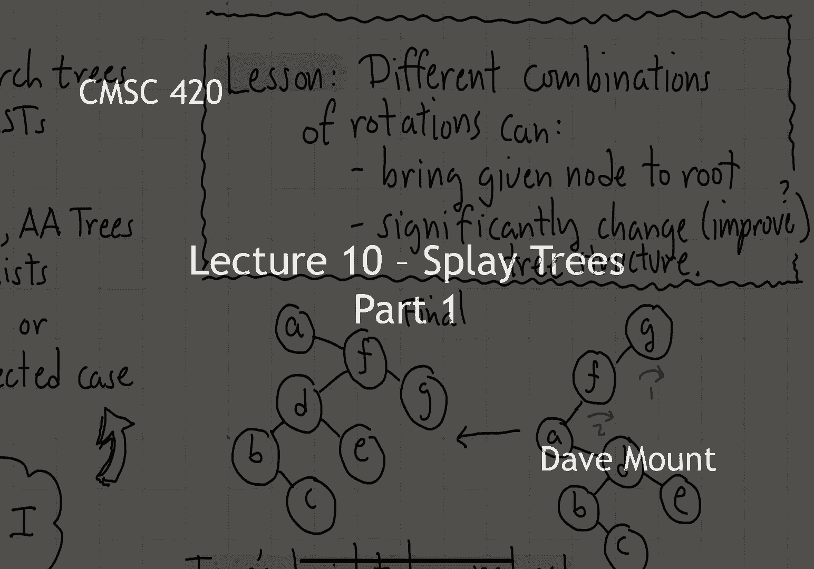

# 【双语字幕+资料下载】马里兰大学 CMSC420 ｜ 数据结构 (2021最新·完整版) - P25：L10- 伸展树(splay tree) 1 - ShowMeAI - BV1Uh411W7VF

in this segment we're going to start a，new topic，in particular we're going to talk about。

a very interesting data structure called，the splay tree let's begin with a recap。

of what we've been doing so far this，semester，we've studied lots of different search，trees。

first we discussed unbalanced standard，binary search trees，next we discussed avl trees that is。

trees that are height balanced，this was followed by two three red black。

and a a trees remember these were three，closely related data structures that。

were based on the idea of a variable，with the node，finally we talked about randomized data。

structures treeps and skipless，the common focus in all of these has。

been on worst case or in the case of，randomized algorithm expected case，performance。

the key in all of these cases however is，that with the exception of the。

unbalanced binary search tree，the，user cannot affect the performance by。

let's say inserting a particularly，malicious set of keys or inserting them，in an awkward order。

this raises the question of whether，there are other criteria or perhaps，better criteria。

under which we could measure the，performance of order dictionaries。

the first idea would be expected case，performance，the idea here is that some keys are more。

popular that is to say they are more，frequently accessed than others and。

if there is a skewness to the，distribution of，keys we would like the most popular keys。

to reside up near the root where they，can be accessed more quickly。

while less popular keys would be placed，down lower at the leaf level。

a related idea in this regard is what，happens if the distribution of keys that。

is the popularity of keys changes over，time，so obviously you know if one thinks。

about for example google searches，depending on the news cycle people are。

searching for different things，ideally we'd like to have a data，structure that adapts as the more。

popular search terms change over time，the data structure should reorganize。

itself so these more popular terms will，sort of filter to the top of the tree。

where they can be accessed more，efficiently the question that we want to。

consider is how would you design such a，self-adjusting data structure which is。

going to be tailored toward good，expected case performance and in，addition how would we analyze the。

efficiency of such an algorithm so our，response to this will be something。

called the splay tree a very famous data，structure which was designed by a two。

very famous computer scientists，robert tarjan and daniel slater this was。

in about i guess the late 80s maybe，around 1989，the splay tree is what is called a。

self-adjusting binary search tree we'll，talk in just a minute about what that，means。

the first thing about the splay tree is，that there are no constraints on the。

structure of the tree there are no rules，so to speak there are no balance factors。

there are no limits on the tree height，and there are no other things that are。

being maintained there are no colors，there are no levels there are no，priorities the tree just is。

you know a regular binary search tree，a node with a left child and a right。

child the efficiency of the splay tree，is going to be established through an。

amortized analysis obviously without any，restrictions on the tree structure。

the tree can become very unbalanced and，therefore any one operation might take a。

long time o of end time which we don't，want to have，the important idea though is that if i。

look at a long series of operations，then，every operation is going to be efficient，on average。

before giving the definition of the，splay tree let's start with some。

intuition let's start with a very nasty，situation，let t be a very highly you know。

degenerate binary search tree and，suppose we try to access the lowest or。

the deepest leaf in this tree so given，this tree suppose that the user asks us，to find the。

key a which is sitting at the very，bottom of the tree what we would like to。

do is to design our operations in such a，way that after the access operation for。

a is completed the tree has sort of，magically restructured itself into a。

form which is much better than this，particular degenerate form。

i'm going to present two ideas for doing，this，the first idea is we're going to try to。

rotate the key a up towards the top，this is a good idea from the expected。

case performance because what it means，is that future accesses to a are going。

to be fast so in other words the most，popular keys are going to tend to get。

pulled up towards the root of the tree，and this is a naturally good thing to do。

if you want to have let's say a good，expected case performance，well let's think of how to do this。

so starting with the parent of a b let's，perform a rotation at that node and here。

we show the result b now becomes the，right child of a next let's go to the，new parent of a that is c。

and do a rotation at c，again a is going to come up c is going，to go down，and of course，b。

being a's right subtree is going to，become c's left subtree as part of the。

rotation let's continue this process now，d is the parent of a let's do a rotation，to pull a up。

move d down，okay and again a's right child that is，the cb become becomes d's left child。

okay and so i get the string dcb going，down d's left side，hopefully now the pattern is going to be。

emerging and you can see what the final，result is going to be a keeps getting。

pulled up however all the other nodes，are going to remain in a you know linear。

chain going off to the left，on a's right side，so we've achieved half of our purpose。

here we've gotten a up to the top but，unfortunately we have replaced one。

degenerate tree with another degenerate，tree and that's not very good。

can we do better than this well，here's a second idea，the problem with the rotation we just。

described is it seems to be a little bit，too simplistic，how about instead if we rotate nodes in。

pairs，um，the right way in which to do this is，going to be to rotate the upper node。

first and then the lower node and we're，going to do this，pair by pair by pair working our way。

back up to the root for example，at the starting configuration i have a。

it's parent b and it's grandparent c i'm，going to first do the rotation at c。

and then i'm going to do the rotation at，b，you might wonder，why does this have any hope of working。

well let's just see on an example，okay so first starting with the abc。

triple let's do those two rotations c，first and then b，if you work through this you'll see that。

the result is going to be a b and c this，time going down to the right。

again this looks very degenerate where，is this all going，well now let's try this with a's new。

parent d and its grandparent e again，we're going to rotate it e first and。

then we're going to rotate it d second，okay just as an a b c。

now a d e that triple is going to go off，to the right but notice something the b。

c pair is going to switch from being a's，right child to being d's left child so。

we've actually sort of started to break，that degenerate pattern already。

next let's look at a's current parent f，and grandparent g again we're going to。

rotate it g first and rotate it f second，again a is going to come up to the top f。

and g are going to hang down on its，right hand side，a's right child that is that subtree。

with db c and e is going to become f's，left child this is going to be the final，tree that we see。

clearly the tree is going to be a little，bit less degenerate than it was before。

and a is going to be at the，root of the tree the key observation，here is that the tree's height has。

reduced by roughly one half，in particular if you imagine that very。

very long chain starting at a going all，the way up to the top。

what's going to happen is that chain is，going to be broken up into now a chain，of pairs。

you know f g d e b c and so on and so，forth going all the way down so because。

we're getting pairs of nodes at each，level basically the tree's height now is。

reduced by roughly one half well what's，the lesson that we've learned from this。

little exercise we've learned that by，doing rotations in different。

combinations we can do two things first，off we can bring a given node up to the。

root okay and remember that's something，we want to do because we want。

frequently accessed nodes to essentially，filter up to the root of our tree。

the second thing we've observed is that，by using different combinations of。

rotation we can significantly change the，structure of the tree。

now the main question is going to be is，this change going to be an improvement。

and what we're going to see when we talk，about the rules for splay trees is in。

fact yes there are very simple local，rules that don't make any use of the。

global structure of the tree and yet，have the property that as you perform，these rules。

over and over again they have this，tendency to make the tree's structure。

nicer and nicer over time okay that's it，for this segment in the next segment。

we're actually going to talk about the，specific operations that are used to。

