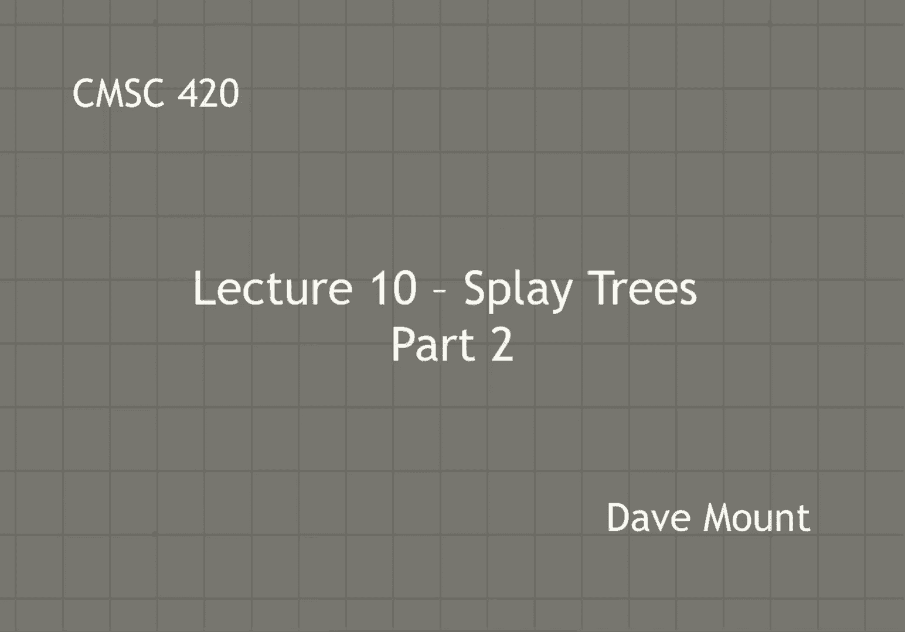
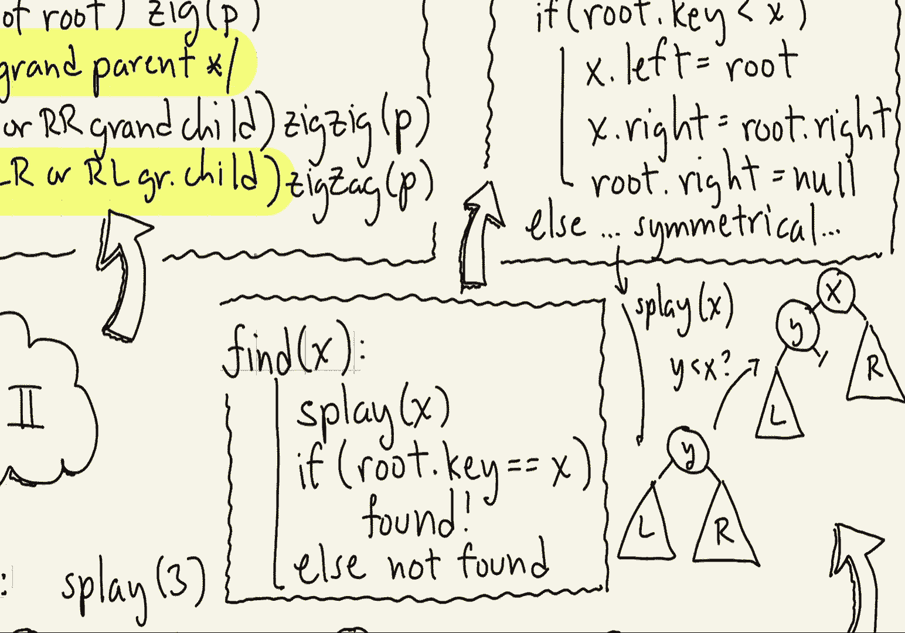
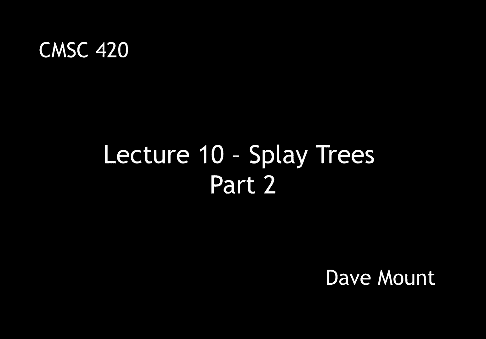

# 【双语字幕+资料下载】马里兰大学 CMSC420 ｜ 数据结构 (2021最新·完整版) - P26：L10- 伸展树(splay tree) 2 - ShowMeAI - BV1Uh411W7VF

let's continue our discussion of splay，trees，so after giving some of the intuition。

behind the splay operation let's see，what the display operation actually is。

so to perform the operation splay on a，given key x，we begin by performing a find operation。

um and find the node which is actually，not necessarily the same as x but is。

close to x either the pre-order，successor or pre-order predecessor next。

we're going to perform a process which，is going to keep repeatedly performing。

rotations until p moves up to the root，if p is the immediate child of the root。

then we just perform a single rotation，which we call a zig，otherwise we know that p must be the。

grandchild of some node in the tree，there are basically four cases depending。

on whether you're on the left left right，right left right or right left if you're。

an ll that is left left or right right，grandchild then we perform the operation，called zig zig。

otherwise you must be a left right or，right left grandchild in which case you。

perform the operation zigzag，and that's the entire procedure so let's。

see how each of these operations work，starting with zig zig，let's consider the left left case。

because the right right case is just，left right symmetrical consider the tree。

shown in the figure here and let p be，the node associated with the key value b。

the zig zig operation is going to，perform a single right rotation at the。

grandparent f and a single right，rotation at the parent d，if you work through these rotations by。

hand what you'll find out is，b will be moved up to the root of the。

little subtree that remains here d will，be its right child and f will be its。

right right grandchild and of course as，always with rotations the sub trees will。

hang down according to the inorder，properties，let me show the levels of the various。

subtrees after the，operation has been performed we're，mostly concerned with what happens in p。

subtree because presumably that is where，p came from this is where the splay。

operation originated those two sub trees，a and c，both get pulled up as a result of this，operation。

c by one level and a in fact by two full，levels next let's consider the zigzag。

operation and again there's two，instances left right and right left。

let's consider the left right case，because the other one is symmetrical。

okay so let's consider this subtree let，p be associated with the node whose key，value is d。

the zigzag performs a left rotation at，its parent node b followed by a right。

rotation at its grandparent node f，notice by the way zig zig and zigzag do。

the rotations in the opposite order zig，zig does the grandparent first and the。

parent second zigzag does the parent，first and the grandparent second well。

we've actually seen this rotation before，when we discussed um avl trees this is。

in fact the famous you know left right，rotation the result is going to be that。

d is brought up to the root of the sub，tree b and f are going to hang down as。

its two children and again the four sub，trees are going to hang down um from，these uh two nodes。

again let's take a look at the sub trees，that are rooted at the node p those are。

the ones we're most concerned about，these are c and e，observe that both c and e came up。

exactly one level as a result of this，operation，finally let's consider the zig operation。

and we're going to consider just the，left case okay so remember this is。

applied whenever p is the immediate，child of the root node so suppose that d。

is the root b is the node associated，with p okay that is b is the key value。

there and this is just going to be a，simple，right rotation at the node d，and here is the result。

um in this case observe that the subtree，a came up a level but the subs tree c。

just essentially stayed where it is um，we'll see later on that this is not。

great we actually want those subtrees，rooted at p to get pulled up but the。

important thing to note about the zig，operation is it's only performed once so。

even though c doesn't make any progress，it's only going to be affected for this，one operation。

so let's take a look at an example of，this，consider the tree shown here and let's。

suppose we perform the operation splay，of three，we first begin by doing a find on three。

so that descends the tree until finding，the node three，we look at its relationship to its。

parent and its grandparent and we see，that this is a，right left，situation here。

so we're going to do a right left zigzag，in this case remember that rotates the。

parent node of p first，to the right and then rotates the，grandparent to the left second the。

result of that operation is it's going，to pull the three node up to the top of。

that little subtree okay the two and the，four are going to hang down and the one。

and the five are going to hang down as，their uh you know as the grandchildren。

and then the rest of the tree is，essentially just going to be the same。

okay next p is still not the root so we，continue our you know our while loop。

here we look at its parent and its，grandparent p is the left left child of，its grandparent。

so this is a zig zig situation in，particular an ll zig zig，so again remember the。

operation to be performed here is first，do a right rotation at the grandparent。

and then do a right rotation at its，parent，after doing this the three gets pulled。

up to where the eight was okay the six，and the eight are going to hang down on，its right side。

and again the various sub trees get，distributed according to you know the，rules of rotations。

okay and the rest of the tree the 10 and，11 are unchanged by the operation。

finally p is the immediate child of the，root node and in this case we perform a，single zig operation。

p is the left child of the root so this，is going to be a left zig so remember。

that's going to perform a single，rotation to the right at the root node。

the effect is going to be that p will，move up to the root that is 3 is now the，new root of the tree。

its left child is going to hang down，there and of course，you know the 10 goes down and p's right。

left i sorry p's right child become，ten's left child，okay and this is the final tree that。

results from performing a splay of three，notice a couple things um。

three gets pulled all the way up to the，root this is always going to be true。

whenever you do a splay the node that，you splay on or at least the immediate。

predecessor or successor of that node if，the node is not in the tree will get。

pulled all the way up to the root and，then of course because of the various。

rotations the tree will kind of get，scrambled around we're going to have to。

argue later on that the scrambling in，fact is beneficial，well now that we've seen the splay。

operation let's now consider how the，various dictionary operations are going。

to be performed let's start with find，the whole philosophy with splaying is we。

want to get whatever nodes are being，accessed up near the root of the tree。

remember the idea here is this that，commonly accessed nodes should be close。

to the root so that they can be accessed，more efficiently in the future the first。

thing that fine will do is it invokes，splay on x to pull x up to the top of，the tree。

okay and again if x is in the tree it，will actually be the root now so we can。

check to see if the root key is equal to，x if so we have found it。

if not when we did the splay operation，we merely brought up the closest node。

the pre-order successor or or，predecessor of x，and in which case we're going to return。

the result not found okay so now let's，consider the，insert operation with respect to x。

in this instance again we want to apply，our splay operation in order to sort of。

get the node that we're inserting up，near the root of the tree so we begin by。

doing a splay of x we're going to assume，of course that x is not in the tree if。

it were in the tree then we're going to，have to report some kind of an error。

assuming that x was not found at the，root node we're going to now create a。

new node storing the key value x let's，call this q，now there are going to be two cases。

depending on whether the node at the，root，okay which is going to be like i said。

it's going to be the predecessor or，successor of x，if the root key is less than x that is x。

is bigger right then what we need to do，is we need to store the root on the left，side of x。

so we're going to set x x's left pointer，to the root，okay and now the root has two children。

we have to figure out what to do with，them we're going to take the roots right。

child and make it x's right child so，basically we're going to be taking that。

child from you know from the root and，giving it to x，the root's new right child is just going。

to be set to null of course there's the，other case where if the root key is，greater than。

x in which case we are going to provide，essentially a right left symmetrical。

operation i'll just omit that okay well，let's illustrate this to see what it。

looks like so again this is going to be，a rather generic，illustration。

so first off we're going to do a splay，on x suppose that y is the key that。

comes to the root remember y is going to，be very close to x it's either going to。

be the pre-order successor or，predecessor，let l and r denote the left and right。

subtrees of y and let me just look at，in this case x becomes the new root of，the tree。

okay y becomes its left child，the right child of y becomes x's right，child。

and the right and and now the um，wise right child is set to null and by。

the way x is now going to become the new，root of the tree i didn't mention this。

in the code but the root should now be，set to x，okay i still owe you the delete。

