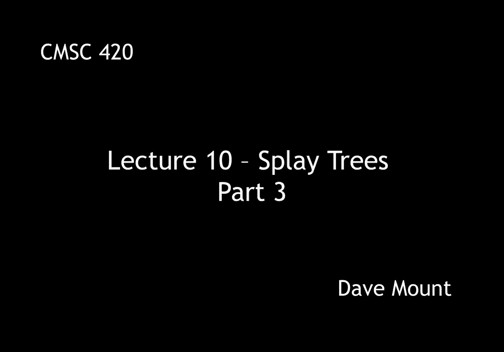
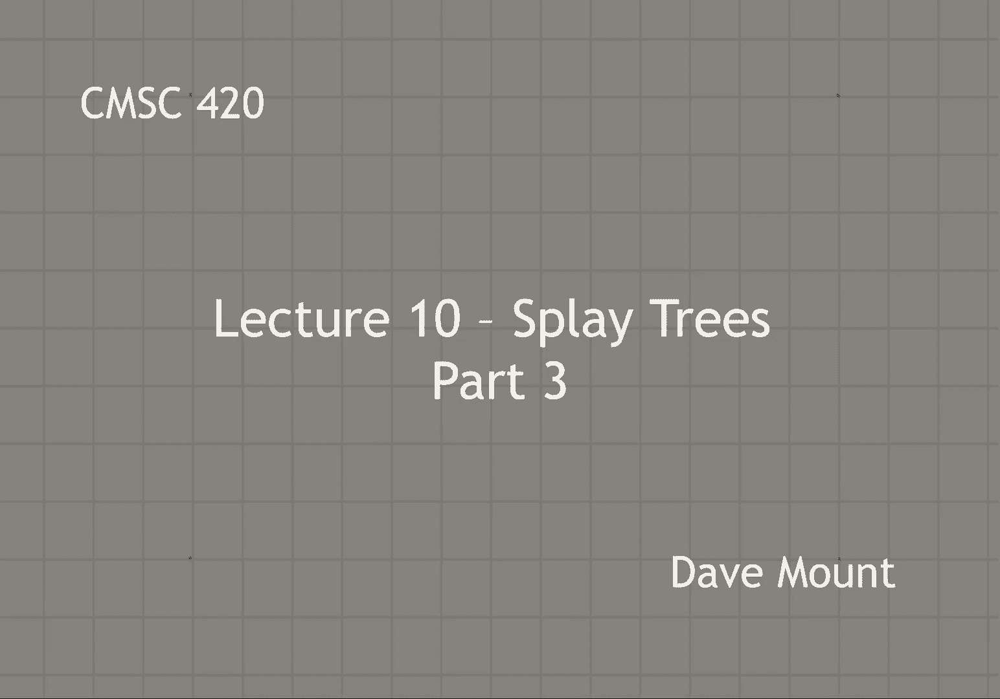
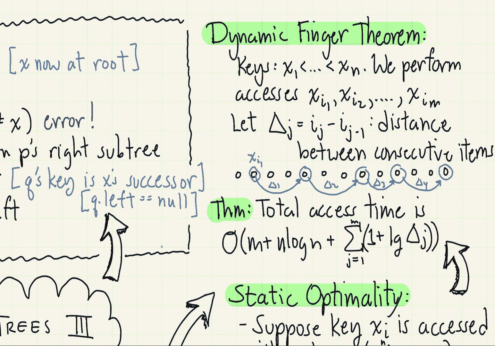

# 【双语字幕+资料下载】马里兰大学 CMSC420 ｜ 数据结构 (2021最新·完整版) - P27：L10- 伸展树(splay tree) 3 - ShowMeAI - BV1Uh411W7VF

in this segment we're going to finish up，talking about splay trees by talking。

about deletion and talking about some of，let's begin by talking about deletion。

to delete a key x from the display tree，the first thing we do is we perform a，splay of the key x。

as a result of this now the root node，contains the key x，let's let p denote the root of the tree。

so if the key stored there is not equal，to x then obviously we have a。

non-existent key error so we're going to，throw an exception accordingly。

otherwise we're going to have to，reorganize the tree to get rid of x now。

to do this we're going to have to do a，little bit of work，what we're going to do is we're going to。

go to the right subtree of the root and，we're going to perform another splay on。

x of course x is not going to be there，but that's going to bring up a node that。

is essentially x's in order successor，let's let q now denote the，right child of the root node。

observe that because q is containing x's，inorder successor it follows that there。

can't be anything in q's left subtree so，q's left subtree will be equal to null。

what we're going to do then is we're，going to set q left equal to p left。

now the root is sitting there all alone，and we're going to set the root equal to。

q and hence we've effectively unlinked，the key containing or excuse me the node。

containing x from the tree entirely，let's see what this would look like，pictorially。

so after the first splay of x we have x，at the root of the tree and we have two。

sub trees called them l and r for left，and right，okay p is that root node we now perform。

a splay of x in the right subtree r and，that's going to bring up a node y to the。

root of that subtree y is going to be，the inorder successor of x that is the。

key that is just following x in you know，according to the ordering of the keys。

and that means that there can't be，anything in y's left subtree，let's let r prime denote q's right。

subtree okay so the operations that，we've performed involve setting。

q dot left equal to p dot left so in，other words the left subtree has moved。

over to be y's new left subtree，and now we set the root to y therefore，we've effectively unlinked x。

okay so we've talked about the basic，operations uh find insert and delete on。

splay trees now let's talk about the，analysis of the running time for these，trees。

the running time is going to be done in，the amortized sense so any one operation。

might take o n time but over a long，sequence，we claim that the average time per。

operation is just going to be login i'm，not going to present the amortized。

analysis it's really pretty involved if，you look at the full pdf file lecture。

notes it's presented there，let me just say that it's based on a。

sophisticated what is called a potential，argument，intuitively the potential is a function。

that measures the amount of imbalance in，the tree trees that are well balanced。

will have a low potential and trees that，will be unbalanced that is or degenerate。

will have a high potential the proof is，based upon the observation that。

operations come in two different，varieties either the operation itself is。

efficient that is you know it involves，accessing a node that's maybe only log。

levels deep in the tree，or if it occurs to a node that is very，deep in a tree。

the ac the operation of accessing or，splaying that element is going to。

essentially pull that element and lots，of elements up um by decreasing their。

depth in the tree as a result the，potential of the tree is going to be，significantly reduced so。

again although i'm not going to prove it，there are a number of theorems that you。

can prove about splay trees which is why，they're kind of so amazing and why，people like them so much。

as i said before splay trees are what we，call an adaptive data structure they，tend to adapt to the。

access sequence that they're provided，with the first theorem is called the。

balance theorem the balance theorem says，that if you start with an empty。

dictionary and you perform any sequence，of m accesses say fines inserts or。

deletes okay the total running time is，going to be m log n，plus n log n。

where n is the maximum number of entries，at any time within the dictionary。

so observe what this means is，each of my m operations is effectively，taking log n time on average。

next let's look at a result called，static optimality what does this mean。

well the idea is that some keys are more，likely to be accessed than others，suppose a key x i。

has a probability of p i of being，accessed and let's assume that the sum。

over all the x i's right the sum of all，these probabilities is just going to be。

one in other words it's a discrete，probability distribution，a basic result from information theory。

is the best possible um you know average，access time you can expect to have in a，binary tree。

is based upon，the quantity called h which is known as，the entropy of the distribution。

h is defined to be the summation of p，sub i，times the log base 2 of 1 divided by p，sub i。

i'm not going to prove this but this，goes way way back to famous results by。

claude shannon and if you ever heard，about huffman trees this in fact is。

exactly the same result that huffman，trees are based upon the static。

optimality theorem says that if i give，you any sequence of m operations on a。

splay tree involving the keys x1 through，xn，where xi is accessed qi times。

let us define p sub i to be the access，probability that is it's the number of。

accesses q i divided by the total number，of accesses m the static optimality。

theorem says that the running time for，the m operations is essentially m times。

the entropy of the distribution where，entropy is understood in this kind of，empirical sense。

next let's consider something called the，dynamic finger theorem the dynamic。

finger theorem is based upon the idea，that，frequently，you access keys in such a manner that。

one of the keys being accessed is close，by to a key that you have previously。

accessed and such access should be，efficient let's imagine an old faction。

kind of dictionary that is one that's，stored in a book，suppose that you've just looked up a。

word in the dictionary and you put your，finger on that entry，next what you want to do is you want to。

find an entry that is alphabetically，close to the one you just found。

well you could of course start at the，beginning of the dictionary and search。

through it all over again or you could，start where your finger is and you could。

start moving from there，okay the idea would be that if you are，going from let's say one entry in the。

dictionary to another entry that's，nearby，the，search time should be proportional to。

the log of the distance that is the，number of words between them as opposed。

to the log of the entire dictionary size，this effectively is what the dynamic，finger theorem says。

suppose you're accessing a set of keys，x1 through xn okay suppose the accesses，are。

x of i sub 1 x sub i sub 2 dot dot dot，up to x sub i sub m in other words i 1 i。

2 these are the indices of consecutive，items that you're accessing so for。

example you might access you know entry，i don't know x5 then entry x8 then entry。

x13 so on and so forth，let's let delta i denote the，distance in terms of the indices of。

consecutive items if you just accessed，item you know let's say x5 and then you。

accessed item x10 then you have，essentially moved a distance of five。

units to get from one to the other so，delta j in that case would be five so。

pictorially if you imagine the entries，as being sort of lined up in a list the。

delta sub i's are providing you with the，distance between the entries as i've。

drawn them here they're all consecutive，but in general they don't need to be。

consecutive the delta i could actually，be a positive or negative quantity let's。

just think of it in terms of its，absolute value the dynamic finger。

theorem says that if you perform such a，sequence of operations the total access。

time is going to be m that is basically，constant time per operation。

n log n well you'd expect that that's，the time to sort all the entries and。

then the remaining running time grows，basically as the summation of the log。

base 2 of the delta sub js，i have to add a 1 to that because i have，to allow for the possibility。

that if delta sub j is in fact equal to，one that is if you're just accessing the。

varying you know next element after you，the log is going to be zero and of。

course i can't access something in zero，time so the extra plus one there is just。

to account for the fact that i don't，want to include let's say zeros in my。

in my asymptotic analysis here，there's actually a lot of other。

theorems that can be proved about splay，trees and i'd have to lead you back to。

well either the complete lecture notes，for a longer set of uh you know。

description of what these properties are，or i could refer you back to the slater。

and target paper but splay trees are，really very very nifty data structures。

in terms of all the properties that they，satisfy，like i said they maintain no balance。

information whatsoever and yet they kind。

of naturally adjust to the structure of，accesses that are being performed upon。

