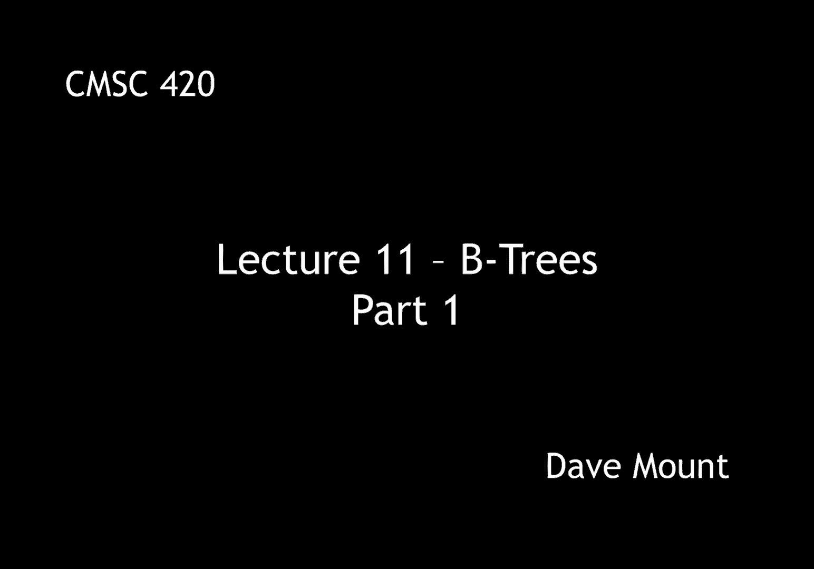
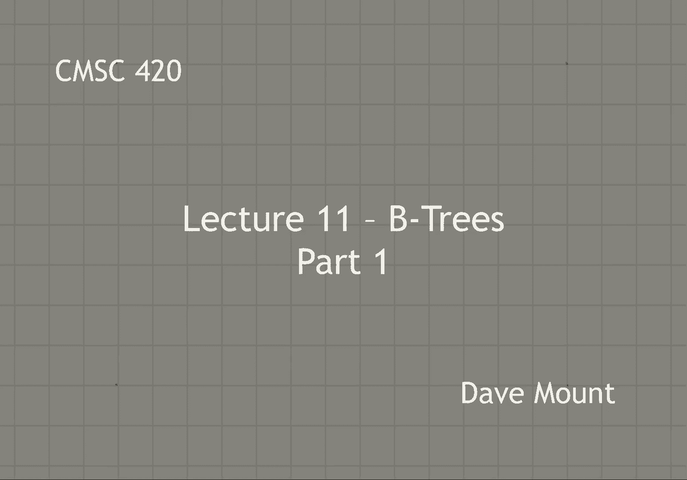
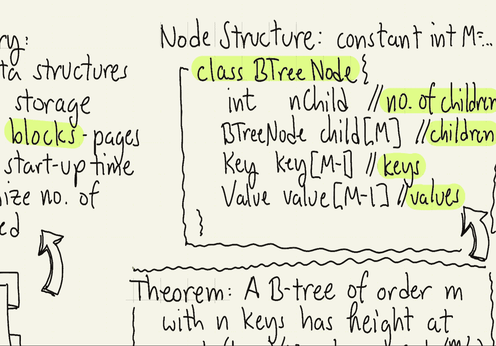
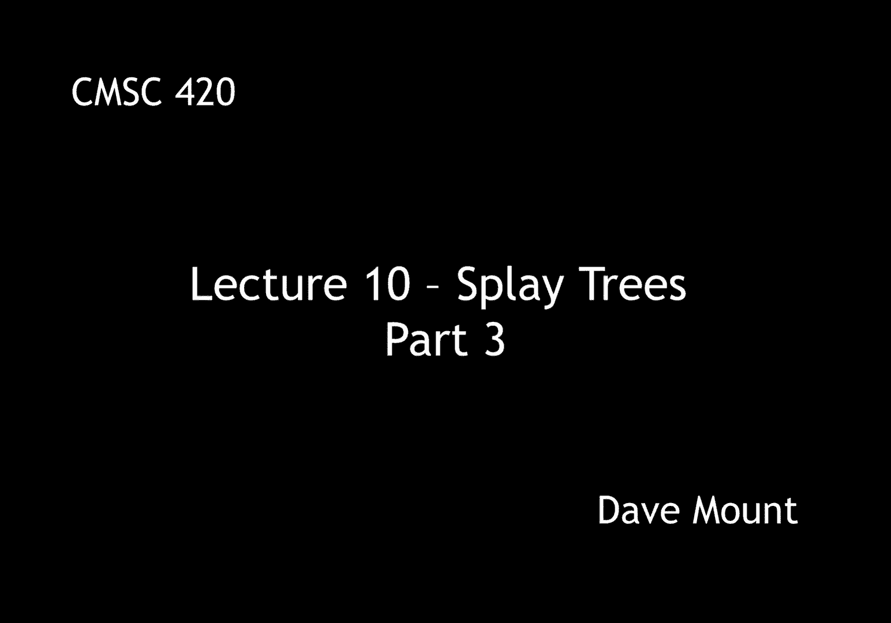

# 【双语字幕+资料下载】马里兰大学 CMSC420 ｜ 数据结构 (2021最新·完整版) - P28：L11- B树 1 - ShowMeAI - BV1Uh411W7VF

in this segment we're going to talk，about a brand new data structure called，a b tree。

b trees are motivated by the desire to，store data structures in secondary，memory that is on disks。

in fact most large data structures that，people work with reside on disks an。

important fact about disks is that they，are organized not in words but in blocks。

or what are sometimes called pages an，important practical issue that arises，with disk。

access is the notion of latency，transfer times are actually pretty high。

when transferring data to disk but the，catch is the startup cost is fairly high。

and hence you want to minimize the，number of times you attempt to access a，block on a disk let's say。

in order to minimize the number of，blocks that are accessed the idea is。

we'd like to create nodes that are，essentially the same size as the blocks。

themselves and this leads to the notion，of well very large nodes implies。

multi-way search trees as we saw with，two three trees it's very easy to，generalize the idea of。

search trees to a multi-way tree case，for example in this case i have a node。

storing three keys a1 a2 and a3，and accordingly it would have four。

children one containing the elements，less than a1 one containing the elements。

between a1 and a2 another one for a2 to，a3 and finally one for things that are，bigger than a3。

the natural way to generalize this to，let's say blocks of arbitrary size is in。

terms of something that is called the b，tree，this is perhaps the most widely used。

search tree because it is used in，virtually all database applications。

historically it was developed back in，the 1970s by bayer and mcrate this by。

the way was the same the crate of，priority search tree fame because b。

trees are so popular over the years，there have been numerous variants of bee。

trees that have been defined，although i'm not going to talk about it。

in these lectures there is one called，the b plus tree that's presented in the。

pdf files for the full lecture notes and，i suggest that you check that out it's a。

extended version of the b tree，so let's give the formal definition of，what a b tree is。

every b tree is defined by something，called its order and the order is going。

to be denoted m throughout my lectures，here m is going to be any integer that's。

greater than or equal to 3。 first off，the root is going to either be a leaf or。

it's going to have at least two children，so except for the root all the nodes are。

going to have between ceiling of m over，2 up to m children in the case of leaves。

the children are just null pointers，if a node has k children then it has。

exactly k minus 1 key values as seen in，our previous multi-way tree example。

the final requirement is that all the，leaves must be at the same level of the，tree。

notice the 2 3 tree that we saw earlier，in the semester in fact is just a，special case of a b tree。

where the value of m is equal to 3。well let's take a look at an example of，a b tree for。

the order m equals five so in this case，what happens is every note of the tree。

except for the root of course is going，to have between three to five children。

and hence between two to four keys so，when i draw my figures i always draw。

space for four keys and i leave a little，dash or hyphen when i'm not using the。

using that entry okay notice in every，case whatever the number of keys i have。

the number of children is always going，to be one extra and the leaves i've，drawn vertically。

not because they're really any different，from the regular nodes of the tree it's。

just that otherwise they take up too，much space in my drawings here so for。

example in this example the root，contains two keys and has two three。

children the keys are 49 and 75 right，key values less than 49 are stored in。

that right or the leftmost subtree，between 49 to 75 or in the middle，subtree and bigger than。

75 or in the right subtree the left，subtree，is going to be essentially full right。

it's going to have four，key values in it and five children as，with all the balanced structures we've。

seen an important question is what is，the maximum height of the tree obviously。

as the value of m gets bigger you expect，the height to become less although we're。

not going to prove it here，the theorem says that a b tree of order。

m that has n keys in it will have a，height at most，log base 2 of n divided by gamma where。

gamma is the log base 2 of m over 2。 so，as m gets bigger gamma gets bigger and。

hence the height of the tree gets，smaller，the theorem is not hard to prove and。

i'll refer you to the complete lecture，notes for the proof，what's the note structure for the b tree。

well first off we'll have a global，constant call that capital m that will。

contain the order of the b tree a b tree，node is going to consist of the，following items。

first there'll be an integer indicating，the number of children，this value is going to。

change dynamically as the algorithm，as the you know various dictionary。

operations are performed insertion is，going to add more things deletion is。

going to remove things so end child is，going to refer to the current number of，children in the tree。

next we'll have an array of child，pointers we'll allow for up to m，child pointers。

and then we'll store the keys and values，and the number of keys and the number of。

values can be at most m minus 1。in the next lecture we'll talk about the。

various manners in which b trees are，going to be restructured and then。

finally how to perform operations like。

