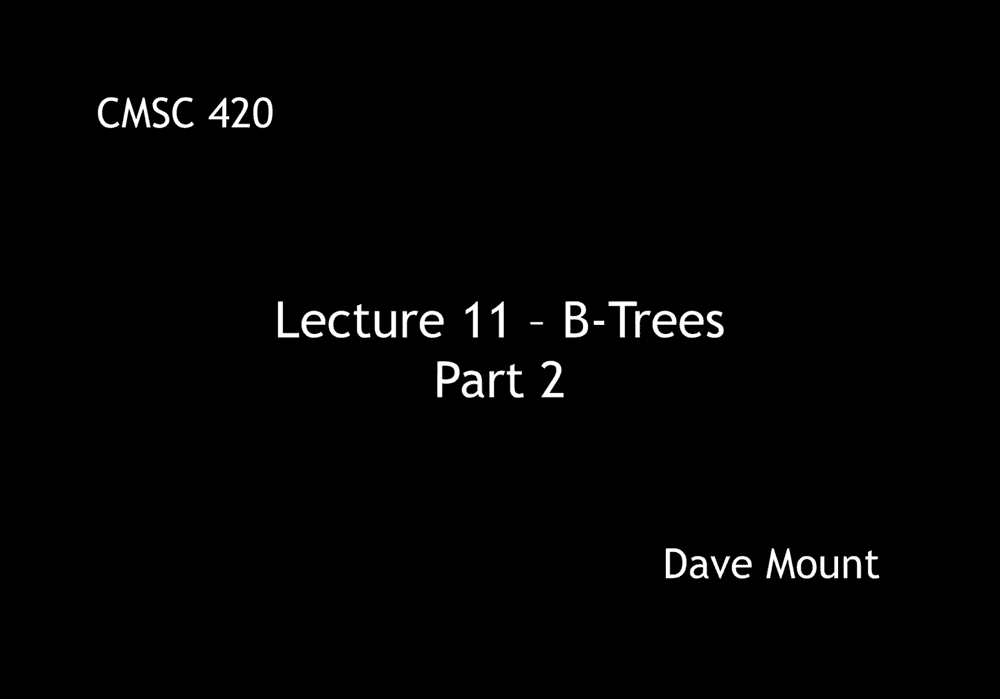
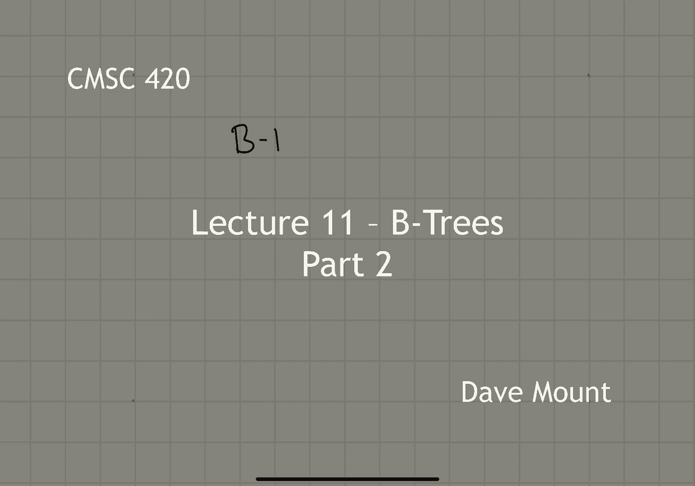
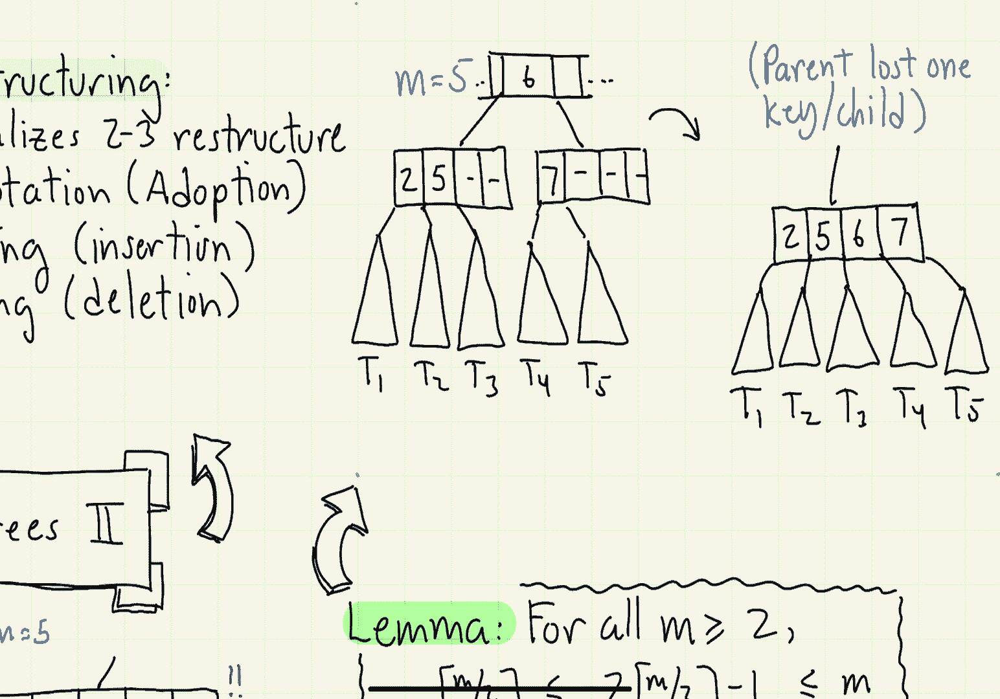
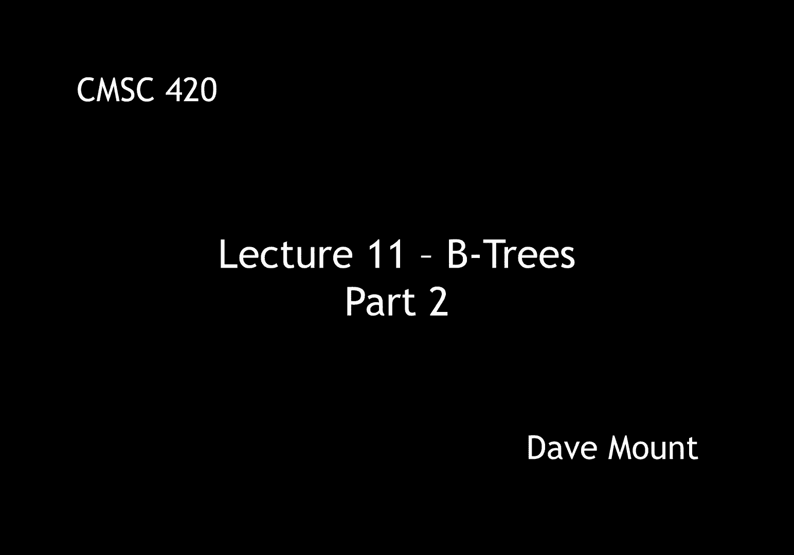

# 【双语字幕+资料下载】马里兰大学 CMSC420 ｜ 数据结构 (2021最新·完整版) - P29：L11- B树 2 - ShowMeAI - BV1Uh411W7VF

in this next section we're going to be，talking about the various restructuring。

operations for b trees，these are actually going to be fairly。

straightforward generalizations of these，restructuring operations that we。

performed for two three trees the only，difference now is we have to make them，work for。

b trees of arbitrary orders，there's going to be three basic，restructuring operations。

key rotations first which remember i，could like to call adoption or child，stealing，um。

splitting that is taking a single note，that has too many keys or too many。

children and splitting it into two and，merging that is taking let's say two。

keys where at least one of them has too，few entries and then merging them。

together into a common node let's begin，by talking about key rotation or as i，call it adoption。

this operation is applied in，two cases first off it can happen。

whenever a node has too few children and，basically needs to borrow a child from。

one of its neighbors another possibility，is if a node has too many children and。

one of its neighbors can essentially，take over one of your children so let's。

consider the case where a node has too，few children this usually happens when。

you're doing deletion remember the，number of children you're allowed to，have is ceiling of m over 2。

 so if you，have m over two minus one that is you've，lost a child and you need to essentially。

you know get a child to come back into a，valid state for a b tree you look at。

your immediate siblings to the left and，right and you ask do either of them have。

an extra child to spare that is is the，number of children they have at least。

the ceiling of m over two plus one if so，you're in a situation where you can do，an adoption。

what you do in this case is you go to，the sibling that has the extra。

you know children you take one of its，children from it now notice though when。

you take the child you now have picked，up an extra you know child of your own。

which means you need an extra key the，way you get the extra key is you rotate。

the node the node rotates from the，sibling up to the parent and then you。

take the key value i'm sorry the key，goes from the sibling up to the parent。

and then the associated key comes down，from the parent back to you we'll see。

how that works in just a second whenever，this operation is applicable it is the，preferred operation。

the reason is because you don't have to，create any new nodes you're essentially。

just moving keys around between an，existing set of nodes，and whenever it's performed essentially。

you're done with your update operations，we'll see that the other two。

update operations splitting and merging，have the tendency to propagate in fact。

they can propagate all the way back up，to the root in contrast when you do a。

rotation the first rotation essentially，means that you are done with any。

rebalancing or restructuring operations，so let's take a look at this little，example，i have。

two nodes one containing two four five，one containing nine and they're under a。

parent node that contains the key seven，that separates them okay and suppose。

this is a tree of order five so what，does that mean it means that。

every node has to have at least three，children and it has to have at least two。

keys that node with the nine in it is，under full and therefore it needs to。

right it needs to have an extra child，so what it does is it looks to its，neighbor，okay。

its neighbor actually has or its sibling，actually has an extra key that it can。

give up right you need to have at least，three children and it has four so we，take the closest。

child tree call that t，okay we move it over into our node but，now to compensate for that i have to。

essentially move the key 5 up to the，parent，okay and then i have to move the parent，key 7。

down to where i am，notice the contents of the key t are，strictly greater than 5 right because。

they are to the right side of five and，because they're in the left child。

associated with seven they're all going，to be strictly less than seven so those。

values are going to be between five and，seven，consequently we'll notice when i've，moved it over。

it is still in the valid position right，because it is to the left of seven so。

the values are less than seven and it's，in the right child of five so the values。

are greater than five notice now，everybody is happy both of the two。

children nodes now have three children，which is allowed when i have a b tree of，order five。

the next operation is called node，splitting this happens when you have。

performed an insertion into a node and，now it has too many children or in the。

case of a leaf node it has too many keys，remember you can have as many as m。

children so if you have m plus one，children you're over full or，equivalently if you have。

m keys or more you are essentially in an，overfull situation in this case what we。

do is we split the node into two nodes，the sizes of these two nodes will be。

um well one will be exactly the minimum，size that is it'll have ceiling of m，over two children。

i'll call that m prime and the other，will have the remaining ones because the。

number of children is m plus one right，the other one will have m plus one minus。

m prime or m plus one minus ceiling of m，over 2。 well you might wonder are these。

sizes going to be valid well to show，this you have to prove a little utility，lemma。

obviously the tree of size you know，ceiling of m over 2 that's going to be。

legitimate because that is what the，rules allow in the b tree，right how about the other one though m。

plus one minus the ceiling of m over two，well you can prove that for any value of。

m that's greater than or equal to two，and remember with b trees m is always。

greater than or equal to three so this，is fine，the value of m plus one minus ceiling of。

m over two will be between ceiling of m，over two and m and this is what is。

required by a b tree of order m so，indeed both of these nodes of size m。

prime and m double prime will be valid b，tree nodes okay so let's take a look at。

an example consider the following node，in a tree of order five so this node has。

six children which is too many，okay so that means that we have to do。

something what the split does is it，produces two sub-trees right one of the。

sub-trees is of size ceiling of m over，two m is five so that's going to be。

it's going to have three children in it，in particular three children and two。

keys so the two and the three will take，those first three children from that，node。

the other child will take the or the，other note of the split we'll take the。

six and the nine and it'll take the last，three keys，from the node and notice okay all the，trees are。

handled now right t1 t2 t3 up to t6，however notice we've got an extra key。

that is the middle key 5 is still，floating around what do we do with that。

well the answer is we move that key，by promoting it up to the parent node。

okay this is going to insert an，additional key and an additional child。

in the parent node right where's the，additional child well notice we've just。

replaced one node with two so the parent，is going to get an additional child okay。

when this happens of course the parent，might actually split itself and of。

course this could propagate all the way，back up to the root，the third restructuring operation is。

called node merging this is applied，whenever a node has too few children。

that is ceiling of m m over two minus，one when the node looks to either of its。

two siblings it sees that neither of，them can give up a child both are。

critical in the sense that they have，exactly，ceiling of m over two children so in。

this case what we're going to do is we，take either of the two siblings and。

we're going to merge them together，to perform a to produce a new node where。

the number of children is，well our number ceiling of m over 2，minus 1。

plus my siblings number of children，that's ceiling of m over 2。 again is。

this node going to be legitimate，and you can prove the theorem，the following lemma。

that says that the number that you get，notice that the value here is 2 times。

ceiling of m over 2 minus 1。 that's the，number of children in the new merge node。

that number will always be between m and，ceiling of m over 2。this is the。

range of values that's allowed for a b，tree of order m so in other words the。

resulting node is always going to be，valid，so let's take a look at an example again。

for m equals five okay suppose i have，these two nodes um one contains the two。

and a five has three children okay so，that's the minimum allowed for m equals，five，the other has。

two subtrees t4 and t5 with a key of，seven okay that is too few so this node，is critical。

in fact not just critical but this node，is an error so we need to do something。

what we're going to do is we're going to，merge the two nodes，so what does that mean it means we。

combine all five subtrees together t1，through t5，we put all the key values 2 5 and 7 and。

we bring down the key value six from the，parent to sort of fill in the additional。

gap here okay so this note is in good，shape right it has the maximum desired，number of children。

and you'll notice by the way though that，the parent has just lost one child it。

used to have two children now it has，just one and it's lost the key six。

okay so the parent might have to perform，either a merge or rotation if it's gone。

to be let's say if it's if it's size has，become too small and again this could。

propagate all the way back up to the，root if it goes back to the root and the。

root effectively now has just a single，child then what you do is you just。

delete the root and this operation，occurred exactly the same when we had。

two three trees okay that's all for this，segment in the next segment we're going。

to show how to re how to combine these。

