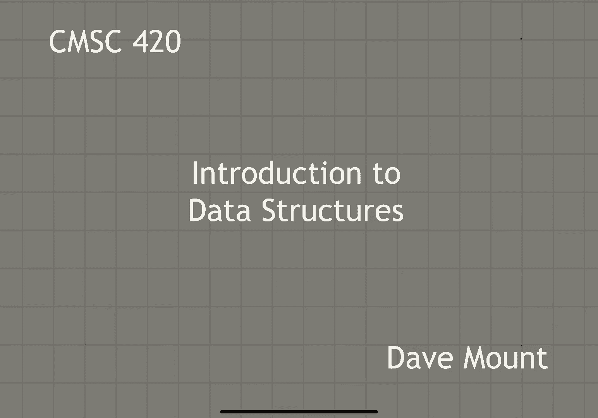
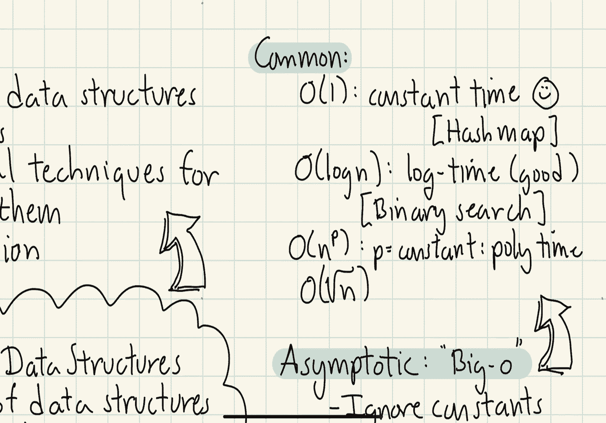
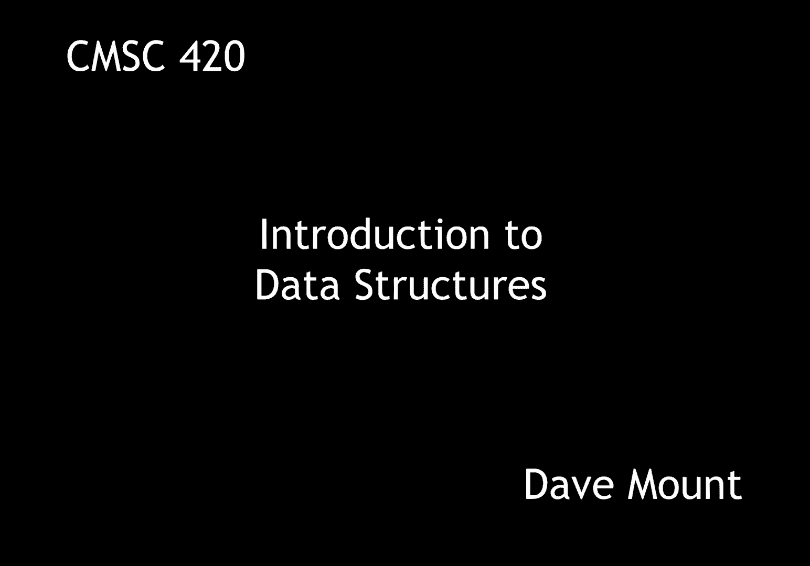

# 【双语字幕+资料下载】马里兰大学 CMSC420 ｜ 数据结构 (2021最新·完整版) - P2：L1- 课程介绍与背景知识 2 - ShowMeAI - BV1Uh411W7VF

hello everybody，in this first fast-forward segment we're，going to be giving a very high level。

introduction to the concept of data，structures and say a little bit about，our approach this semester。

i'll begin by talking about some of the，basic elements of the study of data，structures。

next i'll talk about our general，approach to the design and analysis of，data structures。

finally i'll give a short review of，asymptotic analysis and some of the。

common asymptotic functions that one，encounters when working with data。

so let's begin with an overview of what，this course is going to cover。

well first and foremost we're going to，discuss a number of fundamental data。

structures and the algorithms used to，manipulate them，next we're going to talk about the。

various mathematical techniques used for，analyzing these data structures。

and finally we'll talk about the，efficient implementation of these data。

structures which will mostly take the，form of programming assignments that，you'll be working on。

first and foremost data structures are，fundamental to computer science so。

fundamental that i had to write it in，big block letters，it doesn't matter which field of。

computer science you're working in every，field will involve in some manner，another。

storing retrieving and processing data，of various sorts，examples of fields in which data。

structures are used include information，retrieval well this is obvious this。

basically is what information retrieval，is all about，geographic information systems for。

example if i want to store map data，think of google maps and things like。

that machine learning applications，for example i would like to do，classification。

and analysis of data usually in high，dimensional spaces this usually involves。

studying multi-dimensional data，text and string processing so for，example storing。

large corpus of text and then quickly，searching for strings within them，computer graphics。

storing large sets of geometric models，and being able to access these to。

determine their you know visibility and，lighting properties and well many many。

other that i could certainly spend the，rest of the lecture talking about but。

next let's take a look at the basic，elements that are involved in the，analysis of any data structure。

the first question involves that of，modeling how do you go from real world，objects to。

their encoded computer representation，the next question is what operations are。

allowed to be performed to access or，modify the，data elements in your structure。

next the question is how is data going，to be represented that is how is it。

going to be mapped into memory is it，going to be stored in an array or is it。

going to be stored as a set of nodes how，are these nodes going to be linked，together and so forth。

finally，how is it that the operations that we，are talking about earlier going to be。

there are many different ways in which，to teach the topic of data structures。

some are more theoretical some are more，practical and implementation oriented。

in this course we're going to use sort，of a balance of the two different，methods。

much of our approach is going to be what，i would describe is theoretical or think。

of this as being sort of algorithms，based，we're going to approach the problem in。

much the same way that we would in a，course like cmse351 or cmsc 451 by。

presenting algorithms in the level of，pseudo code and，performing an asymptotic analysis for。

the efficiency of these algorithms，the second approach will be a much more，practical one。

this will take the form of java，implementations of the algorithms。

thinking about questions like you know，how does one map the algorithms into，actual。

good well-structured object-oriented，code and some of the more practical。

aspects of how these various data，structures perform things that are not。

necessarily revealed by the theoretical，a major component of our theoretical。

analyses of the algorithms that apply to，various data structures。

is going to be based upon an asymptotic，analysis，so an asymptotic analysis of let's say，running time。

involves the analysis of the execution，time of a data structure or some。

operation on the data structure as a，function of，n which will usually denote the number。

of items in the data structure by the，way it can involve other parameters as。

well but n is certainly the most common，one，of course there are many different data。

sets of size n and so the question is，well what do you mean by running time。

there are various ways to measure this，the most common one by far is to look at。

the worst case running time over all，inputs of size n，another approach would be to average。

over all inputs of size n usually you，have to define some sort of a。

probability distribution on the inputs，of size n，another possibility is you can imagine a。

randomized algorithm where，the algorithm uses a random number，generator and you average over all。

there's one very important one that i，would like to highlight called amortized。

analysis that we'll see a lot this，semester in an amortized analysis you're。

performing a worst case analysis over，all the possible data sets but what you。

do is rather than looking at each，operation individually you look at a。

stream of operations and you ask what is，the average time for a given operation。

so the idea is that some of the，operations like rebalancing operations。

or rebuilding operations could be very，slow，as long as the overall average of the。

as mentioned earlier our theoretical，analyses are going to be based upon。

asymptotic analysis this usually goes in，the form of a big o notation。

the basic ideas behind an asymptotic，analysis，are that you ignore constant factors and。

you focus on the trends as n becomes，very very large，for example suppose i have an algorithm。

whose running time is 34 times n squared，plus 15 times n log n plus 143。 how。

would i describe that algorithm's，running time asymptotically，well my big o notation would say that。

the running time is on the order of n，squared why well because。

of all the various terms the n squared，the n log n and the constant term the n。

squared term is growing fastest so as n，becomes very large it's going to。

dominate and the second thing is i'm，well let's list some of the common。

asymptotic terms that show up in data，structure design，the first is o of 1 that means that the。

operations on your data structure just，take constant time and that is the best。

that you could possibly hope for in an，asymptotic world，examples of this would be something like。

hash tables where a hashing operation in，expectation takes only constant time，next。

o of login which is what i would call，logarithmic time，is pretty doggone good。

basically this is the running time for，binary search and almost all the data。

structures we're going to look at this，semester are going to run in log in time。

if i have a set of n items and i want to，locate one of those items。

any comparison based algorithm that is，any algorithm which is based upon making。

sort of two-way or let's say a constant，number of different decisions。

log n is about as good as you can hope，to get，next would be polynomial time that would。

have the form n raised to the power p，where p is some constant，um the polynomial doesn't need to be。

just like n squared or n cubed that's，usually what you see in algorithm design。

when we're building data structures we，usually want things to run faster than。

linear time and so an example would be，something like square root of n that is。

n raised to the power one half，this would be an example of polynomial。

time in the design of data structures，polynomial time is，let's say the weakest of these three in。

terms of the asymptotic behavior and，there are some problems especially。

problems that show up in geometry where，polynomial time is really the best that。

