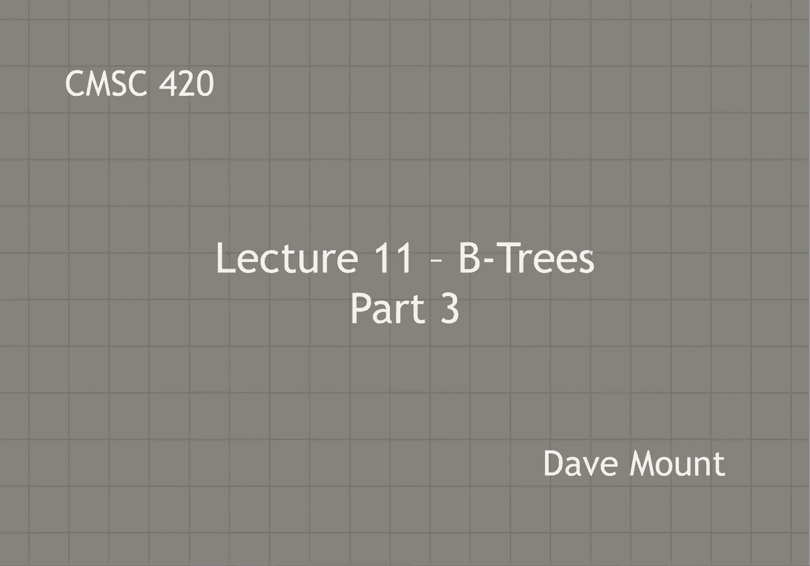
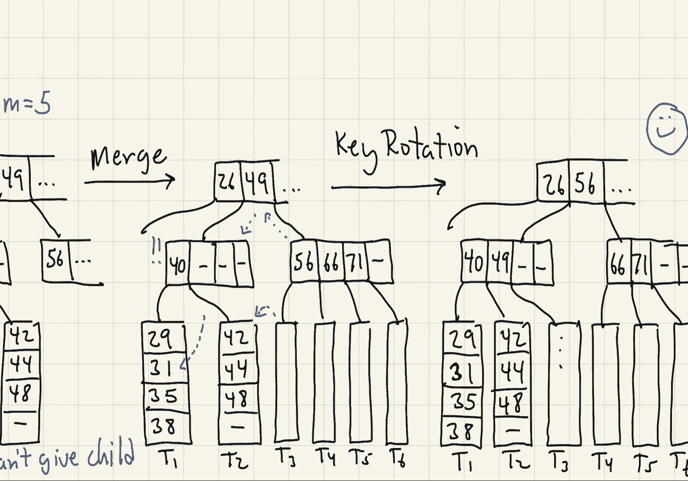
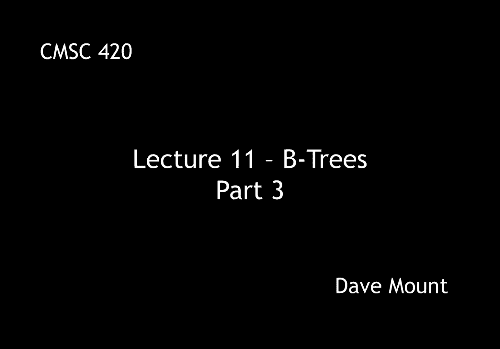

# 【双语字幕+资料下载】马里兰大学 CMSC420 ｜ 数据结构 (2021最新·完整版) - P30：L11- B树 3 - ShowMeAI - BV1Uh411W7VF

in this last segment on b trees we're，going to talk about how to perform。

insertion and deletion and we're going，to give a couple of examples of these。

so first let's talk about，insertion insertion works as，you know in all of the search trees that。

we've discussed by first finding the，place at which to insert the new key。

basically by hunting down until we get，to the leaf level when we get to the。

appropriate leaf node what we do is we，will add the key in value at this leaf。

node okay and now we check to see if the，leaf has become over full remember。

a leaf node can have up to，m minus one keys in it and if it becomes。

over full then essentially what happens，is we're going to have to perform some。

kind of an operation to fix that，okay，first thing we can do is we'll take a。

look at either of the siblings on either，side can either of our neighboring。

siblings uh absorb one of our extra，children，if so that'll be our preference and。

we'll perform a key rotation in order to，do that okay if so we're now done no no。

other rebalances or restructuring，operations are going to be needed。

the other possibility though if this is，not the case is we're going to need to。

split this node okay this means creating，a node，of roughly equal sizes for each of the。

keys right we're going to copy the keys，to each one of these guys distribute the。

um you know well there are no sub trees，at the leaf level right because there。

will just be null pointers and remember，that this will involve，the middle key essentially being。

promoted up to the parent level and of，course this may then propagate because。

the parent may split and so on and so，forth okay let's take a look at an。

example of this on a b tree of order，five，suppose i want to insert the key value。

29 into the following b tree and i've，just shown sort of part of it here。

because these b trees tend to be very，so 29 is less than 49 it's between 20。

and 31 so we go into this subtree or，assuming this leaf node with the 23 25。

etc and we insert the new，key value 29 inside of there，notice however a。

we're now in an overflow situation，because every，node in our b tree can only hold four。

keys and now we've got five in there，we're going to look to the neighboring。

leaf nodes t2 and t4 if either of them，had three or fewer，keys there then i could rotate a key。

into one of them let's suppose that both，of them happen to be full so this is。

going to necessitate a split，to split the node what we're going to do。

is we're going to create two new leaf，nodes t3 prime and t3 double prime。

half of the keys that is the 23 and 25，will go to one of them the other half of。

the keys the larger half the 29 and the，30 will go to the other one。

and the middle key 26 will be promoted，up to the parent remember we have to do。

this because the parent is now getting，an additional，note it's getting an additional leaf。

node and therefore it has to have an，additional key to you know to。

distinguish between these two now the，problem though is our parent node is。

over full right it's got six children，and you're only allowed to have five，children。

let's again suppose that when i look to，the um you know to my neighboring。

sibling this sibling is also full you，know it has its full contingent of four。

so we're going to have to perform，another split，to do the split we're going to again。

split this note into two the lower two，keys that is the 7 and 20 will go to the。

left side and it will take three of the，sub trees with it that is the t1 t2 and，t3 prime。

the second node is going to get the，higher keys that is the 31 and the 40。

and it's going to take with it the three，higher subtrees the t3 double prime t4。

and t5 and then the middle key which in，turns to be the same as the 26 before。

but in general it'll just be whatever，the middle key was that's going to get，promoted up to the。

parent level that's now up at the root，so the root had two children before now。

it's got three children and two keys and，at this point everybody's happy and so。

we're done with the operation，next let's see what deletion does。

so as always we're going to perform a，search through the tree to find out，which node to delete。

if the node is at the or excuse me if，the key that we find is at the leaf。

level we're fine if it's not at the leaf，level then as usual we're going to find。

a key from the leaf level to use as the，replacement we copy this you know into。

the deleted keys position and then we，recursively delete from the leaf level。

so you're always deleting from the leaf，level through this replacement copying，process。

after we perform the deletion，the，leaf node may now be under full that is。

to say you know remember it's it，requires to have ceiling of m over two。

children that is ceiling of m over two，minus one keys if it has fewer than that。

that is if it has ceiling，m over two minus two keys then we're in。

an under full situation again we're，going to look to our siblings to the。

left and right if either of them can，afford to give up a child we're going to。

perform an adoption or a key rotation to，take care of things if so we're all done。

if not then notice that you know both of，our siblings are going to essentially be。

as small as they can possibly be that is，to say they will have ceiling of m over。

two children or equivalently ceiling m，over two minus one keys。

we're gonna do is we're gonna now merge，our node with that sibling node and。

that's going to create one replacement，node between the two of them remember in。

the process of doing a node merger we，have to steal a key from the parent node。

and if so the parent may now become，under full and the process may propagate。

again all the way back up to the root at，the end of the day by the way。

remember the root is required to have at，least two children if it loses one of。

those children and the root has now only，one child then what we do is we。

essentially destroy the root and its，child its only child becomes the new。

root okay let's take a look at an，example of this，consider the following sort of partial b。

tree of order 5 and let's suppose we，want to delete the key 30。

as usual we fall down in the tree until，we discover the key 30。 i've made it。

easy here because i've actually put it，in the leaf，okay notice when i remove，that key。

this leaf node in which it is becomes，under full right in a，tree of order five right the minimum。

number of children，that a note can have is three the，minimum number of keys a note can have。

is two and this node now has only one，it's only got the 29。we look to our sibling our sibling is。

also as small as it can possibly be it's，only got two keys inside of it so we're。

going to have to do a merger so we're，going to merge the 29 with the 3538。

and we steal a key from the parent so，we're going to have 29 31 comes down。

from the parent 35 and 38 these all go，together to form an essentially full，new leaf node。

going back up to the parent though now，we observe that the parent has lost one。

of its keys and so now it's got two，children and one key and again for a b。

tree of order five that's not allowed so，we're going to have to fix that。

again we're going to look to either of，our neighboring siblings to see if they。

can give up a um you know a child for us，and when we look at our right sibling we。

see indeed that it's got enough you know，children that it can spare one for us。

okay great so we're gonna do an adoption，from our sibling first off we're going。

to rotate that leftmost key the 56 up to，the parent and rotate the 49 down to us。

and the second thing is we're going to，move that leftmost child into our node，so the child t3。

right that becomes our child，the 56 moves up to the parent the 49，moves down。

okay and this is the tree that we have，at the end of the day notice now，everybody's happy。

all of the nodes have you know the，requisite number that is at least three。

