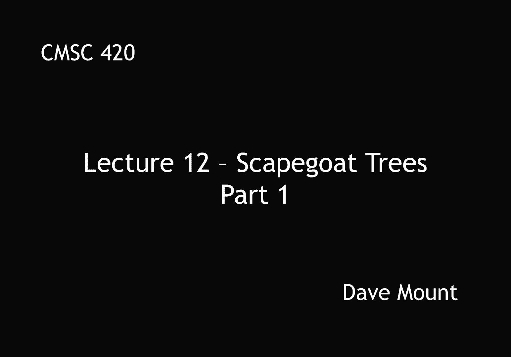
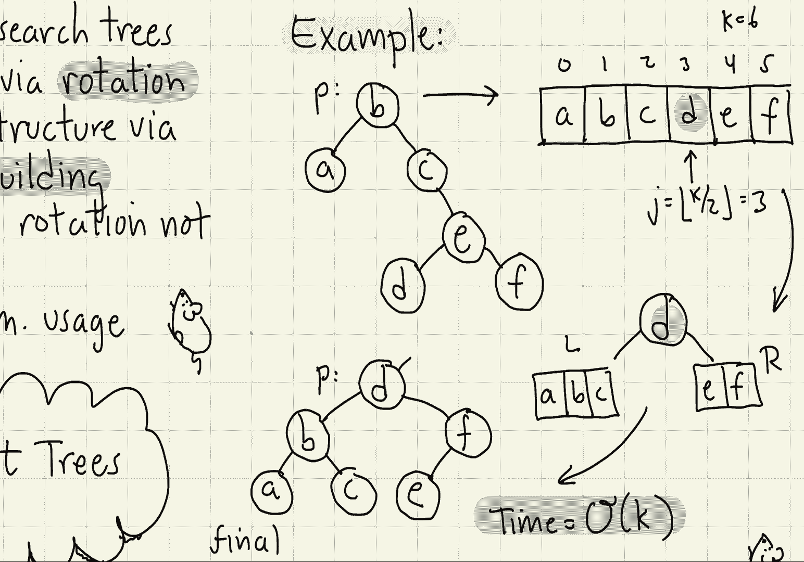
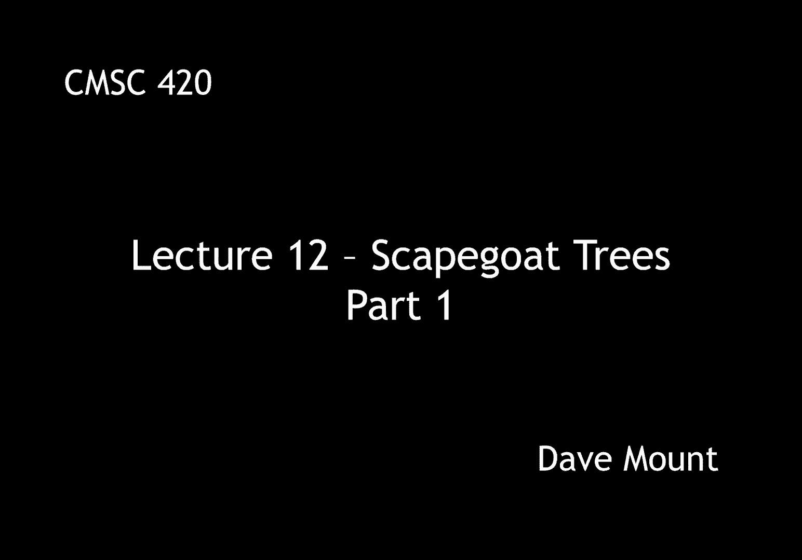

# 【双语字幕+资料下载】马里兰大学 CMSC420 ｜ 数据结构 (2021最新·完整版) - P31：L12- 替罪羊树(Scapegoat Trees) 1 - ShowMeAI - BV1Uh411W7VF

in this lecture we're going to talk，about a new data structure called，scapegoat trees。

let's recall that we've seen a lot of，different data structures this semester。

most of these data structures have been，based upon what i would call incremental。

restructuring operations mostly，key rotation today though we're going to。

study a very different approach to，balancing，search trees and this is by rebuilding，subtrees。

why would we use such an approach well，there's a couple of good reasons。

first off for some tree based data，structures the concept of rotation。

doesn't really make sense we're going to，see that this is the case when we study。

multi-dimensional data structures，another argument in favor of rebuilding。

has to do with memory usage，memory usage is most efficient when the，memory can be compacted。

oftentimes when you perform kind of，random access operations to data。

structures memory tends to become rather，free fragmented and by rebuilding。

subtrees of your data structure you can，compact the memory consequently making。

you know let's say future memory，accesses more efficient，today we're going to talk about。

scapegoat trees，the history of these trees is kind of，interesting they were first invented by。

arn anderson in 1989。the paper where these appeared occurred。

in a rather obscure conference and so it，was the result was not widely known to a，lot of people。

about four years later uh galperin and，rivest essentially reinvented the same。

idea um they'd risk rediscovered the，idea they reanalyzed it and they came up。

with a couple of additional extensions，to the to the data structure。

scapegoat trees are analyzed in the，amortized sense that is to say that even。

though each individual operation could，be relatively expensive over a long。

sequence of operation the average，execution time per operation is just log，in。

interestingly enough unlike splay trees，where every operation could take a long，time。

scapegoat trees the find operation is，going to guarantee to be running in log。

in time so only the modification，operations insert and delete might take。

longer the philosophy with scapegoat，trees is we just let things happen。

particularly when we insert and delete，things we just let the tree let's say。

develop as it would with a regular，unbalanced binary search tree however if。

we ever detect that a subtree is，becoming unbalanced what we do is we。

essentially destroy that tree and build，an entirely new pristine balance tree to。

replace it let's give an overview of the，various operations the insert operation。

is essentially the same as the insert，operation for the standard binary search。

tree but when we insert the new node we，keep track of its depth and if its depth。

is too high relative to the number of，nodes in the tree，then we re-trigger something called a。

rebuilding event we trace the search，path back towards the root if along the。

way we find an unbalanced node that is a，node whose left sub-tree is。

significantly different in size than its，right sub-tree，this node is declared to be the。

scapegoat and what we do is we，completely rebuild，the，scapegoat subtree the find operation is。

exactly the same as the find operation，in a standard unbalanced binary search，tree。

we're going to show that the height，of a scapegoat tree is always going to。

be bounded by log base 3 over 2 of n，that is to say roughly 1。7 times log。

base 2 of n the delete operation is also，the same as in the standard binary。

search tree but there's a little twist，here if the number of delete operations。

gets to be large relative to the number，of entries in the tree。

then we just rebuild the entire tree how，do we keep track of the number of。

deletions relative to the size of n this，is done by maintaining two variables。

initially when the tree is first，constructed both of these variables are。

initialized to zero whenever we do an，insertion we increase both of these。

values both n and m are incremented by，one when we delete an entry from the。

data structure we decrement n by one so，the value of n is always tracking the。

exact number of nodes in the tree the，value of m just keeps increasing and，increasing。

as we perform let's say insertion，operations，if we ever detect that the value of m is。

getting to be large relative to the，value of n，then what that means is we must have。

performed a lot of deletions and then，what we do in this case is we just，rebuild the entire tree。

by the way after we rebuild the entire，tree we're going to set the values of n。

and m back equal to one another so the，process begins all over again。

well before we get into the details of，talking about how the individual。

operations are performed let's first，talk about how do you rebuild a subtree。

suppose that p points to the root of the，sub tree that we want to，we want to rebuild。

first thing we need to do is we need to，collect all the keys that lie in this。

subtree so we just do an inorder，traversal of all of p's keys and we。

store this in an array let's call that a，then we're going to invoke a recursive。

helper function called bill subtree on，this array，what does build subtree do well let's。

suppose it's given array a of size k，first off as a basis case if k is ever。

equal to 0 well then we don't have any，nodes left so we just return null in。

other words we just create an empty，binary tree，otherwise let's let j be the median。

index that is k over 2 let's take the，floor of that and let's let x denote the。

element a sub j so that's the element in，the middle of the sorted array a。

recursively we build a subtree on all，the smaller keys that is zero through j。

minus one let's call that l，and we also build a subtree on all the。

larger keys a of j plus one up to k，minus one call that r，finally what we do is we create a tree。

with x is the root，l is the left sub tree and r is the，right sub tree。

let's take a look at this at a small，example，so let's consider the following subtree。

and again this is not the entire tree，but this is just some subtree within our，larger tree。

and we've detected that this subtree is，too unbalanced we perform an inorder，traversal of the。

nodes in this tree and we store those，key values in the elements of an array。

okay so a b c d e f there are six，elements in total，we compute the。

median index that is the index six over，two that is three，store that in j and then that element d。

is going to be represented in our node，our key value x，okay then we recursively，build the。

most balanced subtree on the you know，the left side uh sublist that is the abc。

and we recursively build it on the right，side sublist e and f and then we put。

those two subtrees underneath the common，root node at the median that is d。

so the recursive call on abc produces，that little triple a b，and c right the recursive call on the。

right subtree produces this sub tree，with f is the parent and e is the child。

and then we put those two sub trees，underneath the d and this gives us the。

final you know quote unquote nicely，balanced subtree at the end of the day。

the subtree is balanced because we，always take the root element to be the。

median of the list so the tree is，basically as balanced as it can possibly。

be in the next segment we're going to，talk about how to use the rebuilding in。

