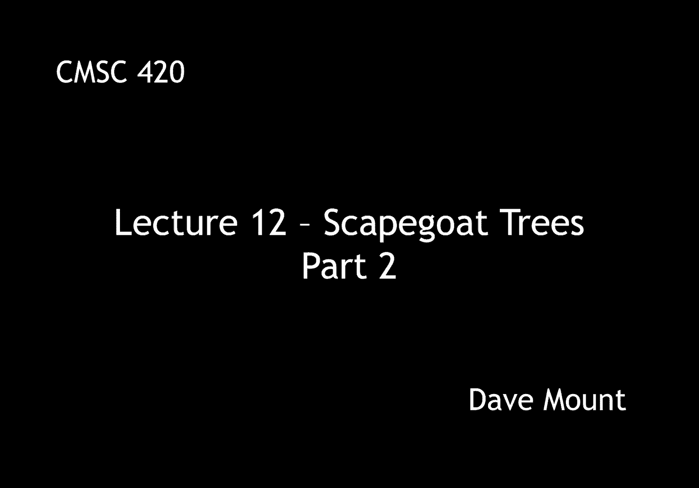
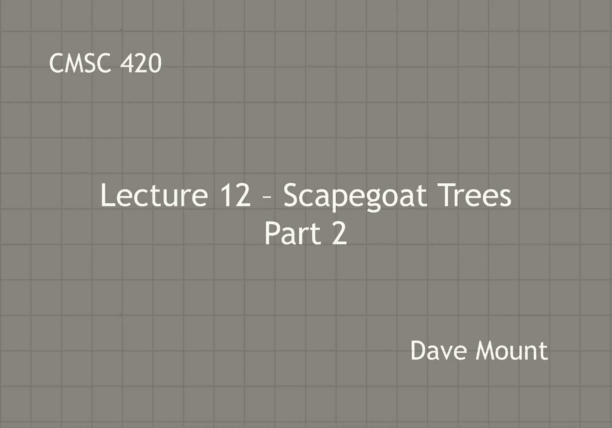
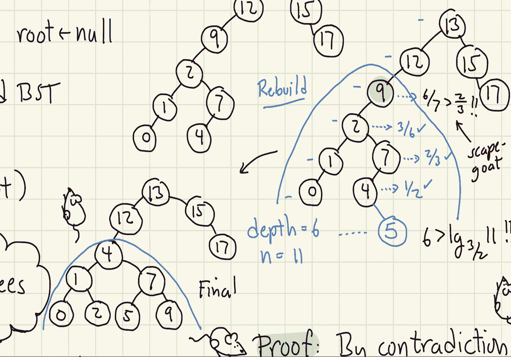

# 【双语字幕+资料下载】马里兰大学 CMSC420 ｜ 数据结构 (2021最新·完整版) - P32：L12- 替罪羊树(Scapegoat Trees) 2 - ShowMeAI - BV1Uh411W7VF

in this segment，we're going to present a few more of the，details regarding scapegoat trees。

so let's talk about the details of some，of the dictionary operations。

well to begin for the initialization，we're going to set our two parameters n。

and m equal to zero and we're going to，set the root to null，remember the job of n。

is to keep track of the number of nodes，in the tree and the job of m is to keep。

track of the number of insertions，the deletion operation begins in the。

same manner as a standard binary search，tree，after we've deleted the node we do two，things。

first off we decrement the value of n，right reflecting the fact that we have，lost one of our nodes。

and then we also check to see whether m，is greater than 2n，if it is then we've effectively done too。

many deletions and we invoke a rebuild，operation on the entire tree that is we。

rebuild the root of the tree the time，for this operation，is essentially just o of n remembering。

that the rebuild operation can be done，in time proportional to the number of。

nodes in the tree being being rebuilt，the insert operation is by far the most。

complicated so first thing we increment，both end reflecting the fact that we。

have a num a new element in our tree and，we increment the value of m as well。

the insertion process begins in exactly，the same way as it would for a standard。

unbalanced binary search tree except，we're going to keep track of the depth。

of the note as we march down the tree，remember the depth of a node is the。

number of edges from the root so the，roots at depth zero and it increases，from there。

after we've inserted the new node we，check to see whether its depth exceeds。

log base three halves of m if so this，triggers a rebuild event we are going to。

rebuild some subtree the question is，going to be which one，we trace the path from the inserted node。

back up the tree towards the root，for each node we visit，we check the size of the subtree rooted。

at this node so define size of p to be，the number of nodes in p's subtree we，compare the sizes of，p。

and the child along the search path if，the size of the child，divided by the size of p。

is greater than two-thirds that is if，this child has more than two-thirds of。

the total mass of this tree then，we declare this node to be out of，balance。

and when this happens we rebuild the，entire subtree rooted at p。

by the way in this particular instance p，is declared to be the scapegoat right。

the scapegoat is the node that is，essentially being declared to be。

responsible for the imbalance in the，tree，once we have rebalanced the tree at this。

point then we don't want we don't need，to go further up the tree we're。

essentially done at this point so we，break out of the loop，a minor technical question is well how。

do you compute the sizes of these，subtrees，an interesting fact about the way in。

which scapegoat trees were defined is，the size does actually not need to be。

stored as one of the fields inside of，the node although that would be one way，of doing it。

these trees are actually very，lightweight very much like splay trees。

all you store are the keys and values，and the left and right children there's。

no need to actually record depths or，size values，we compute the size value on the fly as。

we're backing out，here's the idea，suppose we have backed out of the tree。

and we've arrived at a certain node p，let's say，okay，we have already computed the size of the。

sub tree that we came from right because，we're computing the sizes of these。

subtrees as we're working our way back，up the tree so all we have to do is to。

compute the size of the other child the，other sibling that is to say。

of the node that we just came out of，to do this we do it in the most naive。

manner we just traverse the tree and we，count the number of nodes，so for example in this picture。

i imagine that the node p we've come out，of its left sub tree we already have its。

size let's say call that s sub l，we traverse the other child that is the。

right subtree let's call it size s sub r，and then we can compute the size of our。

sub tree as one plus s sub l plus s sub，r，you might think to yourself hey man this。

seems very very slow right because you，have to traverse that entire subtree。

the thing that i want you to remember is，this when you're working your way back。

up the tree there will be some，ancestor of this node perhaps this node。

itself that needs to be rebuilt when you，rebuild a subtree you've got to visit。

all the nodes in that subtree therefore，the time that we are spent traversing。

the nodes in order to compute the size，is actually essentially already paid for。

in the time that we would have to use to，rebuild the tree itself so this actually。

doesn't cost us anything extra it，essentially comes for free，okay but have you been walking up the。

tree you're looking for this scapegoat，node must there be a scapegoat node in。

other words we know that the node that，we've inserted is very deep but how do。

we know that there will be an ancestor，of this node that satisfies this you。

know two-thirds condition，well we can prove a lemma to give us，this fact dilemma says given a binary。

tree with n nodes，if there exists a node whose depth is at，least，log base three halves of n。

then there must exist an ancestor of p，that satisfies this scapegoat two-thirds。

condition by the way in the algorithm，you'll notice that we use the log base，three halves of m。

okay whereas in the lemma we're using，the log base three halves of n but this。

is a minor technical thing remember that，the value of m，is always going to be greater than or。

equal to the value of n right because it，as we do deletions right the value of n。

might come down but the value of m does，not come down so therefore if you exceed。

three halves of m you're definitely，going to exceed three halves of n，the proof is by contradiction。

suppose we have a note p whose depth is，greater than log base 3 halves of n。

but when i look at all of its ancestors，they are all balanced that is they don't。

satisfy the scapegoat condition the size，of the child is less than or equal to。

two-thirds times the size of the parent，well let's take a look at a picture to。

kind of get a feeling for what could be，happening here，so p recall is a depth d that is。

exceeding log base 3 halves of n，and going back to the root we know that。

the root size is going to be n right，because it contains all the end nodes of。

the tree because its child is going to，be balanced we knows that we know that，the。

you know the subtree that is at depth，one has to be less than or equal to，two-thirds of n。

next the grandchild that is the child of，this child is also balance that means。

its size is at most two-thirds that of，its parent that is 4 9 of n。

therefore when we get down to the node p，itself which is at depth d we know that。

the size of this sub tree is at most，two-thirds raised to the power d times n。

but as p is a note in the tree you know，even if it's a leaf it's going to have a。

size of at least one，so therefore we infer，that the size of p has got to be at。

least one but can be at most two-thirds，raised to the power of d times n。

so by a little bit of algebra we have，three halves，raised to the power d is less than or，equal to n。

and then taking logs on both side we，have d is less than or equal to the log。

base 3 halves of n that completes the，proof，well let's try this out in a little，example。

consider this tree that has 10 nodes，and let's suppose we insert the key five。

okay so here's the updated tree with，five inserted and let's see the depth of。

five is zero one two three four five six，five is at depth sixth in this tree。

after inserting 5 i now have 11 nodes in，my tree，if you compute the log base 3 halves of。

11 you'll find that it's about，5。9 and 6 is greater than that so。

therefore this is going to trigger a，rebuild event we start walking back up。

the route and each time we compare the，ratio between the，size of the child and the size of the。

current node so at four，child is five that's one node four has。

four and five has two so that's one half，well that's less than two thirds and。

it's parent two-thirds well two-thirds，in fact is not strictly greater than。

two-thirds so we're still okay at the，node two three over six well that's。

one-half that's less than two-thirds，finally when we get back to nine we see，that the。

entire sub-tree has seven nodes and the，child where we came from has six out of。

seven six over seven that's greater than，two-thirds so nine is our scapegoat what。

do we do when we find the scapegoat well，we rebuild that entire subtree to make。

it perfectly balanced，okay so that's our final subtree，in the next segment we're going to。

actually talk about the analysis of the。

