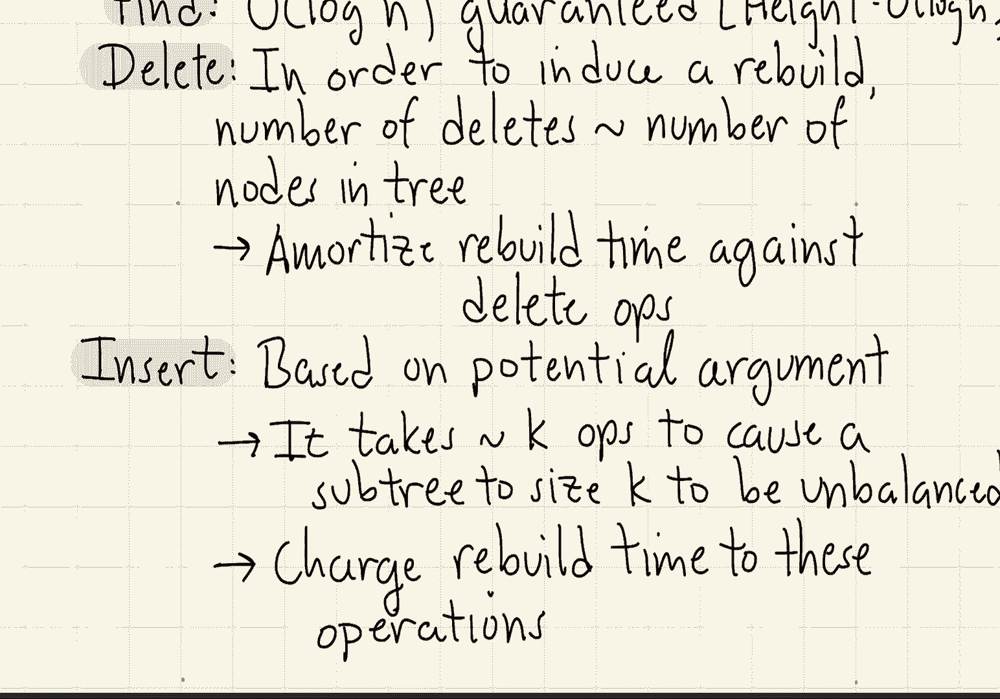
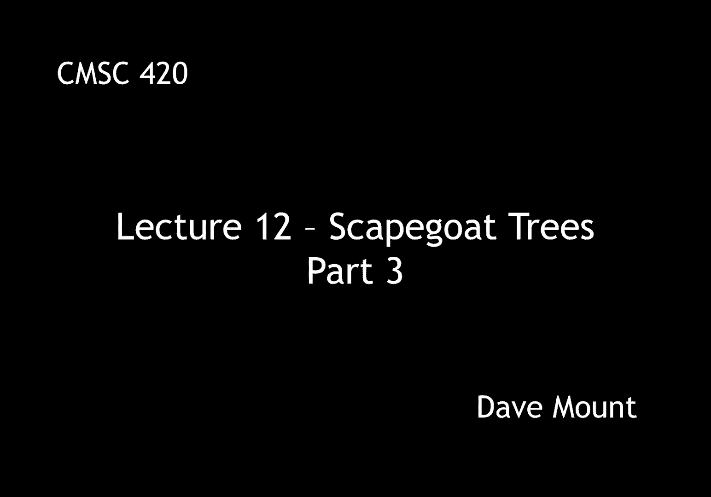

# 【双语字幕+资料下载】马里兰大学 CMSC420 ｜ 数据结构 (2021最新·完整版) - P33：L12- 替罪羊树(Scapegoat Trees) 3 - ShowMeAI - BV1Uh411W7VF

let's now wrap up our discussion of，scapegoat trees by presenting the。

analysis our main theorem says that if，we start from an empty tree and perform。

any sequence of m dictionary operations，don't confuse the m here with the m that。

we used in the analysis or in the in the，actual statement of the algorithm just。

any m dictionary operations on a，scapegoat tree，the total time this is going to take，will be m log m。

in other words the total amount of time，per operation is going to be about log m。

remember that m is the number of，operations um the size of the tree that。

is n can never be bigger than m right，because in the worst case all you're。

doing is insertions i'm not going to，give you the entire proof i'll just give。

a sketch to kind of you know give you a，sense of what's going on here。

well one part is very easy the find，operation takes log n time in fact。

that's true in any case if n is the，number of nodes in the tree right we。

have already showed that the tree height，can never exceed，you know log base 3 halves of n so。

therefore the fine must take log n time，that's actually nice so if you're doing。

nothing but accessing the tree it will，guarantee to be efficient this was not，true for splay trees。

next let's consider the delete operation，so in order to show the amortized cost。

is low what we have to show is that we，in order to perform a rebuild operation。

we have to do a lot of work to get here，well um if you think about the condition。

that we have here and remember the，condition was that the value of m。

has to be greater than 2 times n，okay n being the actual number of nodes，in the tree。

how does this happen，well as you're inserting and inserting，and inserting things your value of m。

gets bigger and bigger okay once you，start deleting things，okay now m is staying the same but n is。

getting smaller and smaller so if you，ever get to a point where m is greater，than two times n。

what that indicates is you must have，essentially deleted half of the keys in，your tree。

okay if you've deleted half of the keys，in the tree that means you had to do o。

of n deletion operations and they were，all cheap right remember your tree。

height is just going to be log of n so，these operations are only taking you log，in time。

now when you perform the rebuild you can，charge the rebuild time against those n。

operations that you've already done，finally let's talk about the insert time。

well the insertion time is a little bit，subtler，the official proof i guess the formal。

proof is based upon a potential argument，but i'll try to give you some intuition。

as to what's going on here，let's look at any subtree of size k。

okay and let's suppose that we have done，enough operations that this subtree。

needs to be rebalanced so suppose we，started with a perfectly balanced。

subtree of size k let's say the result，of the previous rebalancing step。

okay and then we've done a bunch of，insertions to it and those insertions。

have let's say been very very badly，skewed and that's caused the tree to。

become unbalanced well for a sub-tree of，size k how many insertions would you。

have to do to get it to be unbalanced，well if you think about it for a moment。

you can convince yourself that it takes，about o of k operations for this to，happen。

okay so after you've performed ofk，operations you can cause the subtree to。

become unbalanced okay but it takes you，about of k time to rebalance the tree so。

in other words the time you spend，rebalancing can be charged against the。

time you spent inserting the things that，cause the subtree to become imbalanced。

and those you know those operations were，all sort of inexpensive because the tree。

was balanced you know for all of those，all of those cases，so kind of as we've done in previous。

amortized analysis arguments，okay it can be shown that every time you。

do an expensive operation of a rebuild，it's paid for by doing lots of。

inexpensive operations okay so that's。

