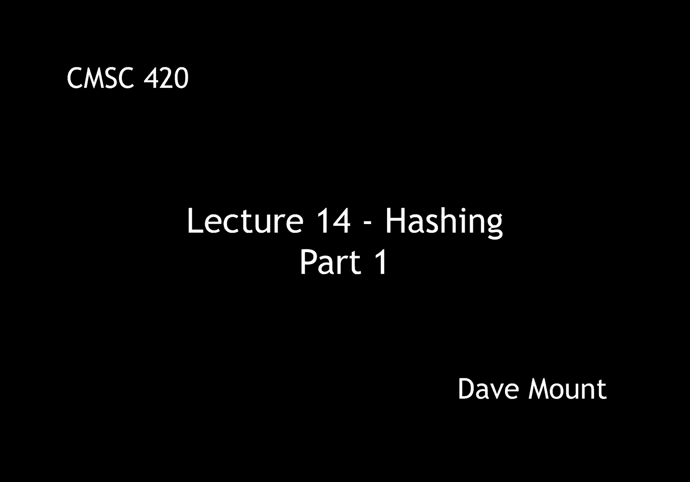
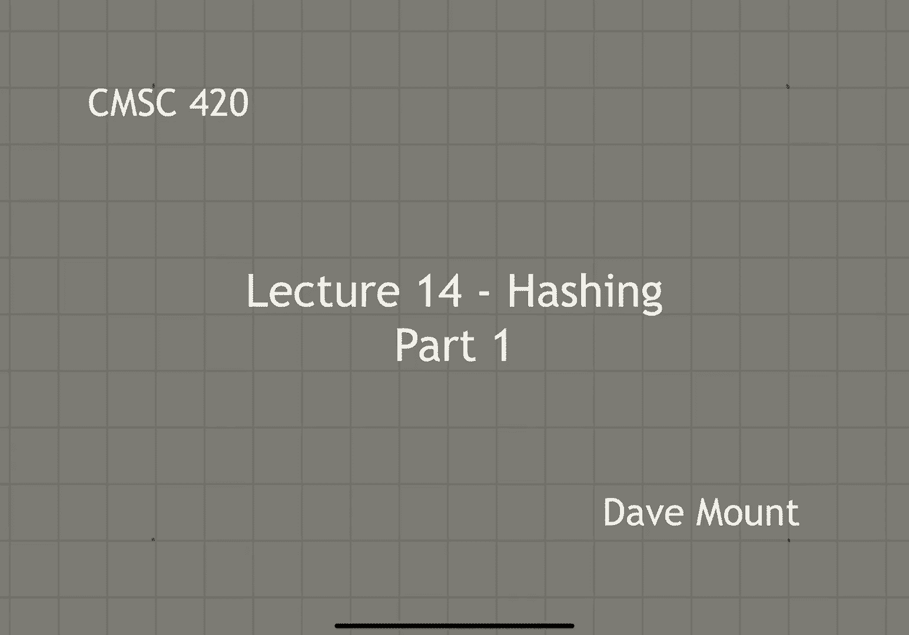
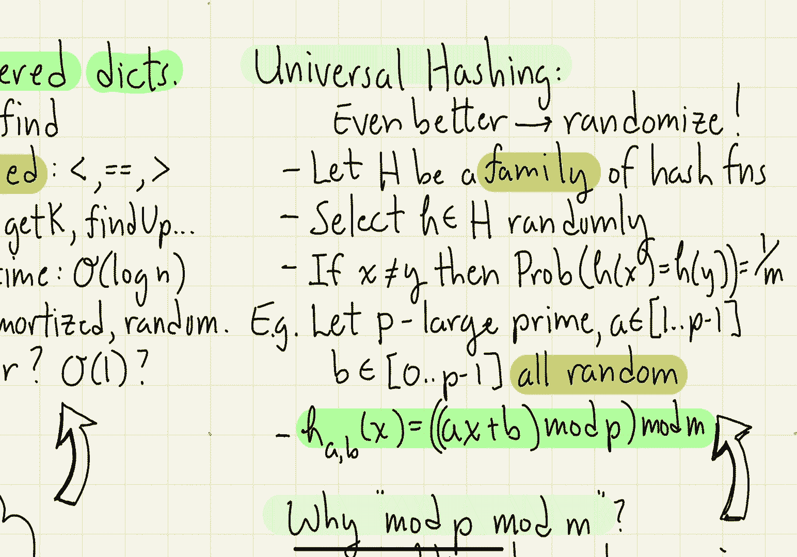

# 【双语字幕+资料下载】马里兰大学 CMSC420 ｜ 数据结构 (2021最新·完整版) - P34：L14- 哈希与散列 1 - ShowMeAI - BV1Uh411W7VF

in this lecture we're going to talk，about a，new data structure for storing。

dictionaries this is called hashing，so let's begin with a little recap of。

what we've done so far this semester，so far we've been studying order。

dictionaries these dictionaries perform，the operations insert delete and find。

so far everything has been based upon，the use of comparisons to decide where。

things go in our dictionary less than，equal and greater than because we've。

been using comparisons it means we can，perform query operations that depend。

upon the order of the keys operations，like get min get max get k。

find up and find down right these all，work because we assume that the keys are。

coming from an ordered dictionary also，in all cases the query and update times。

have been o of log n which we've，measured in various ways worst case。

amortized or randomized in this lecture，we'll consider the question of whether。

we can do better in particular can we do，operations like find insert and delete。

not in logarithmic time but in constant，time，so the method we're going to introduce。

is called hashing，hashing is a data structure that stores，an unordered dictionary in particular。

like a regular dictionary a regular，order dictionary that we've studied it。

stores key value pairs but instead of，using a tree structure it stores it in。

an array and we're going to call this，array table，its indices are going to run from 0。

through m minus 1 for some value of m，hashing is going to have the nice。

feature that it will support all the，basic dictionary operations insert。

delete and find in constant expected，time，note however because this is not an。

ordered dictionary then the，operations that depend upon the，relations between the keys like get min。

and find up etc those are not going to，be efficiently supported in fact if you。

want to implement them with a hash table，it's going to take you brute force time，that is o of n。

hash tables are very important because，they're extremely simple they're very。

practical and they're very widely used，if you do not need to actually be able。

to perform comparisons between the keys，that is if you don't need these order。

dictionary operations then hash tables，are by far the most common way in which。

to um you know to basically to store a，dictionary，these are implemented in the java hash，map。

data structure，so let's give an overview of how hashing，works，first off what's the table size。

if i wanted to store n keys ideally the，table should be a little bit bigger than。

n the reason is because we want to throw，things into this table but if the table。

gets to be too full it's going to be，hard to locate and find space to insert。

new items so an ideal table size is one，that should be a little bit bigger than。

n maybe by a constant factor like 1。25，when we analyze the running time of our，algorithms。

it's going to be based upon a parameter，called the load factor the load factor。

tells us essentially what fraction of，the table we're using right it's defined。

to be n the number of items divided by，the total storage m，and what will happen is we'll see is as。

the value of lambda gets closer and，closer to one the running times are，going to increase。

next we're going to need to define，something called a hash function which。

is going to tell us where the individual，keys are going to be placed so the hash。

function which we're going to denote by，h，is going to map our，universe of possible keys to the。

integers from 0 through m minus 1。we'll see later how this function might。

be defined but it should have two，important properties first it should，scatter the keys in sort of a。

pseudo-random manner around the table，right so it should be very hard to。

predict where a given key is going to be，placed within the table second off our。

hashing scheme is going to have to deal，with collisions a collision occurs。

whenever i have two different keys that，hash to the same location and because of。

course the number of keys could be much，much larger than the。

you know the number of slots that i have，in my table collisions are going to be。

inevitable and so handling them is going，to be very important well what are the。

properties of a good hash function，first it should be efficient to compute。

second it should produce a very small，number of collisions that is if i think。

in a probabilistic sense the probability，of a collision should be small in order。

to achieve these last property，it should be the case that the hash。

function is going to be a function of，every bit in the key right if you ignore。

some portion of the key then two keys，that differ in that one position will of。

course get hashed to the same location，and that's not good the second thing。

that should happen is that it should，break up naturally occurring clusters。

well as an example let's consider a，common use of a hash table。

which is storing the symbol table in a，compiler that is something that stores。

the names of your variables，if i created variables with very similar。

names like temp 1 temp 2 and temp 3，a，kind of naive stupid hash function would。

just put them all consecutive next to，one another which is not good because。

this although it's not a collision would，produce clustering inside of our table a。

good hash function should take these，three values and map them to very very。

different locations almost you know，randomly around my table how do you。

achieve these properties well let's take，a look at a few common examples of hash。

functions the first and kind of almost，too stupid an example of a hash function。

would just be what's called a division，hash you take the key and let's assume。

we can coerce our key from whatever，format it's in into an integer right i。

can just look at the bit representation，and treat that bit representation as if。

it were a binary number a division hash，just takes the，bit representation that we have let's。

call that x and takes it mod m it has to，be mod m right because at the end of the。

day we need to map all of our keys kind，of uniformly into the range from zero。

through m minus one of course the，problem with the division hash is you。

know very similar keys like temp 1 temp，2 temp 3 that are consecutive will wind。

up being consecutive using this function，and that's not a good thing so let's see。

some better ones the next idea is called，a multiplicative hash。

it works by first multiplying the key x，by some very large prime number a。

right so that's going to take similar，values and spread them out by quite a，bit。

and then what i'm going to do to make it，even more random is i'm going to take。

this modulo some very large prime number，p，okay finally i take whatever this huge。

number that i get this huge integer，value，ax mod p and then i take that modulo m。

to bring it back to the table size，multiplicative hashing is much better。

than division hashing because like i，said it spreads values out the final and。

probably most commonly used hash，function is called a linear hash，function and it differs from the。

multiplicative hash in that it just adds，an additional parameter b to the result。

okay so it's a x plus b，take that all mod p and everything mod m。

and here i want to think of a b and p as，being very large prime numbers one of。

the questions raised by the last two，hash functions is the fact that you do。

these two mods mod p followed by mod m，you might say well this seems kind of。

redundant to me but in fact the two mods，have slightly different purposes。

modding by a large prime number，is used to scatter values around in a。

very random way prime numbers are good，to mod by because since they don't have。

common factors i'm not going to expect，it to be the case that two numbers that。

differ by let's say a common factor of p，are going to get hashed to the same，location。

modding by m is going to be，important because of course that's my，table size the issue is that m in。

general is not going to be a prime，number right the size of my hash table。

is just going to be something that my，data structure designer has come up with。

for example it might even be just，something as simple as a power of 2 and。

that certainly is not going to be prime，the last idea i want to talk about is。

the concept of what is called a，universal hashing function and this is。

an extension to the previous ideas that，we've introduced，the idea here is rather than sticking to。

a fixed hash function that you're going，to use for you know all keys for all。

data structures in the future what we're，going to do is we're going to randomize。

the choice of our hash function，in particular let's let capital h be a。

large family of hash functions what i，mean by that is i want to think of h as。

being parameterized that is by setting，certain parameters i can get certain。

hash functions what we're going to do is，every time we need a new hash function。

we're going to generate it randomly from，h the key property of a universal hash。

function is that if i take two distinct，keys x and y and hash them the。

probability that they collide and this，probability is averaged over all the。

choices of h within my class you know，capital h is going to be 1 over m。

notice because i am hashing elements，into the range of size m this is the。

best that you can possibly hope to，achieve well you might wonder do these。

universal hash functions exist and the，answer is yes they do in fact here's a。

very simple way to generate one，first let's let p be some very large。

prime number take a to be a random，number in the range from one to p minus，one。

and take b to be a random number in the，range from zero through p minus one。

p is prime but a and b are just random，then take the linear hash function ax，plus b，mod p。

okay it can be shown that if you make，random choices for a，b and p。

that this function is going to satisfy，the properties of a universal hash，function。

okay that's all for hash functions in，the next segment we're going to talk。

