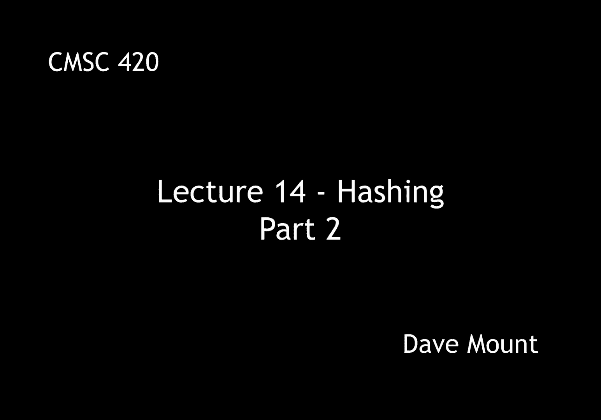
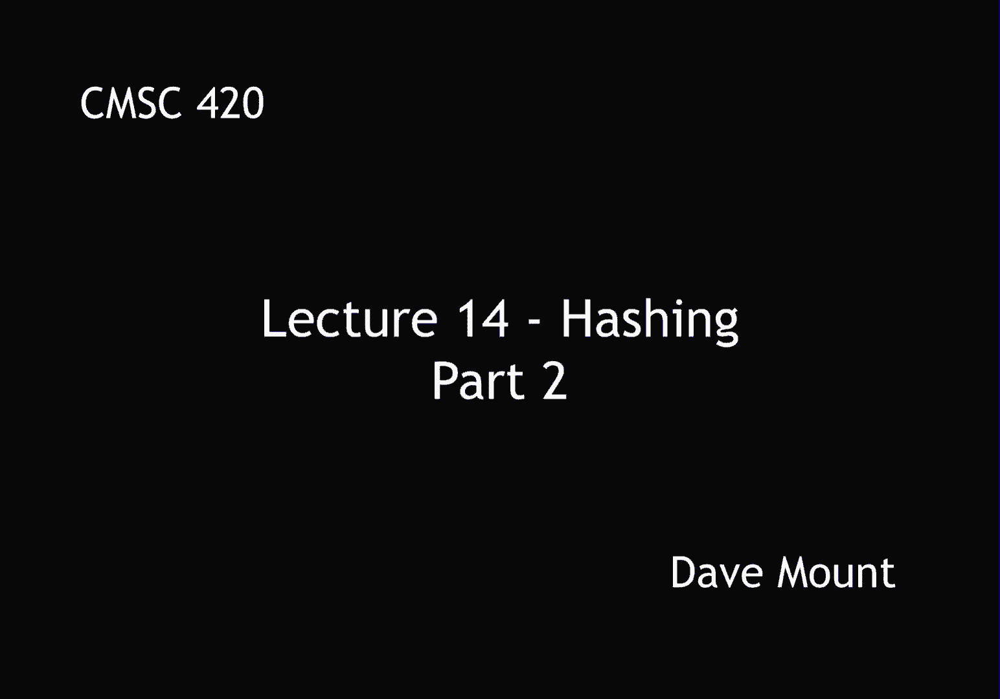
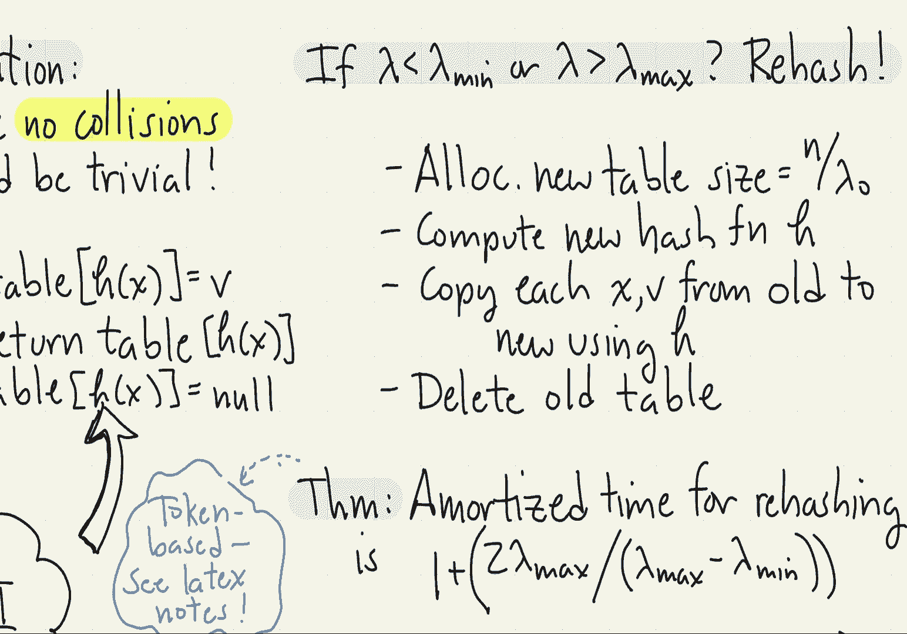

# 【双语字幕+资料下载】马里兰大学 CMSC420 ｜ 数据结构 (2021最新·完整版) - P35：L14- 哈希与散列 2 - ShowMeAI - BV1Uh411W7VF

in this segment we're going to start，talking about how to deal with，collisions with hash functions。

the first observation i want to make is，if there were no collisions hashing。

would be an utterly trivial data，structure to implement to implement an，insert of a。

key and value pair xv all we have to do，is evaluate the hash function that tells。

us where to place the value and then set，the table to the associated value。

to perform a find then we would just，invert the operation we would apply the。

hash function and then return what is，being stored in the table at that，location。

finally if we wanted to do a delete，we would just again invoke the hash。

function find out where the entry is in，the table and then just remove it by。

let's say setting it to null in this，lecture we're going to talk about a。

number of different mechanisms for，resolving collisions，first off we're going to talk about。

something called separate chaining in，which we store the colliding elements，inside of a linked list。

next we're going to store various，methods that are based upon not using an。

additional storage but just storing，everything inside of the hash table。

itself these methods are generally，called open addressing methods and we're。

going to talk about three ideas linear，probing quadratic probing and double。

hashing in general these mechanisms，range from the simplest to the most，complex。

on the other hand they also range from，being the kind of slowest and dumbest to。

being the fastest and most sophisticated，so let's begin our discussion of。

collision resolution methods by talking，about separate chaining in separate。

chaining we assume the table sub i，is going to be the head of a linked list。

of keys all of the keys that hash to，position i in our hash table for example。

suppose i have the following set of keys，and let on the right side here i've。

shown the associated hash values for，these，let me assume that the value m the size。

of my hash table is equal to 8。so if i insert these keys in sequence。

what happens is right d gets hashed to，location 1 so it becomes the first。

element in a linked list at，table sub 1。 next z goes in at position。

4 that is it's the first element in that，linked list，p goes into position 7 w at position 0。

when t comes in it becomes the last，element of that linked list right i just。

keep inserting them at the end of their，current link list and finally when f。

comes in it becomes the last element of，its linked list you might ask why do you。

insert at the end of the linked list and，not at the beginning the reason is。

because you first have to check to see，whether the key is present in the table。

and so to do this i have to go through，the entire linked list to see that it's。

not already there what is the running，time of separate chaining well it turns。

out this is the most efficient of all，the methods we're going to look at in。

order to define the running time though，let us recall the load factor lambda the。

load factor was defined to be the number，of keys that are in the table divided by。

the current table size，that is the actual number of entries in。

my array next a little bit of notation，we're going to distinguish between the。

successful search time that is what，happens if the key is actually in the。

hash table versus an unsuccessful search，time if it's not there so define s of sc。

that is sc for separate chaining to be，the expected search time if x is found。

and we'll define u of s c to be the，expected search time if x is not found。

the main result is that the successful，search time is one plus lambda over two。

and the unsuccessful search time is one，plus lambda we're not going to give the。

proofs of these various hash table and，analyses but this is the one that is。

actually fairly pretty easy to see，observe that if my hash function is。

really random then every node has an，equal probability of being thrown into。

you know any one of the entries of my，hash table and so on average each one of。

these linked lists has a length of n，divided by m that is to say it's lambda。

remember that i usually think of m as，being a small constant fraction bigger。

than n so what that means is the，expected search the expected list size。

is actually smaller than one these lists，are going to be in general um you know。

very short maybe zero one or perhaps two，elements but not much larger than that，you know。

in expectation so for a successful，search，right i have to take at least one。

probe to look at the very first element，of the list and after that if it is in。

the list i expect to have to go through，about half of the list so therefore。

lambda over 2 is going to be the，expected search time，if my search is unsuccessful on the。

other hand well then again i'm going to，have to take at least one operation to。

look at the very first element of that，list even to check that it see that it's，null let's say。

okay and then since this since the，search is unsuccessful i'm going to have。

to go through the entire list so that's，going to take lambda time so this is how。

you get 1 plus lambda over 2 where you，have to go in expectation through half。

the list and one plus a lambda for the，unsuccessful search where you have to go。

through the entire list the next，question i want to consider is how do we。

control the value of lambda as we're，inserting and deleting things from our，list right。

the load factor is going to be going up，and going down we'd like to keep it at a。

certain balanced value but how do we do，this well this is done by an idea called。

rehashing what we do is if the table is，too dense that is at the load factor。

gets to be too high too close to one or，if it's too sparse if the load factor。

gets to be let's say unnaturally low，where i'm only using a very very small。

fraction of my hash table then what i'll，do is i'll reallocate the hash table。

into a new table of the ideal size how，do we implement this well you as the。

designer of the hash table will define，two load factors a minimum load factor。

lambda min and a maximum load factor，lambda max，you don't want to set lambda min too。

small otherwise you're not getting very，good utilization in your table right you。

could have a lot of empty spaces you，don't want to set lambda max too large。

too close to one that is because in that，case what's going to happen is your。

search times are going to start getting，slower and slower，once you have decided on what your。

lambda min and lambda max are you define，your ideal lambda call that lambda 0 to。

be the average of their values lambda，min plus lambda max divided by 2。

finally you let your hash table run and，you keep monitoring the load factor as。

you're doing this right every time you，insert things or delete things you alter。

whatever the value of lambda is which，you can do because you're keeping track。

of you know the number of elements，inside of your dictionary，if you ever notice that lambda is less。

than lambda min or lambda is bigger than，lambda max then you have to perform a。

rehash operation okay so let's see how，rehashing is going to work。

the first thing i'm going to do is i'm，going to allocate a brand new table what。

size should i make the table well notice，the ideal size to make it would be n。

that is the number of keys divided by，lambda 0。 by setting m to this。

particular value the load factor will，turn out to be exactly lambda 0 which is。

the ideal that i want to have next i'm，going to compute a new hash function。

which i need to do right because the，hash function depends upon the value m。

itself finally i'm going to copy each of，the key value pairs from the old hash。

table into the new hash table using this，hash function h，and applying whatever collision。

resolution scheme i happen to choose and，then finally i'm going to delete the old。

hash table this might seem familiar to，you when we talked about amortized you。

know analysis of the expandable stack，and when we did the problem on the。

midterm exam right both of these，problems involved reallocating arrays。

based upon their sizes in particular the，amortized time for rehashing。

that is maintaining a table using this，particular scheme assuming it takes you。

constant time to you know insert and，delete uh you know under normal，circumstances。

is one plus the following quantity two，times lambda max divided by lambda max。

minus lambda min well let's investigate，a couple of the properties of this。

particular function remember lambda max，and lambda min are numbers between 0 and，1。

 so that factor 2 times lambda max is，never going to be very large okay you。

can pretty much set lambda max to a，large value you know assuming that it's，still less than one。

the critical thing though is going to be，the lambda max minus lambda min in the。

denominator if those two numbers get to，be too close to one another what happens。

is you are going to be essentially doing，this rehashing process more and more。

often and hence it's going to be more，expensive so you want to leave a bit of。

a gap between them you know so for，example maybe you want to set lambda max。

to oh maybe three quarters and lambda，min to one quarter or something like。

that that would give you actually a nice，a nice performance，the proof of the amortized analysis。

which i'm not going to give appears in，the latex lecture notes but i'll just。

mention that it's actually a just，standard application of the token based。

methods that we've seen before so if，you've been confused by that method you。

may want to take a look at the lecture，notes to understand how this particular，thing works，okay。

next time i want to talk about the open。

