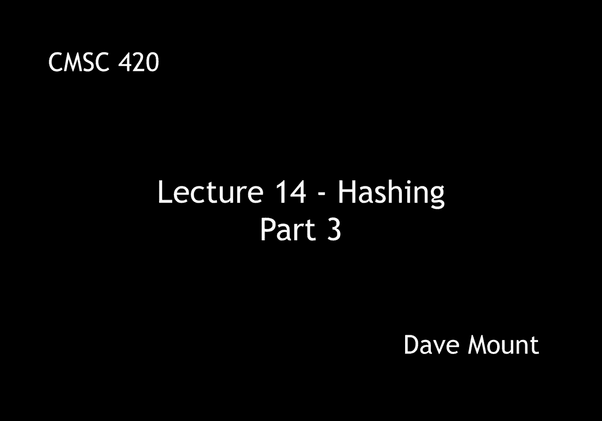
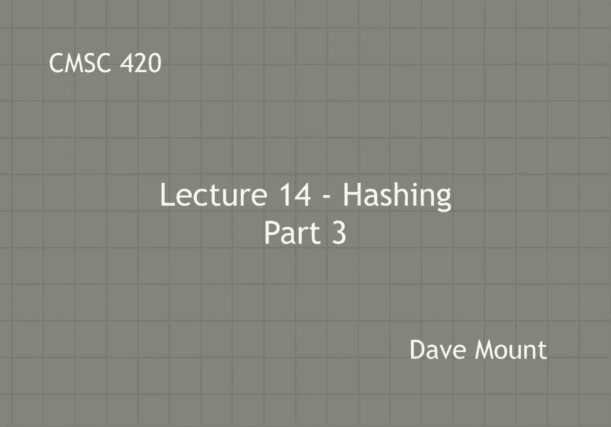
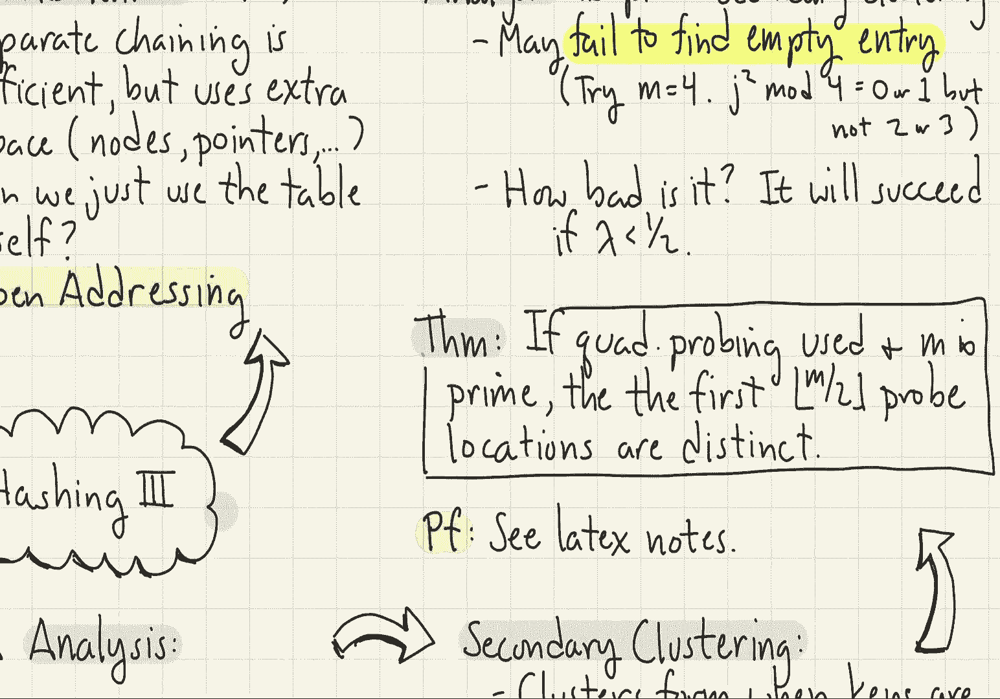

# 【双语字幕+资料下载】马里兰大学 CMSC420 ｜ 数据结构 (2021最新·完整版) - P36：L14- 哈希与散列 3 - ShowMeAI - BV1Uh411W7VF

let's continue our discussion of，collision resolution techniques。

we've already discussed the notion of，separate chaining where you store。

colliding elements inside of a linked，list，this is very efficient but unfortunately。

it uses extra space right we need to，store the extra nodes the extra pointers。

we have to have access to a memory，allocation system and so forth which。

adds a lot of additional complexity，which we would rather avoid，the alternative that i would like to。

consider is can we just store the keys，inside of the table itself without using。

any additional storage，methods that are based upon this idea。

are called open addressing methods let's，give an overview of how open addressing。

methods work first we're going to need，to define a special entry we'll call。

empty or you can think of this sort of，in general as a null value which just。

simply means that this slot in the hash，table is unoccupied of course we're。

going to have to assume that the lambda，value the load factor is going to be。

less than or equal to 1 because，obviously you can't put more，keys into a table of size m than m。

itself，open addressing methods have a general，structure to them they look something，like this。

so first off to insert a key you apply，the hash，function right h of x and that tells you。

where to start the process，okay so you look at table of h of x and。

you check to see if the entry is empty，if it's empty of course fine just store，it there。

if not what happens is you begin a，probing process in which you consider。

the entries h of x plus i sub 1，h of x plus i sub 2，i sub 3 etc etc。

now what are these i sub you know j，values that you're talking about here。

well these values are essentially going，to be computed by whatever open。

addressing scheme you are using and，we'll find that various mechanisms for。

choosing these values result in，different levels of efficiency so the。

sequence i1 i2 i3 is what is called a，probe sequence of course the question is。

what's the best possible probe sequence，that is what probe sequence does the。

best job with respect to avoiding let's，say clustering or avoiding collisions。

and things like this well before we talk，about the best systems let's talk about。

the simplest system the simplest system，is something that is called linear。

probing in linear probing what we do is，we just access consecutive elements，inside the hash table。

so for example we look at h of x then we，look at h of x plus 1 then h of x plus 2。

then h of x plus 3 and so on and so，forth in other words our probe sequence。

is just the linear sequence 1 2 3 4 etc，so looking at this little illustration。

here we see that what we essentially do，is we're just marching down the array。

element by element until we find the，first available spot by the way let me。

mention with all of these open，addressing methods it's possible to walk。

off the end of the list and it's，understood that all of the indexes are。

taken modulo m so you wrap around back，to the beginning again，well this is simple but is it any good。

well to see the issue with linear，probing let me take a simple example。

here suppose i have the keys d z p w and，t，and suppose their hash values are 0 2 2，0 1。

so first we insert d it goes to position，zero，z goes at position two，p comes in。

it collides with z and so it first，checks position two which is occupied。

and so it goes into position three，then we try w w is at position zero it，collides with d。

so it goes to position one and then it，is inserted there now let's take a look。

at t and that's the most interesting，case so at the time the t is inserted we。

have the first you know four elements of，the array are d w z and p，okay，t。

will try to be inserted at location one，but notice that was occupied by w it。

looks at the next position z that's，occupied it looks at the next position p。

that's occupied and finally it goes into，the you know position table sub 4 that。

is the fifth position inside of our，table，okay the reason i want to point this out，is。

t does not actually collide with any of，the other keys and yet it had to do a。

fair amount of jumping around in order，to find a good location for it。

as you can see here this is the，principal shortcoming of linear probing。

although it's fast it has this problem，that the keys tend to form these little。

traffic jams where they all kind of，cluster together in little blocks and。

once you get these blocks forming they，tend to grow and grow because as things。

fall in there they just tend to add more，to this to this cluster the log jam。

so let's present an analysis of the，efficiency of linear probing as before。

we're going to let s and u denote the，running times in expectation of。

successful and unsuccessful searches and，the subscript lp is going to stand for。

linear probing so s of lp is going to be，the expected time for a successful，search。

and u of lp is going to be the expected，time for an unsuccessful search we're。

not going to prove this theorem but the，main result is that the successful。

search time for linear probing is，one-half times the quantity one plus one，over one minus lambda。

okay and the expected time for，unsuccessful search is，well basically the only difference is。

you take that，term in parentheses 1 plus 1 minus，1 over，1 minus lambda and you square that term。

so let's observe what happens as lambda，becomes larger and larger as lambda，approaches one。

right the running time of both the，successful and unsuccessful searches。

because they have this term one minus，lambda in the denominator of that。

fraction they're going to tend to，infinity now of course it really won't，be infinity。

in the worst case your running time is，never going to be bigger than the size。

of your you know list m but the point is，if you think of m as becoming larger and，larger as the。

load factors get closer and closer to，run one the running times essentially。

cannot be bounded but on the other hand，i want you to think about the scenario。

that we described before with，rehashing in rehashing we said we're。

never going to let the lambda value get，to be bigger than lambda max let's。

suppose we set lambda max to well i，don't know three quarters，so one minus lambda is going to be one。

quarter okay one divided by one minus，lambda is going to be 4，so if i look at my successful search。

time that's going to be essentially 5，over 2 that is 1 plus 4 divided by 2。

my unsuccessful search time is going to，be，you know 5 squared that is going to be，25。

one-half that'll be 12。 so the point is，in either case the number of probes that。

you expect to make is going to be a，the issue that makes linear probing bad。

is something that is called secondary，clustering primary clustering well we。

let's assume that we have a good hash，function primary clustering refers to。

the fact that keys might hash to the，same location but if we have a good hash。

function primary clustering should not，happen，secondary clustering is what occurs when。

clusters form due to the kind of poor，performance of our collision resolution。

method and linear probing as we've seen，has this tendency to produce this logjam，effect，which。

let's say is poor from the perspective，of secondary clustering，ideally what we want is our collision。

resolution method to spread things out，as much as possible，this gives rise to our second idea。

called quadratic probing，rather than visiting consecutive entries。

what we're going to do is we're going to，visit entries according to a。

quadratically increasing sequence so we，start at h of x then h of x plus 1 then。

h of x plus 4 then plus 9 plus 16 in，other words h of x plus j squared in。

other words the j step along the way，we're always squaring the distance that，we're looking forward。

as you'll notice from this figure here，the idea is in order to break up these。

logjams we quickly if we see that we're，colliding with elements close to us we。

make the jump sizes larger very quickly，and so this tends to avoid this um you。

know this effect of secondary clustering，that linear probing has。

as i said before of course if you go off，the end of the array then you should。

wrap around back to the beginning，well i'm going to analyze the running。

time of quadratic probing a little bit，later but there's one issue that i want，to mention，first。

although quadratic probing improves the，issues of secondary clustering with。

respect to let's say linear probing，one of the weird issues is it may。

actually fail to find an empty spot in，your hash table even though one exists，as an example of this。

consider a very modest case suppose that，the size of my hash table m is four。

okay and now what happens is i start you，know i probe to some location and then i，start。

accessing entries you know of j squared，modulo four，well one of the interesting things。

you'll observe is you take any square，number modulo 4 and you're going to get。

either the values of 0 or 1。particularly you're never going to get，the values 2 and 3。

 so what that says is，in a rather trivial hash table of size 4。

quadratic probing is just going to jump，back and forth between the two entries。

zero and one it's never going to visit，the other two entries even though they，might be empty。

well this is kind of weird，one might ask the question well how bad。

could this effect be in other words，could it actually be that you know i've。

got a fairly you know empty hash table，and yet i cannot find an empty slot to。

put my you know my key in this would，certainly be a you know。

a bad property to have in your collision，resolution method，well it turns out that it's not going to。

be all that bad in particular，quadratic probing is going to guarantee。

as long as your load factor is less than，one-half，in particular here's the theorem。

suppose you are using quadratic probing，and the size of your table has been。

chosen to be a prime number m，then what will happen is the first。

floor of m over two probe locations made，by quadratic probing are guaranteed to。

be different from one another so in，other words if your load factor is，strictly，less，than one half。

okay，it will be the case that quadratic，probing will find an empty slot if one，exists。

we're not going to prove this theorem um，but the proof is given in the latex。

lecture notes it really boils down to，just a little bit of what i would call，analysis of。

of numbers modulo m okay next time we're，going to give the running time for。

quadratic probing and we're going to，talk about the last open addressing。

method called。

