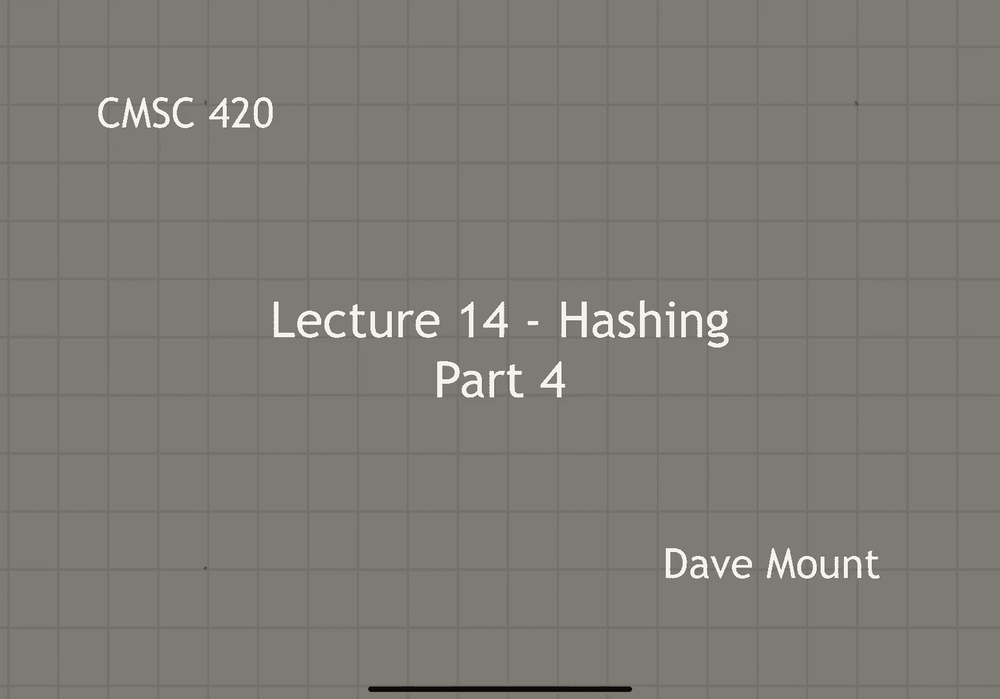
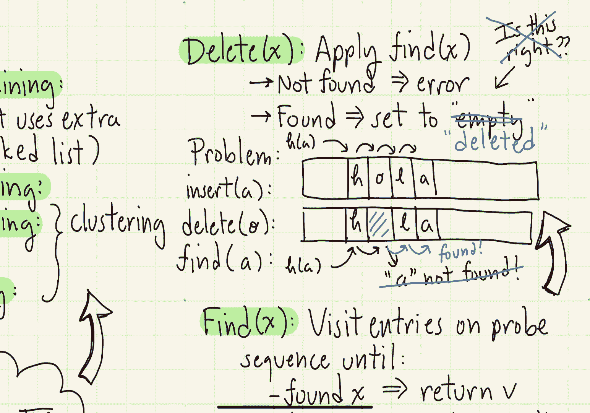
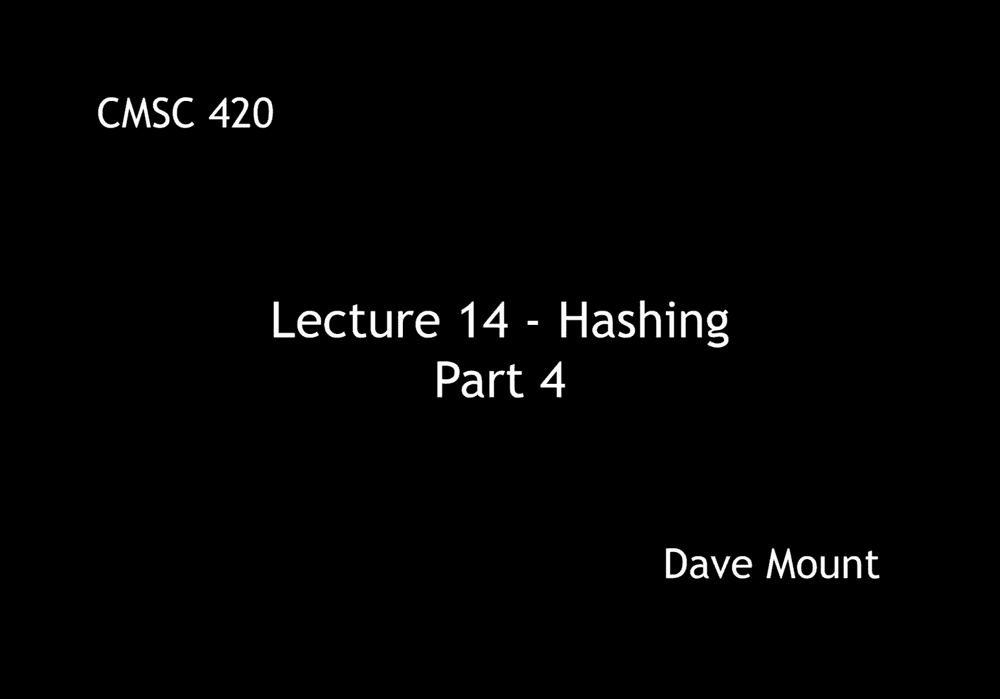

# 【双语字幕+资料下载】马里兰大学 CMSC420 ｜ 数据结构 (2021最新·完整版) - P37：L14- 哈希与散列 4 - ShowMeAI - BV1Uh411W7VF

in this segment we're going to continue，our discussion of hashing by talking，about double hashing。

let's provide a little recap of what，we've seen so far，we've been talking about collision。

resolution methods first we talked about，separate chaining，remember separate chaining stores the。

items that collide in a linked list it's，the fastest of all the methods but it。

requires additional storage for the，linked lists，the alternative to separate chaining is。

called open addressing where keys are，stored just inside of the table。

here we saw two methods the first was，linear probing the second is quadratic，probing。

both methods suffer from clustering，the clustering is more of a problem for。

linear probing but it's really a problem，for both of these methods，the question is is there an open。

addressing method that，doesn't have the clustering issue and，that's what we want to talk about in。

this segment，we're going to introduce the method，called double hashing。

double hashing as we'll see will be the，best of all the open addressing methods。

the probe sequence is determined by a，second hash function which we're going。

to call g so when we apply that 2 with，the key x that'll be g of x。

as usual what happens is we start at h，of x that is the primary hash location。

and then we visit the locations h of x，plus g of x，h of x plus 2 times g of x h of x plus 3。

times g of x in other words we keep，moving forward by a distance of g of x。

where g is our second hash function，applied to x，remember everything is taking modulo m。

so once we fall off the end of the array，we just wrap around back to the，beginning again。

for example in this picture，we start at the location h of x，if that location is let's say filled。

what we do then is we jump g of x，positions forward and look at that。

location if that one's also filled we，again take another g of x positions。

forward etc etc and again wrapping，around the array until we eventually。

come to an empty location why is double，hashing so effective at busting up。

clusters well the key observation is，this suppose you do have a pair of keys。

that collide that is h of x is equal to，h of y，note that because we're applying a。

completely different function it's very，unlikely that g of x will be equal to g。

of y what that implies is that when two，keys collide with one another。

the probe sequences that they use are，going to be entirely different let's say，with high probability。

so let's analyze the running time and，expectation of double hashing。

let's begin with some definitions，as before，s is going to note the。

expected search time for a successful，search that is when in which we find the，key x。

so s of dh will be the expected search，time for double hashing when successful。

u of d h will be the expected run time，of double hashing if the search is。

unsuccessful that is we don't find x，finally recall that our analyses are all。

going to be described in terms of，something called a load factor that is。

lambda which is defined to be the number，of entries that we're actually using。

divided by the total table size that is，it's the density of entries in our table。

the main analysis theorem states that，for double hashing the successful。

expected search time is 1 over lambda，times the natural log of 1 divided by。

the quantity 1 over lambda，the unsuccessful search time is 1，divided by the quantity 1 over lambda。

as with the other hashing methods the，analysis that is the proof of this。

theorem is rather non-trivial and so，we're going to skip it but in order to。

provide an illustration of kind of what，these formulas yield，let's take a look at some examples of。

maybe typical load factors suppose the，load factor is maybe 0。5 one half point。

seven five that is three quarters of the，table is full 0。95，right。

95 percent of the table is filled or，0。99 99 of the table is filled the。

unsuccessful search times and，expectations for these values are，respectively 2 4 20 and 100 and the。

successful search times are 1。39 1。89，3。15 and 4。65，what i want to emphasize here is，that the most。

common，load factors that you usually deal with，are going to be factors let's say around，0。

75 that is three quarters of your，table is full and notice in this case a。

successful search is taking us about two，probes and an unsuccessful search is。

only taking us about four probes，so，hashing using this，double hashing collision resolution。

method is extremely efficient，it even becomes quite efficient as the。

load factor gets to be quite large，notice even for 0。95，where almost all of your table is full，the。

successful search time is only 3。15 well，finally to close up the topic of hashing。

let's talk about how the dictionary，operations are performed let's first。

begin with insert of a key and value xv，well we just apply the probe sequence。

that is we apply h of x and then，run through the successive probes until。

we find the first empty slot and we，insert the value x and v here。

of course notice if we come across the，value x along the way we're going to。

indicate that there's an error that's，been committed right a duplicate key，error。

next let's consider the find operation，again we're going to visit the entries。

along the probe sequence，until one of two things happens either，we encounter the element x and that。

indicates that we have found it in our，dictionary and we return its associated，value v。

or the second possibility is we，encounter an empty cell in our probe in。

our hash table in which case we return，null indicating that the element is not。

here so in this little illustration here，right we hit individual entries until we。

first find an empty entry if we find an，empty entry then we indicate that the。

element is not here of course if we find，the element x then we report that it is。

here finally let's consider delete，well，obviously what we're going to do is。

we're going to apply the find operation，to see if the key is in the table to，locate where it is。

of course if it's not found well that's，an error if it is found well the natural。

thing to do is to set it to empty okay，let me pause here for just a moment and。

ask the question hmm are you sure about，this，well this seems to be the obvious answer。

but it conceals a relatively subtle，problem，to illustrate this problem consider the。

following hash table okay it contains，the entries h o and l and let's suppose。

i'm using linear probing and i insert，the element a and it hashes to the。

location h so i walk down the table，first i hit h then o then l and then i。

find an empty slot and i insert the a at，this point，okay the user comes along and deletes，the key o。

so i hash to find the entry o，and then what i do is i set that slot to，empty。

right that is what we've decided our，delete operation is going to do。

following this the user performs a find，on the element a，what does the find do well。

starts at the hash entry that is the h，then it starts walking down the probe。

sequence until it either finds the a or，it finds an empty slot and whoa it。

notices that it finds the empty slot at，o so it's going to return a is not in。

the list this is obviously wrong，oh dear how do we fix this problem well，the answer is easy。

rather than having a single entry called，empty to indicate when something is not。

in the table we're going to actually，have two entries one is going to be。

called empty which means nothing is here，the other one though is going to be，called deleted。

deleted means that an entry was here but，it has been removed，when the find operation takes place if。

it sees if it comes across an entry，called empty well then it does indeed。

treat that as if nothing is there，however if it comes across an entry。

called deleted it continues the search，so in the case of the search for a right。

when it comes to that entry at o which，we're now going to mark as deleted using。

these little blue lines，it's going to keep the search until it。

makes it down to the end of the list and。

finds the letter a in our table okay，that's everything that i want to say。

