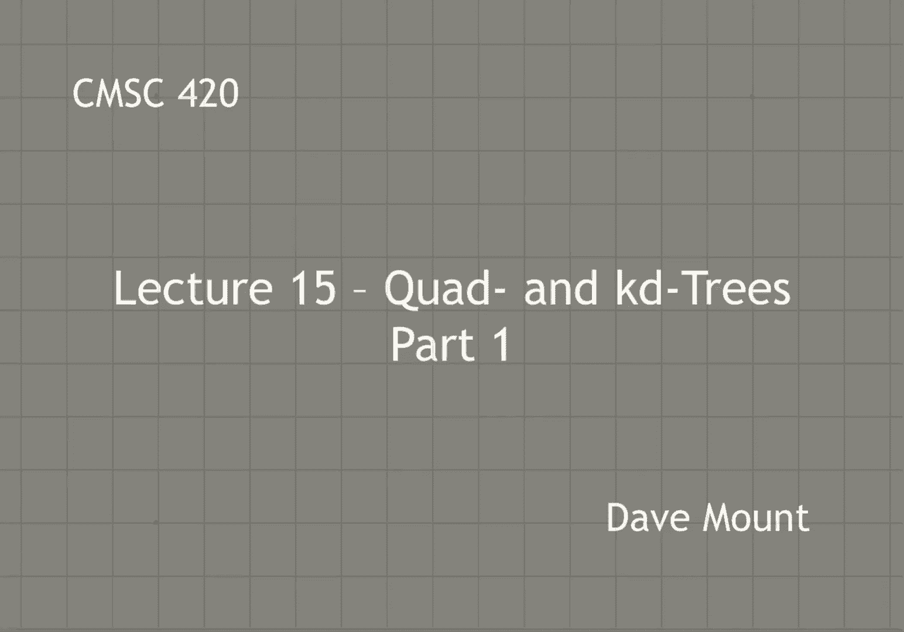
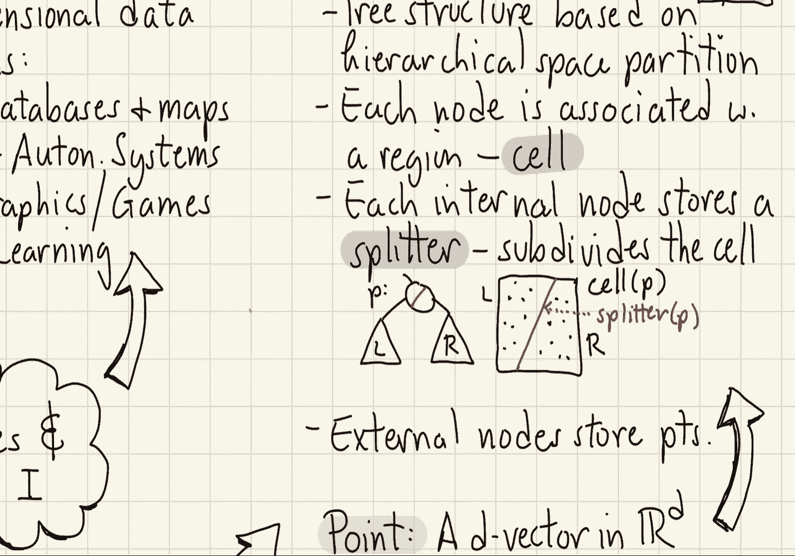
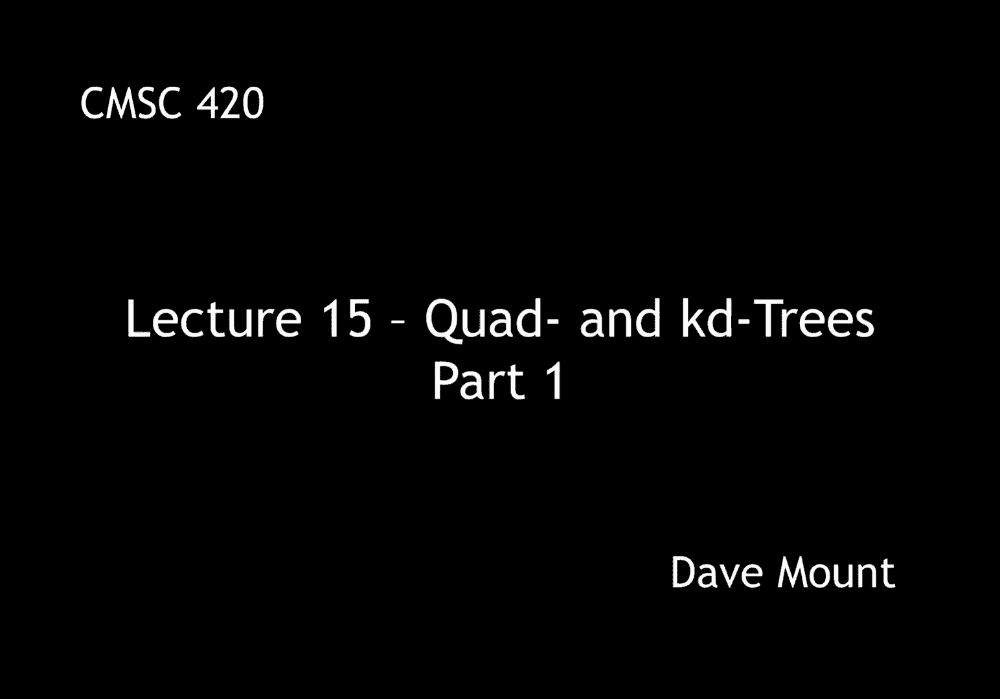

# 【双语字幕+资料下载】马里兰大学 CMSC420 ｜ 数据结构 (2021最新·完整版) - P38：L15- 四叉树与KD树 1 - ShowMeAI - BV1Uh411W7VF

in today's lecture，we're going to go in a very different，direction in particular we're going to。

start talking about geometrical data，structures，so far we have been confining our。

discussion to dictionary data structures，classical dictionary data structures。

involve one-dimensional keys that is，keys over a totally ordered，one-dimensional domain。

however there are a lot of applications，where we would like to store data in a。

multi-dimensional setting that is rather，than having a single scalar key our keys。

are going to be coordinates that is，vectors over multiple dimensions。

there are many applications of geometric，data structures these include spatial。

databases and maps think of google maps，and navigation，robotics and autonomous systems。

where for example you want to，do path planning and things like that，for automated systems。

computer vision computer graphics uh，games，virtual reality systems augmented，reality systems。

finally applications in machine learning，where you're dealing with data sets that。

might be in very high dimensional spaces，there are a number of different，geometric search。

problems that we would like to consider，the first and most basic would be。

something called nearest neighbor，searching here i give you a set of end。

points in space now think of these，rather than points on a line these are。

points in a multi-dimensional space，and i want to store them in a data。

structure so that when i give you a，query point q again another point in。

this multi-dimensional space i can find，the closest point or more generally the。

closest k points to this query point，another example would be range searching。

here i give you a set of endpoints，and i give you a range that is some，region of space。

for example it might be a rectangle it，might be a you know a circular disk or a。

sphere and then i want you to either，count or report the points that lie，within that range。

another example would be point location，here what i give you is a region think。

of this as a map let's say broken up，into countries or states or counties or。

you know whatever and given a query，point i'd like to know which region does。

it lie in you know for example i give，you uh you know the latitude and。

longitude of a point and i want to know，you know in the united states which zip。

code region it lies in for example，a final example would be intersection。

searching in intersection searching what，i do is i have a set of objects as。

opposed to just points and then given a，query region i would like to know which。

objects overlap or intersect that query，region when we learn about。

multi-dimensional data structures a lot，of what we're going to do is going to be。

based upon analogies with，one-dimensional data structures，as we'll see some things generalize。

readily but other things we're going to，have to figure out well different ways。

of solving these problems，among the numerous similarities we're，going to make use of tree structures。

particularly you know binary and，multi-way tree structures，we're going to try to design our trees。

to be balanced that is to have you know，of log n height assuming we're storing n。

and as we've seen in some of our earlier，examples with extended binary trees。

we're going to oftentimes distinguish，between internal nodes that is nodes，that are used to split。

you know the space of points up and，external nodes which is where the data。

there are also going to be a number of，differences though when we deal with，multi-dimensional data。

the first difference is the fact that，there's now there's no longer going to。

be a natural total order that is there's，not going to be a unique way in which to。

sort things from smallest to largest，right if i give you a bunch of points in。

space you could sort them by x you could，sort them by y you could sort them。

radially according to the distance from，the origin you could sort them by angle。

there's not just one unique way in which，to sort all your data。

so this means that we're going to need，to find other ways in which to。

discriminate or separate our data if we，want to index them，another difference that's going to be。

significant is that one of the，fundamental operations we've relied on。

in binary search trees the idea of a，tree rotation that is rotating you know。

a left rotation or right rotation this，may not be meaningful in a。

multi-dimensional setting and we'll see，examples of why this happens to be the。

case you can certainly rotate the tree，the problem is it may not be meaningful。

with respect to the search problem that，we're working with，before we are going to be able to talk。

about geometric data structures we，should begin with some assumptions about。

how it is we're going to represent the，geometric objects that we're going to，need to work with。

so let's describe what these objects are，going to be，to start with we're going to represent。

scalars scalars will just be you know，single one-dimensional real numbers and。

we're going to use these for，representing things like coordinates or，scale factors etc。

these are usually going to be，represented either as floats or as，doubles。

next we're going to have points in，multi-dimensional space，i'm almost going to always use the。

character d，to reference the dimensionality of the，space so d is typically going to be 2 3，4 5。

 of course it could be extremely，high in machine learning could be on the。

order of thousands but for the，applications we're going to be dealing，with。

d is usually going to be a small number，you know let's say on the order of two。

to five or something like that，we're also going to be dealing with。

other kinds of geometric objects and the，plan would be to build these up from。

lower level representations for example，if i wanted to represent something like，a。

line segment i could do that by giving，you two points each of the end points if。

i wanted to represent an axis aligned，rectangle again i could give you two。

points i could give you a lower left，corner and an upper right corner。

if i wanted to represent something like，a circle i could give you a center point。

and then a scalar a positive scalar that，would indicate the radius okay。

of course as we look at different，geometric objects are going to be。

different representations and as we，describe each object we'll be coming up。

and telling you sort of what that，representation is going to be in each。

case so let's talk about how we're going，to represent the most basic object that。

of a point in d-dimensional space so，henceforth i'm going to use this，notation。

you know boldface r super-d to represent，a the possible set of d-dimensional。

vectors each of the coordinates remember，is going to be a real number think of。

that as a float in java，so，a given point will be represented as a。

d-dimensional array uh here i've indexed，it from 1 to d，in java you're usually going to。

represent it indexed from 0 through d，minus 1。i could set this up in java as a class。

my class point is going to store the，following things first an array of。

floating point numbers these will be my，coordinates，next i'm going to have some kind of a。

constructor for my point which will be，given let's say the dimensionality of，the point so it knows。

you know how large an array to allocate，then i'm going to have various accessor。

functions for example i might have a，function get dim that tells me what is。

the dimension of this point which just，returns the length of that vector i。

might have a function like，to retrieve the ith you know coordinate。

of the vector so that might be called，get which is given an integer i and。

returns a float for example，and of course i might have lots of，others you can imagine many other。

primitives that you'd like to construct，for example i'd like to check to see are。

two points equal to one another，i might want to check to see is a point。

um or what is the distance between two，points or you know i might want to。

convert a point to its string，representation given a point in a，rectangle you know is this point。

contained within the rectangle the list，just goes on and on so i'm not going to，list them all here。

next let's talk a little bit about the，kind of data structures we're going to，be working with。

so let's begin with one of the most，fundamental data structures that we're。

going to be dealing with with geometric，objects，that is something called a partition，tree。

a partition tree is a tree structure，based upon a hierarchical decomposition。

of space that is to say what i'm going，to do is i'm going to repeatedly split。

the space down into smaller and smaller，regions using some kind of a。

partitioning element in this little，drawing i've made up here the。

partitioning element is a line and each，line splits base into two halves you can。

think of one half being the left subtree，the other half being the right subtree。

each node of a partition tree is going，to be associated with some region of。

space which i'm going to call a cell，okay so in the example above the cells。

can be thought of as these little，polygons that i've created but it。

depends on the data structure that，you're working with，many times with data structures these。

cells for example might be axis parallel，rectangles each internal node of the。

data structure stores a something called，a splitter and what is a splitter well a。

splitter is a geometric object that is，used to subdivide space，as i said above。

one of the examples would be a splitter，might just be a line in two-dimensional，space。

the points that lie on one side of the，line will be in the left subtree the。

points that lay on the other side of the，line will be in the right subtree。

when i have split space down far enough，that i have just individual points，then。

i'll create an external node in which to，store the point and all the associated。

value along with that point okay so in，this context think of the key as being。

the coordinates of the point and，thinking of the values as being all the。

additional information for example you，know if i wanted to store a point for an。

airport right i might store the airport，code i might store the city of that。

airport i might store all sorts of，information regarding the airport itself，okay。

that's all for this segment in the next。

segment we're going to continue talking。

